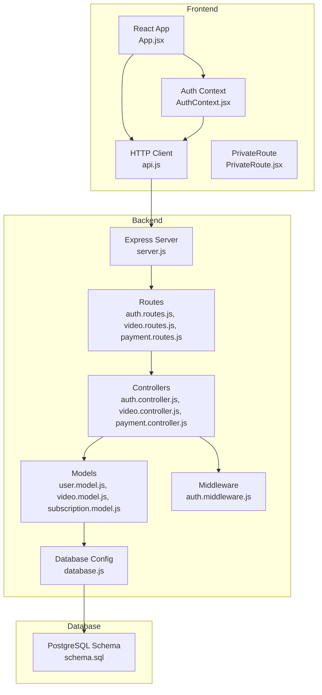
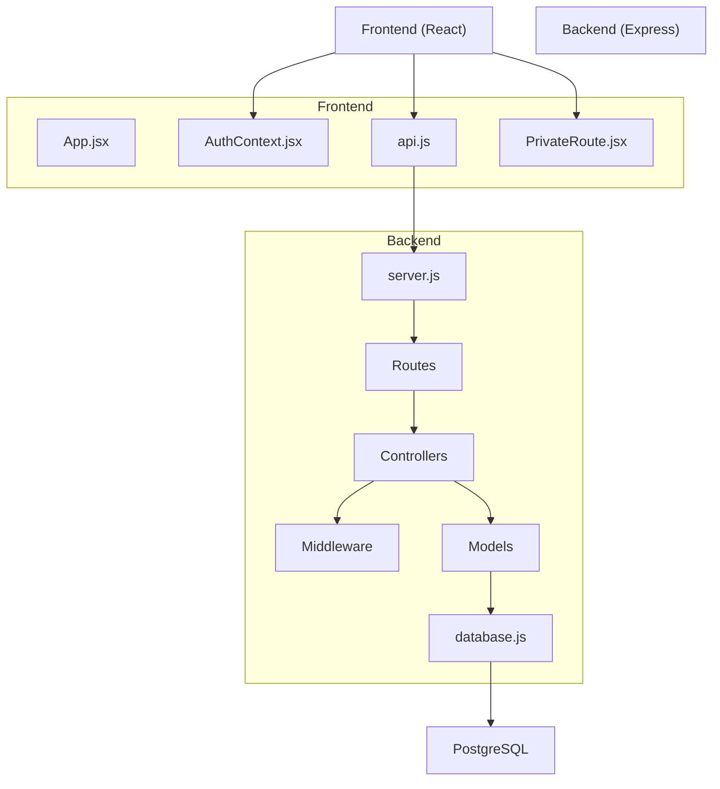
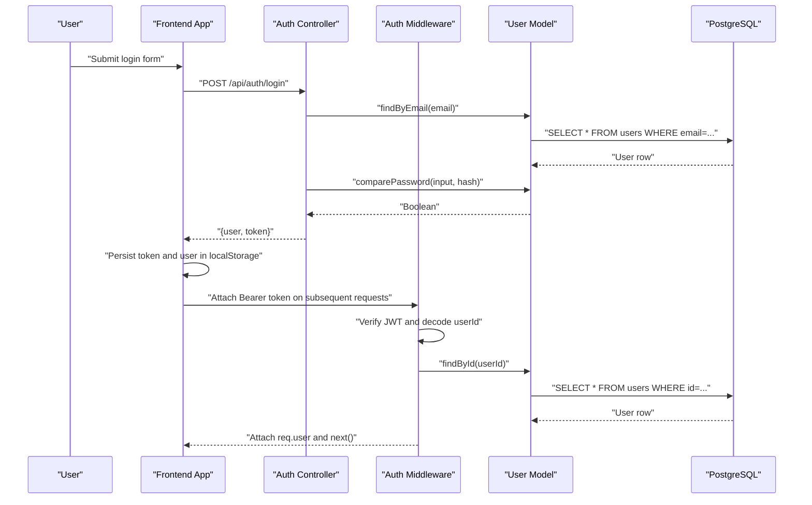
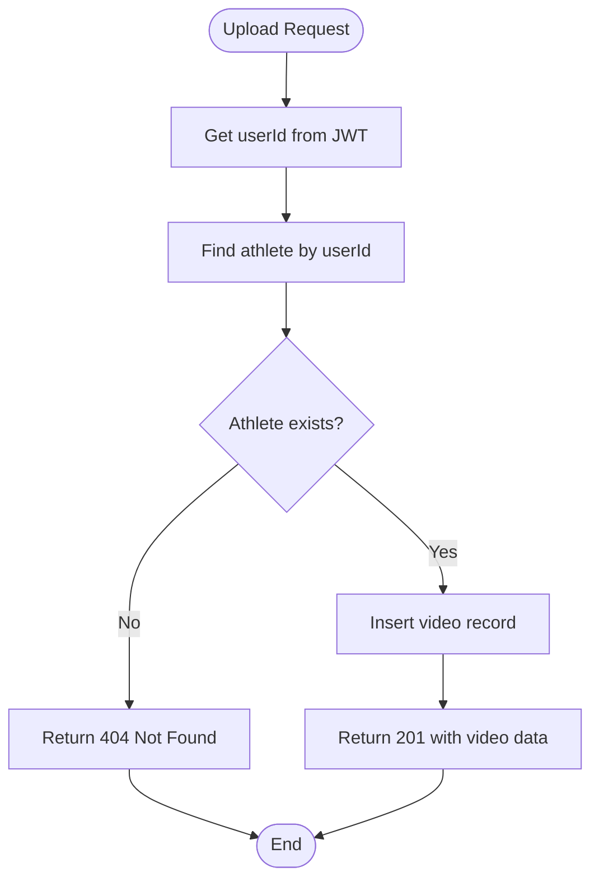
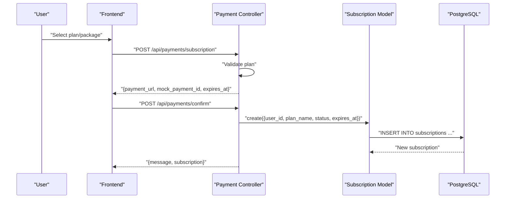
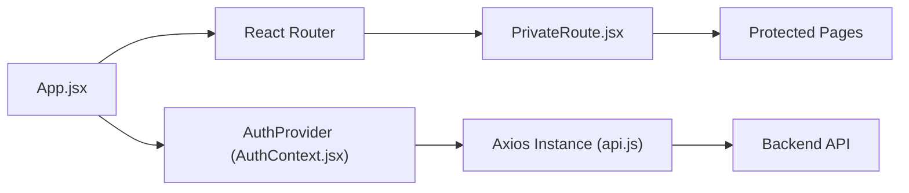
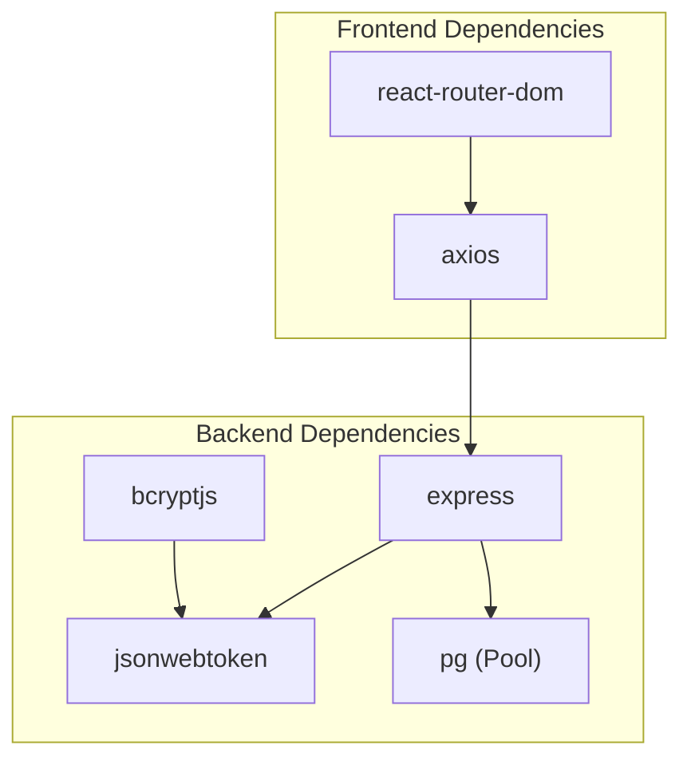

# Architecture Overview

<cite>
**Referenced Files in This Document**
- [server.js](file://backend/server.js)
- [database.js](file://backend/config/database.js)
- [schema.sql](file://database/schema.sql)
- [auth.middleware.js](file://backend/middleware/auth.middleware.js)
- [auth.controller.js](file://backend/controllers/auth.controller.js)
- [user.model.js](file://backend/models/user.model.js)
- [auth.routes.js](file://backend/routes/auth.routes.js)
- [video.controller.js](file://backend/controllers/video.controller.js)
- [video.model.js](file://backend/models/video.model.js)
- [payment.controller.js](file://backend/controllers/payment.controller.js)
- [payment.routes.js](file://backend/routes/payment.routes.js)
- [App.jsx](file://frontend/src/App.jsx)
- [AuthContext.jsx](file://frontend/src/context/AuthContext.jsx)
- [api.js](file://frontend/src/services/api.js)
- [PrivateRoute.jsx](file://frontend/src/components/PrivateRoute.jsx)
</cite>

## Table of Contents
1. [Introduction](#introduction)
2. [Project Structure](#project-structure)
3. [Core Components](#core-components)
4. [Architecture Overview](#architecture-overview)
5. [Detailed Component Analysis](#detailed-component-analysis)
6. [Dependency Analysis](#dependency-analysis)
7. [Performance Considerations](#performance-considerations)
8. [Security and Scalability](#security-and-scalability)
9. [Deployment Topology](#deployment-topology)
10. [Troubleshooting Guide](#troubleshooting-guide)
11. [Conclusion](#conclusion)

## Introduction
This document presents the architecture of Craque-Vision, a platform connecting athletes, scouts, clubs, and administrators. The system follows a clean architecture with MVC separation:
- Backend: Express.js API with route-controller-model layers and middleware for authentication and authorization.
- Frontend: React application with Context API for global state, React Router for navigation, and component-based design.
- Data: PostgreSQL database with normalized tables and indexes for performance.
- Integrations: Cloudinary and MercadoPago are integrated via third-party libraries present in the backend’s dependency graph.

The system enforces JWT-based authentication and role-based access control (RBAC) to secure endpoints and restrict access to roles such as athlete, scout, club, and admin.

## Project Structure
The repository is organized into three primary areas:
- backend: Express server, routes, controllers, models, middleware, and database configuration.
- frontend: React application with pages, components, services, and context.
- database: SQL schema defining entities and indexes.

**Diagram sources**
- [server.js:1-40](file://backend/server.js#L1-L40)
- [auth.routes.js:1-11](file://backend/routes/auth.routes.js#L1-L11)
- [video.controller.js:1-111](file://backend/controllers/video.controller.js#L1-L111)
- [payment.controller.js:1-108](file://backend/controllers/payment.controller.js#L1-L108)
- [auth.middleware.js:1-59](file://backend/middleware/auth.middleware.js#L1-L59)
- [user.model.js:1-42](file://backend/models/user.model.js#L1-L42)
- [video.model.js:1-60](file://backend/models/video.model.js#L1-L60)
- [database.js:1-13](file://backend/config/database.js#L1-L13)
- [schema.sql:1-185](file://database/schema.sql#L1-L185)
- [App.jsx:1-62](file://frontend/src/App.jsx#L1-L62)
- [AuthContext.jsx:1-91](file://frontend/src/context/AuthContext.jsx#L1-L91)
- [api.js:1-36](file://frontend/src/services/api.js#L1-L36)
- [PrivateRoute.jsx:1-27](file://frontend/src/components/PrivateRoute.jsx#L1-L27)

**Section sources**
- [server.js:1-40](file://backend/server.js#L1-L40)
- [schema.sql:1-185](file://database/schema.sql#L1-L185)

## Core Components
- Backend Express server initializes CORS, JSON parsing, and mounts route groups under /api/*.
- Authentication middleware validates JWTs, attaches user context, and supports optional auth.
- Controllers implement business logic for auth, video uploads, and payments.
- Models encapsulate database operations using PostgreSQL connection pool.
- Frontend React app uses Context API for auth state, Axios client for API calls, and PrivateRoute for RBAC.

Key responsibilities:
- Authentication: JWT generation and verification, password hashing, profile retrieval.
- Authorization: Role checks via middleware decorator authorize(...roles).
- Data Access: Parameterized queries, joins, and indexes for performance.
- Frontend State: Centralized auth state persisted in localStorage and injected into HTTP requests.

**Section sources**
- [auth.controller.js:1-72](file://backend/controllers/auth.controller.js#L1-L72)
- [auth.middleware.js:1-59](file://backend/middleware/auth.middleware.js#L1-L59)
- [user.model.js:1-42](file://backend/models/user.model.js#L1-L42)
- [video.controller.js:1-111](file://backend/controllers/video.controller.js#L1-L111)
- [video.model.js:1-60](file://backend/models/video.model.js#L1-L60)
- [payment.controller.js:1-108](file://backend/controllers/payment.controller.js#L1-L108)
- [App.jsx:1-62](file://frontend/src/App.jsx#L1-L62)
- [AuthContext.jsx:1-91](file://frontend/src/context/AuthContext.jsx#L1-L91)
- [api.js:1-36](file://frontend/src/services/api.js#L1-L36)
- [PrivateRoute.jsx:1-27](file://frontend/src/components/PrivateRoute.jsx#L1-L27)

## Architecture Overview
The system adheres to clean architecture with clear separation of concerns:
- Presentation Layer (Frontend): React components and Context manage UI state and routing.
- Application Layer (Backend): Routes define endpoints; controllers orchestrate use cases.
- Domain Layer (Backend): Models encapsulate domain logic and data access.
- Infrastructure (Backend): Database configuration and PostgreSQL driver.

**Diagram sources**
- [App.jsx:1-62](file://frontend/src/App.jsx#L1-L62)
- [AuthContext.jsx:1-91](file://frontend/src/context/AuthContext.jsx#L1-L91)
- [api.js:1-36](file://frontend/src/services/api.js#L1-L36)
- [PrivateRoute.jsx:1-27](file://frontend/src/components/PrivateRoute.jsx#L1-L27)
- [server.js:1-40](file://backend/server.js#L1-L40)
- [auth.routes.js:1-11](file://backend/routes/auth.routes.js#L1-L11)
- [video.controller.js:1-111](file://backend/controllers/video.controller.js#L1-L111)
- [auth.middleware.js:1-59](file://backend/middleware/auth.middleware.js#L1-L59)
- [user.model.js:1-42](file://backend/models/user.model.js#L1-L42)
- [database.js:1-13](file://backend/config/database.js#L1-L13)
- [schema.sql:1-185](file://database/schema.sql#L1-L185)

## Detailed Component Analysis

### Authentication and Authorization Flow
The authentication flow uses JWT tokens and role-based access control:
- Clients send credentials to the auth endpoint; the backend verifies and returns a signed token.
- Subsequent requests attach the token in the Authorization header.
- Middleware validates the token, decodes user identity, and enforces role-based restrictions.

**Diagram sources**
- [auth.controller.js:30-59](file://backend/controllers/auth.controller.js#L30-L59)
- [auth.middleware.js:4-33](file://backend/middleware/auth.middleware.js#L4-L33)
- [user.model.js:20-38](file://backend/models/user.model.js#L20-L38)
- [auth.routes.js:6-8](file://backend/routes/auth.routes.js#L6-L8)
- [api.js:10-21](file://frontend/src/services/api.js#L10-L21)
- [AuthContext.jsx:21-38](file://frontend/src/context/AuthContext.jsx#L21-L38)

**Section sources**
- [auth.controller.js:1-72](file://backend/controllers/auth.controller.js#L1-L72)
- [auth.middleware.js:1-59](file://backend/middleware/auth.middleware.js#L1-L59)
- [user.model.js:1-42](file://backend/models/user.model.js#L1-L42)
- [auth.routes.js:1-11](file://backend/routes/auth.routes.js#L1-L11)
- [api.js:1-36](file://frontend/src/services/api.js#L1-L36)
- [AuthContext.jsx:1-91](file://frontend/src/context/AuthContext.jsx#L1-L91)

### Video Upload and Management
The video module enables athletes to upload videos, retrieve their own videos, fetch featured content, and delete owned videos. It enforces ownership checks and integrates with likes counting.

**Diagram sources**
- [video.controller.js:5-32](file://backend/controllers/video.controller.js#L5-L32)
- [video.model.js:4-16](file://backend/models/video.model.js#L4-L16)

**Section sources**
- [video.controller.js:1-111](file://backend/controllers/video.controller.js#L1-L111)
- [video.model.js:1-60](file://backend/models/video.model.js#L1-L60)

### Payment Flow (Mock Integration)
Payments support video packages and subscription plans. The backend exposes endpoints to list offerings and initiate payments, returning mock payment identifiers and URLs. Confirmation persists subscription records when applicable.

**Diagram sources**
- [payment.controller.js:53-107](file://backend/controllers/payment.controller.js#L53-L107)
- [payment.routes.js:8-10](file://backend/routes/payment.routes.js#L8-L10)
- [subscription.model.js](file://backend/models/subscription.model.js)

**Section sources**
- [payment.controller.js:1-108](file://backend/controllers/payment.controller.js#L1-L108)
- [payment.routes.js:1-12](file://backend/routes/payment.routes.js#L1-L12)

### Frontend Architecture
The frontend uses React with:
- Context API for centralized authentication state and persistence.
- React Router for declarative routing and protected routes.
- Axios interceptors to inject Authorization headers and handle 401 responses.

**Diagram sources**
- [App.jsx:17-58](file://frontend/src/App.jsx#L17-L58)
- [AuthContext.jsx:6-79](file://frontend/src/context/AuthContext.jsx#L6-L79)
- [api.js:3-36](file://frontend/src/services/api.js#L3-L36)
- [PrivateRoute.jsx:4-24](file://frontend/src/components/PrivateRoute.jsx#L4-L24)

**Section sources**
- [App.jsx:1-62](file://frontend/src/App.jsx#L1-L62)
- [AuthContext.jsx:1-91](file://frontend/src/context/AuthContext.jsx#L1-L91)
- [api.js:1-36](file://frontend/src/services/api.js#L1-L36)
- [PrivateRoute.jsx:1-27](file://frontend/src/components/PrivateRoute.jsx#L1-L27)

## Dependency Analysis
- Backend depends on Express for routing, jsonwebtoken for JWT, bcryptjs for password hashing, and pg Pool for database connectivity.
- Frontend depends on axios for HTTP requests and react-router-dom for routing.
- Database schema defines foreign keys and indexes to maintain referential integrity and optimize queries.

**Diagram sources**
- [server.js:1-40](file://backend/server.js#L1-L40)
- [auth.middleware.js:1-59](file://backend/middleware/auth.middleware.js#L1-L59)
- [user.model.js:1-42](file://backend/models/user.model.js#L1-L42)
- [api.js:1-36](file://frontend/src/services/api.js#L1-L36)
- [App.jsx:1-62](file://frontend/src/App.jsx#L1-L62)

**Section sources**
- [server.js:1-40](file://backend/server.js#L1-L40)
- [schema.sql:1-185](file://database/schema.sql#L1-L185)

## Performance Considerations
- Database indexes: Composite indexes on frequently filtered columns (users by type, athletes by sport/category/state/position, videos by status, favorites and likes combinations) improve query performance.
- Triggers: update_updated_at triggers reduce duplication and keep audit fields consistent.
- Parameterized queries: Models consistently use parameterized statements to prevent SQL injection and aid query plan caching.
- Pagination and limits: Controllers accept query parameters (e.g., limit) to constrain result sets for featured content.

Recommendations:
- Add connection pooling tuning and query timeout settings in production.
- Monitor slow queries using EXPLAIN/ANALYZE and adjust indexes accordingly.
- Consider read replicas for heavy read workloads (e.g., featured videos).

**Section sources**
- [schema.sql:140-180](file://database/schema.sql#L140-L180)
- [video.controller.js:80-88](file://backend/controllers/video.controller.js#L80-L88)
- [video.model.js:40-51](file://backend/models/video.model.js#L40-L51)

## Security and Scalability
Security:
- JWT-based sessionless authentication with expiration.
- Password hashing using bcrypt.
- Role-based access control enforced by middleware authorize(...roles).
- Optional auth middleware allows guest access for public endpoints.
- Axios interceptor automatically attaches Authorization header and handles 401 by redirecting to login.

Scalability:
- Horizontal scaling: Stateless backend allows load balancing across instances.
- Database: Use connection pooling and consider read replicas for analytics-heavy queries.
- CDN: Offload media assets to Cloudinary via the cloudinary library dependency.
- Payment processing: Integrate MercadoPago SDK for production payments.

External Services:
- Cloudinary: Present in backend dependencies for media storage and transformations.
- MercadoPago: Present in backend dependencies for payment processing.

**Section sources**
- [auth.middleware.js:35-42](file://backend/middleware/auth.middleware.js#L35-L42)
- [api.js:10-33](file://frontend/src/services/api.js#L10-L33)
- [AuthContext.jsx:21-38](file://frontend/src/context/AuthContext.jsx#L21-L38)
- [server.js:1-40](file://backend/server.js#L1-L40)

## Deployment Topology
Recommended deployment layout:
- Frontend: Static hosting (e.g., Vercel, Netlify) or SSR/SSG build served behind CDN.
- Backend: Express server containerized (Docker) behind a reverse proxy/load balancer.
- Database: Managed PostgreSQL instance (e.g., AWS RDS, Supabase, Render) with backups and read replicas.
- Secrets: Environment variables for JWT secret, database credentials, Cloudinary, and MercadoPago keys.
- Networking: Allowlist inbound traffic to backend and database; enforce HTTPS and TLS termination at the edge.

[No sources needed since this section provides general guidance]

## Troubleshooting Guide
Common issues and resolutions:
- 401 Unauthorized on protected routes:
  - Verify token presence in localStorage and Authorization header injection.
  - Confirm token validity and expiration; refresh or re-authenticate.
- Token expired or invalid:
  - Middleware returns explicit errors for expired or malformed tokens.
- Access denied (403):
  - Ensure user role matches allowedTypes in PrivateRoute.
- Database connectivity:
  - Check DB_HOST, DB_PORT, DB_NAME, DB_USER, DB_PASSWORD.
- Payment confirmation:
  - Ensure payment_id, type, and plan_name match backend expectations.

**Section sources**
- [api.js:23-33](file://frontend/src/services/api.js#L23-L33)
- [auth.middleware.js:24-32](file://backend/middleware/auth.middleware.js#L24-L32)
- [PrivateRoute.jsx:15-21](file://frontend/src/components/PrivateRoute.jsx#L15-L21)
- [database.js:4-10](file://backend/config/database.js#L4-L10)
- [payment.controller.js:79-107](file://backend/controllers/payment.controller.js#L79-L107)

## Conclusion
Craque-Vision employs a clean, layered architecture with clear boundaries between presentation, application, domain, and infrastructure. JWT-based authentication and RBAC ensure secure access, while PostgreSQL schema and indexes support scalable data operations. The frontend leverages React patterns for state and routing, integrating seamlessly with the backend API. With proper environment configuration, CDN integration for media, and production-grade database and load-balancing, the system is well-positioned for growth and reliability.