# Backend Architecture

<cite>
**Referenced Files in This Document**
- [server.js](file://backend/server.js)
- [database.js](file://backend/config/database.js)
- [auth.middleware.js](file://backend/middleware/auth.middleware.js)
- [subscription.middleware.js](file://backend/middleware/subscription.middleware.js)
- [auth.controller.js](file://backend/controllers/auth.controller.js)
- [athlete.controller.js](file://backend/controllers/athlete.controller.js)
- [video.controller.js](file://backend/controllers/video.controller.js)
- [like.controller.js](file://backend/controllers/like.controller.js)
- [user.model.js](file://backend/models/user.model.js)
- [athlete.model.js](file://backend/models/athlete.model.js)
- [video.model.js](file://backend/models/video.model.js)
- [like.model.js](file://backend/models/like.model.js)
- [subscription.model.js](file://backend/models/subscription.model.js)
- [auth.routes.js](file://backend/routes/auth.routes.js)
- [athlete.routes.js](file://backend/routes/athlete.routes.js)
- [video.routes.js](file://backend/routes/video.routes.js)
- [scheduler.js](file://backend/scheduler.js)
- [package.json](file://backend/package.json)
</cite>

## Update Summary
**Changes Made**
- Added documentation for the new subscription middleware system
- Documented the scheduler system for automatic subscription expiration management
- Updated middleware architecture to include subscription access control
- Enhanced authentication middleware integration with subscription requirements
- Added subscription model capabilities and business logic

## Table of Contents
1. [Introduction](#introduction)
2. [Project Structure](#project-structure)
3. [Core Components](#core-components)
4. [Architecture Overview](#architecture-overview)
5. [Detailed Component Analysis](#detailed-component-analysis)
6. [Subscription Management System](#subscription-management-system)
7. [Dependency Analysis](#dependency-analysis)
8. [Performance Considerations](#performance-considerations)
9. [Troubleshooting Guide](#troubleshooting-guide)
10. [Conclusion](#conclusion)

## Introduction
This document describes the backend architecture of Craque-Vision's Express.js API. It explains how the application implements the Model-View-Controller (MVC) pattern, organizes routes and controllers, and manages middleware for authentication, authorization, and subscription access control. It also documents the data access layer using PostgreSQL connection pooling, the request processing pipeline, error handling strategies, and RESTful API design principles including HTTP status codes and response formatting.

## Project Structure
The backend follows a layered architecture with enhanced subscription management:
- Entry point initializes Express, loads environment variables, enables CORS, parses JSON, mounts routes, starts the scheduler, and starts the server.
- Routes define API endpoints grouped by feature with subscription middleware integration.
- Controllers handle request logic, coordinate with models, and format responses.
- Models encapsulate database operations using a shared PostgreSQL connection pool, including subscription management.
- Middleware enforces authentication, authorization, and subscription access control policies.
- Environment configuration is loaded via dotenv.
- Scheduler system automatically manages subscription expiration and renewal processes.

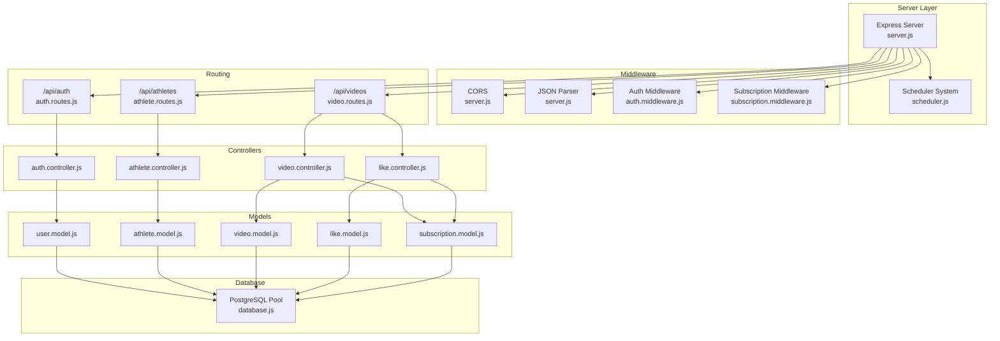

**Diagram sources**
- [server.js:1-66](file://backend/server.js#L1-L66)
- [scheduler.js:1-26](file://backend/scheduler.js#L1-L26)
- [auth.routes.js:1-11](file://backend/routes/auth.routes.js#L1-L11)
- [athlete.routes.js:1-14](file://backend/routes/athlete.routes.js#L1-L14)
- [video.routes.js:1-23](file://backend/routes/video.routes.js#L1-L23)
- [auth.controller.js:1-72](file://backend/controllers/auth.controller.js#L1-L72)
- [athlete.controller.js:1-91](file://backend/controllers/athlete.controller.js#L1-L91)
- [video.controller.js:1-111](file://backend/controllers/video.controller.js#L1-L111)
- [like.controller.js:1-75](file://backend/controllers/like.controller.js#L1-L75)
- [user.model.js:1-42](file://backend/models/user.model.js#L1-L42)
- [athlete.model.js:1-124](file://backend/models/athlete.model.js#L1-L124)
- [video.model.js:1-78](file://backend/models/video.model.js#L1-L78)
- [like.model.js:1-61](file://backend/models/like.model.js#L1-L61)
- [subscription.model.js:1-155](file://backend/models/subscription.model.js#L1-L155)
- [database.js:1-13](file://backend/config/database.js#L1-L13)

**Section sources**
- [server.js:1-66](file://backend/server.js#L1-L66)
- [package.json:1-25](file://backend/package.json#L1-L25)

## Core Components
- Express server initialization and middleware stack with scheduler integration
- Route registration for feature areas with subscription middleware
- Authentication, authorization, and subscription access control middleware
- Controller functions implementing CRUD and business logic with subscription enforcement
- Data access models using PostgreSQL connection pooling including subscription management
- Environment-driven configuration and automated scheduler startup
- Subscription lifecycle management with automatic expiration handling

Key implementation highlights:
- Centralized CORS and JSON parsing middleware at the server level.
- Modular route files per domain feature with subscription middleware integration.
- JWT-based authentication middleware validating tokens and attaching user context.
- Role-based authorization enforcing allowed user types.
- Subscription-based access control for different user types (athletes, scouts, clubs).
- Optional authentication allowing anonymous access when applicable.
- Models encapsulating SQL queries with parameterized statements including subscription operations.
- Controllers returning structured JSON responses with appropriate HTTP status codes.
- Automated scheduler for subscription expiration management.
- Comprehensive subscription status tracking and validation.

**Section sources**
- [server.js:16-20](file://backend/server.js#L16-L20)
- [auth.middleware.js:1-59](file://backend/middleware/auth.middleware.js#L1-L59)
- [subscription.middleware.js:1-82](file://backend/middleware/subscription.middleware.js#L1-L82)
- [auth.controller.js:1-72](file://backend/controllers/auth.controller.js#L1-L72)
- [athlete.controller.js:1-91](file://backend/controllers/athlete.controller.js#L1-L91)
- [video.controller.js:1-111](file://backend/controllers/video.controller.js#L1-L111)
- [like.controller.js:1-75](file://backend/controllers/like.controller.js#L1-L75)
- [user.model.js:1-42](file://backend/models/user.model.js#L1-L42)
- [athlete.model.js:1-124](file://backend/models/athlete.model.js#L1-L124)
- [video.model.js:1-78](file://backend/models/video.model.js#L1-L78)
- [like.model.js:1-61](file://backend/models/like.model.js#L1-L61)
- [subscription.model.js:1-155](file://backend/models/subscription.model.js#L1-L155)

## Architecture Overview
The system adheres to MVC principles with enhanced subscription management:
- Routes define endpoints and bind them to controller actions with subscription middleware.
- Controllers orchestrate request handling, enforce authorization and subscription policies, and call models.
- Models abstract database interactions using a shared connection pool including subscription operations.
- Middleware runs before controllers to handle cross-origin requests, JSON parsing, authentication, and subscription access control.
- Scheduler system automatically manages subscription expiration and renewal processes.

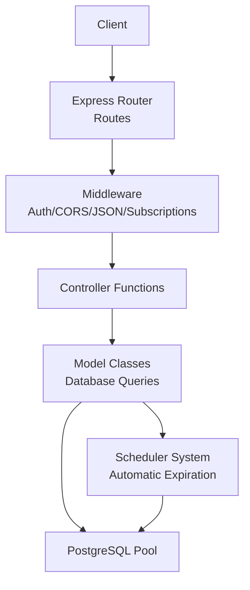

**Diagram sources**
- [server.js:16-20](file://backend/server.js#L16-L20)
- [auth.routes.js:1-11](file://backend/routes/auth.routes.js#L1-L11)
- [athlete.routes.js:1-14](file://backend/routes/athlete.routes.js#L1-L14)
- [video.routes.js:1-23](file://backend/routes/video.routes.js#L1-L23)
- [auth.middleware.js:1-59](file://backend/middleware/auth.middleware.js#L1-L59)
- [subscription.middleware.js:1-82](file://backend/middleware/subscription.middleware.js#L1-L82)
- [auth.controller.js:1-72](file://backend/controllers/auth.controller.js#L1-L72)
- [athlete.controller.js:1-91](file://backend/controllers/athlete.controller.js#L1-L91)
- [video.controller.js:1-111](file://backend/controllers/video.controller.js#L1-L111)
- [like.controller.js:1-75](file://backend/controllers/like.controller.js#L1-L75)
- [user.model.js:1-42](file://backend/models/user.model.js#L1-L42)
- [athlete.model.js:1-124](file://backend/models/athlete.model.js#L1-L124)
- [video.model.js:1-78](file://backend/models/video.model.js#L1-L78)
- [like.model.js:1-61](file://backend/models/like.model.js#L1-L61)
- [subscription.model.js:1-155](file://backend/models/subscription.model.js#L1-L155)
- [database.js:1-13](file://backend/config/database.js#L1-L13)
- [scheduler.js:1-26](file://backend/scheduler.js#L1-L26)

## Detailed Component Analysis

### Authentication Middleware
The authentication middleware validates bearer tokens, attaches user identity to the request, and supports role-based authorization and optional authentication.

**Diagram sources**
- [auth.middleware.js:4-33](file://backend/middleware/auth.middleware.js#L4-L33)

**Section sources**
- [auth.middleware.js:1-59](file://backend/middleware/auth.middleware.js#L1-L59)

### Subscription Middleware
The subscription middleware enforces access control based on user roles and subscription status. It provides granular access control for different user types with specific requirements.

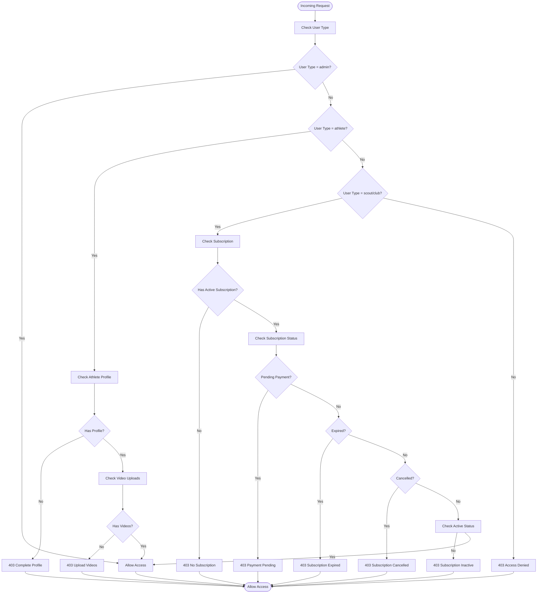

**Diagram sources**
- [subscription.middleware.js:5-81](file://backend/middleware/subscription.middleware.js#L5-L81)

**Section sources**
- [subscription.middleware.js:1-82](file://backend/middleware/subscription.middleware.js#L1-L82)

### Authentication Controller
Handles user registration, login, and profile retrieval. Uses JWT for sessionless authentication and returns standardized responses.

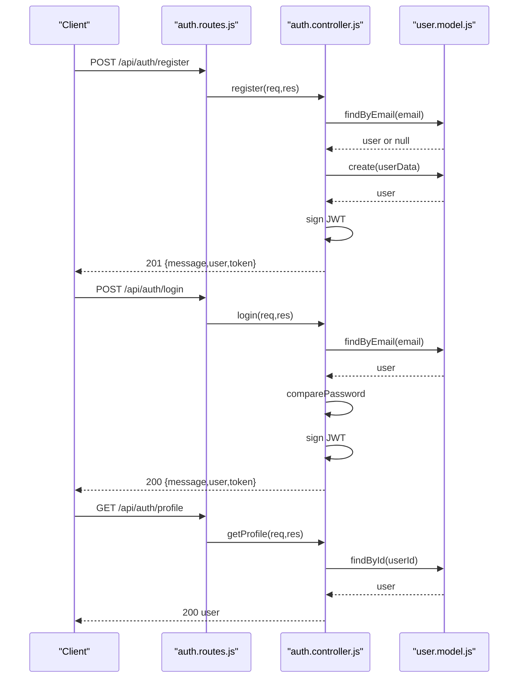

**Diagram sources**
- [auth.routes.js:6-8](file://backend/routes/auth.routes.js#L6-L8)
- [auth.controller.js:8-71](file://backend/controllers/auth.controller.js#L8-L71)
- [user.model.js:4-38](file://backend/models/user.model.js#L4-L38)

**Section sources**
- [auth.controller.js:1-72](file://backend/controllers/auth.controller.js#L1-L72)
- [auth.routes.js:1-11](file://backend/routes/auth.routes.js#L1-L11)
- [user.model.js:1-42](file://backend/models/user.model.js#L1-L42)

### Athlete Controller
Manages athlete profiles, search, and listing. Enforces athlete role for profile operations.

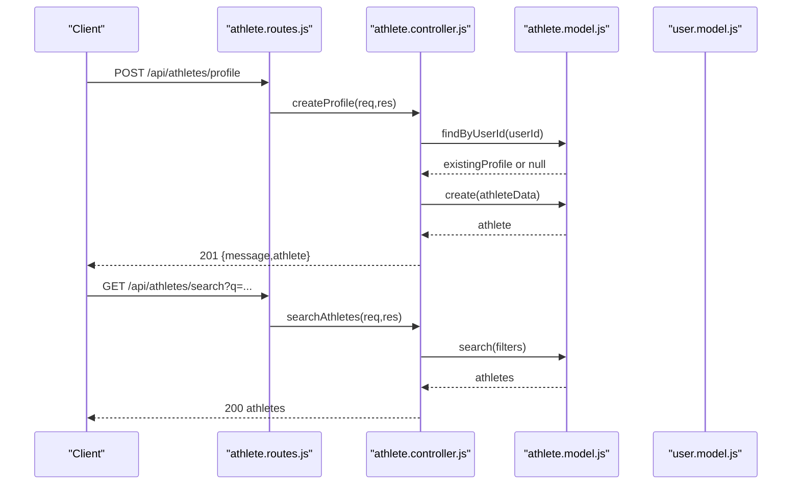

**Diagram sources**
- [athlete.routes.js:6-11](file://backend/routes/athlete.routes.js#L6-L11)
- [athlete.controller.js:4-90](file://backend/controllers/athlete.controller.js#L4-L90)
- [athlete.model.js:34-86](file://backend/models/athlete.model.js#L34-L86)

**Section sources**
- [athlete.controller.js:1-91](file://backend/controllers/athlete.controller.js#L1-L91)
- [athlete.routes.js:1-14](file://backend/routes/athlete.routes.js#L1-L14)
- [athlete.model.js:1-124](file://backend/models/athlete.model.js#L1-L124)

### Video Controller
Handles video upload, retrieval, featured listing, and deletion. Integrates with likes and athlete context. Now includes subscription access control.

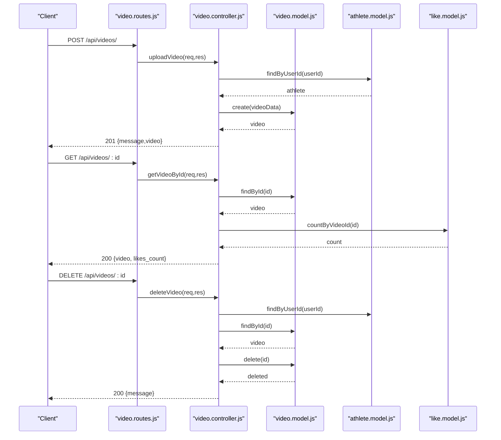

**Diagram sources**
- [video.routes.js:9-15](file://backend/routes/video.routes.js#L9-L15)
- [video.controller.js:5-110](file://backend/controllers/video.controller.js#L5-L110)
- [video.model.js:4-57](file://backend/models/video.model.js#L4-L57)
- [like.model.js:39-47](file://backend/models/like.model.js#L39-L47)

**Section sources**
- [video.controller.js:1-111](file://backend/controllers/video.controller.js#L1-L111)
- [video.routes.js:1-23](file://backend/routes/video.routes.js#L1-L23)
- [video.model.js:1-78](file://backend/models/video.model.js#L1-L78)
- [like.model.js:1-61](file://backend/models/like.model.js#L1-L61)

### Like Controller
Enforces subscription checks for liking videos and manages like/unlike operations.

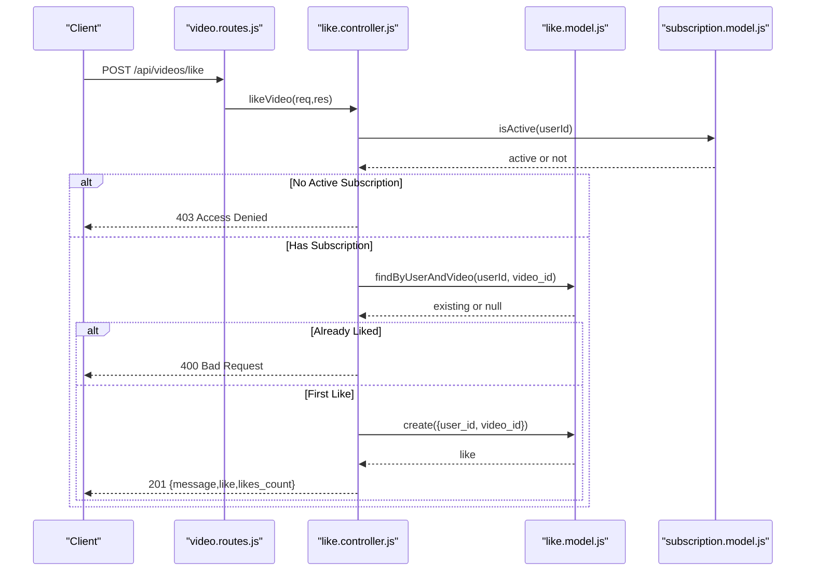

**Diagram sources**
- [video.routes.js:17-19](file://backend/routes/video.routes.js#L17-L19)
- [like.controller.js:4-30](file://backend/controllers/like.controller.js#L4-L30)
- [like.model.js:4-16](file://backend/models/like.model.js#L4-L16)

**Section sources**
- [like.controller.js:1-75](file://backend/controllers/like.controller.js#L1-L75)
- [video.routes.js:17-19](file://backend/routes/video.routes.js#L17-L19)

### Database Connection Pooling and Transactions
- A single PostgreSQL connection pool is configured and exported for use by all models.
- Models execute parameterized queries to prevent SQL injection.
- There is no explicit transaction management in the provided code; models execute individual statements.
- Subscription model includes comprehensive subscription lifecycle management.

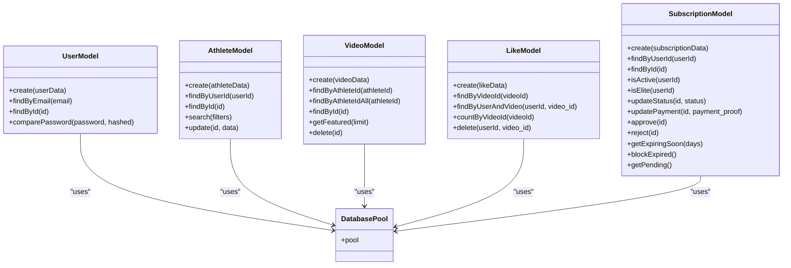

**Diagram sources**
- [database.js:4-10](file://backend/config/database.js#L4-L10)
- [user.model.js:1-42](file://backend/models/user.model.js#L1-L42)
- [athlete.model.js:1-124](file://backend/models/athlete.model.js#L1-L124)
- [video.model.js:1-78](file://backend/models/video.model.js#L1-L78)
- [like.model.js:1-61](file://backend/models/like.model.js#L1-L61)
- [subscription.model.js:1-155](file://backend/models/subscription.model.js#L1-L155)

**Section sources**
- [database.js:1-13](file://backend/config/database.js#L1-L13)
- [user.model.js:1-42](file://backend/models/user.model.js#L1-L42)
- [athlete.model.js:1-124](file://backend/models/athlete.model.js#L1-L124)
- [video.model.js:1-78](file://backend/models/video.model.js#L1-L78)
- [like.model.js:1-61](file://backend/models/like.model.js#L1-L61)
- [subscription.model.js:1-155](file://backend/models/subscription.model.js#L1-L155)

## Subscription Management System

### Scheduler System for Subscription Expiration
The scheduler system automatically manages subscription expiration and renewal processes, ensuring system integrity and compliance.

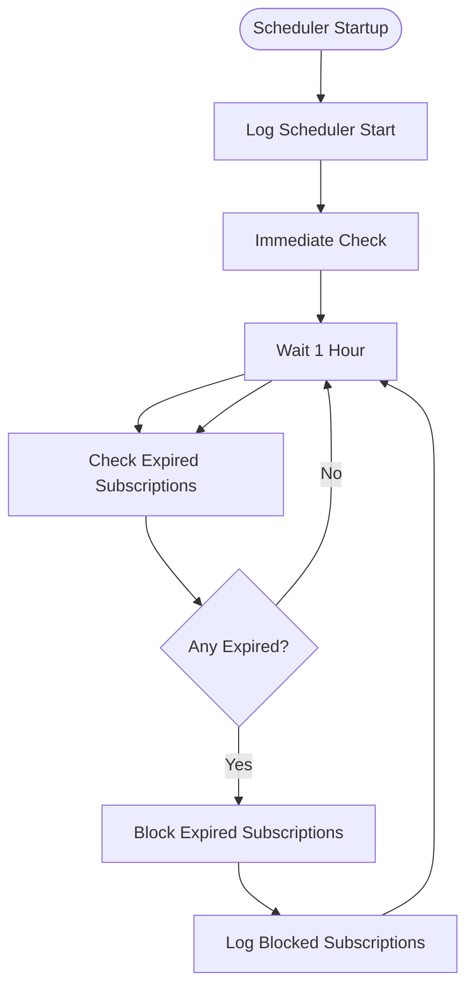

**Diagram sources**
- [scheduler.js:3-23](file://backend/scheduler.js#L3-L23)

### Subscription Lifecycle Management
The subscription system manages the complete lifecycle from creation to expiration, including payment processing and renewal.

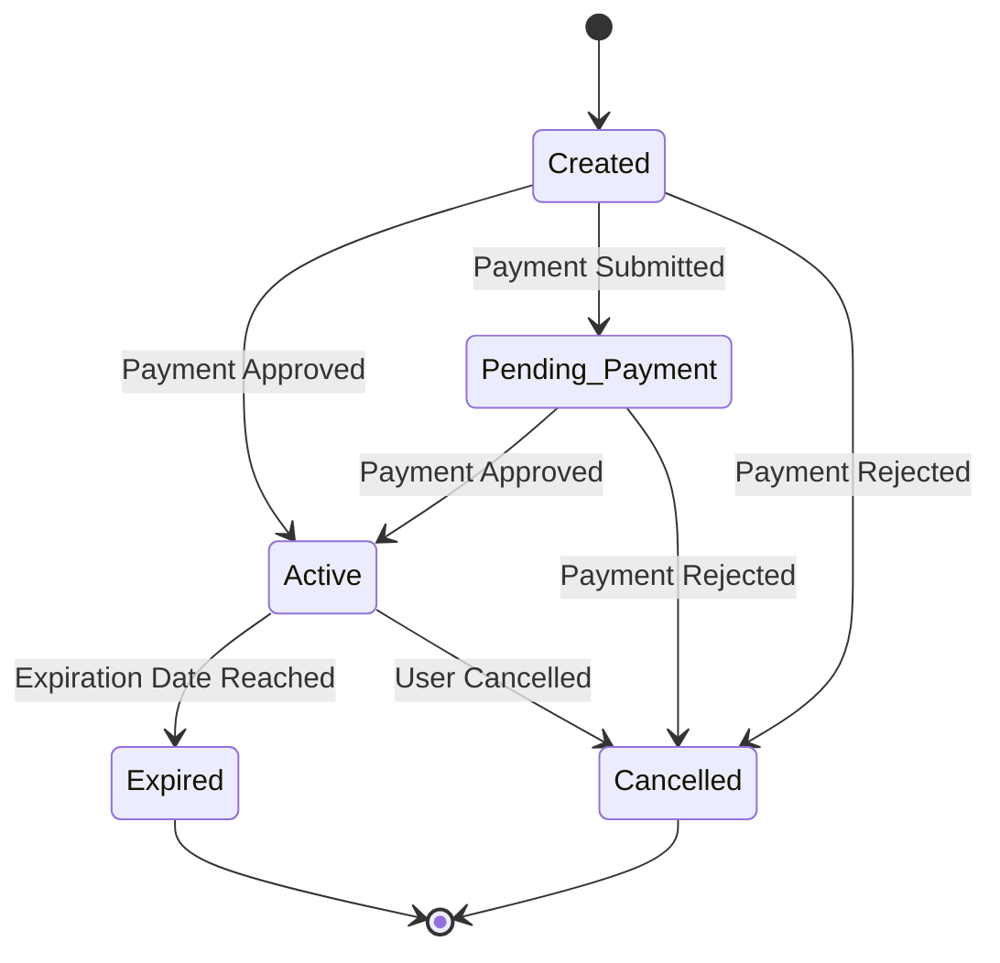

**Diagram sources**
- [subscription.model.js:89-109](file://backend/models/subscription.model.js#L89-L109)
- [subscription.model.js:127-137](file://backend/models/subscription.model.js#L127-L137)

**Section sources**
- [scheduler.js:1-26](file://backend/scheduler.js#L1-L26)
- [subscription.middleware.js:1-82](file://backend/middleware/subscription.middleware.js#L1-L82)
- [subscription.model.js:1-155](file://backend/models/subscription.model.js#L1-L155)

## Dependency Analysis
- Express server depends on dotenv for environment variables, cors for cross-origin support, registers multiple route modules, and starts the scheduler.
- Controllers depend on models for data access, on JWT for token handling, and on subscription middleware for access control.
- Models depend on the PostgreSQL pool for database operations including subscription management.
- Routes depend on controllers, authentication middleware, and subscription middleware for request handling.
- Scheduler system depends on subscription models for expiration checking and blocking.

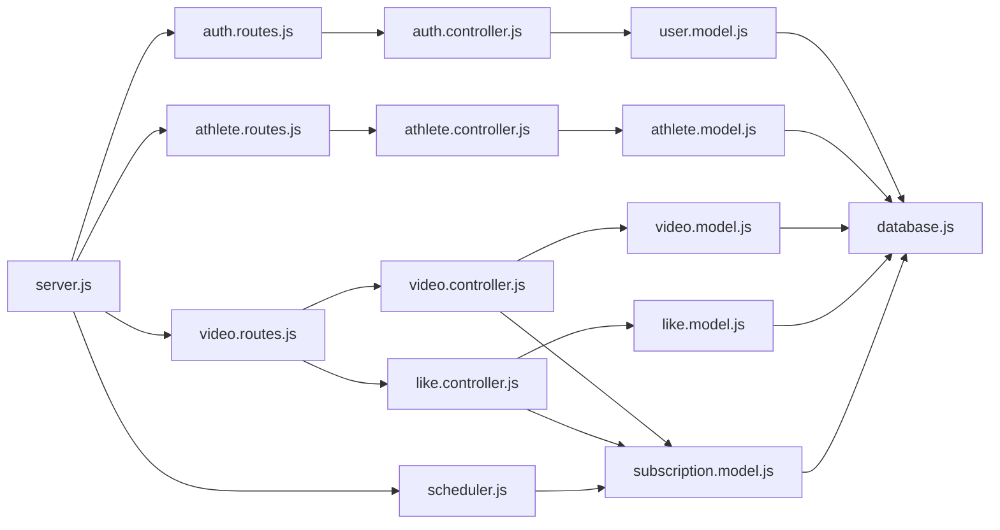

**Diagram sources**
- [server.js:16-20](file://backend/server.js#L16-L20)
- [auth.routes.js:1-11](file://backend/routes/auth.routes.js#L1-L11)
- [athlete.routes.js:1-14](file://backend/routes/athlete.routes.js#L1-L14)
- [video.routes.js:1-23](file://backend/routes/video.routes.js#L1-L23)
- [auth.controller.js:1-72](file://backend/controllers/auth.controller.js#L1-L72)
- [athlete.controller.js:1-91](file://backend/controllers/athlete.controller.js#L1-L91)
- [video.controller.js:1-111](file://backend/controllers/video.controller.js#L1-L111)
- [like.controller.js:1-75](file://backend/controllers/like.controller.js#L1-L75)
- [user.model.js:1-42](file://backend/models/user.model.js#L1-L42)
- [athlete.model.js:1-124](file://backend/models/athlete.model.js#L1-L124)
- [video.model.js:1-78](file://backend/models/video.model.js#L1-L78)
- [like.model.js:1-61](file://backend/models/like.model.js#L1-L61)
- [subscription.model.js:1-155](file://backend/models/subscription.model.js#L1-L155)
- [database.js:1-13](file://backend/config/database.js#L1-L13)
- [scheduler.js:1-26](file://backend/scheduler.js#L1-L26)

**Section sources**
- [server.js:1-66](file://backend/server.js#L1-L66)
- [package.json:10-20](file://backend/package.json#L10-L20)

## Performance Considerations
- Connection pooling: A single pool is configured centrally; ensure proper tuning of pool size and timeouts for production workloads.
- Parameterized queries: All models use parameterized statements, reducing overhead and preventing SQL injection.
- Indexing: Consider adding database indexes on frequently filtered columns (e.g., athletes sport, category, state, position; videos athlete_id; likes user_id/video_id; subscriptions user_id, status, expires_at).
- Pagination: The featured videos endpoint accepts a limit; consider pagination for large lists.
- Caching: Introduce caching for read-heavy endpoints (e.g., featured videos, athlete profiles) to reduce database load.
- Transaction boundaries: If future features require atomicity across multiple writes, wrap related operations in explicit transactions.
- Scheduler optimization: The hourly scheduler runs efficiently with minimal overhead, focusing only on expired subscription checking.
- Subscription validation: Efficient subscription status checks prevent unnecessary database queries for authenticated users.

## Troubleshooting Guide
Common issues and resolutions:
- Authentication failures:
  - Missing or malformed Bearer token results in 401.
  - Expired or invalid tokens yield specific error messages.
  - Users not found after successful token verification receive 401.
- Authorization failures:
  - Requests requiring specific user types return 403 when unauthorized.
  - Optional authentication allows proceeding without enforced user context.
- Subscription access failures:
  - Athletes without completed profiles receive 403 with code "NO_PROFILE".
  - Athletes without uploaded videos receive 403 with code "NO_VIDEOS".
  - Scouts/Clubs without active subscriptions receive 403 with code "NO_SUBSCRIPTION".
  - Pending payment subscriptions receive 403 with code "PAYMENT_PENDING".
  - Expired subscriptions receive 403 with code "SUBSCRIPTION_EXPIRED".
  - Cancelled subscriptions receive 403 with code "SUBSCRIPTION_CANCELLED".
- Resource not found:
  - Attempts to access non-existent athletes, videos, or users return 404.
- Business rule violations:
  - Duplicate profiles, already-liked videos, or missing subscriptions return 400/403.
- Internal errors:
  - Unhandled exceptions return 500 with error messages.
- Scheduler issues:
  - Subscription expiration not processed: Check scheduler logs for errors.
  - Database connectivity issues during expiration: Verify connection pool configuration.

**Section sources**
- [auth.middleware.js:4-33](file://backend/middleware/auth.middleware.js#L4-L33)
- [subscription.middleware.js:16-72](file://backend/middleware/subscription.middleware.js#L16-L72)
- [auth.controller.js:13-26](file://backend/controllers/auth.controller.js#L13-L26)
- [athlete.controller.js:9-21](file://backend/controllers/athlete.controller.js#L9-L21)
- [video.controller.js:10-106](file://backend/controllers/video.controller.js#L10-L106)
- [like.controller.js:10-29](file://backend/controllers/like.controller.js#L10-L29)
- [scheduler.js:13-15](file://backend/scheduler.js#L13-L15)

## Conclusion
Craque-Vision's backend implements a clean, modular Express architecture with clear separation of concerns and enhanced subscription management capabilities. The MVC pattern is evident across routes, controllers, and models, while middleware ensures consistent authentication, authorization, and subscription access control policies. The PostgreSQL connection pool centralizes database access, and parameterized queries mitigate security risks. The new subscription middleware system provides granular access control based on user roles and subscription status, while the automated scheduler system ensures proper subscription lifecycle management. Future enhancements can focus on transaction management, indexing, caching, pagination, and subscription analytics to improve scalability and performance.