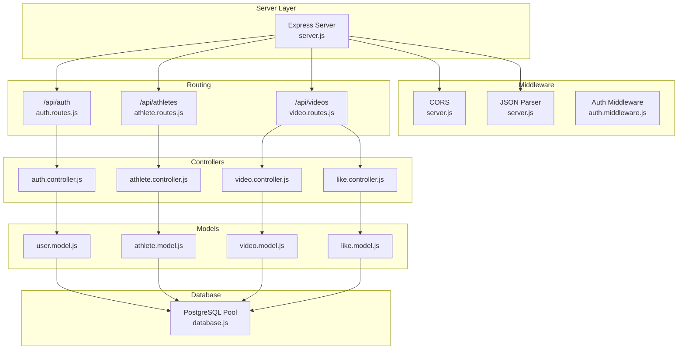
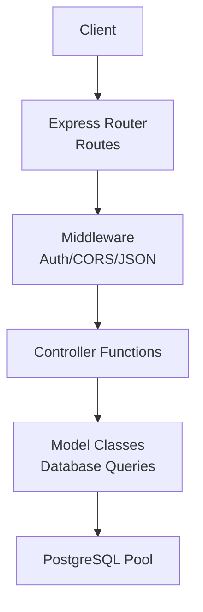
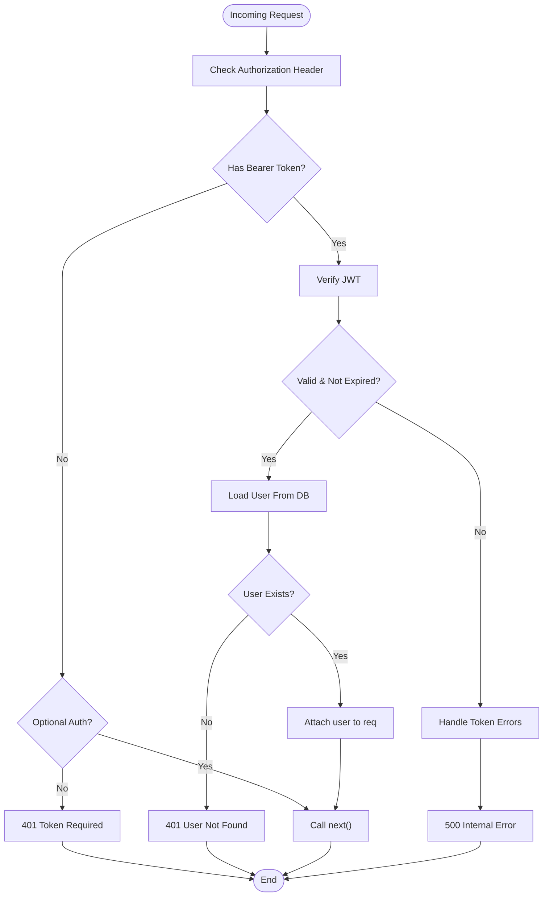
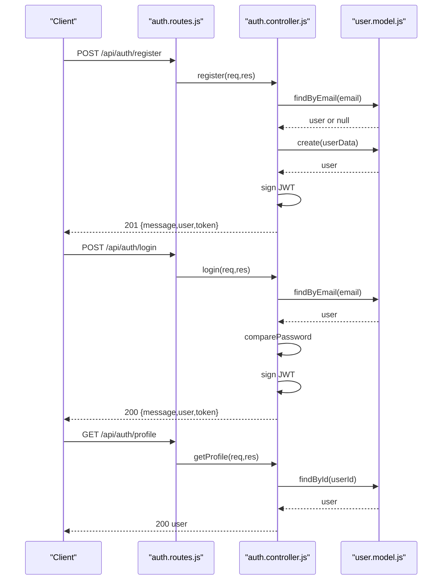
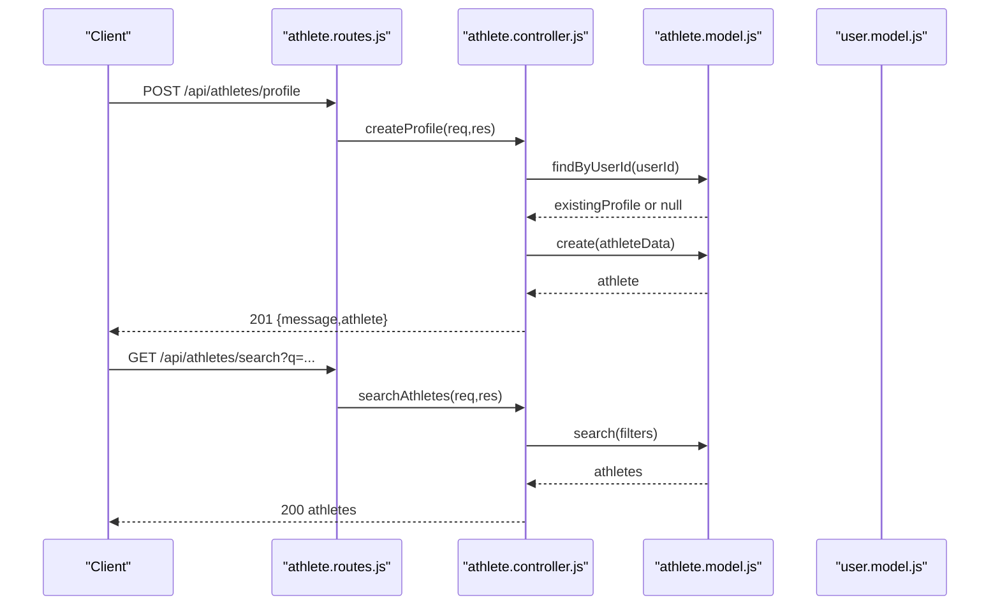
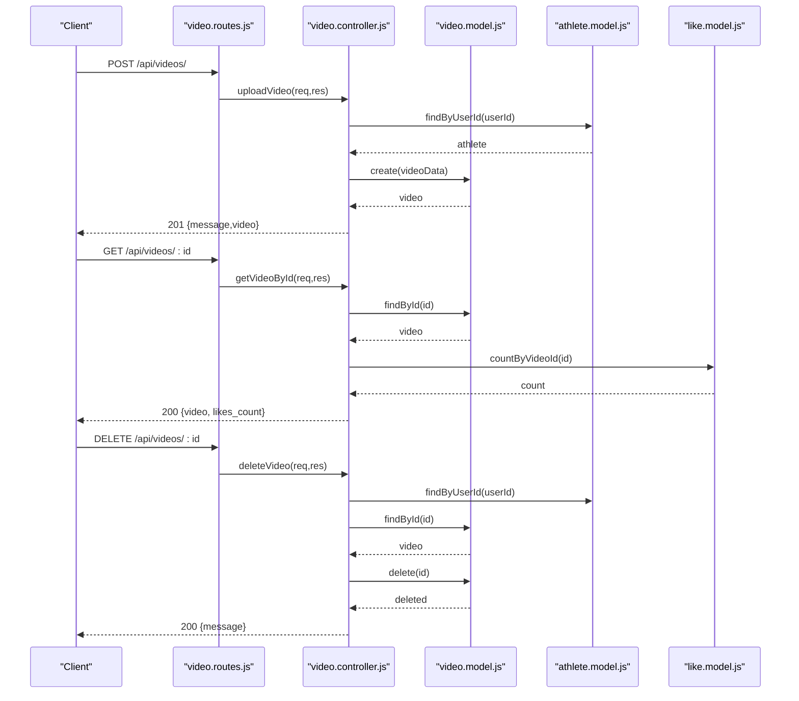
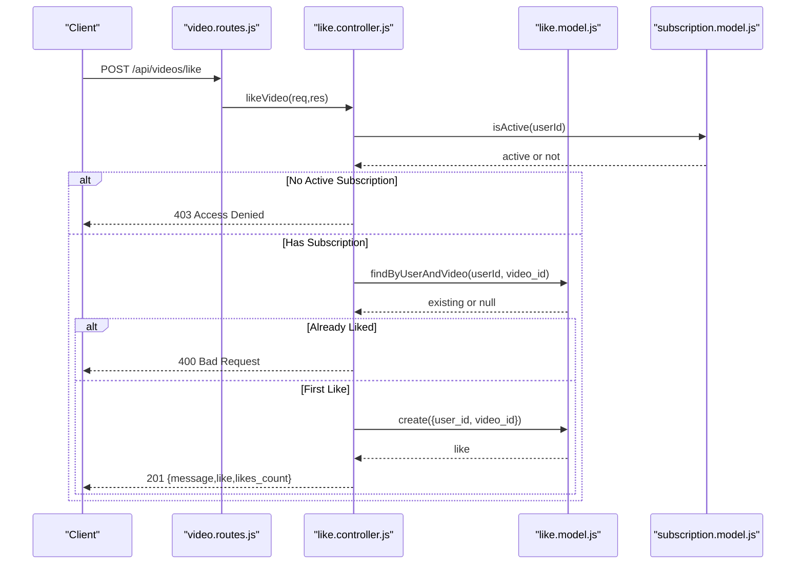
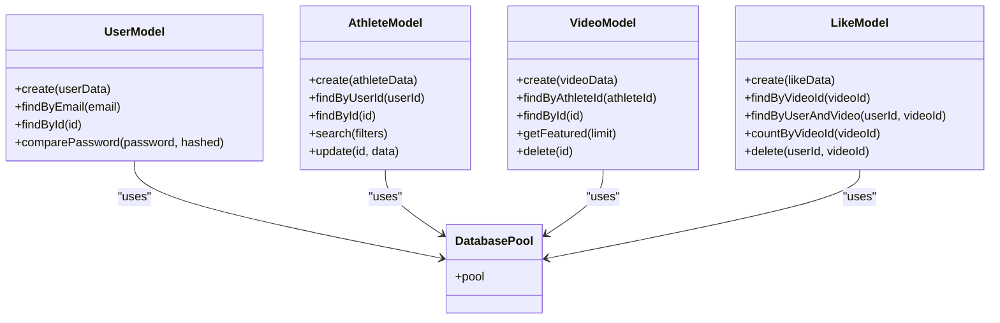
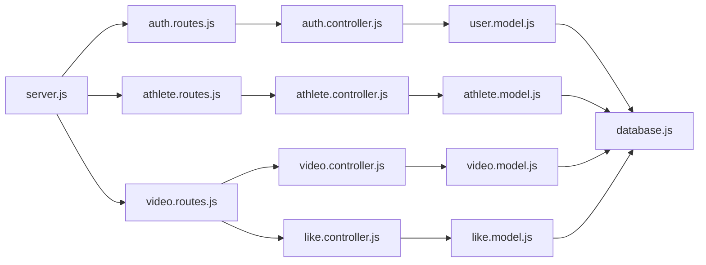

# Backend Architecture

<cite>
**Referenced Files in This Document**
- [server.js](file://backend/server.js)
- [database.js](file://backend/config/database.js)
- [auth.middleware.js](file://backend/middleware/auth.middleware.js)
- [auth.controller.js](file://backend/controllers/auth.controller.js)
- [athlete.controller.js](file://backend/controllers/athlete.controller.js)
- [video.controller.js](file://backend/controllers/video.controller.js)
- [like.controller.js](file://backend/controllers/like.controller.js)
- [user.model.js](file://backend/models/user.model.js)
- [athlete.model.js](file://backend/models/athlete.model.js)
- [video.model.js](file://backend/models/video.model.js)
- [like.model.js](file://backend/models/like.model.js)
- [auth.routes.js](file://backend/routes/auth.routes.js)
- [athlete.routes.js](file://backend/routes/athlete.routes.js)
- [video.routes.js](file://backend/routes/video.routes.js)
- [package.json](file://backend/package.json)
</cite>

## Table of Contents
1. [Introduction](#introduction)
2. [Project Structure](#project-structure)
3. [Core Components](#core-components)
4. [Architecture Overview](#architecture-overview)
5. [Detailed Component Analysis](#detailed-component-analysis)
6. [Dependency Analysis](#dependency-analysis)
7. [Performance Considerations](#performance-considerations)
8. [Troubleshooting Guide](#troubleshooting-guide)
9. [Conclusion](#conclusion)

## Introduction
This document describes the backend architecture of Craque-Vision’s Express.js API. It explains how the application implements the Model-View-Controller (MVC) pattern, organizes routes and controllers, and manages middleware for authentication and cross-origin requests. It also documents the data access layer using PostgreSQL connection pooling, the request processing pipeline, error handling strategies, and RESTful API design principles including HTTP status codes and response formatting.

## Project Structure
The backend follows a layered architecture:
- Entry point initializes Express, loads environment variables, enables CORS, parses JSON, mounts routes, and starts the server.
- Routes define API endpoints grouped by feature.
- Controllers handle request logic, coordinate with models, and format responses.
- Models encapsulate database operations using a shared PostgreSQL connection pool.
- Middleware enforces authentication and authorization policies.
- Environment configuration is loaded via dotenv.

**Diagram sources**
- [server.js:1-40](file://backend/server.js#L1-L40)
- [auth.routes.js:1-11](file://backend/routes/auth.routes.js#L1-L11)
- [athlete.routes.js:1-14](file://backend/routes/athlete.routes.js#L1-L14)
- [video.routes.js:1-20](file://backend/routes/video.routes.js#L1-L20)
- [auth.controller.js:1-72](file://backend/controllers/auth.controller.js#L1-L72)
- [athlete.controller.js:1-91](file://backend/controllers/athlete.controller.js#L1-L91)
- [video.controller.js:1-111](file://backend/controllers/video.controller.js#L1-L111)
- [like.controller.js:1-75](file://backend/controllers/like.controller.js#L1-L75)
- [user.model.js:1-42](file://backend/models/user.model.js#L1-L42)
- [athlete.model.js:1-119](file://backend/models/athlete.model.js#L1-L119)
- [video.model.js:1-61](file://backend/models/video.model.js#L1-L61)
- [like.model.js:1-61](file://backend/models/like.model.js#L1-L61)
- [database.js:1-13](file://backend/config/database.js#L1-L13)

**Section sources**
- [server.js:1-40](file://backend/server.js#L1-L40)
- [package.json:1-25](file://backend/package.json#L1-L25)

## Core Components
- Express server initialization and middleware stack
- Route registration for feature areas
- Authentication and authorization middleware
- Controller functions implementing CRUD and business logic
- Data access models using PostgreSQL connection pooling
- Environment-driven configuration

Key implementation highlights:
- Centralized CORS and JSON parsing middleware at the server level.
- Modular route files per domain feature.
- JWT-based authentication middleware validating tokens and attaching user context.
- Role-based authorization enforcing allowed user types.
- Optional authentication allowing anonymous access when applicable.
- Models encapsulating SQL queries with parameterized statements.
- Controllers returning structured JSON responses with appropriate HTTP status codes.

**Section sources**
- [server.js:1-40](file://backend/server.js#L1-L40)
- [auth.middleware.js:1-59](file://backend/middleware/auth.middleware.js#L1-L59)
- [auth.controller.js:1-72](file://backend/controllers/auth.controller.js#L1-L72)
- [athlete.controller.js:1-91](file://backend/controllers/athlete.controller.js#L1-L91)
- [video.controller.js:1-111](file://backend/controllers/video.controller.js#L1-L111)
- [like.controller.js:1-75](file://backend/controllers/like.controller.js#L1-L75)
- [user.model.js:1-42](file://backend/models/user.model.js#L1-L42)
- [athlete.model.js:1-119](file://backend/models/athlete.model.js#L1-L119)
- [video.model.js:1-61](file://backend/models/video.model.js#L1-L61)
- [like.model.js:1-61](file://backend/models/like.model.js#L1-L61)

## Architecture Overview
The system adheres to MVC principles:
- Routes define endpoints and bind them to controller actions.
- Controllers orchestrate request handling, enforce authorization, and call models.
- Models abstract database interactions using a shared connection pool.
- Middleware runs before controllers to handle cross-origin requests, JSON parsing, and authentication.

**Diagram sources**
- [server.js:1-40](file://backend/server.js#L1-L40)
- [auth.routes.js:1-11](file://backend/routes/auth.routes.js#L1-L11)
- [athlete.routes.js:1-14](file://backend/routes/athlete.routes.js#L1-L14)
- [video.routes.js:1-20](file://backend/routes/video.routes.js#L1-L20)
- [auth.middleware.js:1-59](file://backend/middleware/auth.middleware.js#L1-L59)
- [auth.controller.js:1-72](file://backend/controllers/auth.controller.js#L1-L72)
- [athlete.controller.js:1-91](file://backend/controllers/athlete.controller.js#L1-L91)
- [video.controller.js:1-111](file://backend/controllers/video.controller.js#L1-L111)
- [like.controller.js:1-75](file://backend/controllers/like.controller.js#L1-L75)
- [user.model.js:1-42](file://backend/models/user.model.js#L1-L42)
- [athlete.model.js:1-119](file://backend/models/athlete.model.js#L1-L119)
- [video.model.js:1-61](file://backend/models/video.model.js#L1-L61)
- [like.model.js:1-61](file://backend/models/like.model.js#L1-L61)
- [database.js:1-13](file://backend/config/database.js#L1-L13)

## Detailed Component Analysis

### Authentication Middleware
The authentication middleware validates bearer tokens, attaches user identity to the request, and supports role-based authorization and optional authentication.

**Diagram sources**
- [auth.middleware.js:4-33](file://backend/middleware/auth.middleware.js#L4-L33)

**Section sources**
- [auth.middleware.js:1-59](file://backend/middleware/auth.middleware.js#L1-L59)

### Authentication Controller
Handles user registration, login, and profile retrieval. Uses JWT for sessionless authentication and returns standardized responses.

**Diagram sources**
- [auth.routes.js:6-8](file://backend/routes/auth.routes.js#L6-L8)
- [auth.controller.js:8-71](file://backend/controllers/auth.controller.js#L8-L71)
- [user.model.js:4-38](file://backend/models/user.model.js#L4-L38)

**Section sources**
- [auth.controller.js:1-72](file://backend/controllers/auth.controller.js#L1-L72)
- [auth.routes.js:1-11](file://backend/routes/auth.routes.js#L1-L11)
- [user.model.js:1-42](file://backend/models/user.model.js#L1-L42)

### Athlete Controller
Manages athlete profiles, search, and listing. Enforces athlete role for profile operations.

**Diagram sources**
- [athlete.routes.js:6-11](file://backend/routes/athlete.routes.js#L6-L11)
- [athlete.controller.js:4-90](file://backend/controllers/athlete.controller.js#L4-L90)
- [athlete.model.js:34-86](file://backend/models/athlete.model.js#L34-L86)

**Section sources**
- [athlete.controller.js:1-91](file://backend/controllers/athlete.controller.js#L1-L91)
- [athlete.routes.js:1-14](file://backend/routes/athlete.routes.js#L1-L14)
- [athlete.model.js:1-119](file://backend/models/athlete.model.js#L1-L119)

### Video Controller
Handles video upload, retrieval, featured listing, and deletion. Integrates with likes and athlete context.

**Diagram sources**
- [video.routes.js:7-12](file://backend/routes/video.routes.js#L7-L12)
- [video.controller.js:5-110](file://backend/controllers/video.controller.js#L5-L110)
- [video.model.js:4-57](file://backend/models/video.model.js#L4-L57)
- [like.model.js:39-47](file://backend/models/like.model.js#L39-L47)

**Section sources**
- [video.controller.js:1-111](file://backend/controllers/video.controller.js#L1-L111)
- [video.routes.js:1-20](file://backend/routes/video.routes.js#L1-L20)
- [video.model.js:1-61](file://backend/models/video.model.js#L1-L61)
- [like.model.js:1-61](file://backend/models/like.model.js#L1-L61)

### Like Controller
Enforces subscription checks for liking videos and manages like/unlike operations.

**Diagram sources**
- [video.routes.js:14-16](file://backend/routes/video.routes.js#L14-L16)
- [like.controller.js:4-30](file://backend/controllers/like.controller.js#L4-L30)
- [like.model.js:4-16](file://backend/models/like.model.js#L4-L16)

**Section sources**
- [like.controller.js:1-75](file://backend/controllers/like.controller.js#L1-L75)
- [video.routes.js:14-16](file://backend/routes/video.routes.js#L14-L16)

### Database Connection Pooling and Transactions
- A single PostgreSQL connection pool is configured and exported for use by all models.
- Models execute parameterized queries to prevent SQL injection.
- There is no explicit transaction management in the provided code; models execute individual statements.

**Diagram sources**
- [database.js:4-10](file://backend/config/database.js#L4-L10)
- [user.model.js:1-42](file://backend/models/user.model.js#L1-L42)
- [athlete.model.js:1-119](file://backend/models/athlete.model.js#L1-L119)
- [video.model.js:1-61](file://backend/models/video.model.js#L1-L61)
- [like.model.js:1-61](file://backend/models/like.model.js#L1-L61)

**Section sources**
- [database.js:1-13](file://backend/config/database.js#L1-L13)
- [user.model.js:1-42](file://backend/models/user.model.js#L1-L42)
- [athlete.model.js:1-119](file://backend/models/athlete.model.js#L1-L119)
- [video.model.js:1-61](file://backend/models/video.model.js#L1-L61)
- [like.model.js:1-61](file://backend/models/like.model.js#L1-L61)

## Dependency Analysis
- Express server depends on dotenv for environment variables, cors for cross-origin support, and registers multiple route modules.
- Controllers depend on models for data access and on JWT for token handling.
- Models depend on the PostgreSQL pool for database operations.
- Routes depend on controllers and middleware for request handling.

**Diagram sources**
- [server.js:5-11](file://backend/server.js#L5-L11)
- [auth.routes.js:1-11](file://backend/routes/auth.routes.js#L1-L11)
- [athlete.routes.js:1-14](file://backend/routes/athlete.routes.js#L1-L14)
- [video.routes.js:1-20](file://backend/routes/video.routes.js#L1-L20)
- [auth.controller.js:1-72](file://backend/controllers/auth.controller.js#L1-L72)
- [athlete.controller.js:1-91](file://backend/controllers/athlete.controller.js#L1-L91)
- [video.controller.js:1-111](file://backend/controllers/video.controller.js#L1-L111)
- [like.controller.js:1-75](file://backend/controllers/like.controller.js#L1-L75)
- [user.model.js:1-42](file://backend/models/user.model.js#L1-L42)
- [athlete.model.js:1-119](file://backend/models/athlete.model.js#L1-L119)
- [video.model.js:1-61](file://backend/models/video.model.js#L1-L61)
- [like.model.js:1-61](file://backend/models/like.model.js#L1-L61)
- [database.js:1-13](file://backend/config/database.js#L1-L13)

**Section sources**
- [server.js:1-40](file://backend/server.js#L1-L40)
- [package.json:10-20](file://backend/package.json#L10-L20)

## Performance Considerations
- Connection pooling: A single pool is configured centrally; ensure proper tuning of pool size and timeouts for production workloads.
- Parameterized queries: All models use parameterized statements, reducing overhead and preventing SQL injection.
- Indexing: Consider adding database indexes on frequently filtered columns (e.g., athletes sport, category, state, position; videos athlete_id; likes user_id/video_id).
- Pagination: The featured videos endpoint accepts a limit; consider pagination for large lists.
- Caching: Introduce caching for read-heavy endpoints (e.g., featured videos, athlete profiles) to reduce database load.
- Transaction boundaries: If future features require atomicity across multiple writes, wrap related operations in explicit transactions.

[No sources needed since this section provides general guidance]

## Troubleshooting Guide
Common issues and resolutions:
- Authentication failures:
  - Missing or malformed Bearer token results in 401.
  - Expired or invalid tokens yield specific error messages.
  - Users not found after successful token verification receive 401.
- Authorization failures:
  - Requests requiring specific user types return 403 when unauthorized.
  - Optional authentication allows proceeding without enforced user context.
- Resource not found:
  - Attempts to access non-existent athletes, videos, or users return 404.
- Business rule violations:
  - Duplicate profiles, already-liked videos, or missing subscriptions return 400/403.
- Internal errors:
  - Unhandled exceptions return 500 with error messages.

**Section sources**
- [auth.middleware.js:4-33](file://backend/middleware/auth.middleware.js#L4-L33)
- [auth.controller.js:13-26](file://backend/controllers/auth.controller.js#L13-L26)
- [athlete.controller.js:9-21](file://backend/controllers/athlete.controller.js#L9-L21)
- [video.controller.js:10-106](file://backend/controllers/video.controller.js#L10-L106)
- [like.controller.js:10-29](file://backend/controllers/like.controller.js#L10-L29)

## Conclusion
Craque-Vision’s backend implements a clean, modular Express architecture with clear separation of concerns. The MVC pattern is evident across routes, controllers, and models, while middleware ensures consistent authentication and authorization policies. The PostgreSQL connection pool centralizes database access, and parameterized queries mitigate security risks. Future enhancements can focus on transaction management, indexing, caching, and pagination to improve scalability and performance.