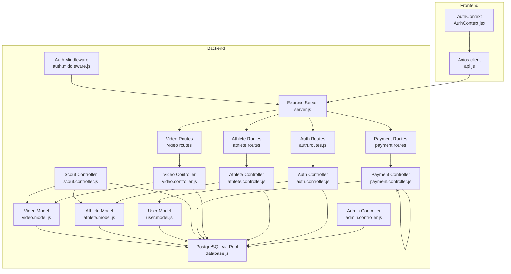
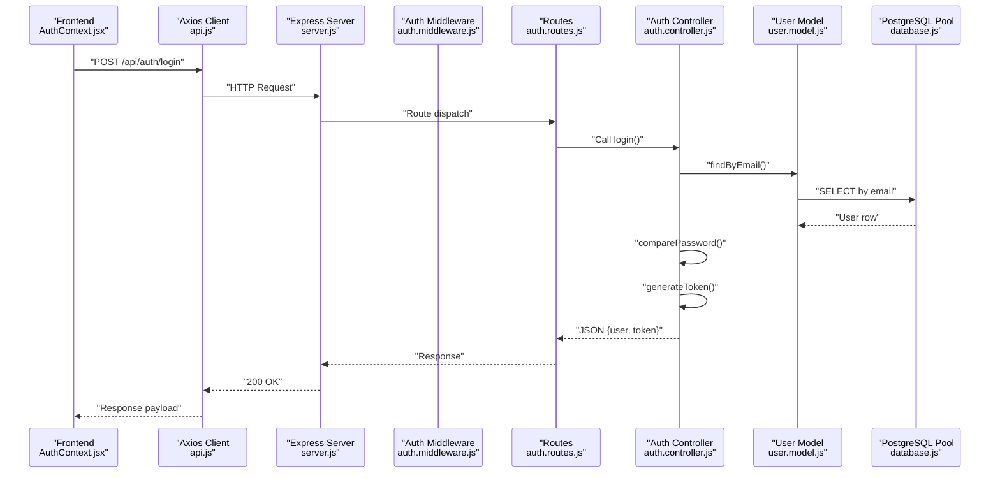
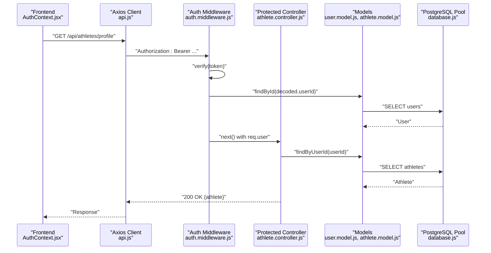
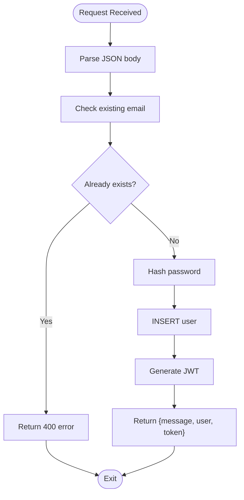
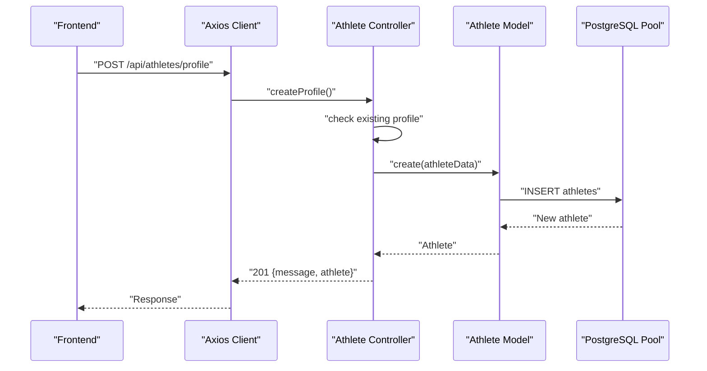
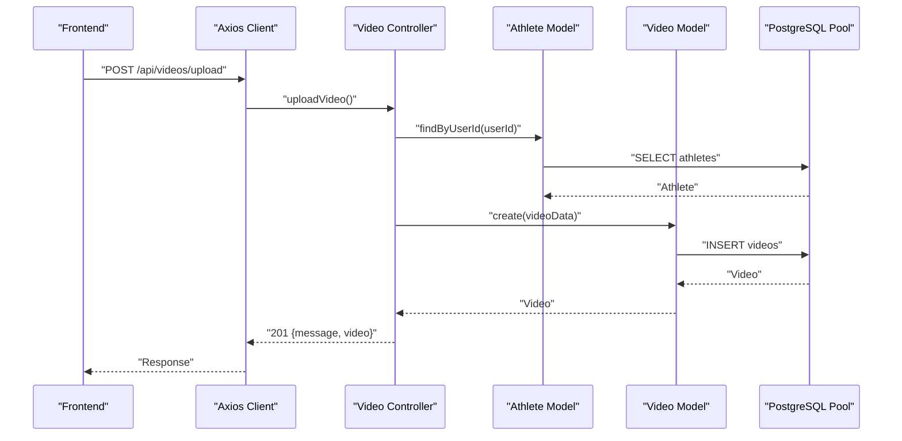
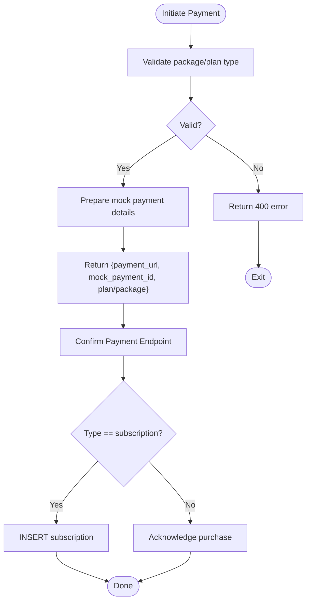
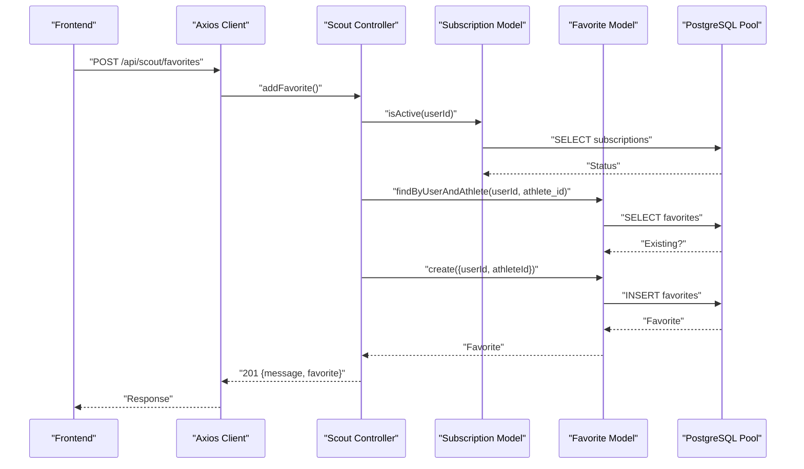
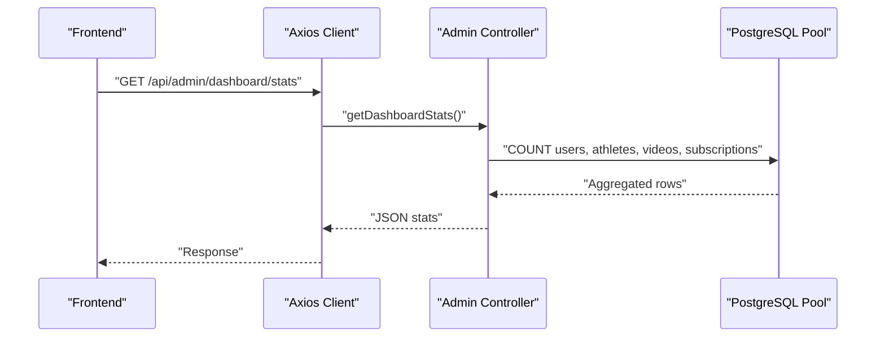
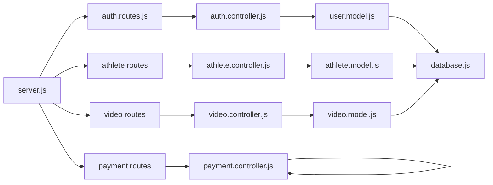

# Data Flow Architecture

<cite>
**Referenced Files in This Document**
- [server.js](file://backend/server.js)
- [database.js](file://backend/config/database.js)
- [auth.middleware.js](file://backend/middleware/auth.middleware.js)
- [auth.controller.js](file://backend/controllers/auth.controller.js)
- [auth.routes.js](file://backend/routes/auth.routes.js)
- [user.model.js](file://backend/models/user.model.js)
- [athlete.controller.js](file://backend/controllers/athlete.controller.js)
- [video.controller.js](file://backend/controllers/video.controller.js)
- [payment.controller.js](file://backend/controllers/payment.controller.js)
- [scout.controller.js](file://backend/controllers/scout.controller.js)
- [admin.controller.js](file://backend/controllers/admin.controller.js)
- [athlete.model.js](file://backend/models/athlete.model.js)
- [video.model.js](file://backend/models/video.model.js)
- [api.js](file://frontend/src/services/api.js)
- [AuthContext.jsx](file://frontend/src/context/AuthContext.jsx)
</cite>

## Table of Contents
1. [Introduction](#introduction)
2. [Project Structure](#project-structure)
3. [Core Components](#core-components)
4. [Architecture Overview](#architecture-overview)
5. [Detailed Component Analysis](#detailed-component-analysis)
6. [Dependency Analysis](#dependency-analysis)
7. [Performance Considerations](#performance-considerations)
8. [Troubleshooting Guide](#troubleshooting-guide)
9. [Conclusion](#conclusion)

## Introduction
This document describes the end-to-end data flow architecture for Craque-Vision. It covers request-response cycles, authentication and authorization flows, data transformation layers, database operations, and API communication patterns. It also documents file upload pathways, payment processing workflows, and how real-time-like updates propagate through the system. The goal is to provide a clear understanding of how data moves from the frontend through Express controllers to PostgreSQL and how external integrations would be layered.

## Project Structure
The system follows a classic layered backend architecture with a PostgreSQL database and a React frontend. The backend exposes REST endpoints grouped by domain (authentication, athletes, videos, scouts, clubs, admin, payments). Middleware enforces authentication and authorization. Controllers orchestrate business logic and coordinate model queries. Models encapsulate database operations via a connection pool. The frontend communicates with the backend using Axios with automatic bearer token injection and centralized error handling.

**Diagram sources**
- [server.js:1-40](file://backend/server.js#L1-L40)
- [auth.middleware.js:1-59](file://backend/middleware/auth.middleware.js#L1-L59)
- [auth.routes.js:1-11](file://backend/routes/auth.routes.js#L1-L11)
- [auth.controller.js:1-72](file://backend/controllers/auth.controller.js#L1-L72)
- [user.model.js:1-42](file://backend/models/user.model.js#L1-L42)
- [athlete.controller.js:1-91](file://backend/controllers/athlete.controller.js#L1-L91)
- [athlete.model.js:1-119](file://backend/models/athlete.model.js#L1-L119)
- [video.controller.js:1-111](file://backend/controllers/video.controller.js#L1-L111)
- [video.model.js:1-61](file://backend/models/video.model.js#L1-L61)
- [payment.controller.js:1-108](file://backend/controllers/payment.controller.js#L1-L108)
- [scout.controller.js:1-96](file://backend/controllers/scout.controller.js#L1-L96)
- [admin.controller.js:1-121](file://backend/controllers/admin.controller.js#L1-L121)
- [database.js:1-13](file://backend/config/database.js#L1-L13)
- [api.js:1-36](file://frontend/src/services/api.js#L1-L36)
- [AuthContext.jsx:1-91](file://frontend/src/context/AuthContext.jsx#L1-L91)

**Section sources**
- [server.js:1-40](file://backend/server.js#L1-L40)
- [database.js:1-13](file://backend/config/database.js#L1-L13)

## Core Components
- Express server initializes CORS, JSON parsing, and mounts route groups under /api.
- Authentication middleware validates JWT from Authorization header, decodes it, loads the user, and attaches user info to the request.
- Controllers implement domain-specific logic, enforce access rules, and return structured JSON responses.
- Models encapsulate SQL operations using a PostgreSQL connection pool and parameterized queries.
- Frontend Axios client injects Authorization headers automatically and handles 401 redirects.

Key data flow characteristics:
- Request enters Express, passes through middleware, reaches controller, which interacts with models, which query the database pool.
- Responses are standardized JSON with messages and data payloads.
- Authentication is mandatory for protected routes; optional auth allows anonymous access when token is absent.

**Section sources**
- [server.js:15-26](file://backend/server.js#L15-L26)
- [auth.middleware.js:4-33](file://backend/middleware/auth.middleware.js#L4-L33)
- [auth.controller.js:8-28](file://backend/controllers/auth.controller.js#L8-L28)
- [user.model.js:4-38](file://backend/models/user.model.js#L4-L38)
- [api.js:10-21](file://frontend/src/services/api.js#L10-L21)

## Architecture Overview
The system is a layered REST API with clear separation of concerns:
- Presentation: React frontend with context-managed authentication state and Axios client.
- Application: Express routes, middleware, and controllers.
- Domain: Controllers orchestrate business rules.
- Persistence: Models encapsulate Postgres queries.

**Diagram sources**
- [AuthContext.jsx:21-38](file://frontend/src/context/AuthContext.jsx#L21-L38)
- [api.js:3-8](file://frontend/src/services/api.js#L3-L8)
- [server.js:15-26](file://backend/server.js#L15-L26)
- [auth.routes.js:6-8](file://backend/routes/auth.routes.js#L6-L8)
- [auth.controller.js:30-59](file://backend/controllers/auth.controller.js#L30-L59)
- [user.model.js:20-37](file://backend/models/user.model.js#L20-L37)
- [database.js:4-10](file://backend/config/database.js#L4-L10)

## Detailed Component Analysis

### Authentication Data Flow (JWT, Session, RBAC)
- Frontend stores token and user in localStorage and sets Authorization header globally.
- Backend middleware extracts Bearer token, verifies signature, decodes userId, loads user, and attaches to request.
- Optional auth allows unauthenticated access when token is missing.
- Role-based access control uses authorize with allowed user types.

**Diagram sources**
- [AuthContext.jsx:10-19](file://frontend/src/context/AuthContext.jsx#L10-L19)
- [api.js:10-21](file://frontend/src/services/api.js#L10-L21)
- [auth.middleware.js:4-33](file://backend/middleware/auth.middleware.js#L4-L33)
- [athlete.controller.js:24-37](file://backend/controllers/athlete.controller.js#L24-L37)
- [user.model.js:26-33](file://backend/models/user.model.js#L26-L33)
- [athlete.model.js:34-37](file://backend/models/athlete.model.js#L34-L37)
- [database.js:4-10](file://backend/config/database.js#L4-L10)

**Section sources**
- [AuthContext.jsx:10-19](file://frontend/src/context/AuthContext.jsx#L10-L19)
- [api.js:10-21](file://frontend/src/services/api.js#L10-L21)
- [auth.middleware.js:35-42](file://backend/middleware/auth.middleware.js#L35-L42)
- [auth.controller.js:8-28](file://backend/controllers/auth.controller.js#L8-L28)

### Registration and Login Flow
- Registration checks for existing email, hashes password, persists user, and returns token.
- Login validates credentials, compares password hash, and returns token and sanitized user.

**Diagram sources**
- [auth.controller.js:8-28](file://backend/controllers/auth.controller.js#L8-L28)
- [user.model.js:5-18](file://backend/models/user.model.js#L5-L18)

**Section sources**
- [auth.controller.js:8-28](file://backend/controllers/auth.controller.js#L8-L28)
- [user.model.js:5-18](file://backend/models/user.model.js#L5-L18)

### Athlete Profile Management
- Controllers enforce that only authenticated users can create/update profiles linked to their userId.
- Models support creation, lookup by userId, search with filters, and partial updates.

**Diagram sources**
- [athlete.controller.js:4-22](file://backend/controllers/athlete.controller.js#L4-L22)
- [athlete.model.js:4-32](file://backend/models/athlete.model.js#L4-L32)
- [database.js:4-10](file://backend/config/database.js#L4-L10)

**Section sources**
- [athlete.controller.js:4-22](file://backend/controllers/athlete.controller.js#L4-L22)
- [athlete.model.js:4-32](file://backend/models/athlete.model.js#L4-L32)

### Video Upload and Retrieval
- Upload requires an associated athlete profile; controller validates and persists video metadata.
- Retrieval supports fetching by athlete, by ID (with likes count), featured lists, and deletion with ownership check.

**Diagram sources**
- [video.controller.js:5-32](file://backend/controllers/video.controller.js#L5-L32)
- [athlete.model.js:34-37](file://backend/models/athlete.model.js#L34-L37)
- [video.model.js:4-16](file://backend/models/video.model.js#L4-L16)
- [database.js:4-10](file://backend/config/database.js#L4-L10)

**Section sources**
- [video.controller.js:5-32](file://backend/controllers/video.controller.js#L5-L32)
- [video.model.js:4-16](file://backend/models/video.model.js#L4-L16)

### Payment Processing Workflow
- Payment controller defines packages and plans, generates mock payment URLs, and confirms payments by creating subscriptions or acknowledging purchases.
- Access control ensures only authenticated users can initiate payments.

**Diagram sources**
- [payment.controller.js:31-77](file://backend/controllers/payment.controller.js#L31-L77)
- [payment.controller.js:79-107](file://backend/controllers/payment.controller.js#L79-L107)

**Section sources**
- [payment.controller.js:3-13](file://backend/controllers/payment.controller.js#L3-L13)
- [payment.controller.js:31-77](file://backend/controllers/payment.controller.js#L31-L77)
- [payment.controller.js:79-107](file://backend/controllers/payment.controller.js#L79-L107)

### Scout Access Control and Favorites
- Scout endpoints require an active subscription; otherwise return 403.
- Favorites are created only if not already present and removed by user.

**Diagram sources**
- [scout.controller.js:50-73](file://backend/controllers/scout.controller.js#L50-L73)
- [scout.controller.js:9-13](file://backend/controllers/scout.controller.js#L9-L13)
- [database.js:4-10](file://backend/config/database.js#L4-L10)

**Section sources**
- [scout.controller.js:9-13](file://backend/controllers/scout.controller.js#L9-L13)
- [scout.controller.js:50-73](file://backend/controllers/scout.controller.js#L50-L73)

### Admin Dashboard and Moderation
- Admin endpoints aggregate counts, list users/videos/subscriptions, approve/reject videos, and delete users.
- These endpoints rely on direct pool queries for analytics and administrative actions.

**Diagram sources**
- [admin.controller.js:7-31](file://backend/controllers/admin.controller.js#L7-L31)
- [database.js:4-10](file://backend/config/database.js#L4-L10)

**Section sources**
- [admin.controller.js:7-31](file://backend/controllers/admin.controller.js#L7-L31)
- [admin.controller.js:78-110](file://backend/controllers/admin.controller.js#L78-L110)

### File Upload Data Flow to Cloudinary
- Current implementation does not include Cloudinary integration in the backend controllers or routes.
- To integrate Cloudinary, add a dedicated upload route/controller method that receives media, uploads to Cloudinary, and persists metadata returned by the service into the Video model.

[No sources needed since this section provides integration guidance]

### Real-Time Data Updates
- No WebSocket or real-time library is currently integrated in the backend or frontend.
- To implement real-time updates (e.g., live likes, notifications), integrate a WebSocket library (e.g., Socket.IO) and emit events from controllers after database writes.

[No sources needed since this section provides integration guidance]

## Dependency Analysis
The backend exhibits clean layering with explicit dependencies:
- server.js depends on route modules.
- Routes depend on controllers.
- Controllers depend on models.
- Models depend on the database pool.
- Frontend depends on the Axios client and AuthContext.

**Diagram sources**
- [server.js:5-11](file://backend/server.js#L5-L11)
- [auth.routes.js:1-11](file://backend/routes/auth.routes.js#L1-L11)
- [auth.controller.js:1-72](file://backend/controllers/auth.controller.js#L1-L72)
- [user.model.js:1-42](file://backend/models/user.model.js#L1-L42)
- [athlete.controller.js:1-91](file://backend/controllers/athlete.controller.js#L1-L91)
- [athlete.model.js:1-119](file://backend/models/athlete.model.js#L1-L119)
- [video.controller.js:1-111](file://backend/controllers/video.controller.js#L1-L111)
- [video.model.js:1-61](file://backend/models/video.model.js#L1-L61)
- [payment.controller.js:1-108](file://backend/controllers/payment.controller.js#L1-L108)
- [database.js:1-13](file://backend/config/database.js#L1-L13)

**Section sources**
- [server.js:5-11](file://backend/server.js#L5-L11)
- [auth.routes.js:1-11](file://backend/routes/auth.routes.js#L1-L11)
- [auth.controller.js:1-72](file://backend/controllers/auth.controller.js#L1-L72)
- [user.model.js:1-42](file://backend/models/user.model.js#L1-L42)
- [athlete.controller.js:1-91](file://backend/controllers/athlete.controller.js#L1-L91)
- [athlete.model.js:1-119](file://backend/models/athlete.model.js#L1-L119)
- [video.controller.js:1-111](file://backend/controllers/video.controller.js#L1-L111)
- [video.model.js:1-61](file://backend/models/video.model.js#L1-L61)
- [payment.controller.js:1-108](file://backend/controllers/payment.controller.js#L1-L108)
- [database.js:1-13](file://backend/config/database.js#L1-L13)

## Performance Considerations
- Use parameterized queries consistently (already implemented) to prevent SQL injection and improve plan reuse.
- Batch analytics queries in admin dashboard can be optimized with indexes on frequently filtered columns.
- Add pagination for listing endpoints (users, videos, subscriptions) to avoid large payloads.
- Cache frequent reads (e.g., user profiles) at the application level with short TTLs.
- Offload heavy tasks (e.g., image/video processing) to background jobs or external services.

[No sources needed since this section provides general guidance]

## Troubleshooting Guide
Common issues and resolutions:
- 401 Unauthorized: Verify Authorization header presence and token validity; ensure frontend stores and sends token; middleware handles expired or invalid tokens.
- 403 Forbidden: Ensure user has required role; middleware authorize checks user_type against allowed types.
- 404 Not Found: Resource not found; check IDs and associations (e.g., athlete profile must exist before uploading videos).
- 500 Internal Server Error: Inspect controller and model error handling; ensure database connectivity and query correctness.

Operational checks:
- Confirm environment variables for JWT secret and database credentials are set.
- Validate CORS policy allows frontend origin.
- Monitor database pool connections and query performance.

**Section sources**
- [auth.middleware.js:24-32](file://backend/middleware/auth.middleware.js#L24-L32)
- [auth.middleware.js:35-42](file://backend/middleware/auth.middleware.js#L35-L42)
- [api.js:23-33](file://frontend/src/services/api.js#L23-L33)

## Conclusion
Craque-Vision implements a robust, layered REST architecture with clear authentication and authorization controls, consistent data transformation in controllers, and well-encapsulated database operations. The frontend integrates seamlessly with the backend through Axios interceptors and a centralized authentication context. To enhance the platform, consider integrating Cloudinary for media storage, implementing WebSocket-based real-time updates, and adding pagination and caching for improved scalability.