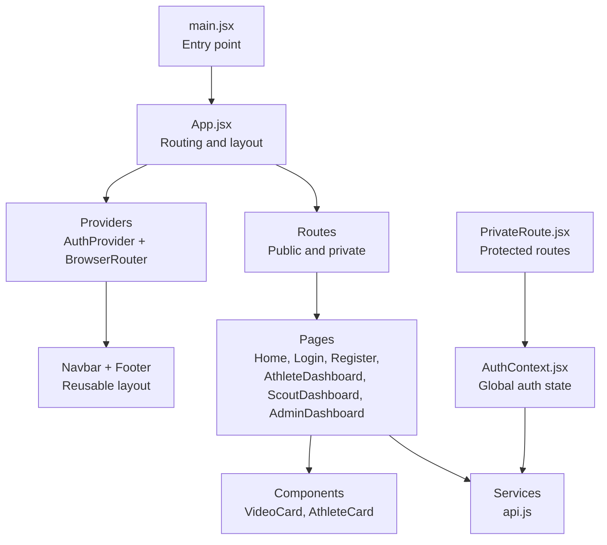
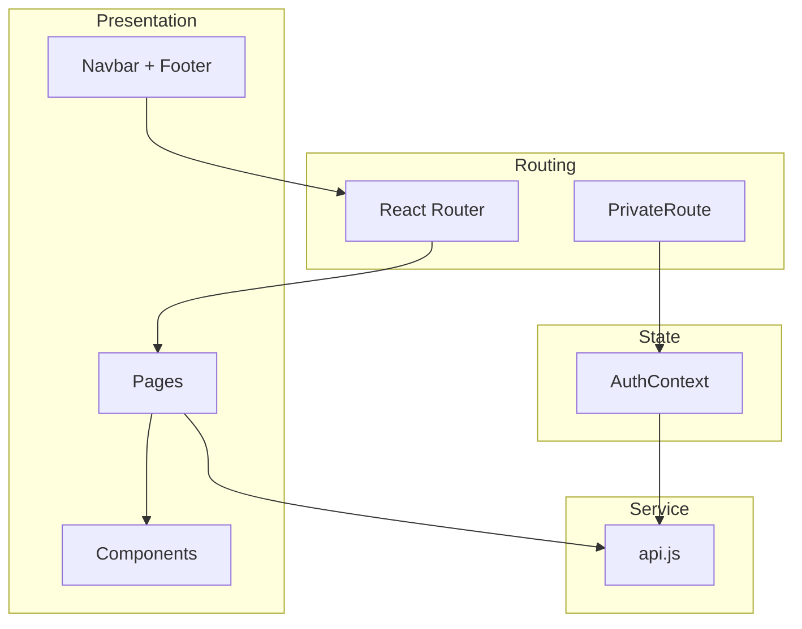
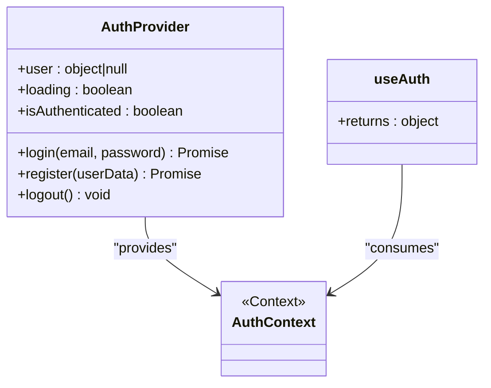
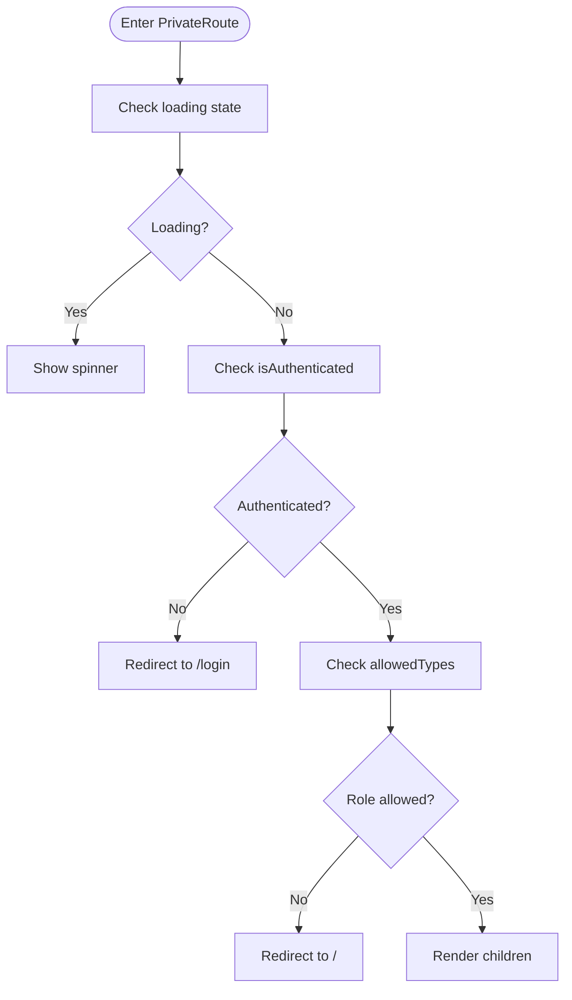
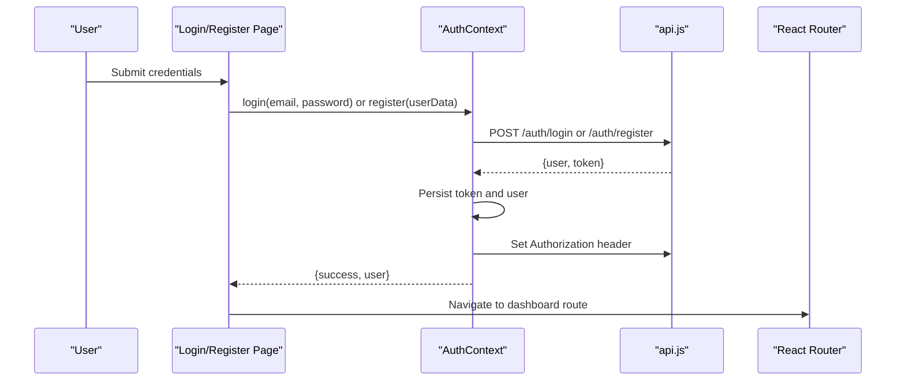
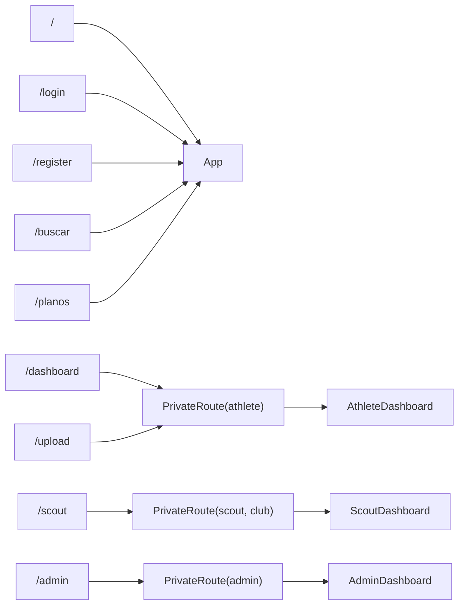
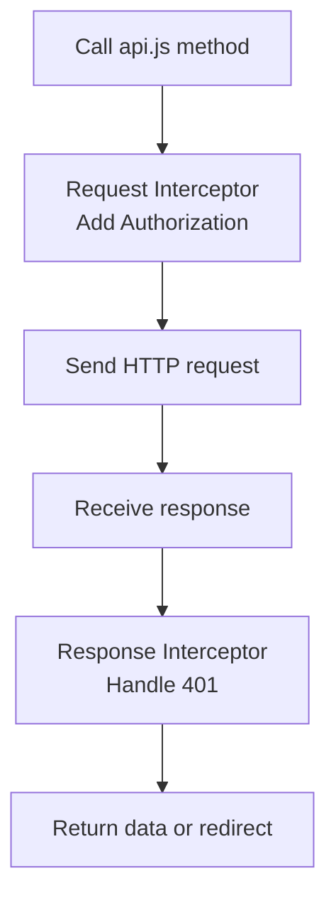
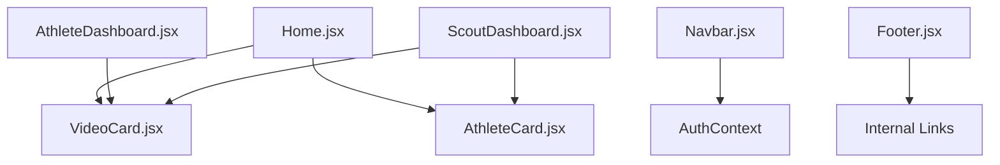
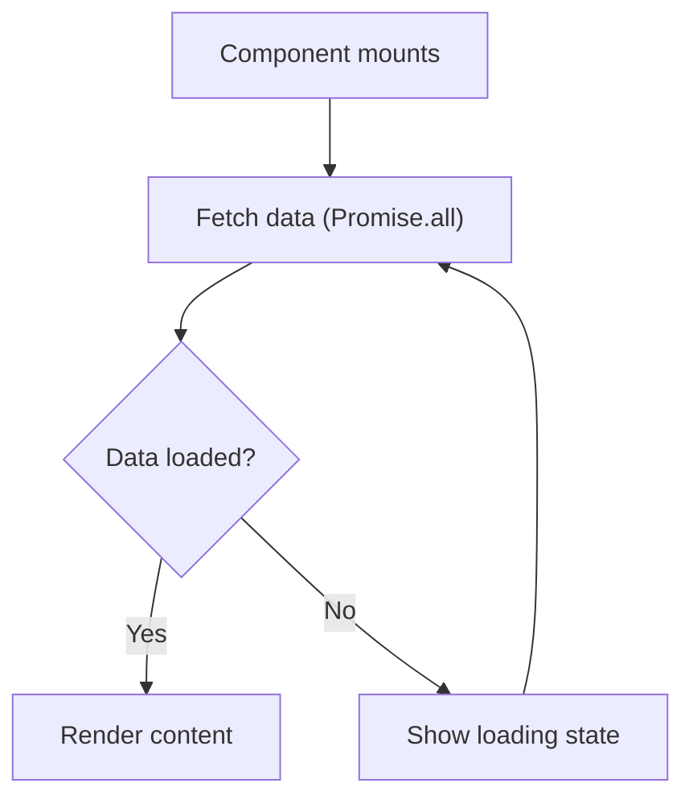
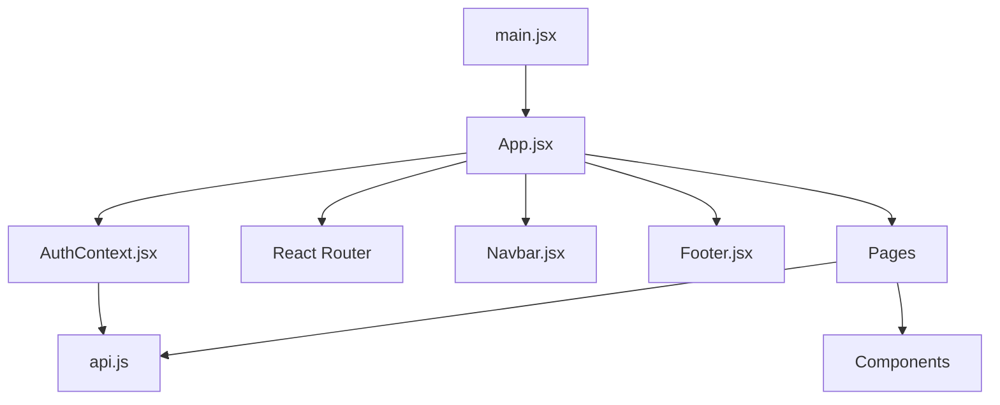

# Frontend Architecture

<cite>
**Referenced Files in This Document**
- [main.jsx](file://frontend/src/main.jsx)
- [App.jsx](file://frontend/src/App.jsx)
- [AuthContext.jsx](file://frontend/src/context/AuthContext.jsx)
- [PrivateRoute.jsx](file://frontend/src/components/PrivateRoute.jsx)
- [api.js](file://frontend/src/services/api.js)
- [Navbar.jsx](file://frontend/src/components/Navbar.jsx)
- [Footer.jsx](file://frontend/src/components/Footer.jsx)
- [Home.jsx](file://frontend/src/pages/Home.jsx)
- [Login.jsx](file://frontend/src/pages/Login.jsx)
- [Register.jsx](file://frontend/src/pages/Register.jsx)
- [AthleteDashboard.jsx](file://frontend/src/pages/AthleteDashboard.jsx)
- [ScoutDashboard.jsx](file://frontend/src/pages/ScoutDashboard.jsx)
- [AdminDashboard.jsx](file://frontend/src/pages/AdminDashboard.jsx)
- [VideoCard.jsx](file://frontend/src/components/VideoCard.jsx)
- [AthleteCard.jsx](file://frontend/src/components/AthleteCard.jsx)
</cite>

## Table of Contents
1. [Introduction](#introduction)
2. [Project Structure](#project-structure)
3. [Core Components](#core-components)
4. [Architecture Overview](#architecture-overview)
5. [Detailed Component Analysis](#detailed-component-analysis)
6. [Dependency Analysis](#dependency-analysis)
7. [Performance Considerations](#performance-considerations)
8. [Troubleshooting Guide](#troubleshooting-guide)
9. [Conclusion](#conclusion)

## Introduction
This document describes the frontend architecture of the Craque-Vision React application. It explains the component-based structure, routing with React Router, global state management via Context API, and component composition patterns. It also covers the routing strategy, protected routes, authentication flow, state management, API integration, lifecycle management, and styling with Tailwind CSS and responsive design.

## Project Structure
The frontend is organized around a clear separation of concerns:
- Entry point initializes the app and renders the root component.
- App orchestrates routing, layout, and providers.
- Pages represent route handlers and compose reusable components.
- Components encapsulate UI and presentation logic.
- Services abstract API communication.
- Context manages global authentication state.

**Diagram sources**
- [main.jsx:1-35](file://frontend/src/main.jsx#L1-L35)
- [App.jsx:1-67](file://frontend/src/App.jsx#L1-L67)
- [AuthContext.jsx:1-91](file://frontend/src/context/AuthContext.jsx#L1-L91)
- [PrivateRoute.jsx:1-27](file://frontend/src/components/PrivateRoute.jsx#L1-L27)
- [api.js:1-36](file://frontend/src/services/api.js#L1-L36)
- [Navbar.jsx:1-130](file://frontend/src/components/Navbar.jsx#L1-L130)
- [Footer.jsx:1-112](file://frontend/src/components/Footer.jsx#L1-L112)
- [Home.jsx:1-231](file://frontend/src/pages/Home.jsx#L1-L231)
- [Login.jsx:1-134](file://frontend/src/pages/Login.jsx#L1-L134)
- [Register.jsx:1-287](file://frontend/src/pages/Register.jsx#L1-L287)
- [AthleteDashboard.jsx:1-277](file://frontend/src/pages/AthleteDashboard.jsx#L1-L277)
- [ScoutDashboard.jsx:1-254](file://frontend/src/pages/ScoutDashboard.jsx#L1-L254)
- [AdminDashboard.jsx:1-317](file://frontend/src/pages/AdminDashboard.jsx#L1-L317)
- [VideoCard.jsx:1-48](file://frontend/src/components/VideoCard.jsx#L1-L48)
- [AthleteCard.jsx:1-92](file://frontend/src/components/AthleteCard.jsx#L1-L92)

**Section sources**
- [main.jsx:1-35](file://frontend/src/main.jsx#L1-L35)
- [App.jsx:1-67](file://frontend/src/App.jsx#L1-L67)

## Core Components
- App: Declares routes, wraps the app with providers, and renders shared layout.
- AuthProvider: Centralizes authentication state, persistence, and API headers.
- PrivateRoute: Guards routes by authentication and role.
- Navbar/Footer: Shared layout components.
- Pages: Feature-specific screens with lifecycle hooks and API calls.
- Components: Reusable cards for athletes and videos.
- Services: Axios client with interceptors for auth and error handling.

Key responsibilities:
- Routing: Centralized in App with public and private routes.
- State: Authentication state managed globally via Context.
- Composition: Pages compose components and services.
- Styling: Tailwind classes applied consistently across components.

**Section sources**
- [App.jsx:18-64](file://frontend/src/App.jsx#L18-L64)
- [AuthContext.jsx:6-80](file://frontend/src/context/AuthContext.jsx#L6-L80)
- [PrivateRoute.jsx:4-24](file://frontend/src/components/PrivateRoute.jsx#L4-L24)
- [Navbar.jsx:6-127](file://frontend/src/components/Navbar.jsx#L6-L127)
- [Footer.jsx:4-108](file://frontend/src/components/Footer.jsx#L4-L108)
- [Home.jsx:8-31](file://frontend/src/pages/Home.jsx#L8-L31)
- [VideoCard.jsx:3-44](file://frontend/src/components/VideoCard.jsx#L3-L44)
- [AthleteCard.jsx:4-88](file://frontend/src/components/AthleteCard.jsx#L4-L88)
- [api.js:3-36](file://frontend/src/services/api.js#L3-L36)

## Architecture Overview
The application follows a layered architecture:
- Presentation layer: Pages and components.
- State layer: AuthContext for global state.
- Service layer: api.js for HTTP requests and interceptors.
- Routing layer: React Router with protected routes.

**Diagram sources**
- [App.jsx:20-63](file://frontend/src/App.jsx#L20-L63)
- [AuthContext.jsx:6-80](file://frontend/src/context/AuthContext.jsx#L6-L80)
- [PrivateRoute.jsx:4-24](file://frontend/src/components/PrivateRoute.jsx#L4-L24)
- [api.js:3-36](file://frontend/src/services/api.js#L3-L36)
- [Navbar.jsx:28-125](file://frontend/src/components/Navbar.jsx#L28-L125)
- [Footer.jsx:7-107](file://frontend/src/components/Footer.jsx#L7-L107)

## Detailed Component Analysis

### Authentication and Global State
AuthContext manages user session, login/register/logout, and exposes an isAuthenticated flag. It persists tokens and user data and sets Authorization headers for API requests.

**Diagram sources**
- [AuthContext.jsx:6-88](file://frontend/src/context/AuthContext.jsx#L6-L88)

**Section sources**
- [AuthContext.jsx:10-64](file://frontend/src/context/AuthContext.jsx#L10-L64)
- [AuthContext.jsx:66-73](file://frontend/src/context/AuthContext.jsx#L66-L73)

### Protected Routes Implementation
PrivateRoute enforces authentication and role checks. It blocks unauthenticated users and restricts access based on user_type.

**Diagram sources**
- [PrivateRoute.jsx:7-24](file://frontend/src/components/PrivateRoute.jsx#L7-L24)

**Section sources**
- [PrivateRoute.jsx:4-24](file://frontend/src/components/PrivateRoute.jsx#L4-L24)

### Authentication Flow
The login and registration flows integrate with AuthContext and navigate to appropriate dashboards based on user_type.

**Diagram sources**
- [Login.jsx:25-45](file://frontend/src/pages/Login.jsx#L25-L45)
- [Register.jsx:66-91](file://frontend/src/pages/Register.jsx#L66-L91)
- [AuthContext.jsx:21-57](file://frontend/src/context/AuthContext.jsx#L21-L57)
- [api.js:10-21](file://frontend/src/services/api.js#L10-L21)

**Section sources**
- [Login.jsx:15-45](file://frontend/src/pages/Login.jsx#L15-L45)
- [Register.jsx:22-91](file://frontend/src/pages/Register.jsx#L22-L91)
- [AuthContext.jsx:21-64](file://frontend/src/context/AuthContext.jsx#L21-L64)

### Routing Strategy
App defines public and private routes. Public routes are accessible without authentication. Private routes are guarded by PrivateRoute and redirect accordingly.

**Diagram sources**
- [App.jsx:28-56](file://frontend/src/App.jsx#L28-L56)
- [PrivateRoute.jsx:4-24](file://frontend/src/components/PrivateRoute.jsx#L4-L24)

**Section sources**
- [App.jsx:28-56](file://frontend/src/App.jsx#L28-L56)

### API Integration Strategy
The api service centralizes HTTP configuration and interceptors:
- Request interceptor adds Authorization header from localStorage.
- Response interceptor handles 401 by clearing auth and redirecting to login.

**Diagram sources**
- [api.js:10-33](file://frontend/src/services/api.js#L10-L33)

**Section sources**
- [api.js:3-36](file://frontend/src/services/api.js#L3-L36)

### Component Composition Patterns
- Pages compose reusable components (VideoCard, AthleteCard) and use services for data fetching.
- Navbar integrates with AuthContext to display user-specific links and handle logout.
- Footer provides navigational links grouped by user roles.

**Diagram sources**
- [Home.jsx:4-6](file://frontend/src/pages/Home.jsx#L4-L6)
- [Home.jsx:13-30](file://frontend/src/pages/Home.jsx#L13-L30)
- [AthleteDashboard.jsx:9-35](file://frontend/src/pages/AthleteDashboard.jsx#L9-L35)
- [ScoutDashboard.jsx:8-46](file://frontend/src/pages/ScoutDashboard.jsx#L8-L46)
- [Navbar.jsx:7-14](file://frontend/src/components/Navbar.jsx#L7-L14)
- [Footer.jsx:10-98](file://frontend/src/components/Footer.jsx#L10-L98)

**Section sources**
- [Home.jsx:13-30](file://frontend/src/pages/Home.jsx#L13-L30)
- [AthleteDashboard.jsx:24-35](file://frontend/src/pages/AthleteDashboard.jsx#L24-L35)
- [ScoutDashboard.jsx:28-46](file://frontend/src/pages/ScoutDashboard.jsx#L28-L46)
- [Navbar.jsx:7-14](file://frontend/src/components/Navbar.jsx#L7-L14)
- [Footer.jsx:10-98](file://frontend/src/components/Footer.jsx#L10-L98)

### Component Lifecycle Management
- Home uses useEffect to fetch featured content on mount and displays skeleton loaders while loading.
- Dashboard pages use useEffect to load profile and related data, with loading states and conditional rendering.
- Login/Register manage local form state and handle submission with loading and error feedback.

**Diagram sources**
- [Home.jsx:13-30](file://frontend/src/pages/Home.jsx#L13-L30)
- [AthleteDashboard.jsx:18-35](file://frontend/src/pages/AthleteDashboard.jsx#L18-L35)
- [ScoutDashboard.jsx:22-46](file://frontend/src/pages/ScoutDashboard.jsx#L22-L46)

**Section sources**
- [Home.jsx:13-30](file://frontend/src/pages/Home.jsx#L13-L30)
- [AthleteDashboard.jsx:18-35](file://frontend/src/pages/AthleteDashboard.jsx#L18-L35)
- [ScoutDashboard.jsx:22-46](file://frontend/src/pages/ScoutDashboard.jsx#L22-L46)
- [Login.jsx:25-45](file://frontend/src/pages/Login.jsx#L25-L45)
- [Register.jsx:66-91](file://frontend/src/pages/Register.jsx#L66-L91)

### Styling Architecture and Responsive Design
- Tailwind CSS is used extensively for styling with utility-first classes.
- Responsive breakpoints are applied across components (e.g., grid layouts, spacing, typography).
- Consistent color palette and typography hierarchy are maintained via Tailwind configuration.

Examples of Tailwind usage:
- Layout containers with padding and margins.
- Grids for responsive card layouts.
- Hover and transition utilities for interactive states.
- Responsive variants for mobile-first design.

**Section sources**
- [Home.jsx:42-227](file://frontend/src/pages/Home.jsx#L42-L227)
- [Navbar.jsx:28-125](file://frontend/src/components/Navbar.jsx#L28-L125)
- [Footer.jsx:7-107](file://frontend/src/components/Footer.jsx#L7-L107)
- [VideoCard.jsx:3-44](file://frontend/src/components/VideoCard.jsx#L3-L44)
- [AthleteCard.jsx:19-88](file://frontend/src/components/AthleteCard.jsx#L19-L88)

## Dependency Analysis
The following diagram shows key dependencies among modules:

**Diagram sources**
- [main.jsx:1-35](file://frontend/src/main.jsx#L1-L35)
- [App.jsx:1-67](file://frontend/src/App.jsx#L1-L67)
- [AuthContext.jsx:1-91](file://frontend/src/context/AuthContext.jsx#L1-L91)
- [api.js:1-36](file://frontend/src/services/api.js#L1-L36)
- [Navbar.jsx:1-130](file://frontend/src/components/Navbar.jsx#L1-L130)
- [Footer.jsx:1-112](file://frontend/src/components/Footer.jsx#L1-L112)

**Section sources**
- [main.jsx:1-35](file://frontend/src/main.jsx#L1-L35)
- [App.jsx:1-67](file://frontend/src/App.jsx#L1-L67)
- [AuthContext.jsx:1-91](file://frontend/src/context/AuthContext.jsx#L1-L91)
- [api.js:1-36](file://frontend/src/services/api.js#L1-L36)

## Performance Considerations
- Concurrent data fetching: Pages use Promise.all to reduce total loading time.
- Conditional rendering: Loading spinners and skeletons improve perceived performance.
- Minimal re-renders: Context consumers should be scoped appropriately; avoid unnecessary provider wrapping.
- Lazy loading: Consider lazy-loading heavy pages or components if bundle size grows.

## Troubleshooting Guide
Common issues and resolutions:
- Missing root element: The entry point logs a clear error and replaces the DOM with a detailed message if the #root element is missing.
- Render errors: Fatal render errors are caught and displayed with a full error message and stack trace.
- 401 Unauthorized: The API interceptor clears auth storage and redirects to login automatically.
- Authentication guard: PrivateRoute shows a spinner while checking auth state and redirects unauthenticated or unauthorized users.

**Section sources**
- [main.jsx:12-33](file://frontend/src/main.jsx#L12-L33)
- [api.js:23-33](file://frontend/src/services/api.js#L23-L33)
- [PrivateRoute.jsx:7-24](file://frontend/src/components/PrivateRoute.jsx#L7-L24)

## Conclusion
Craque-Vision’s frontend is structured around a clean component model with React Router for navigation and Context API for global state. Authentication is centralized, routes are protected, and API communication is standardized via interceptors. The design leverages Tailwind CSS for consistent, responsive styling. This architecture supports scalability, maintainability, and a good developer experience.