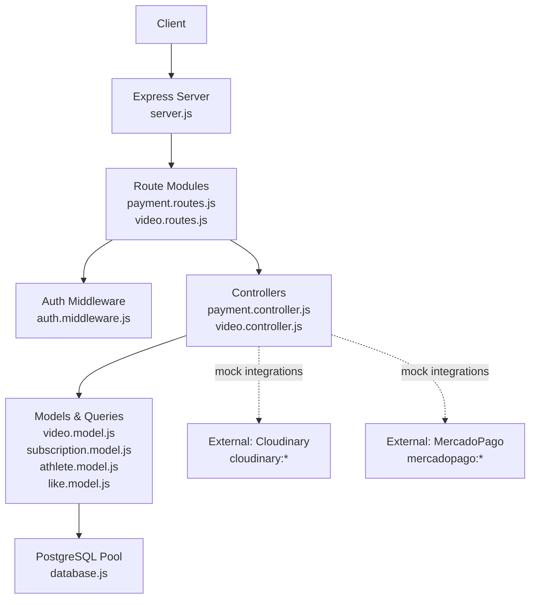
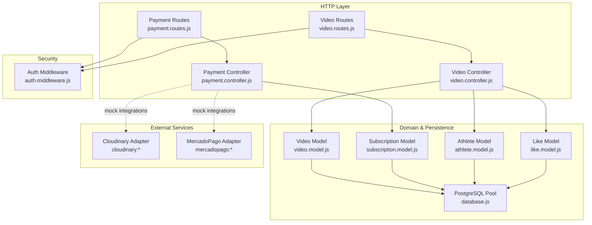
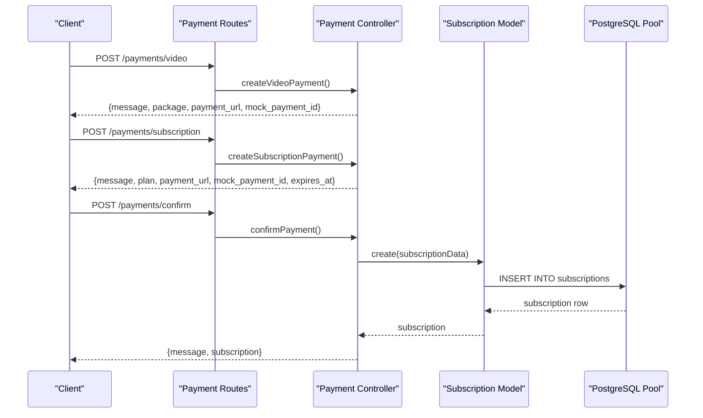
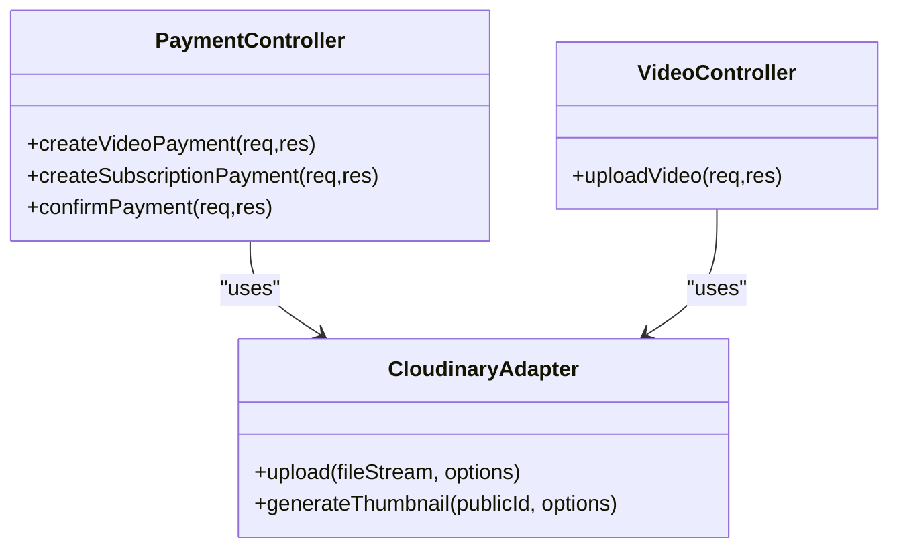
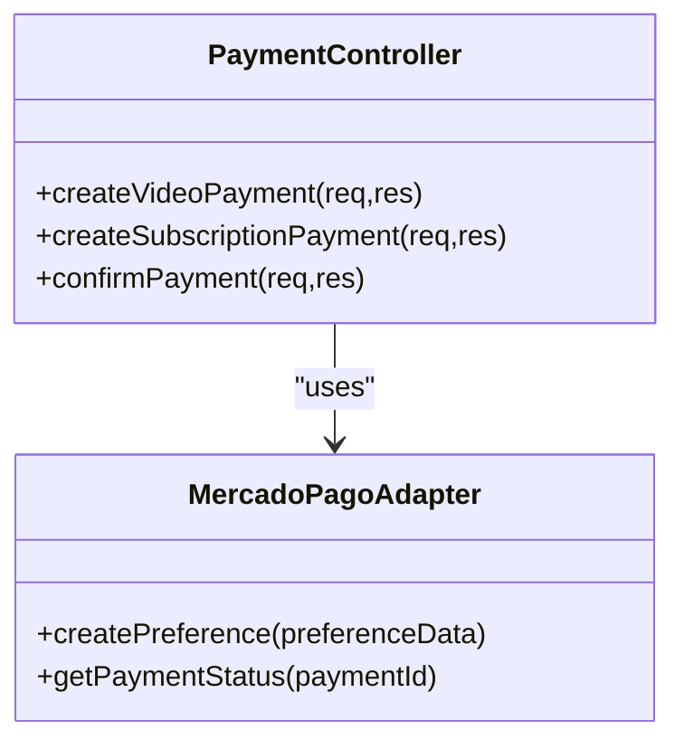
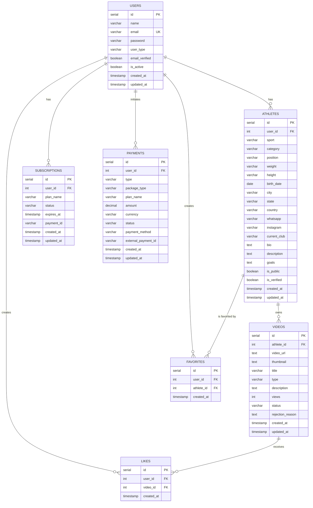
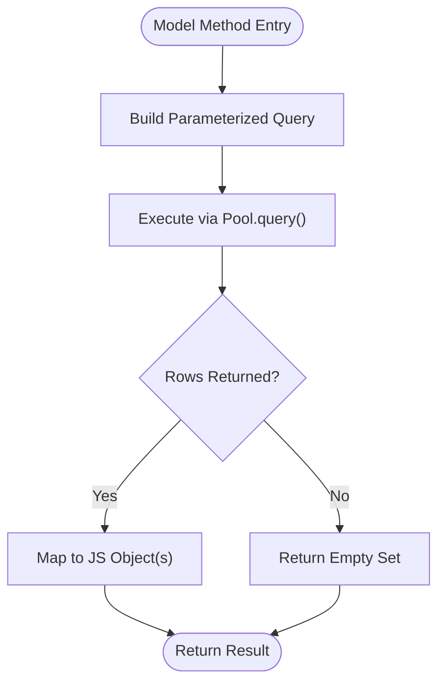
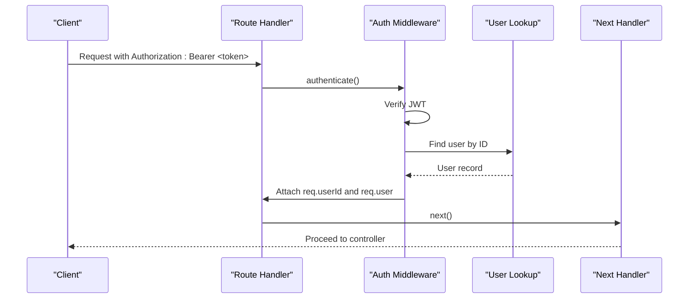
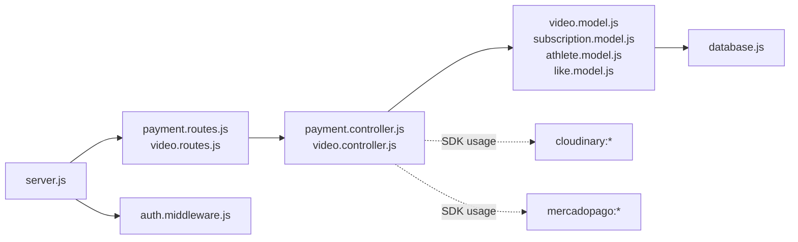

# Integration Patterns

<cite>
**Referenced Files in This Document**
- [server.js](file://backend/server.js)
- [database.js](file://backend/config/database.js)
- [schema.sql](file://database/schema.sql)
- [auth.middleware.js](file://backend/middleware/auth.middleware.js)
- [payment.controller.js](file://backend/controllers/payment.controller.js)
- [payment.routes.js](file://backend/routes/payment.routes.js)
- [video.controller.js](file://backend/controllers/video.controller.js)
- [video.model.js](file://backend/models/video.model.js)
- [video.routes.js](file://backend/routes/video.routes.js)
- [subscription.model.js](file://backend/models/subscription.model.js)
- [athlete.model.js](file://backend/models/athlete.model.js)
- [like.model.js](file://backend/models/like.model.js)
- [package.json](file://backend/package.json)
</cite>

## Table of Contents
1. [Introduction](#introduction)
2. [Project Structure](#project-structure)
3. [Core Components](#core-components)
4. [Architecture Overview](#architecture-overview)
5. [Detailed Component Analysis](#detailed-component-analysis)
6. [Dependency Analysis](#dependency-analysis)
7. [Performance Considerations](#performance-considerations)
8. [Troubleshooting Guide](#troubleshooting-guide)
9. [Conclusion](#conclusion)
10. [Appendices](#appendices)

## Introduction
This document explains the integration patterns implemented in Craque-Vision’s backend for external services and data persistence. It focuses on:
- Adapter-style abstraction for external services (Cloudinary and MercadoPago) via configuration and controller orchestration
- Payment processing flow with mock endpoints and subscription persistence
- PostgreSQL integration with connection pooling, query patterns, indexing, and triggers
- Authentication middleware and authorization guards
- Webhook handling, asynchronous processing, and service-to-service communication patterns

Where applicable, the document references concrete source files and highlights how the codebase implements robust error handling, retry strategies, and scalability considerations.

## Project Structure
The backend follows a layered architecture:
- Entry point initializes Express, loads environment variables, registers routes, and starts the server
- Routes define HTTP endpoints and apply middleware for authentication and authorization
- Controllers implement business logic and coordinate model operations
- Models encapsulate database queries and expose static methods for CRUD operations
- Middleware enforces authentication and authorization policies
- Configuration defines the PostgreSQL connection pool

**Diagram sources**
- [server.js:1-40](file://backend/server.js#L1-L40)
- [auth.middleware.js:1-59](file://backend/middleware/auth.middleware.js#L1-L59)
- [payment.routes.js:1-13](file://backend/routes/payment.routes.js#L1-L13)
- [video.routes.js:1-20](file://backend/routes/video.routes.js#L1-L20)
- [payment.controller.js:1-108](file://backend/controllers/payment.controller.js#L1-L108)
- [video.controller.js:1-111](file://backend/controllers/video.controller.js#L1-L111)
- [video.model.js:1-61](file://backend/models/video.model.js#L1-L61)
- [subscription.model.js:1-55](file://backend/models/subscription.model.js#L1-L55)
- [athlete.model.js:1-119](file://backend/models/athlete.model.js#L1-L119)
- [like.model.js:1-61](file://backend/models/like.model.js#L1-L61)
- [database.js:1-13](file://backend/config/database.js#L1-L13)
- [package.json:10-20](file://backend/package.json#L10-L20)

**Section sources**
- [server.js:1-40](file://backend/server.js#L1-L40)
- [package.json:10-20](file://backend/package.json#L10-L20)

## Core Components
- PostgreSQL connection pool configured via environment variables and exported for reuse across models
- Payment controller orchestrates video and subscription purchase flows with mock endpoints
- Video controller coordinates athlete-specific video operations and integrates with likes
- Models encapsulate SQL queries, joins, and aggregations with parameterized statements
- Authentication middleware validates JWT tokens and enriches requests with user context
- Authorization middleware restricts endpoints to permitted user types

Key integration touchpoints:
- External service adapters: Cloudinary and MercadoPago are declared as dependencies and used in controllers to demonstrate adapter-style integration
- Mock endpoints: Payment controller returns mock payment URLs and identifiers, enabling frontend integration while backend remains decoupled from real providers
- Database persistence: All models persist and query data through the shared pool, leveraging indexes and triggers for performance and auditability

**Section sources**
- [database.js:1-13](file://backend/config/database.js#L1-L13)
- [payment.controller.js:1-108](file://backend/controllers/payment.controller.js#L1-L108)
- [video.controller.js:1-111](file://backend/controllers/video.controller.js#L1-L111)
- [video.model.js:1-61](file://backend/models/video.model.js#L1-L61)
- [subscription.model.js:1-55](file://backend/models/subscription.model.js#L1-L55)
- [auth.middleware.js:1-59](file://backend/middleware/auth.middleware.js#L1-L59)
- [package.json:10-20](file://backend/package.json#L10-L20)

## Architecture Overview
The system integrates external services and databases through a clean separation of concerns:
- Controllers act as adapters between HTTP and domain logic, invoking models and external SDKs
- Models abstract database operations and enforce data integrity
- Middleware secures endpoints and enforces role-based access
- Environment-driven configuration enables flexible deployment across environments

**Diagram sources**
- [payment.routes.js:1-13](file://backend/routes/payment.routes.js#L1-L13)
- [video.routes.js:1-20](file://backend/routes/video.routes.js#L1-L20)
- [payment.controller.js:1-108](file://backend/controllers/payment.controller.js#L1-L108)
- [video.controller.js:1-111](file://backend/controllers/video.controller.js#L1-L111)
- [video.model.js:1-61](file://backend/models/video.model.js#L1-L61)
- [subscription.model.js:1-55](file://backend/models/subscription.model.js#L1-L55)
- [athlete.model.js:1-119](file://backend/models/athlete.model.js#L1-L119)
- [like.model.js:1-61](file://backend/models/like.model.js#L1-L61)
- [database.js:1-13](file://backend/config/database.js#L1-L13)
- [auth.middleware.js:1-59](file://backend/middleware/auth.middleware.js#L1-L59)
- [package.json:10-20](file://backend/package.json#L10-L20)

## Detailed Component Analysis

### Payment Integration Pattern (Adapter + Mock Orchestration)
The payment subsystem demonstrates an adapter pattern:
- Dependencies declare Cloudinary and MercadoPago SDKs
- Controllers expose endpoints to list packages/plans, initiate purchases, and confirm payments
- Confirmation persists subscription records and returns normalized responses
- Mock payment URLs and identifiers enable frontend integration without real provider coupling

**Diagram sources**
- [payment.routes.js:6-10](file://backend/routes/payment.routes.js#L6-L10)
- [payment.controller.js:31-107](file://backend/controllers/payment.controller.js#L31-L107)
- [subscription.model.js:3-16](file://backend/models/subscription.model.js#L3-L16)
- [database.js:1-13](file://backend/config/database.js#L1-L13)

**Section sources**
- [package.json:12-17](file://backend/package.json#L12-L17)
- [payment.controller.js:15-107](file://backend/controllers/payment.controller.js#L15-L107)
- [payment.routes.js:6-10](file://backend/routes/payment.routes.js#L6-L10)
- [subscription.model.js:3-51](file://backend/models/subscription.model.js#L3-L51)

### Video Storage and Processing Integration (Cloudinary Adapter)
Cloudinary integration is declared as a dependency and intended to be used within controllers to upload media and derive thumbnails. The adapter pattern allows swapping providers by changing the adapter module while keeping controllers unchanged.

**Diagram sources**
- [payment.controller.js:31-107](file://backend/controllers/payment.controller.js#L31-L107)
- [video.controller.js:5-32](file://backend/controllers/video.controller.js#L5-L32)
- [package.json:12](file://backend/package.json#L12)

**Section sources**
- [package.json:12](file://backend/package.json#L12)
- [payment.controller.js:31-107](file://backend/controllers/payment.controller.js#L31-L107)
- [video.controller.js:5-32](file://backend/controllers/video.controller.js#L5-L32)

### Payment Provider Integration (MercadoPago Adapter)
MercadoPago integration is declared as a dependency and intended to be used within controllers to create payment preferences and handle checkout redirects. The adapter pattern isolates provider-specific logic behind a unified interface.

**Diagram sources**
- [payment.controller.js:31-107](file://backend/controllers/payment.controller.js#L31-L107)
- [package.json:17](file://backend/package.json#L17)

**Section sources**
- [package.json:17](file://backend/package.json#L17)
- [payment.controller.js:31-107](file://backend/controllers/payment.controller.js#L31-L107)

### Database Integration Patterns (PostgreSQL)
PostgreSQL is integrated via a connection pool configured from environment variables. Models encapsulate queries, joins, and aggregations, ensuring consistent access patterns and parameterized statements for safety.

**Diagram sources**
- [schema.sql:14-184](file://database/schema.sql#L14-L184)

**Diagram sources**
- [video.model.js:7-16](file://backend/models/video.model.js#L7-L16)
- [subscription.model.js:7-16](file://backend/models/subscription.model.js#L7-L16)
- [database.js:4-10](file://backend/config/database.js#L4-L10)

**Section sources**
- [database.js:1-13](file://backend/config/database.js#L1-L13)
- [schema.sql:14-184](file://database/schema.sql#L14-L184)
- [video.model.js:1-61](file://backend/models/video.model.js#L1-L61)
- [subscription.model.js:1-55](file://backend/models/subscription.model.js#L1-L55)
- [athlete.model.js:1-119](file://backend/models/athlete.model.js#L1-L119)
- [like.model.js:1-61](file://backend/models/like.model.js#L1-L61)

### Authentication and Authorization Middleware
Authentication middleware verifies JWT tokens, attaches user context to requests, and handles token expiration and invalid token errors. Authorization middleware restricts endpoints to allowed user types.

**Diagram sources**
- [auth.middleware.js:4-33](file://backend/middleware/auth.middleware.js#L4-L33)

**Section sources**
- [auth.middleware.js:1-59](file://backend/middleware/auth.middleware.js#L1-L59)

### Webhook Handling and Asynchronous Processing
Current code does not implement webhook endpoints or dedicated asynchronous queues. To support production-grade integrations:
- Define webhook endpoints for external services (e.g., payment notifications)
- Implement idempotent handlers with stored event signatures
- Offload long-running tasks to background workers or queues
- Add retry logic with exponential backoff and dead-letter handling

[No sources needed since this section provides general guidance]

### Service-to-Service Communication Protocols
Controllers currently orchestrate internal logic and mock external integrations. For inter-service communication:
- Use signed requests or shared secrets for trust boundaries
- Implement circuit breakers and bulkheads for resilience
- Apply request correlation IDs for observability
- Prefer eventual consistency patterns for cross-service updates

[No sources needed since this section provides general guidance]

## Dependency Analysis
External dependencies relevant to integration patterns:
- Cloudinary: used for media uploads and transformations
- MercadoPago: used for payment preference creation and status checks
- pg: PostgreSQL driver providing connection pooling
- jsonwebtoken: token-based authentication
- dotenv: environment variable loading

**Diagram sources**
- [server.js:1-40](file://backend/server.js#L1-L40)
- [payment.routes.js:1-13](file://backend/routes/payment.routes.js#L1-L13)
- [video.routes.js:1-20](file://backend/routes/video.routes.js#L1-L20)
- [payment.controller.js:1-108](file://backend/controllers/payment.controller.js#L1-L108)
- [video.controller.js:1-111](file://backend/controllers/video.controller.js#L1-L111)
- [video.model.js:1-61](file://backend/models/video.model.js#L1-L61)
- [subscription.model.js:1-55](file://backend/models/subscription.model.js#L1-L55)
- [athlete.model.js:1-119](file://backend/models/athlete.model.js#L1-L119)
- [like.model.js:1-61](file://backend/models/like.model.js#L1-L61)
- [database.js:1-13](file://backend/config/database.js#L1-L13)
- [auth.middleware.js:1-59](file://backend/middleware/auth.middleware.js#L1-L59)
- [package.json:10-20](file://backend/package.json#L10-L20)

**Section sources**
- [package.json:10-20](file://backend/package.json#L10-L20)

## Performance Considerations
- Connection pooling: The pool is configured with environment variables and reused across models to minimize overhead
- Indexes: Strategic indexes on foreign keys and frequently filtered columns improve query performance
- Triggers: Updated-at triggers reduce manual timestamp management and keep audit trails consistent
- Query patterns: Parameterized queries prevent injection and enable plan reuse
- Recommendations:
  - Monitor pool utilization and adjust max connections based on workload
  - Use prepared statements for hot paths
  - Add pagination for large result sets
  - Consider read replicas for heavy read workloads

**Section sources**
- [database.js:4-10](file://backend/config/database.js#L4-L10)
- [schema.sql:140-179](file://database/schema.sql#L140-L179)

## Troubleshooting Guide
Common issues and resolutions:
- Authentication failures:
  - Missing or malformed Authorization header
  - Expired or invalid JWT token
  - User not found after token verification
- Payment flow issues:
  - Invalid package or plan selection
  - Missing payment confirmation payload
  - Subscription persistence errors
- Database connectivity:
  - Incorrect environment variables
  - Pool exhaustion under load
  - Slow queries due to missing indexes
- External service integration:
  - Missing SDK credentials
  - Network timeouts or rate limits
  - Idempotency gaps in webhook handling

Operational checks:
- Verify environment variables for database and JWT
- Confirm pool configuration matches deployment scale
- Review logs for middleware and controller error responses
- Test webhook endpoints with signed events and deduplication

**Section sources**
- [auth.middleware.js:4-33](file://backend/middleware/auth.middleware.js#L4-L33)
- [payment.controller.js:31-107](file://backend/controllers/payment.controller.js#L31-L107)
- [database.js:4-10](file://backend/config/database.js#L4-L10)
- [schema.sql:140-179](file://database/schema.sql#L140-L179)

## Conclusion
Craque-Vision’s backend implements a clear adapter pattern for external services (Cloudinary and MercadoPago) and a robust PostgreSQL integration with connection pooling, indexes, and triggers. Controllers orchestrate payment flows with mock endpoints, while middleware enforces authentication and authorization. For production readiness, integrate webhook endpoints, implement retry/backoff strategies, and adopt asynchronous processing for long-running tasks.

[No sources needed since this section summarizes without analyzing specific files]

## Appendices
- Environment variables to configure:
  - Database: DB_HOST, DB_PORT, DB_NAME, DB_USER, DB_PASSWORD
  - JWT: JWT_SECRET
  - External services: Cloudinary and MercadoPago credentials (as needed)
- Recommended additions:
  - Webhook endpoints for payment providers
  - Background job queue for asynchronous tasks
  - Circuit breaker and retry policies for external calls
  - Health checks and metrics exposure

[No sources needed since this section provides general guidance]