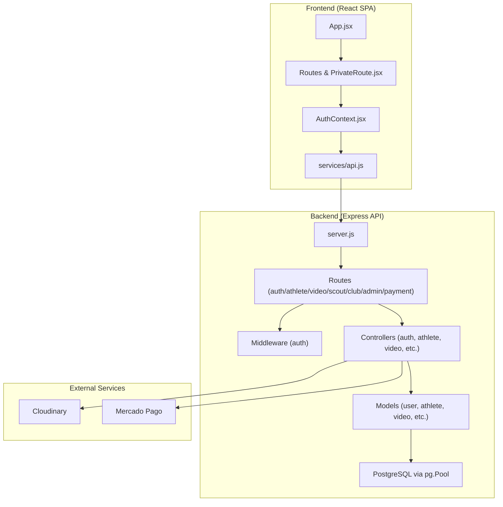
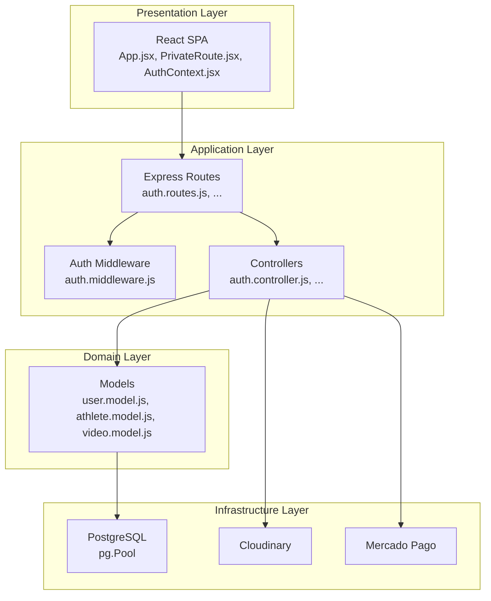
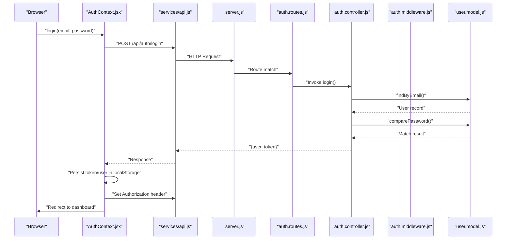
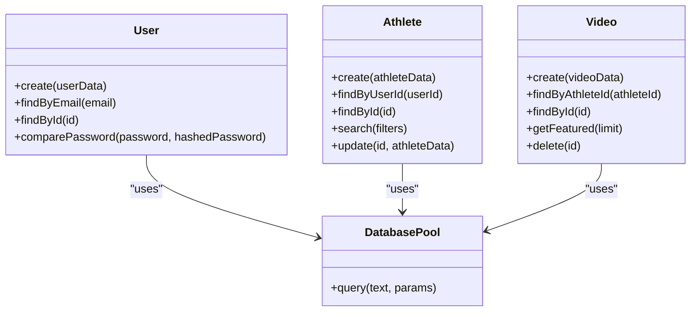
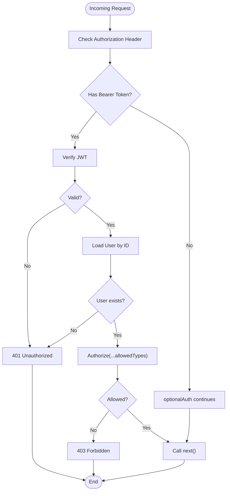
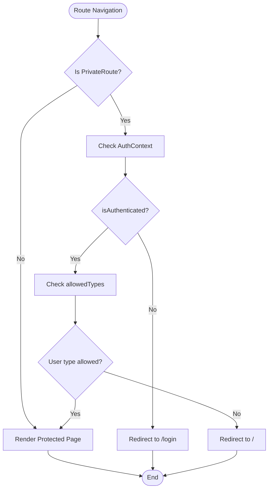
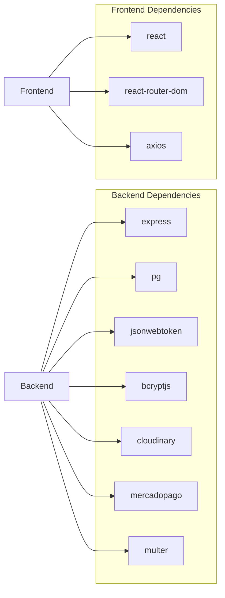
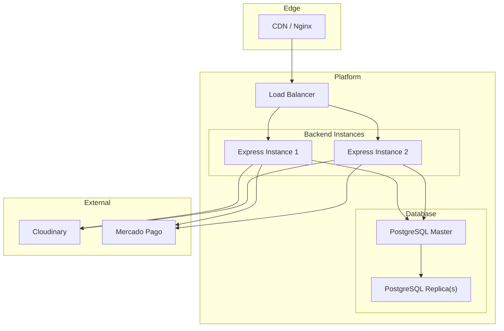

# System Design

<cite>
**Referenced Files in This Document**
- [server.js](file://backend/server.js)
- [database.js](file://backend/config/database.js)
- [auth.middleware.js](file://backend/middleware/auth.middleware.js)
- [user.model.js](file://backend/models/user.model.js)
- [athlete.model.js](file://backend/models/athlete.model.js)
- [video.model.js](file://backend/models/video.model.js)
- [auth.controller.js](file://backend/controllers/auth.controller.js)
- [auth.routes.js](file://backend/routes/auth.routes.js)
- [api.js](file://frontend/src/services/api.js)
- [AuthContext.jsx](file://frontend/src/context/AuthContext.jsx)
- [PrivateRoute.jsx](file://frontend/src/components/PrivateRoute.jsx)
- [App.jsx](file://frontend/src/App.jsx)
- [main.jsx](file://frontend/src/main.jsx)
- [package.json](file://backend/package.json)
- [package.json](file://frontend/package.json)
- [schema.sql](file://database/schema.sql)
</cite>

## Table of Contents
1. [Introduction](#introduction)
2. [Project Structure](#project-structure)
3. [Core Components](#core-components)
4. [Architecture Overview](#architecture-overview)
5. [Detailed Component Analysis](#detailed-component-analysis)
6. [Dependency Analysis](#dependency-analysis)
7. [Performance Considerations](#performance-considerations)
8. [Security Architecture](#security-architecture)
9. [Deployment Topology](#deployment-topology)
10. [Scalability Considerations](#scalability-considerations)
11. [Troubleshooting Guide](#troubleshooting-guide)
12. [Conclusion](#conclusion)

## Introduction
This document describes the system design of Craque-Vision, a platform connecting athletes, scouts, clubs, and administrators. It covers the overall architecture, clean architecture separation, data flow, integration points with external services (Cloudinary and MercadoPago), and operational aspects such as deployment, scalability, and security.

## Project Structure
The system is split into three primary areas:
- Frontend: React Single Page Application (SPA) with routing, context-based authentication, and HTTP client configured for API communication.
- Backend: Express.js REST API exposing modular routes grouped by domain (authentication, athletes, videos, scouts, clubs, admin, payments).
- Database: PostgreSQL schema and connection pool abstraction.

**Diagram sources**
- [server.js:1-40](file://backend/server.js#L1-L40)
- [auth.routes.js:1-11](file://backend/routes/auth.routes.js#L1-L11)
- [auth.middleware.js:1-59](file://backend/middleware/auth.middleware.js#L1-L59)
- [auth.controller.js:1-72](file://backend/controllers/auth.controller.js#L1-L72)
- [user.model.js:1-42](file://backend/models/user.model.js#L1-L42)
- [athlete.model.js:1-119](file://backend/models/athlete.model.js#L1-L119)
- [video.model.js:1-61](file://backend/models/video.model.js#L1-L61)
- [api.js:1-36](file://frontend/src/services/api.js#L1-L36)
- [AuthContext.jsx:1-91](file://frontend/src/context/AuthContext.jsx#L1-L91)
- [PrivateRoute.jsx:1-27](file://frontend/src/components/PrivateRoute.jsx#L1-L27)
- [App.jsx:1-67](file://frontend/src/App.jsx#L1-L67)

**Section sources**
- [server.js:1-40](file://backend/server.js#L1-L40)
- [package.json:1-25](file://backend/package.json#L1-L25)
- [package.json:1-38](file://frontend/package.json#L1-L38)

## Core Components
- Backend server initialization and route registration
- Authentication middleware for JWT verification and role-based authorization
- Domain models encapsulating database operations
- Controllers implementing business logic and coordinating models
- Frontend authentication context and HTTP client with interceptors
- Routing and protected routes for user roles

Key implementation references:
- Backend server and route mounting: [server.js:1-40](file://backend/server.js#L1-L40)
- Authentication middleware: [auth.middleware.js:1-59](file://backend/middleware/auth.middleware.js#L1-L59)
- User model: [user.model.js:1-42](file://backend/models/user.model.js#L1-L42)
- Athlete model: [athlete.model.js:1-119](file://backend/models/athlete.model.js#L1-L119)
- Video model: [video.model.js:1-61](file://backend/models/video.model.js#L1-L61)
- Auth controller: [auth.controller.js:1-72](file://backend/controllers/auth.controller.js#L1-L72)
- Auth routes: [auth.routes.js:1-11](file://backend/routes/auth.routes.js#L1-L11)
- Frontend API client: [api.js:1-36](file://frontend/src/services/api.js#L1-L36)
- Auth context: [AuthContext.jsx:1-91](file://frontend/src/context/AuthContext.jsx#L1-L91)
- Protected routing: [PrivateRoute.jsx:1-27](file://frontend/src/components/PrivateRoute.jsx#L1-L27)
- App routing: [App.jsx:1-67](file://frontend/src/App.jsx#L1-L67)

**Section sources**
- [server.js:1-40](file://backend/server.js#L1-L40)
- [auth.middleware.js:1-59](file://backend/middleware/auth.middleware.js#L1-L59)
- [user.model.js:1-42](file://backend/models/user.model.js#L1-L42)
- [athlete.model.js:1-119](file://backend/models/athlete.model.js#L1-L119)
- [video.model.js:1-61](file://backend/models/video.model.js#L1-L61)
- [auth.controller.js:1-72](file://backend/controllers/auth.controller.js#L1-L72)
- [auth.routes.js:1-11](file://backend/routes/auth.routes.js#L1-L11)
- [api.js:1-36](file://frontend/src/services/api.js#L1-L36)
- [AuthContext.jsx:1-91](file://frontend/src/context/AuthContext.jsx#L1-L91)
- [PrivateRoute.jsx:1-27](file://frontend/src/components/PrivateRoute.jsx#L1-L27)
- [App.jsx:1-67](file://frontend/src/App.jsx#L1-L67)

## Architecture Overview
Clean architecture pattern with clear separation of concerns:
- Presentation layer (Frontend): React SPA with routing and context.
- Application layer (Backend): Express routes, middleware, and controllers.
- Domain layer (Backend): Models encapsulate data access and queries.
- Infrastructure layer (Backend): Database connection pool and external service integrations.

**Diagram sources**
- [App.jsx:1-67](file://frontend/src/App.jsx#L1-L67)
- [PrivateRoute.jsx:1-27](file://frontend/src/components/PrivateRoute.jsx#L1-L27)
- [AuthContext.jsx:1-91](file://frontend/src/context/AuthContext.jsx#L1-L91)
- [auth.routes.js:1-11](file://backend/routes/auth.routes.js#L1-L11)
- [auth.middleware.js:1-59](file://backend/middleware/auth.middleware.js#L1-L59)
- [auth.controller.js:1-72](file://backend/controllers/auth.controller.js#L1-L72)
- [user.model.js:1-42](file://backend/models/user.model.js#L1-L42)
- [athlete.model.js:1-119](file://backend/models/athlete.model.js#L1-L119)
- [video.model.js:1-61](file://backend/models/video.model.js#L1-L61)
- [database.js:1-13](file://backend/config/database.js#L1-L13)

## Detailed Component Analysis

### Authentication Flow (Frontend to Backend)
End-to-end authentication flow from login to protected routes.

**Diagram sources**
- [AuthContext.jsx:21-38](file://frontend/src/context/AuthContext.jsx#L21-L38)
- [api.js:10-21](file://frontend/src/services/api.js#L10-L21)
- [server.js:20-26](file://backend/server.js#L20-L26)
- [auth.routes.js:6-8](file://backend/routes/auth.routes.js#L6-L8)
- [auth.controller.js:30-59](file://backend/controllers/auth.controller.js#L30-L59)
- [user.model.js:20-38](file://backend/models/user.model.js#L20-L38)

**Section sources**
- [AuthContext.jsx:1-91](file://frontend/src/context/AuthContext.jsx#L1-L91)
- [api.js:1-36](file://frontend/src/services/api.js#L1-L36)
- [server.js:1-40](file://backend/server.js#L1-L40)
- [auth.routes.js:1-11](file://backend/routes/auth.routes.js#L1-L11)
- [auth.controller.js:1-72](file://backend/controllers/auth.controller.js#L1-L72)
- [user.model.js:1-42](file://backend/models/user.model.js#L1-L42)

### Data Access Patterns (Models)
Models encapsulate SQL operations and expose static methods for controllers.

**Diagram sources**
- [user.model.js:1-42](file://backend/models/user.model.js#L1-L42)
- [athlete.model.js:1-119](file://backend/models/athlete.model.js#L1-L119)
- [video.model.js:1-61](file://backend/models/video.model.js#L1-L61)
- [database.js:1-13](file://backend/config/database.js#L1-L13)

**Section sources**
- [user.model.js:1-42](file://backend/models/user.model.js#L1-L42)
- [athlete.model.js:1-119](file://backend/models/athlete.model.js#L1-L119)
- [video.model.js:1-61](file://backend/models/video.model.js#L1-L61)
- [database.js:1-13](file://backend/config/database.js#L1-L13)

### Authorization and Role-Based Access Control
Role-based enforcement occurs via middleware and route protection.

**Diagram sources**
- [auth.middleware.js:4-42](file://backend/middleware/auth.middleware.js#L4-L42)

**Section sources**
- [auth.middleware.js:1-59](file://backend/middleware/auth.middleware.js#L1-L59)

### Frontend Routing and Protected Access
Protected routes enforce authentication and role checks.

**Diagram sources**
- [PrivateRoute.jsx:4-24](file://frontend/src/components/PrivateRoute.jsx#L4-L24)
- [App.jsx:36-55](file://frontend/src/App.jsx#L36-L55)

**Section sources**
- [PrivateRoute.jsx:1-27](file://frontend/src/components/PrivateRoute.jsx#L1-L27)
- [App.jsx:1-67](file://frontend/src/App.jsx#L1-L67)

## Dependency Analysis
- Backend depends on Express, CORS, dotenv, bcryptjs, jsonwebtoken, multer, pg, cloudinary, and mercadopago.
- Frontend depends on React, react-router-dom, axios, TailwindCSS/Vite toolchain.
- Models depend on the database pool abstraction.
- Controllers depend on models and external services (Cloudinary/Mercado Pago).
- Frontend services depend on environment variables for base URL and interceptors for auth.

**Diagram sources**
- [package.json:10-20](file://backend/package.json#L10-L20)
- [package.json:6-12](file://frontend/package.json#L6-L12)

**Section sources**
- [package.json:1-25](file://backend/package.json#L1-L25)
- [package.json:1-38](file://frontend/package.json#L1-L38)

## Performance Considerations
- Database pooling: Use the existing pg.Pool to reuse connections efficiently.
- Query optimization: Prefer indexed columns in filters (e.g., athletes.search filters).
- Caching: Consider caching frequently accessed public data (e.g., featured videos).
- CDN offload: Serve media assets via Cloudinary to reduce origin bandwidth.
- Compression: Enable gzip/deflate on the Express server.
- Pagination: Implement pagination for listing endpoints to limit payload sizes.
- Connection limits: Tune pool.max and pool.idleTimeoutMillis according to expected concurrency.

## Security Architecture
- Authentication: JWT-based bearer tokens stored in localStorage after login.
- Authorization: Role-based access control enforced by middleware and route guards.
- Password hashing: bcrypt used for secure password storage.
- CORS: Enabled globally; restrict origins in production.
- HTTPS: Enforce TLS termination at reverse proxy/load balancer.
- Input validation: Add schema validation and sanitization for all endpoints.
- CSRF: Not applicable for SPA with token-based auth; ensure SameSite cookies if using cookies.
- Secrets: Store JWT secret and DB credentials in environment variables.

**Section sources**
- [auth.middleware.js:1-59](file://backend/middleware/auth.middleware.js#L1-L59)
- [user.model.js:1-42](file://backend/models/user.model.js#L1-L42)
- [server.js:17-18](file://backend/server.js#L17-L18)

## Deployment Topology
Recommended deployment layout:
- Frontend: Host static assets behind a CDN or Nginx with HTTPS.
- Backend: Run multiple instances behind a load balancer with health checks.
- Database: Managed PostgreSQL (e.g., AWS RDS/Azure Database) with read replicas if needed.
- External Services: Integrate Cloudinary and Mercado Pago SDKs in backend controllers.

[No sources needed since this diagram shows conceptual deployment topology]

## Scalability Considerations
- Horizontal scaling: Stateless backend allows easy instance addition.
- Database scaling: Use read replicas for SELECT-heavy workloads; partition large tables if growth demands.
- Caching: Redis for session-like data and computed aggregates.
- Asynchronous tasks: Offload heavy operations (e.g., video processing) to queue workers.
- Health checks: Expose readiness/liveness probes for container orchestration.
- Circuit breakers: Wrap external service calls to prevent cascading failures.

## Troubleshooting Guide
Common issues and remedies:
- 401 Unauthorized on protected routes: Verify token presence and validity; check interceptor injection.
- 403 Forbidden: Confirm user role matches allowedTypes in PrivateRoute.
- Database connectivity: Validate DB_HOST, DB_PORT, DB_NAME, DB_USER, DB_PASSWORD.
- CORS errors: Ensure frontend base URL and backend CORS configuration align.
- External service failures: Wrap Cloudinary/Mercado Pago calls with retries and fallbacks.

Operational references:
- Frontend auth interceptor and redirects on 401: [api.js:23-33](file://frontend/src/services/api.js#L23-L33)
- Frontend token persistence and provider setup: [AuthContext.jsx:10-19](file://frontend/src/context/AuthContext.jsx#L10-L19)
- Backend CORS and JSON body parsing: [server.js:17-18](file://backend/server.js#L17-L18)
- Database connection configuration: [database.js:4-10](file://backend/config/database.js#L4-L10)

**Section sources**
- [api.js:1-36](file://frontend/src/services/api.js#L1-L36)
- [AuthContext.jsx:1-91](file://frontend/src/context/AuthContext.jsx#L1-L91)
- [server.js:1-40](file://backend/server.js#L1-L40)
- [database.js:1-13](file://backend/config/database.js#L1-L13)

## Conclusion
Craque-Vision follows a clean architecture with clear separation between presentation, application, domain, and infrastructure layers. The system leverages JWT-based authentication, role-based authorization, and modular controllers to support distinct user personas. With proper deployment, caching, and external service integration, the platform can scale to serve athletes, scouts, clubs, and administrators effectively while maintaining strong security and operability.