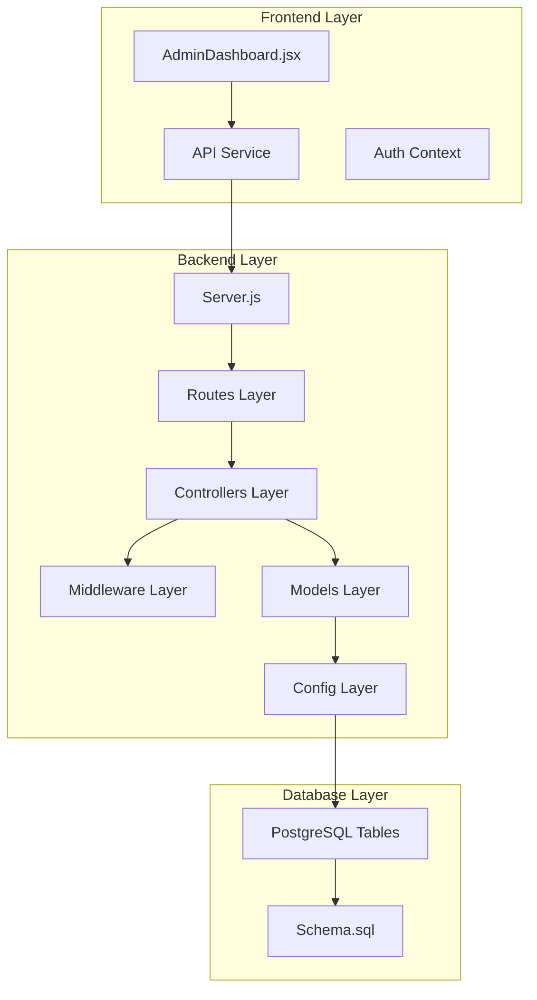
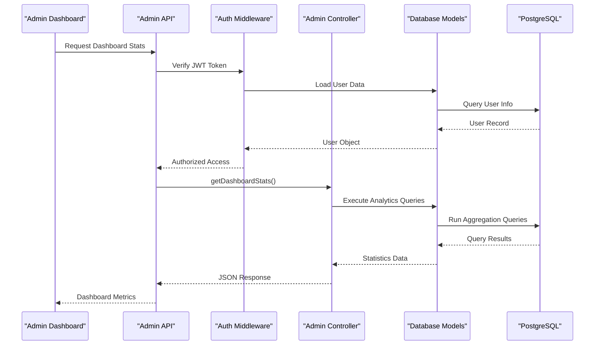
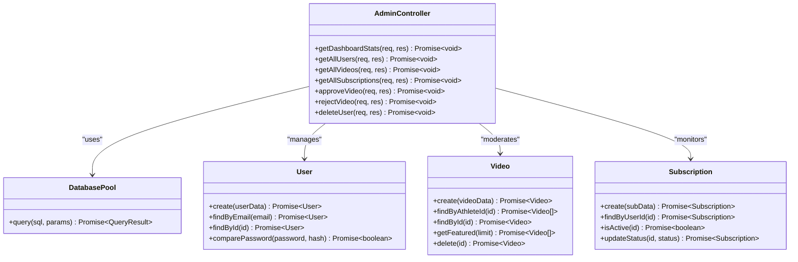
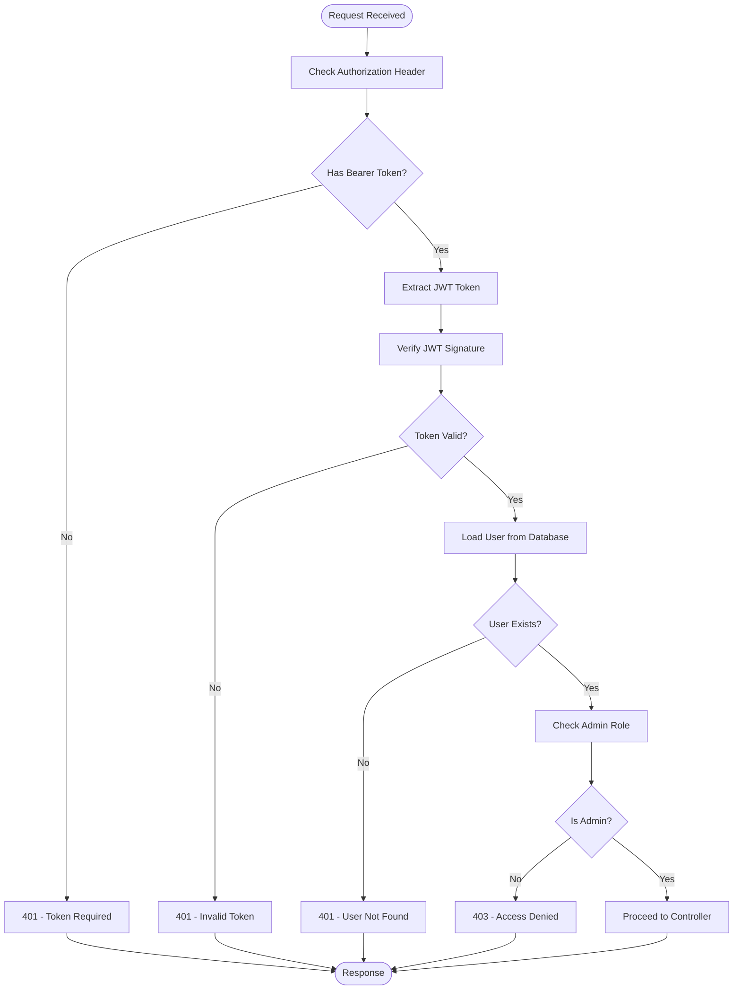
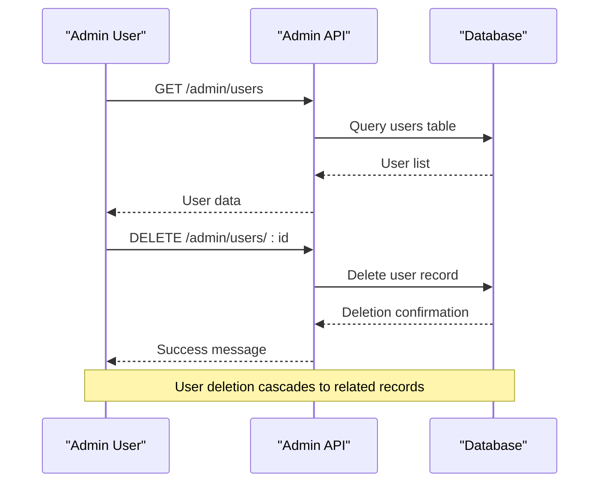
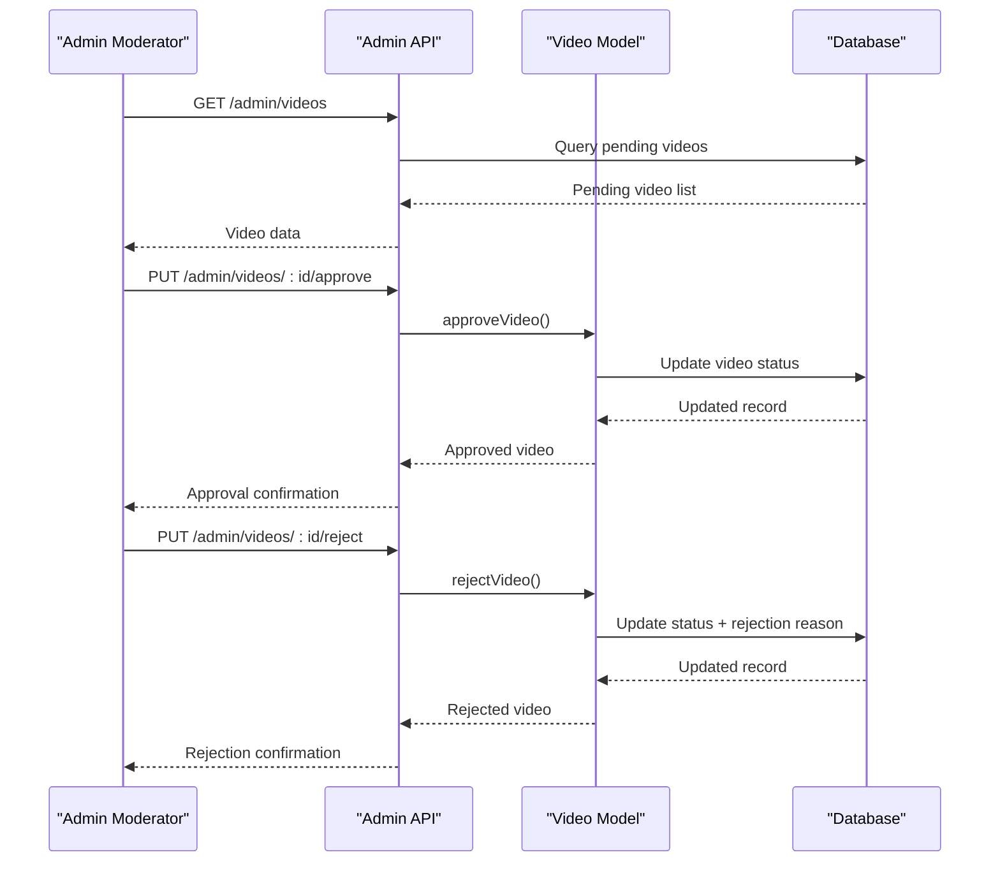
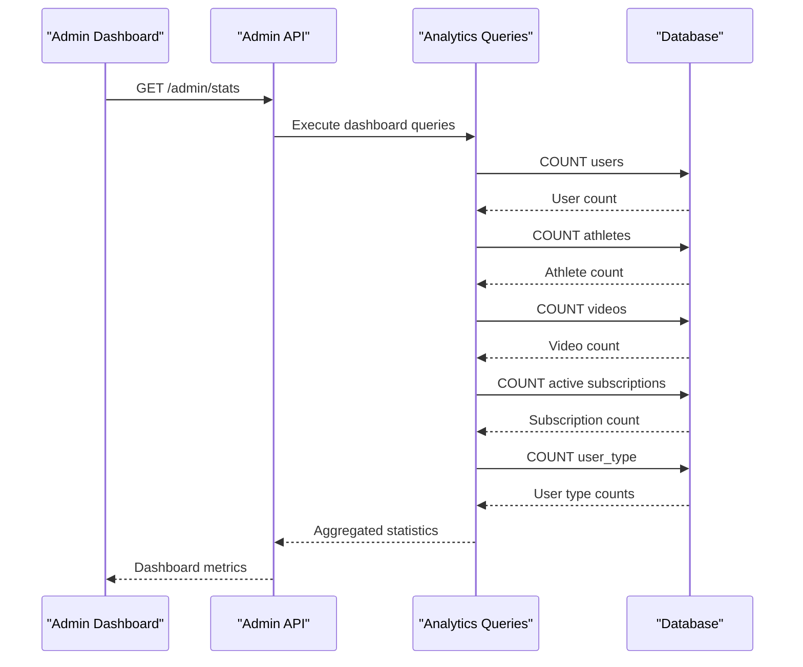

# Administrative Features

<cite>
**Referenced Files in This Document**
- [admin.controller.js](file://backend/controllers/admin.controller.js)
- [admin.routes.js](file://backend/routes/admin.routes.js)
- [auth.middleware.js](file://backend/middleware/auth.middleware.js)
- [auth.controller.js](file://backend/controllers/auth.controller.js)
- [user.model.js](file://backend/models/user.model.js)
- [video.model.js](file://backend/models/video.model.js)
- [athlete.model.js](file://backend/models/athlete.model.js)
- [subscription.model.js](file://backend/models/subscription.model.js)
- [database.js](file://backend/config/database.js)
- [server.js](file://backend/server.js)
- [schema.sql](file://database/schema.sql)
- [AdminDashboard.jsx](file://frontend/src/pages/AdminDashboard.jsx)
- [api.js](file://frontend/src/services/api.js)
</cite>

## Table of Contents
1. [Introduction](#introduction)
2. [Project Structure](#project-structure)
3. [Core Components](#core-components)
4. [Architecture Overview](#architecture-overview)
5. [Detailed Component Analysis](#detailed-component-analysis)
6. [API Reference](#api-reference)
7. [Security and Authorization](#security-and-authorization)
8. [Administrative Workflows](#administrative-workflows)
9. [System Monitoring](#system-monitoring)
10. [Content Moderation](#content-moderation)
11. [User Management](#user-management)
12. [Subscription Management](#subscription-management)
13. [Audit Trails and Permissions](#audit-trails-and-permissions)
14. [Troubleshooting Guide](#troubleshooting-guide)
15. [Conclusion](#conclusion)

## Introduction

The Administrative Dashboard and System Management features provide comprehensive administrative capabilities for the Craque Vision platform. This system enables administrators to monitor platform health, manage user accounts, moderate content, track subscriptions, and maintain overall system integrity. The administrative interface combines robust backend APIs with a React-based frontend dashboard, providing real-time insights and operational controls.

The administrative system is built on a secure foundation with role-based access control, JWT authentication, and comprehensive data validation. It supports multiple user types (athlete, scout, club, admin) while maintaining strict separation of privileges through the admin role designation.

## Project Structure

The administrative system follows a modular architecture with clear separation of concerns:



**Diagram sources**
- [server.js:1-40](file://backend/server.js#L1-L40)
- [admin.routes.js:1-15](file://backend/routes/admin.routes.js#L1-L15)
- [admin.controller.js:1-121](file://backend/controllers/admin.controller.js#L1-L121)

**Section sources**
- [server.js:1-40](file://backend/server.js#L1-L40)
- [admin.routes.js:1-15](file://backend/routes/admin.routes.js#L1-L15)

## Core Components

The administrative system consists of several interconnected components that work together to provide comprehensive platform management capabilities:

### Authentication and Authorization
The system implements a two-tier authentication system:
- **JWT Token Authentication**: Secure session management with 7-day expiration
- **Role-Based Access Control**: Strict admin-only endpoint protection
- **Optional Authentication**: Support for public endpoints requiring no authentication

### Data Management Layer
The system manages four primary data domains:
- **User Management**: Complete user lifecycle management
- **Content Moderation**: Video approval and rejection workflows
- **Analytics Dashboard**: Real-time platform statistics
- **Subscription Tracking**: Revenue and membership monitoring

### Frontend Interface
The React-based administrative dashboard provides:
- Real-time data visualization
- Interactive management controls
- Responsive design for various screen sizes
- Comprehensive filtering and sorting capabilities

**Section sources**
- [auth.middleware.js:1-59](file://backend/middleware/auth.middleware.js#L1-L59)
- [auth.controller.js:1-72](file://backend/controllers/auth.controller.js#L1-L72)
- [AdminDashboard.jsx:1-317](file://frontend/src/pages/AdminDashboard.jsx#L1-L317)

## Architecture Overview

The administrative architecture follows a layered pattern with clear separation between presentation, business logic, and data access layers:



**Diagram sources**
- [admin.routes.js:6-12](file://backend/routes/admin.routes.js#L6-L12)
- [auth.middleware.js:4-33](file://backend/middleware/auth.middleware.js#L4-L33)
- [admin.controller.js:7-31](file://backend/controllers/admin.controller.js#L7-L31)

The architecture ensures that all administrative operations are:
- **Secure**: Through mandatory JWT authentication and role verification
- **Scalable**: With modular components and efficient database queries
- **Maintainable**: Following clean separation of concerns and consistent patterns

## Detailed Component Analysis

### Admin Controller Implementation

The Admin Controller serves as the central business logic layer for administrative operations:



**Diagram sources**
- [admin.controller.js:1-121](file://backend/controllers/admin.controller.js#L1-L121)
- [user.model.js:4-42](file://backend/models/user.model.js#L4-L42)
- [video.model.js:3-61](file://backend/models/video.model.js#L3-L61)
- [subscription.model.js:3-55](file://backend/models/subscription.model.js#L3-L55)

### Authentication Middleware

The authentication system implements a sophisticated token-based security mechanism:



**Diagram sources**
- [auth.middleware.js:4-42](file://backend/middleware/auth.middleware.js#L4-L42)

**Section sources**
- [admin.controller.js:1-121](file://backend/controllers/admin.controller.js#L1-L121)
- [auth.middleware.js:1-59](file://backend/middleware/auth.middleware.js#L1-L59)

## API Reference

### Base URL and Authentication

**Base URL**: `/api/admin`

All administrative endpoints require:
- **Authorization Header**: `Bearer <JWT_TOKEN>`
- **Admin Role**: Must have `user_type = 'admin'`
- **Token Expiration**: 7-day validity period

### Dashboard Analytics Endpoints

#### GET /stats
Retrieves comprehensive platform statistics for the administrative dashboard.

**Request**:
```
GET /api/admin/stats
Authorization: Bearer <token>
```

**Response**:
```json
{
  "total_users": 150,
  "total_athletes": 120,
  "total_videos": 850,
  "active_subscriptions": 45,
  "athletes_count": 120,
  "scouts_count": 15,
  "clubs_count": 15
}
```

**Section sources**
- [admin.routes.js:6](file://backend/routes/admin.routes.js#L6)
- [admin.controller.js:7-31](file://backend/controllers/admin.controller.js#L7-L31)

### User Management Endpoints

#### GET /users
Retrieves all registered users with pagination and sorting capabilities.

**Request**:
```
GET /api/admin/users
Authorization: Bearer <token>
```

**Response**:
```json
[
  {
    "id": 1,
    "name": "John Doe",
    "email": "john@example.com",
    "user_type": "athlete",
    "created_at": "2024-01-15T10:30:00Z"
  },
  {
    "id": 2,
    "name": "Jane Smith",
    "email": "jane@example.com",
    "user_type": "club",
    "created_at": "2024-01-14T14:22:00Z"
  }
]
```

**Section sources**
- [admin.routes.js:7](file://backend/routes/admin.routes.js#L7)
- [admin.controller.js:33-45](file://backend/controllers/admin.controller.js#L33-L45)

#### DELETE /users/:id
Deletes a user account and associated data.

**Request**:
```
DELETE /api/admin/users/123
Authorization: Bearer <token>
```

**Response**:
```json
{
  "message": "Usuário excluído"
}
```

**Section sources**
- [admin.routes.js:12](file://backend/routes/admin.routes.js#L12)
- [admin.controller.js:112-121](file://backend/controllers/admin.controller.js#L112-L121)

### Content Management Endpoints

#### GET /videos
Retrieves all uploaded videos with athlete and sport information.

**Request**:
```
GET /api/admin/videos
Authorization: Bearer <token>
```

**Response**:
```json
[
  {
    "id": 1,
    "athlete_id": 5,
    "video_url": "https://example.com/video.mp4",
    "thumbnail": "https://example.com/thumb.jpg",
    "title": "Training Session",
    "type": "training",
    "description": "Morning training session",
    "views": 120,
    "status": "pending",
    "rejection_reason": null,
    "created_at": "2024-01-15T10:30:00Z",
    "updated_at": "2024-01-15T10:30:00Z",
    "athlete_name": "John Doe",
    "sport": "Football"
  }
]
```

**Section sources**
- [admin.routes.js:8](file://backend/routes/admin.routes.js#L8)
- [admin.controller.js:47-61](file://backend/controllers/admin.controller.js#L47-L61)

#### PUT /videos/:id/approve
Approves a pending video for public visibility.

**Request**:
```
PUT /api/admin/videos/456/approve
Authorization: Bearer <token>
```

**Response**:
```json
{
  "message": "Vídeo aprovado",
  "video": {
    "id": 456,
    "status": "approved",
    "title": "Training Session",
    "athlete_id": 5,
    "video_url": "https://example.com/video.mp4"
  }
}
```

**Section sources**
- [admin.routes.js:10](file://backend/routes/admin.routes.js#L10)
- [admin.controller.js:78-92](file://backend/controllers/admin.controller.js#L78-L92)

#### PUT /videos/:id/reject
Rejects a video with specified reason.

**Request**:
```
PUT /api/admin/videos/456/reject
Authorization: Bearer <token>
Content-Type: application/json

{
  "reason": "Violent content detected"
}
```

**Response**:
```json
{
  "message": "Vídeo rejeitado",
  "video": {
    "id": 456,
    "status": "rejected",
    "rejection_reason": "Violent content detected"
  }
}
```

**Section sources**
- [admin.routes.js:11](file://backend/routes/admin.routes.js#L11)
- [admin.controller.js:94-110](file://backend/controllers/admin.controller.js#L94-L110)

### Subscription Management Endpoints

#### GET /subscriptions
Retrieves all subscription records with user information.

**Request**:
```
GET /api/admin/subscriptions
Authorization: Bearer <token>
```

**Response**:
```json
[
  {
    "id": 1,
    "user_id": 10,
    "plan_name": "Premium Monthly",
    "status": "active",
    "expires_at": "2024-02-15T10:30:00Z",
    "payment_id": "pay_abc123",
    "created_at": "2024-01-15T10:30:00Z",
    "updated_at": "2024-01-15T10:30:00Z",
    "user_name": "John Doe",
    "email": "john@example.com"
  }
]
```

**Section sources**
- [admin.routes.js:9](file://backend/routes/admin.routes.js#L9)
- [admin.controller.js:63-76](file://backend/controllers/admin.controller.js#L63-L76)

## Security and Authorization

### Role-Based Access Control

The administrative system implements strict role-based access control through the authorization middleware:

```mermaid
flowchart LR
subgraph "User Types"
A[athlete] --> D[Basic User]
B[scout] --> D
C[club] --> D
E[admin] --> F[Administrator]
end
subgraph "Access Levels"
D --> G[Standard Endpoints]
F --> H[Admin Endpoints]
F --> I[All Endpoints]
end
H --> J[/api/admin/*]
I --> K[/api/*]
```

**Diagram sources**
- [auth.middleware.js:35-42](file://backend/middleware/auth.middleware.js#L35-L42)
- [schema.sql:19](file://database/schema.sql#L19)

### JWT Token Security

The authentication system employs industry-standard security practices:

- **Token Generation**: HS256 algorithm with configurable expiration
- **Token Validation**: Signature verification and expiration checking
- **Error Handling**: Specific error responses for different failure scenarios
- **Token Storage**: Client-side storage with automatic cleanup on logout

### Database Security

The database layer implements multiple security measures:

- **SQL Injection Prevention**: Parameterized queries throughout
- **Data Validation**: Type checking and constraint enforcement
- **Index Protection**: Optimized indexing for security and performance
- **Connection Pooling**: Efficient resource management

**Section sources**
- [auth.middleware.js:1-59](file://backend/middleware/auth.middleware.js#L1-L59)
- [auth.controller.js:4-6](file://backend/controllers/auth.controller.js#L4-L6)
- [schema.sql:181-185](file://database/schema.sql#L181-L185)

## Administrative Workflows

### User Account Management Workflow



**Diagram sources**
- [admin.routes.js:7](file://backend/routes/admin.routes.js#L7)
- [admin.controller.js:112-121](file://backend/controllers/admin.controller.js#L112-L121)

### Content Moderation Workflow



**Diagram sources**
- [admin.routes.js:10-11](file://backend/routes/admin.routes.js#L10-L11)
- [admin.controller.js:78-110](file://backend/controllers/admin.controller.js#L78-L110)

### System Monitoring Workflow



**Diagram sources**
- [admin.controller.js:7-31](file://backend/controllers/admin.controller.js#L7-L31)

**Section sources**
- [AdminDashboard.jsx:21-39](file://frontend/src/pages/AdminDashboard.jsx#L21-L39)

## System Monitoring

### Dashboard Analytics

The administrative dashboard provides comprehensive system monitoring through aggregated statistics:

#### Key Metrics
- **Total Users**: Platform-wide user registration count
- **Active Subscriptions**: Currently paid subscription holders
- **Content Volume**: Total video uploads and pending approvals
- **User Distribution**: Breakdown by user type (athlete, scout, club)

#### Real-Time Updates
The dashboard automatically refreshes data through concurrent API requests, providing up-to-date insights into platform health and growth metrics.

**Section sources**
- [admin.controller.js:7-31](file://backend/controllers/admin.controller.js#L7-L31)
- [AdminDashboard.jsx:21-39](file://frontend/src/pages/AdminDashboard.jsx#L21-L39)

## Content Moderation

### Video Approval Workflow

The content moderation system implements a comprehensive approval process:

#### Pending Content Review
- **Automatic Detection**: Videos marked as `pending` awaiting review
- **Moderator Interface**: Clear presentation of video details and metadata
- **Approval Process**: Single-click approval with immediate publication
- **Rejection Process**: Structured rejection with customizable reasons

#### Quality Standards
Content moderation follows established guidelines for:
- **Inappropriate Content**: Violence, explicit material, or policy violations
- **Technical Quality**: Poor upload quality or missing metadata
- **Platform Compliance**: Terms of service adherence

**Section sources**
- [admin.controller.js:78-110](file://backend/controllers/admin.controller.js#L78-L110)
- [AdminDashboard.jsx:41-57](file://frontend/src/pages/AdminDashboard.jsx#L41-L57)

## User Management

### User Lifecycle Management

The administrative user management system supports complete user lifecycle operations:

#### User Discovery
- **Search and Filter**: By email, user type, registration date
- **Activity Monitoring**: Last login and engagement metrics
- **Status Management**: Account activation/deactivation controls

#### Account Administration
- **Deletion Operations**: Complete user account removal
- **Role Changes**: User type modifications (with caution)
- **Verification Status**: Email verification and profile completion tracking

**Section sources**
- [admin.controller.js:33-45](file://backend/controllers/admin.controller.js#L33-L45)
- [admin.controller.js:112-121](file://backend/controllers/admin.controller.js#L112-L121)
- [AdminDashboard.jsx:198-224](file://frontend/src/pages/AdminDashboard.jsx#L198-L224)

## Subscription Management

### Revenue and Membership Monitoring

The subscription management system provides comprehensive oversight of platform monetization:

#### Subscription Analytics
- **Revenue Tracking**: Active subscription revenue streams
- **Churn Analysis**: Subscription cancellation and renewal patterns
- **Plan Performance**: Individual plan popularity and effectiveness
- **Expiration Monitoring**: Upcoming subscription expirations

#### Administrative Controls
- **Manual Status Updates**: Subscription status modification
- **Payment Verification**: Payment processing validation
- **Refund Processing**: Automated refund workflows

**Section sources**
- [admin.controller.js:63-76](file://backend/controllers/admin.controller.js#L63-L76)
- [AdminDashboard.jsx:288-304](file://frontend/src/pages/AdminDashboard.jsx#L288-L304)

## Audit Trails and Permissions

### Administrative Permissions Matrix

| Endpoint | Method | Required Role | Purpose |
|----------|--------|---------------|---------|
| `/admin/stats` | GET | admin | Dashboard analytics |
| `/admin/users` | GET | admin | User listing |
| `/admin/users/:id` | DELETE | admin | User deletion |
| `/admin/videos` | GET | admin | Video listing |
| `/admin/videos/:id/approve` | PUT | admin | Video approval |
| `/admin/videos/:id/reject` | PUT | admin | Video rejection |
| `/admin/subscriptions` | GET | admin | Subscription listing |

### Security Controls

The administrative system implements multiple layers of security:

#### Authentication Controls
- **Token-Based Authentication**: JWT for secure session management
- **Automatic Token Refresh**: 7-day expiration with renewal capability
- **Session Timeout**: Graceful handling of expired sessions

#### Authorization Controls
- **Role Verification**: Dynamic role checking for each request
- **Endpoint Protection**: Middleware protection for all admin routes
- **Permission Auditing**: Comprehensive logging of administrative actions

#### Data Protection
- **SQL Injection Prevention**: Parameterized queries throughout
- **Data Validation**: Input sanitization and validation
- **Privacy Compliance**: User data protection and GDPR considerations

**Section sources**
- [admin.routes.js:6-12](file://backend/routes/admin.routes.js#L6-L12)
- [auth.middleware.js:35-42](file://backend/middleware/auth.middleware.js#L35-L42)
- [schema.sql:19](file://database/schema.sql#L19)

## Troubleshooting Guide

### Common Authentication Issues

#### Token Not Provided
**Symptoms**: 401 Unauthorized responses
**Solution**: Ensure Authorization header includes valid Bearer token
**Prevention**: Implement proper token storage and automatic header injection

#### Token Expired
**Symptoms**: 401 Token expired error
**Solution**: Generate new token using refresh mechanism
**Prevention**: Implement automatic token renewal in client application

#### Invalid Token
**Symptoms**: 401 Invalid token error
**Solution**: Verify JWT_SECRET environment variable and token integrity
**Prevention**: Use consistent secret management across deployment environments

### Database Connection Issues

#### Connection Pool Exhaustion
**Symptoms**: Database timeout errors and slow response times
**Solution**: Monitor connection pool usage and adjust pool size
**Prevention**: Implement proper connection lifecycle management

#### Query Performance Issues
**Symptoms**: Slow administrative operations and dashboard loading
**Solution**: Review query execution plans and add appropriate indexes
**Prevention**: Regular database maintenance and query optimization

### Frontend Integration Issues

#### API Communication Failures
**Symptoms**: Network errors and failed administrative operations
**Solution**: Verify API base URL configuration and CORS settings
**Prevention**: Implement robust error handling and retry mechanisms

#### Authentication State Synchronization
**Symptoms**: Mixed authentication states and inconsistent UI behavior
**Solution**: Ensure proper token synchronization and state management
**Prevention**: Implement centralized authentication state management

**Section sources**
- [auth.middleware.js:24-32](file://backend/middleware/auth.middleware.js#L24-L32)
- [api.js:23-33](file://frontend/src/services/api.js#L23-L33)

## Conclusion

The Administrative Dashboard and System Management features provide a comprehensive solution for platform administration and monitoring. The system successfully balances security, usability, and functionality through its layered architecture and robust security controls.

Key strengths of the administrative system include:

- **Comprehensive Coverage**: Full suite of administrative capabilities from user management to content moderation
- **Security First Design**: Multi-layered authentication and authorization system
- **Real-Time Monitoring**: Live dashboard with instant analytics and reporting
- **Scalable Architecture**: Modular design supporting future expansion
- **Developer-Friendly**: Clean API design with comprehensive documentation

The system provides administrators with the tools necessary to maintain platform quality, monitor user engagement, and ensure compliance with platform policies. The combination of automated analytics and manual intervention capabilities creates an effective governance framework for the Craque Vision platform.

Future enhancements could include expanded audit logging, advanced reporting capabilities, and integration with external monitoring systems. The current architecture provides a solid foundation for these potential improvements while maintaining the security and reliability standards essential for administrative operations.