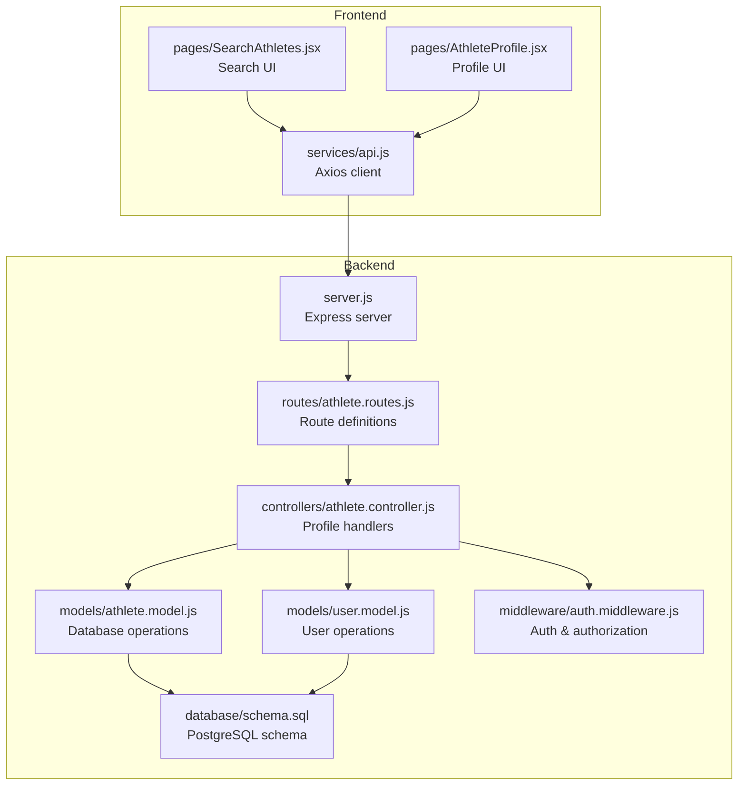
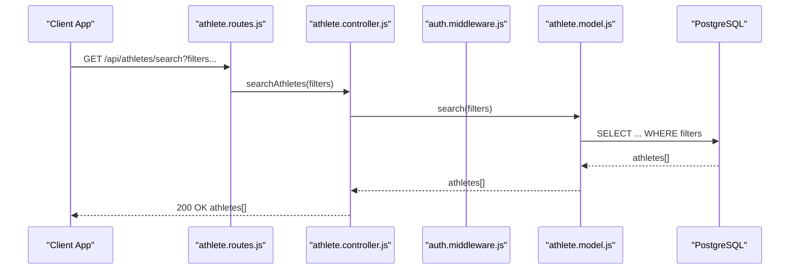
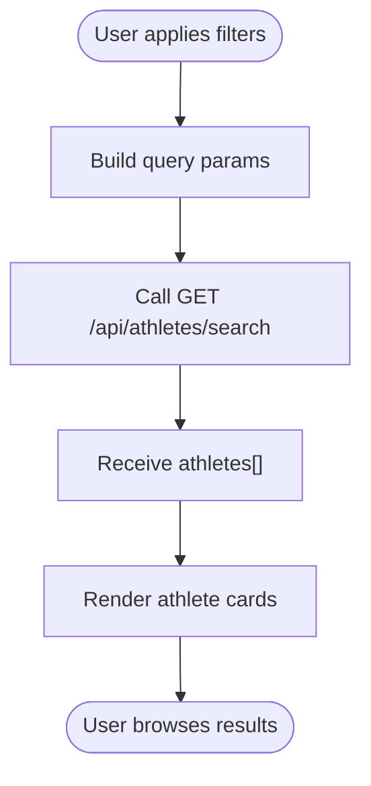
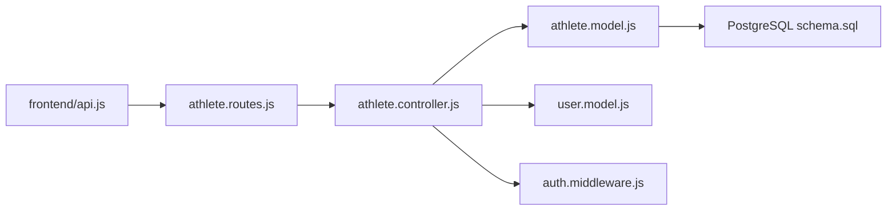

# Athlete Management

<cite>
**Referenced Files in This Document**
- [server.js](file://backend/server.js)
- [athlete.routes.js](file://backend/routes/athlete.routes.js)
- [athlete.controller.js](file://backend/controllers/athlete.controller.js)
- [athlete.model.js](file://backend/models/athlete.model.js)
- [auth.middleware.js](file://backend/middleware/auth.middleware.js)
- [user.model.js](file://backend/models/user.model.js)
- [schema.sql](file://database/schema.sql)
- [api.js](file://frontend/src/services/api.js)
- [SearchAthletes.jsx](file://frontend/src/pages/SearchAthletes.jsx)
- [AthleteProfile.jsx](file://frontend/src/pages/AthleteProfile.jsx)
- [README.md](file://README.md)
</cite>

## Table of Contents
1. [Introduction](#introduction)
2. [Project Structure](#project-structure)
3. [Core Components](#core-components)
4. [Architecture Overview](#architecture-overview)
5. [Detailed Component Analysis](#detailed-component-analysis)
6. [Dependency Analysis](#dependency-analysis)
7. [Performance Considerations](#performance-considerations)
8. [Troubleshooting Guide](#troubleshooting-guide)
9. [Conclusion](#conclusion)
10. [Appendices](#appendices)

## Introduction
This document provides comprehensive API documentation for athlete profile management within the Craque Vision platform. It covers endpoints for creating, retrieving, updating, and discovering athlete profiles, along with the complete athlete data model, authentication and authorization requirements, search and filtering capabilities, and privacy controls. It also includes practical examples of athlete onboarding workflows and search usage.

## Project Structure
The athlete management system is implemented as part of a Node.js/Express backend with PostgreSQL persistence and a React frontend. The backend exposes REST endpoints under `/api/athletes`, while the frontend integrates with these endpoints to support athlete onboarding and discovery.

**Diagram sources**
- [server.js:1-40](file://backend/server.js#L1-L40)
- [athlete.routes.js:1-14](file://backend/routes/athlete.routes.js#L1-L14)
- [athlete.controller.js:1-91](file://backend/controllers/athlete.controller.js#L1-L91)
- [athlete.model.js:1-119](file://backend/models/athlete.model.js#L1-L119)
- [user.model.js:1-42](file://backend/models/user.model.js#L1-L42)
- [auth.middleware.js:1-59](file://backend/middleware/auth.middleware.js#L1-L59)
- [schema.sql:1-185](file://database/schema.sql#L1-L185)
- [api.js:1-36](file://frontend/src/services/api.js#L1-L36)
- [SearchAthletes.jsx:1-218](file://frontend/src/pages/SearchAthletes.jsx#L1-L218)
- [AthleteProfile.jsx:1-302](file://frontend/src/pages/AthleteProfile.jsx#L1-L302)

**Section sources**
- [server.js:1-40](file://backend/server.js#L1-L40)
- [README.md:63-132](file://README.md#L63-L132)

## Core Components
- Authentication and Authorization Middleware: Validates JWT tokens and enforces role-based access for athlete-only endpoints.
- Athlete Controller: Implements CRUD and search operations for athlete profiles.
- Athlete Model: Encapsulates database interactions for profile creation, updates, and searches.
- User Model: Manages user registration and authentication, linking users to athlete profiles.
- Routes: Exposes REST endpoints for profile management and discovery.
- Frontend Integration: Provides UI components for search and profile display.

**Section sources**
- [auth.middleware.js:1-59](file://backend/middleware/auth.middleware.js#L1-L59)
- [athlete.controller.js:1-91](file://backend/controllers/athlete.controller.js#L1-L91)
- [athlete.model.js:1-119](file://backend/models/athlete.model.js#L1-L119)
- [user.model.js:1-42](file://backend/models/user.model.js#L1-L42)
- [athlete.routes.js:1-14](file://backend/routes/athlete.routes.js#L1-L14)

## Architecture Overview
The athlete management API follows a layered architecture:
- HTTP Layer: Express routes define endpoint contracts.
- Controller Layer: Handles request validation, orchestrates business logic, and manages responses.
- Model Layer: Interacts with PostgreSQL via connection pooling.
- Middleware: Enforces authentication and authorization.
- Frontend: Consumes endpoints via Axios with automatic token injection.

**Diagram sources**
- [athlete.routes.js:9-11](file://backend/routes/athlete.routes.js#L9-L11)
- [athlete.controller.js:73-81](file://backend/controllers/athlete.controller.js#L73-L81)
- [athlete.model.js:51-86](file://backend/models/athlete.model.js#L51-L86)

## Detailed Component Analysis

### Endpoint Catalog
- Base Path: `/api/athletes`
- Authentication: Required for profile endpoints; optional for public search and profile retrieval by ID.

Endpoints:
- POST /profile
  - Purpose: Create a new athlete profile linked to the authenticated user.
  - Auth: Required, Role: athlete
  - Request Body: See "Athlete Data Model" section.
  - Responses:
    - 201 Created: Profile created successfully.
    - 400 Bad Request: Profile already exists.
    - 500 Internal Server Error: General error.

- GET /profile
  - Purpose: Retrieve the authenticated athlete’s profile.
  - Auth: Required, Role: athlete
  - Responses:
    - 200 OK: Profile JSON.
    - 404 Not Found: Profile does not exist.
    - 500 Internal Server Error: General error.

- PUT /profile
  - Purpose: Update the authenticated athlete’s profile.
  - Auth: Required, Role: athlete
  - Request Body: Partial fields to update (see "Athlete Data Model").
  - Responses:
    - 200 OK: Updated profile.
    - 404 Not Found: Profile does not exist.
    - 500 Internal Server Error: General error.

- GET /search
  - Purpose: Public search across athletes with optional filters.
  - Auth: Optional
  - Query Parameters:
    - sport (string)
    - category (string)
    - state (string)
    - position (string)
  - Responses:
    - 200 OK: Array of athlete records with name and basic info.
    - 500 Internal Server Error: General error.

- GET /all
  - Purpose: Retrieve all athletes (no filters).
  - Auth: Optional
  - Responses:
    - 200 OK: Array of athletes.
    - 500 Internal Server Error: General error.

- GET /:id
  - Purpose: Retrieve a specific athlete profile by ID (includes user name and email).
  - Auth: Optional
  - Path Parameter: id (integer)
  - Responses:
    - 200 OK: Athlete record with user details.
    - 404 Not Found: Athlete not found.
    - 500 Internal Server Error: General error.

Authorization and Authentication:
- All profile endpoints (POST, GET, PUT /profile) require a valid JWT in the Authorization header.
- The route guards enforce role-based access for athlete-only endpoints.
- Token verification uses a secret configured via environment variables.

**Section sources**
- [athlete.routes.js:6-11](file://backend/routes/athlete.routes.js#L6-L11)
- [auth.middleware.js:4-42](file://backend/middleware/auth.middleware.js#L4-L42)
- [athlete.controller.js:4-22](file://backend/controllers/athlete.controller.js#L4-L22)
- [athlete.controller.js:24-37](file://backend/controllers/athlete.controller.js#L24-L37)
- [athlete.controller.js:54-71](file://backend/controllers/athlete.controller.js#L54-L71)
- [athlete.controller.js:73-81](file://backend/controllers/athlete.controller.js#L73-L81)
- [athlete.controller.js:83-90](file://backend/controllers/athlete.controller.js#L83-L90)
- [athlete.controller.js:39-52](file://backend/controllers/athlete.controller.js#L39-L52)

### Athlete Data Model
The athlete profile is stored in the athletes table with the following fields:

Core Fields:
- id (auto-increment primary key)
- user_id (foreign key to users.id)
- sport (string, required)
- category (string)
- position (string)
- dominant_foot (enum: left, right, both)
- weight (string)
- height (string)
- birth_date (date)
- city (string)
- state (string)
- country (string, default: Brasil)
- whatsapp (string)
- instagram (string)
- current_club (string)
- historic (text)
- profile_photo (text)
- bio (text)
- description (text)
- goals (text)
- is_public (boolean, default: true)
- is_verified (boolean, default: false)
- created_at (timestamp)
- updated_at (timestamp)

Notes:
- The model supports partial updates; only provided fields are updated.
- Search filters apply to sport, category, state, and position.
- The profile retrieval by ID joins with users to include name and email.

Validation Requirements:
- Required fields for profile creation: user_id, sport.
- Enum constraints enforced at database level for dominant_foot.
- Unique constraint on user_id ensures one profile per user.

Privacy Controls:
- is_public flag indicates whether the profile is publicly discoverable.
- The search endpoint returns a subset of fields suitable for listings.
- Full profile details are returned when accessed by ID.

**Section sources**
- [schema.sql:27-67](file://database/schema.sql#L27-L67)
- [athlete.model.js:4-32](file://backend/models/athlete.model.js#L4-L32)
- [athlete.model.js:51-86](file://backend/models/athlete.model.js#L51-L86)
- [athlete.model.js:88-115](file://backend/models/athlete.model.js#L88-L115)
- [athlete.controller.js:39-52](file://backend/controllers/athlete.controller.js#L39-L52)

### Authentication and Authorization
- Token Format: Bearer token in the Authorization header.
- Verification: Signed JWT verified against a secret.
- User Context: Decoded user ID is attached to the request for controller logic.
- Role Enforcement: Route guards restrict access to athletes only for profile endpoints.

Frontend Integration:
- Axios automatically injects the Authorization header when a token exists in localStorage.
- Unauthorized responses trigger automatic logout.

**Section sources**
- [auth.middleware.js:4-42](file://backend/middleware/auth.middleware.js#L4-L42)
- [api.js:10-33](file://frontend/src/services/api.js#L10-L33)
- [README.md:134-147](file://README.md#L134-L147)

### Search and Discovery
Public search supports filtering by:
- sport
- category
- state
- position

The search endpoint returns a compact dataset suitable for listing. The frontend Search page demonstrates:
- Building query parameters from filters.
- Fetching results and rendering cards.
- Clearing filters and handling empty states.

**Diagram sources**
- [SearchAthletes.jsx:30-45](file://frontend/src/pages/SearchAthletes.jsx#L30-L45)
- [athlete.routes.js:9](file://backend/routes/athlete.routes.js#L9)
- [athlete.controller.js:73-81](file://backend/controllers/athlete.controller.js#L73-L81)
- [athlete.model.js:51-86](file://backend/models/athlete.model.js#L51-L86)

**Section sources**
- [SearchAthletes.jsx:1-218](file://frontend/src/pages/SearchAthletes.jsx#L1-L218)
- [athlete.controller.js:73-81](file://backend/controllers/athlete.controller.js#L73-L81)
- [athlete.model.js:51-86](file://backend/models/athlete.model.js#L51-L86)

### Public Profile Access
- GET /api/athletes/:id returns a profile with user name and email.
- This enables public discovery and profile sharing without requiring authentication.
- Privacy: Profiles are public by default; the is_public flag is present in the schema but not enforced in the current controller logic.

**Section sources**
- [athlete.controller.js:39-52](file://backend/controllers/athlete.controller.js#L39-L52)
- [athlete.model.js:40-49](file://backend/models/athlete.model.js#L40-L49)
- [schema.sql:62](file://database/schema.sql#L62)

### Athlete Onboarding Workflow
Typical steps:
1. Registration and Login
   - Register a user with user_type set to athlete.
   - Authenticate to receive a JWT.
2. Profile Creation
   - POST /api/athletes/profile with required fields (sport and user_id derived from token).
3. Profile Completion
   - PUT /api/athletes/profile to add optional details (physical attributes, contact, bio, etc.).
4. Discovery
   - Use GET /api/athletes/search with filters to improve discoverability.
   - View public profile via GET /api/athletes/:id.

Frontend Examples:
- Search page constructs filters and displays results.
- Profile page fetches athlete and associated videos.

**Section sources**
- [auth.controller.js:8-28](file://backend/controllers/auth.controller.js#L8-L28)
- [auth.controller.js:30-59](file://backend/controllers/auth.controller.js#L30-L59)
- [athlete.controller.js:4-22](file://backend/controllers/athlete.controller.js#L4-L22)
- [athlete.controller.js:54-71](file://backend/controllers/athlete.controller.js#L54-L71)
- [SearchAthletes.jsx:30-45](file://frontend/src/pages/SearchAthletes.jsx#L30-L45)
- [AthleteProfile.jsx:24-37](file://frontend/src/pages/AthleteProfile.jsx#L24-L37)

## Dependency Analysis
Key dependencies and relationships:
- Routes depend on the controller for business logic.
- Controller depends on the model for database operations.
- Model depends on the database connection pool and schema.
- Middleware enforces authentication and authorization across protected routes.
- Frontend consumes endpoints via Axios with token injection.

**Diagram sources**
- [athlete.routes.js:1-14](file://backend/routes/athlete.routes.js#L1-L14)
- [athlete.controller.js:1-91](file://backend/controllers/athlete.controller.js#L1-L91)
- [athlete.model.js:1-119](file://backend/models/athlete.model.js#L1-L119)
- [user.model.js:1-42](file://backend/models/user.model.js#L1-L42)
- [auth.middleware.js:1-59](file://backend/middleware/auth.middleware.js#L1-L59)
- [schema.sql:1-185](file://database/schema.sql#L1-L185)
- [api.js:1-36](file://frontend/src/services/api.js#L1-L36)

**Section sources**
- [athlete.routes.js:1-14](file://backend/routes/athlete.routes.js#L1-L14)
- [athlete.controller.js:1-91](file://backend/controllers/athlete.controller.js#L1-L91)
- [athlete.model.js:1-119](file://backend/models/athlete.model.js#L1-L119)
- [user.model.js:1-42](file://backend/models/user.model.js#L1-L42)
- [auth.middleware.js:1-59](file://backend/middleware/auth.middleware.js#L1-L59)
- [schema.sql:1-185](file://database/schema.sql#L1-L185)
- [api.js:1-36](file://frontend/src/services/api.js#L1-L36)

## Performance Considerations
- Database Indexes: The schema includes indexes on athletes (sport, category, state, position) and users (email, user_type), which support efficient filtering and lookups.
- Query Construction: The search method dynamically builds WHERE clauses based on provided filters, minimizing unnecessary conditions.
- Pagination: No pagination is implemented in the current search; consider adding limit and offset for large datasets.
- Caching: No caching layer is present; consider Redis for frequently accessed profiles or search results.

[No sources needed since this section provides general guidance]

## Troubleshooting Guide
Common Issues and Resolutions:
- Authentication Failures
  - Symptom: 401 Unauthorized on profile endpoints.
  - Causes: Missing or invalid Bearer token; expired token; user not found.
  - Resolution: Ensure token presence and validity; re-authenticate if needed.
- Access Denied
  - Symptom: 403 Forbidden.
  - Cause: User role not authorized for athlete-only endpoints.
  - Resolution: Verify user_type is athlete.
- Profile Already Exists
  - Symptom: 400 Bad Request during creation.
  - Cause: Attempting to create a profile for a user who already has one.
  - Resolution: Update the existing profile instead.
- Profile Not Found
  - Symptom: 404 Not Found.
  - Causes: Non-existent user_id or incorrect ID.
  - Resolution: Confirm user_id association and ID correctness.
- Database Errors
  - Symptom: 500 Internal Server Error.
  - Causes: SQL exceptions, constraint violations.
  - Resolution: Check schema constraints and input validation.

**Section sources**
- [auth.middleware.js:4-42](file://backend/middleware/auth.middleware.js#L4-L42)
- [athlete.controller.js:4-22](file://backend/controllers/athlete.controller.js#L4-L22)
- [athlete.controller.js:24-37](file://backend/controllers/athlete.controller.js#L24-L37)
- [athlete.controller.js:54-71](file://backend/controllers/athlete.controller.js#L54-L71)
- [schema.sql:27-67](file://database/schema.sql#L27-L67)

## Conclusion
The athlete management API provides a robust foundation for profile lifecycle operations, public discovery, and privacy-aware access. By leveraging role-based authorization, dynamic search filters, and a clear data model, the system supports scalable athlete onboarding and search workflows. Future enhancements could include pagination, caching, and stricter privacy enforcement for public profiles.

[No sources needed since this section summarizes without analyzing specific files]

## Appendices

### API Endpoint Reference
- POST /api/athletes/profile
  - Auth: Required, Role: athlete
  - Body: Athlete fields (excluding id, user_id)
  - Responses: 201, 400, 500

- GET /api/athletes/profile
  - Auth: Required, Role: athlete
  - Responses: 200, 404, 500

- PUT /api/athletes/profile
  - Auth: Required, Role: athlete
  - Body: Partial athlete fields
  - Responses: 200, 404, 500

- GET /api/athletes/search?sport=&category=&state=&position=
  - Auth: Optional
  - Responses: 200, 500

- GET /api/athletes/all
  - Auth: Optional
  - Responses: 200, 500

- GET /api/athletes/:id
  - Auth: Optional
  - Responses: 200, 404, 500

**Section sources**
- [athlete.routes.js:6-11](file://backend/routes/athlete.routes.js#L6-L11)
- [README.md:141-147](file://README.md#L141-L147)

### Athlete Data Model Details
- Required: sport, user_id
- Optional: category, position, dominant_foot, weight, height, birth_date, city, state, country, whatsapp, instagram, current_club, historic, profile_photo, bio, description, goals
- Constraints: dominant_foot enum, country default, timestamps managed by triggers

**Section sources**
- [schema.sql:27-67](file://database/schema.sql#L27-L67)
- [athlete.model.js:4-32](file://backend/models/athlete.model.js#L4-L32)
- [athlete.model.js:88-115](file://backend/models/athlete.model.js#L88-L115)

### Frontend Integration Notes
- Axios interceptor injects Authorization header automatically.
- Search page builds query parameters from filters and renders results.
- Profile page fetches athlete and videos concurrently.

**Section sources**
- [api.js:10-33](file://frontend/src/services/api.js#L10-L33)
- [SearchAthletes.jsx:30-45](file://frontend/src/pages/SearchAthletes.jsx#L30-L45)
- [AthleteProfile.jsx:24-37](file://frontend/src/pages/AthleteProfile.jsx#L24-L37)