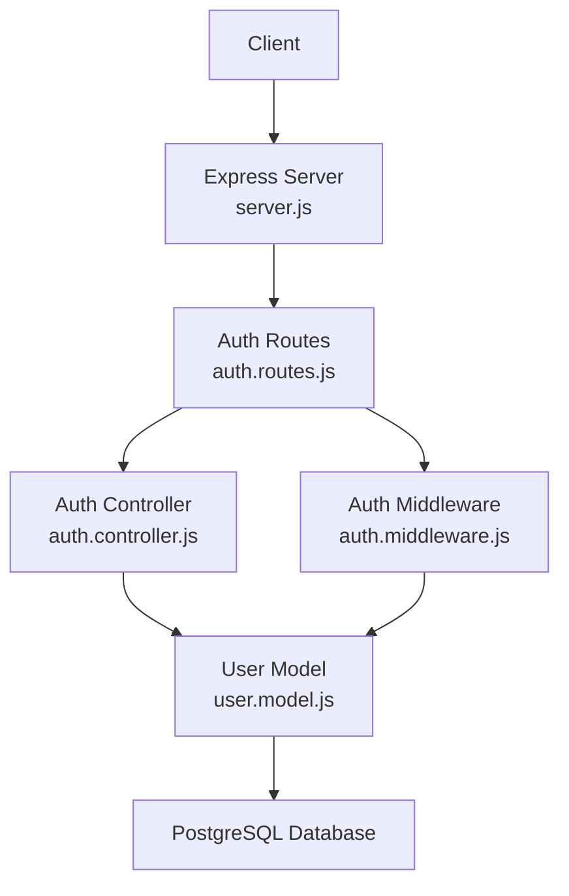
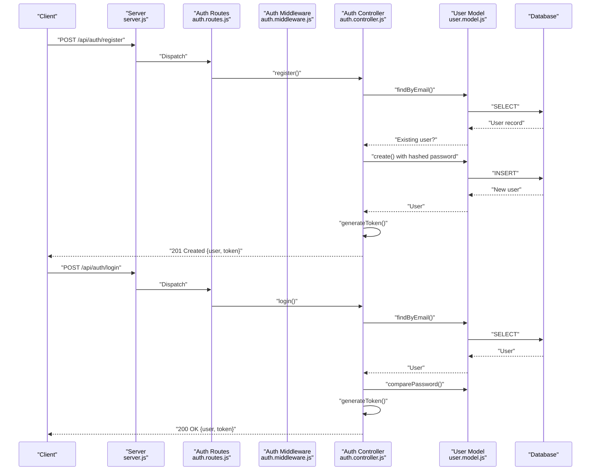
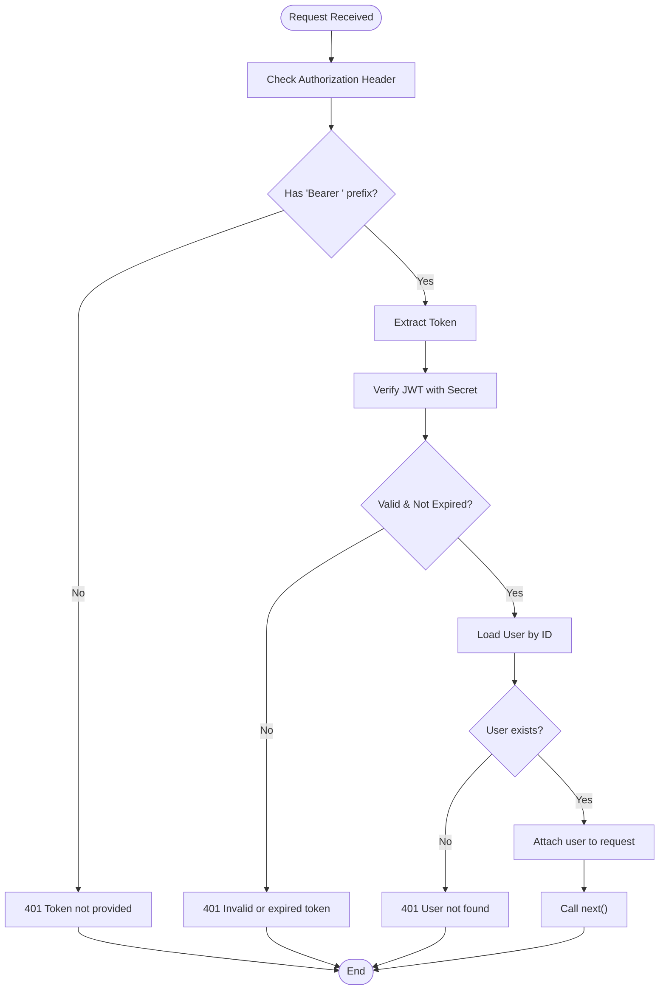
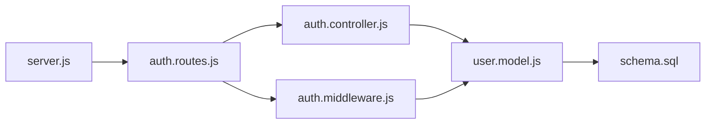

# Authentication System

<cite>
**Referenced Files in This Document**
- [server.js](file://backend/server.js)
- [auth.routes.js](file://backend/routes/auth.routes.js)
- [auth.controller.js](file://backend/controllers/auth.controller.js)
- [auth.middleware.js](file://backend/middleware/auth.middleware.js)
- [user.model.js](file://backend/models/user.model.js)
- [schema.sql](file://database/schema.sql)
- [admin.routes.js](file://backend/routes/admin.routes.js)
- [athlete.routes.js](file://backend/routes/athlete.routes.js)
- [scout.routes.js](file://backend/routes/scout.routes.js)
</cite>

## Table of Contents
1. [Introduction](#introduction)
2. [Project Structure](#project-structure)
3. [Core Components](#core-components)
4. [Architecture Overview](#architecture-overview)
5. [Detailed Component Analysis](#detailed-component-analysis)
6. [Dependency Analysis](#dependency-analysis)
7. [Performance Considerations](#performance-considerations)
8. [Troubleshooting Guide](#troubleshooting-guide)
9. [Conclusion](#conclusion)
10. [Appendices](#appendices)

## Introduction
This document provides comprehensive API documentation for the authentication system. It covers user registration, login, and profile retrieval endpoints, along with the underlying JWT-based authentication flow, middleware enforcement, and role-based access control (RBAC) across roles: athlete, scout, club, and admin. It also outlines error handling strategies, security considerations, and practical integration patterns.

## Project Structure
The authentication system spans routing, controller, middleware, model, and server configuration layers. Routes define endpoint URLs under the /api/auth namespace. Controllers implement business logic, middleware enforces authentication and authorization, and the model handles user persistence and password hashing. The server wires routes and applies global middleware.

**Diagram sources**
- [server.js:1-40](file://backend/server.js#L1-L40)
- [auth.routes.js:1-11](file://backend/routes/auth.routes.js#L1-L11)
- [auth.controller.js:1-72](file://backend/controllers/auth.controller.js#L1-L72)
- [auth.middleware.js:1-59](file://backend/middleware/auth.middleware.js#L1-L59)
- [user.model.js:1-42](file://backend/models/user.model.js#L1-L42)

**Section sources**
- [server.js:1-40](file://backend/server.js#L1-L40)
- [auth.routes.js:1-11](file://backend/routes/auth.routes.js#L1-L11)

## Core Components
- Authentication endpoints:
  - POST /api/auth/register: Creates a new user account.
  - POST /api/auth/login: Authenticates a user and returns a JWT.
  - GET /api/auth/profile: Retrieves the authenticated user’s profile.
- Middleware:
  - authenticate: Extracts Bearer token, verifies JWT, loads user, and attaches user info to the request.
  - authorize: Enforces role-based access control for protected routes.
  - optionalAuth: Optionally extracts and validates token without failing if absent.
- Token generation:
  - JWT signed with a secret and set to expire in seven days.

Key implementation references:
- Authentication endpoints and token generation: [auth.controller.js:8-59](file://backend/controllers/auth.controller.js#L8-L59)
- Route bindings: [auth.routes.js:6-8](file://backend/routes/auth.routes.js#L6-L8)
- Authentication middleware: [auth.middleware.js:4-33](file://backend/middleware/auth.middleware.js#L4-L33)
- Authorization middleware: [auth.middleware.js:35-42](file://backend/middleware/auth.middleware.js#L35-L42)
- Optional auth middleware: [auth.middleware.js:44-58](file://backend/middleware/auth.middleware.js#L44-L58)
- User model (password hashing): [user.model.js:7](file://backend/models/user.model.js#L7)

**Section sources**
- [auth.controller.js:1-72](file://backend/controllers/auth.controller.js#L1-L72)
- [auth.routes.js:1-11](file://backend/routes/auth.routes.js#L1-L11)
- [auth.middleware.js:1-59](file://backend/middleware/auth.middleware.js#L1-L59)
- [user.model.js:1-42](file://backend/models/user.model.js#L1-L42)

## Architecture Overview
The authentication flow integrates route binding, middleware verification, controller actions, and model operations. The server exposes the auth endpoints and mounts role-specific routes that enforce RBAC.

**Diagram sources**
- [server.js:20](file://backend/server.js#L20)
- [auth.routes.js:6-7](file://backend/routes/auth.routes.js#L6-L7)
- [auth.controller.js:8-59](file://backend/controllers/auth.controller.js#L8-L59)
- [user.model.js:5-38](file://backend/models/user.model.js#L5-L38)

## Detailed Component Analysis

### Authentication Endpoints

#### POST /api/auth/register
- Description: Registers a new user with name, email, password, and user_type.
- Request body:
  - name: string (required)
  - email: string (required)
  - password: string (required)
  - user_type: enum('athlete'|'scout'|'club'|'admin') (required)
- Response:
  - 201 Created: Returns user details and JWT token.
  - 400 Bad Request: Email already registered.
  - 500 Internal Server Error: General error.
- Security:
  - Password is hashed before storage.
  - Token issued with 7-day expiration.

References:
- Endpoint binding: [auth.routes.js:6](file://backend/routes/auth.routes.js#L6)
- Registration logic: [auth.controller.js:8-28](file://backend/controllers/auth.controller.js#L8-L28)
- Password hashing: [user.model.js:7](file://backend/models/user.model.js#L7)

**Section sources**
- [auth.routes.js:6](file://backend/routes/auth.routes.js#L6)
- [auth.controller.js:8-28](file://backend/controllers/auth.controller.js#L8-L28)
- [user.model.js:7](file://backend/models/user.model.js#L7)

#### POST /api/auth/login
- Description: Logs in an existing user and returns a JWT.
- Request body:
  - email: string (required)
  - password: string (required)
- Response:
  - 200 OK: Returns user profile and JWT token.
  - 401 Unauthorized: Invalid credentials.
  - 500 Internal Server Error: General error.
- Security:
  - Validates password against stored hash.
  - Token issued with 7-day expiration.

References:
- Endpoint binding: [auth.routes.js:7](file://backend/routes/auth.routes.js#L7)
- Login logic: [auth.controller.js:30-59](file://backend/controllers/auth.controller.js#L30-L59)
- Password comparison: [user.model.js:36-37](file://backend/models/user.model.js#L36-L37)

**Section sources**
- [auth.routes.js:7](file://backend/routes/auth.routes.js#L7)
- [auth.controller.js:30-59](file://backend/controllers/auth.controller.js#L30-L59)
- [user.model.js:36-37](file://backend/models/user.model.js#L36-L37)

#### GET /api/auth/profile
- Description: Retrieves the authenticated user’s profile.
- Authentication:
  - Requires Bearer token via Authorization header.
- Response:
  - 200 OK: Returns user object.
  - 401 Unauthorized: Missing/invalid/expired token or user not found.
  - 404 Not Found: User does not exist.
  - 500 Internal Server Error: General error.

References:
- Endpoint binding with middleware: [auth.routes.js:8](file://backend/routes/auth.routes.js#L8)
- Profile retrieval: [auth.controller.js:61-71](file://backend/controllers/auth.controller.js#L61-L71)
- Token verification and user loading: [auth.middleware.js:4-33](file://backend/middleware/auth.middleware.js#L4-L33)

**Section sources**
- [auth.routes.js:8](file://backend/routes/auth.routes.js#L8)
- [auth.controller.js:61-71](file://backend/controllers/auth.controller.js#L61-L71)
- [auth.middleware.js:4-33](file://backend/middleware/auth.middleware.js#L4-L33)

### JWT-Based Authentication Flow
- Token generation:
  - Signed with a secret and set to expire in seven days.
  - Issued upon successful registration and login.
- Token validation:
  - Extracted from Authorization header (Bearer scheme).
  - Verified against the configured secret.
  - On success, attaches user ID and user object to the request.
- Expiration handling:
  - Middleware returns 401 with a specific message when token is expired.

**Diagram sources**
- [auth.middleware.js:4-33](file://backend/middleware/auth.middleware.js#L4-L33)

**Section sources**
- [auth.controller.js:4-6](file://backend/controllers/auth.controller.js#L4-L6)
- [auth.middleware.js:4-33](file://backend/middleware/auth.middleware.js#L4-L33)

### Role-Based Access Control (RBAC)
- Supported roles: athlete, scout, club, admin.
- Enforcement:
  - authorize(role...) middleware checks if the authenticated user’s type matches any allowed role.
  - Used across admin, athlete, and scout route groups.
- Examples:
  - Admin-only endpoints require 'admin'.
  - Scout and club endpoints accept either 'scout' or 'club'.

References:
- Authorization middleware: [auth.middleware.js:35-42](file://backend/middleware/auth.middleware.js#L35-L42)
- Admin routes (RBAC enforced): [admin.routes.js:6-12](file://backend/routes/admin.routes.js#L6-L12)
- Athlete routes (RBAC enforced): [athlete.routes.js:6-8](file://backend/routes/athlete.routes.js#L6-L8)
- Scout routes (RBAC enforced): [scout.routes.js:6-10](file://backend/routes/scout.routes.js#L6-L10)

**Section sources**
- [auth.middleware.js:35-42](file://backend/middleware/auth.middleware.js#L35-L42)
- [admin.routes.js:6-12](file://backend/routes/admin.routes.js#L6-L12)
- [athlete.routes.js:6-8](file://backend/routes/athlete.routes.js#L6-L8)
- [scout.routes.js:6-10](file://backend/routes/scout.routes.js#L6-L10)

### Optional Authentication
- optionalAuth allows requests without mandatory authentication.
- If a token is present, it is verified and the user ID is attached; otherwise, the request proceeds unauthenticated.
- Useful for public endpoints that optionally act on behalf of a logged-in user.

Reference:
- Optional auth middleware: [auth.middleware.js:44-58](file://backend/middleware/auth.middleware.js#L44-L58)

**Section sources**
- [auth.middleware.js:44-58](file://backend/middleware/auth.middleware.js#L44-L58)

### Token Refresh Pattern
- Current implementation does not expose a dedicated token refresh endpoint.
- Practical pattern:
  - Clients can re-authenticate via POST /api/auth/login to obtain a new JWT.
  - Alternatively, extend the system to add a POST /api/auth/refresh endpoint that accepts the current token and issues a new one, while maintaining a secure refresh window and revocation strategy.

[No sources needed since this section provides general guidance]

## Dependency Analysis
The authentication system exhibits clear separation of concerns:
- Routes depend on controllers and middleware.
- Controllers depend on the User model.
- Middleware depends on JWT verification and the User model.
- The server mounts routes and applies global JSON parsing and CORS.

**Diagram sources**
- [server.js:5-26](file://backend/server.js#L5-L26)
- [auth.routes.js:1-11](file://backend/routes/auth.routes.js#L1-L11)
- [auth.controller.js:1-72](file://backend/controllers/auth.controller.js#L1-L72)
- [auth.middleware.js:1-59](file://backend/middleware/auth.middleware.js#L1-L59)
- [user.model.js:1-42](file://backend/models/user.model.js#L1-L42)
- [schema.sql:13-24](file://database/schema.sql#L13-L24)

**Section sources**
- [server.js:1-40](file://backend/server.js#L1-L40)
- [auth.routes.js:1-11](file://backend/routes/auth.routes.js#L1-L11)
- [auth.controller.js:1-72](file://backend/controllers/auth.controller.js#L1-L72)
- [auth.middleware.js:1-59](file://backend/middleware/auth.middleware.js#L1-L59)
- [user.model.js:1-42](file://backend/models/user.model.js#L1-L42)
- [schema.sql:13-24](file://database/schema.sql#L13-L24)

## Performance Considerations
- Token lifetime: 7-day expiration balances usability and security. Consider shorter expirations with a secure refresh mechanism for higher security.
- Password hashing cost: bcrypt cost of 10 is reasonable; avoid lowering it for performance gains.
- Middleware overhead: JWT verification and a single user lookup per protected request are lightweight but should be monitored in high-throughput scenarios.
- Database indexing: Existing indexes on users and related tables support efficient lookups.

[No sources needed since this section provides general guidance]

## Troubleshooting Guide
Common errors and resolutions:
- Missing Authorization header or malformed Bearer:
  - Symptom: 401 Token not provided.
  - Resolution: Ensure Authorization header starts with "Bearer " followed by the token.
- Invalid or expired token:
  - Symptom: 401 Invalid token or Token expired.
  - Resolution: Re-authenticate to obtain a new token.
- User not found after token verification:
  - Symptom: 401 User not found.
  - Resolution: Confirm user still exists in the database; consider re-registration if necessary.
- Invalid credentials during login:
  - Symptom: 401 Email or senha inválidos.
  - Resolution: Verify email and password; ensure password is hashed before storage.
- Email already registered during registration:
  - Symptom: 400 Email já cadastrado.
  - Resolution: Use a different email or log in instead.

**Section sources**
- [auth.middleware.js:8-31](file://backend/middleware/auth.middleware.js#L8-L31)
- [auth.controller.js:13-42](file://backend/controllers/auth.controller.js#L13-L42)

## Conclusion
The authentication system provides robust JWT-based authentication with clear middleware enforcement and role-based access control. It supports registration, login, and profile retrieval with appropriate error handling. Extending the system with a dedicated token refresh endpoint and stricter session controls would further enhance security and user experience.

## Appendices

### API Reference Summary
- Base URL: https://yourdomain.com/api
- Authentication scheme: Bearer JWT
- Token expiration: 7 days

Endpoints:
- POST /auth/register
  - Body: name, email, password, user_type
  - Responses: 201 with user and token; 400 on duplicate email; 500 on error
- POST /auth/login
  - Body: email, password
  - Responses: 200 with user and token; 401 on invalid credentials; 500 on error
- GET /auth/profile
  - Headers: Authorization: Bearer <token>
  - Responses: 200 with user; 401 on missing/invalid/expired token or user not found; 404 if user deleted; 500 on error

RBAC:
- Admin-only: admin routes require 'admin'
- Athletes: athlete routes require 'athlete'
- Scouts/Clubs: scout routes require 'scout' or 'club'

Security considerations:
- Use HTTPS in production.
- Store JWT_SECRET securely.
- Consider adding rate limiting and IP tracking for login attempts.
- Implement logout by maintaining a blacklist or short-lived tokens with refresh.

**Section sources**
- [auth.routes.js:6-8](file://backend/routes/auth.routes.js#L6-L8)
- [auth.middleware.js:35-42](file://backend/middleware/auth.middleware.js#L35-L42)
- [admin.routes.js:6-12](file://backend/routes/admin.routes.js#L6-L12)
- [athlete.routes.js:6-8](file://backend/routes/athlete.routes.js#L6-L8)
- [scout.routes.js:6-10](file://backend/routes/scout.routes.js#L6-L10)