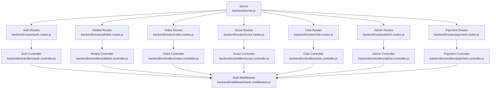
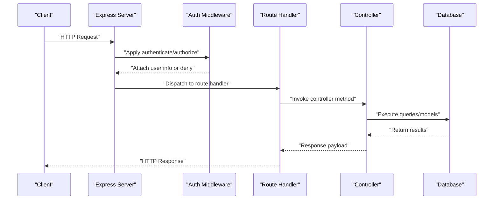
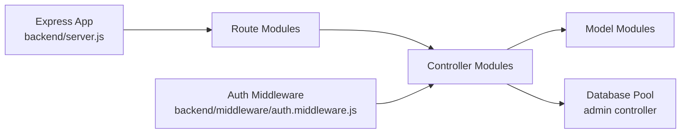

# Backend API Documentation

<cite>
**Referenced Files in This Document**
- [server.js](file://backend/server.js)
- [auth.middleware.js](file://backend/middleware/auth.middleware.js)
- [auth.routes.js](file://backend/routes/auth.routes.js)
- [athlete.routes.js](file://backend/routes/athlete.routes.js)
- [video.routes.js](file://backend/routes/video.routes.js)
- [scout.routes.js](file://backend/routes/scout.routes.js)
- [club.routes.js](file://backend/routes/club.routes.js)
- [admin.routes.js](file://backend/routes/admin.routes.js)
- [payment.routes.js](file://backend/routes/payment.routes.js)
- [auth.controller.js](file://backend/controllers/auth.controller.js)
- [athlete.controller.js](file://backend/controllers/athlete.controller.js)
- [video.controller.js](file://backend/controllers/video.controller.js)
- [scout.controller.js](file://backend/controllers/scout.controller.js)
- [club.controller.js](file://backend/controllers/club.controller.js)
- [admin.controller.js](file://backend/controllers/admin.controller.js)
- [payment.controller.js](file://backend/controllers/payment.controller.js)
</cite>

## Table of Contents
1. [Introduction](#introduction)
2. [Project Structure](#project-structure)
3. [Core Components](#core-components)
4. [Architecture Overview](#architecture-overview)
5. [Detailed Component Analysis](#detailed-component-analysis)
6. [Dependency Analysis](#dependency-analysis)
7. [Performance Considerations](#performance-considerations)
8. [Troubleshooting Guide](#troubleshooting-guide)
9. [Conclusion](#conclusion)
10. [Appendices](#appendices)

## Introduction
This document provides comprehensive API documentation for the Craque-Vision backend REST API. It covers all HTTP endpoints grouped by functional areas: authentication, athlete management, video operations, scout features, club subscriptions, payment processing, and administrative functions. For each endpoint, you will find HTTP methods, URL patterns, request/response schemas, authentication requirements, and error responses. It also documents the JWT-based authentication flow, role-based access control, and middleware architecture used by the backend.

## Project Structure
The backend is structured around Express.js routes, controllers, middleware, and models. The server mounts route groups under base paths to organize functionality by domain area. Middleware enforces authentication and authorization policies consistently across controllers.

**Diagram sources**
- [server.js:1-40](file://backend/server.js#L1-L40)
- [auth.routes.js:1-11](file://backend/routes/auth.routes.js#L1-L11)
- [athlete.routes.js:1-14](file://backend/routes/athlete.routes.js#L1-L14)
- [video.routes.js:1-20](file://backend/routes/video.routes.js#L1-L20)
- [scout.routes.js:1-13](file://backend/routes/scout.routes.js#L1-L13)
- [club.routes.js:1-13](file://backend/routes/club.routes.js#L1-L13)
- [admin.routes.js:1-15](file://backend/routes/admin.routes.js#L1-L15)
- [payment.routes.js:1-13](file://backend/routes/payment.routes.js#L1-L13)
- [auth.controller.js:1-72](file://backend/controllers/auth.controller.js#L1-L72)
- [athlete.controller.js:1-91](file://backend/controllers/athlete.controller.js#L1-L91)
- [video.controller.js:1-111](file://backend/controllers/video.controller.js#L1-L111)
- [scout.controller.js:1-96](file://backend/controllers/scout.controller.js#L1-L96)
- [club.controller.js:1-100](file://backend/controllers/club.controller.js#L1-L100)
- [admin.controller.js:1-121](file://backend/controllers/admin.controller.js#L1-L121)
- [payment.controller.js:1-108](file://backend/controllers/payment.controller.js#L1-L108)
- [auth.middleware.js:1-59](file://backend/middleware/auth.middleware.js#L1-L59)

**Section sources**
- [server.js:1-40](file://backend/server.js#L1-L40)

## Core Components
- Authentication and Authorization Middleware
  - authenticate: Extracts Bearer token from Authorization header, verifies JWT, attaches user info to request.
  - authorize(...roles): Enforces role-based access control for protected routes.
  - optionalAuth: Allows request to proceed even if token is missing/expired; useful for public endpoints.
- Controllers implement business logic and interact with models and database queries.
- Routes define endpoint URLs and apply middleware guards.

Key middleware behaviors:
- Token extraction and verification errors return 401 with specific messages.
- Expired tokens return 401 with expiration message.
- Missing or invalid roles return 403 with access denied message.
- Optional auth allows downstream logic to handle unauthenticated requests gracefully.

**Section sources**
- [auth.middleware.js:1-59](file://backend/middleware/auth.middleware.js#L1-L59)

## Architecture Overview
The API follows a layered architecture:
- Entry points: Express routes mounted on base paths.
- Security: Global middleware applies authentication and authorization.
- Business logic: Controllers orchestrate model interactions and database queries.
- Data access: Models encapsulate persistence logic; admin endpoints use raw SQL via a connection pool.

**Diagram sources**
- [server.js:1-40](file://backend/server.js#L1-L40)
- [auth.middleware.js:1-59](file://backend/middleware/auth.middleware.js#L1-L59)
- [auth.controller.js:1-72](file://backend/controllers/auth.controller.js#L1-L72)
- [admin.controller.js:1-121](file://backend/controllers/admin.controller.js#L1-L121)

## Detailed Component Analysis

### Authentication
Endpoints
- POST /api/auth/register
  - Description: Registers a new user account.
  - Authentication: Not required.
  - Request body: name, email, password, user_type.
  - Response: user object and JWT token.
  - Errors: 400 if email exists; 500 on server error.
- POST /api/auth/login
  - Description: Logs in an existing user and returns JWT token.
  - Authentication: Not required.
  - Request body: email, password.
  - Response: user profile and JWT token.
  - Errors: 401 if credentials invalid; 500 on server error.
- GET /api/auth/profile
  - Description: Retrieves current user profile.
  - Authentication: Required (Bearer token).
  - Response: Current user object.
  - Errors: 404 if user not found; 500 on server error.

JWT Flow
- Token generation uses a secret configured via environment variable.
- Clients must send Authorization: Bearer <token> for protected routes.
- Token verification handles expired and invalid tokens with appropriate 401 responses.

**Section sources**
- [auth.routes.js:1-11](file://backend/routes/auth.routes.js#L1-L11)
- [auth.controller.js:1-72](file://backend/controllers/auth.controller.js#L1-L72)
- [auth.middleware.js:1-59](file://backend/middleware/auth.middleware.js#L1-L59)

### Athlete Management
Endpoints
- POST /api/athletes/profile
  - Description: Creates an athlete profile linked to the authenticated user.
  - Authentication: Required; Role: athlete.
  - Request body: athlete-specific fields (e.g., sport, position, bio).
  - Response: Created athlete profile.
  - Errors: 400 if profile already exists; 404 if user has no profile; 500 on server error.
- GET /api/athletes/profile
  - Description: Retrieves authenticated athlete’s profile.
  - Authentication: Required; Role: athlete.
  - Response: Athlete profile.
  - Errors: 404 if profile not found; 500 on server error.
- PUT /api/athletes/profile
  - Description: Updates authenticated athlete’s profile.
  - Authentication: Required; Role: athlete.
  - Response: Updated athlete profile.
  - Errors: 404 if profile not found; 500 on server error.
- GET /api/athletes/search
  - Description: Public search across athletes with optional filters.
  - Authentication: Not required.
  - Query params: Filters supported by search implementation.
  - Response: Array of athletes.
  - Errors: 500 on server error.
- GET /api/athletes/all
  - Description: Returns all athletes.
  - Authentication: Not required.
  - Response: Array of athletes.
  - Errors: 500 on server error.
- GET /api/athletes/:id
  - Description: Returns a specific athlete by ID.
  - Authentication: Not required.
  - Response: Single athlete.
  - Errors: 404 if not found; 500 on server error.

Validation and Access Control
- Role-based authorization restricts profile creation, retrieval, and updates to athletes.
- Search endpoints are public but rely on controller-side filtering.

**Section sources**
- [athlete.routes.js:1-14](file://backend/routes/athlete.routes.js#L1-L14)
- [athlete.controller.js:1-91](file://backend/controllers/athlete.controller.js#L1-L91)

### Video Operations
Endpoints
- POST /api/videos/
  - Description: Uploads a new video for the authenticated athlete.
  - Authentication: Required; Role: athlete.
  - Request body: video_url, thumbnail, title, type, description.
  - Response: Uploaded video object.
  - Errors: 404 if athlete profile not found; 500 on server error.
- GET /api/videos/my-videos
  - Description: Lists videos uploaded by the authenticated athlete.
  - Authentication: Required; Role: athlete.
  - Response: Array of videos.
  - Errors: 500 on server error.
- GET /api/videos/featured
  - Description: Retrieves featured videos with optional limit.
  - Authentication: Not required.
  - Query params: limit (integer).
  - Response: Array of videos.
  - Errors: 500 on server error.
- GET /api/videos/athlete/:athleteId
  - Description: Lists videos for a given athlete ID.
  - Authentication: Not required.
  - Response: Array of videos.
  - Errors: 500 on server error.
- GET /api/videos/:id
  - Description: Retrieves a single video by ID; optional auth for likes count.
  - Authentication: Optional; Role: none.
  - Response: Video object plus likes_count.
  - Errors: 404 if not found; 500 on server error.
- DELETE /api/videos/:id
  - Description: Deletes a video owned by the authenticated athlete.
  - Authentication: Required; Role: athlete.
  - Response: Success message.
  - Errors: 403 if not owner; 404 if not found; 500 on server error.

Likes Subsystem
- POST /api/videos/like
  - Description: Records a like for a video by authenticated user.
  - Authentication: Required.
  - Request body: video_id.
  - Response: Success message.
  - Errors: 500 on server error.
- DELETE /api/videos/like/:videoId
  - Description: Removes a like for a video by authenticated user.
  - Authentication: Required.
  - Response: Success message.
  - Errors: 500 on server error.
- GET /api/videos/:videoId/likes
  - Description: Returns total likes for a video.
  - Authentication: Not required.
  - Response: Likes count.
  - Errors: 500 on server error.
- GET /api/videos/:videoId/like-status
  - Description: Checks if the authenticated user liked a video.
  - Authentication: Required.
  - Response: Boolean-like indicator.
  - Errors: 500 on server error.

Notes
- The optionalAuth middleware allows public access to video retrieval while still enabling authenticated features like likes.

**Section sources**
- [video.routes.js:1-20](file://backend/routes/video.routes.js#L1-L20)
- [video.controller.js:1-111](file://backend/controllers/video.controller.js#L1-L111)

### Scout Features
Endpoints
- GET /api/scout/search
  - Description: Searches athletes; requires active subscription.
  - Authentication: Required; Role: scout or club.
  - Query params: Filters supported by search implementation.
  - Response: Array of athletes.
  - Errors: 403 if no active subscription; 500 on server error.
- GET /api/scout/athlete/:id
  - Description: Retrieves athlete details and videos; requires active subscription.
  - Authentication: Required; Role: scout or club.
  - Response: Athlete plus videos array.
  - Errors: 403 if no active subscription; 404 if not found; 500 on server error.
- POST /api/scout/favorites
  - Description: Adds an athlete to favorites; requires active subscription.
  - Authentication: Required; Role: scout or club.
  - Request body: athlete_id.
  - Response: Favorite record.
  - Errors: 403 if no active subscription; 400 if already favorited; 500 on server error.
- GET /api/scout/favorites
  - Description: Lists authenticated user’s favorite athletes.
  - Authentication: Required; Role: scout or club.
  - Response: Favorites list.
  - Errors: 500 on server error.
- DELETE /api/scout/favorites/:athleteId
  - Description: Removes an athlete from favorites.
  - Authentication: Required; Role: scout or club.
  - Response: Success message.
  - Errors: 500 on server error.

Subscription Requirement
- All scout endpoints enforce an active subscription via a model check before processing requests.

**Section sources**
- [scout.routes.js:1-13](file://backend/routes/scout.routes.js#L1-L13)
- [scout.controller.js:1-96](file://backend/controllers/scout.controller.js#L1-L96)

### Club Subscriptions
Endpoints
- GET /api/clubs/plans
  - Description: Lists available subscription plans.
  - Authentication: Not required.
  - Response: Plans dictionary.
  - Errors: 500 on server error.
- POST /api/clubs/subscribe
  - Description: Creates a new subscription for the authenticated user.
  - Authentication: Required; Role: club or scout.
  - Request body: plan_name, expires_at, payment_id.
  - Response: Subscription object.
  - Errors: 400 if plan invalid; 500 on server error.
- GET /api/clubs/subscription
  - Description: Returns authenticated user’s subscription with active status and plan details.
  - Authentication: Required.
  - Response: Subscription with computed is_active and plan_details.
  - Errors: 404 if no subscription; 500 on server error.
- GET /api/clubs/check-access
  - Description: Checks if the authenticated user has active subscription.
  - Authentication: Required.
  - Response: Boolean-like has_access.
  - Errors: 500 on server error.
- GET /api/clubs/dashboard
  - Description: Provides dashboard data; requires active subscription.
  - Authentication: Required; Role: club or scout.
  - Response: Recent athletes, featured videos, and stats.
  - Errors: 403 if no active subscription; 500 on server error.

**Section sources**
- [club.routes.js:1-13](file://backend/routes/club.routes.js#L1-L13)
- [club.controller.js:1-100](file://backend/controllers/club.controller.js#L1-L100)

### Payment Processing
Endpoints
- GET /api/payments/video-packages
  - Description: Lists available video purchase packages.
  - Authentication: Not required.
  - Response: Packages dictionary.
  - Errors: 500 on server error.
- GET /api/payments/subscription-plans
  - Description: Lists available subscription plans.
  - Authentication: Not required.
  - Response: Plans dictionary.
  - Errors: 500 on server error.
- POST /api/payments/video
  - Description: Initiates a video package payment.
  - Authentication: Required.
  - Request body: package_type.
  - Response: Package info and mock payment identifiers.
  - Errors: 400 if package invalid; 500 on server error.
- POST /api/payments/subscription
  - Description: Initiates a subscription payment.
  - Authentication: Required.
  - Request body: plan_name.
  - Response: Plan info, payment URL, mock identifiers, and expiration date.
  - Errors: 400 if plan invalid; 500 on server error.
- POST /api/payments/confirm
  - Description: Confirms a payment and activates subscription if applicable.
  - Authentication: Required.
  - Request body: payment_id, type, plan_name, expires_at.
  - Response: Confirmation message and subscription object (when applicable).
  - Errors: 500 on server error.

Mock Payments
- Payment endpoints return mock payment URLs and identifiers for demonstration purposes.

**Section sources**
- [payment.routes.js:1-13](file://backend/routes/payment.routes.js#L1-L13)
- [payment.controller.js:1-108](file://backend/controllers/payment.controller.js#L1-L108)

### Administrative Functions
Endpoints
- GET /api/admin/stats
  - Description: Returns system statistics (counts across users, athletes, videos, subscriptions).
  - Authentication: Required; Role: admin.
  - Response: Stats object.
  - Errors: 500 on server error.
- GET /api/admin/users
  - Description: Lists all users ordered by creation date.
  - Authentication: Required; Role: admin.
  - Response: Users array.
  - Errors: 500 on server error.
- GET /api/admin/videos
  - Description: Lists all videos with related athlete and sport info.
  - Authentication: Required; Role: admin.
  - Response: Videos array.
  - Errors: 500 on server error.
- GET /api/admin/subscriptions
  - Description: Lists all subscriptions with user details.
  - Authentication: Required; Role: admin.
  - Response: Subscriptions array.
  - Errors: 500 on server error.
- PUT /api/admin/videos/:id/approve
  - Description: Approves a video.
  - Authentication: Required; Role: admin.
  - Response: Updated video object.
  - Errors: 500 on server error.
- PUT /api/admin/videos/:id/reject
  - Description: Rejects a video with a reason.
  - Authentication: Required; Role: admin.
  - Request body: reason.
  - Response: Updated video object.
  - Errors: 500 on server error.
- DELETE /api/admin/users/:id
  - Description: Deletes a user.
  - Authentication: Required; Role: admin.
  - Response: Success message.
  - Errors: 500 on server error.

**Section sources**
- [admin.routes.js:1-15](file://backend/routes/admin.routes.js#L1-L15)
- [admin.controller.js:1-121](file://backend/controllers/admin.controller.js#L1-L121)

## Dependency Analysis
The API depends on:
- Express for routing and middleware.
- JSON Web Token for authentication.
- Environment variables for secrets and configuration.
- Database models and a connection pool for admin queries.

**Diagram sources**
- [server.js:1-40](file://backend/server.js#L1-L40)
- [auth.middleware.js:1-59](file://backend/middleware/auth.middleware.js#L1-L59)
- [admin.controller.js:1-121](file://backend/controllers/admin.controller.js#L1-L121)

**Section sources**
- [server.js:1-40](file://backend/server.js#L1-L40)
- [auth.middleware.js:1-59](file://backend/middleware/auth.middleware.js#L1-L59)
- [admin.controller.js:1-121](file://backend/controllers/admin.controller.js#L1-L121)

## Performance Considerations
- Token verification occurs on every protected request; keep JWT_SECRET secure and avoid excessive token lifetimes.
- Public endpoints should minimize heavy computations; leverage caching where appropriate.
- Batch operations (e.g., listing videos, users) should consider pagination and limits to reduce payload sizes.
- Admin endpoints perform multiple concurrent queries; ensure database connection pooling is tuned for expected load.

## Troubleshooting Guide
Common Issues and Resolutions
- 401 Unauthorized
  - Cause: Missing, malformed, or expired Bearer token.
  - Resolution: Re-authenticate to obtain a new token; ensure Authorization header format is "Bearer <token>".
- 403 Forbidden
  - Cause: Insufficient permissions or missing active subscription for scout features.
  - Resolution: Verify user role and subscription status; ensure required plan is active.
- 404 Not Found
  - Cause: Resource does not exist (e.g., user, athlete, video).
  - Resolution: Validate IDs and ensure resources are created before access.
- 400 Bad Request
  - Cause: Invalid input (e.g., invalid plan or package).
  - Resolution: Confirm request payload matches allowed values.

**Section sources**
- [auth.middleware.js:1-59](file://backend/middleware/auth.middleware.js#L1-L59)
- [scout.controller.js:1-96](file://backend/controllers/scout.controller.js#L1-L96)
- [club.controller.js:1-100](file://backend/controllers/club.controller.js#L1-L100)
- [payment.controller.js:1-108](file://backend/controllers/payment.controller.js#L1-L108)

## Conclusion
The Craque-Vision backend provides a well-organized REST API with clear separation of concerns, robust authentication and authorization, and comprehensive coverage of athlete, video, scout, subscription, payment, and administrative workflows. By following the documented endpoints, authentication flow, and access control rules, frontend applications can integrate seamlessly with the backend.

## Appendices

### Authentication and Authorization Reference
- Header: Authorization: Bearer <token>
- Roles: athlete, scout, club, admin
- Middleware behaviors:
  - authenticate: Verifies token and attaches user.
  - authorize(...roles): Restricts access to specified roles.
  - optionalAuth: Proceeds regardless of token validity.

**Section sources**
- [auth.middleware.js:1-59](file://backend/middleware/auth.middleware.js#L1-L59)

### Endpoint Catalog Summary
- Authentication: register, login, profile
- Athletes: profile create/update/retrieve, search, list, detail
- Videos: upload, list mine, list by athlete, detail, delete, likes
- Scout: search, detail, favorites CRUD
- Clubs: plans, subscribe, subscription status, access check, dashboard
- Payments: packages, plans, initiate video/subscription payments, confirm
- Admin: stats, users, videos, subscriptions, approve/reject video, delete user

**Section sources**
- [auth.routes.js:1-11](file://backend/routes/auth.routes.js#L1-L11)
- [athlete.routes.js:1-14](file://backend/routes/athlete.routes.js#L1-L14)
- [video.routes.js:1-20](file://backend/routes/video.routes.js#L1-L20)
- [scout.routes.js:1-13](file://backend/routes/scout.routes.js#L1-L13)
- [club.routes.js:1-13](file://backend/routes/club.routes.js#L1-L13)
- [payment.routes.js:1-13](file://backend/routes/payment.routes.js#L1-L13)
- [admin.routes.js:1-15](file://backend/routes/admin.routes.js#L1-L15)