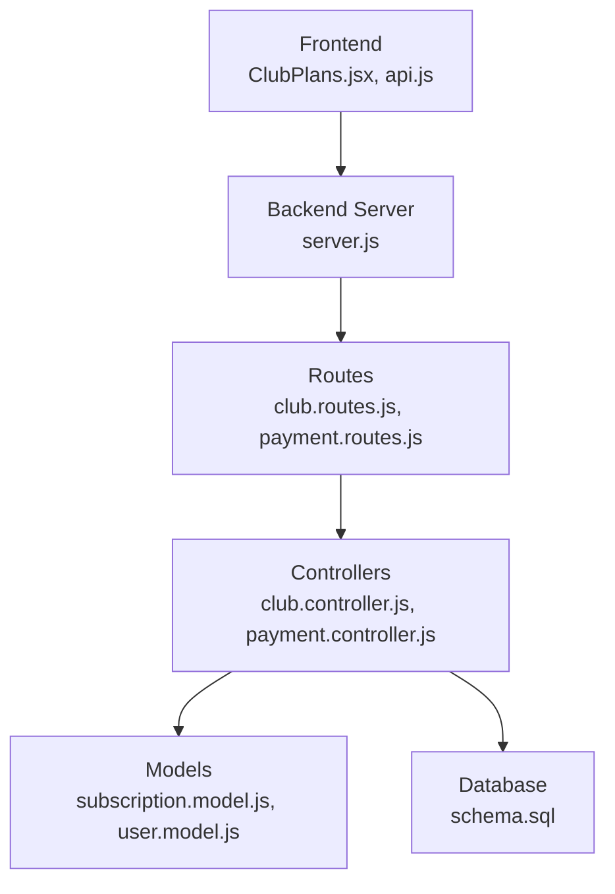
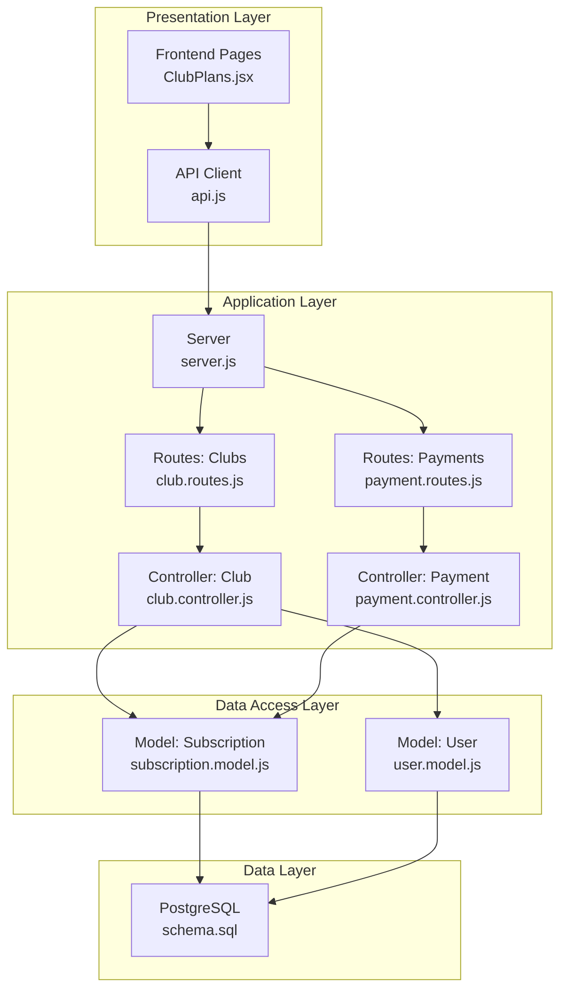
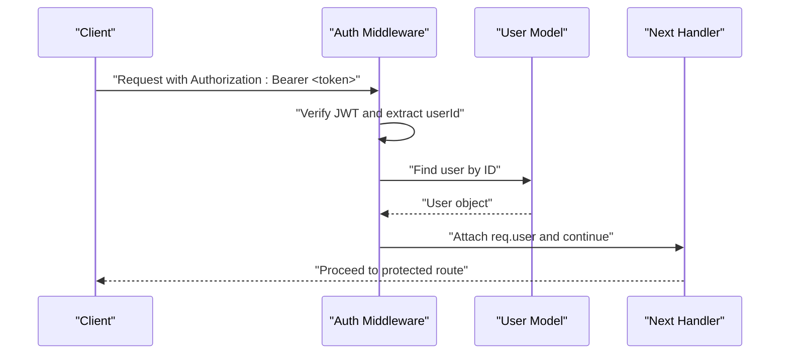
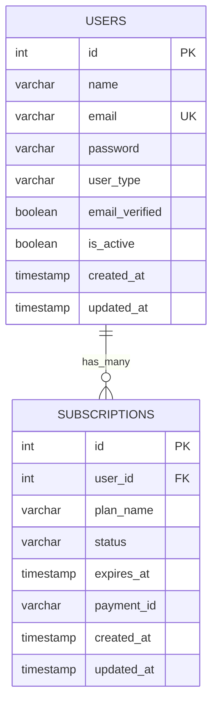
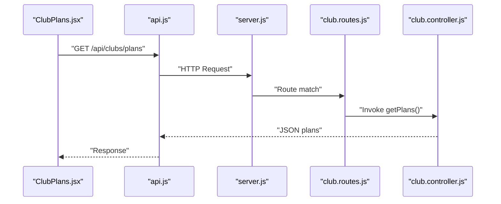
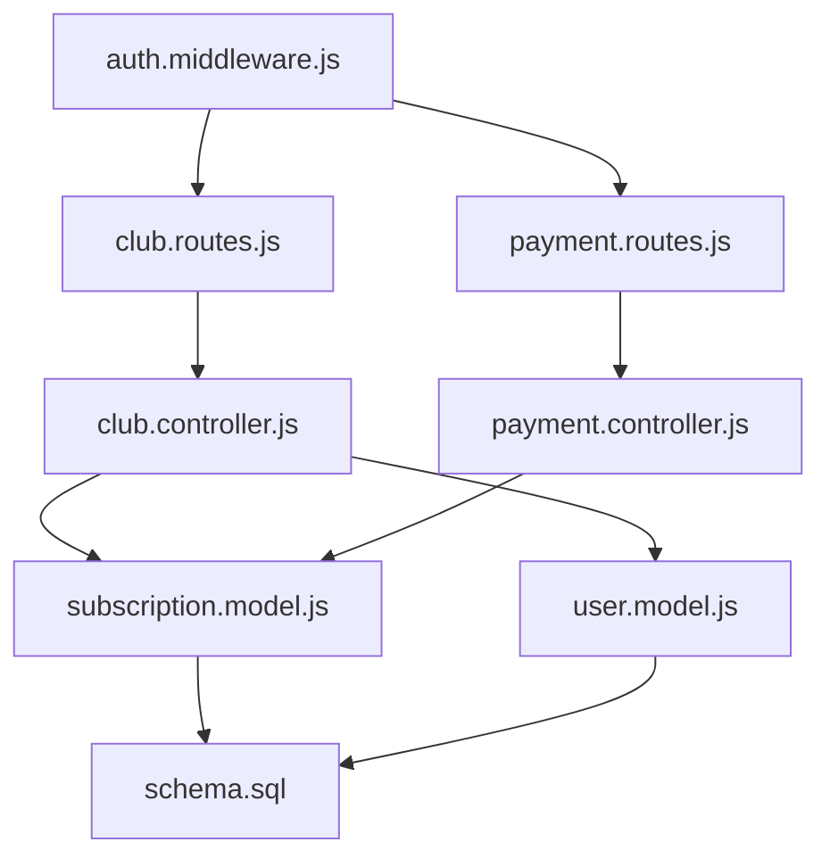

# Club Subscriptions

<cite>
**Referenced Files in This Document**
- [server.js](file://backend/server.js)
- [schema.sql](file://database/schema.sql)
- [auth.middleware.js](file://backend/middleware/auth.middleware.js)
- [club.controller.js](file://backend/controllers/club.controller.js)
- [club.routes.js](file://backend/routes/club.routes.js)
- [payment.controller.js](file://backend/controllers/payment.controller.js)
- [payment.routes.js](file://backend/routes/payment.routes.js)
- [subscription.model.js](file://backend/models/subscription.model.js)
- [user.model.js](file://backend/models/user.model.js)
- [api.js](file://frontend/src/services/api.js)
- [ClubPlans.jsx](file://frontend/src/pages/ClubPlans.jsx)
- [AdminDashboard.jsx](file://frontend/src/pages/AdminDashboard.jsx)
</cite>

## Table of Contents
1. [Introduction](#introduction)
2. [Project Structure](#project-structure)
3. [Core Components](#core-components)
4. [Architecture Overview](#architecture-overview)
5. [Detailed Component Analysis](#detailed-component-analysis)
6. [Dependency Analysis](#dependency-analysis)
7. [Performance Considerations](#performance-considerations)
8. [Troubleshooting Guide](#troubleshooting-guide)
9. [Conclusion](#conclusion)
10. [Appendices](#appendices)

## Introduction
This document provides comprehensive API documentation for club subscription management and premium features. It covers subscription plan selection, enrollment, renewal, and cancellation endpoints, along with access control mechanisms for premium features, quota management, and feature limitations. It specifies HTTP methods, URL patterns, payment-related request schemas, and subscription status handling. Examples of club onboarding workflows, subscription management scenarios, and premium feature access patterns are included, along with the relationship between subscriptions and platform access, including tier-based feature availability and usage tracking.

## Project Structure
The subscription system spans backend APIs, database schema, and frontend integration:
- Backend server exposes REST endpoints under /api for authentication, club operations, and payments.
- Database schema defines users, subscriptions, and related entities with appropriate constraints.
- Frontend integrates with the backend via an API client and renders subscription plans and dashboards.

**Diagram sources**
- [server.js:1-40](file://backend/server.js#L1-L40)
- [club.routes.js:1-13](file://backend/routes/club.routes.js#L1-L13)
- [payment.routes.js:1-13](file://backend/routes/payment.routes.js#L1-L13)
- [club.controller.js:1-100](file://backend/controllers/club.controller.js#L1-L100)
- [payment.controller.js:1-108](file://backend/controllers/payment.controller.js#L1-L108)
- [subscription.model.js:1-55](file://backend/models/subscription.model.js#L1-L55)
- [user.model.js:1-42](file://backend/models/user.model.js#L1-L42)
- [schema.sql:1-185](file://database/schema.sql#L1-L185)
- [api.js:1-36](file://frontend/src/services/api.js#L1-L36)
- [ClubPlans.jsx:1-209](file://frontend/src/pages/ClubPlans.jsx#L1-L209)

**Section sources**
- [server.js:1-40](file://backend/server.js#L1-L40)
- [schema.sql:1-185](file://database/schema.sql#L1-L185)

## Core Components
- Authentication middleware enforces JWT-based authentication and optional authorization checks.
- Subscription model encapsulates CRUD operations and status checks against the database.
- Payment controller handles video packages and subscription plan pricing and initiates mock payments.
- Club controller manages plan retrieval, subscription creation, subscription status checks, and dashboard access.
- Frontend components integrate with the backend to render plans and manage user sessions.

**Section sources**
- [auth.middleware.js:1-59](file://backend/middleware/auth.middleware.js#L1-L59)
- [subscription.model.js:1-55](file://backend/models/subscription.model.js#L1-L55)
- [payment.controller.js:1-108](file://backend/controllers/payment.controller.js#L1-L108)
- [club.controller.js:1-100](file://backend/controllers/club.controller.js#L1-L100)
- [api.js:1-36](file://frontend/src/services/api.js#L1-L36)
- [ClubPlans.jsx:1-209](file://frontend/src/pages/ClubPlans.jsx#L1-L209)

## Architecture Overview
The system follows a layered architecture:
- Presentation layer (frontend) communicates with the backend via HTTP requests.
- Application layer (Express routes and controllers) orchestrates business logic.
- Data access layer (models) interacts with PostgreSQL via connection pooling.
- Database layer persists user, subscription, and payment data with constraints.

**Diagram sources**
- [server.js:1-40](file://backend/server.js#L1-L40)
- [club.routes.js:1-13](file://backend/routes/club.routes.js#L1-L13)
- [payment.routes.js:1-13](file://backend/routes/payment.routes.js#L1-L13)
- [club.controller.js:1-100](file://backend/controllers/club.controller.js#L1-L100)
- [payment.controller.js:1-108](file://backend/controllers/payment.controller.js#L1-L108)
- [subscription.model.js:1-55](file://backend/models/subscription.model.js#L1-L55)
- [user.model.js:1-42](file://backend/models/user.model.js#L1-L42)
- [schema.sql:1-185](file://database/schema.sql#L1-L185)
- [api.js:1-36](file://frontend/src/services/api.js#L1-L36)
- [ClubPlans.jsx:1-209](file://frontend/src/pages/ClubPlans.jsx#L1-L209)

## Detailed Component Analysis

### Authentication and Authorization
- Authentication middleware validates Bearer tokens and attaches user context to requests.
- Authorization middleware restricts endpoints to specific user types (club, scout).

**Diagram sources**
- [auth.middleware.js:4-33](file://backend/middleware/auth.middleware.js#L4-L33)
- [user.model.js:26-34](file://backend/models/user.model.js#L26-L34)

**Section sources**
- [auth.middleware.js:1-59](file://backend/middleware/auth.middleware.js#L1-L59)
- [user.model.js:1-42](file://backend/models/user.model.js#L1-L42)

### Subscription Management Endpoints

#### GET /api/clubs/plans
- Purpose: Retrieve available subscription plans.
- Authentication: Public endpoint.
- Response: List of plans with keys and metadata.

**Section sources**
- [club.routes.js:6](file://backend/routes/club.routes.js#L6)
- [club.controller.js:11-17](file://backend/controllers/club.controller.js#L11-L17)

#### POST /api/clubs/subscribe
- Purpose: Create a new subscription for the authenticated user.
- Authentication: Required.
- Authorization: club or scout.
- Request body: plan_name, expires_at, payment_id.
- Response: Created subscription object.

**Section sources**
- [club.routes.js:7](file://backend/routes/club.routes.js#L7)
- [club.controller.js:19-43](file://backend/controllers/club.controller.js#L19-L43)
- [subscription.model.js:4-16](file://backend/models/subscription.model.js#L4-L16)

#### GET /api/clubs/subscription
- Purpose: Retrieve the authenticated user's latest subscription and compute active status.
- Authentication: Required.
- Response: Subscription record with computed is_active flag and plan_details.

**Section sources**
- [club.routes.js:8](file://backend/routes/club.routes.js#L8)
- [club.controller.js:45-64](file://backend/controllers/club.controller.js#L45-L64)
- [subscription.model.js:18-27](file://backend/models/subscription.model.js#L18-L27)

#### GET /api/clubs/check-access
- Purpose: Check if the authenticated user has an active subscription.
- Authentication: Required.
- Response: Boolean indicating access eligibility.

**Section sources**
- [club.routes.js:9](file://backend/routes/club.routes.js#L9)
- [club.controller.js:66-74](file://backend/controllers/club.controller.js#L66-L74)
- [subscription.model.js:29-40](file://backend/models/subscription.model.js#L29-L40)

#### GET /api/clubs/dashboard
- Purpose: Access the club/scout dashboard gated by active subscription.
- Authentication: Required.
- Authorization: club or scout.
- Response: Dashboard data including recent athletes, featured videos, and stats.

**Section sources**
- [club.routes.js:10](file://backend/routes/club.routes.js#L10)
- [club.controller.js:76-99](file://backend/controllers/club.controller.js#L76-L99)

### Payment Endpoints

#### GET /api/payments/video-packages
- Purpose: Retrieve available video purchase packages.
- Authentication: Public endpoint.
- Response: List of video packages.

**Section sources**
- [payment.routes.js:6](file://backend/routes/payment.routes.js#L6)
- [payment.controller.js:15-21](file://backend/controllers/payment.controller.js#L15-L21)

#### GET /api/payments/subscription-plans
- Purpose: Retrieve available subscription plans.
- Authentication: Public endpoint.
- Response: List of subscription plans.

**Section sources**
- [payment.routes.js:7](file://backend/routes/payment.routes.js#L7)
- [payment.controller.js:23-29](file://backend/controllers/payment.controller.js#L23-L29)

#### POST /api/payments/video
- Purpose: Initiate a video package purchase.
- Authentication: Required.
- Request body: package_type.
- Response: Mock payment initiation details.

**Section sources**
- [payment.routes.js:8](file://backend/routes/payment.routes.js#L8)
- [payment.controller.js:31-51](file://backend/controllers/payment.controller.js#L31-L51)

#### POST /api/payments/subscription
- Purpose: Initiate a subscription payment.
- Authentication: Required.
- Request body: plan_name.
- Response: Mock payment initiation details including expires_at.

**Section sources**
- [payment.routes.js:9](file://backend/routes/payment.routes.js#L9)
- [payment.controller.js:53-77](file://backend/controllers/payment.controller.js#L53-L77)

#### POST /api/payments/confirm
- Purpose: Confirm payment and activate subscription.
- Authentication: Required.
- Request body: payment_id, type, plan_name, expires_at.
- Response: Confirmation message and subscription object.

**Section sources**
- [payment.routes.js:10](file://backend/routes/payment.routes.js#L10)
- [payment.controller.js:79-107](file://backend/controllers/payment.controller.js#L79-L107)
- [subscription.model.js:4-16](file://backend/models/subscription.model.js#L4-L16)

### Database Schema and Subscription Model
The subscription lifecycle is persisted in the subscriptions table with constraints for status and plan names. The model provides methods to create, find by user, check active status, and update status.

**Diagram sources**
- [schema.sql:14-24](file://database/schema.sql#L14-L24)
- [schema.sql:90-101](file://database/schema.sql#L90-L101)

**Section sources**
- [schema.sql:1-185](file://database/schema.sql#L1-L185)
- [subscription.model.js:1-55](file://backend/models/subscription.model.js#L1-L55)

### Frontend Integration
- The API client injects Authorization headers for authenticated requests.
- The Club Plans page fetches available plans and navigates users accordingly.
- Admin Dashboard displays subscription records for monitoring.

**Diagram sources**
- [ClubPlans.jsx:21-30](file://frontend/src/pages/ClubPlans.jsx#L21-L30)
- [api.js:10-21](file://frontend/src/services/api.js#L10-L21)
- [server.js:24](file://backend/server.js#L24)
- [club.routes.js:6](file://backend/routes/club.routes.js#L6)
- [club.controller.js:11-17](file://backend/controllers/club.controller.js#L11-L17)

**Section sources**
- [api.js:1-36](file://frontend/src/services/api.js#L1-L36)
- [ClubPlans.jsx:1-209](file://frontend/src/pages/ClubPlans.jsx#L1-L209)
- [AdminDashboard.jsx:276-316](file://frontend/src/pages/AdminDashboard.jsx#L276-L316)

## Dependency Analysis
The following diagram shows key dependencies among components involved in subscription management.

**Diagram sources**
- [auth.middleware.js:1-59](file://backend/middleware/auth.middleware.js#L1-L59)
- [club.routes.js:1-13](file://backend/routes/club.routes.js#L1-L13)
- [payment.routes.js:1-13](file://backend/routes/payment.routes.js#L1-L13)
- [club.controller.js:1-100](file://backend/controllers/club.controller.js#L1-L100)
- [payment.controller.js:1-108](file://backend/controllers/payment.controller.js#L1-L108)
- [subscription.model.js:1-55](file://backend/models/subscription.model.js#L1-L55)
- [user.model.js:1-42](file://backend/models/user.model.js#L1-L42)
- [schema.sql:1-185](file://database/schema.sql#L1-L185)

**Section sources**
- [club.controller.js:1-100](file://backend/controllers/club.controller.js#L1-L100)
- [payment.controller.js:1-108](file://backend/controllers/payment.controller.js#L1-L108)
- [subscription.model.js:1-55](file://backend/models/subscription.model.js#L1-L55)
- [user.model.js:1-42](file://backend/models/user.model.js#L1-L42)
- [schema.sql:1-185](file://database/schema.sql#L1-L185)

## Performance Considerations
- Token verification and user lookup occur per request; caching user roles or lightweight role checks could reduce overhead.
- Subscription queries filter by user and status; ensure database indexes on user_id and status improve lookup performance.
- Pagination or limits should be considered for dashboard endpoints returning large datasets.

## Troubleshooting Guide
Common issues and resolutions:
- Authentication failures: Verify Authorization header format and token validity.
- Authorization errors: Ensure user_type matches required roles (club, scout).
- Subscription not found: Confirm the user has an existing subscription record.
- Active status discrepancies: Check status and expiration timestamps in the subscriptions table.

**Section sources**
- [auth.middleware.js:24-32](file://backend/middleware/auth.middleware.js#L24-L32)
- [club.controller.js:50-52](file://backend/controllers/club.controller.js#L50-L52)
- [subscription.model.js:29-40](file://backend/models/subscription.model.js#L29-L40)

## Conclusion
The subscription system provides a clear pathway for club and scout users to select plans, initiate payments, and gain access to premium features. Authentication and authorization guards protect sensitive endpoints, while the database schema enforces data integrity. The frontend integrates seamlessly with backend APIs to support onboarding and dashboard experiences.

## Appendices

### API Reference Summary

- Base URL: /api
- Authentication: Bearer token via Authorization header
- Content-Type: application/json

Endpoints:
- GET /clubs/plans
  - Description: Retrieve available subscription plans
  - Auth: None
  - Response: Array of plan objects

- POST /clubs/subscribe
  - Description: Create a new subscription
  - Auth: Required
  - Roles: club, scout
  - Body: { plan_name, expires_at, payment_id }
  - Response: { message, subscription }

- GET /clubs/subscription
  - Description: Get user's latest subscription and active status
  - Auth: Required
  - Response: { ..., is_active, plan_details }

- GET /clubs/check-access
  - Description: Check if user has active subscription
  - Auth: Required
  - Response: { has_access }

- GET /clubs/dashboard
  - Description: Access dashboard gated by active subscription
  - Auth: Required
  - Roles: club, scout
  - Response: { recent_athletes, featured_videos, stats }

- GET /payments/video-packages
  - Description: Retrieve video purchase packages
  - Auth: None
  - Response: Array of package objects

- GET /payments/subscription-plans
  - Description: Retrieve subscription plans
  - Auth: None
  - Response: Array of plan objects

- POST /payments/video
  - Description: Initiate video package payment
  - Auth: Required
  - Body: { package_type }
  - Response: { message, package, payment_url, mock_payment_id }

- POST /payments/subscription
  - Description: Initiate subscription payment
  - Auth: Required
  - Body: { plan_name }
  - Response: { message, plan, payment_url, mock_payment_id, expires_at }

- POST /payments/confirm
  - Description: Confirm payment and activate subscription
  - Auth: Required
  - Body: { payment_id, type, plan_name, expires_at }
  - Response: { message, subscription }

**Section sources**
- [club.routes.js:6-10](file://backend/routes/club.routes.js#L6-L10)
- [payment.routes.js:6-10](file://backend/routes/payment.routes.js#L6-L10)
- [club.controller.js:11-17](file://backend/controllers/club.controller.js#L11-L17)
- [club.controller.js:19-43](file://backend/controllers/club.controller.js#L19-L43)
- [club.controller.js:45-64](file://backend/controllers/club.controller.js#L45-L64)
- [club.controller.js:66-74](file://backend/controllers/club.controller.js#L66-L74)
- [club.controller.js:76-99](file://backend/controllers/club.controller.js#L76-L99)
- [payment.controller.js:15-21](file://backend/controllers/payment.controller.js#L15-L21)
- [payment.controller.js:23-29](file://backend/controllers/payment.controller.js#L23-L29)
- [payment.controller.js:31-51](file://backend/controllers/payment.controller.js#L31-L51)
- [payment.controller.js:53-77](file://backend/controllers/payment.controller.js#L53-L77)
- [payment.controller.js:79-107](file://backend/controllers/payment.controller.js#L79-L107)

### Subscription Status Handling
- Active: status = 'active' and expires_at > now()
- Cancelled: status = 'cancelled'
- Expired: status = 'expired'

**Section sources**
- [subscription.model.js:29-40](file://backend/models/subscription.model.js#L29-L40)
- [schema.sql:95](file://database/schema.sql#L95)

### Premium Feature Access Patterns
- Dashboard access requires active subscription.
- Subscription status is checked before rendering premium content.
- Admin dashboard displays subscription records for monitoring.

**Section sources**
- [club.controller.js:76-99](file://backend/controllers/club.controller.js#L76-L99)
- [AdminDashboard.jsx:276-316](file://frontend/src/pages/AdminDashboard.jsx#L276-L316)