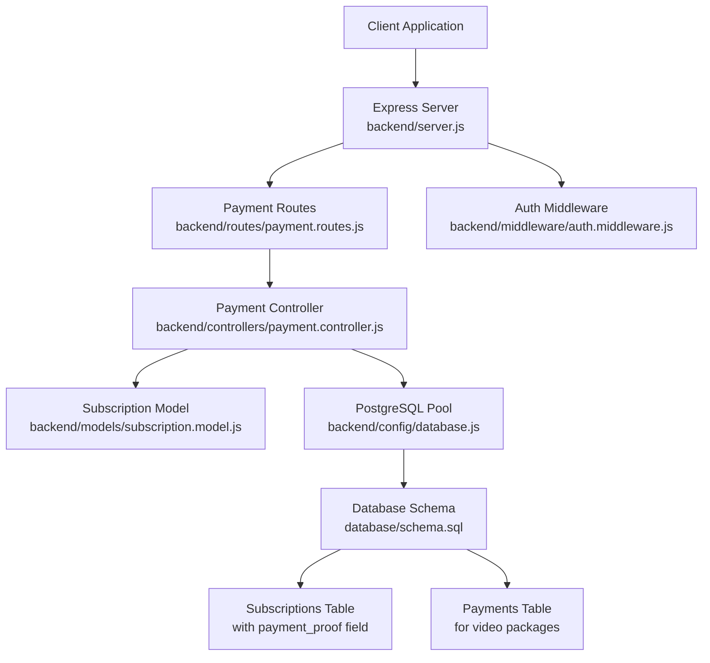
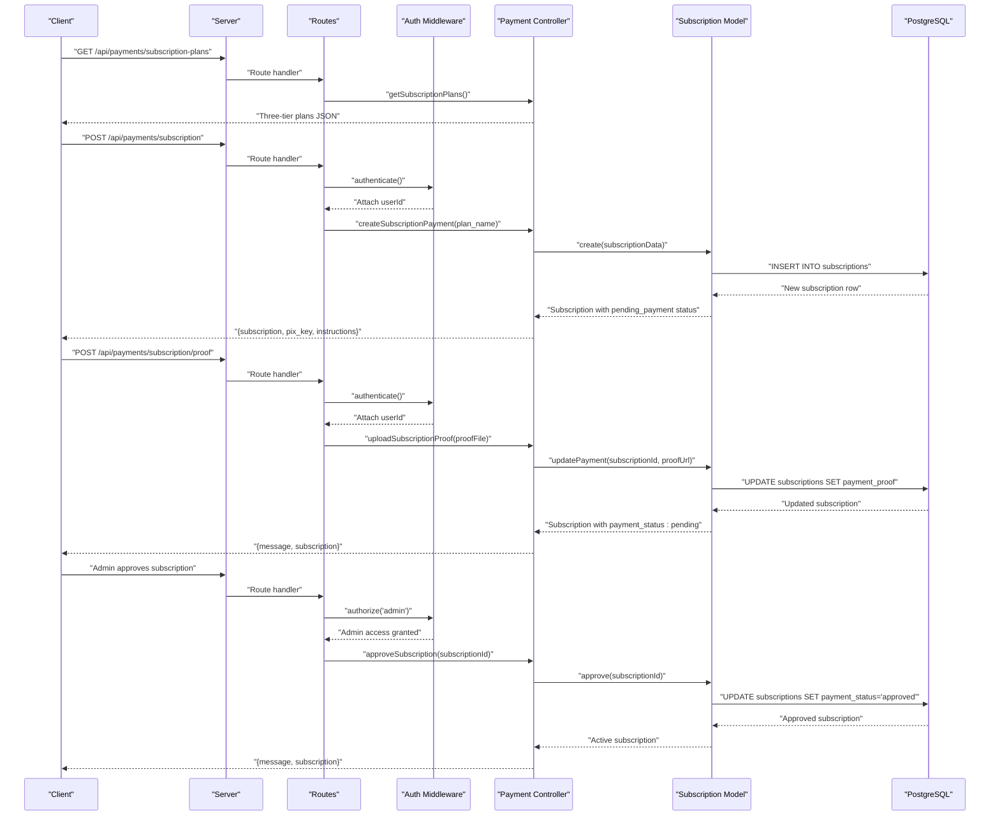
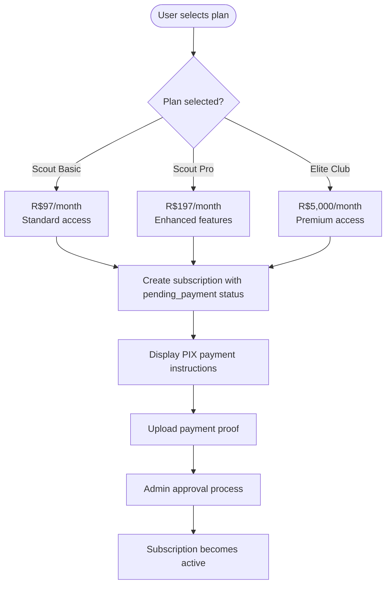
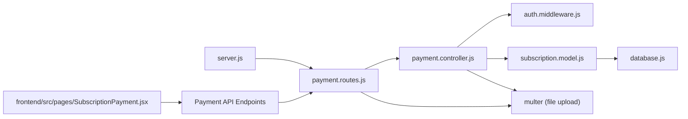
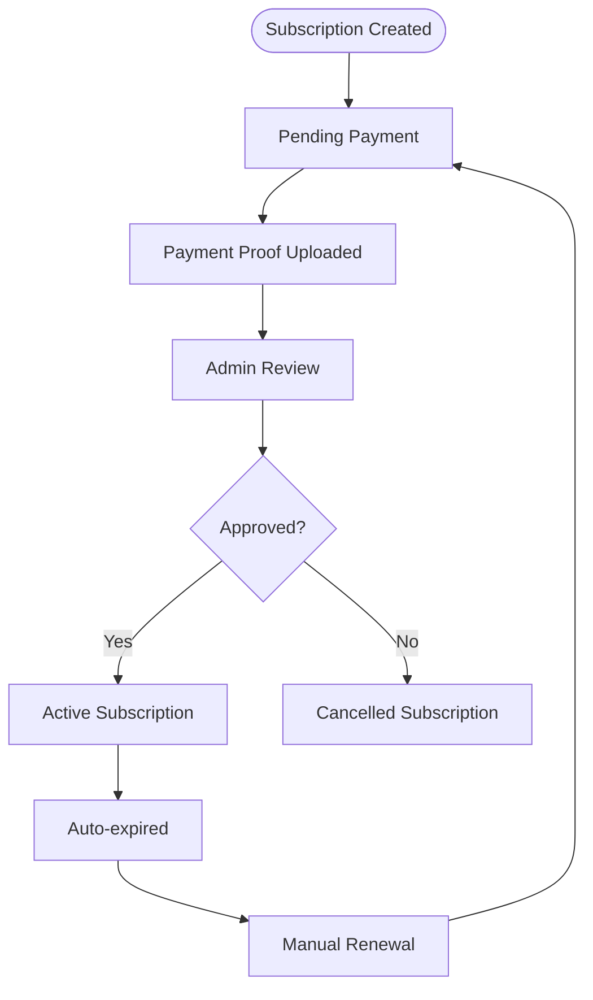

# Payment Processing

<cite>
**Referenced Files in This Document**
- [server.js](file://backend/server.js)
- [payment.routes.js](file://backend/routes/payment.routes.js)
- [payment.controller.js](file://backend/controllers/payment.controller.js)
- [subscription.model.js](file://backend/models/subscription.model.js)
- [auth.middleware.js](file://backend/middleware/auth.middleware.js)
- [database.js](file://backend/config/database.js)
- [schema.sql](file://database/schema.sql)
- [package.json](file://backend/package.json)
- [SubscriptionPayment.jsx](file://frontend/src/pages/SubscriptionPayment.jsx)
- [ClubPlans.jsx](file://frontend/src/pages/ClubPlans.jsx)
</cite>

## Update Summary
**Changes Made**
- Added comprehensive documentation for the new three-tier subscription payment system
- Documented PIX payment processing workflow with manual approval process
- Added payment proof management system with file upload and validation
- Updated subscription status tracking with payment status indicators
- Enhanced admin panel functionality for subscription approval/rejection
- Added detailed frontend integration examples for subscription payment flow

## Table of Contents
1. [Introduction](#introduction)
2. [Project Structure](#project-structure)
3. [Core Components](#core-components)
4. [Architecture Overview](#architecture-overview)
5. [Detailed Component Analysis](#detailed-component-analysis)
6. [Three-Tier Subscription System](#three-tier-subscription-system)
7. [PIX Payment Processing](#pix-payment-processing)
8. [Payment Proof Management](#payment-proof-management)
9. [Admin Subscription Management](#admin-subscription-management)
10. [Frontend Integration](#frontend-integration)
11. [Dependency Analysis](#dependency-analysis)
12. [Performance Considerations](#performance-considerations)
13. [Troubleshooting Guide](#troubleshooting-guide)
14. [Security and Compliance](#security-and-compliance)
15. [Refund and Recurring Payments](#refund-and-recurring-payments)
16. [Conclusion](#conclusion)

## Introduction
This document provides comprehensive API documentation for the payment processing and transaction management system, with a focus on the new three-tier subscription payment system featuring PIX payment processing and payment proof management. The system supports three distinct pricing tiers (Scout Basic, Scout Pro, and Elite Club) with manual payment verification through administrative approval. It covers payment initiation, confirmation, status tracking, and the complete payment proof workflow from upload to approval.

## Project Structure
The payment subsystem is organized around Express routes, a controller with subscription management capabilities, a subscription model with payment proof support, and shared authentication middleware. The server mounts the payment routes under the base path `/api/payments`. The system now includes dedicated endpoints for subscription management, PIX information retrieval, and payment proof uploads.

**Diagram sources**
- [server.js:15-26](file://backend/server.js#L15-L26)
- [payment.routes.js:1-45](file://backend/routes/payment.routes.js#L1-L45)
- [payment.controller.js:1-205](file://backend/controllers/payment.controller.js#L1-L205)
- [subscription.model.js:1-155](file://backend/models/subscription.model.js#L1-L155)
- [database.js:1-13](file://backend/config/database.js#L1-L13)
- [schema.sql:100-122](file://database/schema.sql#L100-L122)

**Section sources**
- [server.js:15-26](file://backend/server.js#L15-L26)
- [payment.routes.js:1-45](file://backend/routes/payment.routes.js#L1-L45)

## Core Components
- **Payment Routes**: Expose endpoints for subscription plans, PIX information, subscription creation, payment proof uploads, and subscription status checking.
- **Payment Controller**: Implements business logic for subscription management, payment proof handling, and administrative approval workflows.
- **Subscription Model**: Handles subscription creation, status updates, payment proof management, and administrative approval/rejection.
- **Authentication Middleware**: Ensures requests are authenticated with valid JWT tokens for protected endpoints.
- **Database Layer**: Provides connection pooling and persists subscriptions with payment proof tracking and status management.

Key capabilities:
- Three-tier subscription pricing (Scout Basic, Scout Pro, Elite Club)
- PIX payment processing with manual verification
- Payment proof upload and validation
- Subscription status tracking with payment status indicators
- Administrative approval workflow
- Frontend integration for subscription payment flow

**Section sources**
- [payment.routes.js:32-42](file://backend/routes/payment.routes.js#L32-L42)
- [payment.controller.js:5-205](file://backend/controllers/payment.controller.js#L5-L205)
- [subscription.model.js:3-155](file://backend/models/subscription.model.js#L3-L155)
- [auth.middleware.js:4-33](file://backend/middleware/auth.middleware.js#L4-L33)
- [database.js:4-10](file://backend/config/database.js#L4-L10)

## Architecture Overview
The payment flow now includes a sophisticated three-tier subscription system with PIX payment processing and manual approval. The controller manages subscription creation, payment proof uploads, and administrative workflows. The subscription model handles status transitions from pending payment to active with payment proof verification.

**Diagram sources**
- [payment.routes.js:32-42](file://backend/routes/payment.routes.js#L32-L42)
- [auth.middleware.js:4-33](file://backend/middleware/auth.middleware.js#L4-L33)
- [payment.controller.js:34-105](file://backend/controllers/payment.controller.js#L34-L105)
- [subscription.model.js:78-98](file://backend/models/subscription.model.js#L78-L98)

## Detailed Component Analysis

### Subscription Endpoints
- **GET /api/payments/subscription-plans**
  - Purpose: Retrieve available three-tier subscription plans and pricing.
  - Authentication: Not required.
  - Response: JSON object containing three subscription plans:
    - scout_basic: R$97/month
    - scout_pro: R$197/month  
    - elite_club: R$5,000/month

- **GET /api/payments/pix-info**
  - Purpose: Retrieve PIX payment information for manual transfers.
  - Authentication: Not required.
  - Response: JSON object containing PIX key, bank, and instructions.

- **POST /api/payments/subscription**
  - Purpose: Create a new subscription with pending payment status.
  - Authentication: Required (Bearer token).
  - Request body: `{ plan_name: string }`
  - Response: Subscription object with pending payment status and PIX instructions.
  - Error responses: 400 for invalid plan, 500 for internal server error.

- **POST /api/payments/subscription/proof**
  - Purpose: Upload payment proof for subscription verification.
  - Authentication: Required (Bearer token).
  - Request body: Form-data with `proof` file and optional `subscription_id`.
  - Response: Updated subscription with payment_status set to 'pending'.
  - Error responses: 400 for missing file, 404 for not found, 500 for internal server error.

- **GET /api/payments/subscription/status**
  - Purpose: Check current user's subscription status.
  - Authentication: Required (Bearer token).
  - Response: JSON object with subscription details and status indicators.
  - Error responses: 500 for internal server error.

**Section sources**
- [payment.routes.js:32-37](file://backend/routes/payment.routes.js#L32-L37)
- [payment.controller.js:14-205](file://backend/controllers/payment.controller.js#L14-L205)

### Payment Confirmation Endpoint
- **POST /api/payments/confirm**
  - Purpose: Confirm payment and create subscription for completed payments.
  - Authentication: Required (Bearer token).
  - Request body: `{ payment_id, type: 'subscription', plan_name, expires_at, user_id }`
  - Response: Newly created subscription with pending payment status.
  - Error responses: 500 for internal server error.

**Section sources**
- [payment.routes.js:37](file://backend/routes/payment.routes.js#L37)
- [payment.controller.js:175-204](file://backend/controllers/payment.controller.js#L175-L204)

## Three-Tier Subscription System
The system now supports three distinct subscription tiers with different pricing and feature sets:

### Scout Basic Plan
- **Price**: R$97/month
- **Features**: Standard access to platform features
- **Target Audience**: Individual scouts and basic users
- **Status**: Default plan available for new subscriptions

### Scout Pro Plan  
- **Price**: R$197/month
- **Features**: Enhanced access with priority features
- **Target Audience**: Professional scouts and advanced users
- **Status**: Most popular plan with promotional badge

### Elite Club Plan
- **Price**: R$5,000/month
- **Features**: Premium access with exclusive features
- **Target Audience**: Clubs and organizations
- **Status**: Highest tier with dedicated support

**Diagram sources**
- [payment.controller.js:5-9](file://backend/controllers/payment.controller.js#L5-L9)
- [payment.controller.js:34-70](file://backend/controllers/payment.controller.js#L34-L70)

**Section sources**
- [payment.controller.js:5-9](file://backend/controllers/payment.controller.js#L5-L9)
- [ClubPlans.jsx:103-130](file://frontend/src/pages/ClubPlans.jsx#L103-L130)

## PIX Payment Processing
The system implements a manual PIX payment processing workflow with the following steps:

### Payment Flow
1. **Subscription Creation**: User selects plan and creates subscription with pending payment status
2. **PIX Instructions**: System displays PIX key, bank, and payment instructions
3. **Manual Transfer**: User performs PIX transfer to provided key
4. **Proof Upload**: User uploads payment proof screenshot
5. **Admin Review**: Administrator reviews and approves/rejects payment
6. **Subscription Activation**: Approved subscriptions become active

### PIX Configuration
- **PIX Key**: santossilvac990@gmail.com
- **Bank**: PagBank
- **Instructions**: Manual approval process within 24 hours

### File Upload Requirements
- **Supported Formats**: JPG, PNG, GIF, WebP, PDF
- **Maximum Size**: 5MB
- **Storage Location**: `/uploads/payments/` directory

**Section sources**
- [payment.controller.js:11-12](file://backend/controllers/payment.controller.js#L11-L12)
- [payment.controller.js:22-32](file://backend/controllers/payment.controller.js#L22-L32)
- [payment.routes.js:8-30](file://backend/routes/payment.routes.js#L8-L30)

## Payment Proof Management
The payment proof management system handles the complete workflow from proof upload to administrative approval:

### Upload Process
- **File Validation**: Multer middleware validates file types and size limits
- **Storage**: Files are saved with unique filenames in uploads/payments/
- **Database Update**: Payment proof URL is stored in subscription record
- **Status Transition**: Subscription payment_status changes to 'pending'

### Administrative Workflow
- **Pending List**: Admin can view all subscriptions awaiting approval
- **Approval Process**: Admin approves or rejects payment proofs
- **Status Updates**: Automatic status transitions to approved/rejected
- **Access Control**: Only admin users can access approval endpoints

### Status Tracking
- **payment_status**: pending, approved, rejected
- **subscription status**: pending_payment, active, expired, cancelled
- **Real-time Updates**: Frontend displays current status with appropriate UI feedback

**Section sources**
- [payment.routes.js:8-30](file://backend/routes/payment.routes.js#L8-L30)
- [payment.controller.js:73-105](file://backend/controllers/payment.controller.js#L73-L105)
- [subscription.model.js:78-109](file://backend/models/subscription.model.js#L78-L109)

## Admin Subscription Management
Administrative endpoints provide comprehensive control over subscription approvals:

### Admin Endpoints
- **GET /api/payments/subscription/pending**: List all pending subscriptions for review
- **PUT /api/payments/subscription/:id/approve**: Approve a subscription payment
- **PUT /api/payments/subscription/:id/reject**: Reject a subscription payment

### Approval Workflow
1. **Pending Review**: Admin views all subscriptions with payment_proof but pending approval
2. **Manual Verification**: Admin reviews uploaded payment proof
3. **Decision Making**: Approve or reject based on verification
4. **Automatic Updates**: Status changes trigger appropriate database updates
5. **Notification**: System automatically updates subscription status

### Access Control
- **Authorization Required**: Only users with admin role can access these endpoints
- **Validation**: System verifies subscription ownership and user permissions
- **Error Handling**: Proper error responses for unauthorized access attempts

**Section sources**
- [payment.routes.js:39-42](file://backend/routes/payment.routes.js#L39-L42)
- [payment.controller.js:107-173](file://backend/controllers/payment.controller.js#L107-L173)
- [subscription.model.js:140-151](file://backend/models/subscription.model.js#L140-L151)

## Frontend Integration
The frontend provides comprehensive integration with the subscription payment system:

### Subscription Payment Page
- **Plan Selection**: Interactive plan comparison with pricing and features
- **Status Display**: Real-time status updates for current subscriptions
- **Payment Instructions**: Clear PIX payment instructions with copy-to-clipboard
- **Proof Upload**: Integrated file upload with preview and validation
- **Approval Status**: Visual indicators for pending, approved, or rejected status

### Component Features
- **Authentication**: Redirects unauthenticated users to registration
- **Plan Navigation**: Direct links to plan selection from club dashboard
- **Responsive Design**: Mobile-friendly interface for all devices
- **Error Handling**: Comprehensive error messages and user guidance
- **Loading States**: Visual feedback during upload and approval processes

### Integration Points
- **API Calls**: Direct integration with payment endpoints
- **State Management**: React hooks for managing subscription state
- **File Upload**: FormData integration for proof submission
- **Real-time Updates**: Automatic status refresh after actions

**Section sources**
- [SubscriptionPayment.jsx:10-21](file://frontend/src/pages/SubscriptionPayment.jsx#L10-L21)
- [SubscriptionPayment.jsx:38-59](file://frontend/src/pages/SubscriptionPayment.jsx#L38-L59)
- [ClubPlans.jsx:32-38](file://frontend/src/pages/ClubPlans.jsx#L32-L38)

## Dependency Analysis
- Express server registers payment routes with multer middleware for file uploads
- Payment routes depend on authentication middleware and authorization for admin endpoints
- Payment controller depends on subscription model for all subscription operations
- Subscription model uses database pool for persistent storage with payment proof tracking
- Frontend components integrate with payment API endpoints for complete workflow

**Diagram sources**
- [server.js:15-26](file://backend/server.js#L15-L26)
- [payment.routes.js:1-45](file://backend/routes/payment.routes.js#L1-L45)
- [payment.controller.js:1-205](file://backend/controllers/payment.controller.js#L1-L205)
- [subscription.model.js:1-155](file://backend/models/subscription.model.js#L1-L155)
- [database.js:1-13](file://backend/config/database.js#L1-L13)

**Section sources**
- [server.js:15-26](file://backend/server.js#L15-L26)
- [payment.routes.js:1-45](file://backend/routes/payment.routes.js#L1-L45)
- [package.json:10-20](file://backend/package.json#L10-L20)

## Performance Considerations
- Database queries for subscriptions use indexes on user_id, status, and payment_status for efficient lookups
- File upload handling uses streaming for large file processing
- Payment proof storage uses unique filenames to prevent conflicts
- Updated timestamps are managed via triggers for automatic updates
- Recommendations:
  - Implement file cleanup for expired subscriptions
  - Add pagination for admin pending subscription lists
  - Consider CDN for payment proof storage
  - Monitor upload performance for large files

**Section sources**
- [schema.sql:144-156](file://database/schema.sql#L144-L156)
- [subscription.model.js:18-51](file://backend/models/subscription.model.js#L18-L51)
- [payment.routes.js:8-30](file://backend/routes/payment.routes.js#L8-L30)

## Troubleshooting Guide
Common issues and resolutions:
- **Authentication failures**:
  - Missing or malformed Authorization header: returns 401 with token-related messages
  - Expired or invalid tokens: returns 401 with appropriate error messages
- **Invalid plan selections**:
  - Nonexistent plan keys: returns 400 with "Plano inválido" error
- **File upload issues**:
  - Unsupported file types: returns 400 with validation error
  - File too large: returns 400 with size limit exceeded error
- **Subscription management**:
  - Unauthorized admin access: returns 403 for non-admin users
  - Subscription not found: returns 404 with appropriate error message
- **Internal errors**:
  - Unhandled exceptions: returns 500 with error details

Operational checks:
- Verify JWT_SECRET environment variable is set
- Confirm database credentials and connectivity
- Ensure upload directory has write permissions
- Check file storage space availability

**Section sources**
- [auth.middleware.js:4-33](file://backend/middleware/auth.middleware.js#L4-L33)
- [payment.controller.js:39](file://backend/controllers/payment.controller.js#L39)
- [payment.controller.js:78-80](file://backend/controllers/payment.controller.js#L78-L80)
- [payment.controller.js:112-114](file://backend/controllers/payment.controller.js#L112-L114)

## Security and Compliance
- **Authentication**:
  - All payment endpoints except public plan listings require valid Bearer token
  - Admin endpoints require additional authorization role validation
  - Token verification enforces JWT expiration and validity
- **Data Protection**:
  - Payment proof files are stored securely with unique filenames
  - File upload validation prevents malicious file types
  - Database encryption for sensitive subscription data
- **PCI DSS Considerations**:
  - Current implementation uses manual PIX transfers, reducing PCI scope
  - Payment proof storage avoids sensitive card data collection
  - Future MercadoPago integration requires proper PCI compliance
- **Environment Configuration**:
  - Ensure JWT_SECRET and database credentials are set via environment variables
  - Configure upload directory permissions securely
  - Implement proper file access controls

**Section sources**
- [auth.middleware.js:4-33](file://backend/middleware/auth.middleware.js#L4-L33)
- [payment.routes.js:20-30](file://backend/routes/payment.routes.js#L20-L30)
- [subscription.model.js:78-87](file://backend/models/subscription.model.js#L78-L87)

## Refund and Recurring Payments
- **Refunds**:
  - Manual refund process through administrative interface
  - Payment proof retention for audit purposes
  - Status tracking for refunded subscriptions
- **Recurring Payments**:
  - Monthly billing cycle with automatic expiration tracking
  - Automated expiration detection and status updates
  - Manual renewal process through subscription creation
- **Subscription Lifecycle**:
  - Pending payment: Initial subscription creation
  - Payment pending: Waiting for payment proof approval
  - Active: Subscription fully approved and functional
  - Expired: Automatic status after expiration date
  - Cancelled: Manual cancellation or rejection

**Diagram sources**
- [subscription.model.js:89-109](file://backend/models/subscription.model.js#L89-L109)
- [payment.controller.js:107-133](file://backend/controllers/payment.controller.js#L107-L133)

**Section sources**
- [subscription.model.js:112-137](file://backend/models/subscription.model.js#L112-L137)
- [payment.controller.js:135-163](file://backend/controllers/payment.controller.js#L135-L163)

## Conclusion
The payment subsystem now provides a comprehensive three-tier subscription system with PIX payment processing and payment proof management. The system supports manual payment verification through administrative approval, ensuring secure and reliable subscription management. Key improvements include:

- **Three-tier pricing plans** with clear feature differentiation
- **PIX payment processing** with manual verification workflow
- **Payment proof management** with file upload and validation
- **Administrative approval system** for payment verification
- **Real-time status tracking** with comprehensive frontend integration
- **Enhanced security** with proper authentication and authorization

To enhance the system for production:
- Implement automated PIX webhook integration for payment verification
- Add email notifications for subscription status changes
- Implement automated subscription renewal processes
- Add comprehensive logging for all payment activities
- Consider adding MercadoPago integration for automated payment processing
- Implement backup and recovery procedures for payment proof storage