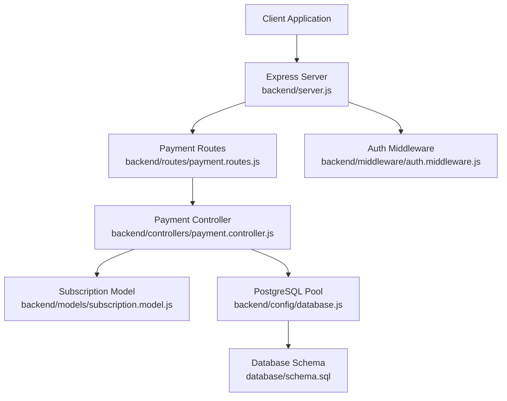
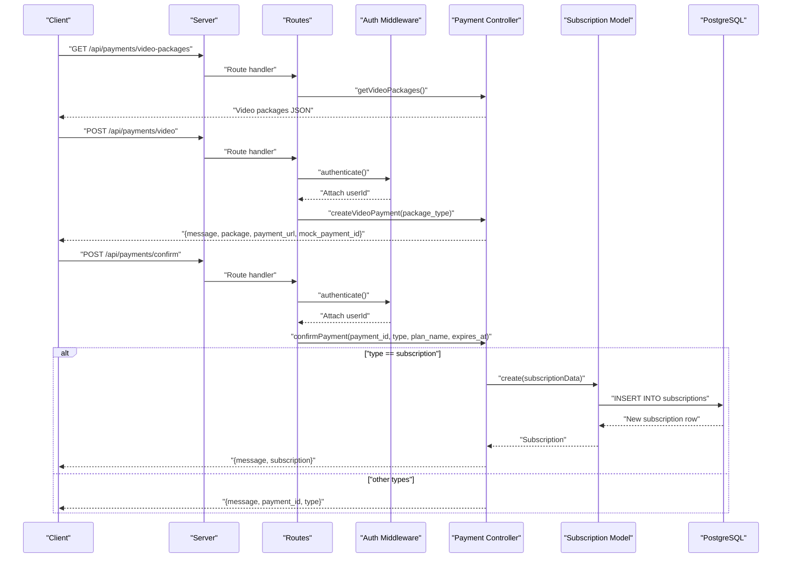
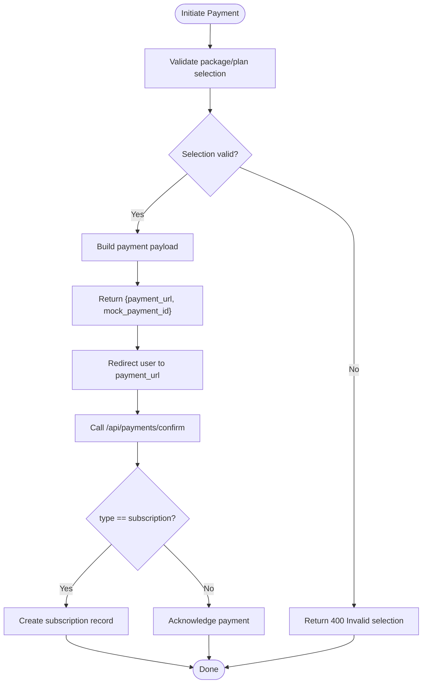
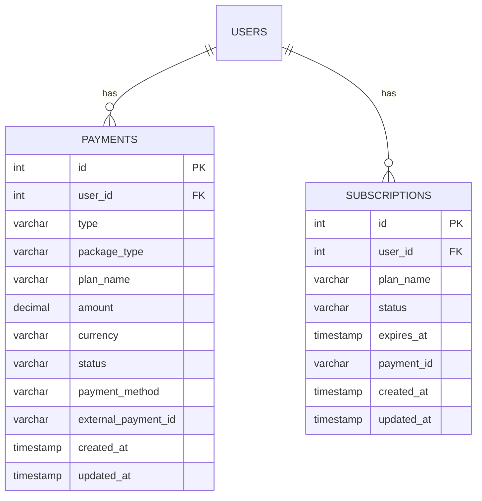
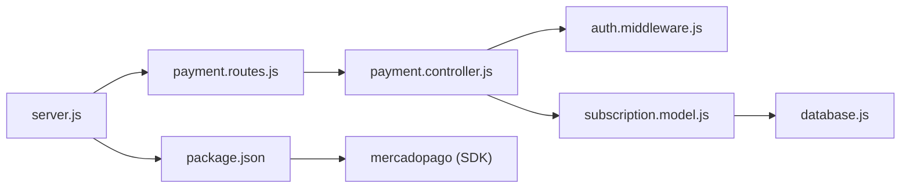
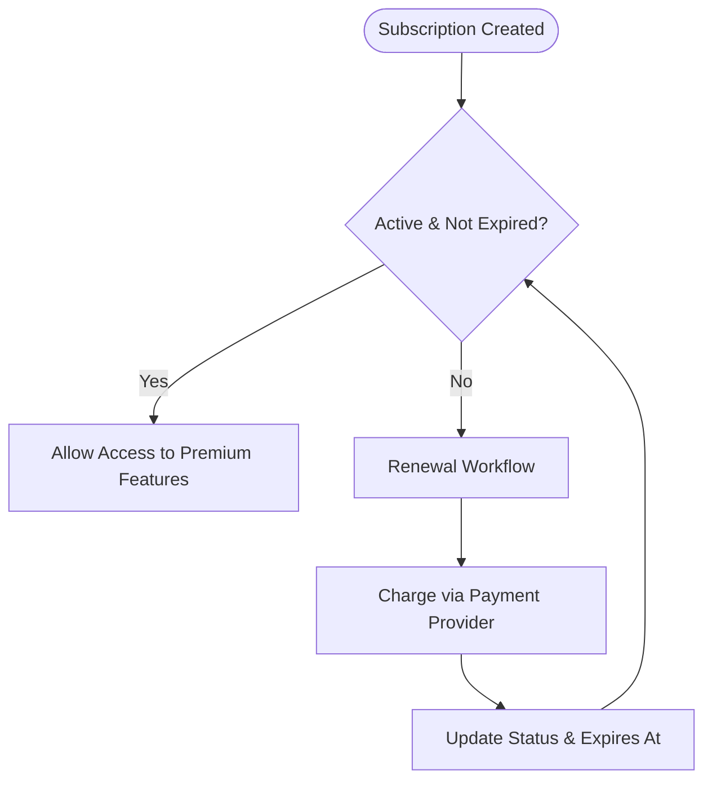

# Payment Processing

<cite>
**Referenced Files in This Document**
- [server.js](file://backend/server.js)
- [payment.routes.js](file://backend/routes/payment.routes.js)
- [payment.controller.js](file://backend/controllers/payment.controller.js)
- [subscription.model.js](file://backend/models/subscription.model.js)
- [auth.middleware.js](file://backend/middleware/auth.middleware.js)
- [database.js](file://backend/config/database.js)
- [schema.sql](file://database/schema.sql)
- [package.json](file://backend/package.json)
</cite>

## Table of Contents
1. [Introduction](#introduction)
2. [Project Structure](#project-structure)
3. [Core Components](#core-components)
4. [Architecture Overview](#architecture-overview)
5. [Detailed Component Analysis](#detailed-component-analysis)
6. [Dependency Analysis](#dependency-analysis)
7. [Performance Considerations](#performance-considerations)
8. [Troubleshooting Guide](#troubleshooting-guide)
9. [Security and Compliance](#security-and-compliance)
10. [Refund and Recurring Payments](#refund-and-recurring-payments)
11. [Conclusion](#conclusion)

## Introduction
This document provides comprehensive API documentation for payment processing and transaction management in the platform. It covers payment initiation, confirmation, and status tracking endpoints, including mock integration patterns and the underlying transaction logging via the database. It also outlines workflows for video packages and subscription plans, error handling, and security considerations. The current implementation exposes mock payment URLs and stores payment metadata in the database, while the MercadoPago SDK is present for future integration.

## Project Structure
The payment subsystem is organized around Express routes, a controller, a subscription model, and shared authentication middleware. The server mounts the payment routes under the base path `/api/payments`.

**Diagram sources**
- [server.js:15-26](file://backend/server.js#L15-L26)
- [payment.routes.js:1-12](file://backend/routes/payment.routes.js#L1-L12)
- [payment.controller.js:1-107](file://backend/controllers/payment.controller.js#L1-L107)
- [subscription.model.js:1-52](file://backend/models/subscription.model.js#L1-L52)
- [database.js:1-13](file://backend/config/database.js#L1-L13)
- [schema.sql:103-118](file://database/schema.sql#L103-L118)

**Section sources**
- [server.js:15-26](file://backend/server.js#L15-L26)
- [payment.routes.js:1-12](file://backend/routes/payment.routes.js#L1-L12)

## Core Components
- Payment Routes: Expose endpoints for retrieving available packages/plans and initiating/confirming payments.
- Payment Controller: Implements business logic for video package purchases and subscription payments, returning mock payment URLs and identifiers.
- Subscription Model: Handles subscription creation and status checks against the database.
- Authentication Middleware: Ensures requests are authenticated with a valid JWT before accessing protected endpoints.
- Database Layer: Provides connection pooling and persists payments and subscriptions.

Key capabilities:
- Retrieve video packages and subscription plans
- Initiate video and subscription payments with mock URLs
- Confirm payments and activate subscriptions
- Store payment metadata and subscription records

**Section sources**
- [payment.routes.js:6-10](file://backend/routes/payment.routes.js#L6-L10)
- [payment.controller.js:15-107](file://backend/controllers/payment.controller.js#L15-L107)
- [subscription.model.js:4-51](file://backend/models/subscription.model.js#L4-L51)
- [auth.middleware.js:4-33](file://backend/middleware/auth.middleware.js#L4-L33)
- [database.js:4-10](file://backend/config/database.js#L4-L10)

## Architecture Overview
The payment flow follows a request-response pattern with authentication enforced per endpoint. The controller returns a mock payment URL and a generated identifier, enabling client-side redirection to a payment page. Upon completion, clients call the confirmation endpoint to finalize the transaction and, for subscriptions, create a subscription record.

**Diagram sources**
- [payment.routes.js:6-10](file://backend/routes/payment.routes.js#L6-L10)
- [auth.middleware.js:4-33](file://backend/middleware/auth.middleware.js#L4-L33)
- [payment.controller.js:31-107](file://backend/controllers/payment.controller.js#L31-L107)
- [subscription.model.js:4-16](file://backend/models/subscription.model.js#L4-L16)

## Detailed Component Analysis

### Payment Endpoints
- GET /api/payments/video-packages
  - Purpose: Retrieve available video packages and pricing.
  - Authentication: Not required.
  - Response: JSON object containing package definitions.
  - Notes: Returns predefined packages keyed by identifiers.

- GET /api/payments/subscription-plans
  - Purpose: Retrieve available subscription plans and pricing.
  - Authentication: Not required.
  - Response: JSON object containing plan definitions.

- POST /api/payments/video
  - Purpose: Initiate a video package purchase.
  - Authentication: Required (Bearer token).
  - Request body:
    - package_type: string (must match a valid package key)
  - Response:
    - message: string
    - package: object { quantity, price }
    - payment_url: string (mock endpoint)
    - mock_payment_id: string (unique identifier)
  - Error responses:
    - 400: Invalid package type
    - 500: Internal server error

- POST /api/payments/subscription
  - Purpose: Initiate a subscription payment.
  - Authentication: Required (Bearer token).
  - Request body:
    - plan_name: string (must match a valid plan key)
  - Response:
    - message: string
    - plan: object { name, price }
    - payment_url: string (mock endpoint)
    - mock_payment_id: string (unique identifier)
    - expires_at: timestamp (one month from now)
  - Error responses:
    - 400: Invalid plan name
    - 500: Internal server error

- POST /api/payments/confirm
  - Purpose: Confirm payment and finalize transaction.
  - Authentication: Required (Bearer token).
  - Request body:
    - payment_id: string
    - type: string ("subscription" or other)
    - plan_name: string (required if type == "subscription")
    - expires_at: timestamp (required if type == "subscription")
  - Response:
    - If type == "subscription":
      - message: string
      - subscription: object (newly created subscription)
    - Else:
      - message: string
      - payment_id: string
      - type: string
  - Error responses:
    - 500: Internal server error

**Section sources**
- [payment.routes.js:6-10](file://backend/routes/payment.routes.js#L6-L10)
- [payment.controller.js:15-107](file://backend/controllers/payment.controller.js#L15-L107)

### Mock Payment Integration Pattern
- Both video and subscription initiation endpoints return a mock payment URL and a unique mock payment identifier.
- Clients are expected to redirect users to the returned payment URL to complete the transaction.
- After completion, clients call the confirmation endpoint with the payment identifier and type to finalize the transaction.

**Diagram sources**
- [payment.controller.js:31-77](file://backend/controllers/payment.controller.js#L31-L77)
- [payment.controller.js:79-107](file://backend/controllers/payment.controller.js#L79-L107)

### Transaction Logging and Database Schema
- Payments are logged in the payments table with fields for type, amount, currency, status, method, and external identifiers.
- Subscriptions are stored in the subscriptions table with plan name, status, expiration date, and associated payment identifier.
- Timestamp triggers automatically update updated_at on row updates.

**Diagram sources**
- [schema.sql:103-118](file://database/schema.sql#L103-L118)
- [schema.sql:90-101](file://database/schema.sql#L90-L101)

**Section sources**
- [schema.sql:103-118](file://database/schema.sql#L103-L118)
- [schema.sql:90-101](file://database/schema.sql#L90-L101)

## Dependency Analysis
- Express server registers payment routes and applies global middleware for CORS and JSON parsing.
- Payment routes depend on the authentication middleware to attach user identity to requests.
- Payment controller depends on the subscription model for subscription creation and on the database pool for persistence.
- The MercadoPago SDK is included as a dependency but is not currently integrated in the payment controller.

**Diagram sources**
- [server.js:15-26](file://backend/server.js#L15-L26)
- [payment.routes.js:1-12](file://backend/routes/payment.routes.js#L1-L12)
- [payment.controller.js:1-107](file://backend/controllers/payment.controller.js#L1-L107)
- [subscription.model.js:1-52](file://backend/models/subscription.model.js#L1-L52)
- [database.js:1-13](file://backend/config/database.js#L1-L13)
- [package.json:10-20](file://backend/package.json#L10-L20)

**Section sources**
- [server.js:15-26](file://backend/server.js#L15-L26)
- [package.json:10-20](file://backend/package.json#L10-L20)

## Performance Considerations
- Database queries for subscriptions use indexes on user_id and status for efficient lookups.
- Updated timestamps are managed via triggers to avoid manual updates.
- Recommendations:
  - Add pagination for listing subscriptions if scale grows.
  - Consider caching plan and package definitions if frequently accessed.
  - Monitor query performance for subscription status checks and payment inserts.

**Section sources**
- [schema.sql:140-156](file://database/schema.sql#L140-L156)
- [subscription.model.js:18-40](file://backend/models/subscription.model.js#L18-L40)

## Troubleshooting Guide
Common issues and resolutions:
- Authentication failures:
  - Missing or malformed Authorization header: returns 401 with token-related messages.
  - Expired or invalid tokens: returns 401 with appropriate error messages.
- Invalid payment selections:
  - Nonexistent package or plan keys: returns 400 with an error message.
- Internal errors:
  - Unhandled exceptions: returns 500 with error details.

Operational checks:
- Verify JWT_SECRET environment variable is set.
- Confirm database credentials and connectivity.
- Ensure MercadoPago SDK is configured if integrating real payments.

**Section sources**
- [auth.middleware.js:4-33](file://backend/middleware/auth.middleware.js#L4-L33)
- [payment.controller.js:36-38](file://backend/controllers/payment.controller.js#L36-L38)
- [payment.controller.js:58-60](file://backend/controllers/payment.controller.js#L58-L60)
- [payment.controller.js:104-106](file://backend/controllers/payment.controller.js#L104-L106)

## Security and Compliance
- Authentication:
  - All payment endpoints except public listings require a valid Bearer token.
  - Token verification enforces JWT expiration and validity.
- Data protection:
  - Passwords are hashed using bcrypt during user registration.
  - Payment sensitive data is not handled directly by the current controller; mock identifiers are returned.
- PCI DSS considerations:
  - Current implementation does not collect cardholder data, reducing PCI scope.
  - If integrating real payments (e.g., MercadoPago), ensure:
    - No sensitive card data touches your servers.
    - Use official SDKs and webhooks for payment events.
    - Implement secure storage for any identifiers and logs.
- Environment configuration:
  - Ensure JWT_SECRET and database credentials are set via environment variables.

**Section sources**
- [auth.middleware.js:4-33](file://backend/middleware/auth.middleware.js#L4-L33)
- [user.model.js:7](file://backend/models/user.model.js#L7)
- [package.json:17](file://backend/package.json#L17)

## Refund and Recurring Payments
- Refunds:
  - Not implemented in the current codebase. If integrating MercadoPago, use the SDK’s refund capabilities and synchronize status changes to the payments table.
- Recurring payments:
  - The current subscription model supports monthly billing cycles with an expiration date. Renewals are not automated; implement a scheduled job to check subscription status and renewal eligibility, then charge via MercadoPago and update status accordingly.
- Subscription lifecycle:
  - Creation: Active upon successful subscription payment confirmation.
  - Status checks: Use the subscription model’s isActive method to determine active status.

**Diagram sources**
- [subscription.model.js:29-40](file://backend/models/subscription.model.js#L29-L40)
- [payment.controller.js:84-96](file://backend/controllers/payment.controller.js#L84-L96)

**Section sources**
- [subscription.model.js:29-40](file://backend/models/subscription.model.js#L29-L40)
- [payment.controller.js:84-96](file://backend/controllers/payment.controller.js#L84-L96)

## Conclusion
The payment subsystem provides a clear foundation for video package and subscription purchases with mock payment URLs and robust transaction logging. Authentication is enforced, and the database schema supports both payments and subscriptions. To enhance the system for production:
- Integrate MercadoPago SDK for real payment processing and webhooks.
- Implement refund handling and automated subscription renewals.
- Strengthen logging and monitoring for payment events.
- Ensure environment variables are properly secured and rotated.