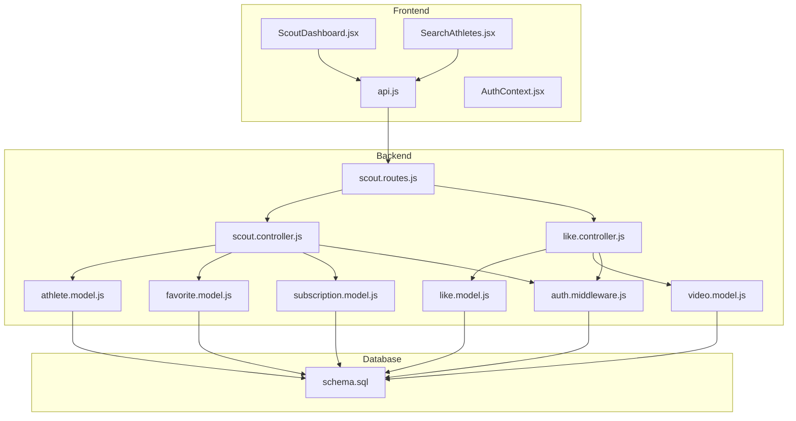
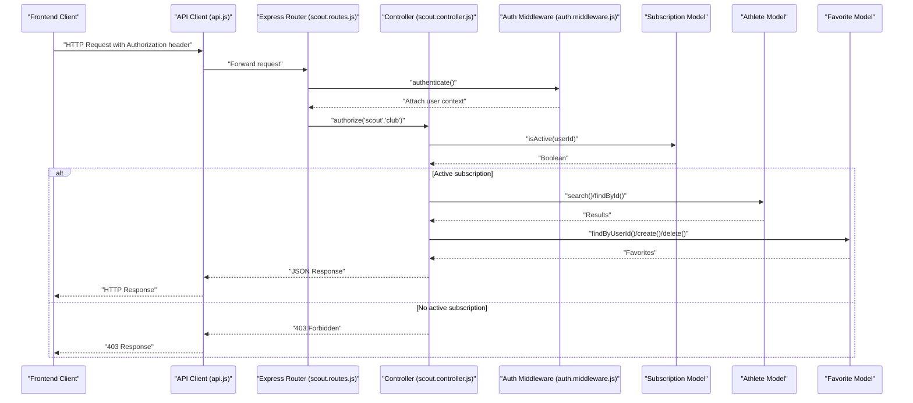
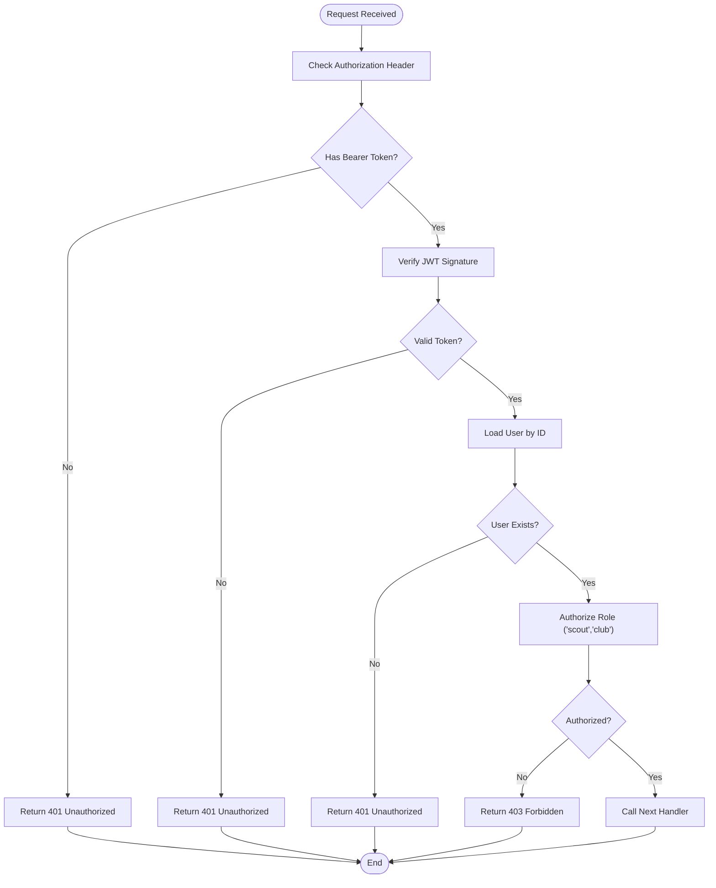
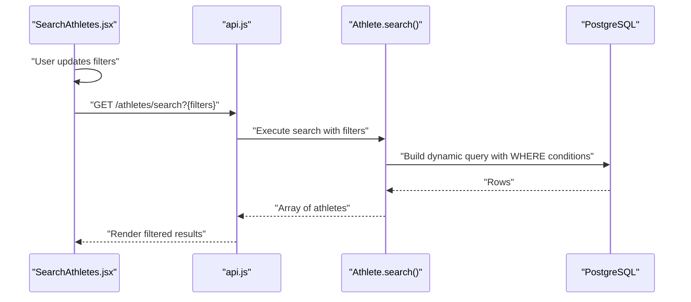
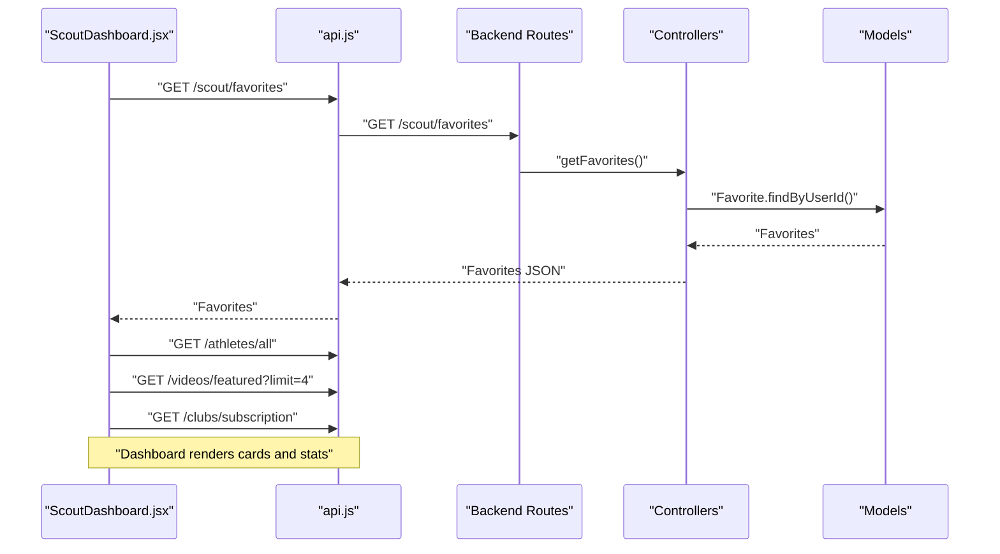
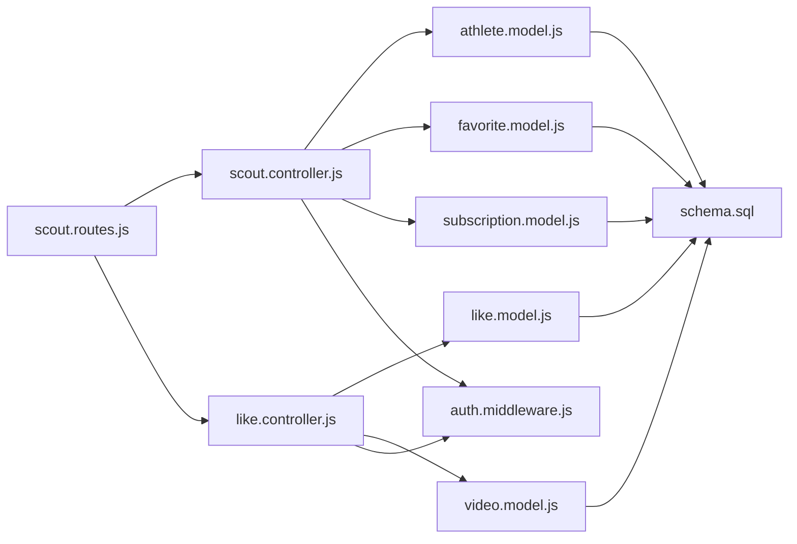
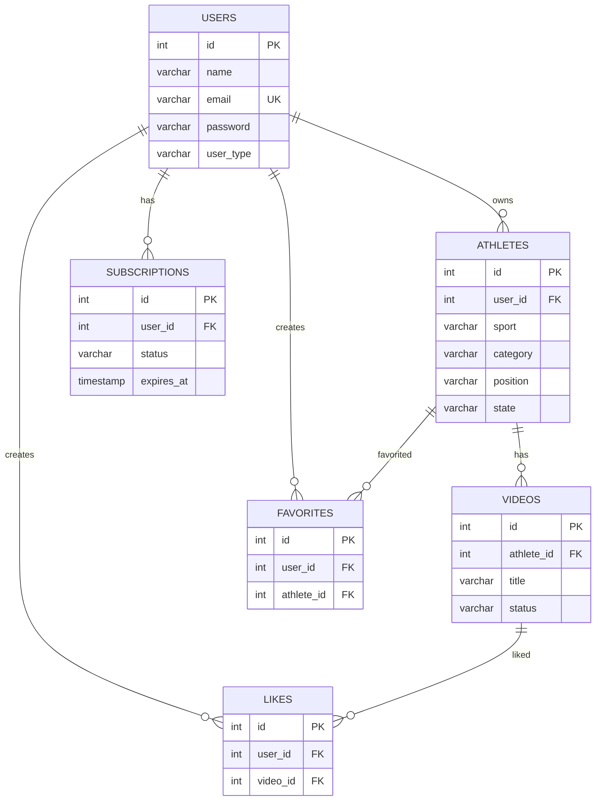

# Scout Features

<cite>
**Referenced Files in This Document**
- [scout.controller.js](file://backend/controllers/scout.controller.js)
- [scout.routes.js](file://backend/routes/scout.routes.js)
- [favorite.model.js](file://backend/models/favorite.model.js)
- [athlete.model.js](file://backend/models/athlete.model.js)
- [subscription.model.js](file://backend/models/subscription.model.js)
- [like.controller.js](file://backend/controllers/like.controller.js)
- [like.model.js](file://backend/models/like.model.js)
- [video.model.js](file://backend/models/video.model.js)
- [auth.middleware.js](file://backend/middleware/auth.middleware.js)
- [ScoutDashboard.jsx](file://frontend/src/pages/ScoutDashboard.jsx)
- [SearchAthletes.jsx](file://frontend/src/pages/SearchAthletes.jsx)
- [api.js](file://frontend/src/services/api.js)
- [AuthContext.jsx](file://frontend/src/context/AuthContext.jsx)
- [schema.sql](file://database/schema.sql)
</cite>

## Table of Contents
1. [Introduction](#introduction)
2. [Project Structure](#project-structure)
3. [Core Components](#core-components)
4. [Architecture Overview](#architecture-overview)
5. [Detailed Component Analysis](#detailed-component-analysis)
6. [Dependency Analysis](#dependency-analysis)
7. [Performance Considerations](#performance-considerations)
8. [Troubleshooting Guide](#troubleshooting-guide)
9. [Conclusion](#conclusion)
10. [Appendices](#appendices)

## Introduction
This document provides comprehensive API documentation for scout-specific features and dashboard functionality. It covers favorite management endpoints for saving athlete profiles, like/dislike operations, and preference-based search capabilities. It also documents the scout dashboard endpoints, analytics access, and search enhancement features. The documentation specifies HTTP methods, URL patterns, request/response schemas, authorization requirements, and illustrates typical scout workflow scenarios.

## Project Structure
The system follows a layered backend architecture with controllers, models, and routes, complemented by a frontend dashboard and search interface. Authentication and authorization middleware enforce role-based access control for scouts and clubs.

**Diagram sources**
- [scout.routes.js:1-13](file://backend/routes/scout.routes.js#L1-L13)
- [scout.controller.js:1-96](file://backend/controllers/scout.controller.js#L1-L96)
- [like.controller.js:1-75](file://backend/controllers/like.controller.js#L1-L75)
- [athlete.model.js:1-119](file://backend/models/athlete.model.js#L1-L119)
- [favorite.model.js:1-52](file://backend/models/favorite.model.js#L1-L52)
- [like.model.js:1-61](file://backend/models/like.model.js#L1-L61)
- [video.model.js:1-61](file://backend/models/video.model.js#L1-L61)
- [subscription.model.js:1-55](file://backend/models/subscription.model.js#L1-L55)
- [auth.middleware.js:1-59](file://backend/middleware/auth.middleware.js#L1-L59)
- [ScoutDashboard.jsx:1-254](file://frontend/src/pages/ScoutDashboard.jsx#L1-L254)
- [SearchAthletes.jsx:1-218](file://frontend/src/pages/SearchAthletes.jsx#L1-L218)
- [api.js:1-36](file://frontend/src/services/api.js#L1-L36)
- [AuthContext.jsx:1-91](file://frontend/src/context/AuthContext.jsx#L1-L91)
- [schema.sql:1-185](file://database/schema.sql#L1-L185)

**Section sources**
- [scout.routes.js:1-13](file://backend/routes/scout.routes.js#L1-L13)
- [scout.controller.js:1-96](file://backend/controllers/scout.controller.js#L1-L96)
- [auth.middleware.js:1-59](file://backend/middleware/auth.middleware.js#L1-L59)
- [schema.sql:1-185](file://database/schema.sql#L1-L185)

## Core Components
- Scout Routes: Define endpoints for search, athlete details, favorites CRUD, and authorization enforcement for scouts and clubs.
- Scout Controller: Implements search filtering, athlete detail retrieval with associated videos, favorite management, and subscription checks.
- Favorite Model: Manages creation, lookup, and deletion of favorites with user-athlete relationships.
- Subscription Model: Validates active subscriptions for premium features.
- Like Controller and Models: Handles like/unlike operations on videos and counts retrieval.
- Frontend Dashboard and Search: Provide UI for dashboard analytics, favorites management, and advanced athlete search.

**Section sources**
- [scout.routes.js:6-10](file://backend/routes/scout.routes.js#L6-L10)
- [scout.controller.js:6-95](file://backend/controllers/scout.controller.js#L6-L95)
- [favorite.model.js:3-49](file://backend/models/favorite.model.js#L3-L49)
- [subscription.model.js:29-40](file://backend/models/subscription.model.js#L29-L40)
- [like.controller.js:4-74](file://backend/controllers/like.controller.js#L4-L74)
- [like.model.js:3-57](file://backend/models/like.model.js#L3-L57)
- [ScoutDashboard.jsx:26-46](file://frontend/src/pages/ScoutDashboard.jsx#L26-L46)
- [SearchAthletes.jsx:30-45](file://frontend/src/pages/SearchAthletes.jsx#L30-L45)

## Architecture Overview
The system enforces JWT-based authentication and role-based authorization. Requests flow from the frontend through the API client, to Express routes, controllers, and models, interacting with PostgreSQL via connection pooling. Subscription checks gate access to premium features.

**Diagram sources**
- [scout.routes.js:6-10](file://backend/routes/scout.routes.js#L6-L10)
- [scout.controller.js:6-95](file://backend/controllers/scout.controller.js#L6-L95)
- [auth.middleware.js:4-42](file://backend/middleware/auth.middleware.js#L4-L42)
- [subscription.model.js:29-40](file://backend/models/subscription.model.js#L29-L40)
- [athlete.model.js:51-86](file://backend/models/athlete.model.js#L51-L86)
- [favorite.model.js:18-48](file://backend/models/favorite.model.js#L18-L48)
- [api.js:10-33](file://frontend/src/services/api.js#L10-L33)

## Detailed Component Analysis

### Authentication and Authorization
- Authentication: Extracts Bearer token from Authorization header, verifies JWT, attaches user ID and user object to request.
- Authorization: Ensures the authenticated user has type 'scout' or 'club'.
- Optional Auth: Allows unauthenticated access for public endpoints.

**Diagram sources**
- [auth.middleware.js:4-42](file://backend/middleware/auth.middleware.js#L4-L42)

**Section sources**
- [auth.middleware.js:4-42](file://backend/middleware/auth.middleware.js#L4-L42)

### Scout Dashboard Endpoints
- GET /api/scout/search
  - Purpose: Search athletes with optional filters.
  - Authentication: Required.
  - Authorization: scout or club.
  - Subscription Check: Enforced via controller.
  - Query Parameters: sport, category, state, position.
  - Response: Array of athletes with name and metadata.
  - Example Request: GET /api/scout/search?category=Sub-17&state=SP
  - Example Response: [{ id, name, sport, category, state, position, ... }]

- GET /api/scout/athlete/:id
  - Purpose: Retrieve athlete details and associated videos.
  - Authentication: Required.
  - Authorization: scout or club.
  - Subscription Check: Enforced.
  - Path Parameters: id (athlete ID).
  - Response: Athlete object plus videos array.
  - Example Response: { id, name, sport, category, videos: [...] }

- POST /api/scout/favorites
  - Purpose: Add an athlete to favorites.
  - Authentication: Required.
  - Authorization: scout or club.
  - Subscription Check: Enforced.
  - Request Body: { athlete_id }.
  - Response: { message, favorite }.
  - Example Response: { message: "Atleta adicionado aos favoritos", favorite: { user_id, athlete_id } }

- GET /api/scout/favorites
  - Purpose: List all favorites for the authenticated user.
  - Authentication: Required.
  - Authorization: scout or club.
  - Response: Array of favorites with athlete details.
  - Example Response: [{ id, user_id, athlete_id, athlete_name, ... }]

- DELETE /api/scout/favorites/:athleteId
  - Purpose: Remove an athlete from favorites.
  - Authentication: Required.
  - Authorization: scout or club.
  - Path Parameters: athleteId.
  - Response: { message }.
  - Example Response: { message: "Atleta removido dos favoritos" }

Authorization and subscription enforcement are applied consistently across these endpoints.

**Section sources**
- [scout.routes.js:6-10](file://backend/routes/scout.routes.js#L6-L10)
- [scout.controller.js:6-95](file://backend/controllers/scout.controller.js#L6-L95)
- [favorite.model.js:18-48](file://backend/models/favorite.model.js#L18-L48)
- [athlete.model.js:51-86](file://backend/models/athlete.model.js#L51-L86)

### Preference-Based Search Enhancement
The frontend SearchAthletes page supports advanced filtering and real-time search:
- Filters: sport, category, state, position.
- Real-time search: Local filtering by athlete name in the browser.
- Endpoint used by frontend: /api/athletes/search?{filters}.

**Diagram sources**
- [SearchAthletes.jsx:30-45](file://frontend/src/pages/SearchAthletes.jsx#L30-L45)
- [athlete.model.js:51-86](file://backend/models/athlete.model.js#L51-L86)

**Section sources**
- [SearchAthletes.jsx:30-45](file://frontend/src/pages/SearchAthletes.jsx#L30-L45)
- [athlete.model.js:51-86](file://backend/models/athlete.model.js#L51-L86)

### Like/Dislike Operations (Related to Scout Workflow)
While not exclusive to scouts, likes enhance discovery and analytics:
- POST /api/likes
  - Purpose: Like a video.
  - Authentication: Required.
  - Authorization: Not enforced here; role checks handled by subscription gating.
  - Subscription Check: Enforced via controller.
  - Request Body: { video_id }.
  - Response: { message, like, likes_count }.

- DELETE /api/likes/:videoId
  - Purpose: Unlike a video.
  - Authentication: Required.
  - Path Parameters: videoId.
  - Response: { message, likes_count }.

- GET /api/likes/:videoId
  - Purpose: Get likes and count for a video.
  - Response: { likes, count }.

- GET /api/likes/check/:videoId
  - Purpose: Check if the current user liked the video.
  - Response: { has_liked: boolean }.

These endpoints support analytics and user engagement metrics visible in dashboards.

**Section sources**
- [like.controller.js:4-74](file://backend/controllers/like.controller.js#L4-L74)
- [like.model.js:18-57](file://backend/models/like.model.js#L18-L57)

### Frontend Dashboard and Analytics Access
The ScoutDashboard integrates multiple data sources:
- Fetches favorites, recent athletes, featured videos, and subscription status.
- Displays counts for favorites, available athletes, and videos.
- Restricts access if subscription is inactive.

**Diagram sources**
- [ScoutDashboard.jsx:26-46](file://frontend/src/pages/ScoutDashboard.jsx#L26-L46)
- [scout.controller.js:75-83](file://backend/controllers/scout.controller.js#L75-L83)
- [favorite.model.js:18-28](file://backend/models/favorite.model.js#L18-L28)

**Section sources**
- [ScoutDashboard.jsx:26-46](file://frontend/src/pages/ScoutDashboard.jsx#L26-L46)

### Notification Systems and Communication Features
- Communication Channels: Athletes can provide contact details (whatsapp, instagram) via their profiles.
- Notification Context: While explicit notification endpoints are not present in the backend controllers analyzed, the presence of contact fields enables scout-athlete communication workflows outside the API scope documented here.

**Section sources**
- [athlete.model.js:4-32](file://backend/models/athlete.model.js#L4-L32)
- [schema.sql:47-49](file://database/schema.sql#L47-L49)

## Dependency Analysis
The following diagram shows key dependencies among components involved in scout features.

**Diagram sources**
- [scout.routes.js:1-13](file://backend/routes/scout.routes.js#L1-L13)
- [scout.controller.js:1-96](file://backend/controllers/scout.controller.js#L1-L96)
- [like.controller.js:1-75](file://backend/controllers/like.controller.js#L1-L75)
- [athlete.model.js:1-119](file://backend/models/athlete.model.js#L1-L119)
- [favorite.model.js:1-52](file://backend/models/favorite.model.js#L1-L52)
- [like.model.js:1-61](file://backend/models/like.model.js#L1-L61)
- [video.model.js:1-61](file://backend/models/video.model.js#L1-L61)
- [subscription.model.js:1-55](file://backend/models/subscription.model.js#L1-L55)
- [auth.middleware.js:1-59](file://backend/middleware/auth.middleware.js#L1-L59)
- [schema.sql:1-185](file://database/schema.sql#L1-L185)

**Section sources**
- [scout.routes.js:1-13](file://backend/routes/scout.routes.js#L1-L13)
- [scout.controller.js:1-96](file://backend/controllers/scout.controller.js#L1-L96)
- [like.controller.js:1-75](file://backend/controllers/like.controller.js#L1-L75)
- [schema.sql:1-185](file://database/schema.sql#L1-L185)

## Performance Considerations
- Database Indexes: Strategic indexes on athletes (sport, category, state, position), favorites (user_id, athlete_id), likes (user_id, video_id), and subscriptions improve query performance for search and favorites retrieval.
- Dynamic Query Building: The athlete search method builds queries dynamically with parameterized conditions, reducing SQL injection risks and enabling efficient filtering.
- Subscription Checks: Early exit on inactive subscriptions prevents unnecessary database work for premium features.
- Frontend Parallelization: Dashboard fetches multiple resources concurrently to reduce perceived latency.

[No sources needed since this section provides general guidance]

## Troubleshooting Guide
Common issues and resolutions:
- 401 Unauthorized
  - Cause: Missing or invalid Bearer token.
  - Resolution: Ensure Authorization header is present and valid; re-authenticate if needed.
- 403 Forbidden
  - Cause: User lacks required role (scout or club) or inactive subscription.
  - Resolution: Verify user_type and activate a valid subscription.
- 404 Not Found
  - Cause: Requested athlete not found.
  - Resolution: Confirm athlete ID exists.
- 400 Bad Request (Favorites)
  - Cause: Attempting to add an already favorited athlete or missing athlete_id.
  - Resolution: Check existing favorites and ensure correct payload.

**Section sources**
- [auth.middleware.js:4-42](file://backend/middleware/auth.middleware.js#L4-L42)
- [scout.controller.js:11-13](file://backend/controllers/scout.controller.js#L11-L13)
- [scout.controller.js:35-37](file://backend/controllers/scout.controller.js#L35-L37)
- [scout.controller.js:61-63](file://backend/controllers/scout.controller.js#L61-L63)

## Conclusion
The scout feature set provides a robust foundation for athlete discovery, favorites management, and analytics-driven insights. Authentication and authorization ensure secure access, while subscription checks gate premium functionality. The frontend dashboard and search interface integrate seamlessly with backend endpoints to deliver an efficient scouting workflow.

[No sources needed since this section summarizes without analyzing specific files]

## Appendices

### API Reference Summary

- Authentication
  - Header: Authorization: Bearer <token>
  - Behavior: JWT verification, user attach, role check

- Scout Search
  - GET /api/scout/search
  - Query: sport, category, state, position
  - Response: Array of athletes

- Athlete Details
  - GET /api/scout/athlete/:id
  - Response: Athlete + videos

- Favorites Management
  - POST /api/scout/favorites
    - Body: { athlete_id }
    - Response: { message, favorite }
  - GET /api/scout/favorites
    - Response: Array of favorites
  - DELETE /api/scout/favorites/:athleteId
    - Response: { message }

- Like/Unlike (Discovery Enhancements)
  - POST /api/likes
    - Body: { video_id }
    - Response: { message, like, likes_count }
  - DELETE /api/likes/:videoId
    - Response: { message, likes_count }
  - GET /api/likes/:videoId
    - Response: { likes, count }
  - GET /api/likes/check/:videoId
    - Response: { has_liked: boolean }

**Section sources**
- [scout.routes.js:6-10](file://backend/routes/scout.routes.js#L6-L10)
- [scout.controller.js:6-95](file://backend/controllers/scout.controller.js#L6-L95)
- [like.controller.js:4-74](file://backend/controllers/like.controller.js#L4-L74)

### Data Models Overview

**Diagram sources**
- [schema.sql:14-185](file://database/schema.sql#L14-L185)