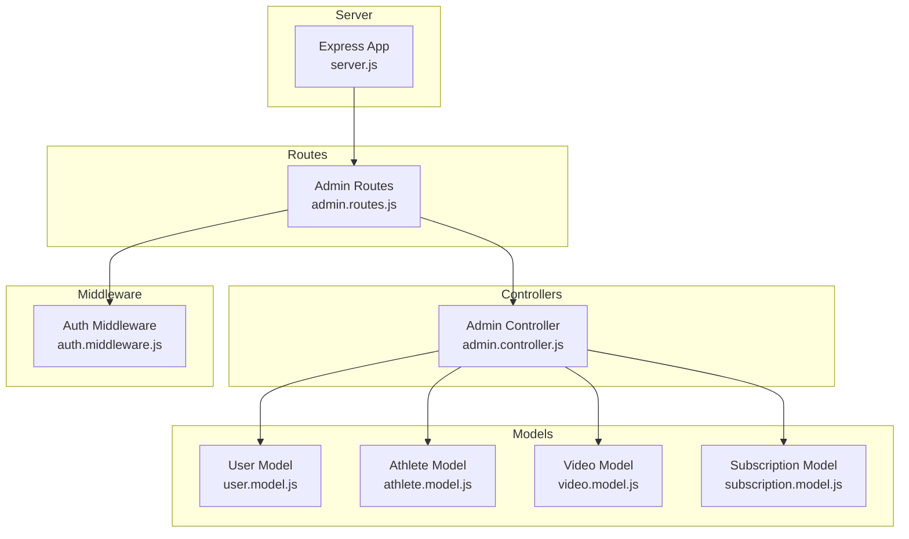
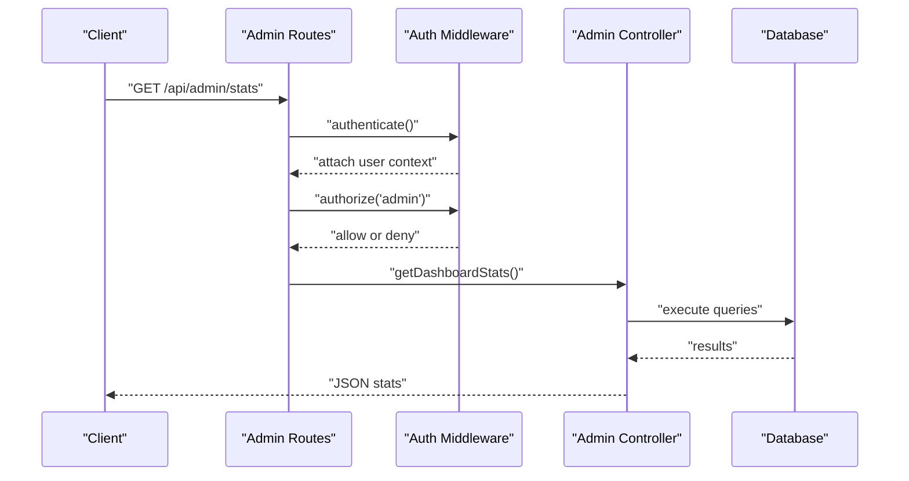
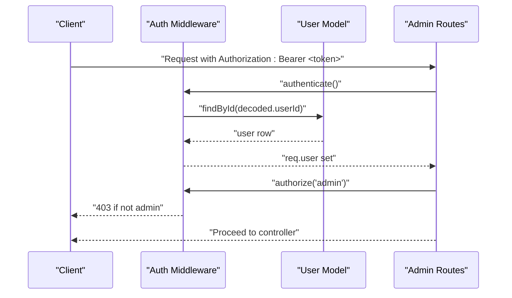
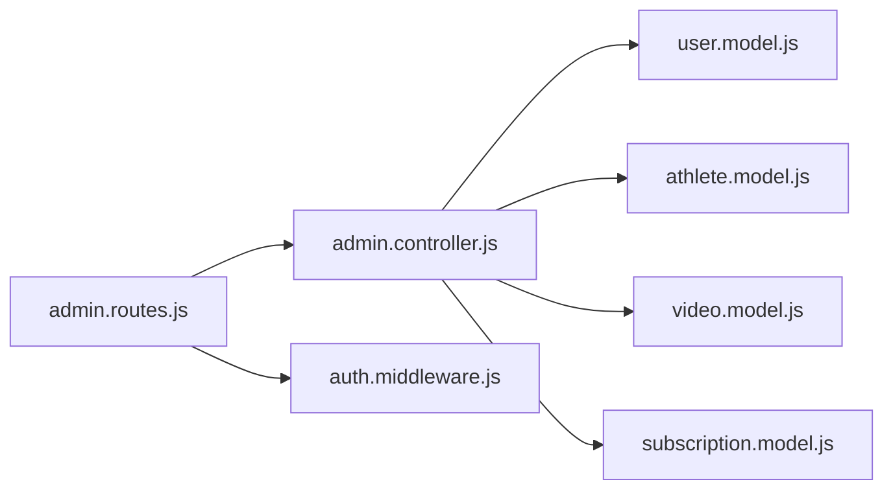

# User Management

<cite>
**Referenced Files in This Document**
- [server.js](file://backend/server.js)
- [admin.routes.js](file://backend/routes/admin.routes.js)
- [admin.controller.js](file://backend/controllers/admin.controller.js)
- [auth.middleware.js](file://backend/middleware/auth.middleware.js)
- [user.model.js](file://backend/models/user.model.js)
- [athlete.model.js](file://backend/models/athlete.model.js)
- [video.model.js](file://backend/models/video.model.js)
- [subscription.model.js](file://backend/models/subscription.model.js)
- [schema.sql](file://database/schema.sql)
</cite>

## Table of Contents
1. [Introduction](#introduction)
2. [Project Structure](#project-structure)
3. [Core Components](#core-components)
4. [Architecture Overview](#architecture-overview)
5. [Detailed Component Analysis](#detailed-component-analysis)
6. [Dependency Analysis](#dependency-analysis)
7. [Performance Considerations](#performance-considerations)
8. [Troubleshooting Guide](#troubleshooting-guide)
9. [Conclusion](#conclusion)
10. [Appendices](#appendices)

## Introduction
This document provides comprehensive API documentation for user management operations within the backend service. It focuses on administrative capabilities for managing users, their associated profiles (athletes), videos, and subscriptions. Administrative endpoints are protected and require an authenticated admin user. The documentation specifies HTTP methods, URL patterns, request/response formats, authorization requirements, validation rules, and error handling patterns. It also outlines the relationships between users and their profiles and highlights common administrative workflows.

## Project Structure
The backend is organized using a layered architecture:
- Routes define endpoint URLs and bind them to controller actions.
- Controllers encapsulate business logic and orchestrate model interactions.
- Models represent database entities and encapsulate data access.
- Middleware enforces authentication and authorization.
- The server wires all routes under a base path and exposes the API.



**Diagram sources**
- [server.js:15-26](file://backend/server.js#L15-L26)
- [admin.routes.js:1-14](file://backend/routes/admin.routes.js#L1-L14)
- [admin.controller.js:1-121](file://backend/controllers/admin.controller.js#L1-L121)
- [auth.middleware.js:1-59](file://backend/middleware/auth.middleware.js#L1-L59)
- [user.model.js:1-42](file://backend/models/user.model.js#L1-L42)
- [athlete.model.js:1-119](file://backend/models/athlete.model.js#L1-L119)
- [video.model.js:1-61](file://backend/models/video.model.js#L1-L61)
- [subscription.model.js:1-55](file://backend/models/subscription.model.js#L1-L55)

**Section sources**
- [server.js:15-26](file://backend/server.js#L15-L26)
- [admin.routes.js:1-14](file://backend/routes/admin.routes.js#L1-L14)

## Core Components
- Authentication middleware validates JWT tokens and attaches user context to requests.
- Authorization middleware restricts endpoints to specific user types (admin).
- Admin controller implements dashboard statistics, user listing, video moderation, and user deletion.
- Models encapsulate database operations for users, athletes, videos, and subscriptions.
- Database schema defines entity relationships and constraints.

Key responsibilities:
- Enforce admin-only access for sensitive operations.
- Provide aggregated analytics for platform health.
- Manage content moderation lifecycle for videos.
- Maintain user lifecycle (list, delete).

**Section sources**
- [auth.middleware.js:4-42](file://backend/middleware/auth.middleware.js#L4-L42)
- [admin.controller.js:7-121](file://backend/controllers/admin.controller.js#L7-L121)
- [user.model.js:4-38](file://backend/models/user.model.js#L4-L38)
- [athlete.model.js:3-115](file://backend/models/athlete.model.js#L3-L115)
- [video.model.js:3-57](file://backend/models/video.model.js#L3-L57)
- [subscription.model.js:3-40](file://backend/models/subscription.model.js#L3-L40)
- [schema.sql:14-101](file://database/schema.sql#L14-L101)

## Architecture Overview
The admin user management API follows a clear separation of concerns:
- Route handlers delegate to controllers after applying authentication and authorization.
- Controllers query models and return structured JSON responses.
- Middleware ensures only admins can access admin endpoints.



**Diagram sources**
- [admin.routes.js:6](file://backend/routes/admin.routes.js#L6)
- [auth.middleware.js:4-42](file://backend/middleware/auth.middleware.js#L4-L42)
- [admin.controller.js:7-31](file://backend/controllers/admin.controller.js#L7-L31)

## Detailed Component Analysis

### Admin Dashboard and User Management Endpoints
Admin-only endpoints for retrieving platform statistics, listing users, and deleting users.

- GET /api/admin/stats
  - Purpose: Retrieve aggregated platform metrics.
  - Authentication: Required.
  - Authorization: admin.
  - Response: JSON object containing counts for users, athletes, videos, active subscriptions, and counts per user type.
  - Errors: 500 on internal failure.

- GET /api/admin/users
  - Purpose: List all users with basic profile information.
  - Authentication: Required.
  - Authorization: admin.
  - Response: Array of user objects with id, name, email, user_type, created_at.
  - Errors: 500 on internal failure.

- DELETE /api/admin/users/:id
  - Purpose: Remove a user by ID.
  - Authentication: Required.
  - Authorization: admin.
  - Response: Success message upon deletion.
  - Errors: 500 on internal failure.

Authorization and validation:
- Authentication middleware verifies Bearer token and attaches user context.
- Authorization middleware enforces admin-only access.
- Validation rules are enforced by database constraints (e.g., user_type check constraint).

**Section sources**
- [admin.routes.js:6-12](file://backend/routes/admin.routes.js#L6-L12)
- [admin.controller.js:7-31](file://backend/controllers/admin.controller.js#L7-L31)
- [admin.controller.js:33-45](file://backend/controllers/admin.controller.js#L33-L45)
- [admin.controller.js:112-120](file://backend/controllers/admin.controller.js#L112-L120)
- [auth.middleware.js:4-42](file://backend/middleware/auth.middleware.js#L4-L42)
- [schema.sql:19](file://database/schema.sql#L19)

### Video Moderation Endpoints
Admin-only endpoints for approving or rejecting videos.

- PUT /api/admin/videos/:id/approve
  - Purpose: Approve a pending video.
  - Authentication: Required.
  - Authorization: admin.
  - Response: JSON object with message and updated video record.
  - Errors: 500 on internal failure.

- PUT /api/admin/videos/:id/reject
  - Purpose: Reject a video with a reason.
  - Authentication: Required.
  - Authorization: admin.
  - Request body: reason (string).
  - Response: JSON object with message and updated video record.
  - Errors: 500 on internal failure.

Relationship to users and athletes:
- Videos are linked to athletes via athlete_id.
- Athletes are linked to users via user_id.
- Responses for videos include derived fields such as athlete name and sport.

**Section sources**
- [admin.routes.js:10-11](file://backend/routes/admin.routes.js#L10-L11)
- [admin.controller.js:78-110](file://backend/controllers/admin.controller.js#L78-L110)
- [video.model.js:28-38](file://backend/models/video.model.js#L28-L38)
- [athlete.model.js:40-48](file://backend/models/athlete.model.js#L40-L48)
- [schema.sql:70-88](file://database/schema.sql#L70-L88)

### Subscription Administration Endpoint
Admin-only endpoint for listing subscriptions.

- GET /api/admin/subscriptions
  - Purpose: Retrieve recent subscriptions with user details.
  - Authentication: Required.
  - Authorization: admin.
  - Response: Array of subscription records joined with user name and email.
  - Errors: 500 on internal failure.

**Section sources**
- [admin.routes.js:9](file://backend/routes/admin.routes.js#L9)
- [admin.controller.js:63-76](file://backend/controllers/admin.controller.js#L63-L76)
- [subscription.model.js:18-27](file://backend/models/subscription.model.js#L18-L27)
- [schema.sql:91-101](file://database/schema.sql#L91-L101)

### Video Listing Endpoint
Admin-only endpoint for listing videos with related athlete and user information.

- GET /api/admin/videos
  - Purpose: Retrieve videos with athlete name and sport.
  - Authentication: Required.
  - Authorization: admin.
  - Response: Array of video records with joins to athletes and users.
  - Errors: 500 on internal failure.

**Section sources**
- [admin.routes.js:8](file://backend/routes/admin.routes.js#L8)
- [admin.controller.js:47-61](file://backend/controllers/admin.controller.js#L47-L61)
- [video.model.js:40-51](file://backend/models/video.model.js#L40-L51)

### User and Profile Relationships
Users can have associated profiles depending on user_type:
- Athletes: linked via athletes.user_id to users.id.
- Scouts and Clubs: supported by user_type but not covered by dedicated admin endpoints in this scope.
- Admins: supported by user_type and protected by authorization middleware.

```mermaid
erDiagram
USERS {
int id PK
varchar name
varchar email UK
varchar password
varchar user_type CK
boolean email_verified
boolean is_active
timestamp created_at
timestamp updated_at
}
ATHLETES {
int id PK
int user_id FK
varchar sport
varchar category
varchar position
varchar dominant_foot
varchar weight
varchar height
date birth_date
varchar city
varchar state
varchar country
varchar whatsapp
varchar instagram
varchar current_club
text bio
text description
text goals
boolean is_public
boolean is_verified
timestamp created_at
timestamp updated_at
}
VIDEOS {
int id PK
int athlete_id FK
text video_url
text thumbnail
varchar title
varchar type
text description
int views
varchar status CK
text rejection_reason
timestamp created_at
timestamp updated_at
}
SUBSCRIPTIONS {
int id PK
int user_id FK
varchar plan_name
varchar status CK
timestamp expires_at
varchar payment_id
timestamp created_at
timestamp updated_at
}
USERS ||--o| ATHLETES : "has profile"
ATHLETES ||--o{ VIDEOS : "owns videos"
USERS ||--o{ SUBSCRIPTIONS : "subscribes"
```

**Diagram sources**
- [schema.sql:14-101](file://database/schema.sql#L14-L101)

**Section sources**
- [schema.sql:14-101](file://database/schema.sql#L14-L101)
- [user.model.js:26-33](file://backend/models/user.model.js#L26-L33)
- [athlete.model.js:34-48](file://backend/models/athlete.model.js#L34-L48)
- [video.model.js:28-38](file://backend/models/video.model.js#L28-L38)
- [subscription.model.js:18-27](file://backend/models/subscription.model.js#L18-L27)

### Authentication and Authorization Flow


**Diagram sources**
- [auth.middleware.js:4-42](file://backend/middleware/auth.middleware.js#L4-L42)
- [user.model.js:26-33](file://backend/models/user.model.js#L26-L33)
- [admin.routes.js:6-12](file://backend/routes/admin.routes.js#L6-L12)

**Section sources**
- [auth.middleware.js:4-42](file://backend/middleware/auth.middleware.js#L4-L42)
- [user.model.js:20-38](file://backend/models/user.model.js#L20-L38)

### Bulk Operations and Administrative Controls
- Bulk deletion: DELETE /api/admin/users/:id removes a single user. There is no built-in bulk delete endpoint; administrators can iterate deletions client-side or extend the backend accordingly.
- Bulk moderation: No explicit bulk approve/reject endpoints exist; administrators can loop through individual PUT requests for approve/reject.

Operational guidance:
- Use pagination at the client level when listing users or videos.
- For moderation, batch by status and reason to minimize repeated requests.

**Section sources**
- [admin.controller.js:112-120](file://backend/controllers/admin.controller.js#L112-L120)
- [admin.controller.js:78-110](file://backend/controllers/admin.controller.js#L78-L110)

### Common Administrative Scenarios
- Approve a video:
  - Call PUT /api/admin/videos/:id/approve.
  - Response includes the updated video record.
- Reject a video:
  - Call PUT /api/admin/videos/:id/reject with a reason in the body.
  - Response includes the updated video record.
- Delete a user:
  - Call DELETE /api/admin/users/:id.
  - Response confirms deletion.
- Review platform health:
  - Call GET /api/admin/stats to retrieve counts and metrics.

**Section sources**
- [admin.controller.js:78-110](file://backend/controllers/admin.controller.js#L78-L110)
- [admin.controller.js:112-120](file://backend/controllers/admin.controller.js#L112-L120)
- [admin.controller.js:7-31](file://backend/controllers/admin.controller.js#L7-L31)

## Dependency Analysis


**Diagram sources**
- [admin.routes.js:1-14](file://backend/routes/admin.routes.js#L1-L14)
- [admin.controller.js:1-121](file://backend/controllers/admin.controller.js#L1-L121)
- [auth.middleware.js:1-59](file://backend/middleware/auth.middleware.js#L1-L59)
- [user.model.js:1-42](file://backend/models/user.model.js#L1-L42)
- [athlete.model.js:1-119](file://backend/models/athlete.model.js#L1-L119)
- [video.model.js:1-61](file://backend/models/video.model.js#L1-L61)
- [subscription.model.js:1-55](file://backend/models/subscription.model.js#L1-L55)

**Section sources**
- [admin.routes.js:1-14](file://backend/routes/admin.routes.js#L1-L14)
- [admin.controller.js:1-121](file://backend/controllers/admin.controller.js#L1-L121)

## Performance Considerations
- Indexes are defined on frequently queried columns (users.email, users.user_type, videos.status, subscriptions.status, favorites, likes).
- Aggregated queries in admin stats use COUNT operations; keep these lightweight and avoid unnecessary joins.
- Pagination should be implemented at the controller level for large datasets (users, videos, subscriptions) to prevent heavy payloads.

[No sources needed since this section provides general guidance]

## Troubleshooting Guide
Common errors and resolutions:
- 401 Unauthorized:
  - Missing or invalid Authorization header.
  - Expired or malformed JWT token.
- 403 Forbidden:
  - User is not admin.
- 500 Internal Server Error:
  - Database query failures or unhandled exceptions.

Resolution steps:
- Verify Bearer token presence and validity.
- Confirm user_type is admin.
- Inspect database connectivity and query correctness.

**Section sources**
- [auth.middleware.js:8-32](file://backend/middleware/auth.middleware.js#L8-L32)
- [auth.middleware.js:35-42](file://backend/middleware/auth.middleware.js#L35-L42)
- [admin.controller.js:28-30](file://backend/controllers/admin.controller.js#L28-L30)

## Conclusion
The admin user management API provides essential administrative capabilities for monitoring and controlling platform content and users. Admin endpoints are secured with robust authentication and authorization. The documented endpoints enable video moderation, user lifecycle management, and platform analytics. Extending support for bulk operations and pagination will further improve operational efficiency.

[No sources needed since this section summarizes without analyzing specific files]

## Appendices

### Endpoint Reference Summary
- GET /api/admin/stats
  - Auth: Required, admin
  - Response: Platform metrics
- GET /api/admin/users
  - Auth: Required, admin
  - Response: Users list
- DELETE /api/admin/users/:id
  - Auth: Required, admin
  - Response: Deletion confirmation
- GET /api/admin/videos
  - Auth: Required, admin
  - Response: Videos with athlete metadata
- GET /api/admin/subscriptions
  - Auth: Required, admin
  - Response: Subscriptions with user metadata
- PUT /api/admin/videos/:id/approve
  - Auth: Required, admin
  - Response: Updated video
- PUT /api/admin/videos/:id/reject
  - Auth: Required, admin
  - Request: reason (string)
  - Response: Updated video

**Section sources**
- [admin.routes.js:6-12](file://backend/routes/admin.routes.js#L6-L12)
- [admin.controller.js:7-121](file://backend/controllers/admin.controller.js#L7-L121)