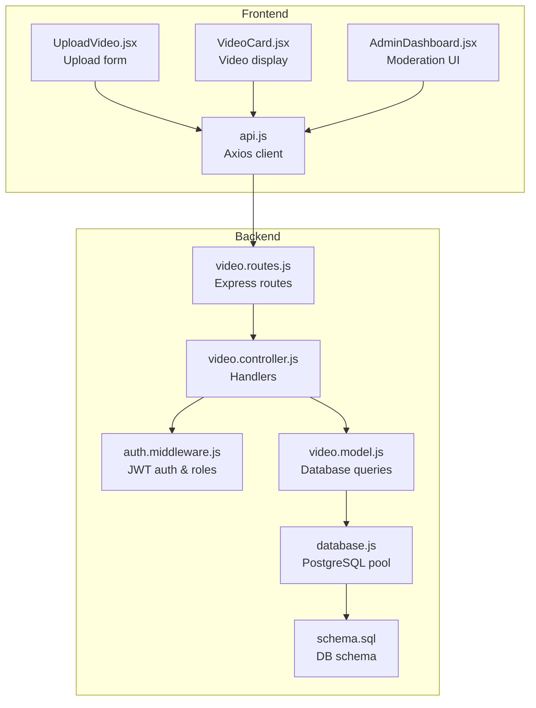
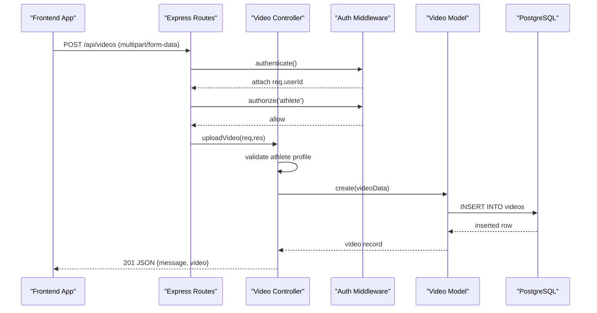
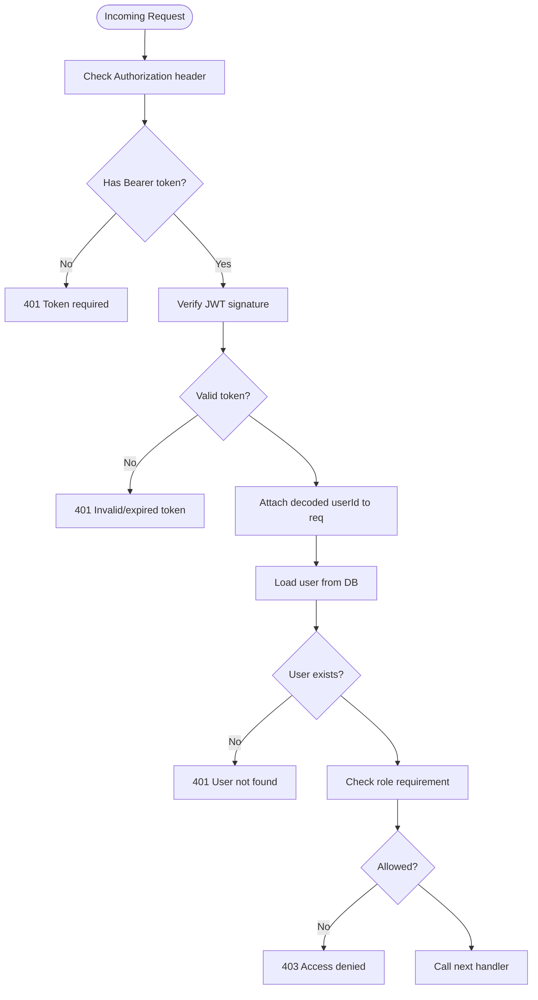
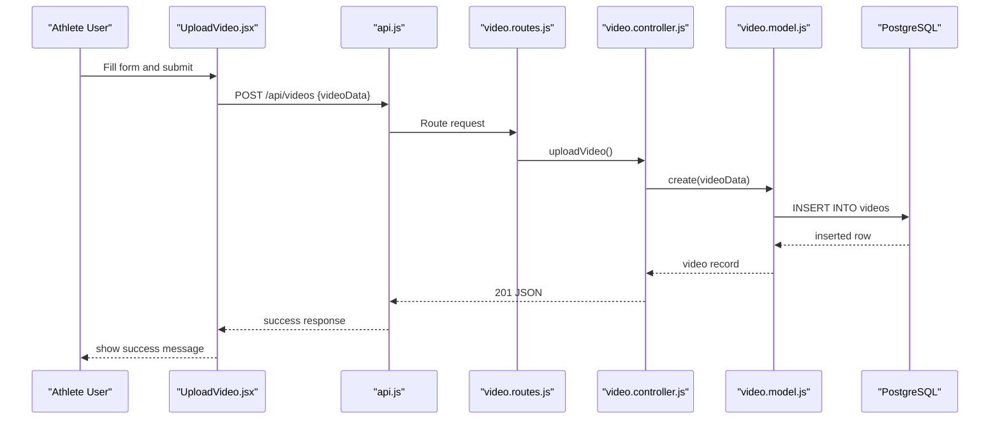
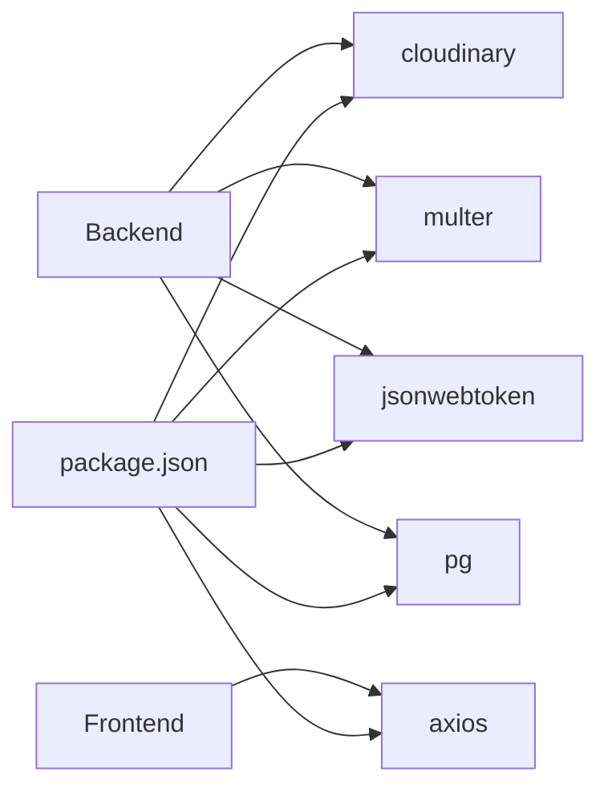
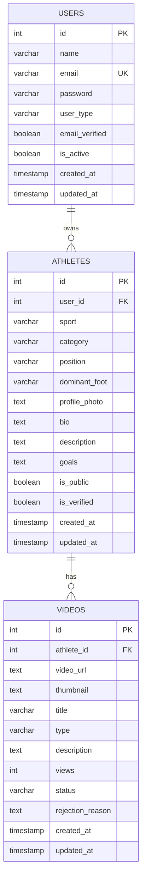

# Video Management

<cite>
**Referenced Files in This Document**
- [video.controller.js](file://backend/controllers/video.controller.js)
- [video.routes.js](file://backend/routes/video.routes.js)
- [video.model.js](file://backend/models/video.model.js)
- [auth.middleware.js](file://backend/middleware/auth.middleware.js)
- [database.js](file://backend/config/database.js)
- [schema.sql](file://database/schema.sql)
- [UploadVideo.jsx](file://frontend/src/pages/UploadVideo.jsx)
- [api.js](file://frontend/src/services/api.js)
- [VideoCard.jsx](file://frontend/src/components/VideoCard.jsx)
- [AdminDashboard.jsx](file://frontend/src/pages/AdminDashboard.jsx)
- [package.json](file://backend/package.json)
</cite>

## Table of Contents
1. [Introduction](#introduction)
2. [Project Structure](#project-structure)
3. [Core Components](#core-components)
4. [Architecture Overview](#architecture-overview)
5. [Detailed Component Analysis](#detailed-component-analysis)
6. [Dependency Analysis](#dependency-analysis)
7. [Performance Considerations](#performance-considerations)
8. [Troubleshooting Guide](#troubleshooting-guide)
9. [Conclusion](#conclusion)
10. [Appendices](#appendices)

## Introduction
This document provides comprehensive API documentation for video upload, processing, and management operations. It covers endpoint specifications, request/response formats, authentication and authorization requirements, database schema, and frontend integration patterns. The system currently supports storing video metadata (URL, thumbnail, title, type, description) and retrieving videos by athlete or featured lists. Administrative moderation (approval/rejection) is supported through dedicated endpoints.

Important note: The current backend does not implement Cloudinary integration or native video file uploads. Instead, it accepts externally hosted video URLs and stores metadata. This document reflects the actual implementation present in the repository.

## Project Structure
The video management system spans backend API routes, controllers, models, middleware, and frontend pages/services.

**Diagram sources**
- [video.routes.js:1-20](file://backend/routes/video.routes.js#L1-L20)
- [video.controller.js:1-111](file://backend/controllers/video.controller.js#L1-L111)
- [auth.middleware.js:1-59](file://backend/middleware/auth.middleware.js#L1-L59)
- [video.model.js:1-61](file://backend/models/video.model.js#L1-L61)
- [database.js:1-13](file://backend/config/database.js#L1-L13)
- [schema.sql:69-88](file://database/schema.sql#L69-L88)
- [api.js:1-36](file://frontend/src/services/api.js#L1-L36)
- [UploadVideo.jsx:1-234](file://frontend/src/pages/UploadVideo.jsx#L1-L234)
- [VideoCard.jsx:1-48](file://frontend/src/components/VideoCard.jsx#L1-L48)
- [AdminDashboard.jsx:1-274](file://frontend/src/pages/AdminDashboard.jsx#L1-L274)

**Section sources**
- [video.routes.js:1-20](file://backend/routes/video.routes.js#L1-L20)
- [video.controller.js:1-111](file://backend/controllers/video.controller.js#L1-L111)
- [auth.middleware.js:1-59](file://backend/middleware/auth.middleware.js#L1-L59)
- [video.model.js:1-61](file://backend/models/video.model.js#L1-L61)
- [database.js:1-13](file://backend/config/database.js#L1-L13)
- [schema.sql:69-88](file://database/schema.sql#L69-L88)
- [api.js:1-36](file://frontend/src/services/api.js#L1-L36)
- [UploadVideo.jsx:1-234](file://frontend/src/pages/UploadVideo.jsx#L1-L234)
- [VideoCard.jsx:1-48](file://frontend/src/components/VideoCard.jsx#L1-L48)
- [AdminDashboard.jsx:1-274](file://frontend/src/pages/AdminDashboard.jsx#L1-L274)

## Core Components
- Authentication and Authorization Middleware: Validates JWT tokens and enforces role-based access (athlete, scout, club, admin).
- Video Routes: Define endpoints for upload, retrieval, deletion, and moderation-related likes.
- Video Controller: Implements business logic for video operations and interacts with the model.
- Video Model: Encapsulates database queries for CRUD operations and joins with athletes/users.
- Database Schema: Defines the videos table with status and moderation fields.
- Frontend Services/Pages: Provide upload forms, video cards, and admin moderation UI.

Key capabilities:
- Upload video metadata (externally hosted URL)
- Retrieve videos by athlete ID
- Retrieve featured videos
- Get single video with like count
- Delete owned videos
- Admin approval/rejection workflow

**Section sources**
- [auth.middleware.js:1-59](file://backend/middleware/auth.middleware.js#L1-L59)
- [video.routes.js:1-20](file://backend/routes/video.routes.js#L1-L20)
- [video.controller.js:1-111](file://backend/controllers/video.controller.js#L1-L111)
- [video.model.js:1-61](file://backend/models/video.model.js#L1-L61)
- [schema.sql:69-88](file://database/schema.sql#L69-L88)
- [api.js:1-36](file://frontend/src/services/api.js#L1-L36)
- [UploadVideo.jsx:1-234](file://frontend/src/pages/UploadVideo.jsx#L1-L234)
- [VideoCard.jsx:1-48](file://frontend/src/components/VideoCard.jsx#L1-L48)
- [AdminDashboard.jsx:1-274](file://frontend/src/pages/AdminDashboard.jsx#L1-L274)

## Architecture Overview
The system follows a layered architecture:
- Presentation Layer: React frontend pages and components
- API Layer: Express routes and controllers
- Business Logic: Controllers orchestrate operations
- Persistence: PostgreSQL via a connection pool
- Security: JWT-based authentication and role-based authorization

**Diagram sources**
- [video.routes.js:7-7](file://backend/routes/video.routes.js#L7-L7)
- [auth.middleware.js:4-42](file://backend/middleware/auth.middleware.js#L4-L42)
- [video.controller.js:5-32](file://backend/controllers/video.controller.js#L5-L32)
- [video.model.js:4-16](file://backend/models/video.model.js#L4-L16)
- [schema.sql:69-88](file://database/schema.sql#L69-L88)

## Detailed Component Analysis

### Authentication and Authorization
- Token extraction: Reads Authorization header and verifies JWT.
- Role enforcement: Ensures only athletes can upload/delete their own videos.
- Optional auth: Allows public access for video retrieval.

**Diagram sources**
- [auth.middleware.js:4-58](file://backend/middleware/auth.middleware.js#L4-L58)

**Section sources**
- [auth.middleware.js:1-59](file://backend/middleware/auth.middleware.js#L1-L59)

### Video Upload Endpoint
- Method: POST
- Path: /api/videos
- Authentication: Required (athlete)
- Request body: JSON object containing video metadata
- Response: 201 Created with uploaded video record

Request payload schema:
- title: string (required)
- type: string (required; one of highlights, training, match, skills, goals, defense, attack)
- description: string (optional)
- video_url: string (required; externally hosted URL)
- thumbnail: string (optional; externally hosted URL)

Response schema:
- message: string
- video: object with fields from videos table

Authorization and ownership:
- Requires athlete role
- Links video to authenticated user's athlete profile

**Section sources**
- [video.routes.js:7-7](file://backend/routes/video.routes.js#L7-L7)
- [video.controller.js:5-32](file://backend/controllers/video.controller.js#L5-L32)
- [video.model.js:4-16](file://backend/models/video.model.js#L4-L16)
- [schema.sql:69-88](file://database/schema.sql#L69-L88)
- [UploadVideo.jsx:7-18](file://frontend/src/pages/UploadVideo.jsx#L7-L18)
- [UploadVideo.jsx:43-60](file://frontend/src/pages/UploadVideo.jsx#L43-L60)
- [api.js:1-36](file://frontend/src/services/api.js#L1-L36)

### Video Retrieval Endpoints
- Get my videos (athlete only): GET /api/videos/my-videos
- Get featured videos: GET /api/videos/featured?limit=N
- Get athlete videos: GET /api/videos/athlete/:athleteId
- Get video by ID: GET /api/videos/:id (optional auth)

Response schemas:
- Array of video objects for list endpoints
- Single video object for detail endpoint, including likes_count

Video object fields:
- id, athlete_id, video_url, thumbnail, title, type, description, views, status, rejection_reason, created_at, updated_at
- Additional fields for detail: user_id, athlete_name (from join)

**Section sources**
- [video.routes.js:8-12](file://backend/routes/video.routes.js#L8-L12)
- [video.controller.js:34-88](file://backend/controllers/video.controller.js#L34-L88)
- [video.model.js:18-51](file://backend/models/video.model.js#L18-L51)
- [schema.sql:69-88](file://database/schema.sql#L69-L88)

### Video Deletion Endpoint
- Method: DELETE
- Path: /api/videos/:id
- Authentication: Required (athlete)
- Authorization: Must own the video (via user_id match)

Response: 200 OK with success message

**Section sources**
- [video.routes.js:12-12](file://backend/routes/video.routes.js#L12-L12)
- [video.controller.js:90-110](file://backend/controllers/video.controller.js#L90-L110)
- [video.model.js:53-57](file://backend/models/video.model.js#L53-L57)
- [schema.sql:69-88](file://database/schema.sql#L69-L88)

### Likes and Engagement Endpoints
- Like video: POST /api/videos/like
- Unlike video: DELETE /api/videos/like/:videoId
- Get video likes: GET /api/videos/:videoId/likes
- Check like status: GET /api/videos/:videoId/like-status

These endpoints integrate with the likes model and are routed through the video routes.

**Section sources**
- [video.routes.js:14-17](file://backend/routes/video.routes.js#L14-L17)
- [video.controller.js:60-78](file://backend/controllers/video.controller.js#L60-L78)

### Database Schema: Videos Table
The videos table supports moderation and engagement:
- Primary key: id
- Foreign key: athlete_id references athletes(id)
- Fields: video_url, thumbnail, title, type, description, views, status, rejection_reason, timestamps
- Constraints: status enum with pending, approved, rejected

Indexes: videos_athlete_id, videos_status improve query performance.

**Section sources**
- [schema.sql:69-88](file://database/schema.sql#L69-L88)
- [schema.sql:140-156](file://database/schema.sql#L140-L156)

### Frontend Integration
- Upload page: Collects title, type, description, video_url, thumbnail; submits to backend.
- API client: Adds Authorization header with stored token.
- Video card: Displays thumbnail, title, type badge, likes, and views.

**Diagram sources**
- [UploadVideo.jsx:43-60](file://frontend/src/pages/UploadVideo.jsx#L43-L60)
- [api.js:10-21](file://frontend/src/services/api.js#L10-L21)
- [video.routes.js:7-7](file://backend/routes/video.routes.js#L7-L7)
- [video.controller.js:5-32](file://backend/controllers/video.controller.js#L5-L32)
- [video.model.js:4-16](file://backend/models/video.model.js#L4-L16)
- [schema.sql:69-88](file://database/schema.sql#L69-L88)

**Section sources**
- [UploadVideo.jsx:1-234](file://frontend/src/pages/UploadVideo.jsx#L1-L234)
- [api.js:1-36](file://frontend/src/services/api.js#L1-L36)
- [VideoCard.jsx:1-48](file://frontend/src/components/VideoCard.jsx#L1-L48)

### Administrative Moderation
Admins can approve or reject videos. The frontend admin dashboard triggers PUT requests to approve/reject endpoints.

Endpoints:
- Approve: PUT /api/admin/videos/:id/approve
- Reject: PUT /api/admin/videos/:id/reject

Frontend usage:
- AdminDashboard.jsx calls these endpoints and refreshes the video list.

Note: The admin routes and controller are referenced by the frontend; ensure they are wired in the backend server.

**Section sources**
- [AdminDashboard.jsx:41-47](file://frontend/src/pages/AdminDashboard.jsx#L41-L47)
- [AdminDashboard.jsx:251-274](file://frontend/src/pages/AdminDashboard.jsx#L251-L274)

## Dependency Analysis
External dependencies relevant to video management:
- Cloudinary: Installed but not integrated in the current backend
- Multer: Installed for file uploads but not used in video routes
- Express, JWT, PostgreSQL driver

**Diagram sources**
- [package.json:10-20](file://backend/package.json#L10-L20)

**Section sources**
- [package.json:1-25](file://backend/package.json#L1-L25)

## Performance Considerations
- Use the featured endpoint with a reasonable limit to avoid large payloads.
- Leverage database indexes on videos_athlete_id and videos_status for efficient filtering.
- Consider pagination for large video collections.
- Store thumbnails and video URLs externally to reduce database size and leverage CDN delivery.

## Troubleshooting Guide
Common issues and resolutions:
- 401 Unauthorized: Ensure Authorization header with valid Bearer token is present.
- 403 Forbidden: Verify the authenticated user has the required role (athlete for upload/delete).
- 404 Not Found: Video or athlete profile not found; confirm IDs and associations.
- 500 Internal Server Error: Check server logs for database errors or unhandled exceptions.

Frontend token handling:
- The API client removes token and redirects to login on 401 responses.

**Section sources**
- [auth.middleware.js:24-32](file://backend/middleware/auth.middleware.js#L24-L32)
- [api.js:23-33](file://frontend/src/services/api.js#L23-L33)
- [video.controller.js:29-31](file://backend/controllers/video.controller.js#L29-L31)

## Conclusion
The current video management system provides a robust foundation for storing and retrieving video metadata with moderation support. While Cloudinary integration and native file uploads are not implemented, the architecture is ready to extend with those features. Administrators can moderate content, and athletes can manage their own videos. The frontend integrates seamlessly with the backend APIs, enabling a smooth user experience.

## Appendices

### API Reference Summary
- POST /api/videos
  - Auth: Required (athlete)
  - Body: {title, type, description, video_url, thumbnail}
  - Response: 201 with video record

- GET /api/videos/my-videos
  - Auth: Required (athlete)
  - Response: Array of videos for the authenticated athlete

- GET /api/videos/featured?limit=N
  - Auth: Optional
  - Response: Array of featured videos

- GET /api/videos/athlete/:athleteId
  - Auth: Optional
  - Response: Array of videos for the given athlete

- GET /api/videos/:id
  - Auth: Optional
  - Response: Single video with likes_count

- DELETE /api/videos/:id
  - Auth: Required (athlete)
  - Response: Success message

- POST /api/videos/like
  - Auth: Required
  - Response: Like created

- DELETE /api/videos/like/:videoId
  - Auth: Required
  - Response: Like removed

- GET /api/videos/:videoId/likes
  - Auth: Optional
  - Response: List of likes

- GET /api/videos/:videoId/like-status
  - Auth: Required
  - Response: Like status for the user

- PUT /api/admin/videos/:id/approve
  - Auth: Required (admin)
  - Response: Updated video (approved)

- PUT /api/admin/videos/:id/reject
  - Auth: Required (admin)
  - Response: Updated video (rejected)

### Data Model: Videos Table

**Diagram sources**
- [schema.sql:69-88](file://database/schema.sql#L69-L88)
- [schema.sql:27-67](file://database/schema.sql#L27-L67)
- [schema.sql:14-24](file://database/schema.sql#L14-L24)