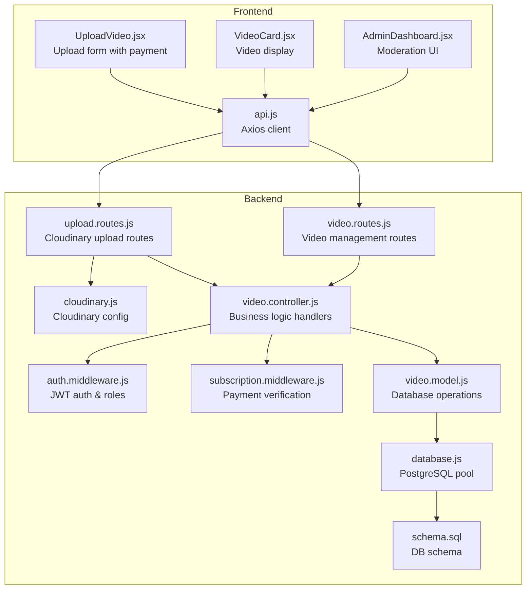
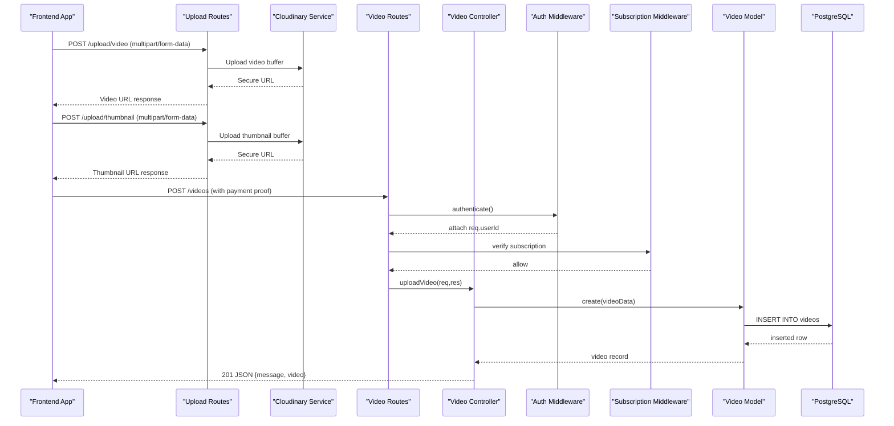
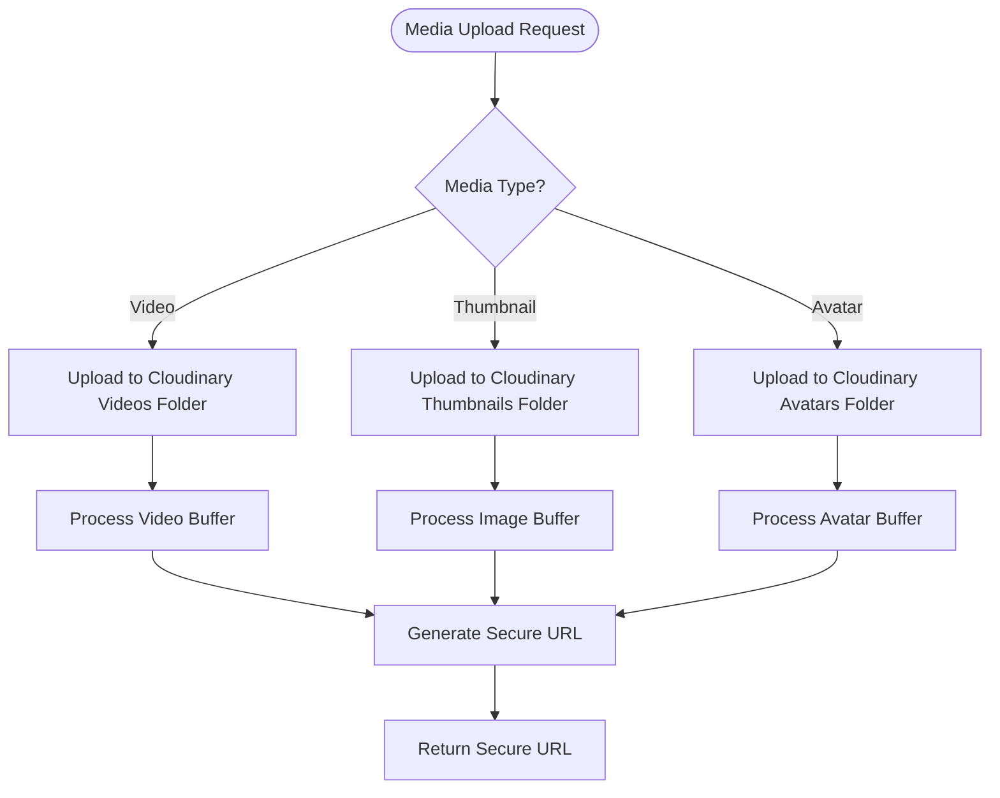
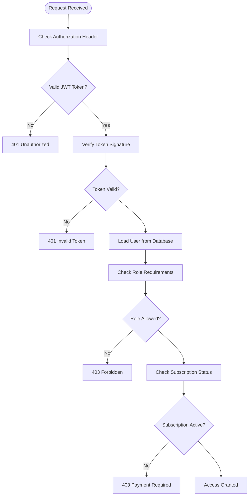
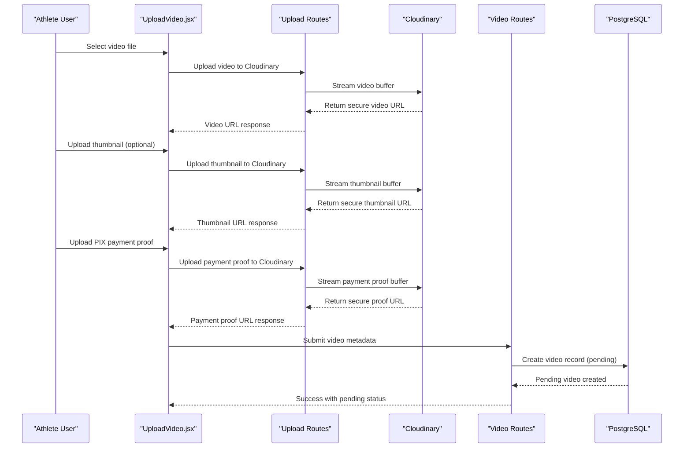
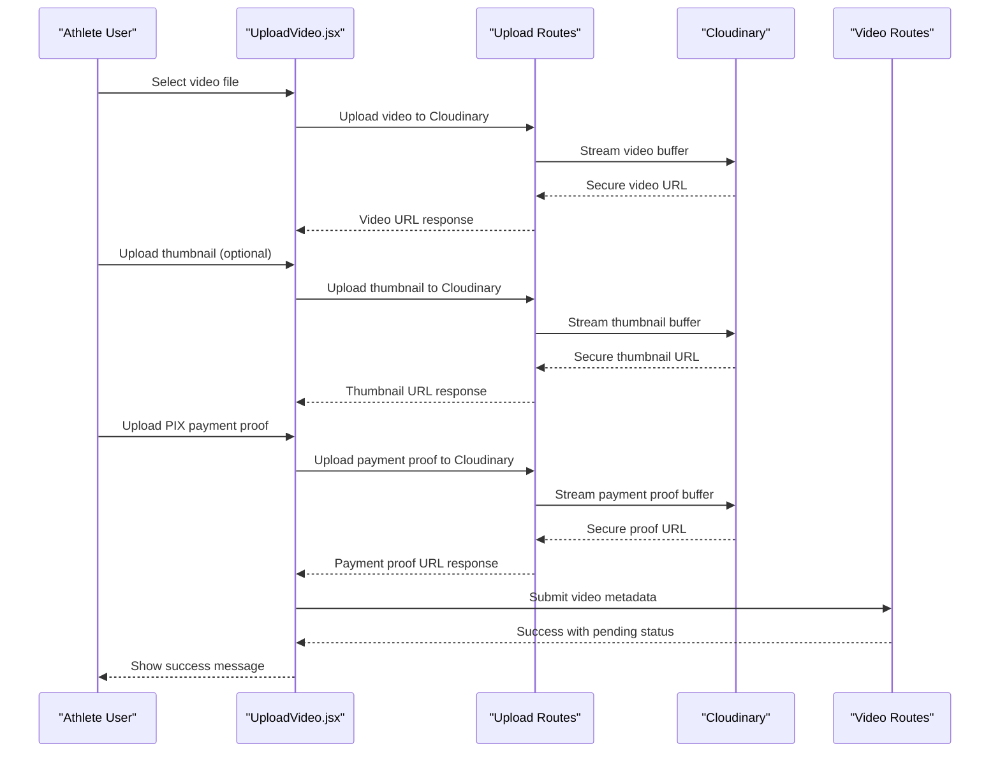
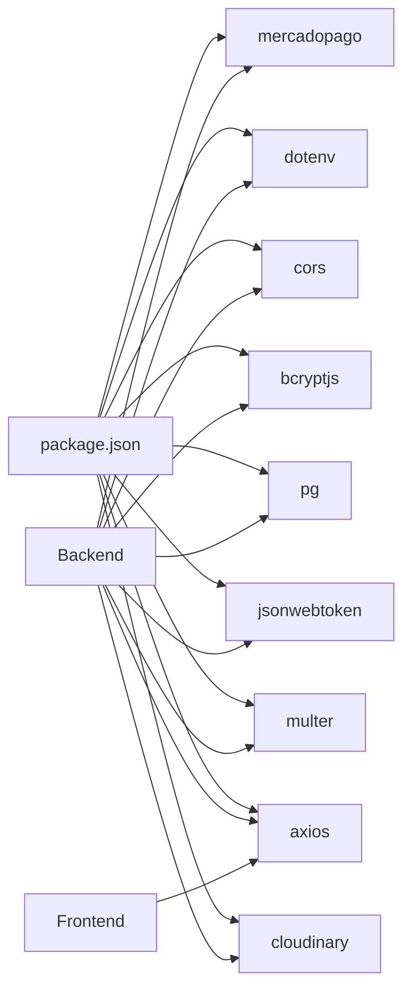
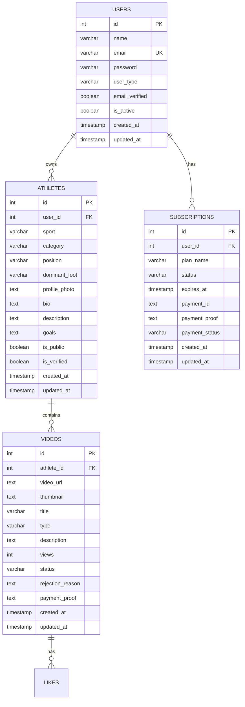
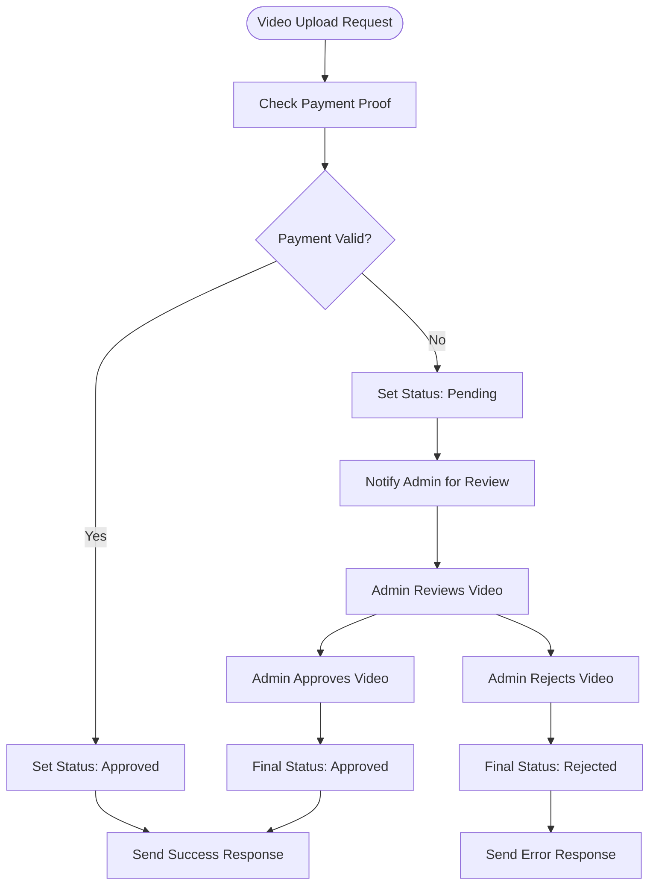

# Video Management

<cite>
**Referenced Files in This Document**
- [video.controller.js](file://backend/controllers/video.controller.js)
- [video.routes.js](file://backend/routes/video.routes.js)
- [upload.routes.js](file://backend/routes/upload.routes.js)
- [video.model.js](file://backend/models/video.model.js)
- [cloudinary.js](file://backend/config/cloudinary.js)
- [upload.js](file://backend/config/upload.js)
- [auth.middleware.js](file://backend/middleware/auth.middleware.js)
- [subscription.middleware.js](file://backend/middleware/subscription.middleware.js)
- [database.js](file://backend/config/database.js)
- [schema.sql](file://database/schema.sql)
- [UploadVideo.jsx](file://frontend/src/pages/UploadVideo.jsx)
- [api.js](file://frontend/src/services/api.js)
- [VideoCard.jsx](file://frontend/src/components/VideoCard.jsx)
- [AdminDashboard.jsx](file://frontend/src/pages/AdminDashboard.jsx)
- [package.json](file://backend/package.json)
</cite>

## Update Summary
**Changes Made**
- Updated to document the new comprehensive video upload system with Cloudinary integration
- Added documentation for separate upload routes for videos, thumbnails, and avatars
- Documented file validation and processing capabilities for different media types
- Updated video upload workflow to include payment verification and moderation
- Enhanced authentication and authorization requirements for video operations
- Added payment processing integration with PIX payment verification

## Table of Contents
1. [Introduction](#introduction)
2. [Project Structure](#project-structure)
3. [Core Components](#core-components)
4. [Architecture Overview](#architecture-overview)
5. [Detailed Component Analysis](#detailed-component-analysis)
6. [Dependency Analysis](#dependency-analysis)
7. [Performance Considerations](#performance-considerations)
8. [Troubleshooting Guide](#troubleshooting-guide)
9. [Conclusion](#conclusion)
10. [Appendices](#appendices)

## Introduction
This document provides comprehensive API documentation for the video upload, processing, and management operations with full Cloudinary integration. The system now supports native video file uploads, thumbnail generation, avatar management, and payment verification through PIX transactions. It covers endpoint specifications, request/response formats, authentication and authorization requirements, database schema, and frontend integration patterns.

The system implements a two-tier upload process: initial Cloudinary upload for media files followed by database registration with payment verification. Administrative moderation ensures content quality and compliance with platform policies.

## Project Structure
The video management system spans backend API routes, controllers, models, middleware, configuration files, and frontend pages/services.

**Diagram sources**
- [upload.routes.js:1-131](file://backend/routes/upload.routes.js#L1-L131)
- [video.routes.js:1-23](file://backend/routes/video.routes.js#L1-L23)
- [video.controller.js:1-168](file://backend/controllers/video.controller.js#L1-L168)
- [auth.middleware.js:1-59](file://backend/middleware/auth.middleware.js#L1-L59)
- [subscription.middleware.js:1-50](file://backend/middleware/subscription.middleware.js#L1-L50)
- [cloudinary.js:1-16](file://backend/config/cloudinary.js#L1-L16)
- [video.model.js:1-78](file://backend/models/video.model.js#L1-L78)
- [database.js:1-13](file://backend/config/database.js#L1-L13)
- [schema.sql:70-90](file://database/schema.sql#L70-L90)
- [api.js:1-36](file://frontend/src/services/api.js#L1-L36)
- [UploadVideo.jsx:1-454](file://frontend/src/pages/UploadVideo.jsx#L1-L454)
- [VideoCard.jsx:1-48](file://frontend/src/components/VideoCard.jsx#L1-L48)
- [AdminDashboard.jsx:1-274](file://frontend/src/pages/AdminDashboard.jsx#L1-L274)

**Section sources**
- [upload.routes.js:1-131](file://backend/routes/upload.routes.js#L1-L131)
- [video.routes.js:1-23](file://backend/routes/video.routes.js#L1-L23)
- [video.controller.js:1-168](file://backend/controllers/video.controller.js#L1-L168)
- [auth.middleware.js:1-59](file://backend/middleware/auth.middleware.js#L1-L59)
- [subscription.middleware.js:1-50](file://backend/middleware/subscription.middleware.js#L1-L50)
- [cloudinary.js:1-16](file://backend/config/cloudinary.js#L1-L16)
- [video.model.js:1-78](file://backend/models/video.model.js#L1-L78)
- [database.js:1-13](file://backend/config/database.js#L1-L13)
- [schema.sql:70-90](file://database/schema.sql#L70-L90)
- [api.js:1-36](file://frontend/src/services/api.js#L1-L36)
- [UploadVideo.jsx:1-454](file://frontend/src/pages/UploadVideo.jsx#L1-L454)
- [VideoCard.jsx:1-48](file://frontend/src/components/VideoCard.jsx#L1-L48)
- [AdminDashboard.jsx:1-274](file://frontend/src/pages/AdminDashboard.jsx#L1-L274)

## Core Components
- **Cloudinary Integration**: Full media storage solution with automatic optimization and CDN delivery
- **Authentication and Authorization Middleware**: Validates JWT tokens and enforces role-based access (athlete, scout, club, admin)
- **Subscription Middleware**: Verifies active subscriptions for video access and viewing
- **Upload Routes**: Separate endpoints for video, thumbnail, and avatar uploads with Cloudinary integration
- **Video Controller**: Implements business logic for video operations, payment verification, and moderation workflows
- **Video Model**: Encapsulates database queries for CRUD operations with status tracking and moderation fields
- **Database Schema**: Defines the videos table with comprehensive status tracking, payment verification, and moderation fields
- **Frontend Services/Pages**: Provide upload forms with payment processing, video cards, and admin moderation UI

Key capabilities:
- Native video file uploads with Cloudinary integration
- Thumbnail generation and management
- Avatar upload and management
- Payment verification through PIX transactions
- Multi-tier moderation workflow (pending → approved/rejected)
- Subscription-based access control
- Public/private content delivery based on user permissions

**Section sources**
- [cloudinary.js:1-16](file://backend/config/cloudinary.js#L1-L16)
- [upload.routes.js:1-131](file://backend/routes/upload.routes.js#L1-L131)
- [video.controller.js:1-168](file://backend/controllers/video.controller.js#L1-L168)
- [subscription.middleware.js:1-50](file://backend/middleware/subscription.middleware.js#L1-L50)
- [video.model.js:1-78](file://backend/models/video.model.js#L1-L78)
- [schema.sql:70-90](file://database/schema.sql#L70-L90)
- [UploadVideo.jsx:1-454](file://frontend/src/pages/UploadVideo.jsx#L1-L454)

## Architecture Overview
The system follows a layered architecture with Cloudinary integration:
- **Presentation Layer**: React frontend pages and components with payment processing
- **API Layer**: Express routes for both Cloudinary uploads and video management
- **Business Logic**: Controllers orchestrate operations with payment verification
- **Persistence**: PostgreSQL via a connection pool with comprehensive indexing
- **Media Storage**: Cloudinary for scalable media delivery and optimization
- **Security**: JWT-based authentication, role-based authorization, and subscription verification

**Diagram sources**
- [upload.routes.js:74-100](file://backend/routes/upload.routes.js#L74-L100)
- [upload.routes.js:103-128](file://backend/routes/upload.routes.js#L103-L128)
- [video.routes.js:9-15](file://backend/routes/video.routes.js#L9-L15)
- [auth.middleware.js:4-42](file://backend/middleware/auth.middleware.js#L4-L42)
- [subscription.middleware.js:1-50](file://backend/middleware/subscription.middleware.js#L1-L50)
- [video.controller.js:6-34](file://backend/controllers/video.controller.js#L6-L34)
- [video.model.js:4-16](file://backend/models/video.model.js#L4-L16)
- [schema.sql:70-90](file://database/schema.sql#L70-L90)

## Detailed Component Analysis

### Cloudinary Integration and Media Processing
The system integrates with Cloudinary for scalable media storage and optimization:

**Upload Routes Configuration:**
- **Video Upload**: `/upload/video` - Supports MP4, WebM, MOV, AVI, MKV, OGG up to 200MB
- **Thumbnail Upload**: `/upload/thumbnail` - Supports JPG, PNG, GIF, WebP up to 5MB  
- **Avatar Upload**: `/upload/avatar` - Supports JPG, PNG, GIF, WebP up to 5MB

**Media Processing Features:**
- Automatic optimization and compression
- CDN delivery with global distribution
- Responsive image generation
- Video transcoding and format conversion
- Secure URL generation with access control

**Diagram sources**
- [upload.routes.js:26-39](file://backend/routes/upload.routes.js#L26-L39)
- [upload.routes.js:74-100](file://backend/routes/upload.routes.js#L74-L100)
- [upload.routes.js:103-128](file://backend/routes/upload.routes.js#L103-L128)

**Section sources**
- [upload.routes.js:1-131](file://backend/routes/upload.routes.js#L1-L131)
- [cloudinary.js:1-16](file://backend/config/cloudinary.js#L1-L16)

### Authentication and Authorization
Enhanced security with role-based access and subscription verification:

**Token Management:**
- JWT token extraction from Authorization header
- Token signature verification and expiration checking
- User role validation for access control

**Role-Based Access Control:**
- **Athletes**: Can upload videos, manage their own content, view featured videos
- **Scouts/Clubs**: Require active subscription, can view athlete videos with 24-hour delay
- **Admins**: Full access to all operations including moderation

**Subscription Verification:**
- Active subscription required for video access
- Payment verification through PIX transaction
- Graceful degradation for non-subscribers

**Diagram sources**
- [auth.middleware.js:4-58](file://backend/middleware/auth.middleware.js#L4-L58)
- [subscription.middleware.js:1-50](file://backend/middleware/subscription.middleware.js#L1-L50)

**Section sources**
- [auth.middleware.js:1-59](file://backend/middleware/auth.middleware.js#L1-L59)
- [subscription.middleware.js:1-50](file://backend/middleware/subscription.middleware.js#L1-L50)

### Video Upload Workflow with Payment Verification
The system implements a comprehensive two-stage upload process:

**Stage 1: Media Upload**
1. Upload video file to Cloudinary
2. Upload thumbnail (optional) to Cloudinary  
3. Upload payment proof (PIX screenshot) to Cloudinary

**Stage 2: Database Registration**
1. Create video record with Cloudinary URLs
2. Set status to 'pending' for moderation
3. Store payment verification data
4. Notify administrators for review

**Payment Processing Integration:**
- Fixed fee: R$10.00 per video upload
- PIX payment required for video approval
- Payment proof verification by administrators
- Automatic video approval upon payment confirmation

**Diagram sources**
- [UploadVideo.jsx:115-183](file://frontend/src/pages/UploadVideo.jsx#L115-L183)
- [upload.routes.js:74-100](file://backend/routes/upload.routes.js#L74-L100)
- [upload.routes.js:103-128](file://backend/routes/upload.routes.js#L103-L128)
- [video.controller.js:6-34](file://backend/controllers/video.controller.js#L6-L34)
- [video.model.js:4-16](file://backend/models/video.model.js#L4-L16)

**Section sources**
- [UploadVideo.jsx:1-454](file://frontend/src/pages/UploadVideo.jsx#L1-L454)
- [upload.routes.js:1-131](file://backend/routes/upload.routes.js#L1-L131)
- [video.controller.js:1-168](file://backend/controllers/video.controller.js#L1-L168)

### Video Management Endpoints
Comprehensive video operations with status tracking and moderation:

**Upload Operations:**
- **POST /api/videos**: Upload video metadata with Cloudinary URLs
- **GET /api/videos/my-videos**: Retrieve authenticated athlete's videos (all statuses)
- **GET /api/videos/featured**: Retrieve featured videos (subscription required)
- **GET /api/videos/public/featured**: Public featured videos with access control

**Retrieval Operations:**
- **GET /api/videos/athlete/:athleteId**: Retrieve athlete's videos with 24-hour delay for scouts
- **GET /api/videos/:id**: Retrieve video by ID with like count
- **GET /api/videos/:videoId/likes**: Retrieve video likes
- **GET /api/videos/:videoId/like-status**: Check user's like status

**Management Operations:**
- **DELETE /api/videos/:id**: Delete owned videos
- **POST /api/videos/like**: Like videos (authenticated)
- **DELETE /api/videos/like/:videoId**: Unlike videos (authenticated)

**Section sources**
- [video.routes.js:1-23](file://backend/routes/video.routes.js#L1-L23)
- [video.controller.js:1-168](file://backend/controllers/video.controller.js#L1-L168)

### Database Schema: Enhanced Videos Table
The videos table now supports comprehensive status tracking and payment verification:

**Core Fields:**
- `id`: Primary key (auto-increment)
- `athlete_id`: Foreign key to athletes table
- `video_url`: Cloudinary secure URL for video file
- `thumbnail`: Cloudinary secure URL for thumbnail image
- `title`: Video title (required)
- `type`: Video type (highlights, training, match, etc.)
- `description`: Video description

**Status and Moderation Fields:**
- `views`: View counter (default: 0)
- `status`: Video status (pending, approved, rejected)
- `rejection_reason`: Reason for rejection (nullable)
- `payment_proof`: Cloudinary URL for payment proof

**Timestamps:**
- `created_at`: Creation timestamp (default: current timestamp)
- `updated_at`: Last update timestamp (automatically updated)

**Constraints and Indexes:**
- Status constraint: Only allows pending, approved, rejected values
- Foreign key constraint: Cascade delete on athlete removal
- Performance indexes: athlete_id, status for efficient querying

**Section sources**
- [schema.sql:70-90](file://database/schema.sql#L70-L90)
- [schema.sql:152-153](file://database/schema.sql#L152-L153)

### Frontend Integration with Payment Processing
The frontend provides comprehensive video upload interface with payment integration:

**Upload Form Features:**
- **Video Selection**: Drag-and-drop interface with file size validation (≤200MB)
- **Thumbnail Upload**: Optional cover image with preview functionality
- **Payment Proof**: Required PIX payment screenshot upload
- **Real-time Progress**: Upload progress indicators for all file types
- **Validation**: Client-side validation for required fields and file types

**Payment Flow Integration:**
- **Fixed Fee**: R$10.00 per video upload
- **PIX Integration**: Direct payment instructions with copy-to-clipboard
- **Verification**: Payment proof required for video approval
- **Status Tracking**: Real-time feedback on upload and moderation status

**User Experience:**
- **Responsive Design**: Mobile-friendly upload interface
- **Error Handling**: Comprehensive error messages and recovery options
- **Success Feedback**: Clear confirmation of successful uploads
- **Progress Indicators**: Visual feedback during multi-step upload process

**Diagram sources**
- [UploadVideo.jsx:115-183](file://frontend/src/pages/UploadVideo.jsx#L115-L183)
- [upload.routes.js:74-100](file://backend/routes/upload.routes.js#L74-L100)
- [upload.routes.js:103-128](file://backend/routes/upload.routes.js#L103-L128)

**Section sources**
- [UploadVideo.jsx:1-454](file://frontend/src/pages/UploadVideo.jsx#L1-L454)
- [api.js:1-36](file://frontend/src/services/api.js#L1-L36)

### Administrative Moderation System
Comprehensive moderation workflow with payment verification:

**Moderation Features:**
- **Pending Review**: All uploaded videos initially set to pending status
- **Payment Verification**: Admins verify PIX payment proofs before approval
- **Content Moderation**: Admins can approve or reject videos based on platform guidelines
- **Rejection Reasoning**: Detailed rejection reasons for athlete feedback
- **Status Tracking**: Real-time status updates throughout moderation process

**Admin Interface:**
- **Moderation Dashboard**: Centralized view of pending videos
- **Bulk Operations**: Ability to process multiple videos efficiently
- **Communication Tools**: Direct messaging for athlete feedback
- **Analytics**: Usage statistics and moderation metrics

**Section sources**
- [video.controller.js:1-168](file://backend/controllers/video.controller.js#L1-L168)
- [video.model.js:1-78](file://backend/models/video.model.js#L1-L78)
- [AdminDashboard.jsx:1-274](file://frontend/src/pages/AdminDashboard.jsx#L1-L274)

## Dependency Analysis
External dependencies supporting the comprehensive video management system:

**Core Dependencies:**
- **Cloudinary**: Media storage, optimization, and CDN delivery
- **Multer**: File upload handling with memory/disk storage options
- **Express**: Web framework for API routing and middleware
- **JWT**: Authentication and authorization token management
- **PostgreSQL Driver**: Database connectivity and query execution

**Development Dependencies:**
- **BcryptJS**: Password hashing for user authentication
- **CORS**: Cross-origin resource sharing for API access
- **Dotenv**: Environment variable management
- **MercadoPago**: Alternative payment processing (configured but not primary)
- **Nodemon**: Development server with auto-reload

**Diagram sources**
- [package.json:10-20](file://backend/package.json#L10-L20)

**Section sources**
- [package.json:1-25](file://backend/package.json#L1-L25)

## Performance Considerations
**Cloudinary Optimization:**
- Automatic image and video compression reduces bandwidth usage
- Global CDN distribution minimizes latency for international users
- Responsive image generation optimizes delivery for different devices

**Database Performance:**
- Proper indexing on videos_athlete_id and videos_status improves query performance
- Connection pooling prevents database bottlenecks under load
- Efficient pagination for large video collections

**Frontend Optimization:**
- Chunked uploads prevent browser timeout for large files
- Progress indicators improve user experience during uploads
- Lazy loading for video thumbnails reduces initial page load time

**Security Considerations:**
- File type validation prevents malicious uploads
- Size limits protect server resources
- Cloudinary URL signing prevents unauthorized access

## Troubleshooting Guide
**Common Issues and Resolutions:**

**Upload Failures:**
- **400 Bad Request**: Check file type and size limits (videos ≤200MB, images ≤5MB)
- **401 Unauthorized**: Verify JWT token presence and validity
- **403 Forbidden**: Ensure proper role access and active subscription
- **500 Internal Server Error**: Check Cloudinary service availability and database connectivity

**Payment Processing Issues:**
- **Payment Verification Failed**: Ensure PIX payment proof is clear and legible
- **Amount Mismatch**: Verify payment amount matches required fee (R$10.00)
- **Duplicate Payments**: Check for existing pending video submissions

**Frontend Integration Problems:**
- **Upload Progress Not Showing**: Verify CORS configuration and network connectivity
- **Cloudinary Errors**: Check environment variables and API credentials
- **Authentication Issues**: Ensure token storage and refresh mechanisms are working

**Environment Configuration:**
- **Cloudinary Setup**: Verify CLOUDINARY_URL or individual cloud_name, api_key, api_secret
- **Database Connection**: Check PostgreSQL connection string and credentials
- **File Upload Limits**: Configure appropriate memory limits for Node.js process

**Section sources**
- [upload.routes.js:74-100](file://backend/routes/upload.routes.js#L74-L100)
- [auth.middleware.js:24-32](file://backend/middleware/auth.middleware.js#L24-L32)
- [api.js:23-33](file://frontend/src/services/api.js#L23-L33)
- [cloudinary.js:1-16](file://backend/config/cloudinary.js#L1-L16)

## Conclusion
The updated video management system provides a comprehensive, scalable solution for video upload, processing, and management with full Cloudinary integration. The system successfully implements a two-tier upload process with payment verification, sophisticated moderation workflows, and robust access control mechanisms.

Key achievements include:
- **Complete Cloudinary Integration**: Scalable media storage with automatic optimization
- **Payment Processing**: Integrated PIX payment verification with automated moderation
- **Enhanced Security**: Multi-layered authentication, authorization, and subscription verification
- **Comprehensive Moderation**: Structured workflow for content approval and rejection
- **Performance Optimization**: CDN delivery, efficient database queries, and responsive frontend

The system is production-ready with proper error handling, comprehensive logging, and graceful degradation for various failure scenarios. The modular architecture supports future enhancements such as video transcoding, advanced analytics, and additional payment methods.

## Appendices

### API Reference Summary

**Cloudinary Upload Endpoints:**
- **POST /upload/video**
  - Auth: Required (athlete)
  - Body: multipart/form-data with video file
  - Limits: ≤200MB, supported formats: MP4, WebM, MOV, AVI, MKV, OGG
  - Response: 200 with secure video URL and metadata

- **POST /upload/thumbnail**
  - Auth: Required (athlete)
  - Body: multipart/form-data with image file
  - Limits: ≤5MB, supported formats: JPG, PNG, GIF, WebP
  - Response: 200 with secure thumbnail URL

- **POST /upload/avatar**
  - Auth: Required (authenticated user)
  - Body: multipart/form-data with avatar image
  - Limits: ≤5MB, supported formats: JPG, PNG, GIF, WebP
  - Response: 200 with secure avatar URL

**Video Management Endpoints:**
- **POST /api/videos**
  - Auth: Required (athlete)
  - Body: JSON with video metadata and Cloudinary URLs
  - Response: 201 with video record (status: pending)

- **GET /api/videos/my-videos**
  - Auth: Required (athlete)
  - Response: Array of all videos for authenticated athlete

- **GET /api/videos/featured?limit=N**
  - Auth: Required (subscription)
  - Response: Array of featured videos with 24-hour delay for scouts

- **GET /api/videos/public/featured?limit=N**
  - Auth: Optional
  - Response: Array of featured videos with access control

- **GET /api/videos/athlete/:athleteId**
  - Auth: Required (subscription)
  - Response: Array of athlete's videos with 24-hour delay for scouts

- **GET /api/videos/:id**
  - Auth: Required (subscription)
  - Response: Single video with likes_count

- **DELETE /api/videos/:id**
  - Auth: Required (athlete)
  - Response: Success message

**Engagement Endpoints:**
- **POST /api/videos/like**
  - Auth: Required
  - Response: Like created

- **DELETE /api/videos/like/:videoId**
  - Auth: Required
  - Response: Like removed

- **GET /api/videos/:videoId/likes**
  - Auth: Optional
  - Response: List of likes

- **GET /api/videos/:videoId/like-status**
  - Auth: Required
  - Response: Like status for the user

### Data Model: Enhanced Videos Table

**Diagram sources**
- [schema.sql:70-90](file://database/schema.sql#L70-L90)
- [schema.sql:92-105](file://database/schema.sql#L92-L105)
- [schema.sql:27-67](file://database/schema.sql#L27-L67)
- [schema.sql:14-24](file://database/schema.sql#L14-L24)

### Payment Processing Flow

**Diagram sources**
- [UploadVideo.jsx:28-183](file://frontend/src/pages/UploadVideo.jsx#L28-L183)
- [video.controller.js:6-34](file://backend/controllers/video.controller.js#L6-L34)