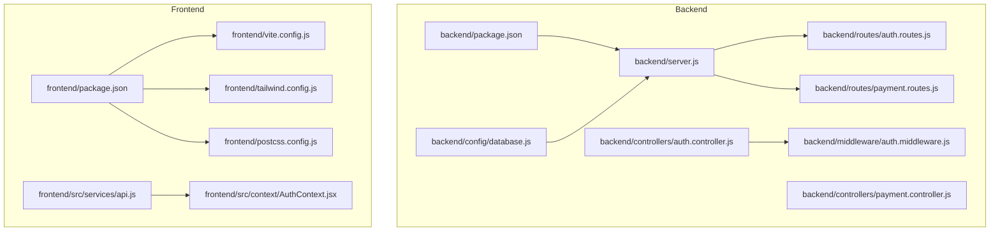
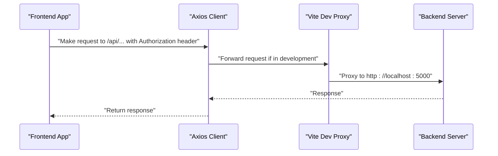
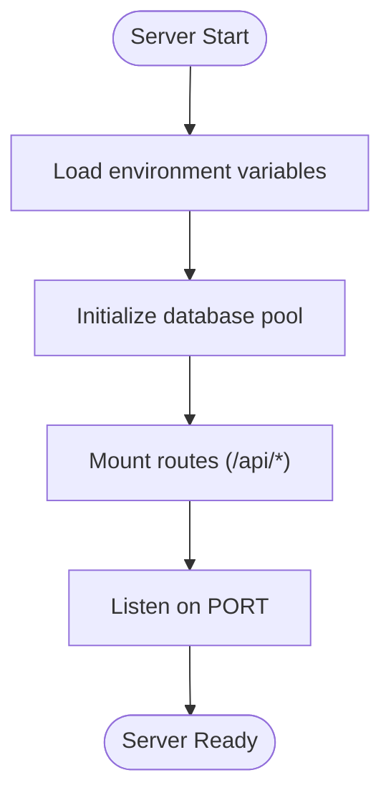
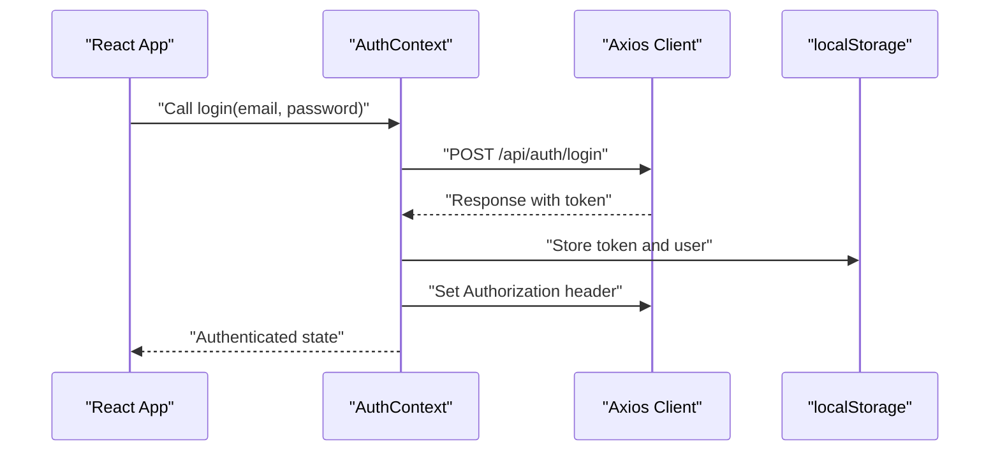
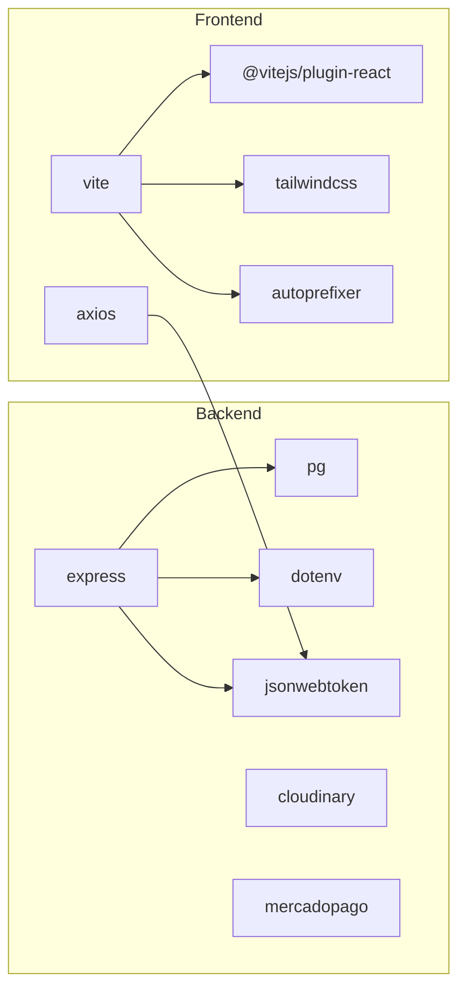

# Configuration and Environment

<cite>
**Referenced Files in This Document**
- [backend/package.json](file://backend/package.json)
- [backend/server.js](file://backend/server.js)
- [backend/config/database.js](file://backend/config/database.js)
- [backend/controllers/auth.controller.js](file://backend/controllers/auth.controller.js)
- [backend/middleware/auth.middleware.js](file://backend/middleware/auth.middleware.js)
- [backend/routes/auth.routes.js](file://backend/routes/auth.routes.js)
- [backend/controllers/payment.controller.js](file://backend/controllers/payment.controller.js)
- [backend/routes/payment.routes.js](file://backend/routes/payment.routes.js)
- [frontend/package.json](file://frontend/package.json)
- [frontend/vite.config.js](file://frontend/vite.config.js)
- [frontend/tailwind.config.js](file://frontend/tailwind.config.js)
- [frontend/postcss.config.js](file://frontend/postcss.config.js)
- [frontend/src/services/api.js](file://frontend/src/services/api.js)
- [frontend/src/context/AuthContext.jsx](file://frontend/src/context/AuthContext.jsx)
- [README.md](file://README.md)
</cite>

## Table of Contents
1. [Introduction](#introduction)
2. [Project Structure](#project-structure)
3. [Core Components](#core-components)
4. [Architecture Overview](#architecture-overview)
5. [Detailed Component Analysis](#detailed-component-analysis)
6. [Dependency Analysis](#dependency-analysis)
7. [Performance Considerations](#performance-considerations)
8. [Troubleshooting Guide](#troubleshooting-guide)
9. [Conclusion](#conclusion)
10. [Appendices](#appendices)

## Introduction
This document provides comprehensive configuration and environment documentation for Craque-Vision’s development and production environments. It covers backend and frontend environment variables, Vite build configuration, Tailwind CSS and PostCSS setup, development versus production differences, asset optimization strategies, deployment preparation, proxy configuration for development, static asset serving, and build optimization techniques. It also outlines configuration templates and security best practices for managing credentials.

## Project Structure
The project is split into two primary packages:
- Backend: Node.js/Express application with environment-driven configuration for database, JWT, and third-party integrations.
- Frontend: React/Vite application with environment-driven API base URL and Tailwind CSS/TurboCSS pipeline.

**Diagram sources**
- [backend/server.js:1-40](file://backend/server.js#L1-L40)
- [backend/config/database.js:1-13](file://backend/config/database.js#L1-L13)
- [backend/controllers/auth.controller.js:1-72](file://backend/controllers/auth.controller.js#L1-L72)
- [backend/middleware/auth.middleware.js:1-59](file://backend/middleware/auth.middleware.js#L1-L59)
- [backend/routes/auth.routes.js:1-11](file://backend/routes/auth.routes.js#L1-L11)
- [backend/controllers/payment.controller.js:1-107](file://backend/controllers/payment.controller.js#L1-L107)
- [backend/routes/payment.routes.js:1-12](file://backend/routes/payment.routes.js#L1-L12)
- [frontend/package.json:1-38](file://frontend/package.json#L1-L38)
- [frontend/vite.config.js:1-16](file://frontend/vite.config.js#L1-L16)
- [frontend/tailwind.config.js:1-28](file://frontend/tailwind.config.js#L1-L28)
- [frontend/postcss.config.js:1-7](file://frontend/postcss.config.js#L1-L7)
- [frontend/src/services/api.js:1-36](file://frontend/src/services/api.js#L1-L36)
- [frontend/src/context/AuthContext.jsx:1-91](file://frontend/src/context/AuthContext.jsx#L1-L91)

**Section sources**
- [README.md:63-132](file://README.md#L63-L132)

## Core Components
This section documents environment variables and configuration files used across backend and frontend.

- Backend environment variables
  - Database connection: host, port, database name, user, password
  - JWT secret for token signing and verification
  - Port for the backend server
  - Third-party SDKs: Cloudinary and Mercado Pago integration libraries are present in dependencies; however, explicit environment variables for credentials are not currently used in the codebase. This implies either defaults are applied by the SDKs or credentials are configured programmatically elsewhere in the project.

- Frontend environment variables
  - API base URL for Axios client
  - Development proxy target for API requests

- Build and tooling
  - Vite scripts and dev server configuration
  - Tailwind CSS content scanning and theme customization
  - PostCSS pipeline with Tailwind CSS and Autoprefixer

**Section sources**
- [backend/config/database.js:4-10](file://backend/config/database.js#L4-L10)
- [backend/server.js:35-39](file://backend/server.js#L35-L39)
- [backend/controllers/auth.controller.js:4-6](file://backend/controllers/auth.controller.js#L4-L6)
- [backend/middleware/auth.middleware.js:14-14](file://backend/middleware/auth.middleware.js#L14-L14)
- [frontend/src/services/api.js:3-8](file://frontend/src/services/api.js#L3-L8)
- [frontend/vite.config.js:6-14](file://frontend/vite.config.js#L6-L14)
- [frontend/tailwind.config.js:3-27](file://frontend/tailwind.config.js#L3-L27)
- [frontend/postcss.config.js:1-7](file://frontend/postcss.config.js#L1-L7)
- [backend/package.json:10-23](file://backend/package.json#L10-L23)
- [frontend/package.json:20-24](file://frontend/package.json#L20-L24)

## Architecture Overview
The frontend communicates with the backend via an API base URL controlled by an environment variable. During development, Vite proxies API requests to the backend server. Authentication tokens are stored in local storage and attached to requests automatically. The backend uses environment variables for database connectivity and JWT secret.

**Diagram sources**
- [frontend/src/services/api.js:10-21](file://frontend/src/services/api.js#L10-L21)
- [frontend/vite.config.js:8-13](file://frontend/vite.config.js#L8-L13)
- [backend/server.js:20-26](file://backend/server.js#L20-L26)

## Detailed Component Analysis

### Backend Configuration
- Database configuration
  - Reads connection parameters from environment variables and creates a connection pool.
  - The pool is exported for use across models and controllers.

- Authentication and JWT
  - Token generation uses a secret from environment variables.
  - Middleware verifies tokens against the same secret and attaches user context to requests.

- Payment routes
  - Payment controller exposes endpoints for video packages and subscription plans.
  - Payment creation and confirmation endpoints are protected by authentication middleware.

- Environment variables used
  - Database: host, port, database, user, password
  - JWT secret
  - Server port

- Environment variables not currently used in code
  - Cloudinary credentials: cloudinary library is present but not referenced in code.
  - Mercado Pago credentials: mercadopago library is present but not referenced in code.

**Diagram sources**
- [backend/server.js:13-39](file://backend/server.js#L13-L39)
- [backend/config/database.js:1-13](file://backend/config/database.js#L1-L13)

**Section sources**
- [backend/config/database.js:4-10](file://backend/config/database.js#L4-L10)
- [backend/controllers/auth.controller.js:4-6](file://backend/controllers/auth.controller.js#L4-L6)
- [backend/middleware/auth.middleware.js:14-14](file://backend/middleware/auth.middleware.js#L14-L14)
- [backend/server.js:35-39](file://backend/server.js#L35-L39)
- [backend/controllers/payment.controller.js:15-29](file://backend/controllers/payment.controller.js#L15-L29)
- [backend/routes/payment.routes.js:6-10](file://backend/routes/payment.routes.js#L6-L10)

### Frontend Configuration
- API base URL
  - Axios client uses a base URL from an environment variable with a fallback to a localhost development URL.
  - Authorization header is injected automatically if a token exists in local storage.

- Authentication context
  - Persists user session in local storage and sets Authorization header globally after login/register.

- Vite development proxy
  - Proxies API requests prefixed with /api to the backend server during development.

- Tailwind CSS and PostCSS
  - Tailwind scans HTML and JSX sources for class usage.
  - PostCSS pipeline applies Tailwind CSS and Autoprefixer.

**Diagram sources**
- [frontend/src/context/AuthContext.jsx:21-38](file://frontend/src/context/AuthContext.jsx#L21-L38)
- [frontend/src/services/api.js:10-21](file://frontend/src/services/api.js#L10-L21)

**Section sources**
- [frontend/src/services/api.js:3-8](file://frontend/src/services/api.js#L3-L8)
- [frontend/src/services/api.js:10-21](file://frontend/src/services/api.js#L10-L21)
- [frontend/src/context/AuthContext.jsx:10-19](file://frontend/src/context/AuthContext.jsx#L10-L19)
- [frontend/src/context/AuthContext.jsx:21-38](file://frontend/src/context/AuthContext.jsx#L21-L38)
- [frontend/vite.config.js:6-14](file://frontend/vite.config.js#L6-L14)
- [frontend/tailwind.config.js:3-27](file://frontend/tailwind.config.js#L3-L27)
- [frontend/postcss.config.js:1-7](file://frontend/postcss.config.js#L1-L7)

### Build and Tooling
- Scripts
  - Backend: start and dev scripts for production and development.
  - Frontend: dev, build, and preview scripts for development, production build, and local preview.

- Browserslist
  - Defines targets for production and development builds.

- Vite configuration
  - Plugin stack includes React plugin.
  - Dev server runs on port 3000 with API proxy to backend.

- Tailwind CSS
  - Content globs scan index and all source files.
  - Theme extends color palette and font family.

- PostCSS
  - Pipeline includes Tailwind CSS and Autoprefixer.

**Section sources**
- [backend/package.json:6-8](file://backend/package.json#L6-L8)
- [frontend/package.json:20-24](file://frontend/package.json#L20-L24)
- [frontend/package.json:25-36](file://frontend/package.json#L25-L36)
- [frontend/vite.config.js:1-16](file://frontend/vite.config.js#L1-L16)
- [frontend/tailwind.config.js:3-27](file://frontend/tailwind.config.js#L3-L27)
- [frontend/postcss.config.js:1-7](file://frontend/postcss.config.js#L1-L7)

## Dependency Analysis
- Backend dependencies
  - Express for routing and middleware.
  - pg for PostgreSQL connection pooling.
  - dotenv for environment variable loading.
  - jsonwebtoken for JWT operations.
  - cloudinary and mercadopago for media and payments respectively.

- Frontend dependencies
  - React ecosystem and Axios for HTTP.
  - Vite, React plugin, Tailwind CSS, and Autoprefixer for build and styling.

**Diagram sources**
- [backend/package.json:10-23](file://backend/package.json#L10-L23)
- [frontend/package.json:6-19](file://frontend/package.json#L6-L19)

**Section sources**
- [backend/package.json:10-23](file://backend/package.json#L10-L23)
- [frontend/package.json:6-19](file://frontend/package.json#L6-L19)

## Performance Considerations
- Development vs Production
  - Development uses Vite’s fast refresh and proxy for seamless API iteration.
  - Production build is optimized for performance and reduced bundle size.

- Asset optimization strategies
  - Use Vite’s built-in minification and code splitting.
  - Tailwind CSS purges unused styles in production builds.
  - Prefer lazy-loading heavy components and images.

- Static asset serving
  - Serve static assets via CDN or hosting provider in production.
  - Ensure cache headers are configured appropriately.

- Build optimization techniques
  - Enable tree-shaking and module federation where applicable.
  - Split vendor and application bundles.
  - Use environment-specific builds and disable development-only features.

[No sources needed since this section provides general guidance]

## Troubleshooting Guide
- Environment variables missing
  - Backend: ensure database and JWT secret are set; otherwise, the server will fail to connect or authenticate.
  - Frontend: ensure API base URL is set; otherwise, requests will fail or point to incorrect endpoints.

- Authentication errors
  - Verify JWT secret matches across backend and frontend.
  - Confirm token presence and expiration; expired tokens will be rejected.

- CORS and proxy issues
  - Ensure Vite proxy target matches backend address.
  - Confirm backend CORS policy allows frontend origin.

- Payment endpoints
  - Payment routes are currently mocked; integrate with actual providers when credentials are configured.

**Section sources**
- [backend/config/database.js:4-10](file://backend/config/database.js#L4-L10)
- [backend/middleware/auth.middleware.js:24-32](file://backend/middleware/auth.middleware.js#L24-L32)
- [frontend/vite.config.js:8-13](file://frontend/vite.config.js#L8-L13)
- [backend/controllers/payment.controller.js:31-51](file://backend/controllers/payment.controller.js#L31-L51)

## Conclusion
Craque-Vision’s configuration relies on environment variables for database connectivity and JWT secrets, with Vite powering the frontend development experience and Tailwind CSS with PostCSS for styling. While dependencies for Cloudinary and Mercado Pago are present, explicit environment variables for these services are not currently used in the codebase. Proper environment setup, secure credential management, and production-ready build configurations are essential for reliable operation.

[No sources needed since this section summarizes without analyzing specific files]

## Appendices

### Environment Variables Reference
- Backend
  - Database: DB_HOST, DB_PORT, DB_NAME, DB_USER, DB_PASSWORD
  - JWT: JWT_SECRET
  - Server: PORT
  - Optional third-party integrations: Cloudinary/Mercado Pago credentials (not currently used in code)

- Frontend
  - API base URL: VITE_API_URL
  - Development proxy: Vite dev server configuration

**Section sources**
- [backend/config/database.js:4-10](file://backend/config/database.js#L4-L10)
- [backend/server.js:35-39](file://backend/server.js#L35-L39)
- [backend/controllers/auth.controller.js:4-6](file://backend/controllers/auth.controller.js#L4-L6)
- [backend/middleware/auth.middleware.js:14-14](file://backend/middleware/auth.middleware.js#L14-L14)
- [frontend/src/services/api.js:3-8](file://frontend/src/services/api.js#L3-L8)
- [frontend/vite.config.js:6-14](file://frontend/vite.config.js#L6-L14)

### Configuration Templates
- Backend .env template outline
  - DB_HOST=your-db-host
  - DB_PORT=your-db-port
  - DB_NAME=your-db-name
  - DB_USER=your-db-user
  - DB_PASSWORD=your-db-password
  - JWT_SECRET=your-jwt-secret
  - PORT=5000

- Frontend .env template outline
  - VITE_API_URL=http://localhost:5000/api

- Deployment preparation checklist
  - Set production values for all environment variables.
  - Build frontend for production and serve static assets.
  - Configure reverse proxy or CDN for static assets.
  - Set up health checks and monitoring.
  - Review and harden CORS and security headers.

**Section sources**
- [README.md:37-61](file://README.md#L37-L61)

### Security Best Practices for Credential Management
- Never commit secrets to version control.
- Use separate environment files per environment (development, staging, production).
- Rotate JWT secrets periodically.
- Restrict access to environment variables on deployment systems.
- Use secrets management services (e.g., vaults) for production deployments.

[No sources needed since this section provides general guidance]