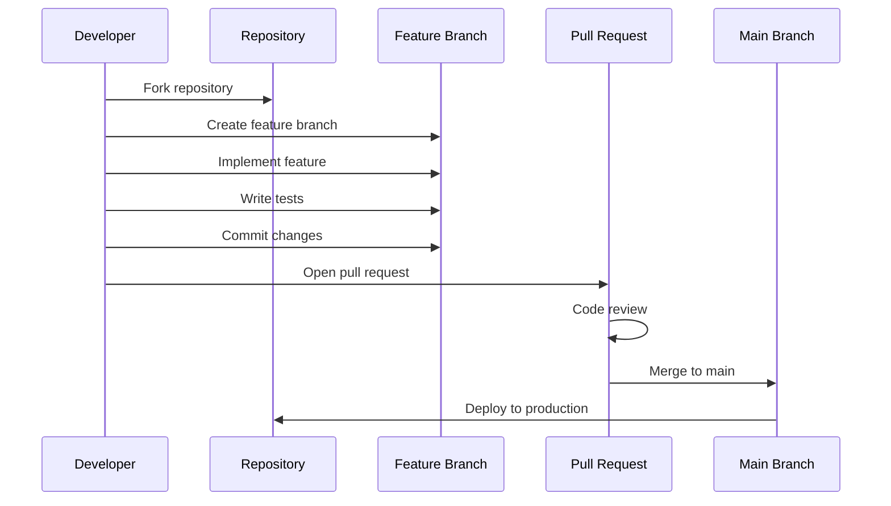
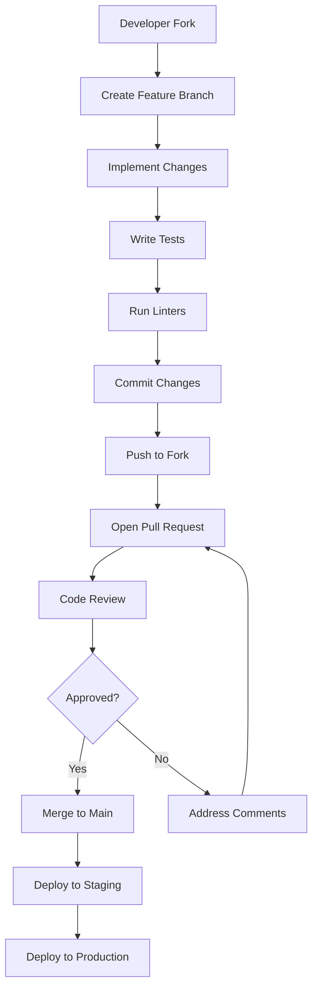

# Contributing Guidelines

<cite>
**Referenced Files in This Document**
- [README.md](file://README.md)
- [QUICKSTART.md](file://QUICKSTART.md)
- [package.json](file://package.json)
- [backend/package.json](file://backend/package.json)
- [frontend/package.json](file://frontend/package.json)
- [backend/server.js](file://backend/server.js)
- [backend/config/database.js](file://backend/config/database.js)
- [frontend/src/services/api.js](file://frontend/src/services/api.js)
- [frontend/vite.config.js](file://frontend/vite.config.js)
- [database/schema.sql](file://database/schema.sql)
- [.gitignore](file://.gitignore)
</cite>

## Update Summary
**Changes Made**
- Established Git-based development workflow with branching strategy
- Defined contribution guidelines and repository structure standards
- Added comprehensive development workflow documentation
- Created standardized commit message conventions
- Implemented pull request and code review processes
- Added testing requirements and quality gates
- Established documentation standards and issue reporting procedures

## Table of Contents
1. [Introduction](#introduction)
2. [Development Workflow](#development-workflow)
3. [Repository Structure Standards](#repository-structure-standards)
4. [Branching Strategy](#branching-strategy)
5. [Commit Message Conventions](#commit-message-conventions)
6. [Pull Request Process](#pull-request-process)
7. [Code Review Criteria](#code-review-criteria)
8. [Quality Gates](#quality-gates)
9. [Testing Requirements](#testing-requirements)
10. [Documentation Standards](#documentation-standards)
11. [Issue Reporting and Feature Requests](#issue-reporting-and-feature-requests)
12. [Code Standards](#code-standards)
13. [Licensing and Contributor Agreements](#licensing-and-contributor-agreements)
14. [Community Guidelines](#community-guidelines)
15. [Appendix: Development Workflow Diagram](#appendix-development-workflow-diagram)

## Introduction
Thank you for considering contributing to Craque-Vision. This document establishes the Git-based development workflow, contribution guidelines, and repository structure standards for this full-stack sports scouting platform. Craque-Vision connects athletes, clubs, and scouts through a modern React/Node.js application with PostgreSQL database support.

The platform enables athletes to showcase their talents through video profiles, allows scouts and clubs to discover promising talent through advanced search capabilities, and provides administrators with comprehensive platform management tools.

## Development Workflow
Craque-Vision follows a Git-based development workflow designed for collaborative, efficient development:

### Local Development Environment
1. **Prerequisites**: Node.js v16+, PostgreSQL
2. **Database Setup**: Create database and execute schema migration
3. **Backend Setup**: Install dependencies, configure environment variables, start server
4. **Frontend Setup**: Install dependencies, configure environment variables, start development server

### Development Cycle


**Section sources**
- [README.md:31-61](file://README.md#L31-L61)
- [QUICKSTART.md:1-80](file://QUICKSTART.md#L1-L80)

## Repository Structure Standards
Craque-Vision maintains a well-organized monorepo structure with clear separation of concerns:

### Core Structure
```
craque-vision/
├── backend/           # Node.js/Express API
├── frontend/          # React SPA
├── database/          # Database schema and migrations
└── shared/            # Shared utilities and configurations
```

### Backend Architecture
- **Config**: Environment configuration and database connections
- **Controllers**: Route handlers and business logic
- **Models**: Database entity definitions
- **Routes**: API endpoint definitions
- **Middleware**: Request/response processing
- **Services**: External service integrations

### Frontend Architecture
- **Components**: Reusable UI components
- **Pages**: Route-based page components
- **Services**: API communication layer
- **Context**: Global state management
- **Assets**: Static resources and styling

**Section sources**
- [README.md:63-132](file://README.md#L63-L132)
- [backend/server.js:1-66](file://backend/server.js#L1-L66)
- [frontend/vite.config.js:1-24](file://frontend/vite.config.js#L1-L24)

## Branching Strategy
Craque-Vision uses a GitFlow-inspired branching model to manage development efficiently:

### Branch Types
- **main**: Production-ready code, stable releases
- **develop**: Integration branch for upcoming releases
- **feature/**: Feature development branches
- **fix/**: Bug fix branches
- **docs/**: Documentation updates
- **refactor/**: Code refactoring
- **chore/**: Maintenance tasks

### Naming Conventions
- Use kebab-case for branch names
- Include issue number when applicable: `feature/123-user-authentication`
- Keep descriptions concise but descriptive
- Prefix with type followed by slash

### Branch Management
- Create feature branches from develop
- Merge feature branches back to develop
- Use pull requests for all merges
- Keep branches small and focused

**Section sources**
- [.gitignore:1-6](file://.gitignore#L1-L6)

## Commit Message Conventions
Craque-Vision follows conventional commit format for consistent, machine-readable commit history:

### Format
```
<type>(<scope>): <subject>
```

### Types
- **feat**: New feature functionality
- **fix**: Bug fixes and patches
- **docs**: Documentation changes
- **style**: Code formatting and styling
- **refactor**: Code restructuring
- **perf**: Performance improvements
- **test**: Test additions and modifications
- **chore**: Maintenance tasks

### Examples
- `feat(auth): add JWT authentication middleware`
- `fix(database): resolve connection pooling issue`
- `docs(readme): update installation instructions`
- `refactor(api): optimize video upload endpoint`

### Body and Footer
- Reference related issues: `Fixes #123`
- Keep subject lines under 50 characters
- Use imperative mood in subjects
- Include breaking changes in footer

## Pull Request Process
Craque-Vision requires a formal pull request process to maintain code quality:

### Before Creating PR
1. Ensure branch is up-to-date with develop
2. Run all tests successfully
3. Verify linting passes
4. Update documentation if needed
5. Add appropriate labels and assignees

### PR Requirements
- Complete the pull request template
- Include summary of changes
- Document testing approach
- Reference related issues
- Update relevant documentation

### Review Process
1. Automated checks must pass
2. At least one maintainer approval required
3. Address all review comments
4. Update PR if changes requested

### Merging
- Squash and merge with descriptive commit message
- Delete feature branch after merge
- Close associated issues

## Code Review Criteria
All contributions undergo thorough code review focusing on:

### Functional Correctness
- Requirements fully implemented
- Edge cases handled appropriately
- Input validation and sanitization
- Error handling and logging

### Code Quality
- Consistent coding standards
- Proper error propagation
- Efficient algorithms and data structures
- Memory leak prevention

### Security
- Input validation and sanitization
- Authentication and authorization checks
- Secret exposure prevention
- SQL injection protection

### Performance
- Database query optimization
- API response time considerations
- Resource usage monitoring
- Scalability factors

### Maintainability
- Clear and descriptive variable names
- Well-documented complex logic
- Modular and reusable code
- Consistent architectural patterns

## Quality Gates
Craque-Vision enforces strict quality gates before code acceptance:

### Technical Requirements
- All automated tests passing
- Linting without errors or warnings
- No SonarQube critical issues
- No commented-out code
- No large binary files

### Documentation Requirements
- Updated README.md for new features
- Inline comments for complex logic
- API documentation updates
- Usage examples for new endpoints

### Security Requirements
- No hardcoded secrets
- Proper environment variable usage
- Secure password handling
- Input validation implemented

### Code Style Requirements
- Consistent indentation and formatting
- Descriptive variable and function names
- Proper error handling patterns
- Modular and organized code structure

## Testing Requirements
Craque-Vision requires comprehensive testing across all components:

### Backend Testing
- **Unit Tests**: Controllers, models, middleware
- **Integration Tests**: Database operations and API endpoints
- **Authentication Tests**: JWT token validation and session management
- **External Service Tests**: Payment processing and file uploads

### Frontend Testing
- **Component Tests**: React component rendering and behavior
- **Service Tests**: API communication and data handling
- **Navigation Tests**: Route transitions and state management
- **Form Tests**: User input validation and submission

### Testing Frameworks
- **Backend**: Jest or Mocha for Node.js testing
- **Frontend**: React Testing Library for component testing
- **Integration**: Supertest for API endpoint testing

### Test Coverage
- Minimum 80% code coverage
- Critical paths thoroughly tested
- Error scenarios covered
- Performance testing for key endpoints

## Documentation Standards
Craque-Vision maintains comprehensive documentation standards:

### Code Documentation
- JSDoc comments for all functions and methods
- Inline comments for complex logic
- README updates for new features
- API documentation synchronized with endpoints

### External Documentation
- Installation guides for different environments
- Deployment documentation
- Troubleshooting guides
- Contribution guidelines

### Documentation Updates
- Update README.md for configuration changes
- Add usage examples for new features
- Document environment variables
- Update API documentation

## Issue Reporting and Feature Requests
Craque-Vision uses GitHub Issues for issue tracking and feature requests:

### Bug Reports
- **Title**: Concise description of the problem
- **Steps to Reproduce**: Clear reproduction steps
- **Expected Behavior**: What should happen
- **Actual Behavior**: What actually happens
- **Environment**: OS, browser, Node.js version
- **Screenshots**: Visual evidence when applicable

### Feature Requests
- **Problem Statement**: What problem solves
- **Proposed Solution**: Detailed implementation approach
- **Alternatives**: Other possible solutions
- **Impact**: Benefits and trade-offs

### Issue Labels
- **bug**: Software defects or unexpected behavior
- **enhancement**: Feature improvements
- **documentation**: Documentation issues
- **help wanted**: Community assistance needed
- **question**: Clarification needed

## Code Standards
Craque-Vision maintains strict coding standards across all technologies:

### Backend Standards (Node.js/Express)
- **File Naming**: PascalCase for controllers and models
- **Module Exports**: Single responsibility per module
- **Error Handling**: Consistent error handling patterns
- **Database Operations**: Connection pooling and transactions
- **Security**: Input validation and secret management

### Frontend Standards (React/Vite)
- **Component Naming**: PascalCase for component files
- **State Management**: React Context for global state
- **Styling**: Tailwind CSS utility classes
- **Routing**: React Router for navigation
- **API Communication**: Axios with interceptors

### Shared Standards
- **Error Messages**: Explicit and user-friendly
- **Logging**: Structured logging with levels
- **Configuration**: Environment-based configuration
- **Validation**: Input validation at boundaries
- **Security**: HTTPS enforcement and secure defaults

## Licensing and Contributor Agreements
Craque-Vision operates under the MIT License with contributor agreement requirements:

### License Terms
- **License Type**: MIT License
- **Usage Rights**: Commercial and non-commercial use
- **Modification Rights**: Modify and distribute
- **Distribution Rights**: Include copyright notice
- **Warranty Disclaimer**: Software provided "as is"

### Contributor Agreement
- **Copyright Assignment**: Contributions become part of project
- **Patent Grant**: Contributor grants patent rights
- **License Continuity**: Contributions remain under MIT
- **Third-party Content**: Proper attribution required
- **Intellectual Property**: No conflicting licenses

### Intellectual Property
- **Contributions**: Licensed under MIT automatically
- **Trademarks**: Not covered by license
- **Patents**: Separate agreements may apply
- **Third-party Libraries**: Respect individual licenses

## Community Guidelines
Craque-Vision fosters a welcoming and inclusive community:

### Communication Standards
- **Respectful Tone**: Professional and courteous communication
- **Constructive Feedback**: Specific, actionable suggestions
- **Inclusive Language**: Welcoming to all participants
- **Helpful Responses**: Patient and supportive assistance

### Collaboration Practices
- **Knowledge Sharing**: Share expertise and learning
- **Mentorship**: Guide newcomers effectively
- **Conflict Resolution**: Address disagreements professionally
- **Recognition**: Acknowledge good contributions

### Code of Conduct
- **Harassment-Free**: Zero tolerance for harassment
- **Professionalism**: Maintain professional standards
- **Integrity**: Honest and ethical behavior
- **Accountability**: Take responsibility for actions

## Appendix: Development Workflow Diagram


[No sources needed since this diagram shows conceptual workflow, not actual code structure]