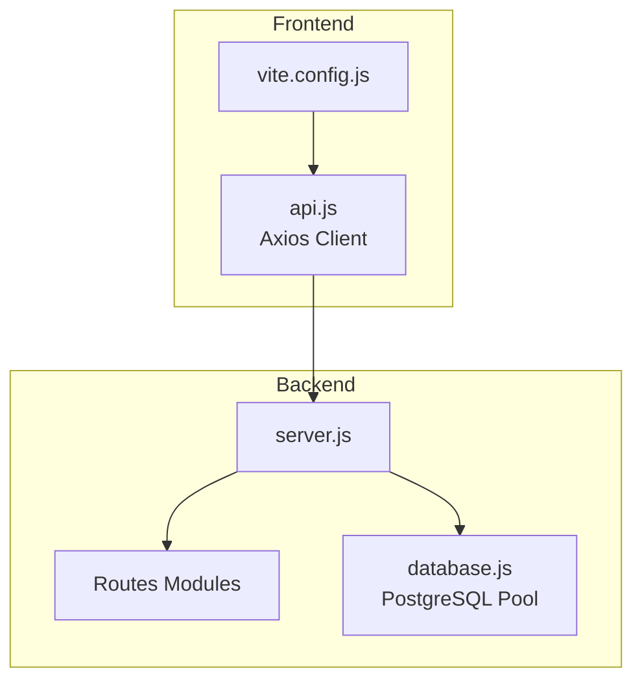
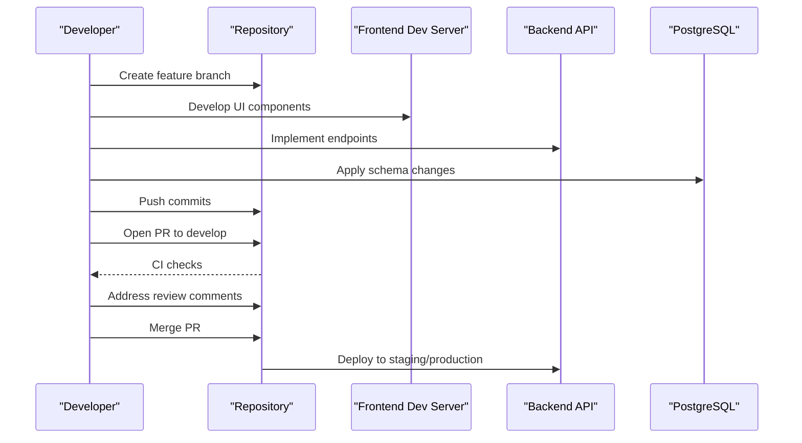

# Contributing Guidelines

<cite>
**Referenced Files in This Document**
- [README.md](file://README.md)
- [QUICKSTART.md](file://QUICKSTART.md)
- [package.json](file://package.json)
- [backend/package.json](file://backend/package.json)
- [frontend/package.json](file://frontend/package.json)
- [backend/server.js](file://backend/server.js)
- [backend/config/database.js](file://backend/config/database.js)
- [frontend/src/services/api.js](file://frontend/src/services/api.js)
- [frontend/vite.config.js](file://frontend/vite.config.js)
- [database/schema.sql](file://database/schema.sql)
</cite>

## Table of Contents
1. [Introduction](#introduction)
2. [Project Structure](#project-structure)
3. [Development Environment Setup](#development-environment-setup)
4. [Branching Strategy](#branching-strategy)
5. [Commit Message Conventions](#commit-message-conventions)
6. [Pull Request Process](#pull-request-process)
7. [Code Review Criteria](#code-review-criteria)
8. [Quality Gates](#quality-gates)
9. [Testing Requirements](#testing-requirements)
10. [Documentation Standards](#documentation-standards)
11. [Issue Reporting and Feature Requests](#issue-reporting-and-feature-requests)
12. [Code Standards](#code-standards)
13. [Licensing and Contributor Agreements](#licensing-and-contributor-agreements)
14. [Community Guidelines](#community-guidelines)
15. [Appendix: Development Workflow Diagram](#appendix-development-workflow-diagram)

## Introduction
Thank you for considering contributing to Craque-Vision. This document provides a comprehensive guide to help you participate effectively in the project. It covers development workflow, code standards, commit conventions, branching strategies, pull request process, code review criteria, quality gates, testing requirements, documentation standards, issue reporting, feature requests, environment setup, collaboration guidelines, licensing, and community norms.

## Project Structure
Craque-Vision is a full-stack application composed of:
- A Node.js/Express backend serving REST APIs
- A React frontend built with Vite
- A PostgreSQL database with schema provisioning
- Shared environment configuration via .env files

Key runtime and configuration files:
- Backend entrypoint and routing: [backend/server.js](file://backend/server.js)
- Database connection pool: [backend/config/database.js](file://backend/config/database.js)
- Frontend API client: [frontend/src/services/api.js](file://frontend/src/services/api.js)
- Frontend development server and proxy: [frontend/vite.config.js](file://frontend/vite.config.js)
- Database schema: [database/schema.sql](file://database/schema.sql)

**Diagram sources**
- [backend/server.js:1-40](file://backend/server.js#L1-L40)
- [backend/config/database.js:1-13](file://backend/config/database.js#L1-L13)
- [frontend/src/services/api.js:1-36](file://frontend/src/services/api.js#L1-L36)
- [frontend/vite.config.js:1-20](file://frontend/vite.config.js#L1-L20)

**Section sources**
- [README.md:63-132](file://README.md#L63-L132)
- [backend/server.js:1-40](file://backend/server.js#L1-L40)
- [backend/config/database.js:1-13](file://backend/config/database.js#L1-L13)
- [frontend/src/services/api.js:1-36](file://frontend/src/services/api.js#L1-L36)
- [frontend/vite.config.js:1-20](file://frontend/vite.config.js#L1-L20)
- [database/schema.sql](file://database/schema.sql)

## Development Environment Setup
Follow the quick start instructions to set up your local environment:
- Install prerequisites: Node.js (v16+) and PostgreSQL
- Create and initialize the database using the provided schema
- Install backend dependencies and start the backend server
- Install frontend dependencies and start the frontend development server

Environment variables are managed per module:
- Backend loads environment variables via dotenv and connects to PostgreSQL using a pool
- Frontend sets the API base URL via VITE_API_URL and attaches Authorization tokens to requests

**Section sources**
- [README.md:31-61](file://README.md#L31-L61)
- [QUICKSTART.md:1-80](file://QUICKSTART.md#L1-L80)
- [backend/config/database.js:1-13](file://backend/config/database.js#L1-L13)
- [frontend/src/services/api.js:1-36](file://frontend/src/services/api.js#L1-L36)
- [frontend/vite.config.js:1-20](file://frontend/vite.config.js#L1-L20)

## Branching Strategy
Recommended branching model:
- main: Stable production-ready code
- develop: Integration branch for upcoming releases
- feature/<issue-id>-short-description: Feature work
- fix/<issue-id>-short-description: Bug fixes
- docs/<scope>-short-description: Documentation updates
- refactor/<scope>-short-description: Non-functional improvements

Branch naming conventions:
- Prefix with type followed by slash and kebab-case description
- Include optional issue ID for traceability

## Commit Message Conventions
Use the conventional commit format:
- type(scope): description
- Types: feat, fix, docs, style, refactor, perf, test, chore
- Example: feat(auth): add JWT token refresh endpoint

Body and footer:
- Reference related issues (e.g., Fixes #123)
- Keep descriptions concise but descriptive

## Pull Request Process
1. Open a PR against the develop branch
2. Fill in the template with summary, changes, testing notes, and related issues
3. Ensure CI checks pass and reviews are approved
4. Squash and merge using a descriptive commit message

Review checklist:
- Requirements addressed
- Tests included
- Code standards followed
- Documentation updated
- No hardcoded secrets

## Code Review Criteria
- Correctness: Does the code solve the stated problem?
- Readability: Is the code self-documenting and consistently formatted?
- Security: Are inputs validated and secrets protected?
- Performance: Are there unnecessary computations or blocking calls?
- Test coverage: Are new/changed paths covered by tests?
- Maintainability: Is the solution extensible and modular?

## Quality Gates
- Lint passes without errors
- All tests passing
- No new SonarQube issues introduced
- Documentation updated
- No commented-out code or debug statements
- No large binary files committed

## Testing Requirements
Current repository does not include explicit test suites. Contributors should add tests aligned with the existing stack:
- Backend: Unit tests for controllers, models, and middleware using a framework compatible with Node.js
- Frontend: Unit tests for components and services using a framework compatible with React/Vite
- Integration tests: End-to-end tests covering critical user journeys and API flows

Guidance:
- Place tests alongside source files or in a dedicated test directory
- Use descriptive test names and assertions
- Mock external services (e.g., payment providers) during tests

## Documentation Standards
- Update README.md for new features or configuration changes
- Add inline comments for complex logic
- Keep API documentation in sync with route definitions
- Provide usage examples for new endpoints or components

## Issue Reporting and Feature Requests
- Use GitHub Issues to report bugs and request features
- Provide a clear title, steps to reproduce (for bugs), expected vs. actual behavior, and environment details
- For feature requests, describe the problem being solved and proposed solution

## Code Standards
Backend (Node.js/Express):
- Use PascalCase for controller and model names
- Export singletons (e.g., database pool) from config modules
- Validate inputs and sanitize outputs
- Centralize error handling and logging

Frontend (React/Vite):
- Use PascalCase for component names
- Keep components functional and reusable
- Manage state via React Context or state libraries as appropriate
- Use Tailwind classes consistently

Shared:
- Prefer explicit error messages and early returns
- Avoid global state mutations
- Keep functions pure where possible

## Licensing and Contributor Agreements
- Project license: MIT
- By contributing, you agree that your contributions will be licensed under the project’s license
- Ensure you have the right to contribute any code and that third-party content is properly licensed

**Section sources**
- [README.md:172-175](file://README.md#L172-L175)

## Community Guidelines
- Be respectful and inclusive
- Focus on constructive feedback
- Help others learn and grow
- Follow local laws and regulations

## Appendix: Development Workflow Diagram

[No sources needed since this diagram shows conceptual workflow, not actual code structure]