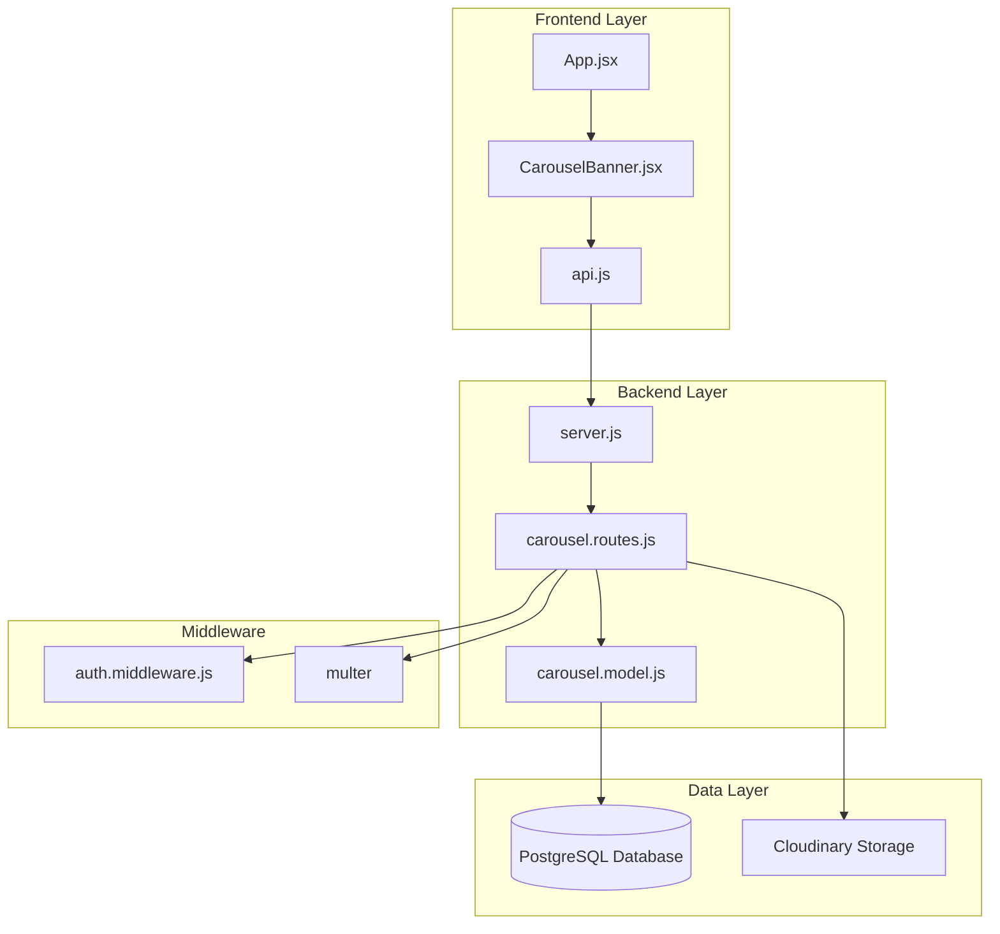
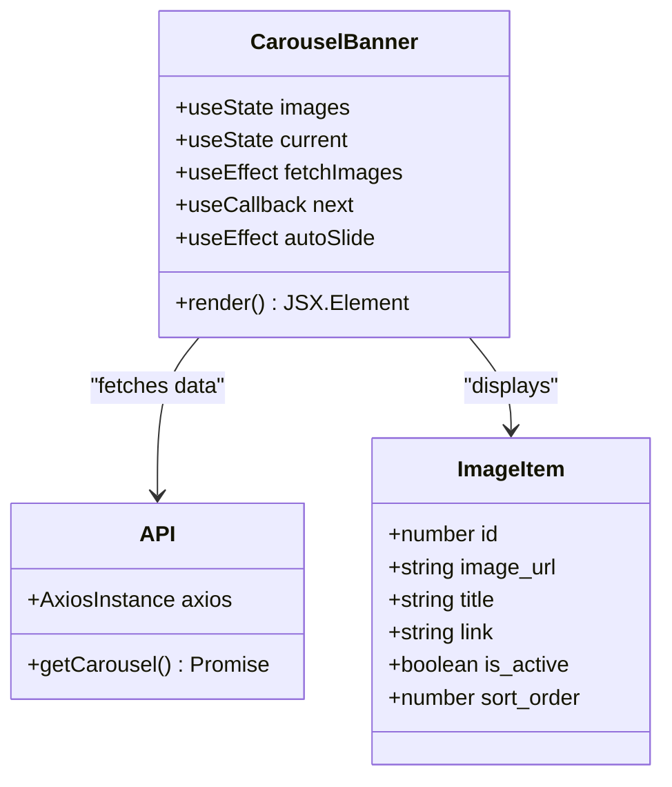
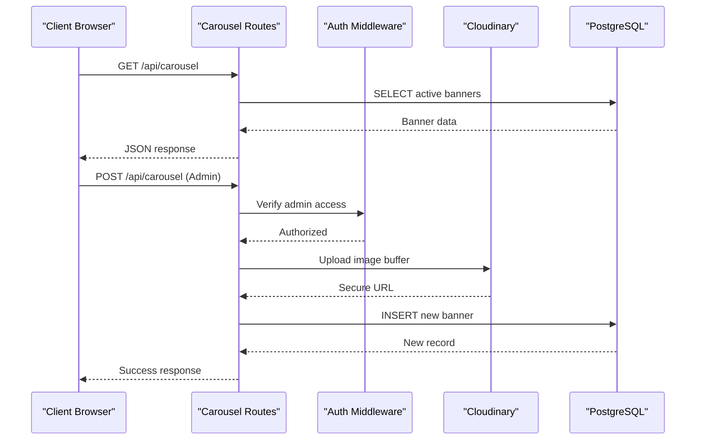
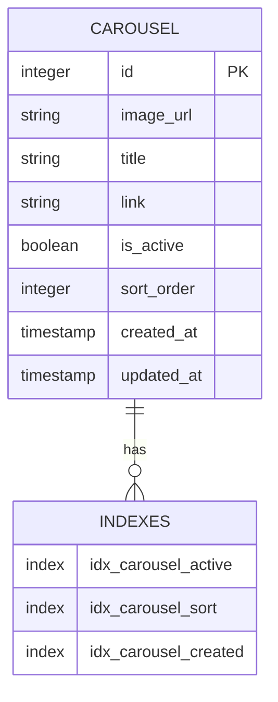
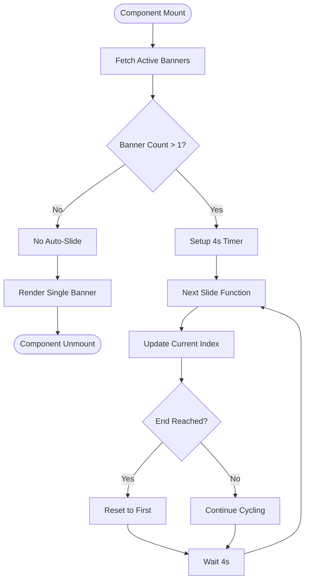
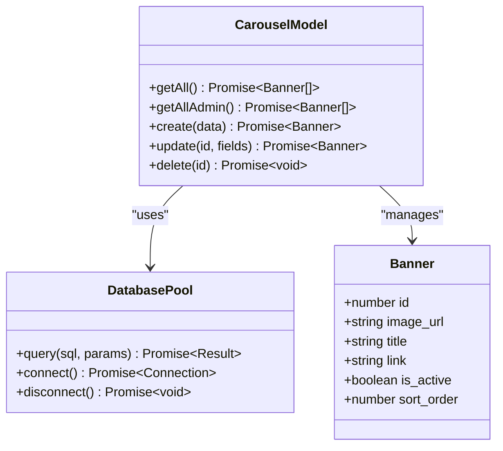

# Carousel Banner System

<cite>
**Referenced Files in This Document**
- [carousel.model.js](file://backend/models/carousel.model.js)
- [carousel.routes.js](file://backend/routes/carousel.routes.js)
- [CarouselBanner.jsx](file://frontend/src/components/CarouselBanner.jsx)
- [cloudinary.js](file://backend/config/cloudinary.js)
- [database.js](file://backend/config/database.js)
- [server.js](file://backend/server.js)
- [api.js](file://frontend/src/services/api.js)
- [App.jsx](file://frontend/src/App.jsx)
- [schema.sql](file://database/schema.sql)
</cite>

## Table of Contents
1. [Introduction](#introduction)
2. [System Architecture](#system-architecture)
3. [Core Components](#core-components)
4. [Database Design](#database-design)
5. [Frontend Implementation](#frontend-implementation)
6. [Backend Implementation](#backend-implementation)
7. [API Integration](#api-integration)
8. [Deployment Configuration](#deployment-configuration)
9. [Performance Considerations](#performance-considerations)
10. [Troubleshooting Guide](#troubleshooting-guide)
11. [Conclusion](#conclusion)

## Introduction

The Carousel Banner System is a dynamic image carousel component designed to showcase promotional content, advertisements, and featured announcements on the Craque Vision platform. This system provides administrators with the ability to manage banner content while delivering seamless, automated slide transitions to end users.

The system consists of a frontend React component that displays rotating banners and a backend API that manages carousel content through a PostgreSQL database. It integrates with Cloudinary for image storage and includes comprehensive CRUD operations for banner management.

## System Architecture

The Carousel Banner System follows a client-server architecture with clear separation of concerns between frontend presentation and backend data management.

**Diagram sources**
- [App.jsx:18-30](file://frontend/src/App.jsx#L18-L30)
- [CarouselBanner.jsx:1-63](file://frontend/src/components/CarouselBanner.jsx#L1-L63)
- [server.js:16-37](file://backend/server.js#L16-L37)
- [carousel.routes.js:1-106](file://backend/routes/carousel.routes.js#L1-L106)

## Core Components

### Frontend Carousel Component

The frontend carousel component is implemented as a React functional component that handles automatic slide transitions and responsive design.

**Diagram sources**
- [CarouselBanner.jsx:1-63](file://frontend/src/components/CarouselBanner.jsx#L1-L63)
- [api.js:1-42](file://frontend/src/services/api.js#L1-L42)

**Section sources**
- [CarouselBanner.jsx:1-63](file://frontend/src/components/CarouselBanner.jsx#L1-L63)
- [App.jsx:18-30](file://frontend/src/App.jsx#L18-L30)

### Backend API Routes

The backend provides comprehensive RESTful endpoints for carousel management with role-based access control.

**Diagram sources**
- [carousel.routes.js:36-75](file://backend/routes/carousel.routes.js#L36-L75)
- [cloudinary.js:1-16](file://backend/config/cloudinary.js#L1-L16)

**Section sources**
- [carousel.routes.js:1-106](file://backend/routes/carousel.routes.js#L1-L106)

## Database Design

The carousel system utilizes a PostgreSQL database with a dedicated table structure optimized for banner management and performance.

**Diagram sources**
- [schema.sql:1-189](file://database/schema.sql#L1-L189)

**Section sources**
- [schema.sql:1-189](file://database/schema.sql#L1-L189)

### Database Schema Details

The carousel table includes essential fields for content management:

- **Primary Key**: Auto-incrementing ID for unique identification
- **Image Management**: Secure URL storage for Cloudinary integration
- **Content Fields**: Title and optional link for enhanced user experience
- **Status Control**: Active/inactive state for content scheduling
- **Sorting Mechanism**: Sort order field for manual positioning
- **Timestamp Tracking**: Creation and modification timestamps for audit trails

## Frontend Implementation

### Carousel Component Features

The frontend carousel component provides a sophisticated user interface with the following capabilities:

#### Automatic Slide Transitions
- 4-second interval cycling between banner images
- Smooth opacity transitions for seamless visual effects
- Responsive design that adapts to different screen sizes
- Gradient overlays for improved text readability

#### Interactive Elements
- Optional clickable links for each banner
- Title overlays with gradient backgrounds
- Full-width responsive image display
- Mobile-optimized touch interactions

**Diagram sources**
- [CarouselBanner.jsx:8-23](file://frontend/src/components/CarouselBanner.jsx#L8-L23)

**Section sources**
- [CarouselBanner.jsx:1-63](file://frontend/src/components/CarouselBanner.jsx#L1-L63)

### API Integration

The frontend communicates with the backend through a centralized API service that handles authentication and request/response formatting.

**Section sources**
- [api.js:1-42](file://frontend/src/services/api.js#L1-L42)

## Backend Implementation

### Model Layer

The backend model provides database abstraction with comprehensive CRUD operations:

#### Core Operations
- **Retrieve Active Banners**: Fetch only currently active banners ordered by sort priority
- **Admin Access**: Full banner listing including inactive content for administrative management
- **Dynamic Updates**: Flexible field updates allowing partial modifications
- **Secure Deletion**: Safe removal of banner content with proper cleanup

**Diagram sources**
- [carousel.model.js:1-52](file://backend/models/carousel.model.js#L1-L52)
- [database.js:1-19](file://backend/config/database.js#L1-L19)

**Section sources**
- [carousel.model.js:1-52](file://backend/models/carousel.model.js#L1-L52)

### Route Configuration

The backend routes implement comprehensive access control and image processing:

#### Security Features
- **Authentication Middleware**: JWT token verification for admin operations
- **Authorization Validation**: Role-based access control for administrative functions
- **File Upload Security**: Multer configuration with size limits and format validation
- **Cloudinary Integration**: Secure image storage with automatic URL generation

#### Endpoint Specifications
- **Public Endpoint**: `GET /api/carousel` - Retrieves active banners for all users
- **Admin Endpoints**: CRUD operations requiring administrative privileges
- **Image Processing**: Buffer-based upload with Cloudinary transformation pipeline

**Section sources**
- [carousel.routes.js:1-106](file://backend/routes/carousel.routes.js#L1-L106)

## API Integration

### Frontend API Service

The frontend API service provides centralized request handling with authentication support:

#### Request Configuration
- **Base URL**: Environment-aware configuration for development and production
- **Authentication Headers**: Automatic JWT token injection for protected routes
- **FormData Handling**: Specialized processing for multipart form data
- **Error Handling**: Centralized 401 error handling for authentication failures

#### Response Processing
- **Automatic Token Removal**: Cleanup of expired or invalid tokens
- **Redirect Logic**: Automatic navigation to login page on authentication errors
- **Boundary Management**: Proper Content-Type handling for file uploads

**Section sources**
- [api.js:1-42](file://frontend/src/services/api.js#L1-L42)

### Server Integration

The backend server integrates carousel routes with the main application:

#### Route Registration
- **API Prefix**: `/api/carousel` for all carousel-related endpoints
- **Static File Serving**: Upload directory access for video content
- **Environment Configuration**: Production SPA routing for frontend assets

#### Application Lifecycle
- **Database Migration**: Automatic schema initialization on startup
- **Scheduler Integration**: Background task coordination for maintenance
- **Development Support**: Hot reload and development server configuration

**Section sources**
- [server.js:16-37](file://backend/server.js#L16-L37)

## Deployment Configuration

### Environment Variables

The system requires specific environment configurations for optimal operation:

#### Database Configuration
- **Production**: `DATABASE_URL` for Render deployment compatibility
- **Development**: Individual connection parameters for local testing
- **Connection Pooling**: Optimized connection management for concurrent requests

#### Cloudinary Integration
- **URL-based Configuration**: Single `CLOUDINARY_URL` for simplified setup
- **Multi-variable Support**: Alternative configuration using separate credentials
- **Resource Management**: Dedicated folder structure for carousel assets

#### Security Considerations
- **Authentication Tokens**: JWT secret configuration for secure session management
- **File Upload Limits**: Size restrictions to prevent abuse and optimize performance
- **Access Control**: Role-based permissions for administrative operations

**Section sources**
- [cloudinary.js:1-16](file://backend/config/cloudinary.js#L1-L16)
- [database.js:1-19](file://backend/config/database.js#L1-L19)

## Performance Considerations

### Frontend Optimization
- **Lazy Loading**: Images load only when visible in viewport
- **Memory Management**: Proper cleanup of timers and event listeners
- **Responsive Design**: Optimized for various screen sizes and devices
- **Transition Effects**: Hardware-accelerated CSS animations for smooth performance

### Backend Efficiency
- **Database Indexing**: Strategic indexes for active banner queries
- **Connection Pooling**: Efficient database connection management
- **Image Optimization**: Cloudinary automatic optimization and delivery
- **Caching Strategies**: Reduced database load through efficient query patterns

### Scalability Factors
- **Horizontal Scaling**: Stateless design enabling load balancing
- **Database Performance**: Optimized queries for high-traffic scenarios
- **CDN Integration**: Cloudinary's global delivery network for image optimization
- **Resource Management**: Efficient memory and CPU utilization patterns

## Troubleshooting Guide

### Common Issues and Solutions

#### Frontend Problems
- **Banners Not Loading**: Verify API endpoint accessibility and CORS configuration
- **Auto-Scroll Not Working**: Check for JavaScript errors and component lifecycle issues
- **Image Display Issues**: Confirm image URLs and Cloudinary accessibility
- **Mobile Responsiveness**: Test on various device sizes and orientations

#### Backend Issues
- **Database Connection Failures**: Verify environment variables and connection pooling
- **Image Upload Errors**: Check Cloudinary credentials and file format validation
- **Authentication Problems**: Validate JWT tokens and middleware configuration
- **API Response Issues**: Monitor database query performance and error logging

#### Performance Troubleshooting
- **Slow Load Times**: Optimize image sizes and CDN configuration
- **Memory Leaks**: Ensure proper cleanup of intervals and event listeners
- **Database Bottlenecks**: Review query optimization and indexing strategies
- **Authentication Delays**: Check token generation and validation performance

**Section sources**
- [carousel.routes.js:36-75](file://backend/routes/carousel.routes.js#L36-L75)
- [CarouselBanner.jsx:8-23](file://frontend/src/components/CarouselBanner.jsx#L8-L23)

## Conclusion

The Carousel Banner System provides a robust, scalable solution for dynamic content management on the Craque Vision platform. Its architecture balances simplicity with functionality, offering administrators comprehensive control over promotional content while delivering an engaging user experience.

Key strengths of the system include:

- **Modular Design**: Clear separation between frontend presentation and backend data management
- **Security Focus**: Comprehensive authentication and authorization mechanisms
- **Performance Optimization**: Efficient database queries and CDN integration
- **Developer Experience**: Well-structured codebase with clear documentation and error handling
- **Scalability**: Designed to handle growth in content volume and user traffic

The system successfully integrates modern web technologies including React for frontend development, Express.js for backend services, PostgreSQL for data persistence, and Cloudinary for image management, creating a cohesive and maintainable solution for banner content management.

Future enhancements could include advanced analytics tracking, A/B testing capabilities, and enhanced administrative interfaces for improved content management workflows.