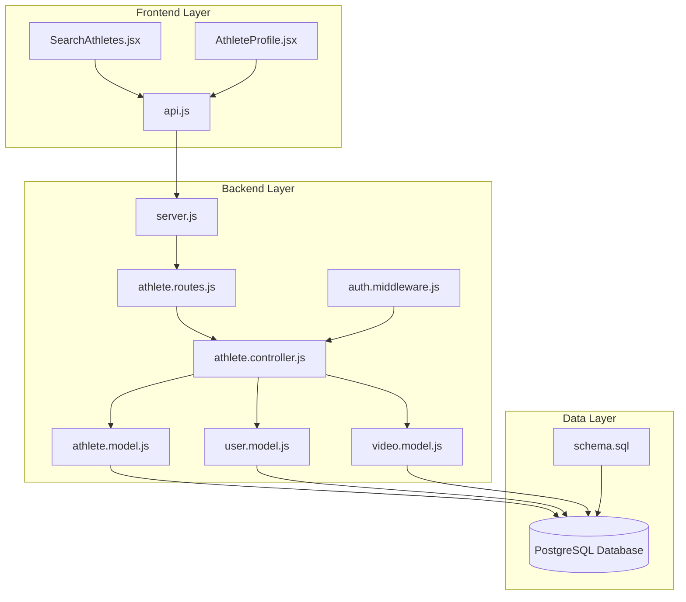
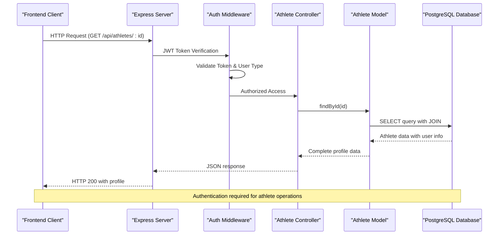
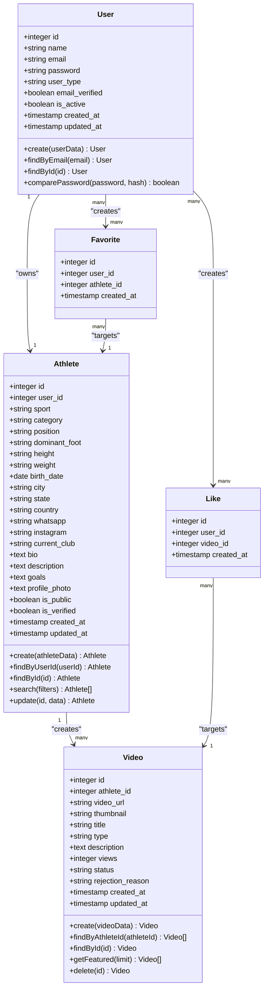
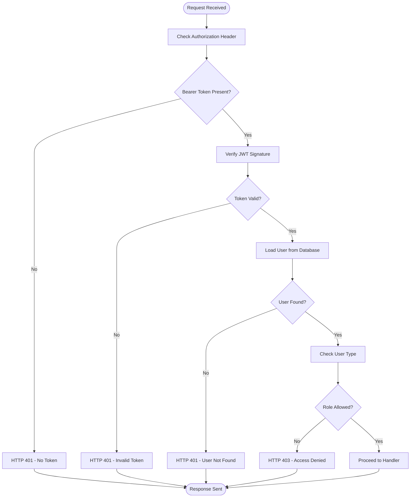
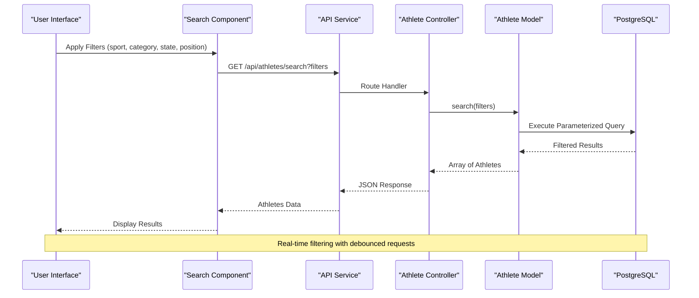
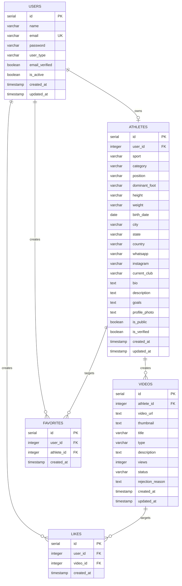

# Athlete Model

<cite>
**Referenced Files in This Document**
- [athlete.model.js](file://backend/models/athlete.model.js)
- [athlete.controller.js](file://backend/controllers/athlete.controller.js)
- [athlete.routes.js](file://backend/routes/athlete.routes.js)
- [user.model.js](file://backend/models/user.model.js)
- [video.model.js](file://backend/models/video.model.js)
- [schema.sql](file://database/schema.sql)
- [auth.middleware.js](file://backend/middleware/auth.middleware.js)
- [server.js](file://backend/server.js)
- [SearchAthletes.jsx](file://frontend/src/pages/SearchAthletes.jsx)
- [AthleteProfile.jsx](file://frontend/src/pages/AthleteProfile.jsx)
- [api.js](file://frontend/src/services/api.js)
</cite>

## Table of Contents
1. [Introduction](#introduction)
2. [Project Structure](#project-structure)
3. [Core Components](#core-components)
4. [Architecture Overview](#architecture-overview)
5. [Detailed Component Analysis](#detailed-component-analysis)
6. [Dependency Analysis](#dependency-analysis)
7. [Performance Considerations](#performance-considerations)
8. [Troubleshooting Guide](#troubleshooting-guide)
9. [Conclusion](#conclusion)

## Introduction
This document provides comprehensive data model documentation for the Athlete model within the Craque Vision platform. It covers the complete sports profile structure, validation rules, data relationships with the User model, integration with video content, query methods for athlete searches and profile retrieval, data access patterns, indexing strategies, and business rules for athlete verification and profile completeness. Additionally, it includes practical examples of athlete registration workflows, profile updates, and search filtering mechanisms.

## Project Structure
The Athlete model is part of a layered architecture with clear separation between presentation, business logic, data access, and persistence:

**Diagram sources**
- [server.js:1-40](file://backend/server.js#L1-L40)
- [athlete.routes.js:1-14](file://backend/routes/athlete.routes.js#L1-L14)
- [athlete.controller.js:1-91](file://backend/controllers/athlete.controller.js#L1-L91)
- [athlete.model.js:1-119](file://backend/models/athlete.model.js#L1-L119)
- [schema.sql:1-185](file://database/schema.sql#L1-L185)

**Section sources**
- [server.js:1-40](file://backend/server.js#L1-L40)
- [athlete.routes.js:1-14](file://backend/routes/athlete.routes.js#L1-L14)

## Core Components

### Athlete Data Model Structure
The Athlete model defines a comprehensive sports profile with the following field categories:

**Personal Information Fields:**
- Basic identification: `user_id` (foreign key to users table)
- Profile photo: `profile_photo` (URL to image storage)
- Personal details: `bio`, `description`, `goals` (text fields for athlete biography and aspirations)

**Physical Attributes:**
- Demographics: `height`, `weight`, `birth_date`
- Physical characteristics: `dominant_foot` (validated against 'left', 'right', 'both')

**Location Information:**
- Geographic: `city`, `state`, `country` (with default 'Brasil')
- International support: `country` field for global reach

**Contact Information:**
- Social media: `whatsapp`, `instagram`
- Professional contact: `current_club` (current team affiliation)

**Sport-Specific Data:**
- Athletic discipline: `sport` (validated sport type)
- Competitive level: `category` (age/competitiveness tiers)
- Playing position: `position` (specific role within sport)
- Foot preference: `dominant_foot` (football-specific but stored generically)

**Status Management:**
- Visibility: `is_public` (default true for discoverability)
- Verification: `is_verified` (default false, requires administrative approval)
- Content moderation: `created_at`, `updated_at` timestamps

**Section sources**
- [schema.sql:26-67](file://database/schema.sql#L26-L67)
- [athlete.model.js:3-32](file://backend/models/athlete.model.js#L3-L32)

### Validation Rules and Constraints
The database enforces strict validation through PostgreSQL constraints:

**Domain Validation:**
- `user_type`: Must be one of 'athlete', 'scout', 'club', 'admin'
- `dominant_foot`: Enumerated values 'left', 'right', 'both'
- `status`: Video moderation status with enumerated values
- `is_active`: Boolean flag for account lifecycle management

**Data Integrity:**
- Unique email constraint on users table
- Foreign key relationships with cascading deletes
- Timestamp triggers for automatic updated_at updates
- NOT NULL constraints on critical fields

**Section sources**
- [schema.sql:14-24](file://database/schema.sql#L14-L24)
- [schema.sql:27-67](file://database/schema.sql#L27-L67)
- [schema.sql:157-180](file://database/schema.sql#L157-L180)

## Architecture Overview

### Data Flow Architecture
The system follows a RESTful architecture with clear separation of concerns:

**Diagram sources**
- [auth.middleware.js:4-42](file://backend/middleware/auth.middleware.js#L4-L42)
- [athlete.controller.js:39-52](file://backend/controllers/athlete.controller.js#L39-L52)
- [athlete.model.js:40-49](file://backend/models/athlete.model.js#L40-L49)

### Component Relationships
The Athlete model integrates with multiple system components:

**Diagram sources**
- [user.model.js:4-39](file://backend/models/user.model.js#L4-L39)
- [athlete.model.js:3-116](file://backend/models/athlete.model.js#L3-L116)
- [video.model.js:3-58](file://backend/models/video.model.js#L3-L58)
- [schema.sql:14-138](file://database/schema.sql#L14-L138)

**Section sources**
- [user.model.js:1-42](file://backend/models/user.model.js#L1-L42)
- [athlete.model.js:1-119](file://backend/models/athlete.model.js#L1-L119)
- [video.model.js:1-61](file://backend/models/video.model.js#L1-L61)

## Detailed Component Analysis

### Data Access Patterns

#### CRUD Operations Implementation
The Athlete model implements standard CRUD operations with specific business logic:

**Create Operation:**
- Validates uniqueness of user_id association
- Inserts complete profile with all specified fields
- Returns newly created athlete record with auto-generated ID

**Read Operations:**
- `findByUserId`: Retrieves athlete profile linked to specific user
- `findById`: Fetches athlete with user details via JOIN operation
- `search`: Dynamic query building with multiple filter criteria

**Update Operation:**
- Partial updates using dynamic field mapping
- Ignores undefined values to prevent unintentional resets
- Maintains data integrity through parameterized queries

**Section sources**
- [athlete.model.js:4-32](file://backend/models/athlete.model.js#L4-L32)
- [athlete.model.js:34-49](file://backend/models/athlete.model.js#L34-L49)
- [athlete.model.js:51-86](file://backend/models/athlete.model.js#L51-L86)
- [athlete.model.js:88-115](file://backend/models/athlete.model.js#L88-L115)

#### Authentication and Authorization
The system implements role-based access control:

**Diagram sources**
- [auth.middleware.js:4-42](file://backend/middleware/auth.middleware.js#L4-L42)

**Section sources**
- [auth.middleware.js:1-59](file://backend/middleware/auth.middleware.js#L1-L59)

### Query Methods and Search Capabilities

#### Dynamic Search Implementation
The search functionality provides flexible filtering through multiple criteria:

**Supported Filters:**
- `sport`: Athletic discipline (exact match)
- `category`: Competitive level (exact match)
- `state`: Geographic location (exact match)
- `position`: Playing position (exact match)

**Search Algorithm:**
1. Base query with JOIN between athletes and users tables
2. Dynamic WHERE clause construction based on provided filters
3. Parameterized queries to prevent SQL injection
4. Consistent ordering by creation date (newest first)

**Section sources**
- [athlete.model.js:51-86](file://backend/models/athlete.model.js#L51-L86)
- [athlete.controller.js:73-81](file://backend/controllers/athlete.controller.js#L73-L81)

#### Frontend Search Integration
The frontend provides comprehensive search capabilities:

**Diagram sources**
- [SearchAthletes.jsx:30-45](file://frontend/src/pages/SearchAthletes.jsx#L30-L45)
- [athlete.controller.js:73-81](file://backend/controllers/athlete.controller.js#L73-L81)
- [athlete.model.js:51-86](file://backend/models/athlete.model.js#L51-L86)

**Section sources**
- [SearchAthletes.jsx:1-218](file://frontend/src/pages/SearchAthletes.jsx#L1-L218)

### Business Rules and Verification Workflow

#### Profile Completeness Requirements
The system enforces profile completeness through multiple validation layers:

**Required Fields:**
- `user_id`: Establishes user-athlete relationship
- `sport`: Primary athletic discipline
- `city`, `state`: Geographic information for discoverability

**Verification Process:**
1. Initial profile creation with basic information
2. Administrative review for verification status
3. Public visibility controlled by `is_public` flag
4. Content moderation through video approval workflow

**Section sources**
- [schema.sql:62-63](file://database/schema.sql#L62-L63)
- [athlete.model.js:10-10](file://backend/models/athlete.model.js#L10-L10)

#### Video Content Integration
Athletes serve as content creators within the platform:

**Video Association:**
- One-to-many relationship between athletes and videos
- Video moderation status affects content visibility
- Featured content selection based on recency and quality

**Section sources**
- [video.model.js:18-26](file://backend/models/video.model.js#L18-L26)
- [schema.sql:69-88](file://database/schema.sql#L69-L88)

## Dependency Analysis

### Database Relationships and Constraints

**Diagram sources**
- [schema.sql:14-138](file://database/schema.sql#L14-L138)

### External Dependencies and Integration Points

**Authentication Integration:**
- JWT-based authentication with token verification
- Role-based authorization (athlete, scout, club, admin)
- Automatic user context injection into request pipeline

**Database Integration:**
- PostgreSQL connection pooling for efficient resource management
- Transaction-safe operations with proper error handling
- Index optimization for search performance

**Section sources**
- [auth.middleware.js:1-59](file://backend/middleware/auth.middleware.js#L1-L59)
- [database.js:1-13](file://backend/config/database.js#L1-L13)

## Performance Considerations

### Indexing Strategy
The database schema implements strategic indexing for optimal query performance:

**Primary Indexes:**
- `idx_athletes_user_id`: Accelerates user-to-athlete lookups
- `idx_athletes_sport`: Optimizes sport-based searches
- `idx_athletes_category`: Supports competitive level filtering
- `idx_athletes_state`: Enables geographic queries
- `idx_athletes_position`: Facilitates position-based searches

**Additional Performance Enhancements:**
- Composite indexes for frequently combined filters
- Triggers for automatic timestamp updates
- Connection pooling for concurrent database operations

**Section sources**
- [schema.sql:140-156](file://database/schema.sql#L140-L156)

### Query Optimization Patterns
The Athlete model employs several optimization strategies:

**Parameterized Queries:**
- Prevents SQL injection while maintaining performance
- Enables database query plan caching
- Supports dynamic filter construction

**Efficient Data Retrieval:**
- Selective field retrieval to minimize bandwidth
- JOIN operations optimized for user-profile aggregation
- Pagination support for large result sets

## Troubleshooting Guide

### Common Issues and Solutions

**Authentication Failures:**
- Verify JWT token presence and validity
- Check user type authorization for athlete routes
- Confirm token expiration and refresh procedures

**Database Connection Problems:**
- Validate PostgreSQL credentials and connection string
- Check database availability and network connectivity
- Review connection pool limits and timeout configurations

**Search Performance Issues:**
- Ensure appropriate indexes are in place
- Monitor query execution plans
- Consider query result caching for frequently accessed data

**Section sources**
- [auth.middleware.js:24-32](file://backend/middleware/auth.middleware.js#L24-L32)
- [database.js:4-10](file://backend/config/database.js#L4-L10)

### Error Handling Patterns
The system implements comprehensive error handling:

**HTTP Status Codes:**
- 401: Authentication failures and invalid tokens
- 403: Authorization violations and role mismatches
- 404: Resource not found scenarios
- 500: Internal server errors with detailed logging

**Error Response Format:**
Consistent JSON error responses with descriptive messages for client-side handling and user feedback.

## Conclusion
The Athlete model provides a robust foundation for managing comprehensive sports profiles within the Craque Vision platform. Its design balances flexibility with strong validation, enabling rich athlete discovery while maintaining data integrity and performance. The integration with user authentication, video content management, and search functionality creates a cohesive ecosystem for athlete showcase and scouting operations.

Key strengths of the implementation include:
- Comprehensive profile structure supporting diverse sports disciplines
- Strong validation rules preventing data inconsistencies
- Efficient search capabilities with strategic indexing
- Clear separation of concerns through layered architecture
- Robust authentication and authorization mechanisms
- Scalable database design with performance optimizations

The model's extensibility allows for future enhancements such as advanced analytics, social features, and expanded content types while maintaining backward compatibility and system stability.