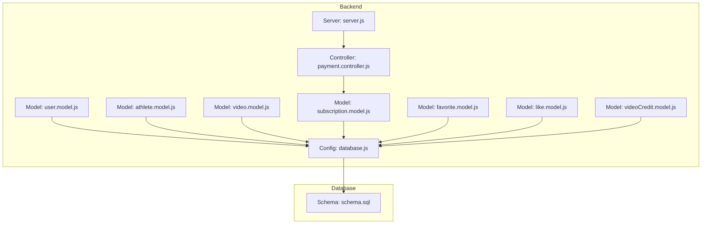
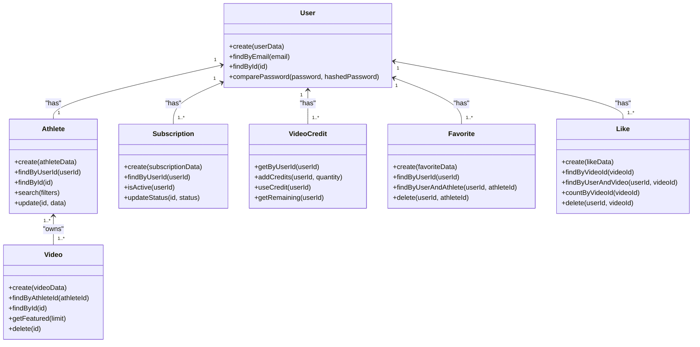
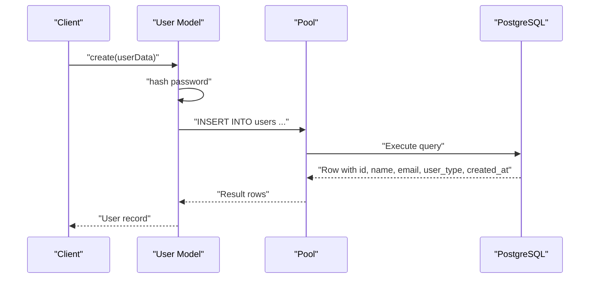
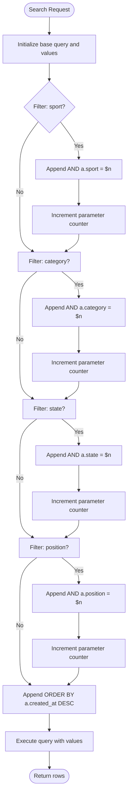
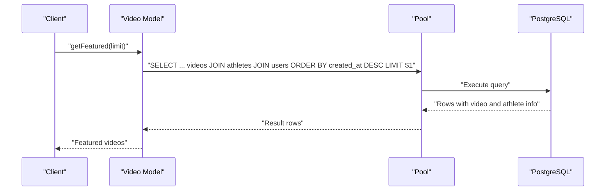
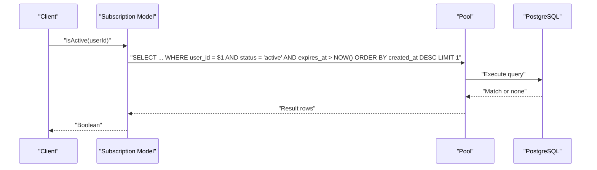
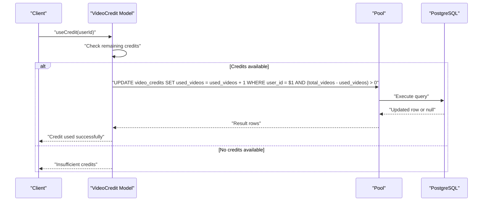
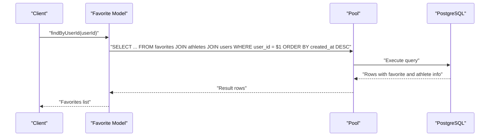
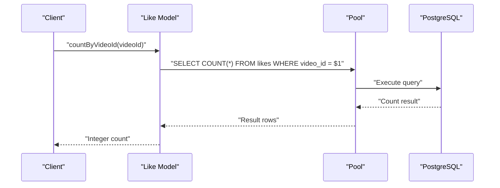
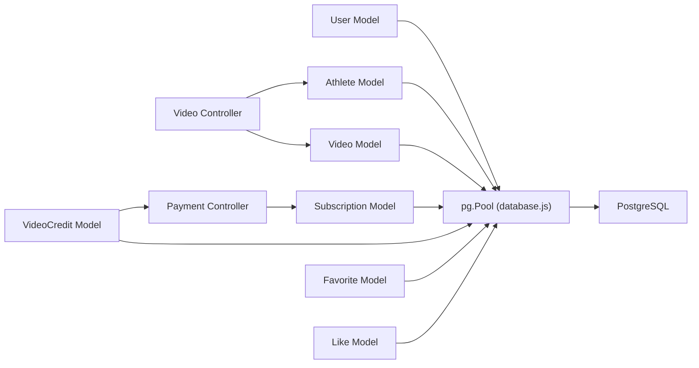

# Data Models

<cite>
**Referenced Files in This Document**
- [database.js](file://backend/config/database.js)
- [schema.sql](file://database/schema.sql)
- [user.model.js](file://backend/models/user.model.js)
- [athlete.model.js](file://backend/models/athlete.model.js)
- [video.model.js](file://backend/models/video.model.js)
- [subscription.model.js](file://backend/models/subscription.model.js)
- [favorite.model.js](file://backend/models/favorite.model.js)
- [like.model.js](file://backend/models/like.model.js)
- [videoCredit.model.js](file://backend/models/videoCredit.model.js)
- [payment.controller.js](file://backend/controllers/payment.controller.js)
- [server.js](file://backend/server.js)
</cite>

## Update Summary
**Changes Made**
- Added new VideoCredit model documentation for video upload permission management
- Updated Video model to include payment_proof field for video credit system integration
- Enhanced payment controller documentation to reflect video credit payment processing
- Added video credit system architecture and business logic documentation

## Table of Contents
1. [Introduction](#introduction)
2. [Project Structure](#project-structure)
3. [Core Components](#core-components)
4. [Architecture Overview](#architecture-overview)
5. [Detailed Component Analysis](#detailed-component-analysis)
6. [Dependency Analysis](#dependency-analysis)
7. [Performance Considerations](#performance-considerations)
8. [Troubleshooting Guide](#troubleshooting-guide)
9. [Conclusion](#conclusion)

## Introduction
This document provides comprehensive data model documentation for Craque-Vision's core entities. It covers the User model with role-based access control, the Athlete model with a detailed sports profile, the Video model with media management capabilities, the Subscription model with billing integration, the VideoCredit model for video upload permission management, and the Favorite/Like models for user engagement tracking. For each model, we explain field definitions, validation rules, business logic, relationships, data access patterns, ORM implementation details, connection pooling configuration, query optimization strategies, and data lifecycle management.

## Project Structure
The data models are implemented as lightweight classes per entity, backed by a PostgreSQL connection pool configured via environment variables. The schema defines all tables, constraints, indexes, and triggers. Controllers orchestrate business flows, including payment creation, subscription activation, and video credit management. The new video credit system adds a layer of permission control for video uploads through a credit-based mechanism.

**Diagram sources**
- [database.js:1-13](file://backend/config/database.js#L1-L13)
- [schema.sql:1-189](file://database/schema.sql#L1-L189)
- [user.model.js:1-42](file://backend/models/user.model.js#L1-L42)
- [athlete.model.js:1-119](file://backend/models/athlete.model.js#L1-L119)
- [video.model.js:1-78](file://backend/models/video.model.js#L1-L78)
- [subscription.model.js:1-55](file://backend/models/subscription.model.js#L1-L55)
- [favorite.model.js:1-52](file://backend/models/favorite.model.js#L1-L52)
- [like.model.js:1-61](file://backend/models/like.model.js#L1-L61)
- [videoCredit.model.js:1-55](file://backend/models/videoCredit.model.js#L1-L55)
- [payment.controller.js:1-205](file://backend/controllers/payment.controller.js#L1-L205)
- [server.js:1-40](file://backend/server.js#L1-L40)

**Section sources**
- [server.js:1-40](file://backend/server.js#L1-L40)
- [database.js:1-13](file://backend/config/database.js#L1-L13)
- [schema.sql:1-189](file://database/schema.sql#L1-L189)

## Core Components
This section outlines each model's purpose, fields, validations, and relationships.

- User
  - Purpose: Authentication and role-based access control.
  - Key fields: id, name, email (unique), password, user_type (check constraint), email_verified, is_active, timestamps.
  - Validation: user_type constrained to predefined roles; email uniqueness enforced at DB level.
  - Relationships: One-to-one with Athlete via user_id; referenced by Favorites and Likes; referenced by Subscriptions/Payments.
  - Access patterns: create, findByEmail, findById, comparePassword.
  - Lifecycle: updated_at auto-updated via trigger.

- Athlete
  - Purpose: Comprehensive sports profile for athletes.
  - Key fields: user_id (FK), sport, category, position, dominant_foot (check), weight, height, birth_date, location (city/state/country), contact (whatsapp, instagram), club info (current_club, historic), profile (profile_photo, bio, description, goals), visibility flags (is_public, is_verified), timestamps.
  - Validation: dominant_foot constrained; country defaults; is_public/is_verified flags; unique user_id enforced by FK cascade.
  - Relationships: One-to-one with User; one-to-many with Video; many-to-one with Favorites.
  - Access patterns: create, findByUserId, findById, search (dynamic filters), update (partial updates).
  - Lifecycle: updated_at auto-updated via trigger.

- Video
  - Purpose: Media management for athlete showcases with credit-based upload permissions.
  - Key fields: athlete_id (FK), video_url, thumbnail, title, type, description, views (default 0), status (check), rejection_reason, payment_proof, timestamps.
  - Validation: status constrained; default pending; payment_proof field added for credit verification.
  - Relationships: Belongs to Athlete; many-to-one with Likes; referenced by Favorites indirectly via athlete.
  - Access patterns: create, findByAthleteId, findById (with joins), getFeatured, delete.
  - Lifecycle: updated_at auto-updated via trigger.

- Subscription
  - Purpose: Billing integration for paid plans.
  - Key fields: user_id (FK), plan_name, status (check), expires_at, payment_id, timestamps.
  - Validation: status constrained; active/expired checks in queries.
  - Relationships: Belongs to User; linked to Payments via payment_id.
  - Access patterns: create, findByUserId (latest), isActive (boolean), updateStatus.
  - Lifecycle: updated_at auto-updated via trigger.

- VideoCredit
  - Purpose: Manage video upload permissions through a credit-based system.
  - Key fields: user_id (FK), total_videos, used_videos, timestamps.
  - Validation: used_videos cannot exceed total_videos; automatic credit tracking.
  - Relationships: One-to-one with User; manages video upload permissions.
  - Access patterns: getByUserId, addCredits, useCredit, getRemaining.
  - Lifecycle: updated_at auto-updated via trigger.

- Favorite
  - Purpose: Track user preferences for athletes.
  - Key fields: user_id (FK), athlete_id (FK), created_at.
  - Validation: composite unique(user_id, athlete_id).
  - Relationships: Many-to-one with User and Athlete.
  - Access patterns: create, findByUserId, findByUserAndAthlete, delete.
  - Lifecycle: created_at managed by DB.

- Like
  - Purpose: Track user engagement with videos.
  - Key fields: user_id (FK), video_id (FK), created_at.
  - Validation: composite unique(user_id, video_id).
  - Relationships: Many-to-one with User and Video.
  - Access patterns: create, findByVideoId, findByUserAndVideo, countByVideoId, delete.
  - Lifecycle: created_at managed by DB.

**Section sources**
- [user.model.js:1-42](file://backend/models/user.model.js#L1-L42)
- [athlete.model.js:1-119](file://backend/models/athlete.model.js#L1-L119)
- [video.model.js:1-78](file://backend/models/video.model.js#L1-L78)
- [subscription.model.js:1-55](file://backend/models/subscription.model.js#L1-L55)
- [favorite.model.js:1-52](file://backend/models/favorite.model.js#L1-L52)
- [like.model.js:1-61](file://backend/models/like.model.js#L1-L61)
- [videoCredit.model.js:1-55](file://backend/models/videoCredit.model.js#L1-L55)
- [schema.sql:14-189](file://database/schema.sql#L14-L189)

## Architecture Overview
The data access layer uses a single PostgreSQL connection pool configured from environment variables. Each model encapsulates CRUD and business-specific queries. Payment flows create subscriptions and update statuses, integrating with the Subscription model. The new video credit system adds a permission layer for video uploads, requiring users to have sufficient credits before uploading videos.

**Diagram sources**
- [user.model.js:1-42](file://backend/models/user.model.js#L1-L42)
- [athlete.model.js:1-119](file://backend/models/athlete.model.js#L1-L119)
- [video.model.js:1-78](file://backend/models/video.model.js#L1-L78)
- [subscription.model.js:1-55](file://backend/models/subscription.model.js#L1-L55)
- [videoCredit.model.js:1-55](file://backend/models/videoCredit.model.js#L1-L55)
- [favorite.model.js:1-52](file://backend/models/favorite.model.js#L1-L52)
- [like.model.js:1-61](file://backend/models/like.model.js#L1-L61)

## Detailed Component Analysis

### User Model
- Field definitions and constraints
  - user_type constrained to predefined roles.
  - email uniqueness enforced.
  - Password stored as hash; verification handled by bcrypt.
- Validation rules
  - Role validation occurs at DB level via check constraint.
  - Email uniqueness enforced at DB level.
- Business logic
  - Authentication compares plaintext against hashed password.
  - Creation hashes passwords before insertion.
- Relationships
  - One-to-one with Athlete via user_id.
  - Referenced by Favorites, Likes, Subscriptions, Payments.
- Data access patterns
  - create: inserts user with hashed password.
  - findByEmail/findById: lookup by identity.
  - comparePassword: credential verification.
- ORM implementation details
  - Uses pg.Pool for all queries.
- Connection pooling configuration
  - Host, port, database, user, password loaded from environment.
- Query optimization strategies
  - Index on users(email) supports lookups.
  - Triggers update updated_at automatically.
- Data lifecycle management
  - created_at/updated_at managed by DB; updated_at via trigger.

**Diagram sources**
- [user.model.js:5-18](file://backend/models/user.model.js#L5-L18)
- [database.js:4-10](file://backend/config/database.js#L4-L10)

**Section sources**
- [user.model.js:1-42](file://backend/models/user.model.js#L1-L42)
- [schema.sql:14-25](file://database/schema.sql#L14-L25)
- [database.js:1-13](file://backend/config/database.js#L1-L13)

### Athlete Model
- Field definitions and constraints
  - Sport/category/position/dominant_foot validated via constraints.
  - Country defaults; location fields optional.
  - Visibility flags and verification flag.
- Validation rules
  - dominant_foot constrained; country default set.
- Business logic
  - Dynamic search with additive filters (sport, category, state, position).
  - Partial updates supported via dynamic SET generation.
- Relationships
  - One-to-one with User; one-to-many with Video; many-to-one with Favorites.
- Data access patterns
  - create: insert full profile.
  - findByUserId/findById: lookup by identity with joins.
  - search: build WHERE dynamically from filters.
  - update: partial updates with safe parameterization.
- ORM implementation details
  - Uses pg.Pool for all queries.
- Connection pooling configuration
  - Same pool as other models.
- Query optimization strategies
  - Indexes on athletes(user_id), athletes(sport), athletes(category), athletes(state), athletes(position).
  - Triggers update updated_at automatically.
- Data lifecycle management
  - created_at/updated_at managed by DB; updated_at via trigger.

**Diagram sources**
- [athlete.model.js:51-86](file://backend/models/athlete.model.js#L51-L86)

**Section sources**
- [athlete.model.js:1-119](file://backend/models/athlete.model.js#L1-L119)
- [schema.sql:27-68](file://database/schema.sql#L27-L68)
- [database.js:1-13](file://backend/config/database.js#L1-L13)

### Video Model
- Field definitions and constraints
  - video_url, title required; thumbnail optional; type optional; description optional.
  - views default 0; status constrained; rejection_reason optional; payment_proof added for credit verification.
- Validation rules
  - status constrained to pending/approved/rejected.
- Business logic
  - Featured feed aggregates latest videos with athlete and user names.
  - Payment proof field enables video credit verification workflow.
- Relationships
  - Belongs to Athlete; many-to-one with Likes; indirectly referenced by Favorites via athlete.
- Data access patterns
  - create: insert video metadata including payment_proof.
  - findByAthleteId: list videos ordered by recency.
  - findById: join with athlete and user for context.
  - getFeatured: limit featured selection.
  - delete: remove video.
- ORM implementation details
  - Uses pg.Pool for all queries.
- Connection pooling configuration
  - Same pool as other models.
- Query optimization strategies
  - Index on videos(athlete_id) and videos(status).
  - Triggers update updated_at automatically.
- Data lifecycle management
  - created_at/updated_at managed by DB; updated_at via trigger.

**Diagram sources**
- [video.model.js:54-68](file://backend/models/video.model.js#L54-L68)
- [database.js:4-10](file://backend/config/database.js#L4-L10)

**Section sources**
- [video.model.js:1-78](file://backend/models/video.model.js#L1-L78)
- [schema.sql:70-90](file://database/schema.sql#L70-L90)
- [database.js:1-13](file://backend/config/database.js#L1-L13)

### Subscription Model
- Field definitions and constraints
  - plan_name required; status constrained; expires_at optional; payment_id optional.
- Validation rules
  - status constrained; active/expired determined by comparison with current time.
- Business logic
  - isActive checks latest subscription for active status and future expiry.
  - updateStatus changes status atomically.
- Relationships
  - Belongs to User; linked to Payments via payment_id.
- Data access patterns
  - create: insert subscription with plan and expiry.
  - findByUserId: latest subscription by user.
  - isActive: boolean check.
  - updateStatus: change status.
- ORM implementation details
  - Uses pg.Pool for all queries.
- Connection pooling configuration
  - Same pool as other models.
- Query optimization strategies
  - Index on subscriptions(user_id) and subscriptions(status).
  - Triggers update updated_at automatically.
- Data lifecycle management
  - created_at/updated_at managed by DB; updated_at via trigger.

**Diagram sources**
- [subscription.model.js:29-40](file://backend/models/subscription.model.js#L29-L40)
- [database.js:4-10](file://backend/config/database.js#L4-L10)

**Section sources**
- [subscription.model.js:1-55](file://backend/models/subscription.model.js#L1-L55)
- [schema.sql:92-105](file://database/schema.sql#L92-L105)
- [database.js:1-13](file://backend/config/database.js#L1-L13)

### VideoCredit Model
- Field definitions and constraints
  - user_id (FK) required; total_videos (default 0); used_videos (default 0); timestamps.
  - used_videos cannot exceed total_videos constraint enforced via WHERE clause.
- Validation rules
  - Credit usage prevented when total_videos - used_videos <= 0.
  - Automatic timestamp updates on modifications.
- Business logic
  - getByUserId: retrieve user's credit balance.
  - addCredits: add credits to existing or new credit record.
  - useCredit: consume 1 credit for video upload.
  - getRemaining: calculate available credits.
- Relationships
  - One-to-one with User; manages video upload permissions.
- Data access patterns
  - getByUserId: fetch credit details.
  - addCredits: create or update credit balance.
  - useCredit: decrement used_videos atomically.
  - getRemaining: compute remaining credits.
- ORM implementation details
  - Uses pg.Pool for all queries.
- Connection pooling configuration
  - Same pool as other models.
- Query optimization strategies
  - No specific indexes needed; simple lookup pattern.
  - Triggers update updated_at automatically.
- Data lifecycle management
  - created_at/updated_at managed by DB; updated_at via trigger.

**Diagram sources**
- [videoCredit.model.js:34-44](file://backend/models/videoCredit.model.js#L34-L44)
- [database.js:4-10](file://backend/config/database.js#L4-L10)

**Section sources**
- [videoCredit.model.js:1-55](file://backend/models/videoCredit.model.js#L1-L55)
- [schema.sql:144-189](file://database/schema.sql#L144-L189)
- [database.js:1-13](file://backend/config/database.js#L1-L13)

### Favorite Model
- Field definitions and constraints
  - Composite unique(user_id, athlete_id) prevents duplicates.
- Validation rules
  - Unique constraint enforced at DB level.
- Business logic
  - Retrieve favorites with athlete and user details; check existence; delete favorite.
- Relationships
  - Many-to-one with User and Athlete.
- Data access patterns
  - create: insert favorite.
  - findByUserId: list favorites with joins.
  - findByUserAndAthlete: existence check.
  - delete: remove favorite.
- ORM implementation details
  - Uses pg.Pool for all queries.
- Connection pooling configuration
  - Same pool as other models.
- Query optimization strategies
  - Indexes on favorites(user_id) and favorites(athlete_id).
- Data lifecycle management
  - created_at managed by DB.

**Diagram sources**
- [favorite.model.js:18-29](file://backend/models/favorite.model.js#L18-L29)
- [database.js:4-10](file://backend/config/database.js#L4-L10)

**Section sources**
- [favorite.model.js:1-52](file://backend/models/favorite.model.js#L1-L52)
- [schema.sql:124-132](file://database/schema.sql#L124-L132)
- [database.js:1-13](file://backend/config/database.js#L1-L13)

### Like Model
- Field definitions and constraints
  - Composite unique(user_id, video_id) prevents duplicates.
- Validation rules
  - Unique constraint enforced at DB level.
- Business logic
  - Retrieve likes with user names; count likes per video; delete like.
- Relationships
  - Many-to-one with User and Video.
- Data access patterns
  - create: insert like.
  - findByVideoId: list likes with user names.
  - findByUserAndVideo: existence check.
  - countByVideoId: total likes.
  - delete: remove like.
- ORM implementation details
  - Uses pg.Pool for all queries.
- Connection pooling configuration
  - Same pool as other models.
- Query optimization strategies
  - Indexes on likes(user_id) and likes(video_id).
- Data lifecycle management
  - created_at managed by DB.

**Diagram sources**
- [like.model.js:39-47](file://backend/models/like.model.js#L39-L47)
- [database.js:4-10](file://backend/config/database.js#L4-L10)

**Section sources**
- [like.model.js:1-61](file://backend/models/like.model.js#L1-L61)
- [schema.sql:134-142](file://database/schema.sql#L134-L142)
- [database.js:1-13](file://backend/config/database.js#L1-L13)

## Dependency Analysis
- Internal dependencies
  - All models depend on the shared pg.Pool from database.js.
  - Controllers depend on models for business operations.
  - Video controller now integrates with video credit system.
- External dependencies
  - bcryptjs for password hashing.
  - pg for PostgreSQL connectivity.
  - jsonwebtoken, cors, dotenv, express for application stack.
- Potential circular dependencies
  - None observed among models; controllers import models as needed.
- Integration points
  - Payment controller creates subscriptions after payment confirmation.
  - Video credit system integrates with payment processing workflow.
  - Admin approval process manages video credit allocation.

**Diagram sources**
- [database.js:1-13](file://backend/config/database.js#L1-L13)
- [user.model.js](file://backend/models/user.model.js#L1)
- [athlete.model.js](file://backend/models/athlete.model.js#L1)
- [video.model.js](file://backend/models/video.model.js#L1)
- [subscription.model.js](file://backend/models/subscription.model.js#L1)
- [videoCredit.model.js](file://backend/models/videoCredit.model.js#L1)
- [favorite.model.js](file://backend/models/favorite.model.js#L1)
- [like.model.js](file://backend/models/like.model.js#L1)
- [payment.controller.js](file://backend/controllers/payment.controller.js#L1)
- [video.controller.js](file://backend/controllers/video.controller.js#L1)

**Section sources**
- [database.js:1-13](file://backend/config/database.js#L1-L13)
- [payment.controller.js:1-205](file://backend/controllers/payment.controller.js#L1-L205)
- [video.controller.js:1-168](file://backend/controllers/video.controller.js#L1-L168)

## Performance Considerations
- Indexes
  - Users: email, user_type.
  - Athletes: user_id, sport, category, state, position.
  - Videos: athlete_id, status.
  - Subscriptions: user_id, status.
  - Favorites: user_id, athlete_id.
  - Likes: user_id, video_id.
  - VideoCredits: user_id (recommended for performance).
- Triggers
  - Automatic updated_at updates reduce application-side overhead.
- Query patterns
  - Parameterized queries prevent SQL injection and enable plan reuse.
  - LIMIT clauses for pagination and featured feeds.
  - Atomic UPDATE operations for credit management.
- Connection pooling
  - Single pool shared across models; ensure adequate pool size and timeouts for production workloads.
- Credit System Optimization
  - Simple lookup patterns for video credit queries.
  - Atomic operations prevent race conditions in credit usage.

## Troubleshooting Guide
- Authentication failures
  - Verify password hashing and comparePassword usage.
  - Confirm email uniqueness and correct email lookup.
- Role-based access control
  - Ensure user_type matches expected values; enforce at controller level where appropriate.
- Search/filter issues
  - Confirm filter keys match schema; verify parameter ordering in dynamic queries.
- Subscription status checks
  - isActive relies on status and expires_at comparisons; validate timezone handling.
- Engagement metrics
  - Use countByVideoId for accurate like counts; ensure unique constraints are respected.
- Payment integration
  - After payment confirmation, verify subscription creation and status updates.
- Video credit system
  - Verify credit balance before video upload attempts.
  - Check payment_proof field for successful credit allocation.
  - Monitor credit usage atomicity to prevent double spending.
- Video upload permissions
  - Ensure users have sufficient credits before allowing video uploads.
  - Verify admin approval process for payment verification.

**Section sources**
- [user.model.js:36-38](file://backend/models/user.model.js#L36-L38)
- [athlete.model.js:51-86](file://backend/models/athlete.model.js#L51-L86)
- [subscription.model.js:29-40](file://backend/models/subscription.model.js#L29-L40)
- [like.model.js:39-47](file://backend/models/like.model.js#L39-L47)
- [videoCredit.model.js:34-44](file://backend/models/videoCredit.model.js#L34-L44)
- [payment.controller.js:175-204](file://backend/controllers/payment.controller.js#L175-L204)

## Conclusion
Craque-Vision's data models are designed around clear entity boundaries, robust constraints, and efficient indexing. The shared PostgreSQL connection pool simplifies deployment while maintaining strong referential integrity and lifecycle management via triggers. The models support core business flows including user authentication, athlete profiles, video management, subscription billing, video credit system, and user engagement tracking. The new video credit system adds a sophisticated permission layer for video uploads, requiring users to purchase credits through a payment process and manage their upload quotas. For production, ensure environment configuration is secure, monitor pool utilization, validate business rules at both DB and application layers, and implement proper credit management workflows to prevent unauthorized video uploads.