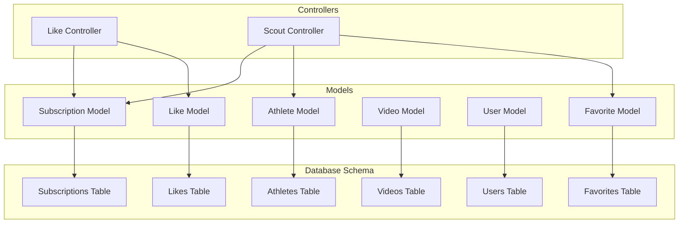
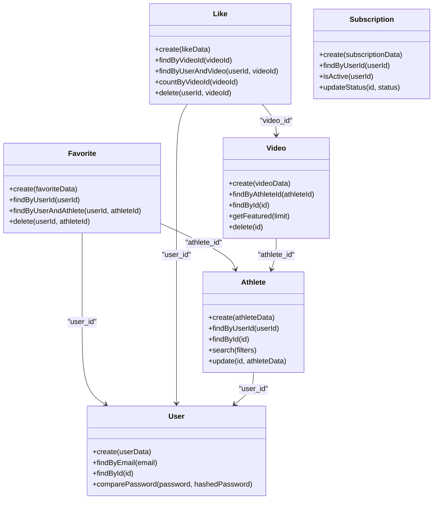
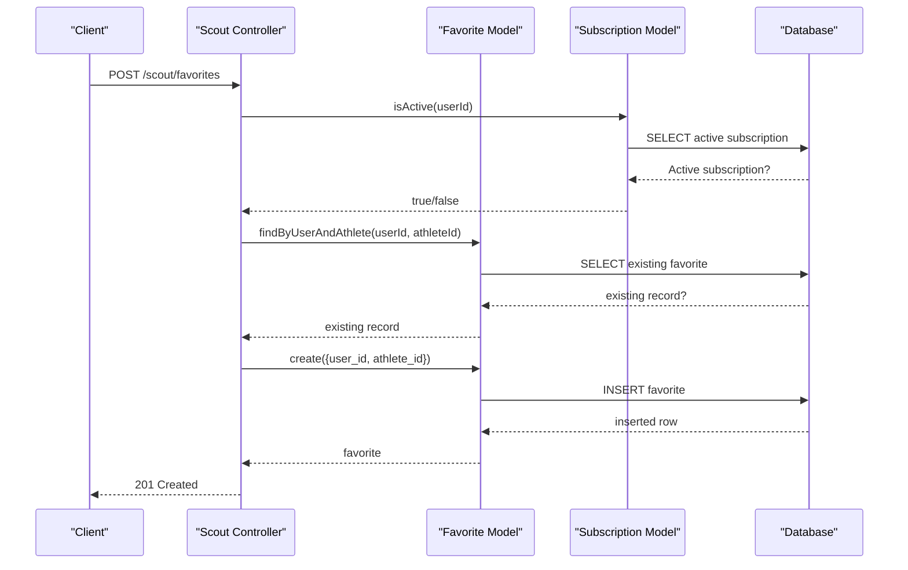
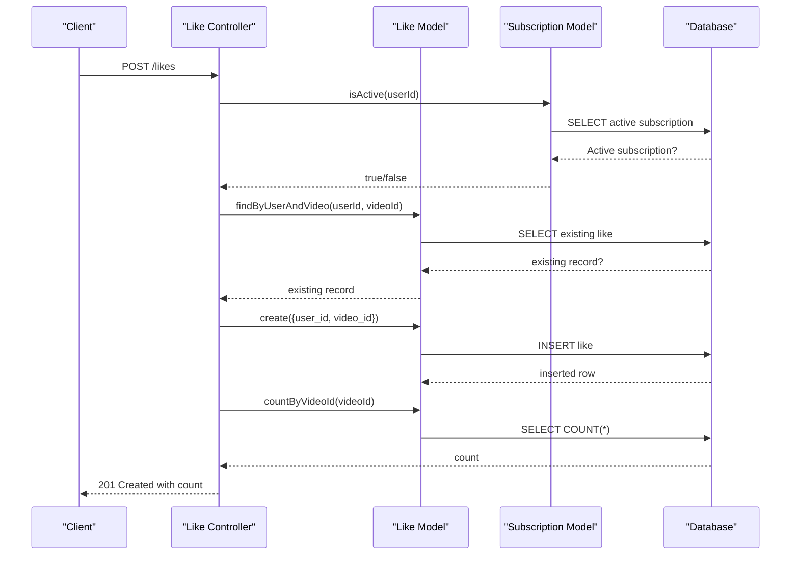
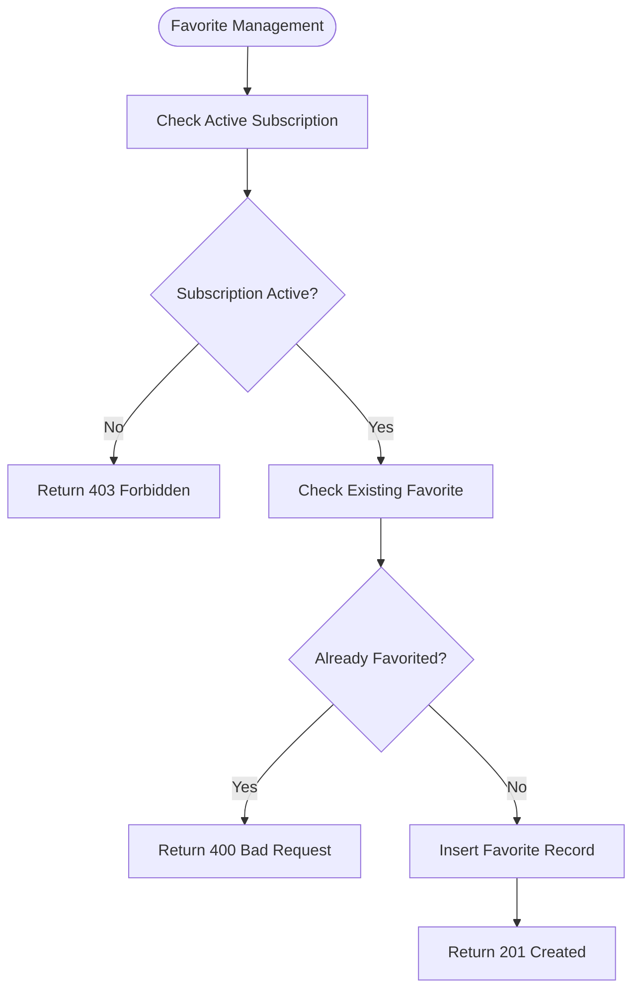
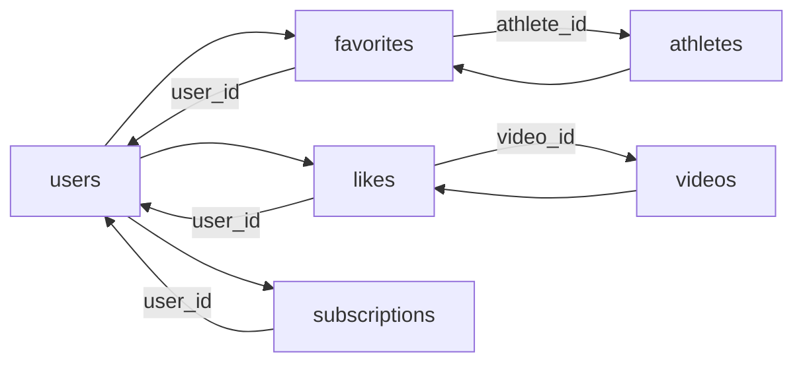

# Favorite and Like Models

<cite>
**Referenced Files in This Document**
- [favorite.model.js](file://backend/models/favorite.model.js)
- [like.model.js](file://backend/models/like.model.js)
- [athlete.model.js](file://backend/models/athlete.model.js)
- [video.model.js](file://backend/models/video.model.js)
- [user.model.js](file://backend/models/user.model.js)
- [subscription.model.js](file://backend/models/subscription.model.js)
- [like.controller.js](file://backend/controllers/like.controller.js)
- [scout.controller.js](file://backend/controllers/scout.controller.js)
- [schema.sql](file://database/schema.sql)
</cite>

## Table of Contents
1. [Introduction](#introduction)
2. [Project Structure](#project-structure)
3. [Core Components](#core-components)
4. [Architecture Overview](#architecture-overview)
5. [Detailed Component Analysis](#detailed-component-analysis)
6. [Dependency Analysis](#dependency-analysis)
7. [Performance Considerations](#performance-considerations)
8. [Troubleshooting Guide](#troubleshooting-guide)
9. [Conclusion](#conclusion)
10. [Appendices](#appendices)

## Introduction
This document provides comprehensive data model documentation for the Favorite and Like models within the engagement tracking system. It explains the many-to-many relationships with athletes and videos, query optimization strategies, real-time preference updates, and the business logic for user engagement analytics. It also covers data access patterns for favorite management, like counting, recommendation algorithms, and privacy considerations for high-volume interactions.

## Project Structure
The engagement tracking system spans models, controllers, and database schema:
- Models encapsulate persistence logic for favorites, likes, athletes, videos, users, and subscriptions.
- Controllers orchestrate user actions and enforce access policies.
- The database schema defines tables, foreign keys, unique constraints, and indexes for optimal query performance.

**Diagram sources**
- [favorite.model.js:1-52](file://backend/models/favorite.model.js#L1-L52)
- [like.model.js:1-61](file://backend/models/like.model.js#L1-L61)
- [athlete.model.js:1-119](file://backend/models/athlete.model.js#L1-L119)
- [video.model.js:1-61](file://backend/models/video.model.js#L1-L61)
- [user.model.js:1-42](file://backend/models/user.model.js#L1-L42)
- [subscription.model.js:1-55](file://backend/models/subscription.model.js#L1-L55)
- [like.controller.js:1-75](file://backend/controllers/like.controller.js#L1-L75)
- [scout.controller.js:1-96](file://backend/controllers/scout.controller.js#L1-L96)
- [schema.sql:120-156](file://database/schema.sql#L120-L156)

**Section sources**
- [favorite.model.js:1-52](file://backend/models/favorite.model.js#L1-L52)
- [like.model.js:1-61](file://backend/models/like.model.js#L1-L61)
- [athlete.model.js:1-119](file://backend/models/athlete.model.js#L1-L119)
- [video.model.js:1-61](file://backend/models/video.model.js#L1-L61)
- [user.model.js:1-42](file://backend/models/user.model.js#L1-L42)
- [subscription.model.js:1-55](file://backend/models/subscription.model.js#L1-L55)
- [like.controller.js:1-75](file://backend/controllers/like.controller.js#L1-L75)
- [scout.controller.js:1-96](file://backend/controllers/scout.controller.js#L1-L96)
- [schema.sql:120-156](file://database/schema.sql#L120-L156)

## Core Components
- Favorite Model: Manages user-athlete preferences with create, find by user, find by user and athlete, and delete operations.
- Like Model: Manages user-video interactions with create, find by video, find by user and video, count by video, and delete operations.
- Athlete Model: Provides athlete profiles, search, and update capabilities.
- Video Model: Handles video records associated with athletes.
- User Model: Manages user accounts and authentication.
- Subscription Model: Enforces access control for premium features like favoriting and liking.

Key responsibilities:
- Enforce access policies via subscription checks.
- Maintain unique constraints to prevent duplicates.
- Provide efficient queries with indexed columns.

**Section sources**
- [favorite.model.js:3-49](file://backend/models/favorite.model.js#L3-L49)
- [like.model.js:3-58](file://backend/models/like.model.js#L3-L58)
- [athlete.model.js:34-86](file://backend/models/athlete.model.js#L34-L86)
- [video.model.js:18-38](file://backend/models/video.model.js#L18-L38)
- [user.model.js:4-38](file://backend/models/user.model.js#L4-L38)
- [subscription.model.js:29-40](file://backend/models/subscription.model.js#L29-L40)

## Architecture Overview
The Favorite and Like models form the backbone of user engagement tracking. They integrate with controllers to enforce access policies and with the database schema to ensure referential integrity and performance.

**Diagram sources**
- [favorite.model.js:3-49](file://backend/models/favorite.model.js#L3-L49)
- [like.model.js:3-58](file://backend/models/like.model.js#L3-L58)
- [athlete.model.js:34-115](file://backend/models/athlete.model.js#L34-L115)
- [video.model.js:18-58](file://backend/models/video.model.js#L18-L58)
- [user.model.js:4-38](file://backend/models/user.model.js#L4-L38)
- [subscription.model.js:3-51](file://backend/models/subscription.model.js#L3-L51)

## Detailed Component Analysis

### Favorite Model
The Favorite model manages user-athlete preferences with the following operations:
- Create: Inserts a new favorite record with user_id and athlete_id.
- Find by user: Retrieves all favorites for a user with athlete and user details.
- Find by user and athlete: Checks existence of a favorite relationship.
- Delete: Removes a favorite relationship.

**Diagram sources**
- [scout.controller.js:50-73](file://backend/controllers/scout.controller.js#L50-L73)
- [favorite.model.js:4-16](file://backend/models/favorite.model.js#L4-L16)
- [subscription.model.js:29-40](file://backend/models/subscription.model.js#L29-L40)

**Section sources**
- [favorite.model.js:4-48](file://backend/models/favorite.model.js#L4-L48)
- [scout.controller.js:50-73](file://backend/controllers/scout.controller.js#L50-L73)

### Like Model
The Like model manages user-video interactions:
- Create: Inserts a like with user_id and video_id.
- Find by video: Retrieves likes with user names for a video.
- Find by user and video: Checks if a user liked a specific video.
- Count by video: Counts total likes for a video.
- Delete: Removes a like.

**Diagram sources**
- [like.controller.js:4-30](file://backend/controllers/like.controller.js#L4-L30)
- [like.model.js:4-47](file://backend/models/like.model.js#L4-L47)
- [subscription.model.js:29-40](file://backend/models/subscription.model.js#L29-L40)

**Section sources**
- [like.model.js:4-57](file://backend/models/like.model.js#L4-L57)
- [like.controller.js:4-30](file://backend/controllers/like.controller.js#L4-L30)

### Data Access Patterns and Query Optimization
- Unique constraints: Prevent duplicate favorites and likes.
- Indexed columns: favorites(user_id), favorites(athlete_id), likes(user_id), likes(video_id) improve query performance.
- JOIN queries: Retrieve related data efficiently (e.g., favorite details with athlete and user info).

**Diagram sources**
- [scout.controller.js:50-73](file://backend/controllers/scout.controller.js#L50-L73)
- [favorite.model.js:31-37](file://backend/models/favorite.model.js#L31-L37)
- [favorite.model.js:4-16](file://backend/models/favorite.model.js#L4-L16)

**Section sources**
- [schema.sql:120-156](file://database/schema.sql#L120-L156)
- [scout.controller.js:50-73](file://backend/controllers/scout.controller.js#L50-L73)
- [favorite.model.js:31-37](file://backend/models/favorite.model.js#L31-L37)

### Recommendation Algorithms and Engagement Analytics
- Recommendation basis: Use favorite relationships and like counts to infer user preferences.
- Analytics: Aggregate like counts per video and favorite counts per athlete to drive insights.
- Enhancement: Combine favorite and like data with athlete attributes (sport, category, state, position) for targeted recommendations.

[No sources needed since this section provides general guidance]

### Business Logic for Preference Aggregation and Scout Convenience
- Access control: Premium features require active subscriptions.
- Preference aggregation: Favorites and likes inform personalized feeds.
- Scout convenience: Favoriting athletes streamlines search and contact workflows.

**Section sources**
- [subscription.model.js:29-40](file://backend/models/subscription.model.js#L29-L40)
- [scout.controller.js:6-21](file://backend/controllers/scout.controller.js#L6-L21)
- [like.controller.js:9-12](file://backend/controllers/like.controller.js#L9-L12)

### Data Lifecycle for Engagement Tracking
- Creation: Users create favorites and likes after meeting access criteria.
- Persistence: Unique constraints ensure data integrity.
- Retrieval: Efficient queries leverage indexes for quick access.
- Deletion: Removing favorites and likes updates user preferences and analytics.

**Section sources**
- [favorite.model.js:4-48](file://backend/models/favorite.model.js#L4-L48)
- [like.model.js:4-57](file://backend/models/like.model.js#L4-L57)
- [schema.sql:120-156](file://database/schema.sql#L120-L156)

### Privacy Considerations
- Access control: Only authenticated users with active subscriptions can engage with favorites and likes.
- Data visibility: Queries join with users and athletes to provide contextual information while respecting privacy boundaries.

**Section sources**
- [subscription.model.js:29-40](file://backend/models/subscription.model.js#L29-L40)
- [like.controller.js:9-12](file://backend/controllers/like.controller.js#L9-L12)
- [scout.controller.js:55-58](file://backend/controllers/scout.controller.js#L55-L58)

## Dependency Analysis
The Favorite and Like models depend on:
- Users: Foreign keys ensure referential integrity.
- Athletes/Videos: Many-to-one relationships define engagement targets.
- Subscriptions: Access control enforcement.

**Diagram sources**
- [schema.sql:120-156](file://database/schema.sql#L120-L156)

**Section sources**
- [schema.sql:120-156](file://database/schema.sql#L120-L156)
- [favorite.model.js:18-28](file://backend/models/favorite.model.js#L18-L28)
- [like.model.js:18-27](file://backend/models/like.model.js#L18-L27)

## Performance Considerations
- Indexes: Favorited and liked records are indexed on user_id and target identifiers to accelerate lookups.
- Unique constraints: Prevent duplicate entries and reduce write overhead.
- Query patterns: Use targeted queries with joins to minimize data transfer and computation.

**Section sources**
- [schema.sql:140-156](file://database/schema.sql#L140-L156)
- [favorite.model.js:18-28](file://backend/models/favorite.model.js#L18-L28)
- [like.model.js:18-27](file://backend/models/like.model.js#L18-L27)

## Troubleshooting Guide
Common issues and resolutions:
- Duplicate favorite/like: Ensure existence checks are performed before insertions.
- Access denied: Verify active subscription status before allowing engagement actions.
- Missing data: Confirm JOIN conditions and indexed columns are used in queries.

**Section sources**
- [favorite.model.js:31-37](file://backend/models/favorite.model.js#L31-L37)
- [like.model.js:30-36](file://backend/models/like.model.js#L30-L36)
- [like.controller.js:14-17](file://backend/controllers/like.controller.js#L14-L17)
- [scout.controller.js:60-63](file://backend/controllers/scout.controller.js#L60-L63)

## Conclusion
The Favorite and Like models provide a robust foundation for user engagement tracking. They enforce access controls, maintain data integrity via unique constraints, and support efficient queries through strategic indexing. Together with controllers and the database schema, they enable real-time preference updates, recommendation enhancements, and scalable engagement analytics.

## Appendices

### Example Workflows
- Favorite management workflow:
  - Check active subscription.
  - Verify no existing favorite.
  - Insert favorite record.
  - Return success response.

- Like counting mechanism:
  - Insert like record.
  - Perform count query for the target video.
  - Return updated count.

- Engagement-based search enhancements:
  - Use favorite and like data to weight search results.
  - Combine with athlete attributes for refined recommendations.

[No sources needed since this section provides general guidance]