# Subscription Model

<cite>
**Referenced Files in This Document**
- [subscription.model.js](file://backend/models/subscription.model.js)
- [payment.controller.js](file://backend/controllers/payment.controller.js)
- [club.controller.js](file://backend/controllers/club.controller.js)
- [payment.routes.js](file://backend/routes/payment.routes.js)
- [club.routes.js](file://backend/routes/club.routes.js)
- [auth.middleware.js](file://backend/middleware/auth.middleware.js)
- [user.model.js](file://backend/models/user.model.js)
- [schema.sql](file://database/schema.sql)
- [admin.controller.js](file://backend/controllers/admin.controller.js)
- [admin.routes.js](file://backend/routes/admin.routes.js)
- [server.js](file://backend/server.js)
- [api.js](file://frontend/src/services/api.js)
- [ClubPlans.jsx](file://frontend/src/pages/ClubPlans.jsx)
</cite>

## Table of Contents
1. [Introduction](#introduction)
2. [Project Structure](#project-structure)
3. [Core Components](#core-components)
4. [Architecture Overview](#architecture-overview)
5. [Detailed Component Analysis](#detailed-component-analysis)
6. [Dependency Analysis](#dependency-analysis)
7. [Performance Considerations](#performance-considerations)
8. [Troubleshooting Guide](#troubleshooting-guide)
9. [Conclusion](#conclusion)

## Introduction
This document provides comprehensive data model documentation for the Subscription entity. It covers the subscription structure, plan types, billing cycles, payment status, access control mechanisms, and integration points with payment processing. It also explains subscription lifecycle management, renewal automation considerations, query methods for tracking and access checks, data access patterns, billing reconciliation processes, and relationships with user accounts. Business logic for subscription tiers, feature limitations, and revenue tracking is documented alongside practical examples of subscription purchase workflows, payment confirmation processes, and access grant mechanisms.

## Project Structure
The subscription system spans backend models, controllers, routes, middleware, and database schema. Frontend components integrate with the backend via authenticated requests and token-based authorization.

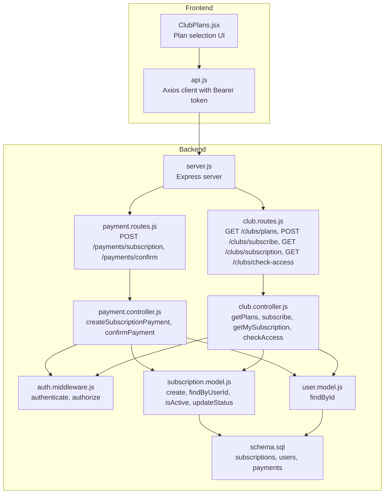

**Diagram sources**
- [server.js:1-40](file://backend/server.js#L1-L40)
- [payment.routes.js:1-13](file://backend/routes/payment.routes.js#L1-L13)
- [club.routes.js:1-12](file://backend/routes/club.routes.js#L1-L12)
- [payment.controller.js:1-108](file://backend/controllers/payment.controller.js#L1-L108)
- [club.controller.js:1-99](file://backend/controllers/club.controller.js#L1-L99)
- [auth.middleware.js:1-59](file://backend/middleware/auth.middleware.js#L1-L59)
- [subscription.model.js:1-55](file://backend/models/subscription.model.js#L1-L55)
- [user.model.js:1-42](file://backend/models/user.model.js#L1-L42)
- [schema.sql:90-118](file://database/schema.sql#L90-L118)

**Section sources**
- [server.js:1-40](file://backend/server.js#L1-L40)
- [payment.routes.js:1-13](file://backend/routes/payment.routes.js#L1-L13)
- [club.routes.js:1-12](file://backend/routes/club.routes.js#L1-L12)
- [schema.sql:90-118](file://database/schema.sql#L90-L118)

## Core Components
- Subscription model: encapsulates persistence and queries for subscription records, including creation, retrieval by user, active status verification, and status updates.
- Payment controller: orchestrates subscription payment initiation and confirmation, including plan validation, expiration calculation, and subscription record creation.
- Club controller: exposes plan catalog, subscription creation endpoint, subscription retrieval, and access checks for authorized user types.
- Authentication middleware: enforces bearer token authentication and role-based authorization for protected endpoints.
- Database schema: defines the subscriptions table, payments table, and supporting indexes and triggers.

**Section sources**
- [subscription.model.js:1-55](file://backend/models/subscription.model.js#L1-L55)
- [payment.controller.js:1-108](file://backend/controllers/payment.controller.js#L1-L108)
- [club.controller.js:1-99](file://backend/controllers/club.controller.js#L1-L99)
- [auth.middleware.js:1-59](file://backend/middleware/auth.middleware.js#L1-L59)
- [schema.sql:90-118](file://database/schema.sql#L90-L118)

## Architecture Overview
The subscription lifecycle integrates frontend UI, backend routes, controllers, models, and database. Payment initiation and confirmation are handled by the payment controller, while access control is enforced by the authentication middleware. Subscription records are persisted to the database and queried by the subscription model.

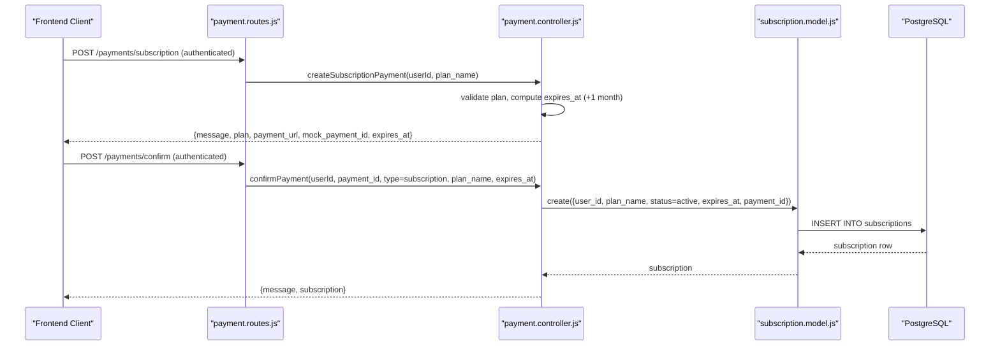

**Diagram sources**
- [payment.routes.js:8-10](file://backend/routes/payment.routes.js#L8-L10)
- [payment.controller.js:53-77](file://backend/controllers/payment.controller.js#L53-L77)
- [payment.controller.js:79-107](file://backend/controllers/payment.controller.js#L79-L107)
- [subscription.model.js:4-16](file://backend/models/subscription.model.js#L4-L16)
- [schema.sql:90-101](file://database/schema.sql#L90-L101)

## Detailed Component Analysis

### Subscription Data Model
The subscription entity is represented by the subscriptions table with the following attributes:
- id: primary key
- user_id: foreign key to users
- plan_name: identifies the subscribed plan
- status: active, cancelled, expired
- expires_at: timestamp when the subscription expires
- payment_id: identifier for the associated payment
- created_at, updated_at: timestamps managed by triggers

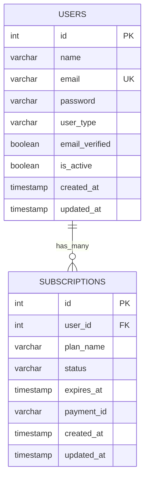

**Diagram sources**
- [schema.sql:14-24](file://database/schema.sql#L14-L24)
- [schema.sql:90-101](file://database/schema.sql#L90-L101)

**Section sources**
- [schema.sql:90-101](file://database/schema.sql#L90-L101)

### Subscription Model Methods
- create(subscriptionData): inserts a new subscription record and returns the created row.
- findByUserId(userId): retrieves the most recent subscription for a user.
- isActive(userId): checks if a subscription exists, is active, and not expired.
- updateStatus(id, status): updates the status of a subscription and returns the updated row.

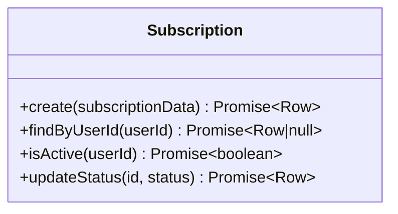

**Diagram sources**
- [subscription.model.js:3-52](file://backend/models/subscription.model.js#L3-L52)

**Section sources**
- [subscription.model.js:4-51](file://backend/models/subscription.model.js#L4-L51)

### Payment Controller: Subscription Purchase Workflow
The payment controller manages subscription payment initiation and confirmation:
- createSubscriptionPayment: validates plan, computes expires_at (+1 month), and returns a mock payment response with payment_url and mock_payment_id.
- confirmPayment: upon receiving payment confirmation, creates a subscription record with status active and returns the subscription.

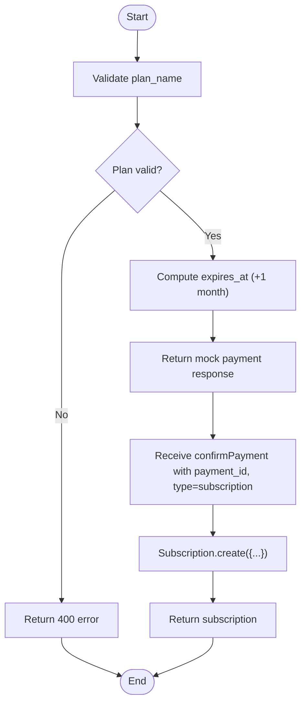

**Diagram sources**
- [payment.controller.js:53-77](file://backend/controllers/payment.controller.js#L53-L77)
- [payment.controller.js:79-107](file://backend/controllers/payment.controller.js#L79-L107)
- [subscription.model.js:4-16](file://backend/models/subscription.model.js#L4-L16)

**Section sources**
- [payment.controller.js:53-77](file://backend/controllers/payment.controller.js#L53-L77)
- [payment.controller.js:79-107](file://backend/controllers/payment.controller.js#L79-L107)

### Access Control and Authorization
Access control is enforced via middleware:
- authenticate: verifies JWT, attaches userId and user object to request.
- authorize: restricts endpoints to specific user types (e.g., club, scout).
- Routes enforce authentication and authorization for subscription-related endpoints.

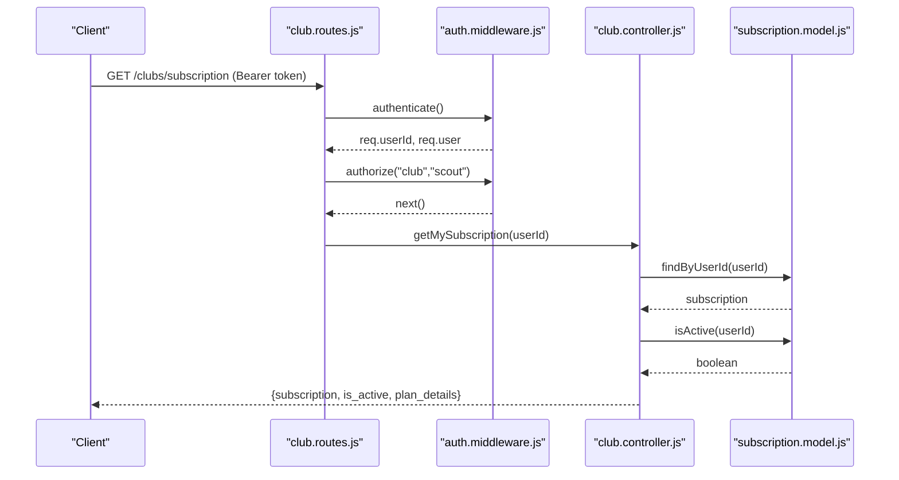

**Diagram sources**
- [club.routes.js:7-9](file://backend/routes/club.routes.js#L7-L9)
- [auth.middleware.js:4-42](file://backend/middleware/auth.middleware.js#L4-L42)
- [club.controller.js:45-64](file://backend/controllers/club.controller.js#L45-L64)
- [subscription.model.js:18-40](file://backend/models/subscription.model.js#L18-L40)

**Section sources**
- [auth.middleware.js:4-42](file://backend/middleware/auth.middleware.js#L4-L42)
- [club.routes.js:7-9](file://backend/routes/club.routes.js#L7-L9)
- [club.controller.js:45-74](file://backend/controllers/club.controller.js#L45-L74)

### Subscription Lifecycle Management
Lifecycle stages:
- Initiation: plan selection and payment initiation via payment controller.
- Confirmation: payment confirmation triggers subscription creation with status active.
- Active Period: isActive checks ensure access during active and unexpired period.
- Renewal Automation: current implementation sets expires_at to +1 month; renewal automation is not implemented in code.
- Cancellation/Expiration: status can be updated via updateStatus; expired subscriptions are excluded from active checks.

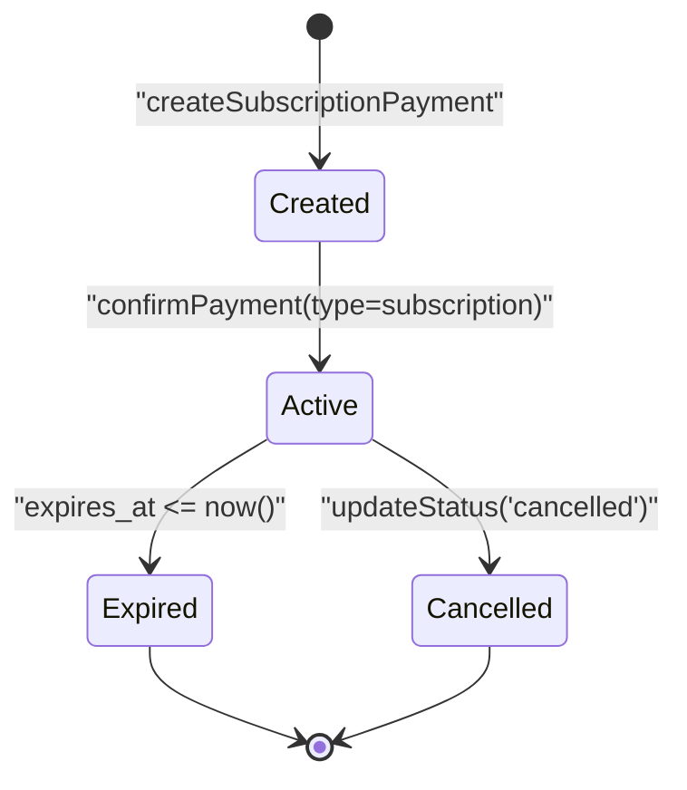

**Diagram sources**
- [payment.controller.js:79-107](file://backend/controllers/payment.controller.js#L79-L107)
- [subscription.model.js:42-51](file://backend/models/subscription.model.js#L42-L51)
- [subscription.model.js:29-40](file://backend/models/subscription.model.js#L29-L40)

**Section sources**
- [payment.controller.js:64-65](file://backend/controllers/payment.controller.js#L64-L65)
- [subscription.model.js:29-40](file://backend/models/subscription.model.js#L29-L40)
- [subscription.model.js:42-51](file://backend/models/subscription.model.js#L42-L51)

### Query Methods and Access Checks
- findByUserId(userId): returns latest subscription for a user.
- isActive(userId): determines if a subscription is active and not expired.
- checkAccess endpoint: returns has_access boolean for authenticated users.

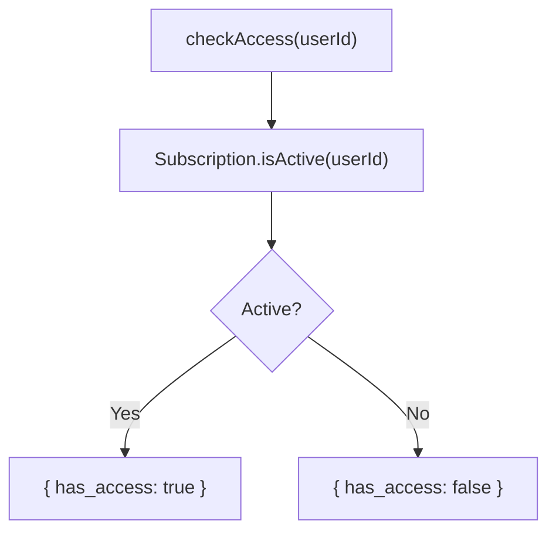

**Diagram sources**
- [club.controller.js:66-74](file://backend/controllers/club.controller.js#L66-L74)
- [subscription.model.js:29-40](file://backend/models/subscription.model.js#L29-L40)

**Section sources**
- [club.controller.js:45-74](file://backend/controllers/club.controller.js#L45-L74)
- [subscription.model.js:18-40](file://backend/models/subscription.model.js#L18-L40)

### Data Access Patterns and Billing Reconciliation
- Data access patterns:
  - Payment controller reads plan definitions and writes subscription records.
  - Controllers query subscriptions via subscription model.
  - Admin controller queries subscriptions for reporting.
- Billing reconciliation:
  - Current schema includes a payments table with fields for type, amount, currency, status, and external identifiers.
  - Payment confirmation currently stores payment_id in subscriptions; reconciliation could leverage payments table for audit trails and revenue tracking.

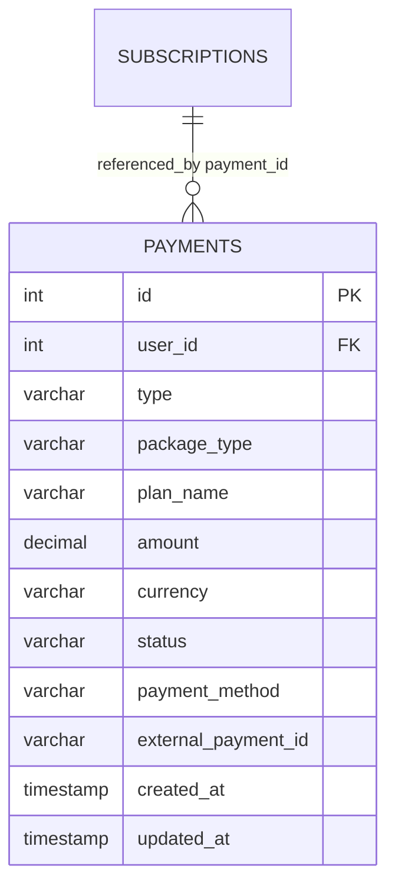

**Diagram sources**
- [schema.sql:103-118](file://database/schema.sql#L103-L118)
- [schema.sql:90-101](file://database/schema.sql#L90-L101)

**Section sources**
- [schema.sql:103-118](file://database/schema.sql#L103-L118)
- [payment.controller.js:84-96](file://backend/controllers/payment.controller.js#L84-L96)

### Relationship with User Accounts
- Subscriptions belong to users via user_id foreign key.
- Authentication middleware resolves user identity for subscription operations.
- Admin dashboard aggregates subscription data joined with user details.

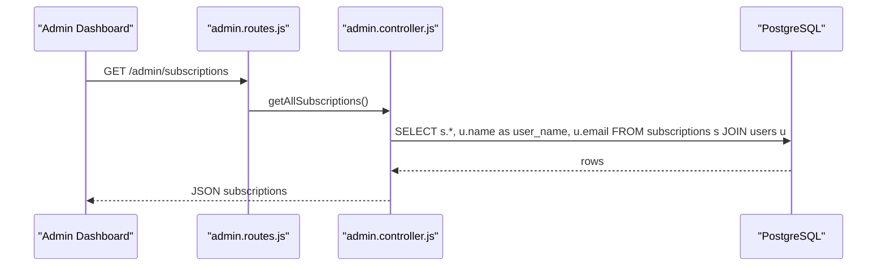

**Diagram sources**
- [admin.routes.js:9](file://backend/routes/admin.routes.js#L9)
- [admin.controller.js:63-76](file://backend/controllers/admin.controller.js#L63-L76)
- [schema.sql:90-101](file://database/schema.sql#L90-L101)

**Section sources**
- [admin.controller.js:63-76](file://backend/controllers/admin.controller.js#L63-L76)
- [auth.middleware.js:17-23](file://backend/middleware/auth.middleware.js#L17-L23)

### Business Logic for Subscription Tiers and Feature Limitations
- Plan definitions are maintained in controllers:
  - scout_basic: basic scouting features.
  - scout_pro: advanced search, unlimited favorites, direct contact, priority support.
  - elite_club: exclusive dashboard, custom reports, API integration, dedicated account manager, 24/7 support.
- Feature limitations are enforced by access checks; only active subscribers can access premium features.

**Section sources**
- [payment.controller.js:9-13](file://backend/controllers/payment.controller.js#L9-L13)
- [club.controller.js:5-9](file://backend/controllers/club.controller.js#L5-L9)
- [club.controller.js:66-74](file://backend/controllers/club.controller.js#L66-L74)

### Revenue Tracking
- Revenue tracking can be derived from the payments table by aggregating completed transactions.
- Subscription creation records payment_id; reconciling against payments table enables revenue validation.

**Section sources**
- [schema.sql:103-118](file://database/schema.sql#L103-L118)
- [payment.controller.js:84-96](file://backend/controllers/payment.controller.js#L84-L96)

### Frontend Integration Examples
- Plan selection: frontend fetches plans from backend and renders plan cards.
- Authentication: frontend injects Bearer token for authenticated endpoints.
- Subscription access: frontend can call check-access to gate premium features.

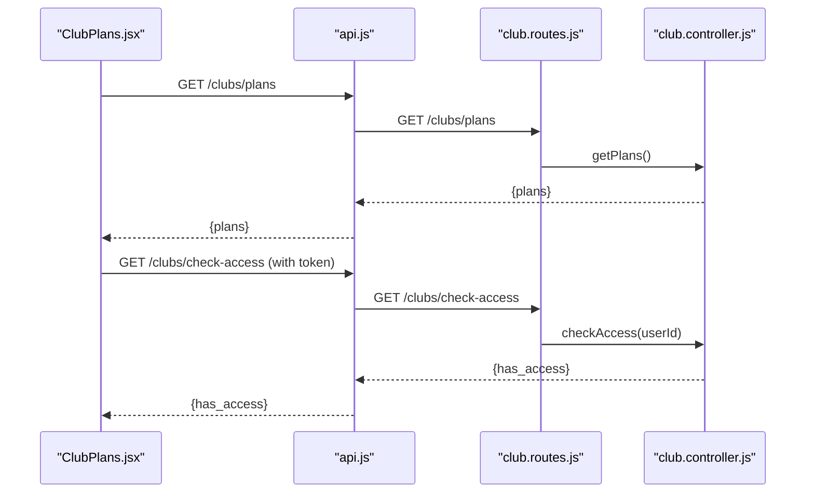

**Diagram sources**
- [ClubPlans.jsx:21-30](file://frontend/src/pages/ClubPlans.jsx#L21-L30)
- [api.js:10-21](file://frontend/src/services/api.js#L10-L21)
- [club.routes.js:9](file://backend/routes/club.routes.js#L9)
- [club.controller.js:66-74](file://backend/controllers/club.controller.js#L66-L74)

**Section sources**
- [ClubPlans.jsx:21-30](file://frontend/src/pages/ClubPlans.jsx#L21-L30)
- [api.js:10-21](file://frontend/src/services/api.js#L10-L21)
- [club.controller.js:11-17](file://backend/controllers/club.controller.js#L11-L17)

## Dependency Analysis
- Controllers depend on models for data access.
- Routes depend on controllers for business logic.
- Middleware depends on user model for user resolution.
- Models depend on database connection pool.
- Frontend depends on backend APIs and authentication tokens.

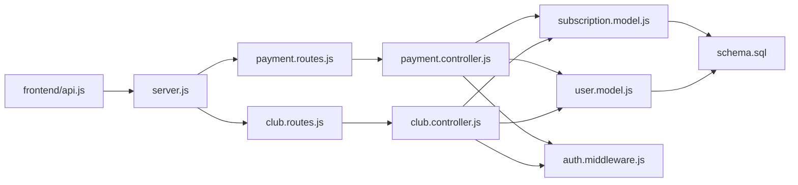

**Diagram sources**
- [server.js:1-40](file://backend/server.js#L1-L40)
- [payment.routes.js:1-13](file://backend/routes/payment.routes.js#L1-L13)
- [club.routes.js:1-12](file://backend/routes/club.routes.js#L1-L12)
- [payment.controller.js:1-108](file://backend/controllers/payment.controller.js#L1-L108)
- [club.controller.js:1-99](file://backend/controllers/club.controller.js#L1-L99)
- [auth.middleware.js:1-59](file://backend/middleware/auth.middleware.js#L1-L59)
- [subscription.model.js:1-55](file://backend/models/subscription.model.js#L1-L55)
- [user.model.js:1-42](file://backend/models/user.model.js#L1-L42)
- [schema.sql:90-118](file://database/schema.sql#L90-L118)

**Section sources**
- [server.js:1-40](file://backend/server.js#L1-L40)
- [payment.routes.js:1-13](file://backend/routes/payment.routes.js#L1-L13)
- [club.routes.js:1-12](file://backend/routes/club.routes.js#L1-L12)
- [subscription.model.js:1-55](file://backend/models/subscription.model.js#L1-L55)
- [user.model.js:1-42](file://backend/models/user.model.js#L1-L42)

## Performance Considerations
- Indexes on subscriptions (user_id, status) improve query performance for findByUserId and isActive checks.
- Triggers update updated_at automatically, ensuring audit trail consistency.
- Consider adding a scheduled job for periodic subscription status updates to handle expiration and renewal automation.

[No sources needed since this section provides general guidance]

## Troubleshooting Guide
- Authentication failures: ensure Bearer token is present and valid; verify JWT_SECRET environment variable.
- Authorization failures: confirm user_type matches required roles (club, scout).
- Subscription not found: verify user has a recent subscription; check findByUserId query results.
- Access denied: ensure isActive returns true and subscription is not expired.
- Payment confirmation errors: validate payment_id and type; ensure plan_name exists in plan definitions.

**Section sources**
- [auth.middleware.js:4-42](file://backend/middleware/auth.middleware.js#L4-L42)
- [club.controller.js:45-74](file://backend/controllers/club.controller.js#L45-L74)
- [payment.controller.js:79-107](file://backend/controllers/payment.controller.js#L79-L107)

## Conclusion
The subscription system provides a clear data model and robust access control around subscription lifecycle management. Payment initiation and confirmation are integrated via controllers and models, with authentication middleware enforcing secure access. While the current implementation supports plan definitions and access checks, renewal automation and comprehensive billing reconciliation are not yet implemented in code and represent opportunities for future enhancement.