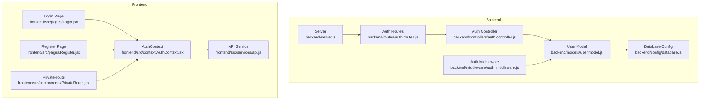
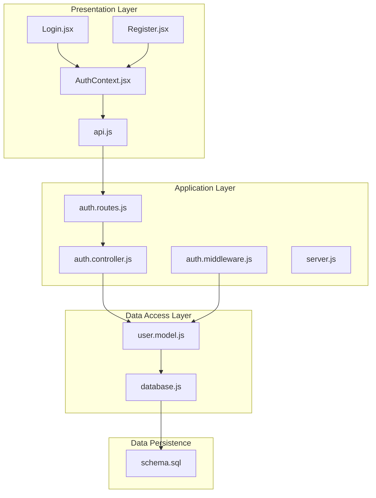
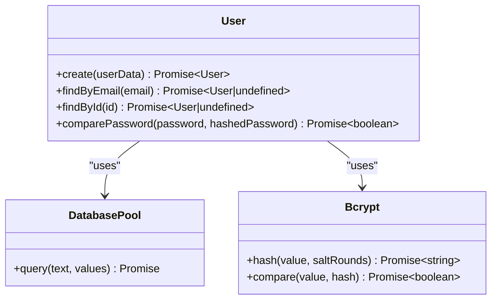
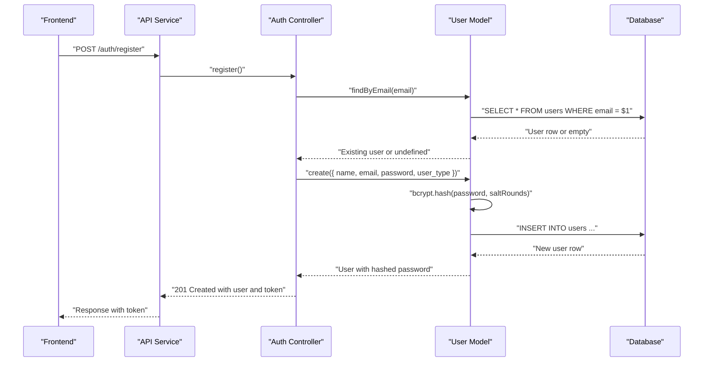
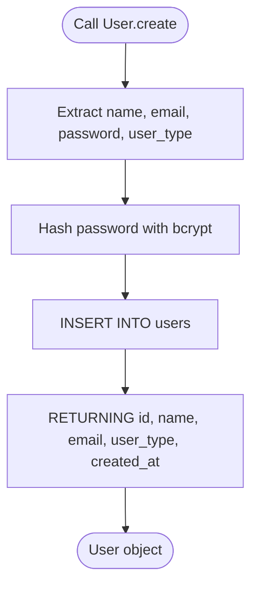
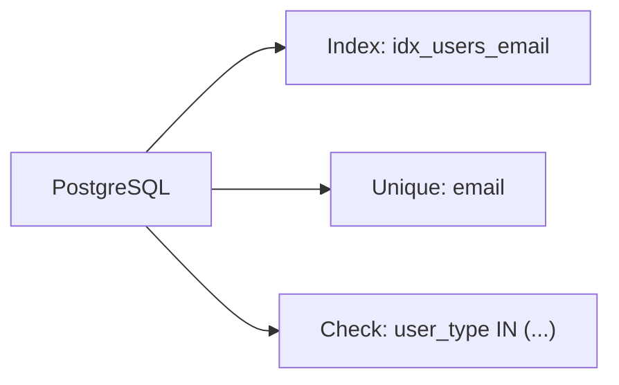
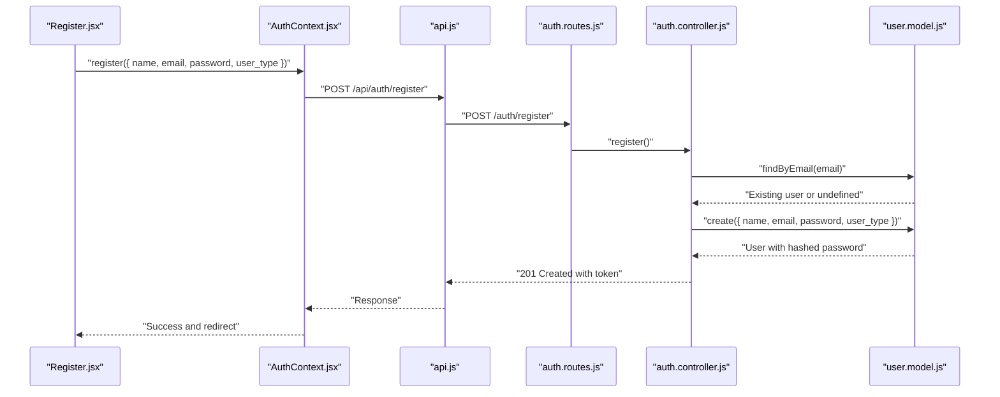
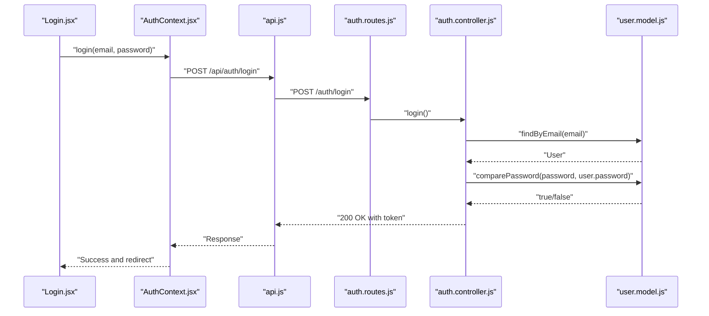
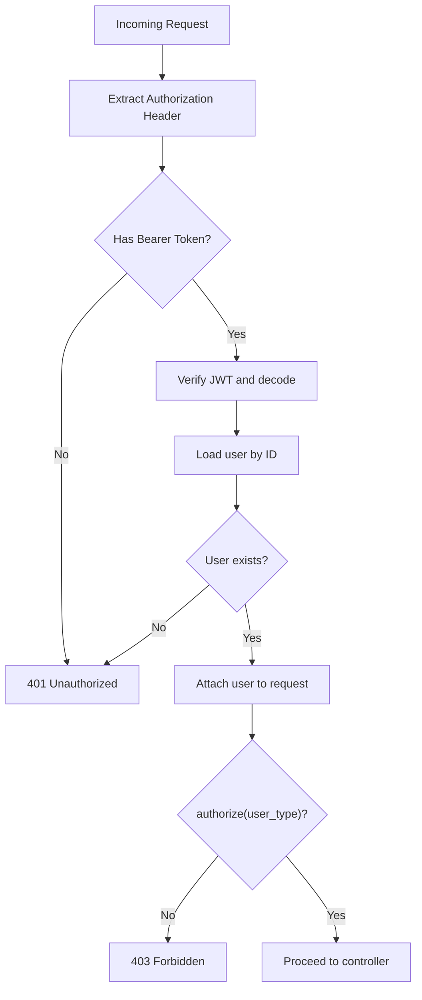
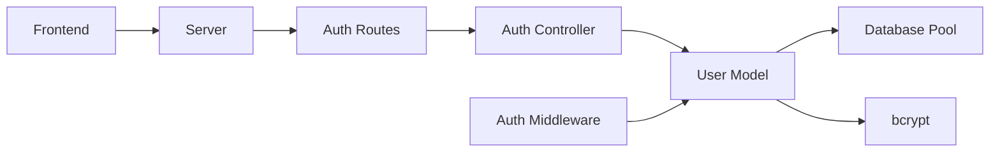

# User Model

<cite>
**Referenced Files in This Document**
- [user.model.js](file://backend/models/user.model.js)
- [auth.controller.js](file://backend/controllers/auth.controller.js)
- [auth.middleware.js](file://backend/middleware/auth.middleware.js)
- [database.js](file://backend/config/database.js)
- [schema.sql](file://database/schema.sql)
- [auth.routes.js](file://backend/routes/auth.routes.js)
- [server.js](file://backend/server.js)
- [AuthContext.jsx](file://frontend/src/context/AuthContext.jsx)
- [api.js](file://frontend/src/services/api.js)
- [Login.jsx](file://frontend/src/pages/Login.jsx)
- [Register.jsx](file://frontend/src/pages/Register.jsx)
- [PrivateRoute.jsx](file://frontend/src/components/PrivateRoute.jsx)
- [admin.routes.js](file://backend/routes/admin.routes.js)
</cite>

## Table of Contents
1. [Introduction](#introduction)
2. [Project Structure](#project-structure)
3. [Core Components](#core-components)
4. [Architecture Overview](#architecture-overview)
5. [Detailed Component Analysis](#detailed-component-analysis)
6. [Dependency Analysis](#dependency-analysis)
7. [Performance Considerations](#performance-considerations)
8. [Troubleshooting Guide](#troubleshooting-guide)
9. [Conclusion](#conclusion)

## Introduction
This document provides comprehensive data model documentation for the User entity, focusing on the backend User model implementation, authentication mechanisms, role-based access control, and data access patterns. It also covers connection pooling, query optimization strategies, and security considerations for password handling. Practical examples illustrate user registration workflows, login processes, and role verification procedures.

## Project Structure
The User model resides in the backend models directory and integrates with controllers, middleware, routing, and database configuration. The frontend provides authentication context and API integration for client-side flows.

**Diagram sources**
- [user.model.js:1-42](file://backend/models/user.model.js#L1-L42)
- [auth.controller.js:1-72](file://backend/controllers/auth.controller.js#L1-L72)
- [auth.middleware.js:1-59](file://backend/middleware/auth.middleware.js#L1-L59)
- [database.js:1-13](file://backend/config/database.js#L1-L13)
- [server.js:1-40](file://backend/server.js#L1-L40)
- [auth.routes.js:1-11](file://backend/routes/auth.routes.js#L1-L11)
- [AuthContext.jsx:1-91](file://frontend/src/context/AuthContext.jsx#L1-L91)
- [api.js:1-36](file://frontend/src/services/api.js#L1-L36)
- [Login.jsx:1-45](file://frontend/src/pages/Login.jsx#L1-L45)
- [Register.jsx:38-91](file://frontend/src/pages/Register.jsx#L38-L91)
- [PrivateRoute.jsx:1-26](file://frontend/src/components/PrivateRoute.jsx#L1-L26)

**Section sources**
- [user.model.js:1-42](file://backend/models/user.model.js#L1-L42)
- [auth.controller.js:1-72](file://backend/controllers/auth.controller.js#L1-L72)
- [auth.middleware.js:1-59](file://backend/middleware/auth.middleware.js#L1-L59)
- [database.js:1-13](file://backend/config/database.js#L1-L13)
- [server.js:1-40](file://backend/server.js#L1-L40)
- [auth.routes.js:1-11](file://backend/routes/auth.routes.js#L1-L11)
- [AuthContext.jsx:1-91](file://frontend/src/context/AuthContext.jsx#L1-L91)
- [api.js:1-36](file://frontend/src/services/api.js#L1-L36)
- [Login.jsx:1-45](file://frontend/src/pages/Login.jsx#L1-L45)
- [Register.jsx:38-91](file://frontend/src/pages/Register.jsx#L38-L91)
- [PrivateRoute.jsx:1-26](file://frontend/src/components/PrivateRoute.jsx#L1-L26)

## Core Components
The User model encapsulates user data access and authentication-related operations. It interacts with a PostgreSQL database via a connection pool and uses bcrypt for password hashing.

Key responsibilities:
- Password hashing during user creation
- Email-based lookup and ID-based retrieval
- Password comparison for authentication
- Integration with JWT-based authentication middleware

Fields exposed by the User model:
- id: integer (auto-generated)
- name: string (non-empty)
- email: string (unique, non-empty)
- password: string (hashed)
- user_type: enum-like string constrained to specific roles
- created_at: timestamp (default current timestamp)

Validation rules enforced at the database level:
- NOT NULL constraints on name, email, password, user_type
- UNIQUE constraint on email
- CHECK constraint ensuring user_type belongs to a predefined set
- Default timestamps for created_at and updated_at

Business logic highlights:
- Password hashing performed with bcrypt at a fixed cost factor
- Authentication compares plaintext password against stored hash
- Role-based access control leverages user_type for authorization decisions

Security considerations:
- Passwords are never stored in plaintext; bcrypt handles hashing
- JWT tokens are signed server-side and validated on each request
- Frontend stores tokens and user data in local storage and sets Authorization headers

**Section sources**
- [user.model.js:4-38](file://backend/models/user.model.js#L4-L38)
- [schema.sql:14-24](file://database/schema.sql#L14-L24)
- [auth.controller.js:8-28](file://backend/controllers/auth.controller.js#L8-L28)
- [auth.controller.js:30-59](file://backend/controllers/auth.controller.js#L30-L59)
- [auth.middleware.js:4-42](file://backend/middleware/auth.middleware.js#L4-L42)
- [AuthContext.jsx:21-57](file://frontend/src/context/AuthContext.jsx#L21-L57)

## Architecture Overview
The User model participates in a layered architecture:
- Presentation layer (frontend): Login and Registration pages, AuthContext, and API service
- Application layer (backend): Controllers and middleware orchestrate requests
- Data access layer (backend): User model and database configuration
- Data persistence (PostgreSQL): Schema defines constraints and indexes

**Diagram sources**
- [Login.jsx:1-45](file://frontend/src/pages/Login.jsx#L1-L45)
- [Register.jsx:38-91](file://frontend/src/pages/Register.jsx#L38-L91)
- [AuthContext.jsx:1-91](file://frontend/src/context/AuthContext.jsx#L1-L91)
- [api.js:1-36](file://frontend/src/services/api.js#L1-L36)
- [auth.routes.js:1-11](file://backend/routes/auth.routes.js#L1-L11)
- [auth.controller.js:1-72](file://backend/controllers/auth.controller.js#L1-L72)
- [auth.middleware.js:1-59](file://backend/middleware/auth.middleware.js#L1-L59)
- [user.model.js:1-42](file://backend/models/user.model.js#L1-L42)
- [database.js:1-13](file://backend/config/database.js#L1-L13)
- [schema.sql:1-185](file://database/schema.sql#L1-L185)

## Detailed Component Analysis

### User Model Class
The User model exposes static methods for data access and authentication support:
- create(userData): Hashes password and inserts a new user record
- findByEmail(email): Retrieves a user by email
- findById(id): Retrieves a user by ID
- comparePassword(password, hashedPassword): Compares plaintext password with stored hash

**Diagram sources**
- [user.model.js:4-38](file://backend/models/user.model.js#L4-L38)

**Section sources**
- [user.model.js:4-38](file://backend/models/user.model.js#L4-L38)

### Authentication Methods
Password hashing and verification:
- Hashing: Passwords are hashed using bcrypt with a fixed cost factor before insertion
- Verification: Incoming passwords are compared against stored hashes using bcrypt.compare

Email uniqueness validation:
- Backend checks for existing users by email before registration
- Database enforces email uniqueness via a UNIQUE constraint

Role-based access control:
- Authorization middleware verifies user_type against allowed roles
- Admin-only routes enforce authorization for administrative actions

**Diagram sources**
- [auth.controller.js:8-28](file://backend/controllers/auth.controller.js#L8-L28)
- [user.model.js:5-18](file://backend/models/user.model.js#L5-L18)
- [database.js:1-13](file://backend/config/database.js#L1-L13)

**Section sources**
- [auth.controller.js:8-28](file://backend/controllers/auth.controller.js#L8-L28)
- [user.model.js:5-18](file://backend/models/user.model.js#L5-L18)
- [schema.sql:17-17](file://database/schema.sql#L17-L17)

### Data Access Patterns
The User model implements three primary data access patterns:
- create(): Inserts a new user with hashed password and returns selected fields
- findByEmail(): Returns the complete user record for authentication
- findById(): Returns a subset of fields for profile and route protection

**Diagram sources**
- [user.model.js:5-18](file://backend/models/user.model.js#L5-L18)

**Section sources**
- [user.model.js:5-38](file://backend/models/user.model.js#L5-L38)

### Connection Pooling and Query Optimization
Connection pooling:
- The application uses a PostgreSQL connection pool configured in the database module
- Queries are executed through pool.query, enabling efficient reuse of connections

Indexing and constraints:
- Email indexing improves lookup performance for findByEmail
- Unique constraint on email prevents duplicates
- Check constraint on user_type ensures valid role values
- Timestamp triggers maintain updated_at automatically

**Diagram sources**
- [schema.sql:140-142](file://database/schema.sql#L140-L142)
- [schema.sql:17-19](file://database/schema.sql#L17-L19)
- [schema.sql:166-167](file://database/schema.sql#L166-L167)

**Section sources**
- [database.js:4-10](file://backend/config/database.js#L4-L10)
- [schema.sql:140-142](file://database/schema.sql#L140-L142)
- [schema.sql:17-19](file://database/schema.sql#L17-L19)
- [schema.sql:166-167](file://database/schema.sql#L166-L167)

### Security Considerations
Password handling:
- bcrypt is used for hashing with a fixed cost factor
- Stored passwords are never logged or exposed

Token-based authentication:
- JWT tokens are signed with a server-side secret and expire after a defined period
- Middleware validates tokens and attaches user context to requests

Frontend security:
- Tokens and user data are stored in local storage
- Authorization header is set for subsequent requests
- Unauthorized responses trigger automatic logout

**Section sources**
- [user.model.js:7-7](file://backend/models/user.model.js#L7-L7)
- [auth.controller.js:4-6](file://backend/controllers/auth.controller.js#L4-L6)
- [auth.middleware.js:14-14](file://backend/middleware/auth.middleware.js#L14-L14)
- [AuthContext.jsx:21-57](file://frontend/src/context/AuthContext.jsx#L21-L57)
- [api.js:10-33](file://frontend/src/services/api.js#L10-L33)

### Examples

#### User Registration Workflow
- Frontend collects name, email, password, and user_type
- Validation ensures password length and confirmation match
- AuthContext sends registration request to backend
- Controller checks for existing email, creates user, and generates JWT
- Frontend persists token and user data, redirects to appropriate dashboard

**Diagram sources**
- [Register.jsx:66-91](file://frontend/src/pages/Register.jsx#L66-L91)
- [AuthContext.jsx:40-57](file://frontend/src/context/AuthContext.jsx#L40-L57)
- [api.js:3-8](file://frontend/src/services/api.js#L3-L8)
- [auth.routes.js:6-6](file://backend/routes/auth.routes.js#L6-L6)
- [auth.controller.js:8-28](file://backend/controllers/auth.controller.js#L8-L28)
- [user.model.js:5-18](file://backend/models/user.model.js#L5-L18)

**Section sources**
- [Register.jsx:38-91](file://frontend/src/pages/Register.jsx#L38-L91)
- [AuthContext.jsx:40-57](file://frontend/src/context/AuthContext.jsx#L40-L57)
- [auth.controller.js:8-28](file://backend/controllers/auth.controller.js#L8-L28)
- [user.model.js:5-18](file://backend/models/user.model.js#L5-L18)

#### Login Process
- Frontend submits email and password
- AuthContext posts to login endpoint
- Controller retrieves user by email and compares password
- On success, JWT is generated and returned
- Frontend stores token and user data, navigates to dashboard

**Diagram sources**
- [Login.jsx:25-45](file://frontend/src/pages/Login.jsx#L25-L45)
- [AuthContext.jsx:21-38](file://frontend/src/context/AuthContext.jsx#L21-L38)
- [api.js:3-8](file://frontend/src/services/api.js#L3-L8)
- [auth.routes.js:7-7](file://backend/routes/auth.routes.js#L7-L7)
- [auth.controller.js:30-59](file://backend/controllers/auth.controller.js#L30-L59)
- [user.model.js:20-38](file://backend/models/user.model.js#L20-L38)

**Section sources**
- [Login.jsx:1-45](file://frontend/src/pages/Login.jsx#L1-L45)
- [AuthContext.jsx:21-38](file://frontend/src/context/AuthContext.jsx#L21-L38)
- [auth.controller.js:30-59](file://backend/controllers/auth.controller.js#L30-L59)
- [user.model.js:20-38](file://backend/models/user.model.js#L20-L38)

#### Role Verification Procedures
- Middleware authenticate extracts token, decodes it, and loads user by ID
- authorize middleware checks user_type against allowed roles
- Admin routes demonstrate enforcement for administrative actions

**Diagram sources**
- [auth.middleware.js:4-42](file://backend/middleware/auth.middleware.js#L4-L42)
- [admin.routes.js:6-12](file://backend/routes/admin.routes.js#L6-L12)

**Section sources**
- [auth.middleware.js:4-42](file://backend/middleware/auth.middleware.js#L4-L42)
- [admin.routes.js:6-12](file://backend/routes/admin.routes.js#L6-L12)

## Dependency Analysis
The User model depends on the database pool and bcrypt for password operations. Controllers depend on the User model for data access. Middleware depends on the User model for user resolution. Routes connect controllers to endpoints. The frontend depends on the backend for authentication and profile data.

**Diagram sources**
- [user.model.js:1-2](file://backend/models/user.model.js#L1-L2)
- [auth.controller.js:1-2](file://backend/controllers/auth.controller.js#L1-L2)
- [auth.middleware.js:1-2](file://backend/middleware/auth.middleware.js#L1-L2)
- [auth.routes.js:1-4](file://backend/routes/auth.routes.js#L1-L4)
- [server.js:5-11](file://backend/server.js#L5-L11)
- [AuthContext.jsx:1-2](file://frontend/src/context/AuthContext.jsx#L1-L2)

**Section sources**
- [user.model.js:1-2](file://backend/models/user.model.js#L1-L2)
- [auth.controller.js:1-2](file://backend/controllers/auth.controller.js#L1-L2)
- [auth.middleware.js:1-2](file://backend/middleware/auth.middleware.js#L1-L2)
- [auth.routes.js:1-4](file://backend/routes/auth.routes.js#L1-L4)
- [server.js:5-11](file://backend/server.js#L5-L11)
- [AuthContext.jsx:1-2](file://frontend/src/context/AuthContext.jsx#L1-L2)

## Performance Considerations
- Use indexes on frequently queried columns (e.g., users.email) to speed up lookups
- Limit SELECT fields in findById to reduce payload size
- Prefer bcrypt cost factors appropriate for deployment environment
- Monitor pool size and timeouts to prevent resource exhaustion under load

## Troubleshooting Guide
Common issues and resolutions:
- Duplicate email errors: Occur when email uniqueness is violated; ensure pre-registration checks are in place
- Invalid credentials: Verify email and password match stored hash; check bcrypt cost factor consistency
- Token expiration: Renew token or handle expired token errors gracefully
- Missing authorization: Confirm user_type matches required roles and middleware is applied

**Section sources**
- [auth.controller.js:12-15](file://backend/controllers/auth.controller.js#L12-L15)
- [auth.controller.js:34-42](file://backend/controllers/auth.controller.js#L34-L42)
- [auth.middleware.js:25-31](file://backend/middleware/auth.middleware.js#L25-L31)
- [user.model.js:7-7](file://backend/models/user.model.js#L7-L7)

## Conclusion
The User model provides a secure, efficient foundation for user management with robust authentication and authorization capabilities. By leveraging bcrypt for password hashing, JWT for sessionless authentication, and PostgreSQL constraints for data integrity, the system maintains strong security and predictable performance. The documented patterns enable consistent implementation of registration, login, and role verification across the application.