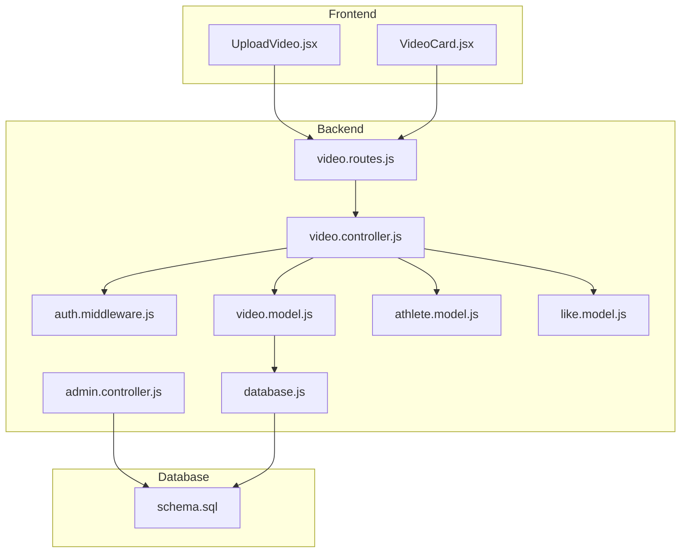
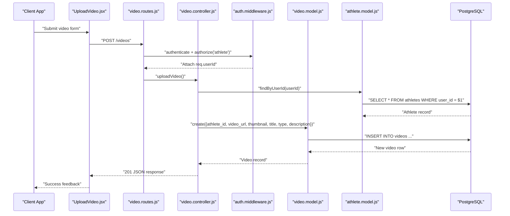
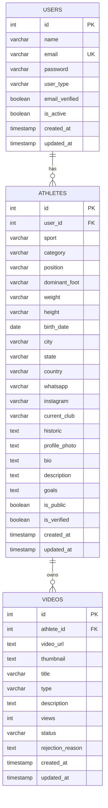
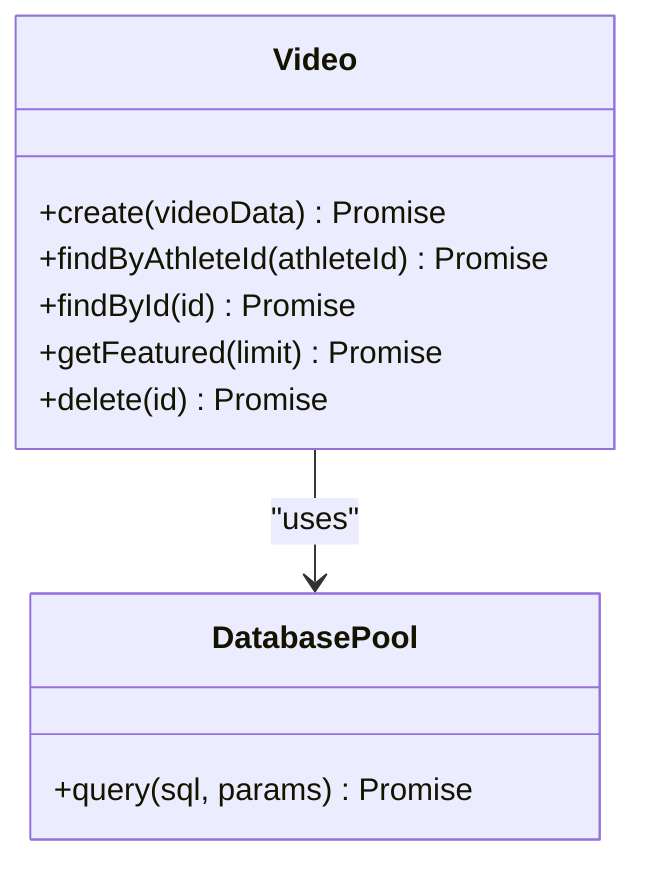
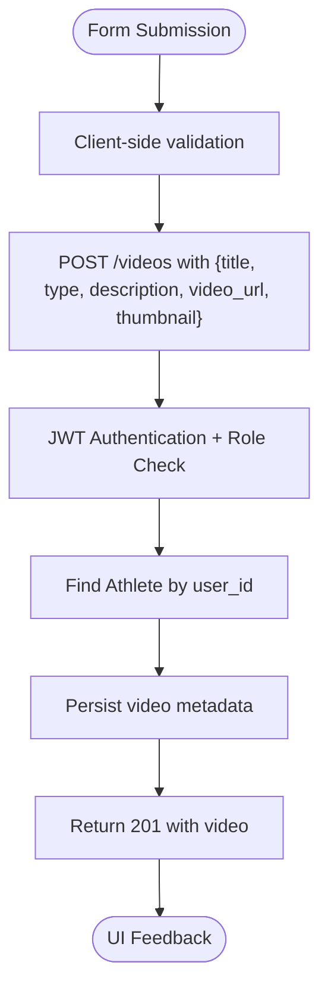
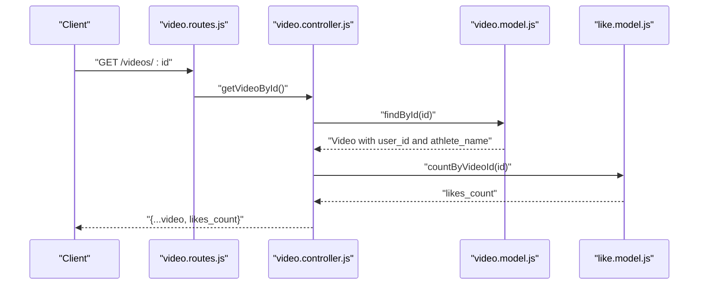
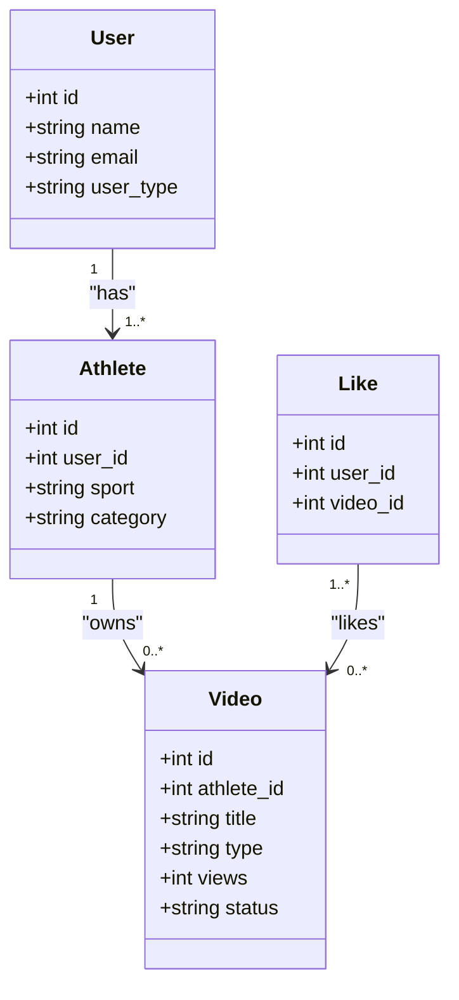
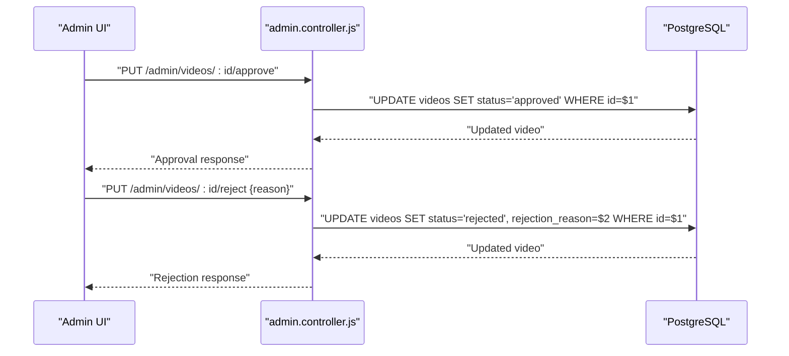
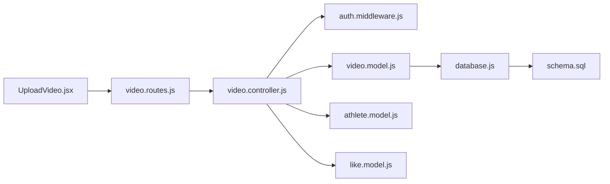

# Video Model

<cite>
**Referenced Files in This Document**
- [video.model.js](file://backend/models/video.model.js)
- [video.controller.js](file://backend/controllers/video.controller.js)
- [video.routes.js](file://backend/routes/video.routes.js)
- [schema.sql](file://database/schema.sql)
- [UploadVideo.jsx](file://frontend/src/pages/UploadVideo.jsx)
- [VideoCard.jsx](file://frontend/src/components/VideoCard.jsx)
- [admin.controller.js](file://backend/controllers/admin.controller.js)
- [auth.middleware.js](file://backend/middleware/auth.middleware.js)
- [athlete.model.js](file://backend/models/athlete.model.js)
- [like.model.js](file://backend/models/like.model.js)
- [database.js](file://backend/config/database.js)
</cite>

## Table of Contents
1. [Introduction](#introduction)
2. [Project Structure](#project-structure)
3. [Core Components](#core-components)
4. [Architecture Overview](#architecture-overview)
5. [Detailed Component Analysis](#detailed-component-analysis)
6. [Dependency Analysis](#dependency-analysis)
7. [Performance Considerations](#performance-considerations)
8. [Troubleshooting Guide](#troubleshooting-guide)
9. [Conclusion](#conclusion)

## Introduction
This document provides comprehensive data model documentation for the Video entity within the application. It covers the video entity structure, metadata fields, file management, and playback capabilities. It also documents the video upload workflow, Cloudinary integration, video processing pipeline, storage optimization, query methods for retrieval and search, playlist management, data access patterns, video statistics tracking, and relationships with athlete profiles. Security considerations for access control, file validation, and bandwidth optimization are included, along with practical examples of upload processes, playback integration, and content moderation workflows.

## Project Structure
The video system spans the backend models, controllers, routes, middleware, and the frontend UI components. The database schema defines the canonical structure for videos, including metadata, status tracking, and statistics. The frontend provides upload forms and video cards for presentation.

**Diagram sources**
- [video.routes.js:1-20](file://backend/routes/video.routes.js#L1-L20)
- [video.controller.js:1-111](file://backend/controllers/video.controller.js#L1-L111)
- [video.model.js:1-61](file://backend/models/video.model.js#L1-L61)
- [athlete.model.js:1-119](file://backend/models/athlete.model.js#L1-L119)
- [like.model.js:1-61](file://backend/models/like.model.js#L1-L61)
- [admin.controller.js:1-121](file://backend/controllers/admin.controller.js#L1-L121)
- [auth.middleware.js:1-59](file://backend/middleware/auth.middleware.js#L1-L59)
- [database.js:1-13](file://backend/config/database.js#L1-L13)
- [schema.sql:69-88](file://database/schema.sql#L69-L88)

**Section sources**
- [video.routes.js:1-20](file://backend/routes/video.routes.js#L1-L20)
- [video.controller.js:1-111](file://backend/controllers/video.controller.js#L1-L111)
- [video.model.js:1-61](file://backend/models/video.model.js#L1-L61)
- [schema.sql:69-88](file://database/schema.sql#L69-L88)

## Core Components
The Video model encapsulates CRUD operations against the videos table, including creation, retrieval by athlete, featured retrieval, and deletion. It also integrates with athlete and user data for enriched queries.

Key responsibilities:
- Persist video metadata (URL, thumbnail, title, type, description)
- Enrich video records with athlete and user information
- Support pagination and ordering for featured lists
- Provide deletion capability

**Section sources**
- [video.model.js:3-58](file://backend/models/video.model.js#L3-L58)

## Architecture Overview
The video workflow follows a clear separation of concerns:
- Frontend collects video metadata and posts to the backend
- Backend routes authenticate and authorize requests
- Controllers orchestrate data fetching and transformations
- Models encapsulate database operations
- Database schema defines the canonical structure and constraints

**Diagram sources**
- [UploadVideo.jsx:43-60](file://frontend/src/pages/UploadVideo.jsx#L43-L60)
- [video.routes.js:7](file://backend/routes/video.routes.js#L7)
- [video.controller.js:5-32](file://backend/controllers/video.controller.js#L5-L32)
- [auth.middleware.js:4-42](file://backend/middleware/auth.middleware.js#L4-L42)
- [video.model.js:4-16](file://backend/models/video.model.js#L4-L16)
- [athlete.model.js:34-38](file://backend/models/athlete.model.js#L34-L38)

## Detailed Component Analysis

### Video Entity Data Model
The videos table stores video metadata, relationships, and operational fields. The schema defines:
- Identity and foreign keys
- Metadata fields (video_url, thumbnail, title, type, description)
- Statistics (views)
- Moderation fields (status, rejection_reason)
- Timestamps for creation and updates

**Diagram sources**
- [schema.sql:14-24](file://database/schema.sql#L14-L24)
- [schema.sql:27-67](file://database/schema.sql#L27-L67)
- [schema.sql:69-88](file://database/schema.sql#L69-L88)

**Section sources**
- [schema.sql:69-88](file://database/schema.sql#L69-L88)

### Video Model Methods
The Video model exposes static methods for data access:
- create: Inserts a new video with metadata and returns the created record
- findByAthleteId: Retrieves videos for a given athlete ordered by creation time
- findById: Retrieves a single video with joined athlete and user details
- getFeatured: Retrieves recent videos with athlete and user details
- delete: Removes a video by ID

**Diagram sources**
- [video.model.js:3-58](file://backend/models/video.model.js#L3-L58)
- [database.js:1-13](file://backend/config/database.js#L1-L13)

**Section sources**
- [video.model.js:4-57](file://backend/models/video.model.js#L4-L57)

### Upload Workflow and Cloudinary Integration
Current implementation:
- The frontend UploadVideo page submits a form payload containing title, type, description, video_url, and thumbnail.
- The backend route requires authentication and athlete role.
- The controller fetches the associated athlete profile and persists the video metadata.
- Playback integration is handled via external video URLs (YouTube, Vimeo, etc.).

Cloudinary integration:
- The repository includes the Cloudinary library dependency, indicating potential future integration for media hosting and transformations.
- Current backend models and routes persist raw URLs; no Cloudinary API calls are implemented yet.

**Diagram sources**
- [UploadVideo.jsx:43-60](file://frontend/src/pages/UploadVideo.jsx#L43-L60)
- [video.routes.js:7](file://backend/routes/video.routes.js#L7)
- [video.controller.js:5-32](file://backend/controllers/video.controller.js#L5-L32)
- [video.model.js:4-16](file://backend/models/video.model.js#L4-L16)

**Section sources**
- [UploadVideo.jsx:7-13](file://frontend/src/pages/UploadVideo.jsx#L7-L13)
- [video.routes.js:7](file://backend/routes/video.routes.js#L7)
- [video.controller.js:14-23](file://backend/controllers/video.controller.js#L14-L23)
- [video.model.js:5-15](file://backend/models/video.model.js#L5-L15)

### Query Methods and Retrieval
- My videos: GET /videos/my-videos retrieves videos for the authenticated athlete
- Athlete videos: GET /videos/athlete/:athleteId retrieves public videos for a given athlete
- Featured videos: GET /videos/featured retrieves recent videos with enriched details
- Single video: GET /videos/:id optionally requires authentication and includes likes count

**Diagram sources**
- [video.routes.js:11](file://backend/routes/video.routes.js#L11)
- [video.controller.js:60-78](file://backend/controllers/video.controller.js#L60-L78)
- [video.model.js:28-38](file://backend/models/video.model.js#L28-L38)
- [like.model.js:39-47](file://backend/models/like.model.js#L39-L47)

**Section sources**
- [video.controller.js:34-78](file://backend/controllers/video.controller.js#L34-L78)
- [video.routes.js:8-11](file://backend/routes/video.routes.js#L8-L11)

### Playlist Management
- No dedicated playlist table exists in the schema.
- Featured videos endpoint supports retrieving curated content for homepage highlights.
- Future enhancements could introduce a separate playlists table with many-to-many relationships to videos.

[No sources needed since this section doesn't analyze specific files]

### Data Access Patterns and Relationships
- Video belongs to an Athlete via foreign key
- Athlete belongs to a User via foreign key
- Likes are tracked separately with unique constraints per user-video pair
- Views are stored as a statistic field on videos

**Diagram sources**
- [schema.sql:14-24](file://database/schema.sql#L14-L24)
- [schema.sql:27-67](file://database/schema.sql#L27-L67)
- [schema.sql:69-88](file://database/schema.sql#L69-L88)
- [schema.sql:130-138](file://database/schema.sql#L130-L138)

**Section sources**
- [schema.sql:69-88](file://database/schema.sql#L69-L88)
- [schema.sql:130-138](file://database/schema.sql#L130-L138)

### Video Statistics Tracking
- Views counter initialized to zero and stored on the video record
- Likes are counted via a dedicated likes table with efficient indexing
- Future enhancements could include analytics counters and event logging

**Section sources**
- [schema.sql:80](file://database/schema.sql#L80)
- [like.model.js:39-47](file://backend/models/like.model.js#L39-L47)

### Relationship with Athlete Profiles
- Video queries join with athletes and users to enrich results with athlete_name and user_id
- Deletion checks enforce ownership by matching user_id from the joined user record

**Section sources**
- [video.model.js:30-37](file://backend/models/video.model.js#L30-L37)
- [video.controller.js:96-103](file://backend/controllers/video.controller.js#L96-L103)

### Content Moderation Workflows
- Admin endpoints approve or reject videos with optional rejection reasons
- Video status field supports pending, approved, rejected states
- Moderation UI allows admin actions on video listings

**Diagram sources**
- [admin.controller.js:78-110](file://backend/controllers/admin.controller.js#L78-L110)
- [schema.sql:83-84](file://database/schema.sql#L83-L84)

**Section sources**
- [admin.controller.js:78-110](file://backend/controllers/admin.controller.js#L78-L110)
- [schema.sql:83-84](file://database/schema.sql#L83-L84)

### Security Considerations
- Access control: Routes require JWT authentication and restrict uploads/deletions to athletes
- Ownership verification: Delete operations compare user_id from joined user record with requester
- Optional authentication: Public read endpoints accept optional auth for analytics or like status
- Token validation: Middleware verifies JWT and attaches user context

**Section sources**
- [video.routes.js:7-12](file://backend/routes/video.routes.js#L7-L12)
- [auth.middleware.js:4-58](file://backend/middleware/auth.middleware.js#L4-L58)
- [video.controller.js:96-103](file://backend/controllers/video.controller.js#L96-L103)

### File Validation and Bandwidth Optimization
- Current implementation relies on external video URLs; no local file upload or Cloudinary integration is present
- Recommendations:
  - Validate URLs using regex patterns for supported platforms
  - Implement thumbnail generation and storage via Cloudinary for bandwidth optimization
  - Add CORS policies and signed URLs for secure delivery
  - Introduce CDN integration for global distribution

[No sources needed since this section provides general guidance]

## Dependency Analysis
The video module depends on:
- Database connection pool for SQL operations
- Athlete model for identity resolution
- Like model for engagement metrics
- Authentication middleware for access control
- Frontend components for UI integration

**Diagram sources**
- [video.routes.js:1-20](file://backend/routes/video.routes.js#L1-L20)
- [video.controller.js:1-111](file://backend/controllers/video.controller.js#L1-L111)
- [video.model.js:1-61](file://backend/models/video.model.js#L1-L61)
- [auth.middleware.js:1-59](file://backend/middleware/auth.middleware.js#L1-L59)
- [database.js:1-13](file://backend/config/database.js#L1-L13)
- [schema.sql:69-88](file://database/schema.sql#L69-L88)

**Section sources**
- [video.controller.js:1-4](file://backend/controllers/video.controller.js#L1-L4)
- [video.model.js:1](file://backend/models/video.model.js#L1)
- [auth.middleware.js:1](file://backend/middleware/auth.middleware.js#L1)

## Performance Considerations
- Indexes on videos(athlete_id), videos(status), likes(user_id), and likes(video_id) support efficient filtering and joins
- Pagination via LIMIT in featured queries prevents large result sets
- Consider adding GIN indexes for text search if free-text filters are introduced
- Offload heavy computations (e.g., thumbnail extraction) to background jobs

**Section sources**
- [schema.sql:140-155](file://database/schema.sql#L140-L155)

## Troubleshooting Guide
Common issues and resolutions:
- Authentication failures: Verify JWT presence and validity; ensure secret matches environment configuration
- Authorization errors: Confirm user_type is 'athlete' for upload/delete endpoints
- Missing athlete profile: Ensure the authenticated user has an associated athlete record
- Video not found: Validate video ID and permissions for requested resource
- Excessively large responses: Use pagination parameters and limit counts for featured endpoints

**Section sources**
- [auth.middleware.js:4-33](file://backend/middleware/auth.middleware.js#L4-L33)
- [video.controller.js:10-12](file://backend/controllers/video.controller.js#L10-L12)
- [video.controller.js:96-99](file://backend/controllers/video.controller.js#L96-L99)

## Conclusion
The Video model provides a solid foundation for storing and retrieving video metadata, integrating with athlete and user contexts, and supporting basic moderation and engagement features. While the current implementation focuses on external video URLs, the schema and dependencies are prepared for Cloudinary integration and advanced features such as playlists, enhanced analytics, and CDN optimization. The access control and indexing strategies support secure and performant operations at scale.