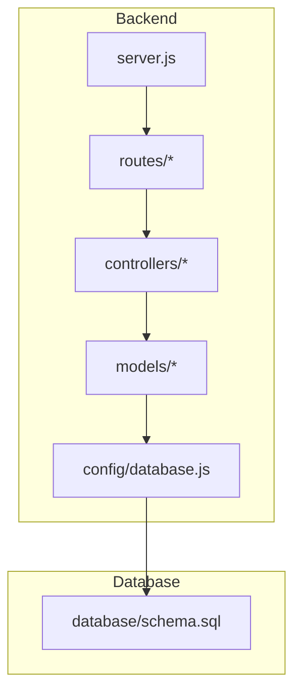
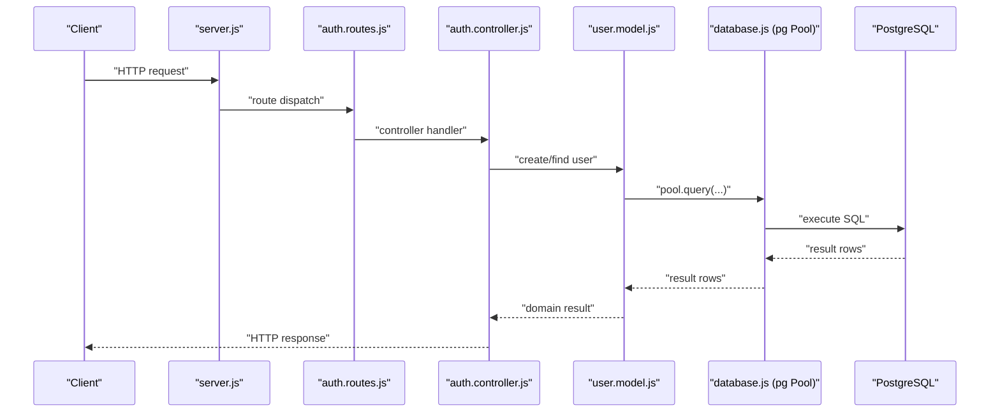
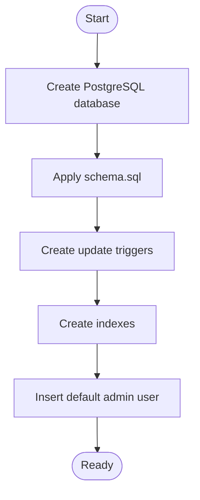
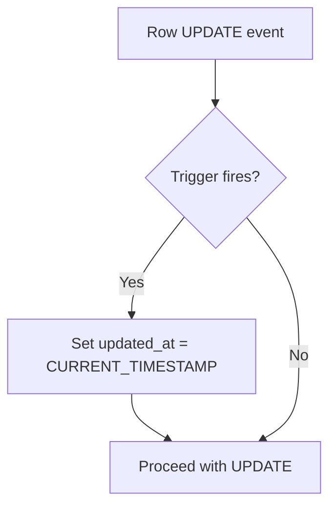
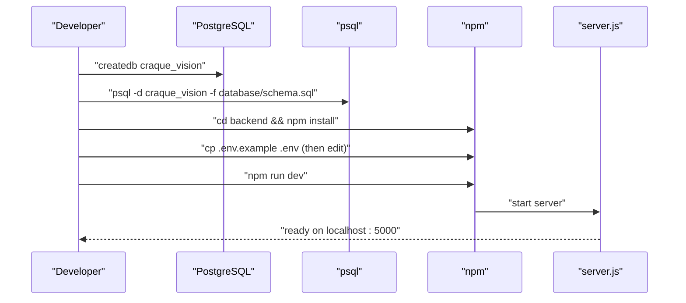
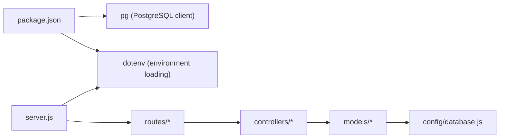

# Database Configuration

<cite>
**Referenced Files in This Document**
- [database.js](file://backend/config/database.js)
- [schema.sql](file://database/schema.sql)
- [server.js](file://backend/server.js)
- [package.json](file://backend/package.json)
- [user.model.js](file://backend/models/user.model.js)
- [athlete.model.js](file://backend/models/athlete.model.js)
- [subscription.model.js](file://backend/models/subscription.model.js)
- [auth.controller.js](file://backend/controllers/auth.controller.js)
- [auth.routes.js](file://backend/routes/auth.routes.js)
- [README.md](file://README.md)
- [QUICKSTART.md](file://QUICKSTART.md)
</cite>

## Table of Contents
1. [Introduction](#introduction)
2. [Project Structure](#project-structure)
3. [Core Components](#core-components)
4. [Architecture Overview](#architecture-overview)
5. [Detailed Component Analysis](#detailed-component-analysis)
6. [Dependency Analysis](#dependency-analysis)
7. [Performance Considerations](#performance-considerations)
8. [Troubleshooting Guide](#troubleshooting-guide)
9. [Conclusion](#conclusion)
10. [Appendices](#appendices)

## Introduction
This document provides comprehensive database configuration guidance for Craque-Vision’s PostgreSQL setup. It covers connection pooling, environment variable configuration, connection management, migration and schema initialization, development versus production differences, troubleshooting, performance tuning, and security considerations. It also documents the automatic timestamp update triggers and the complete setup procedure for local development and production environments.

## Project Structure
The database configuration centers around a single PostgreSQL connection pool configured in the backend and a declarative schema definition in the database directory. Models and controllers consume the shared pool to execute queries against the schema.

**Diagram sources**
- [server.js:1-40](file://backend/server.js#L1-L40)
- [auth.routes.js:1-11](file://backend/routes/auth.routes.js#L1-L11)
- [auth.controller.js:1-72](file://backend/controllers/auth.controller.js#L1-L72)
- [user.model.js:1-42](file://backend/models/user.model.js#L1-L42)
- [database.js:1-13](file://backend/config/database.js#L1-L13)
- [schema.sql:1-185](file://database/schema.sql#L1-L185)

**Section sources**
- [server.js:1-40](file://backend/server.js#L1-L40)
- [database.js:1-13](file://backend/config/database.js#L1-L13)
- [schema.sql:1-185](file://database/schema.sql#L1-L185)

## Core Components
- PostgreSQL connection pool: Created via the pg library and configured from environment variables. Exported as a singleton for reuse across models.
- Declarative schema: Defines tables, constraints, indexes, and triggers for automatic timestamp updates.
- Model-layer usage: Models execute queries against the shared pool, enabling centralized connection management.

Key configuration and usage points:
- Pool creation and environment variables: [database.js:4-10](file://backend/config/database.js#L4-L10)
- Schema initialization: [schema.sql:1-185](file://database/schema.sql#L1-L185)
- Model usage of the pool: [user.model.js:1](file://backend/models/user.model.js#L1), [athlete.model.js:1](file://backend/models/athlete.model.js#L1), [subscription.model.js:1](file://backend/models/subscription.model.js#L1)

**Section sources**
- [database.js:1-13](file://backend/config/database.js#L1-L13)
- [schema.sql:1-185](file://database/schema.sql#L1-L185)
- [user.model.js:1-42](file://backend/models/user.model.js#L1-L42)
- [athlete.model.js:1-119](file://backend/models/athlete.model.js#L1-L119)
- [subscription.model.js:1-54](file://backend/models/subscription.model.js#L1-L54)

## Architecture Overview
The backend initializes environment variables, starts the Express server, and exposes routes. Controllers orchestrate business logic and delegate persistence to models. Models use the shared PostgreSQL pool to execute queries against the schema.

**Diagram sources**
- [server.js:1-40](file://backend/server.js#L1-L40)
- [auth.routes.js:1-11](file://backend/routes/auth.routes.js#L1-L11)
- [auth.controller.js:1-72](file://backend/controllers/auth.controller.js#L1-L72)
- [user.model.js:1-42](file://backend/models/user.model.js#L1-L42)
- [database.js:1-13](file://backend/config/database.js#L1-L13)

## Detailed Component Analysis

### Connection Pooling Implementation
- Pool instantiation: The pool is created with host, port, database, user, and password loaded from environment variables. No explicit pool size or timeout options are set in the current implementation.
- Singleton export: The pool is exported once and imported by models, ensuring a single pool instance across the application.
- Usage pattern: Models call pool.query with prepared statements and parameter arrays.

Operational implications:
- Default pool behavior applies (e.g., default max connections, idle timeouts). For production, consider explicit pool sizing and timeouts to match workload characteristics.
- Prepared statements and parameterized queries are used consistently, reducing SQL injection risk.

**Section sources**
- [database.js:1-13](file://backend/config/database.js#L1-L13)
- [user.model.js:1-42](file://backend/models/user.model.js#L1-L42)
- [athlete.model.js:1-119](file://backend/models/athlete.model.js#L1-L119)
- [subscription.model.js:1-54](file://backend/models/subscription.model.js#L1-L54)

### Environment Variable Configuration
Required environment variables for database connectivity:
- DB_HOST: PostgreSQL host address
- DB_PORT: PostgreSQL port number
- DB_NAME: Database name
- DB_USER: Database user
- DB_PASSWORD: Database password

These variables are consumed by the pool configuration and must be present in the runtime environment.

**Section sources**
- [database.js:4-10](file://backend/config/database.js#L4-L10)

### Database Connection Management
- Initialization: Environment variables are loaded during server startup and pool creation.
- Runtime: Controllers and models rely on the shared pool for all database operations.
- Security: Passwords and secrets are sourced from environment variables; avoid hardcoding credentials.

Best practices:
- Ensure environment variables are set in production and CI/CD contexts.
- Use separate credentials per environment (development, staging, production).
- Restrict network access to the database host/port.

**Section sources**
- [server.js:13](file://backend/server.js#L13)
- [database.js:1-13](file://backend/config/database.js#L1-L13)

### Connection String Format
- Current implementation: Uses individual host, port, database, user, and password environment variables.
- Alternative approach: A single connection string can be used via PG_CONNECTION_STRING or similar, but the current code does not implement this.

Recommendation:
- For production, consider a single connection string to centralize configuration and simplify credential rotation.

**Section sources**
- [database.js:4-10](file://backend/config/database.js#L4-L10)

### Pool Size Limits and Timeout Settings
- Current state: No explicit pool size or timeout options are configured in the pool constructor.
- Implications: Defaults apply, which may not match workload demands in production.

Recommendations:
- Set max to control concurrency (e.g., number of simultaneous queries).
- Set idleTimeoutMillis and connectionTimeoutMillis to manage resource cleanup and prevent hanging requests.
- Monitor pool utilization and adjust based on observed metrics.

Note: These are recommendations derived from typical production needs; the current code does not include these settings.

**Section sources**
- [database.js:4-10](file://backend/config/database.js#L4-L10)

### Connection Validation Strategies
- Current state: No explicit connection validation is implemented in the codebase.
- Recommendations:
  - Add a health check endpoint that executes a lightweight query against the pool.
  - Implement retry logic with exponential backoff for transient failures.
  - Use pool events to monitor connection lifecycle and detect anomalies.

**Section sources**
- [database.js:1-13](file://backend/config/database.js#L1-L13)

### Database Migration and Schema Initialization
- Schema definition: The schema file defines tables, constraints, indexes, and triggers for automatic timestamp updates.
- Initialization steps:
  - Create the database.
  - Apply the schema file to initialize tables and indexes.
- Development note: The schema drops tables if they exist, facilitating development resets.

**Diagram sources**
- [schema.sql:1-185](file://database/schema.sql#L1-L185)

**Section sources**
- [schema.sql:1-185](file://database/schema.sql#L1-L185)
- [QUICKSTART.md:7-13](file://QUICKSTART.md#L7-L13)

### Automatic Timestamp Updates (Triggers)
- Function: A pluggable function updates the updated_at column to the current timestamp on row updates.
- Triggers: Separate triggers are attached to users, athletes, videos, subscriptions, and payments tables.
- Purpose: Ensures auditability and consistent last-modified timestamps.

**Diagram sources**
- [schema.sql:157-179](file://database/schema.sql#L157-L179)

**Section sources**
- [schema.sql:157-179](file://database/schema.sql#L157-L179)

### Development vs Production Configuration Differences
- Development:
  - Environment variables are loaded via dotenv at startup.
  - Schema drops and recreates tables for convenience.
  - Default pool settings apply.
- Production:
  - Use a single connection string or explicit pool configuration.
  - Centralize secrets management and restrict database network access.
  - Define pool size and timeouts aligned with traffic patterns.
  - Implement monitoring and health checks.

**Section sources**
- [server.js:13](file://backend/server.js#L13)
- [schema.sql:4-11](file://database/schema.sql#L4-L11)
- [database.js:4-10](file://backend/config/database.js#L4-L10)

### Setup Procedure for Local Development
- Database:
  - Create the database.
  - Apply the schema file.
- Backend:
  - Install dependencies.
  - Copy and configure environment variables.
  - Start the development server.

**Diagram sources**
- [QUICKSTART.md:7-29](file://QUICKSTART.md#L7-L29)
- [schema.sql:1-185](file://database/schema.sql#L1-L185)

**Section sources**
- [QUICKSTART.md:7-29](file://QUICKSTART.md#L7-L29)
- [README.md:37-49](file://README.md#L37-L49)

## Dependency Analysis
- Runtime dependencies:
  - pg: Provides the PostgreSQL client and connection pooling.
  - dotenv: Loads environment variables at startup.
- Application dependencies:
  - Models depend on the shared pool.
  - Controllers depend on models for persistence.
  - Routes depend on controllers.

**Diagram sources**
- [package.json:10-19](file://backend/package.json#L10-L19)
- [server.js:13](file://backend/server.js#L13)
- [database.js:1-13](file://backend/config/database.js#L1-L13)

**Section sources**
- [package.json:10-19](file://backend/package.json#L10-L19)
- [server.js:13](file://backend/server.js#L13)
- [database.js:1-13](file://backend/config/database.js#L1-L13)

## Performance Considerations
- Connection pooling:
  - Tune max connections to match expected concurrent load.
  - Set idle and connection timeouts to prevent resource leaks.
- Queries:
  - Leverage indexes defined in the schema for filtered queries.
  - Keep queries simple and avoid N+1 patterns.
- Monitoring:
  - Track pool utilization and query latency.
  - Use database profiling to identify slow queries.

[No sources needed since this section provides general guidance]

## Troubleshooting Guide
Common issues and resolutions:
- Connection refused:
  - Verify DB_HOST, DB_PORT, DB_NAME, DB_USER, and DB_PASSWORD are correct.
  - Confirm the database service is reachable from the application host.
- Authentication failure:
  - Ensure the database user exists and has appropriate permissions.
  - Check for typos in DB_USER and DB_PASSWORD.
- Schema mismatch:
  - Re-apply the schema file to align with the latest definitions.
  - Confirm indexes and triggers are present after schema application.
- Health check:
  - Implement a simple endpoint that runs a basic SELECT to validate connectivity.

**Section sources**
- [database.js:4-10](file://backend/config/database.js#L4-L10)
- [schema.sql:1-185](file://database/schema.sql#L1-L185)

## Conclusion
Craque-Vision uses a straightforward PostgreSQL configuration with a shared connection pool and a declarative schema. For production, augment the configuration with explicit pool sizing and timeouts, a single connection string, robust health checks, and strict security controls. The schema includes automatic timestamp updates via triggers, and the setup process is well-defined for local development.

[No sources needed since this section summarizes without analyzing specific files]

## Appendices

### Environment Variables Reference
- DB_HOST: PostgreSQL host
- DB_PORT: PostgreSQL port
- DB_NAME: Database name
- DB_USER: Database user
- DB_PASSWORD: Database password

**Section sources**
- [database.js:4-10](file://backend/config/database.js#L4-L10)

### Schema Overview
- Tables: users, athletes, videos, subscriptions, payments, favorites, likes
- Constraints: Unique indexes, foreign keys, check constraints
- Indexes: Optimized lookups by email, type, athlete references, status, favorites, and likes
- Triggers: Automatic updated_at timestamp updates on multiple tables

**Section sources**
- [schema.sql:13-184](file://database/schema.sql#L13-L184)