# Database Design

<cite>
**Referenced Files in This Document**
- [schema.sql](file://database/schema.sql)
- [database.js](file://backend/config/database.js)
- [user.model.js](file://backend/models/user.model.js)
- [athlete.model.js](file://backend/models/athlete.model.js)
- [video.model.js](file://backend/models/video.model.js)
- [subscription.model.js](file://backend/models/subscription.model.js)
- [favorite.model.js](file://backend/models/favorite.model.js)
- [like.model.js](file://backend/models/like.model.js)
- [auth.controller.js](file://backend/controllers/auth.controller.js)
- [athlete.controller.js](file://backend/controllers/athlete.controller.js)
- [video.controller.js](file://backend/controllers/video.controller.js)
- [payment.controller.js](file://backend/controllers/payment.controller.js)
- [admin.controller.js](file://backend/controllers/admin.controller.js)
- [auth.middleware.js](file://backend/middleware/auth.middleware.js)
- [package.json](file://backend/package.json)
</cite>

## Table of Contents
1. [Introduction](#introduction)
2. [Project Structure](#project-structure)
3. [Core Components](#core-components)
4. [Architecture Overview](#architecture-overview)
5. [Detailed Component Analysis](#detailed-component-analysis)
6. [Dependency Analysis](#dependency-analysis)
7. [Performance Considerations](#performance-considerations)
8. [Troubleshooting Guide](#troubleshooting-guide)
9. [Conclusion](#conclusion)
10. [Appendices](#appendices)

## Introduction
This document provides comprehensive database design documentation for Craque-Vision’s PostgreSQL schema. It covers the entity relationship diagram, table structures, constraints, indexes, and data access patterns. It also documents the user-role system, athlete profiles, video management, subscription plans, favorites/likes, connection pooling, query optimization strategies, data lifecycle management, security considerations, backup recommendations, and migration procedures.

## Project Structure
The database schema is defined in a single SQL script and is complemented by Node.js models and controllers that encapsulate data access and business logic. Environment variables configure the PostgreSQL connection via the pg library.

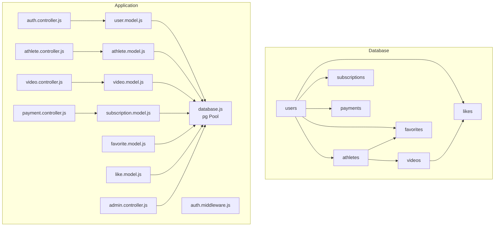

**Diagram sources**
- [schema.sql:14-184](file://database/schema.sql#L14-L184)
- [database.js:1-13](file://backend/config/database.js#L1-L13)
- [user.model.js:1-42](file://backend/models/user.model.js#L1-L42)
- [athlete.model.js:1-119](file://backend/models/athlete.model.js#L1-L119)
- [video.model.js:1-61](file://backend/models/video.model.js#L1-L61)
- [subscription.model.js:1-55](file://backend/models/subscription.model.js#L1-L55)
- [favorite.model.js:1-52](file://backend/models/favorite.model.js#L1-L52)
- [like.model.js:1-61](file://backend/models/like.model.js#L1-L61)
- [auth.controller.js:1-72](file://backend/controllers/auth.controller.js#L1-L72)
- [athlete.controller.js:1-91](file://backend/controllers/athlete.controller.js#L1-L91)
- [video.controller.js:1-111](file://backend/controllers/video.controller.js#L1-L111)
- [payment.controller.js:1-108](file://backend/controllers/payment.controller.js#L1-L108)
- [admin.controller.js:1-121](file://backend/controllers/admin.controller.js#L1-L121)
- [auth.middleware.js:1-59](file://backend/middleware/auth.middleware.js#L1-L59)

**Section sources**
- [schema.sql:1-185](file://database/schema.sql#L1-L185)
- [database.js:1-13](file://backend/config/database.js#L1-L13)
- [package.json:10-19](file://backend/package.json#L10-L19)

## Core Components
This section documents each table, its fields, constraints, and indexes, and explains how they relate to each other.

- Users
  - Purpose: Stores user accounts with role-based access.
  - Fields: id, name, email (unique), password, user_type (check constraint), email_verified, is_active, created_at, updated_at.
  - Constraints: Unique email; user_type restricted to predefined values; default timestamps via trigger.
  - Indexes: email, user_type.

- Athletes
  - Purpose: Extends users with athlete-specific profile data.
  - Fields: id, user_id (foreign key to users), sport, category, position, dominant_foot (check), physical attributes, location, contact, club info, profile content, visibility flags, created_at, updated_at.
  - Constraints: One-to-one with users via foreign key; default country; default visibility flags; check constraints on enumerated fields.
  - Indexes: user_id, sport, category, state, position.

- Videos
  - Purpose: Stores uploaded video assets and metadata.
  - Fields: id, athlete_id (foreign key to athletes), video_url, thumbnail, title, type, description, views (default 0), status (check), rejection_reason, created_at, updated_at.
  - Constraints: Foreign key cascade deletes; status restricted to predefined values; default pending status.
  - Indexes: athlete_id, status.

- Subscriptions
  - Purpose: Tracks user subscriptions and plan status.
  - Fields: id, user_id (foreign key to users), plan_name, status (check), expires_at, payment_id, created_at, updated_at.
  - Constraints: Foreign key cascade deletes; status restricted to predefined values.
  - Indexes: user_id, status.

- Payments
  - Purpose: Records payment transactions for videos and subscriptions.
  - Fields: id, user_id (foreign key to users), type (check), package_type, plan_name, amount, currency, status (check), payment_method, external_payment_id, created_at, updated_at.
  - Constraints: Foreign key cascade deletes; type and status restricted to predefined values.
  - Indexes: user_id.

- Favorites
  - Purpose: Allows users to bookmark athletes.
  - Fields: id, user_id (foreign key to users), athlete_id (foreign key to athletes), created_at.
  - Constraints: Unique combination of user_id and athlete_id; cascade deletes.
  - Indexes: user_id, athlete_id.

- Likes
  - Purpose: Allows users to like videos.
  - Fields: id, user_id (foreign key to users), video_id (foreign key to videos), created_at.
  - Constraints: Unique combination of user_id and video_id; cascade deletes.
  - Indexes: user_id, video_id.

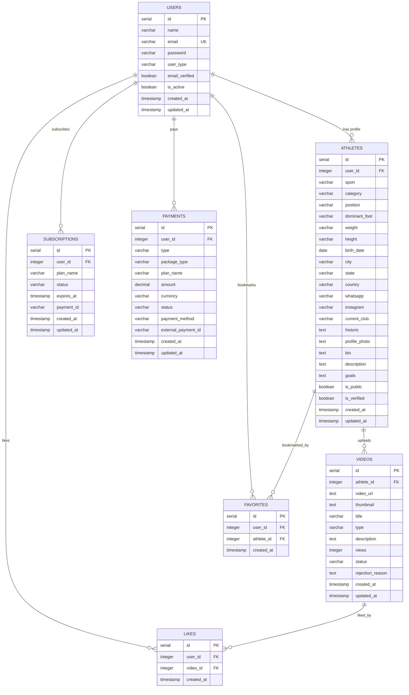

**Diagram sources**
- [schema.sql:14-184](file://database/schema.sql#L14-L184)

**Section sources**
- [schema.sql:14-184](file://database/schema.sql#L14-L184)

## Architecture Overview
The backend uses a layered architecture:
- Controllers handle HTTP requests and orchestrate business logic.
- Models encapsulate database queries and expose CRUD methods.
- Middleware authenticates and authorizes requests.
- Config defines the PostgreSQL connection pool via pg.

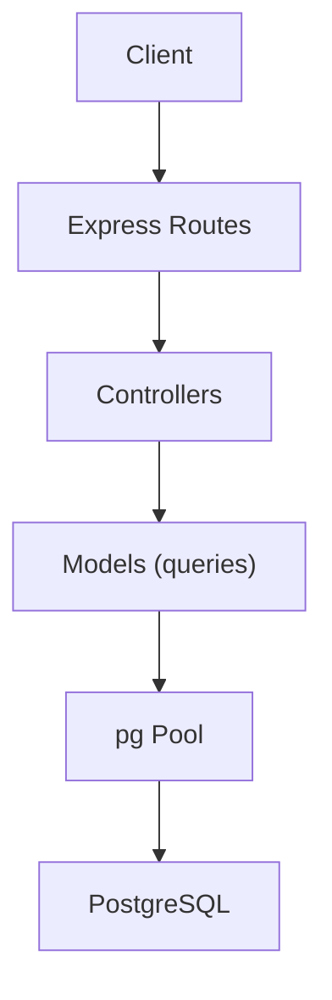

**Diagram sources**
- [database.js:1-13](file://backend/config/database.js#L1-L13)
- [user.model.js:1-42](file://backend/models/user.model.js#L1-L42)
- [athlete.model.js:1-119](file://backend/models/athlete.model.js#L1-L119)
- [video.model.js:1-61](file://backend/models/video.model.js#L1-L61)
- [subscription.model.js:1-55](file://backend/models/subscription.model.js#L1-L55)
- [favorite.model.js:1-52](file://backend/models/favorite.model.js#L1-L52)
- [like.model.js:1-61](file://backend/models/like.model.js#L1-L61)

## Detailed Component Analysis

### Authentication and Authorization
- Authentication middleware validates JWT tokens and attaches user context to requests.
- Authorization middleware restricts endpoints to specific user types.
- Controllers use these middlewares to enforce access policies.

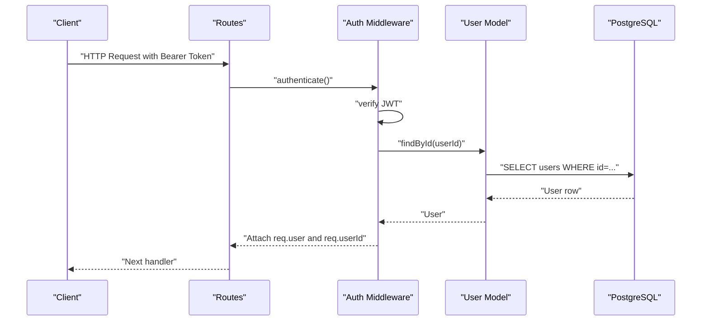

**Diagram sources**
- [auth.middleware.js:4-33](file://backend/middleware/auth.middleware.js#L4-L33)
- [user.model.js:26-38](file://backend/models/user.model.js#L26-L38)
- [database.js:1-13](file://backend/config/database.js#L1-L13)

**Section sources**
- [auth.middleware.js:4-42](file://backend/middleware/auth.middleware.js#L4-L42)
- [auth.controller.js:8-59](file://backend/controllers/auth.controller.js#L8-L59)

### User Registration and Password Hashing
- Registration hashes passwords before storing.
- Email uniqueness is enforced at the database level.

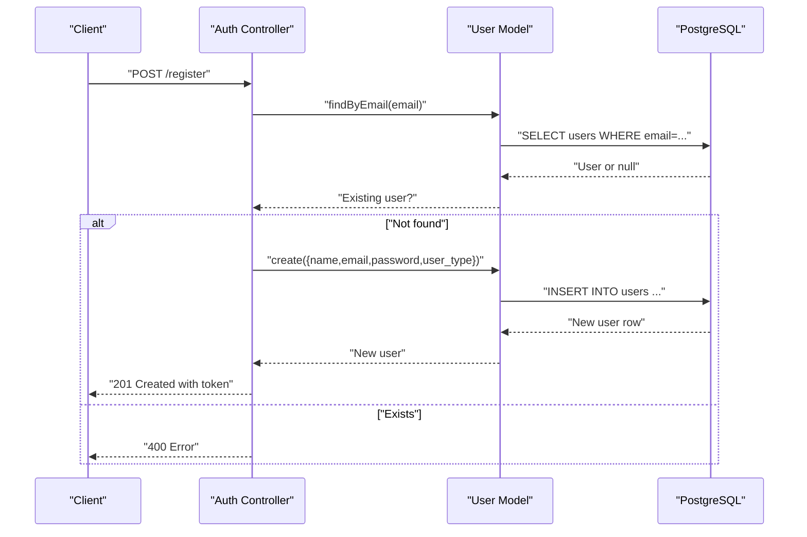

**Diagram sources**
- [auth.controller.js:8-28](file://backend/controllers/auth.controller.js#L8-L28)
- [user.model.js:5-18](file://backend/models/user.model.js#L5-L18)
- [schema.sql:14-24](file://database/schema.sql#L14-L24)

**Section sources**
- [auth.controller.js:8-28](file://backend/controllers/auth.controller.js#L8-L28)
- [user.model.js:5-18](file://backend/models/user.model.js#L5-L18)
- [schema.sql:14-24](file://database/schema.sql#L14-L24)

### Athlete Profile Management
- Controllers coordinate profile creation/update and search.
- Models implement dynamic updates and joins with users for display.

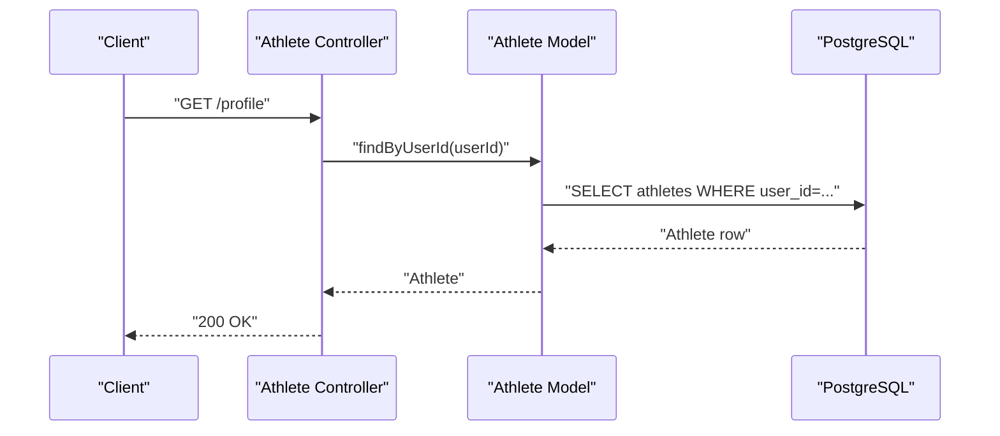

**Diagram sources**
- [athlete.controller.js:24-37](file://backend/controllers/athlete.controller.js#L24-L37)
- [athlete.model.js:34-38](file://backend/models/athlete.model.js#L34-L38)
- [schema.sql:27-67](file://database/schema.sql#L27-L67)

**Section sources**
- [athlete.controller.js:4-71](file://backend/controllers/athlete.controller.js#L4-L71)
- [athlete.model.js:3-32](file://backend/models/athlete.model.js#L3-L32)

### Video Management
- Uploads associate videos with the authenticated athlete’s profile.
- Retrieval includes computed likes count and joins for display.

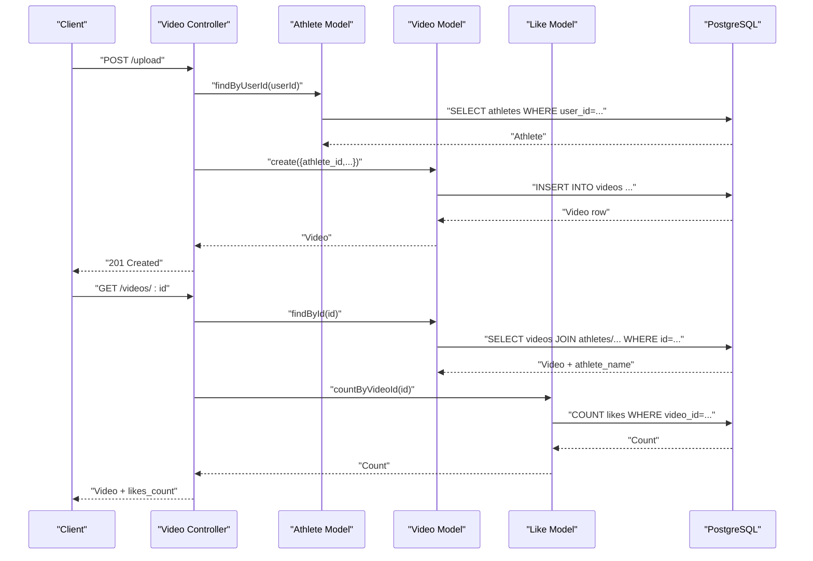

**Diagram sources**
- [video.controller.js:5-78](file://backend/controllers/video.controller.js#L5-L78)
- [video.model.js:4-38](file://backend/models/video.model.js#L4-L38)
- [like.model.js:39-47](file://backend/models/like.model.js#L39-L47)
- [schema.sql:69-88](file://database/schema.sql#L69-L88)

**Section sources**
- [video.controller.js:5-88](file://backend/controllers/video.controller.js#L5-L88)
- [video.model.js:4-51](file://backend/models/video.model.js#L4-L51)

### Subscription Plans and Payments
- Payment controller exposes packages/plans and simulates payment creation.
- Confirming a subscription payment creates a subscription record.

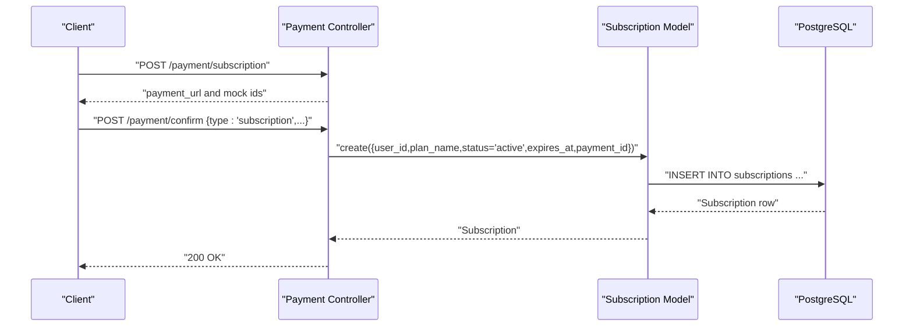

**Diagram sources**
- [payment.controller.js:53-107](file://backend/controllers/payment.controller.js#L53-L107)
- [subscription.model.js:4-16](file://backend/models/subscription.model.js#L4-L16)
- [schema.sql:90-101](file://database/schema.sql#L90-L101)

**Section sources**
- [payment.controller.js:3-107](file://backend/controllers/payment.controller.js#L3-L107)
- [subscription.model.js:4-40](file://backend/models/subscription.model.js#L4-L40)

### Favorites and Likes
- Favorites allow users to bookmark athletes; duplicates are prevented by a unique constraint.
- Likes allow users to like videos; counts are computed per video.

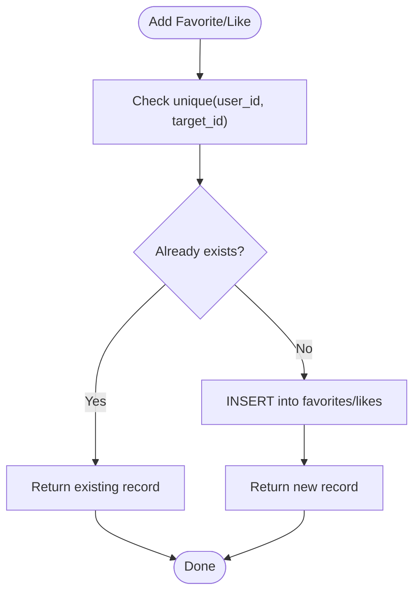

**Diagram sources**
- [favorite.model.js:4-16](file://backend/models/favorite.model.js#L4-L16)
- [like.model.js:4-16](file://backend/models/like.model.js#L4-L16)
- [schema.sql:120-138](file://database/schema.sql#L120-L138)

**Section sources**
- [favorite.model.js:4-48](file://backend/models/favorite.model.js#L4-L48)
- [like.model.js:4-57](file://backend/models/like.model.js#L4-L57)

### Administrative Operations
- Admin controller aggregates dashboard statistics and supports moderation actions like approving/rejecting videos.

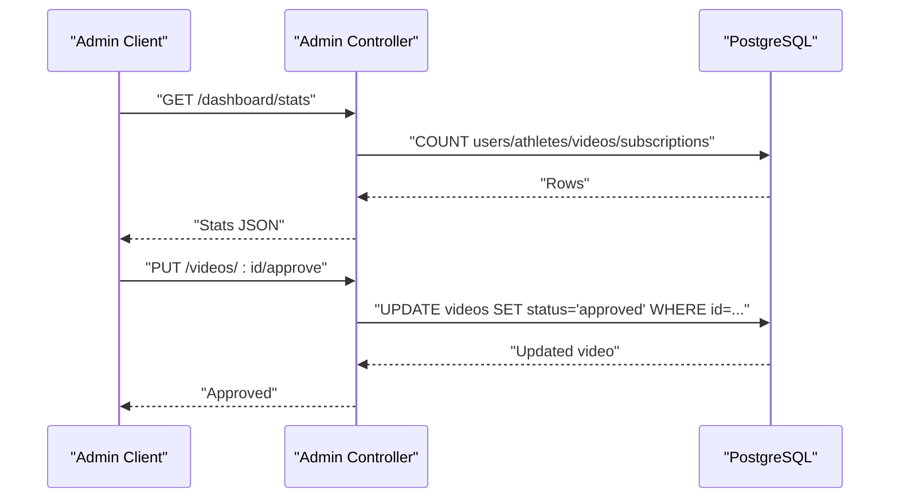

**Diagram sources**
- [admin.controller.js:7-110](file://backend/controllers/admin.controller.js#L7-L110)
- [schema.sql:69-88](file://database/schema.sql#L69-L88)

**Section sources**
- [admin.controller.js:7-121](file://backend/controllers/admin.controller.js#L7-L121)

## Dependency Analysis
- Models depend on the pg Pool for database operations.
- Controllers depend on models and middleware for request handling.
- Middleware depends on JWT and the User model for authentication.

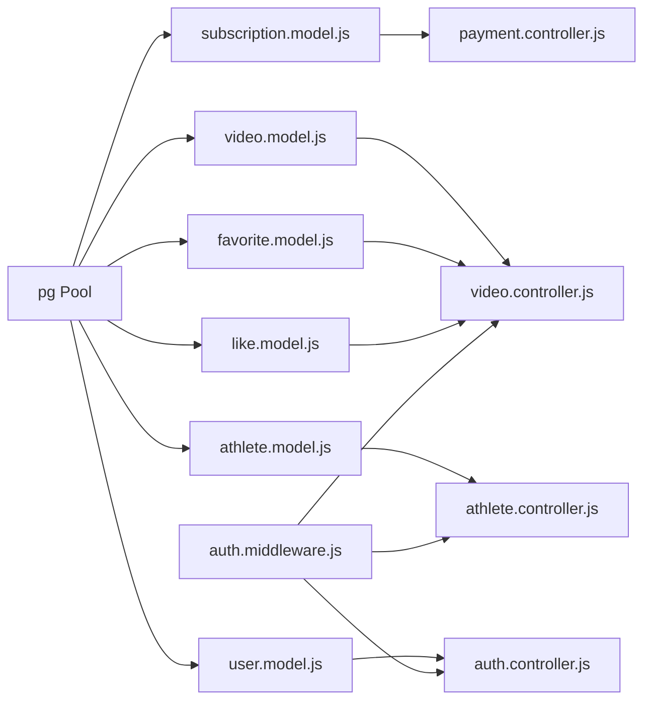

**Diagram sources**
- [database.js:1-13](file://backend/config/database.js#L1-L13)
- [user.model.js:1-42](file://backend/models/user.model.js#L1-L42)
- [athlete.model.js:1-119](file://backend/models/athlete.model.js#L1-L119)
- [video.model.js:1-61](file://backend/models/video.model.js#L1-L61)
- [subscription.model.js:1-55](file://backend/models/subscription.model.js#L1-L55)
- [favorite.model.js:1-52](file://backend/models/favorite.model.js#L1-L52)
- [like.model.js:1-61](file://backend/models/like.model.js#L1-L61)
- [auth.controller.js:1-72](file://backend/controllers/auth.controller.js#L1-L72)
- [athlete.controller.js:1-91](file://backend/controllers/athlete.controller.js#L1-L91)
- [video.controller.js:1-111](file://backend/controllers/video.controller.js#L1-L111)
- [payment.controller.js:1-108](file://backend/controllers/payment.controller.js#L1-L108)
- [auth.middleware.js:1-59](file://backend/middleware/auth.middleware.js#L1-L59)

**Section sources**
- [package.json:10-19](file://backend/package.json#L10-L19)
- [database.js:1-13](file://backend/config/database.js#L1-L13)

## Performance Considerations
- Indexes
  - users: email, user_type
  - athletes: user_id, sport, category, state, position
  - videos: athlete_id, status
  - subscriptions: user_id, status
  - favorites: user_id, athlete_id
  - likes: user_id, video_id
- Triggers
  - Automatic updated_at updates for most tables reduce write overhead and ensure audit trail consistency.
- Query Patterns
  - Controllers commonly join users/athletes/videos to enrich responses; ensure appropriate indexes exist on join keys.
  - Aggregation queries (counts) are executed in administrative endpoints; consider caching for frequently accessed metrics.
- Connection Pooling
  - The pg Pool manages connections efficiently; tune pool size according to workload and database capacity.

**Section sources**
- [schema.sql:140-180](file://database/schema.sql#L140-L180)
- [admin.controller.js:9-17](file://backend/controllers/admin.controller.js#L9-L17)
- [database.js:4-10](file://backend/config/database.js#L4-L10)

## Troubleshooting Guide
- Authentication Failures
  - Missing or invalid Bearer token leads to 401 responses.
  - Expired or malformed tokens are handled by the middleware.
- Authorization Failures
  - Requests to protected endpoints without sufficient privileges receive 403.
- Data Integrity
  - Unique constraints on emails and favorites/likes combinations prevent duplicates.
  - Check constraints on enumerated fields ensure valid statuses/types.
- Operational Checks
  - Verify environment variables for database credentials.
  - Confirm triggers are active to maintain updated_at fields.

**Section sources**
- [auth.middleware.js:4-33](file://backend/middleware/auth.middleware.js#L4-L33)
- [auth.controller.js:30-59](file://backend/controllers/auth.controller.js#L30-L59)
- [schema.sql:14-24](file://database/schema.sql#L14-L24)
- [schema.sql:120-138](file://database/schema.sql#L120-L138)

## Conclusion
Craque-Vision’s database design centers on a clean relational schema with explicit foreign keys, constraints, and indexes. The application enforces role-based access, supports athlete profiles and video management, tracks subscriptions and payments, and enables social features like favorites and likes. The use of connection pooling, triggers, and modular models ensures maintainable and efficient data access.

## Appendices

### A. Connection Pooling Implementation
- The backend uses the pg Pool configured with environment variables for host, port, database, user, and password.
- Pool settings can be extended (e.g., max, idleTimeout, connectionTimeoutMillis) depending on deployment needs.

**Section sources**
- [database.js:4-10](file://backend/config/database.js#L4-L10)
- [package.json](file://backend/package.json#L19)

### B. Data Lifecycle Management
- Soft-deletion is not implemented; cascade deletes remove dependent records when parent rows are deleted.
- Status fields (videos.status, subscriptions.status, payments.status) manage lifecycle transitions.
- Moderation endpoints allow administrators to approve or reject content.

**Section sources**
- [schema.sql:79-84](file://database/schema.sql#L79-L84)
- [schema.sql:95-96](file://database/schema.sql#L95-L96)
- [schema.sql:112-113](file://database/schema.sql#L112-L113)
- [admin.controller.js:78-110](file://backend/controllers/admin.controller.js#L78-L110)

### C. Security Considerations
- Passwords are hashed before storage.
- JWT-based session tokens protect authenticated endpoints.
- Unique constraints and check constraints prevent invalid data states.
- Environment variables store secrets; ensure secure handling in CI/CD.

**Section sources**
- [user.model.js](file://backend/models/user.model.js#L7)
- [auth.middleware.js:4-33](file://backend/middleware/auth.middleware.js#L4-L33)
- [schema.sql:17-19](file://database/schema.sql#L17-L19)
- [schema.sql:83-84](file://database/schema.sql#L83-L84)
- [schema.sql:95-96](file://database/schema.sql#L95-L96)
- [schema.sql:112-113](file://database/schema.sql#L112-L113)

### D. Backup and Migration Procedures
- Backups
  - Use logical backups (e.g., pg_dump) for schema and data snapshots.
  - Schedule periodic backups and test restore procedures.
- Migrations
  - Apply schema.sql to initialize or reset development environments.
  - For production, adopt a migration framework (e.g., db-migrate, Sequelize CLI) to manage incremental schema changes with rollback support.

**Section sources**
- [schema.sql:1-185](file://database/schema.sql#L1-L185)