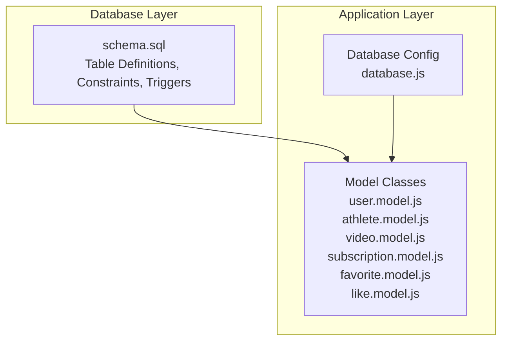
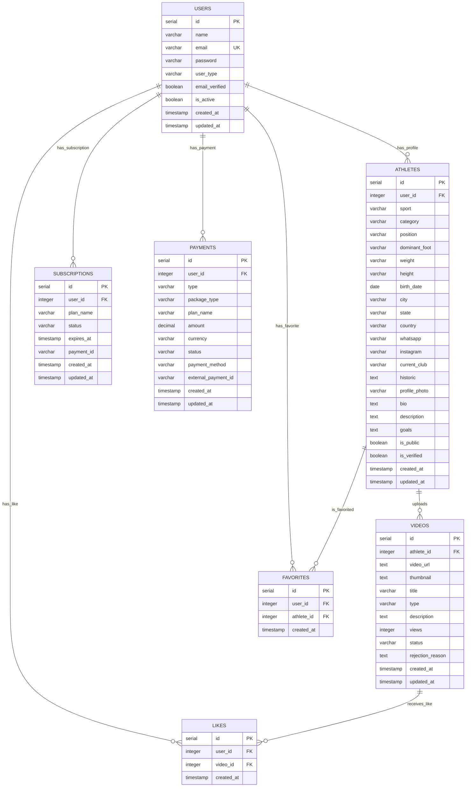
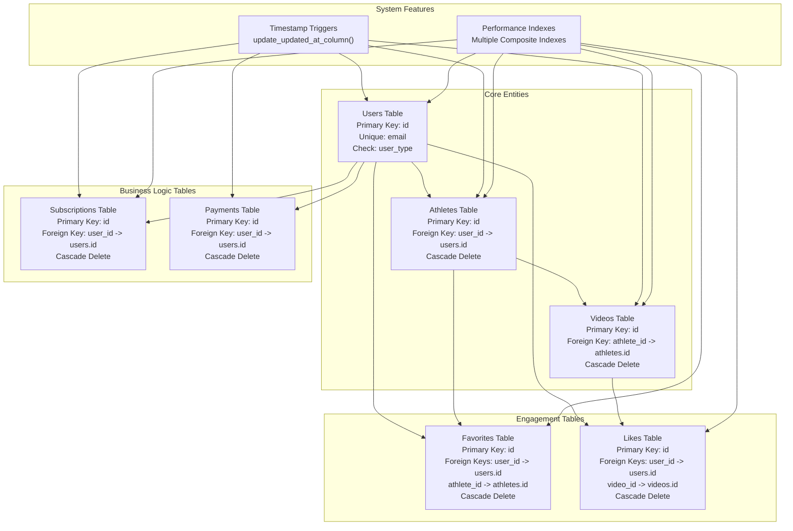
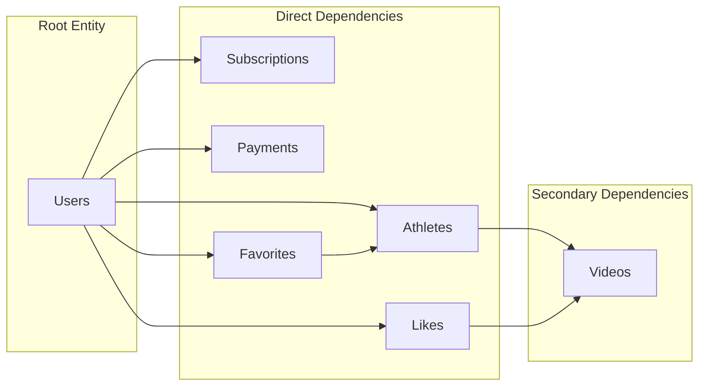
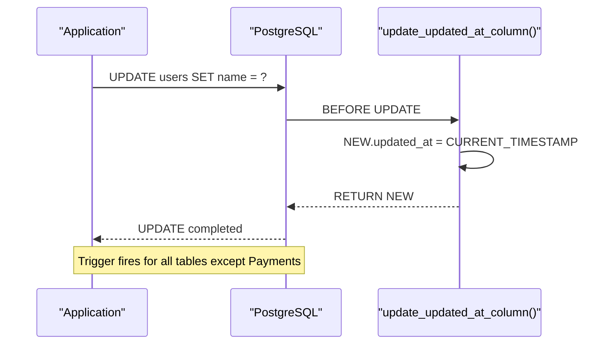

# Database Schema Overview

<cite>
**Referenced Files in This Document**
- [schema.sql](file://database/schema.sql)
- [user.model.js](file://backend/models/user.model.js)
- [athlete.model.js](file://backend/models/athlete.model.js)
- [video.model.js](file://backend/models/video.model.js)
- [subscription.model.js](file://backend/models/subscription.model.js)
- [favorite.model.js](file://backend/models/favorite.model.js)
- [like.model.js](file://backend/models/like.model.js)
- [database.js](file://backend/config/database.js)
- [payment.controller.js](file://backend/controllers/payment.controller.js)
</cite>

## Table of Contents
1. [Introduction](#introduction)
2. [Project Structure](#project-structure)
3. [Core Components](#core-components)
4. [Architecture Overview](#architecture-overview)
5. [Detailed Component Analysis](#detailed-component-analysis)
6. [Dependency Analysis](#dependency-analysis)
7. [Performance Considerations](#performance-considerations)
8. [Troubleshooting Guide](#troubleshooting-guide)
9. [Conclusion](#conclusion)

## Introduction
This document provides comprehensive database schema documentation for Craque-Vision's PostgreSQL implementation. It details the complete entity relationship diagram for seven core tables (users, athletes, videos, subscriptions, payments, favorites, likes), their primary keys, foreign keys, and referential integrity constraints. The document explains design principles including normalization, indexing strategy, and performance optimizations, along with the trigger system for automatic timestamp updates and cascade delete relationships. It also documents the complete table structures with field definitions, data types, constraints, and default values, and explains the business logic behind each table relationship.

## Project Structure
The database schema is defined in a single SQL script that creates all tables, indexes, triggers, and includes a default admin user insertion. The backend models mirror the database structure and provide CRUD operations for each entity.

**Diagram sources**
- [schema.sql:1-185](file://database/schema.sql#L1-L185)
- [database.js:1-13](file://backend/config/database.js#L1-L13)

**Section sources**
- [schema.sql:1-185](file://database/schema.sql#L1-L185)
- [database.js:1-13](file://backend/config/database.js#L1-L13)

## Core Components
The database consists of seven interconnected tables that implement a normalized design for a multi-user sports talent discovery platform. Each table serves a specific business function while maintaining referential integrity through foreign key constraints.

### Entity Relationship Overview
The relationships form a hierarchical structure centered around users, with specialized entities for athletes, videos, subscriptions, and engagement metrics.

**Diagram sources**
- [schema.sql:14-185](file://database/schema.sql#L14-L185)

## Architecture Overview
The database architecture implements a normalized relational design with explicit foreign key relationships and cascading deletes. The trigger system ensures consistent timestamp updates across all tables.

**Diagram sources**
- [schema.sql:14-185](file://database/schema.sql#L14-L185)

## Detailed Component Analysis

### Users Table
The Users table serves as the central identity entity with comprehensive user management capabilities.

**Primary Key**: `id` (SERIAL)
**Unique Constraint**: `email`
**Check Constraint**: `user_type` limited to ('athlete', 'scout', 'club', 'admin')
**Default Values**: `email_verified` = FALSE, `is_active` = TRUE
**Timestamps**: Automatic creation and updates via trigger

**Business Logic**: Supports four distinct user types with role-based access control. The email uniqueness ensures single account per email address.

**Section sources**
- [schema.sql:14-24](file://database/schema.sql#L14-L24)

### Athletes Table
The Athletes table extends user profiles with comprehensive athletic information and verification capabilities.

**Primary Key**: `id` (SERIAL)
**Foreign Key**: `user_id` -> users.id (ON DELETE CASCADE)
**Check Constraints**: 
- `dominant_foot` limited to ('left', 'right', 'both')
**Default Values**: `country` = 'Brasil', `is_public` = TRUE, `is_verified` = FALSE
**Timestamps**: Automatic creation and updates via trigger

**Business Logic**: Links to Users table for authentication and profile management. Contains extensive athletic and personal information for talent discovery.

**Section sources**
- [schema.sql:27-67](file://database/schema.sql#L27-L67)

### Videos Table
The Videos table manages video content uploaded by athletes with moderation and analytics capabilities.

**Primary Key**: `id` (SERIAL)
**Foreign Key**: `athlete_id` -> athletes.id (ON DELETE CASCADE)
**Check Constraint**: `status` limited to ('pending', 'approved', 'rejected')
**Default Values**: `views` = 0, `status` = 'pending'
**Timestamps**: Automatic creation and updates via trigger

**Business Logic**: Implements content moderation workflow with pending/approved/rejected states. Tracks view counts and provides filtering capabilities.

**Section sources**
- [schema.sql:69-88](file://database/schema.sql#L69-L88)

### Subscriptions Table
The Subscriptions table manages user subscription plans and billing cycles.

**Primary Key**: `id` (SERIAL)
**Foreign Key**: `user_id` -> users.id (ON DELETE CASCADE)
**Check Constraint**: `status` limited to ('active', 'cancelled', 'expired')
**Timestamps**: Automatic creation and updates via trigger

**Business Logic**: Tracks subscription lifecycle with expiration dates and payment associations. Supports plan upgrades/downgrades and renewal management.

**Section sources**
- [schema.sql:90-101](file://database/schema.sql#L90-L101)

### Payments Table
The Payments table records all financial transactions for video packages and subscriptions.

**Primary Key**: `id` (SERIAL)
**Foreign Key**: `user_id` -> users.id (ON DELETE CASCADE)
**Check Constraints**:
- `type` limited to ('video_package', 'subscription')
- `status` limited to ('pending', 'completed', 'failed', 'refunded')
**Default Values**: `currency` = 'BRL', `status` = 'pending'
**Timestamps**: Automatic creation and updates via trigger

**Business Logic**: Centralizes payment processing with support for both one-time video purchases and recurring subscription payments.

**Section sources**
- [schema.sql:103-118](file://database/schema.sql#L103-L118)

### Favorites Table
The Favorites table implements user-athelete relationship for saving preferred athletes.

**Primary Key**: `id` (SERIAL)
**Foreign Keys**:
- `user_id` -> users.id (ON DELETE CASCADE)
- `athlete_id` -> athletes.id (ON DELETE CASCADE)
**Unique Constraint**: (user_id, athlete_id) prevents duplicate favorites
**Timestamp**: Automatic creation timestamp

**Business Logic**: Enables user preference management with unique constraint preventing duplicates. Supports athlete discovery and bookmarking functionality.

**Section sources**
- [schema.sql:120-128](file://database/schema.sql#L120-L128)

### Likes Table
The Likes table manages user-video engagement through social interaction.

**Primary Key**: `id` (SERIAL)
**Foreign Keys**:
- `user_id` -> users.id (ON DELETE CASCADE)
- `video_id` -> videos.id (ON DELETE CASCADE)
**Unique Constraint**: (user_id, video_id) prevents duplicate likes
**Timestamp**: Automatic creation timestamp

**Business Logic**: Implements social engagement with unique constraint ensuring each user can like a video only once. Supports video popularity metrics and user interaction tracking.

**Section sources**
- [schema.sql:130-138](file://database/schema.sql#L130-L138)

## Dependency Analysis

### Foreign Key Relationships
The database implements a clear hierarchical dependency structure with cascade deletes ensuring referential integrity.

**Diagram sources**
- [schema.sql:28-29](file://database/schema.sql#L28-L29)
- [schema.sql:72-73](file://database/schema.sql#L72-L73)
- [schema.sql:93-94](file://database/schema.sql#L93-L94)
- [schema.sql:106-107](file://database/schema.sql#L106-L107)
- [schema.sql:123-124](file://database/schema.sql#L123-L124)
- [schema.sql:133-134](file://database/schema.sql#L133-L134)

### Cascade Delete Behavior
All foreign key relationships implement ON DELETE CASCADE, ensuring that when parent records are deleted, child records are automatically removed. This prevents orphaned records and maintains data integrity.

**Cascade Delete Chains**:
- Deleting a User cascades to Athletes, Subscriptions, Payments, Favorites, and Likes
- Deleting an Athlete cascades to Videos and Favorites
- Deleting a Video cascades to Likes

**Section sources**
- [schema.sql:5-11](file://database/schema.sql#L5-L11)
- [schema.sql:29](file://database/schema.sql#L29)
- [schema.sql:72](file://database/schema.sql#L72)
- [schema.sql:93](file://database/schema.sql#L93)
- [schema.sql:106](file://database/schema.sql#L106)
- [schema.sql:123-124](file://database/schema.sql#L123-L124)
- [schema.sql:133](file://database/schema.sql#L133)

## Performance Considerations

### Index Strategy
The schema includes comprehensive indexing for optimal query performance across frequently accessed columns.

**Index Categories**:
- **Single Column Indexes**: Email, user_type, status fields for filtering
- **Multi-Column Indexes**: Composite indexes for common join operations
- **Performance-Critical Columns**: Frequently queried attributes receive dedicated indexes

**Index Coverage**:
- Users: email, user_type
- Athletes: user_id, sport, category, state, position
- Videos: athlete_id, status
- Subscriptions: user_id, status
- Favorites: user_id, athlete_id
- Likes: user_id, video_id

**Section sources**
- [schema.sql:140-155](file://database/schema.sql#L140-L155)

### Timestamp Management
The database implements a centralized trigger system for automatic timestamp updates.

**Diagram sources**
- [schema.sql:157-180](file://database/schema.sql#L157-L180)

**Section sources**
- [schema.sql:157-180](file://database/schema.sql#L157-L180)

### Data Type Optimizations
- **SERIAL**: Auto-incrementing primary keys for efficient indexing
- **VARCHAR Limits**: Appropriate length constraints prevent excessive storage
- **CHECK Constraints**: Prevent invalid data entry at database level
- **DECIMAL**: Precise monetary calculations for payment amounts

## Troubleshooting Guide

### Common Issues and Solutions

**Constraint Violations**:
- Email uniqueness violations occur when duplicate emails are attempted
- User type validation errors for invalid role assignments
- Status constraint violations for invalid enumeration values

**Cascade Delete Scenarios**:
- Deleting users removes all associated records automatically
- Removing athletes deletes their videos and favorites
- Video deletion removes associated likes

**Performance Issues**:
- Missing indexes on frequently queried columns
- Large result sets without proper pagination
- Inefficient JOIN operations without proper indexing

**Section sources**
- [schema.sql:17-24](file://database/schema.sql#L17-L24)
- [schema.sql:18-20](file://database/schema.sql#L18-L20)
- [schema.sql:83-84](file://database/schema.sql#L83-L84)
- [schema.sql:95-96](file://database/schema.sql#L95-L96)
- [schema.sql:112-113](file://database/schema.sql#L112-L113)

### Application Integration Notes
The backend models provide consistent access patterns that align with the database schema:

**Connection Management**: Uses PostgreSQL connection pooling for efficient resource utilization
**Query Patterns**: Follows established naming conventions and parameter binding
**Error Handling**: Implements proper error handling for database operations

**Section sources**
- [database.js:1-13](file://backend/config/database.js#L1-L13)
- [user.model.js:1-42](file://backend/models/user.model.js#L1-L42)
- [athlete.model.js:1-119](file://backend/models/athlete.model.js#L1-L119)
- [video.model.js:1-61](file://backend/models/video.model.js#L1-L61)
- [subscription.model.js:1-55](file://backend/models/subscription.model.js#L1-L55)
- [favorite.model.js:1-52](file://backend/models/favorite.model.js#L1-L52)
- [like.model.js:1-61](file://backend/models/like.model.js#L1-L61)
- [payment.controller.js:1-108](file://backend/controllers/payment.controller.js#L1-L108)

## Conclusion
Craque-Vision's database schema implements a well-normalized, scalable design that supports the platform's multi-user, multi-role functionality. The schema provides robust referential integrity through foreign key constraints and cascade deletes, comprehensive indexing for optimal performance, and centralized timestamp management through triggers. The design accommodates the platform's core business functions including athlete profiles, video content management, subscription-based access control, and social engagement features. The implementation demonstrates sound database design principles while maintaining flexibility for future enhancements and scaling requirements.