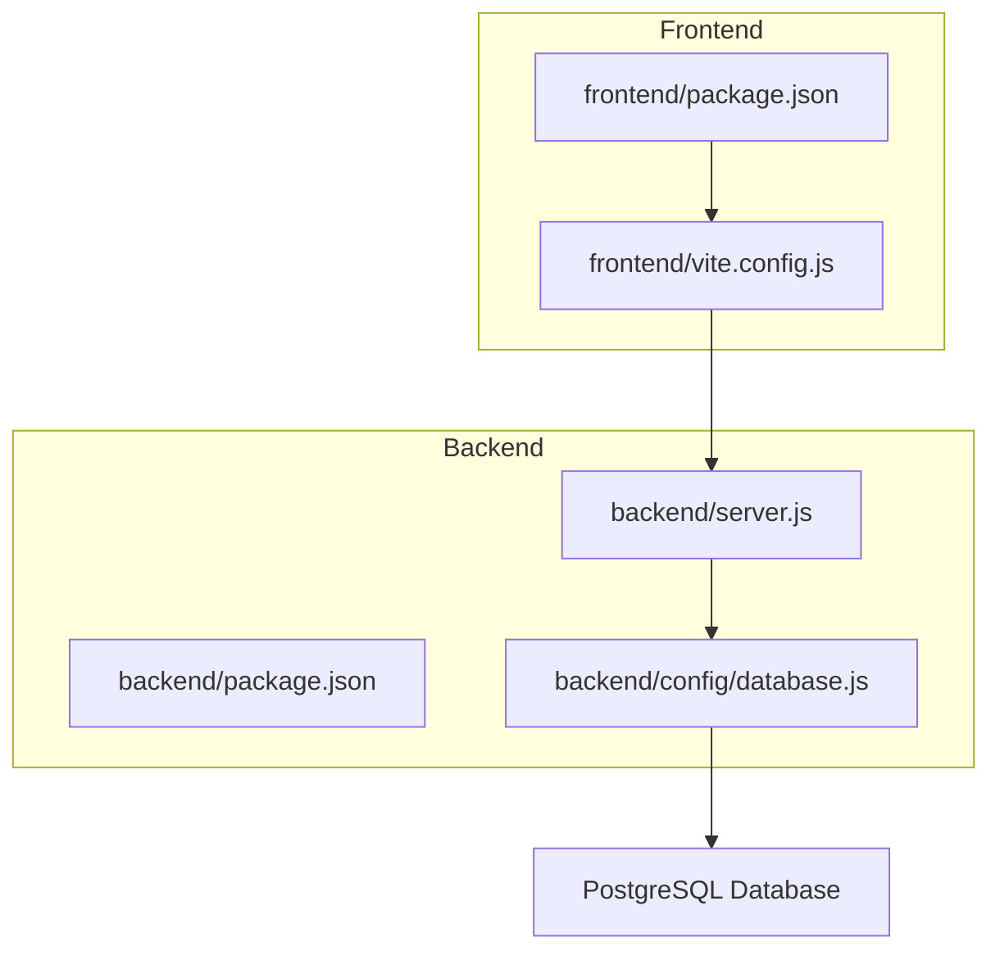
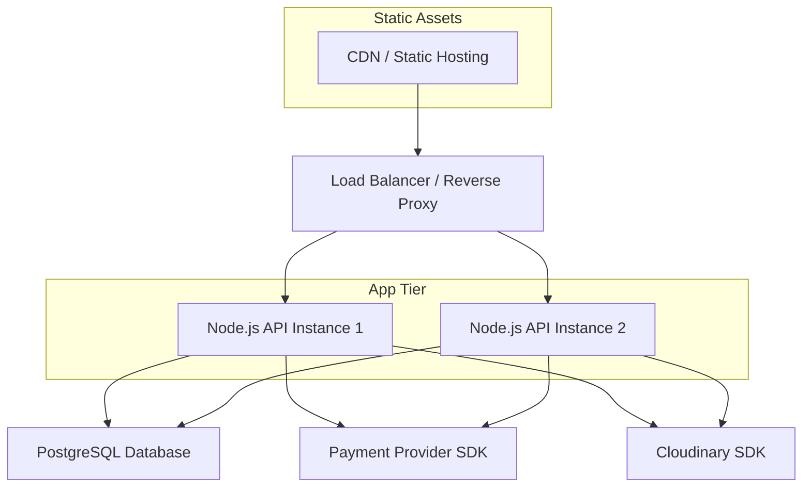
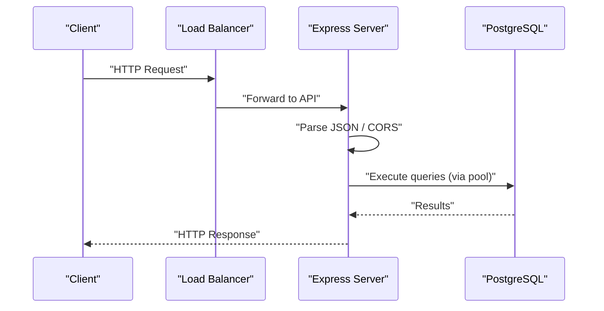
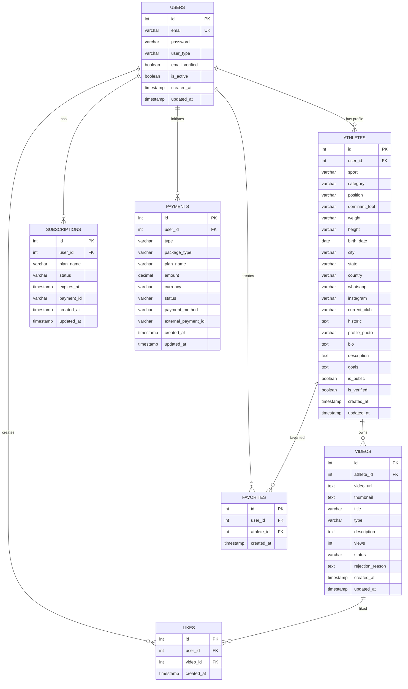
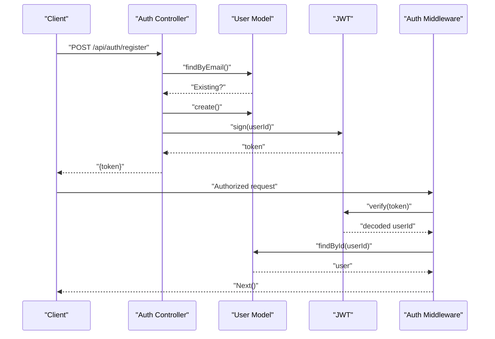

# Deployment and DevOps

<cite>
**Referenced Files in This Document**
- [README.md](file://README.md)
- [QUICKSTART.md](file://QUICKSTART.md)
- [backend/package.json](file://backend/package.json)
- [frontend/package.json](file://frontend/package.json)
- [backend/server.js](file://backend/server.js)
- [backend/config/database.js](file://backend/config/database.js)
- [database/schema.sql](file://database/schema.sql)
- [frontend/vite.config.js](file://frontend/vite.config.js)
- [backend/controllers/auth.controller.js](file://backend/controllers/auth.controller.js)
- [backend/middleware/auth.middleware.js](file://backend/middleware/auth.middleware.js)
</cite>

## Table of Contents
1. [Introduction](#introduction)
2. [Project Structure](#project-structure)
3. [Core Components](#core-components)
4. [Architecture Overview](#architecture-overview)
5. [Detailed Component Analysis](#detailed-component-analysis)
6. [Environment Preparation](#environment-preparation)
7. [Database Migration](#database-migration)
8. [Static Asset Building](#static-asset-building)
9. [Server Configuration](#server-configuration)
10. [Containerization Options](#containerization-options)
11. [Reverse Proxy Setup](#reverse-proxy-setup)
12. [SSL Certificate Configuration](#ssl-certificate-configuration)
13. [Load Balancing Considerations](#load-balancing-considerations)
14. [Monitoring and Logging Strategies](#monitoring-and-logging-strategies)
15. [Backup Procedures](#backup-procedures)
16. [Maintenance Tasks](#maintenance-tasks)
17. [CI/CD Pipeline Recommendations](#cicd-pipeline-recommendations)
18. [Automated Testing Integration](#automated-testing-integration)
19. [Rollback Procedures](#rollback-procedures)
20. [Scaling Considerations](#scaling-considerations)
21. [Performance Optimization for Production](#performance-optimization-for-production)
22. [Security Hardening Measures](#security-hardening-measures)
23. [Deployment Checklists](#deployment-checklists)
24. [Troubleshooting Guide](#troubleshooting-guide)
25. [Conclusion](#conclusion)

## Introduction
This document provides end-to-end deployment guidance for Craque-Vision, covering environment preparation, database setup, static asset builds, server configuration, containerization, reverse proxy, SSL, load balancing, monitoring/logging, backups, maintenance, CI/CD, testing, rollbacks, scaling, performance, security, and operational checklists. It is designed for both technical and non-technical audiences and references concrete files in the repository.

## Project Structure
Craque-Vision is a full-stack platform with:
- Backend: Node.js + Express serving REST APIs
- Frontend: React SPA built with Vite
- Database: PostgreSQL with a defined schema
- Environment variables managed via dotenv

**Diagram sources**
- [frontend/package.json:1-38](file://frontend/package.json#L1-L38)
- [frontend/vite.config.js:1-16](file://frontend/vite.config.js#L1-L16)
- [backend/package.json:1-25](file://backend/package.json#L1-L25)
- [backend/server.js:1-40](file://backend/server.js#L1-L40)
- [backend/config/database.js:1-13](file://backend/config/database.js#L1-L13)

**Section sources**
- [README.md:63-132](file://README.md#L63-L132)
- [QUICKSTART.md:1-80](file://QUICKSTART.md#L1-L80)

## Core Components
- Backend API server: Exposes REST endpoints under /api/* and serves a health endpoint at /
- Database connection: Uses pg Pool configured via environment variables
- Frontend build: Vite-based React app with development proxy to backend
- Authentication: JWT-based middleware with role-based authorization helpers
- Payment and media: Integrates external services via dependencies

Key runtime scripts and ports:
- Backend: start/development scripts and default port 5000
- Frontend: dev/build scripts and default dev server port 3000

**Section sources**
- [backend/server.js:1-40](file://backend/server.js#L1-L40)
- [backend/config/database.js:1-13](file://backend/config/database.js#L1-L13)
- [frontend/vite.config.js:1-16](file://frontend/vite.config.js#L1-L16)
- [backend/package.json:6-8](file://backend/package.json#L6-L8)
- [frontend/package.json:20-24](file://frontend/package.json#L20-L24)

## Architecture Overview
High-level deployment architecture for production:

[No sources needed since this diagram shows conceptual architecture]

## Detailed Component Analysis

### Backend API Server
- Initializes Express, loads CORS and JSON middleware
- Mounts route groups under /api/*
- Serves a root health endpoint
- Listens on configurable port

**Diagram sources**
- [backend/server.js:1-40](file://backend/server.js#L1-L40)
- [backend/config/database.js:1-13](file://backend/config/database.js#L1-L13)

**Section sources**
- [backend/server.js:1-40](file://backend/server.js#L1-L40)

### Database Connection and Schema
- Database pool configured via environment variables
- Schema defines users, athletes, videos, subscriptions, payments, favorites, likes with indexes and triggers

**Diagram sources**
- [database/schema.sql:1-185](file://database/schema.sql#L1-L185)

**Section sources**
- [backend/config/database.js:1-13](file://backend/config/database.js#L1-L13)
- [database/schema.sql:1-185](file://database/schema.sql#L1-L185)

### Authentication Flow
- Registration and login handled by auth controller
- JWT secret used for signing tokens
- Middleware validates bearer tokens and enforces roles

**Diagram sources**
- [backend/controllers/auth.controller.js:1-72](file://backend/controllers/auth.controller.js#L1-L72)
- [backend/middleware/auth.middleware.js:1-59](file://backend/middleware/auth.middleware.js#L1-L59)

**Section sources**
- [backend/controllers/auth.controller.js:1-72](file://backend/controllers/auth.controller.js#L1-L72)
- [backend/middleware/auth.middleware.js:1-59](file://backend/middleware/auth.middleware.js#L1-L59)

## Environment Preparation
- Backend prerequisites: Node.js v16+, PostgreSQL
- Create database and apply schema
- Configure environment variables (.env) for backend and frontend
- Set JWT secret and database credentials

Recommended steps:
- Provision PostgreSQL instance (managed or self-hosted)
- Create database and run schema
- Generate secure JWT secret
- Set production-safe CORS origins and API base URLs

**Section sources**
- [README.md:33-49](file://README.md#L33-L49)
- [QUICKSTART.md:5-13](file://QUICKSTART.md#L5-L13)
- [backend/config/database.js:4-10](file://backend/config/database.js#L4-L10)
- [backend/controllers/auth.controller.js:4-6](file://backend/controllers/auth.controller.js#L4-L6)

## Database Migration
- Use the provided SQL schema to initialize the database
- Apply schema during initial deployment and after schema changes
- Maintain versioning strategy (e.g., semantic versioned SQL files) and run-once scripts for production

Operational tips:
- Back up before applying schema updates
- Test schema changes in staging first
- Use transactions for destructive changes

**Section sources**
- [database/schema.sql:1-185](file://database/schema.sql#L1-L185)
- [QUICKSTART.md:7-13](file://QUICKSTART.md#L7-L13)

## Static Asset Building
- Build frontend for production using the build script
- Serve built assets via CDN or reverse proxy
- Ensure API proxying is disabled in production builds

Build commands and outputs:
- Frontend build script generates optimized static assets
- Serve assets from a static hosting provider or behind the reverse proxy

**Section sources**
- [frontend/package.json:20-24](file://frontend/package.json#L20-L24)
- [frontend/vite.config.js:1-16](file://frontend/vite.config.js#L1-L16)

## Server Configuration
- Backend runs on port 5000 by default
- Configure environment variables for production (database, JWT, payment providers)
- Enable HTTPS and enforce secure headers in production
- Set up process managers (PM2) and health checks

**Section sources**
- [backend/server.js:35-39](file://backend/server.js#L35-L39)
- [backend/package.json:6-8](file://backend/package.json#L6-L8)

## Containerization Options
- Build separate containers for backend and static assets
- Use multi-stage builds for smaller production images
- Define environment-specific Dockerfiles and docker-compose for local/dev

Containerization benefits:
- Consistent environments across stages
- Simplified scaling and rolling updates
- Easier secrets management with orchestration platforms

[No sources needed since this section provides general guidance]

## Reverse Proxy Setup
- Route frontend static assets and API traffic through a reverse proxy
- Configure CORS and origin policies
- Forward API requests to backend instances

Proxy recommendations:
- Use Nginx or Traefik
- Terminate TLS at the proxy
- Enable gzip/brotli compression for static assets

**Section sources**
- [frontend/vite.config.js:8-13](file://frontend/vite.config.js#L8-L13)

## SSL Certificate Configuration
- Obtain certificates from a trusted CA or ACME-compatible provider
- Configure the reverse proxy to serve HTTPS
- Redirect HTTP to HTTPS and set HSTS headers

Best practices:
- Use strong ciphers and protocols
- Automate renewal and monitor expiry
- Enforce secure cookies and referrer policies

[No sources needed since this section provides general guidance]

## Load Balancing Considerations
- Distribute traffic across multiple backend instances
- Use health checks to detect unhealthy nodes
- Persist sessions or use stateless JWT for horizontal scaling

Scaling patterns:
- Stateless backend with shared database
- Sticky sessions only if required by specific features
- Auto-scaling based on CPU/memory or request latency

**Section sources**
- [backend/server.js:35-39](file://backend/server.js#L35-L39)

## Monitoring and Logging Strategies
- Centralized logs for backend and proxy
- Health endpoints and metrics exposure
- Error tracking and alerting for critical failures

Monitoring checklist:
- Application logs (stdout/stderr)
- Database query performance and slow logs
- API response times and error rates
- Disk usage and memory/CPU utilization

**Section sources**
- [backend/server.js:28-33](file://backend/server.js#L28-L33)

## Backup Procedures
- Database backups: Schedule regular logical backups and test restores
- Static assets: Versioned deployments and immutable artifacts
- Secrets rotation: Rotate JWT secret and database credentials periodically

Backup strategy:
- Automated daily backups with retention
- Offsite storage and encryption at rest
- Recovery drills to validate restore procedures

**Section sources**
- [database/schema.sql:181-185](file://database/schema.sql#L181-L185)

## Maintenance Tasks
- Patch Node.js runtime and dependencies regularly
- Review and prune unused database indexes
- Monitor and tune PostgreSQL settings for workload

Routine tasks:
- Dependency audits and updates
- Database vacuum/analyze
- Log archival and cleanup

[No sources needed since this section provides general guidance]

## CI/CD Pipeline Recommendations
- Build and test frontend and backend independently
- Run linters, unit/integration tests, and security scans
- Deploy backend and frontend separately with atomic swaps
- Use blue/green or rolling deployments

Pipeline stages:
- Source checkout
- Install dependencies
- Lint and test
- Build artifacts
- Push images/tags
- Deploy to staging/production
- Post-deploy verification

[No sources needed since this section provides general guidance]

## Automated Testing Integration
- Backend: Add unit and integration tests with a test runner
- Frontend: Add component and E2E tests
- Include tests in CI pipeline and gate deployments

Testing coverage:
- API endpoints and business logic
- Authentication and authorization flows
- Payment and media upload flows

[No sources needed since this section provides general guidance]

## Rollback Procedures
- Keep previous image/tag and artifact versions
- Maintain reversible schema changes
- Use feature flags or canary releases to minimize risk

Rollback steps:
- Switch traffic back to previous healthy version
- Restore database from last known good backup
- Revert configuration changes

[No sources needed since this section provides general guidance]

## Scaling Considerations
- Scale horizontally by adding backend instances behind a load balancer
- Use read replicas for reporting workloads if needed
- Separate media uploads to external storage

Capacity planning:
- Track request volume and growth trends
- Right-size database and application resources
- Consider caching for frequently accessed data

[No sources needed since this section provides general guidance]

## Performance Optimization for Production
- Enable compression and caching headers
- Optimize database queries and add missing indexes
- Use CDN for static assets and reduce round trips
- Tune Node.js runtime and PostgreSQL settings

Optimization checklist:
- Minimize payload sizes
- Leverage browser caching
- Batch or paginate heavy queries
- Use connection pooling efficiently

**Section sources**
- [database/schema.sql:140-156](file://database/schema.sql#L140-L156)

## Security Hardening Measures
- Enforce HTTPS everywhere and secure headers
- Validate and sanitize all inputs
- Use least-privilege database accounts
- Rotate secrets regularly and avoid committing secrets to source control

Security controls:
- Rate limiting and WAF
- JWT expiration and refresh strategies
- Secure cookie flags and SameSite policies
- Network segmentation and firewall rules

**Section sources**
- [backend/middleware/auth.middleware.js:4-33](file://backend/middleware/auth.middleware.js#L4-L33)

## Deployment Checklists

### Development to Staging
- Build frontend and backend
- Apply database schema
- Configure environment variables
- Run smoke tests
- Deploy and verify health endpoints

### Staging to Production
- Promote approved build
- Verify database migrations
- Update DNS and routing
- Monitor metrics and logs
- Perform post-deployment checks

[No sources needed since this section provides general guidance]

## Troubleshooting Guide

Common issues and resolutions:
- Database connectivity errors: Verify host/port/user/password and network ACLs
- CORS failures: Confirm allowed origins and preflight handling
- JWT validation errors: Check secret consistency and token expiration
- API timeouts: Inspect reverse proxy timeouts and backend resource limits
- Static assets not loading: Validate build output and CDN configuration

Operational tips:
- Use health checks and readiness probes
- Capture and correlate logs across components
- Implement circuit breakers for dependent services

**Section sources**
- [backend/config/database.js:4-10](file://backend/config/database.js#L4-L10)
- [backend/middleware/auth.middleware.js:4-33](file://backend/middleware/auth.middleware.js#L4-L33)
- [frontend/vite.config.js:8-13](file://frontend/vite.config.js#L8-L13)

## Conclusion
This guide outlines a complete deployment strategy for Craque-Vision, from environment preparation through production operations. By following the outlined practices—secure configuration, robust monitoring, automated pipelines, and scalable architecture—you can reliably operate the platform in production while maintaining performance and security.