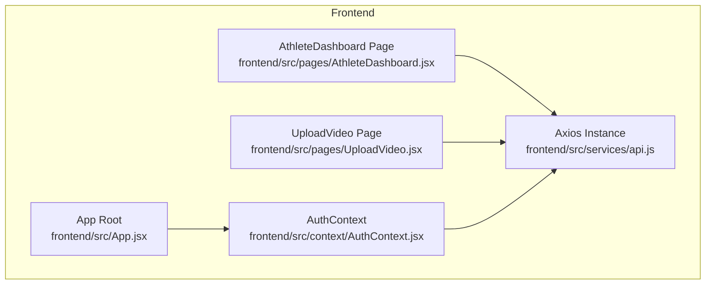
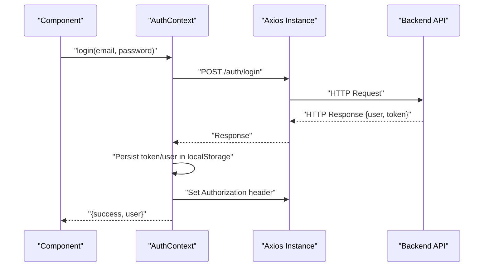
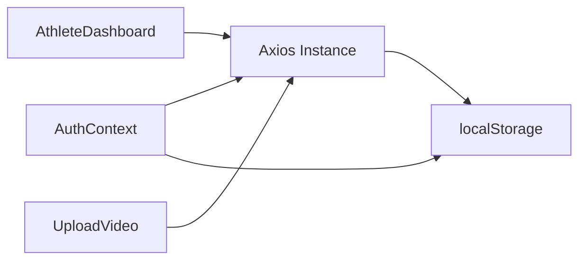

# API Integration

<cite>
**Referenced Files in This Document**
- [api.js](file://frontend/src/services/api.js)
- [AuthContext.jsx](file://frontend/src/context/AuthContext.jsx)
- [App.jsx](file://frontend/src/App.jsx)
- [AthleteDashboard.jsx](file://frontend/src/pages/AthleteDashboard.jsx)
- [UploadVideo.jsx](file://frontend/src/pages/UploadVideo.jsx)
- [README.md](file://README.md)
</cite>

## Table of Contents
1. [Introduction](#introduction)
2. [Project Structure](#project-structure)
3. [Core Components](#core-components)
4. [Architecture Overview](#architecture-overview)
5. [Detailed Component Analysis](#detailed-component-analysis)
6. [Dependency Analysis](#dependency-analysis)
7. [Performance Considerations](#performance-considerations)
8. [Troubleshooting Guide](#troubleshooting-guide)
9. [Conclusion](#conclusion)

## Introduction
This document explains the frontend API integration layer for the application. It covers the Axios configuration, authentication integration, and practical usage patterns across authentication, user management, athlete data, video operations, and payment-related flows. It also documents error handling strategies, loading states, request cancellation, retry mechanisms, and how the authentication context automatically injects tokens into requests.

## Project Structure
The frontend API integration centers around a shared Axios instance configured with request/response interceptors and an authentication context that manages user state and tokens. Pages consume the API client directly to perform authenticated operations.

**Diagram sources**
- [api.js:1-36](file://frontend/src/services/api.js#L1-L36)
- [AuthContext.jsx:1-91](file://frontend/src/context/AuthContext.jsx#L1-L91)
- [App.jsx:1-67](file://frontend/src/App.jsx#L1-L67)
- [AthleteDashboard.jsx:1-277](file://frontend/src/pages/AthleteDashboard.jsx#L1-L277)
- [UploadVideo.jsx:1-234](file://frontend/src/pages/UploadVideo.jsx#L1-L234)

**Section sources**
- [App.jsx:1-67](file://frontend/src/App.jsx#L1-L67)
- [api.js:1-36](file://frontend/src/services/api.js#L1-L36)
- [AuthContext.jsx:1-91](file://frontend/src/context/AuthContext.jsx#L1-L91)

## Core Components
- Axios instance with base URL and interceptors:
  - Base URL is derived from an environment variable with a fallback.
  - Request interceptor attaches Authorization header when a token exists.
  - Response interceptor handles 401 Unauthorized by clearing credentials and redirecting to login.
- Authentication context:
  - Persists user and token in localStorage.
  - Sets Authorization header globally on the Axios instance.
  - Provides login, register, and logout functions.
  - Exposes authentication state to components.

Key behaviors:
- Automatic token injection: The request interceptor reads the token from localStorage and sets the Authorization header for every outgoing request.
- Centralized 401 handling: On receiving a 401, the response interceptor clears stored credentials and navigates to the login page.
- Global header synchronization: When logging in or on initial load, the context updates the Axios defaults so all subsequent requests include the Authorization header.

**Section sources**
- [api.js:3-8](file://frontend/src/services/api.js#L3-L8)
- [api.js:10-21](file://frontend/src/services/api.js#L10-L21)
- [api.js:23-33](file://frontend/src/services/api.js#L23-L33)
- [AuthContext.jsx:10-19](file://frontend/src/context/AuthContext.jsx#L10-L19)
- [AuthContext.jsx:21-38](file://frontend/src/context/AuthContext.jsx#L21-L38)
- [AuthContext.jsx:39-57](file://frontend/src/context/AuthContext.jsx#L39-L57)
- [AuthContext.jsx:59-64](file://frontend/src/context/AuthContext.jsx#L59-L64)

## Architecture Overview
The API integration follows a layered pattern:
- Application pages depend on the shared Axios instance for HTTP calls.
- The authentication context manages credentials and ensures Authorization headers are present.
- Interceptors handle cross-cutting concerns like token injection and authentication failure.

**Diagram sources**
- [AuthContext.jsx:21-38](file://frontend/src/context/AuthContext.jsx#L21-L38)
- [api.js:3-8](file://frontend/src/services/api.js#L3-L8)
- [api.js:10-21](file://frontend/src/services/api.js#L10-L21)

## Detailed Component Analysis

### Axios Configuration
- Base URL:
  - Uses an environment variable for the API endpoint with a sensible fallback.
- Headers:
  - Sets Content-Type to application/json by default.
- Request interceptor:
  - Reads token from localStorage and adds Authorization: Bearer <token>.
- Response interceptor:
  - Detects 401 status and clears token/user from localStorage, then redirects to login.

Practical implications:
- All authenticated routes are protected automatically.
- Unauthorized sessions are handled centrally without repeating logic in components.

**Section sources**
- [api.js:3-8](file://frontend/src/services/api.js#L3-L8)
- [api.js:10-21](file://frontend/src/services/api.js#L10-L21)
- [api.js:23-33](file://frontend/src/services/api.js#L23-L33)

### Authentication Context Integration
- Initialization:
  - On app startup, if token and user exist in localStorage, the context sets the Authorization header globally and hydrates user state.
- Login:
  - Posts credentials to the backend, receives user and token, persists them, sets global Authorization header, and updates context state.
- Register:
  - Similar flow to login but for registration.
- Logout:
  - Removes token and user from storage and deletes the Authorization header from Axios defaults.

Usage in components:
- Components call the context methods to authenticate and receive user state.
- The Axios instance automatically includes the Authorization header for all requests.

**Section sources**
- [AuthContext.jsx:10-19](file://frontend/src/context/AuthContext.jsx#L10-L19)
- [AuthContext.jsx:21-38](file://frontend/src/context/AuthContext.jsx#L21-L38)
- [AuthContext.jsx:40-57](file://frontend/src/context/AuthContext.jsx#L40-L57)
- [AuthContext.jsx:59-64](file://frontend/src/context/AuthContext.jsx#L59-L64)
- [App.jsx:20-24](file://frontend/src/App.jsx#L20-L24)

### API Services and Usage Patterns
While the shared Axios instance serves as the primary service, the following patterns are demonstrated across pages:

- Athlete dashboard:
  - Fetches athlete profile and videos concurrently.
  - Manages loading state and error logging.
  - Uses the shared Axios instance for GET requests.

- Upload video:
  - Handles form submission, loading state, success/error messages.
  - Uses the shared Axios instance for POST requests.

These patterns illustrate:
- Loading states: Boolean flags to disable UI and show spinners.
- Error handling: Capturing error.response.data.error for user-friendly messages.
- Response handling: Using response.data for successful outcomes.

**Section sources**
- [AthleteDashboard.jsx:22-35](file://frontend/src/pages/AthleteDashboard.jsx#L22-L35)
- [UploadVideo.jsx:43-60](file://frontend/src/pages/UploadVideo.jsx#L43-L60)

### Authentication Integration Details
- Token propagation:
  - Request interceptor reads token from localStorage and sets Authorization header.
  - Context also sets the Authorization header on Axios defaults after login or on initialization.
- 401 handling:
  - Response interceptor removes token/user and redirects to login when the server responds with 401.

This ensures:
- Consistent authentication across all requests.
- Automatic session invalidation on unauthorized responses.

**Section sources**
- [api.js:10-21](file://frontend/src/services/api.js#L10-L21)
- [api.js:23-33](file://frontend/src/services/api.js#L23-L33)
- [AuthContext.jsx:14-16](file://frontend/src/context/AuthContext.jsx#L14-L16)
- [AuthContext.jsx:28-28](file://frontend/src/context/AuthContext.jsx#L28-L28)

### API Surface and Endpoint Mapping
The frontend consumes the backend API documented in the project’s README. The following endpoints are used by the current pages and context:

- Authentication
  - POST /api/auth/login
  - POST /api/auth/register
- Athletes
  - GET /api/athletes/profile
- Videos
  - GET /api/videos/my-videos
  - POST /api/videos

Note: Payment-related endpoints are documented in the README but not currently used in the provided frontend files.

**Section sources**
- [README.md:134-171](file://README.md#L134-L171)
- [AuthContext.jsx:23-23](file://frontend/src/context/AuthContext.jsx#L23-L23)
- [AuthContext.jsx:42-42](file://frontend/src/context/AuthContext.jsx#L42-L42)
- [AthleteDashboard.jsx:25-26](file://frontend/src/pages/AthleteDashboard.jsx#L25-L26)
- [UploadVideo.jsx:50-50](file://frontend/src/pages/UploadVideo.jsx#L50-L50)

## Dependency Analysis
The API integration depends on:
- Axios for HTTP transport and interceptors.
- LocalStorage for persisting tokens and user data.
- React Context for sharing authentication state and actions.

**Diagram sources**
- [api.js:1-36](file://frontend/src/services/api.js#L1-L36)
- [AuthContext.jsx:1-91](file://frontend/src/context/AuthContext.jsx#L1-L91)
- [AthleteDashboard.jsx:1-277](file://frontend/src/pages/AthleteDashboard.jsx#L1-L277)
- [UploadVideo.jsx:1-234](file://frontend/src/pages/UploadVideo.jsx#L1-L234)

**Section sources**
- [api.js:1-36](file://frontend/src/services/api.js#L1-L36)
- [AuthContext.jsx:1-91](file://frontend/src/context/AuthContext.jsx#L1-L91)
- [AthleteDashboard.jsx:1-277](file://frontend/src/pages/AthleteDashboard.jsx#L1-L277)
- [UploadVideo.jsx:1-234](file://frontend/src/pages/UploadVideo.jsx#L1-L234)

## Performance Considerations
- Concurrent requests: The athlete dashboard fetches multiple resources in parallel to reduce total load time.
- Minimal overhead: Interceptors avoid heavy computation and only attach Authorization headers when a token exists.
- Local caching: The context caches user data in memory and persists tokens to localStorage to avoid repeated logins.

[No sources needed since this section provides general guidance]

## Troubleshooting Guide
Common scenarios and resolutions:
- 401 Unauthorized
  - Symptom: Redirect to login and loss of user session.
  - Cause: Response interceptor detects 401 and clears credentials.
  - Resolution: Re-authenticate to restore session.
- Network failures
  - Symptom: Requests fail without a specific status.
  - Resolution: Retry after checking connectivity; implement retry logic at the caller level if needed.
- Authentication errors
  - Symptom: Login/register returns an error message.
  - Resolution: Display the message returned by the server and prompt the user to correct credentials or registration data.
- Missing Authorization header
  - Symptom: Authenticated endpoints fail.
  - Resolution: Ensure the context has persisted a token and set the Authorization header; verify localStorage contains the token.

**Section sources**
- [api.js:23-33](file://frontend/src/services/api.js#L23-L33)
- [AuthContext.jsx:21-38](file://frontend/src/context/AuthContext.jsx#L21-L38)
- [AuthContext.jsx:40-57](file://frontend/src/context/AuthContext.jsx#L40-L57)
- [UploadVideo.jsx:55-56](file://frontend/src/pages/UploadVideo.jsx#L55-L56)

## Conclusion
The frontend API integration layer provides a robust, centralized mechanism for HTTP communication:
- Axios configuration ensures consistent base URL and automatic token injection.
- Interceptors handle authentication failures uniformly.
- The authentication context synchronizes credentials and state across the app.
- Pages demonstrate best practices for loading states, error handling, and response processing.