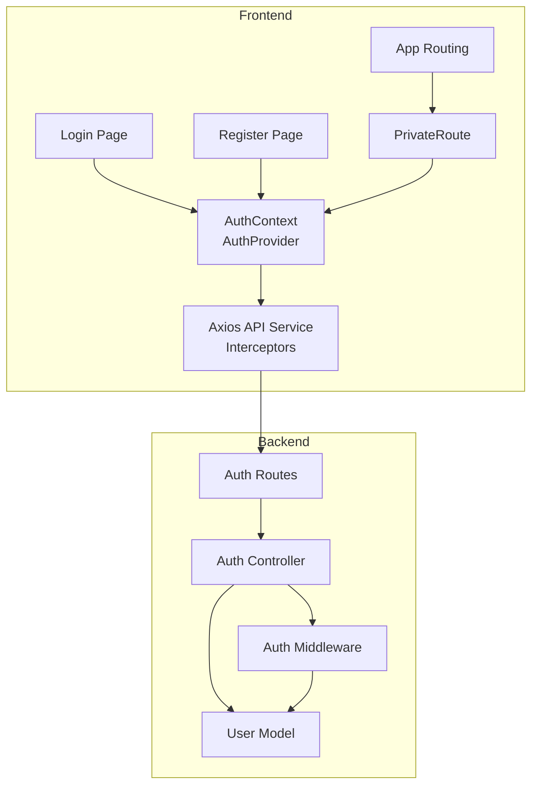
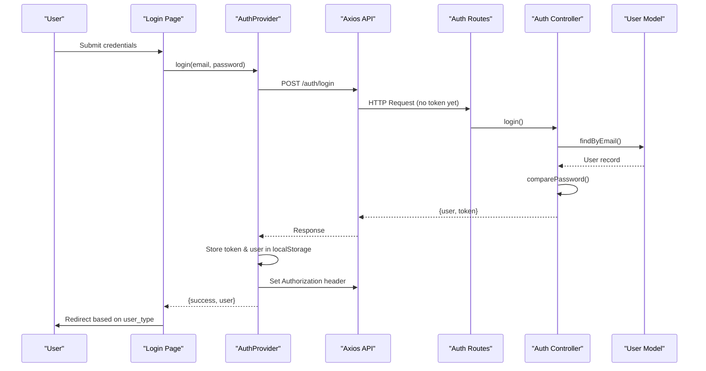
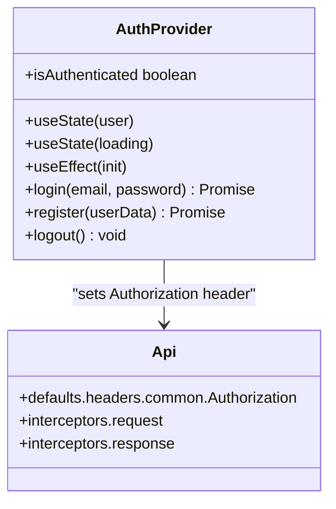
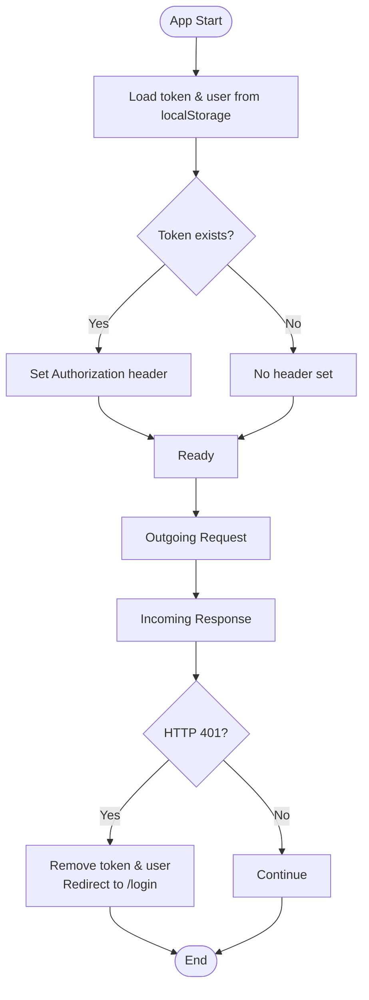
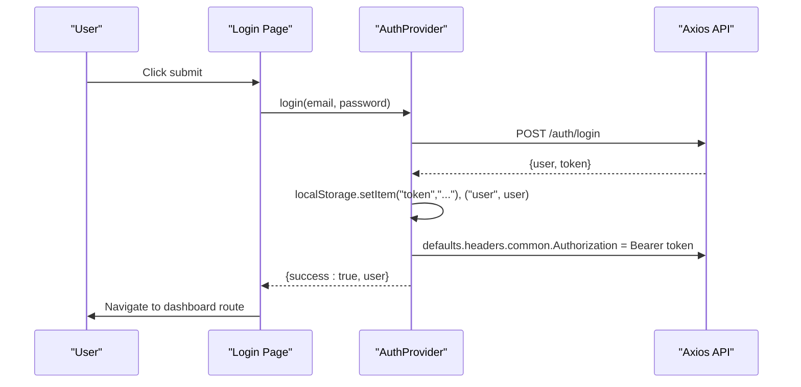
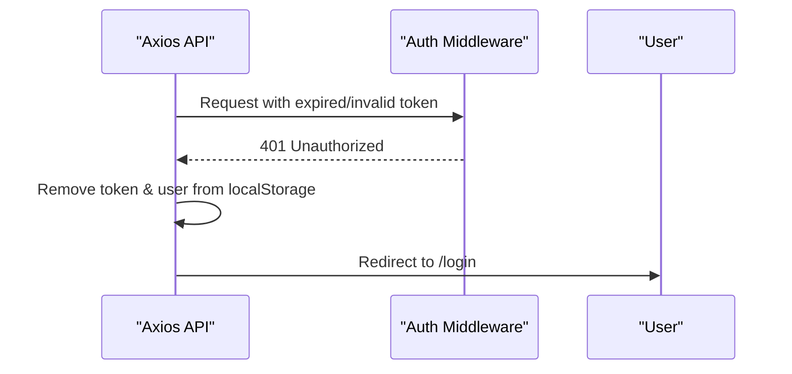
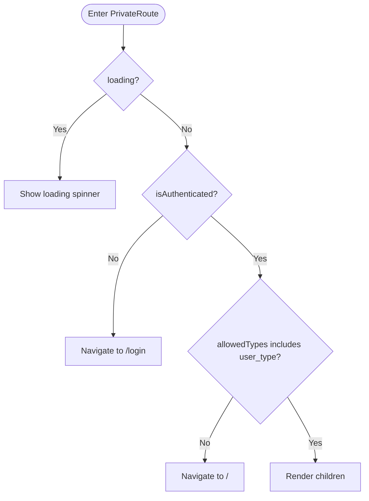
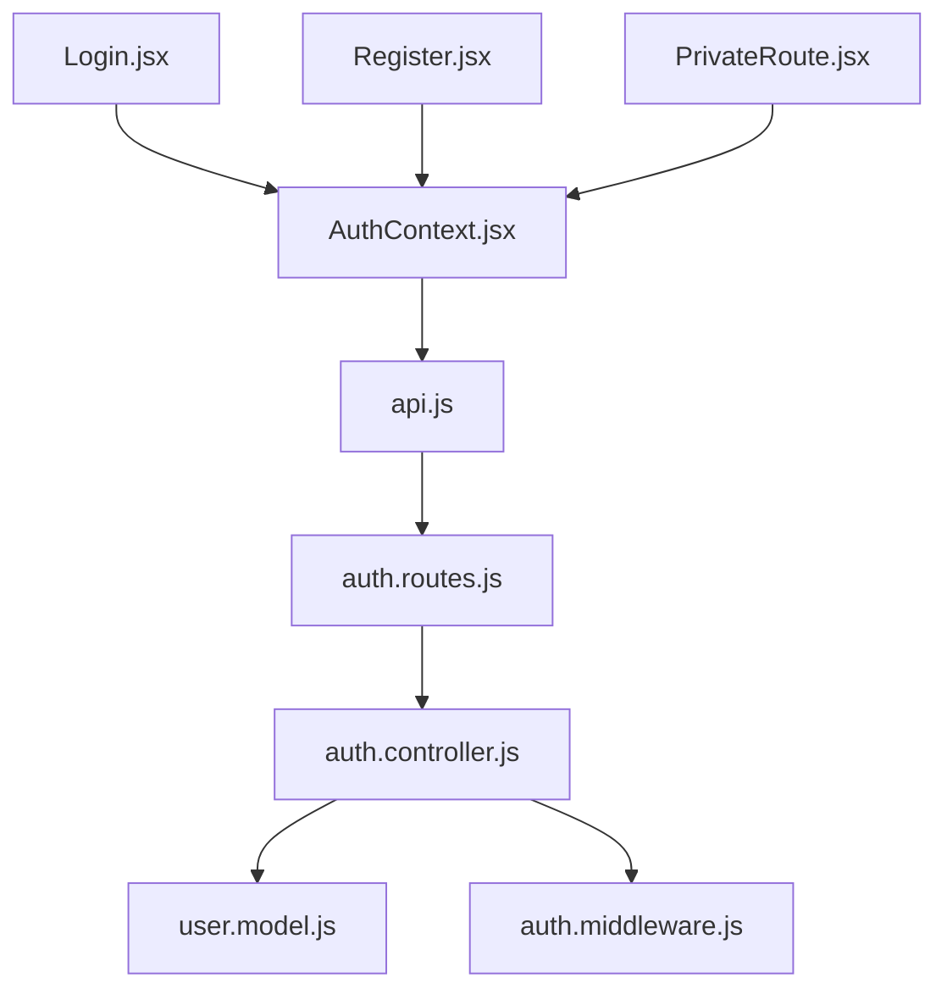

# Authentication Context

<cite>
**Referenced Files in This Document**
- [AuthContext.jsx](file://frontend/src/context/AuthContext.jsx)
- [PrivateRoute.jsx](file://frontend/src/components/PrivateRoute.jsx)
- [api.js](file://frontend/src/services/api.js)
- [App.jsx](file://frontend/src/App.jsx)
- [Login.jsx](file://frontend/src/pages/Login.jsx)
- [Register.jsx](file://frontend/src/pages/Register.jsx)
- [auth.controller.js](file://backend/controllers/auth.controller.js)
- [auth.middleware.js](file://backend/middleware/auth.middleware.js)
- [user.model.js](file://backend/models/user.model.js)
- [auth.routes.js](file://backend/routes/auth.routes.js)
</cite>

## Table of Contents
1. [Introduction](#introduction)
2. [Project Structure](#project-structure)
3. [Core Components](#core-components)
4. [Architecture Overview](#architecture-overview)
5. [Detailed Component Analysis](#detailed-component-analysis)
6. [Dependency Analysis](#dependency-analysis)
7. [Performance Considerations](#performance-considerations)
8. [Troubleshooting Guide](#troubleshooting-guide)
9. [Conclusion](#conclusion)

## Introduction
This document explains the authentication context system in Craque-Vision, focusing on the React context implementation, JWT token lifecycle, session persistence, and route protection. It covers the authentication state structure, login/logout flows, automatic logout on token expiration, and the PrivateRoute component for role-based access control. Practical examples demonstrate hook usage, protected component rendering, and error handling for unauthorized access attempts.

## Project Structure
The authentication system spans the frontend React application and the backend Express server:
- Frontend: React context for authentication state, Axios service with interceptors, login/register pages, and route protection via PrivateRoute.
- Backend: Authentication controller, JWT middleware, and user model for secure endpoints.

**Diagram sources**
- [AuthContext.jsx:1-91](file://frontend/src/context/AuthContext.jsx#L1-L91)
- [PrivateRoute.jsx:1-27](file://frontend/src/components/PrivateRoute.jsx#L1-L27)
- [api.js:1-36](file://frontend/src/services/api.js#L1-L36)
- [App.jsx:1-67](file://frontend/src/App.jsx#L1-L67)
- [auth.controller.js:1-72](file://backend/controllers/auth.controller.js#L1-L72)
- [auth.middleware.js:1-59](file://backend/middleware/auth.middleware.js#L1-L59)
- [user.model.js:1-42](file://backend/models/user.model.js#L1-L42)
- [auth.routes.js:1-10](file://backend/routes/auth.routes.js#L1-L10)

**Section sources**
- [AuthContext.jsx:1-91](file://frontend/src/context/AuthContext.jsx#L1-L91)
- [PrivateRoute.jsx:1-27](file://frontend/src/components/PrivateRoute.jsx#L1-L27)
- [api.js:1-36](file://frontend/src/services/api.js#L1-L36)
- [App.jsx:1-67](file://frontend/src/App.jsx#L1-L67)
- [auth.controller.js:1-72](file://backend/controllers/auth.controller.js#L1-L72)
- [auth.middleware.js:1-59](file://backend/middleware/auth.middleware.js#L1-L59)
- [user.model.js:1-42](file://backend/models/user.model.js#L1-L42)
- [auth.routes.js:1-10](file://backend/routes/auth.routes.js#L1-L10)

## Core Components
- AuthProvider: Manages authentication state, persists tokens and user data in localStorage, and exposes login/register/logout functions.
- useAuth: Hook to consume authentication context and enforce provider presence.
- Axios API service: Centralized HTTP client with request/response interceptors for token injection and automatic logout on 401.
- PrivateRoute: Route wrapper enforcing authentication and role-based access control.
- Login/Register pages: UI flows invoking AuthProvider methods and redirecting based on user type.

Key authentication state structure:
- user: Current logged-in user object (id, name, email, user_type).
- isAuthenticated: Boolean derived from user presence.
- loading: Indicates initialization completion.
- login, register, logout: Methods to manage authentication lifecycle.

**Section sources**
- [AuthContext.jsx:6-88](file://frontend/src/context/AuthContext.jsx#L6-L88)
- [api.js:10-33](file://frontend/src/services/api.js#L10-L33)
- [PrivateRoute.jsx:4-24](file://frontend/src/components/PrivateRoute.jsx#L4-L24)
- [Login.jsx:15-45](file://frontend/src/pages/Login.jsx#L15-L45)
- [Register.jsx:22-91](file://frontend/src/pages/Register.jsx#L22-L91)

## Architecture Overview
The authentication flow integrates frontend context and backend middleware:
- Frontend initializes from localStorage, sets Authorization header, and handles 401 responses by clearing session and redirecting.
- Backend verifies JWT, attaches user to request, and enforces role-based authorization.

**Diagram sources**
- [Login.jsx:25-45](file://frontend/src/pages/Login.jsx#L25-L45)
- [AuthContext.jsx:21-38](file://frontend/src/context/AuthContext.jsx#L21-L38)
- [auth.controller.js:30-59](file://backend/controllers/auth.controller.js#L30-L59)
- [user.model.js:20-38](file://backend/models/user.model.js#L20-L38)

**Section sources**
- [AuthContext.jsx:10-19](file://frontend/src/context/AuthContext.jsx#L10-L19)
- [api.js:10-21](file://frontend/src/services/api.js#L10-L21)
- [auth.controller.js:4-6](file://backend/controllers/auth.controller.js#L4-L6)

## Detailed Component Analysis

### AuthProvider Implementation
AuthContext manages:
- Initialization: Reads token and user from localStorage on mount; sets Authorization header if present.
- Login: Posts credentials to backend, stores returned token/user, updates headers, and sets user state.
- Register: Posts user data to backend, stores token/user, updates headers, and sets user state.
- Logout: Removes token/user from localStorage, clears Authorization header, and resets user state.
- State exposure: Provides user, isAuthenticated, loading, login, register, logout.

**Diagram sources**
- [AuthContext.jsx:6-88](file://frontend/src/context/AuthContext.jsx#L6-L88)
- [api.js:10-33](file://frontend/src/services/api.js#L10-L33)

**Section sources**
- [AuthContext.jsx:6-88](file://frontend/src/context/AuthContext.jsx#L6-L88)

### JWT Token Management and Session Persistence
- Token storage: localStorage keys "token" and "user".
- Header injection: Request interceptor reads token and adds Authorization header; response interceptor detects 401 to auto-logout.
- Token lifetime: Backend generates JWT with 7-day expiry.

**Diagram sources**
- [AuthContext.jsx:10-19](file://frontend/src/context/AuthContext.jsx#L10-L19)
- [api.js:10-33](file://frontend/src/services/api.js#L10-L33)

**Section sources**
- [AuthContext.jsx:10-19](file://frontend/src/context/AuthContext.jsx#L10-L19)
- [api.js:10-33](file://frontend/src/services/api.js#L10-L33)
- [auth.controller.js:4-6](file://backend/controllers/auth.controller.js#L4-L6)

### Authentication State Structure
- user: Contains id, name, email, user_type.
- isAuthenticated: True when user is present.
- loading: False after initial check completes.
- login/register: Return { success, user } on success or { success, error } on failure.
- logout: Clears session and Authorization header.

Practical usage examples:
- Login page invokes useAuth().login and redirects based on user_type.
- Protected routes wrap children with PrivateRoute and specify allowedTypes.

**Section sources**
- [AuthContext.jsx:66-73](file://frontend/src/context/AuthContext.jsx#L66-L73)
- [Login.jsx:15-45](file://frontend/src/pages/Login.jsx#L15-L45)
- [App.jsx:36-55](file://frontend/src/App.jsx#L36-L55)

### Login and Logout Functionality
- Login: Submits credentials, receives token/user, stores them, sets Authorization header, updates state, and redirects.
- Logout: Removes token/user, clears Authorization header, and resets state.

**Diagram sources**
- [Login.jsx:25-45](file://frontend/src/pages/Login.jsx#L25-L45)
- [AuthContext.jsx:21-38](file://frontend/src/context/AuthContext.jsx#L21-L38)

**Section sources**
- [Login.jsx:25-45](file://frontend/src/pages/Login.jsx#L25-L45)
- [AuthContext.jsx:59-64](file://frontend/src/context/AuthContext.jsx#L59-L64)

### Token Refresh Mechanisms
- No explicit token refresh mechanism is implemented in the current codebase.
- The frontend relies on the Authorization header injected by the API service and automatically logs out on 401 responses.

Recommendation:
- Implement a refresh endpoint and a refresh token strategy if long-lived sessions are required.

**Section sources**
- [api.js:10-33](file://frontend/src/services/api.js#L10-L33)

### Automatic Logout on Token Expiration
- Backend middleware verifies JWT and returns 401 for expired or invalid tokens.
- Frontend response interceptor removes token/user and redirects to /login on 401.

**Diagram sources**
- [auth.middleware.js:24-32](file://backend/middleware/auth.middleware.js#L24-L32)
- [api.js:23-33](file://frontend/src/services/api.js#L23-L33)

**Section sources**
- [auth.middleware.js:24-32](file://backend/middleware/auth.middleware.js#L24-L32)
- [api.js:23-33](file://frontend/src/services/api.js#L23-L33)

### PrivateRoute Component for Role-Based Access Control
PrivateRoute enforces:
- Authentication: Blocks unauthenticated users and redirects to /login.
- Role-based access: Checks user.user_type against allowedTypes; denies access otherwise.
- Loading state: Renders a spinner while authentication state resolves.

**Diagram sources**
- [PrivateRoute.jsx:4-24](file://frontend/src/components/PrivateRoute.jsx#L4-L24)

**Section sources**
- [PrivateRoute.jsx:4-24](file://frontend/src/components/PrivateRoute.jsx#L4-L24)
- [App.jsx:36-55](file://frontend/src/App.jsx#L36-L55)

### Authentication Hooks Usage Examples
- useAuth() inside Login.jsx to call login(email, password) and handle errors.
- useAuth() inside components to access user, isAuthenticated, and trigger logout.
- useAuth() inside PrivateRoute to enforce authentication and role checks.

Practical examples:
- Login form submission triggers login and redirects based on user_type.
- Protected route wrappers ensure only authorized users can access dashboards.

**Section sources**
- [Login.jsx:15-45](file://frontend/src/pages/Login.jsx#L15-L45)
- [PrivateRoute.jsx:5](file://frontend/src/components/PrivateRoute.jsx#L5)
- [App.jsx:36-55](file://frontend/src/App.jsx#L36-L55)

### Protected Component Rendering
Protected routes are declared in App.jsx with PrivateRoute wrappers:
- Athlete dashboard: allowedTypes includes "athlete".
- Scout/club dashboard: allowedTypes includes "scout" and "club".
- Admin dashboard: allowedTypes includes "admin".

**Section sources**
- [App.jsx:36-55](file://frontend/src/App.jsx#L36-L55)

## Dependency Analysis
Frontend dependencies:
- React context for state management.
- Axios for HTTP requests with interceptors.
- react-router-dom for routing and navigation.

Backend dependencies:
- jsonwebtoken for JWT signing/verification.
- bcryptjs for password hashing.
- express for route handlers and middleware.

**Diagram sources**
- [AuthContext.jsx:1-3](file://frontend/src/context/AuthContext.jsx#L1-L3)
- [api.js:1-8](file://frontend/src/services/api.js#L1-L8)
- [auth.routes.js:1-10](file://backend/routes/auth.routes.js#L1-L10)
- [auth.controller.js:1-2](file://backend/controllers/auth.controller.js#L1-L2)
- [user.model.js:1-3](file://backend/models/user.model.js#L1-L3)
- [auth.middleware.js:1-3](file://backend/middleware/auth.middleware.js#L1-L3)

**Section sources**
- [AuthContext.jsx:1-3](file://frontend/src/context/AuthContext.jsx#L1-L3)
- [api.js:1-8](file://frontend/src/services/api.js#L1-L8)
- [auth.routes.js:1-10](file://backend/routes/auth.routes.js#L1-L10)
- [auth.controller.js:1-2](file://backend/controllers/auth.controller.js#L1-L2)
- [user.model.js:1-3](file://backend/models/user.model.js#L1-L3)
- [auth.middleware.js:1-3](file://backend/middleware/auth.middleware.js#L1-L3)

## Performance Considerations
- Avoid unnecessary re-renders by keeping authentication state minimal and granular.
- Debounce or batch login/register calls to prevent redundant network requests.
- Consider lazy-loading heavy dashboard components after authentication to improve initial load times.

## Troubleshooting Guide
Common issues and resolutions:
- Missing AuthProvider: useAuth throws an error if called outside AuthProvider. Ensure the app is wrapped with AuthProvider.
- 401 Unauthorized: Interceptor clears token/user and redirects to /login. Verify JWT secret and token validity.
- Role access denied: PrivateRoute navigates to home when user_type is not in allowedTypes. Confirm user_type values match backend records.
- Password validation: Backend compares hashed passwords; ensure bcrypt is properly configured.

**Section sources**
- [AuthContext.jsx:82-88](file://frontend/src/context/AuthContext.jsx#L82-L88)
- [api.js:23-33](file://frontend/src/services/api.js#L23-L33)
- [PrivateRoute.jsx:15-21](file://frontend/src/components/PrivateRoute.jsx#L15-L21)
- [auth.middleware.js:24-32](file://backend/middleware/auth.middleware.js#L24-L32)

## Conclusion
Craque-Vision implements a robust authentication context with JWT-based session management, localStorage persistence, and role-aware route protection. The system initializes from stored credentials, injects Authorization headers, and automatically handles logout on token expiration. PrivateRoute ensures only authorized users access protected areas, with clear redirection paths for unauthenticated or unauthorized users. Future enhancements could include token refresh and extended error messaging for improved UX.