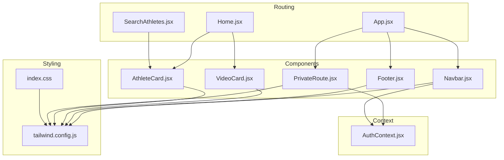
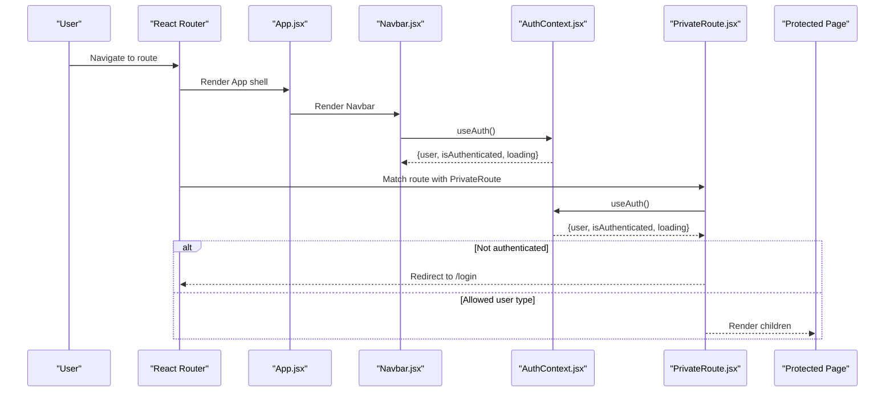
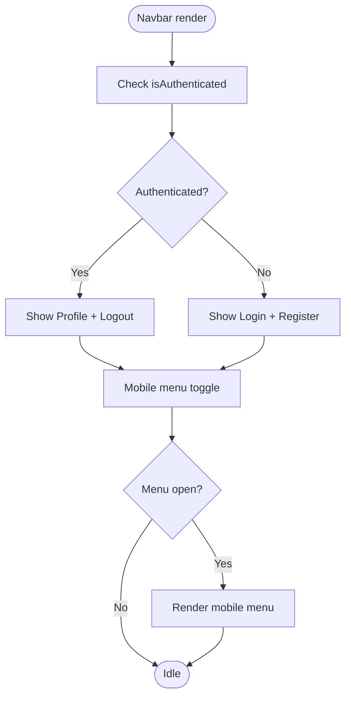
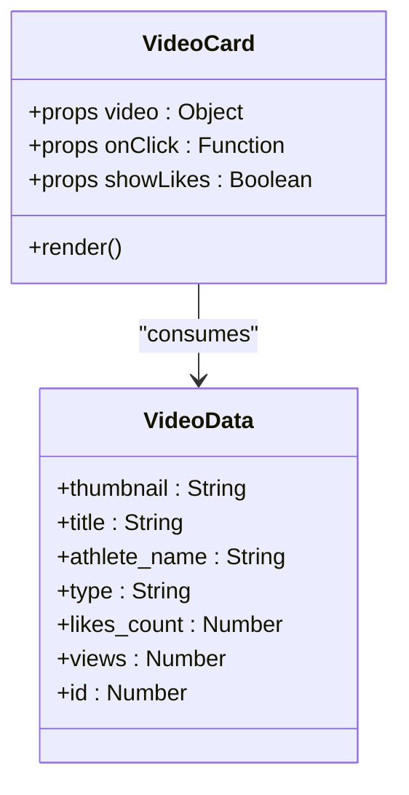
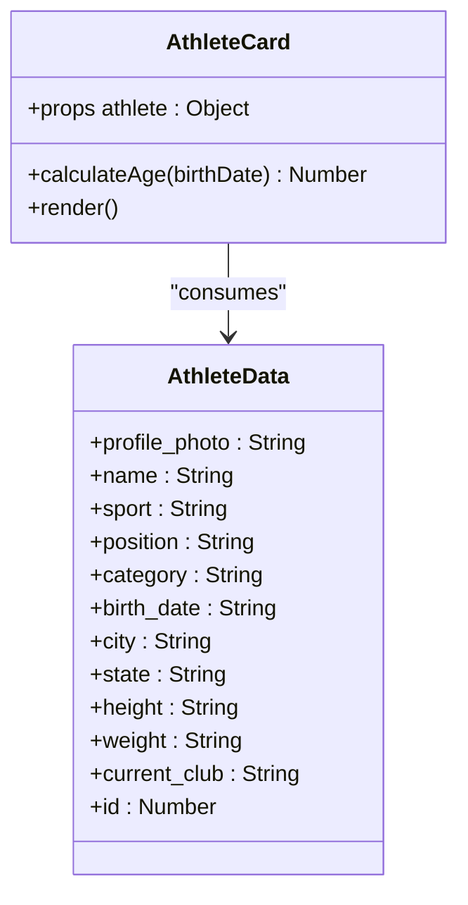
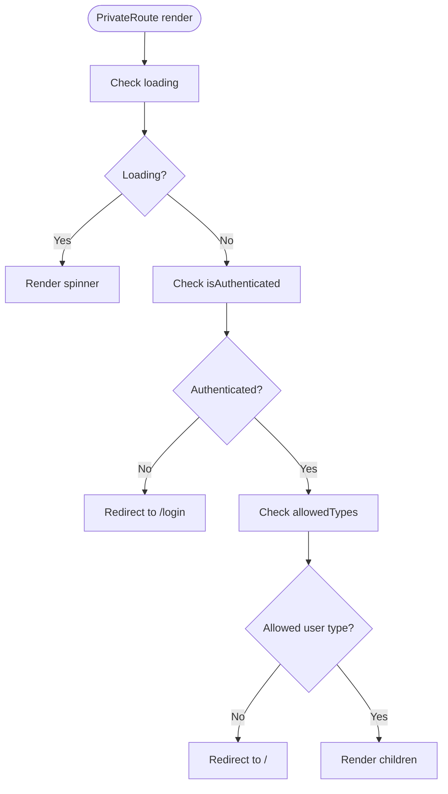
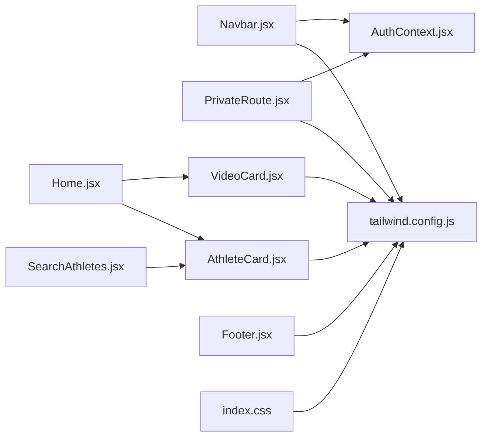

# Component Library

<cite>
**Referenced Files in This Document**
- [Navbar.jsx](file://frontend/src/components/Navbar.jsx)
- [Footer.jsx](file://frontend/src/components/Footer.jsx)
- [VideoCard.jsx](file://frontend/src/components/VideoCard.jsx)
- [AthleteCard.jsx](file://frontend/src/components/AthleteCard.jsx)
- [PrivateRoute.jsx](file://frontend/src/components/PrivateRoute.jsx)
- [AuthContext.jsx](file://frontend/src/context/AuthContext.jsx)
- [App.jsx](file://frontend/src/App.jsx)
- [Home.jsx](file://frontend/src/pages/Home.jsx)
- [SearchAthletes.jsx](file://frontend/src/pages/SearchAthletes.jsx)
- [tailwind.config.js](file://frontend/tailwind.config.js)
- [index.css](file://frontend/src/index.css)
</cite>

## Table of Contents
1. [Introduction](#introduction)
2. [Project Structure](#project-structure)
3. [Core Components](#core-components)
4. [Architecture Overview](#architecture-overview)
5. [Detailed Component Analysis](#detailed-component-analysis)
6. [Dependency Analysis](#dependency-analysis)
7. [Performance Considerations](#performance-considerations)
8. [Troubleshooting Guide](#troubleshooting-guide)
9. [Conclusion](#conclusion)

## Introduction
This document describes the Craque-Vision component library with a focus on the Navbar, Footer, VideoCard, AthleteCard, and PrivateRoute components. It explains navigation links, responsive design, user menu functionality, footer layout and copyright, video card display with thumbnails and metadata, athlete profile cards with stats and linking, and role-based access control. It also documents component props, Tailwind CSS styling patterns, responsive behavior, and integration examples with other components.

## Project Structure
The component library resides in the frontend/src/components directory and integrates with routing, context, and page components. The Tailwind CSS configuration defines the design tokens and color palette used across components.

**Diagram sources**
- [App.jsx:1-67](file://frontend/src/App.jsx#L1-L67)
- [Navbar.jsx:1-130](file://frontend/src/components/Navbar.jsx#L1-L130)
- [Footer.jsx:1-112](file://frontend/src/components/Footer.jsx#L1-L112)
- [VideoCard.jsx:1-48](file://frontend/src/components/VideoCard.jsx#L1-L48)
- [AthleteCard.jsx:1-92](file://frontend/src/components/AthleteCard.jsx#L1-L92)
- [PrivateRoute.jsx:1-27](file://frontend/src/components/PrivateRoute.jsx#L1-L27)
- [AuthContext.jsx:1-91](file://frontend/src/context/AuthContext.jsx#L1-L91)
- [Home.jsx:1-231](file://frontend/src/pages/Home.jsx#L1-L231)
- [SearchAthletes.jsx:1-218](file://frontend/src/pages/SearchAthletes.jsx#L1-L218)
- [tailwind.config.js:1-28](file://frontend/tailwind.config.js#L1-L28)
- [index.css:1-85](file://frontend/src/index.css#L1-L85)

**Section sources**
- [App.jsx:1-67](file://frontend/src/App.jsx#L1-L67)
- [tailwind.config.js:1-28](file://frontend/tailwind.config.js#L1-L28)
- [index.css:1-85](file://frontend/src/index.css#L1-L85)

## Core Components
This section summarizes the purpose and key capabilities of each component.

- Navbar: Provides top navigation with responsive mobile menu, authentication-aware links, and user actions.
- Footer: Displays brand identity, site sections, social links, and copyright information.
- VideoCard: Renders a video thumbnail with overlay play indicator, type badge, title, optional athlete name, and engagement metrics.
- AthleteCard: Renders an athlete profile preview with photo, sport badge, name, position/category tags, personal stats, and city/state, plus a current club indicator.
- PrivateRoute: Guards routes by requiring authentication and enforcing allowed user types.

**Section sources**
- [Navbar.jsx:1-130](file://frontend/src/components/Navbar.jsx#L1-L130)
- [Footer.jsx:1-112](file://frontend/src/components/Footer.jsx#L1-L112)
- [VideoCard.jsx:1-48](file://frontend/src/components/VideoCard.jsx#L1-L48)
- [AthleteCard.jsx:1-92](file://frontend/src/components/AthleteCard.jsx#L1-L92)
- [PrivateRoute.jsx:1-27](file://frontend/src/components/PrivateRoute.jsx#L1-L27)

## Architecture Overview
The Navbar and Footer are global layout components integrated into the main App shell. PrivateRoute wraps protected pages and uses AuthContext for authentication state. VideoCard and AthleteCard are reusable presentation components used across pages like Home and SearchAthletes.

**Diagram sources**
- [App.jsx:1-67](file://frontend/src/App.jsx#L1-L67)
- [Navbar.jsx:1-130](file://frontend/src/components/Navbar.jsx#L1-L130)
- [AuthContext.jsx:1-91](file://frontend/src/context/AuthContext.jsx#L1-L91)
- [PrivateRoute.jsx:1-27](file://frontend/src/components/PrivateRoute.jsx#L1-L27)

## Detailed Component Analysis

### Navbar Component
Purpose: Top navigation bar with responsive behavior, branding, navigation links, and user menu.

Key features:
- Branding with icon and gradient text.
- Desktop navigation links: Home, Search, Plans.
- Authentication-aware desktop menu: Profile link and Logout button.
- Mobile hamburger menu toggling a vertical menu with the same links.
- Dynamic dashboard link based on user type.
- Logout handler navigates to home after logout.

Props:
- None (uses AuthContext for user state).

Responsive behavior:
- Hidden on small screens: md:hidden.
- Mobile menu opens/closes with state toggle.

Styling patterns:
- Uses primary-dark background with backdrop blur, accent borders, and gradient text.
- Hover effects on links and buttons use accent color transitions.
- Mobile menu uses border accents and vertical spacing.

Integration:
- Consumes AuthContext for user, isAuthenticated, and logout.
- Uses react-router-dom Link and useNavigate for navigation.

**Diagram sources**
- [Navbar.jsx:1-130](file://frontend/src/components/Navbar.jsx#L1-L130)

**Section sources**
- [Navbar.jsx:1-130](file://frontend/src/components/Navbar.jsx#L1-L130)
- [AuthContext.jsx:1-91](file://frontend/src/context/AuthContext.jsx#L1-L91)
- [App.jsx:1-67](file://frontend/src/App.jsx#L1-L67)

### Footer Component
Purpose: Global footer with brand identity, site sections, social links, and copyright.

Layout:
- Grid layout with four columns on medium screens and above.
- Column 1: Brand identity, short description, and social media icons.
- Columns 2–3: Site sections for Athletes, Clubs and Scouts.
- Column 4: Support links.
- Bottom section: Copyright notice with current year.

Styling patterns:
- Uses primary-dark background and accent borders.
- Links use hover transitions to accent color.
- Responsive grid ensures readability on small screens.

Copyright:
- Displays current year dynamically.

**Section sources**
- [Footer.jsx:1-112](file://frontend/src/components/Footer.jsx#L1-L112)

### VideoCard Component
Purpose: Display a video preview with thumbnail, overlay play indicator, type badge, title, optional athlete name, and engagement metrics.

Props:
- video: object with thumbnail, title, athlete_name, type, likes_count, views.
- onClick: function invoked when the card is clicked.
- showLikes: boolean flag to conditionally render likes and views.

Interactive elements:
- Click handler triggers onClick(video).
- Hover effect scales the image and reveals a centered play icon overlay.

Metadata display:
- Type badge appears when video.type is present.
- Likes and views appear when showLikes is true.

Styling patterns:
- Aspect-ratio container for thumbnails.
- Gradient overlays and hover transitions.
- Tailwind utilities for spacing, typography, and badges.

**Diagram sources**
- [VideoCard.jsx:1-48](file://frontend/src/components/VideoCard.jsx#L1-L48)

**Section sources**
- [VideoCard.jsx:1-48](file://frontend/src/components/VideoCard.jsx#L1-L48)
- [Home.jsx:1-231](file://frontend/src/pages/Home.jsx#L1-L231)

### AthleteCard Component
Purpose: Display an athlete profile preview with photo, sport badge, name, position/category tags, personal stats, city/state, and current club.

Props:
- athlete: object with profile_photo, name, sport, position, category, birth_date, city, state, height, weight, current_club, id.

Interactive elements:
- Wraps content in a Link to athlete profile route.

Computed data:
- Age calculated from birth_date.

Display logic:
- Sport badge shown when sport is present.
- Position and category tags shown when available.
- Personal stats: age, city/state, height/weight.
- Current club section shown when present.

Styling patterns:
- Aspect-ratio image container with hover scaling.
- Badge and tag styles using primary-dark backgrounds and accent text.
- Responsive layout with wrapping tags.

**Diagram sources**
- [AthleteCard.jsx:1-92](file://frontend/src/components/AthleteCard.jsx#L1-L92)

**Section sources**
- [AthleteCard.jsx:1-92](file://frontend/src/components/AthleteCard.jsx#L1-L92)
- [SearchAthletes.jsx:1-218](file://frontend/src/pages/SearchAthletes.jsx#L1-L218)

### PrivateRoute Component
Purpose: Enforce authentication and role-based access control for routes.

Behavior:
- Loading state renders a spinner while authentication state resolves.
- Non-authenticated users are redirected to /login.
- If allowedTypes is provided, only users whose user_type is included in allowedTypes are permitted; otherwise they are redirected to home.
- Otherwise renders children.

Props:
- children: React nodes to render when authorized.
- allowedTypes: array of allowed user types (optional).

Integration:
- Uses AuthContext for user, isAuthenticated, loading, and user_type.

**Diagram sources**
- [PrivateRoute.jsx:1-27](file://frontend/src/components/PrivateRoute.jsx#L1-L27)
- [AuthContext.jsx:1-91](file://frontend/src/context/AuthContext.jsx#L1-L91)

**Section sources**
- [PrivateRoute.jsx:1-27](file://frontend/src/components/PrivateRoute.jsx#L1-L27)
- [App.jsx:1-67](file://frontend/src/App.jsx#L1-L67)
- [AuthContext.jsx:1-91](file://frontend/src/context/AuthContext.jsx#L1-L91)

## Dependency Analysis
- Navbar depends on AuthContext for user state and logout, and on react-router-dom for navigation.
- PrivateRoute depends on AuthContext for authentication and user type checks.
- VideoCard and AthleteCard are presentation components used by pages like Home and SearchAthletes.
- Tailwind CSS configuration and index.css define shared design tokens and component-level styles.

**Diagram sources**
- [Navbar.jsx:1-130](file://frontend/src/components/Navbar.jsx#L1-L130)
- [PrivateRoute.jsx:1-27](file://frontend/src/components/PrivateRoute.jsx#L1-L27)
- [AuthContext.jsx:1-91](file://frontend/src/context/AuthContext.jsx#L1-L91)
- [Home.jsx:1-231](file://frontend/src/pages/Home.jsx#L1-L231)
- [SearchAthletes.jsx:1-218](file://frontend/src/pages/SearchAthletes.jsx#L1-L218)
- [VideoCard.jsx:1-48](file://frontend/src/components/VideoCard.jsx#L1-L48)
- [AthleteCard.jsx:1-92](file://frontend/src/components/AthleteCard.jsx#L1-L92)
- [tailwind.config.js:1-28](file://frontend/tailwind.config.js#L1-L28)
- [index.css:1-85](file://frontend/src/index.css#L1-L85)

**Section sources**
- [Navbar.jsx:1-130](file://frontend/src/components/Navbar.jsx#L1-L130)
- [PrivateRoute.jsx:1-27](file://frontend/src/components/PrivateRoute.jsx#L1-L27)
- [AuthContext.jsx:1-91](file://frontend/src/context/AuthContext.jsx#L1-L91)
- [Home.jsx:1-231](file://frontend/src/pages/Home.jsx#L1-L231)
- [SearchAthletes.jsx:1-218](file://frontend/src/pages/SearchAthletes.jsx#L1-L218)
- [VideoCard.jsx:1-48](file://frontend/src/components/VideoCard.jsx#L1-L48)
- [AthleteCard.jsx:1-92](file://frontend/src/components/AthleteCard.jsx#L1-L92)
- [tailwind.config.js:1-28](file://frontend/tailwind.config.js#L1-L28)
- [index.css:1-85](file://frontend/src/index.css#L1-L85)

## Performance Considerations
- Prefer lazy loading for images in VideoCard and AthleteCard when dealing with large lists.
- Debounce search input in SearchAthletes to reduce API calls during typing.
- Use virtualized lists for long athlete/video grids to minimize DOM nodes.
- Memoize computed values like age calculations in AthleteCard to avoid recomputation.
- Avoid unnecessary re-renders by passing stable callbacks and memoized props.

## Troubleshooting Guide
Common issues and resolutions:
- Authentication state not persisting: Verify AuthContext initialization reads token and user from localStorage and sets Authorization header accordingly.
- PrivateRoute redirect loops: Ensure allowedTypes matches user.user_type exactly and that user_type is populated after login.
- Navbar menu not closing on mobile: Confirm the mobile menu state toggle logic and event handlers are attached to the hamburger button.
- VideoCard missing thumbnail: Provide fallback image path and ensure video.thumbnail is passed correctly.
- AthleteCard missing stats: Ensure athlete data includes required fields; display logic accounts for missing optional fields.

**Section sources**
- [AuthContext.jsx:1-91](file://frontend/src/context/AuthContext.jsx#L1-L91)
- [PrivateRoute.jsx:1-27](file://frontend/src/components/PrivateRoute.jsx#L1-L27)
- [Navbar.jsx:1-130](file://frontend/src/components/Navbar.jsx#L1-L130)
- [VideoCard.jsx:1-48](file://frontend/src/components/VideoCard.jsx#L1-L48)
- [AthleteCard.jsx:1-92](file://frontend/src/components/AthleteCard.jsx#L1-L92)

## Conclusion
The component library provides cohesive, accessible UI primitives for navigation, content display, and access control. Navbar and Footer establish consistent branding and navigation across the app. VideoCard and AthleteCard enable rich media and profile previews with responsive design and Tailwind-driven styling. PrivateRoute enforces secure routing with role-based permissions. Together, these components form a scalable foundation for the Craque-Vision platform.