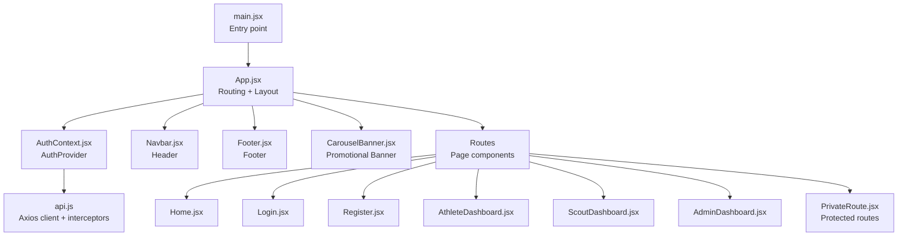
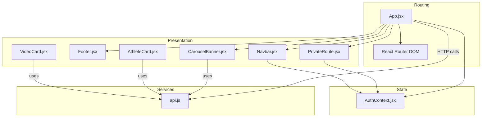
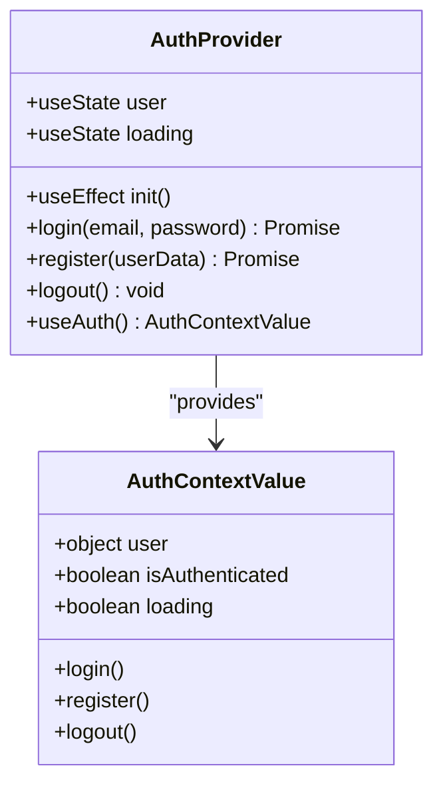
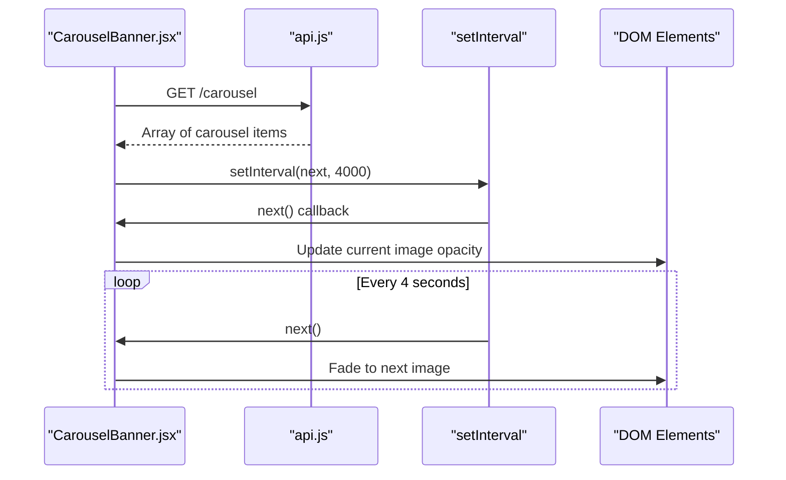
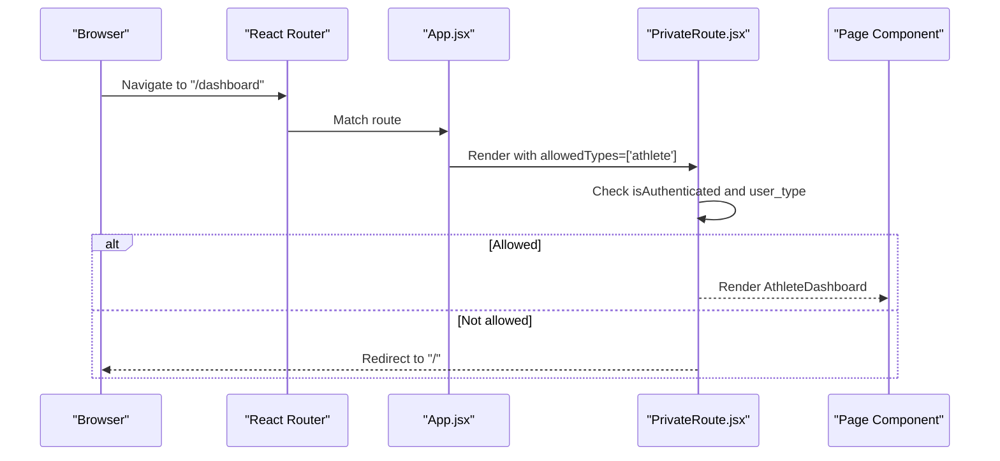
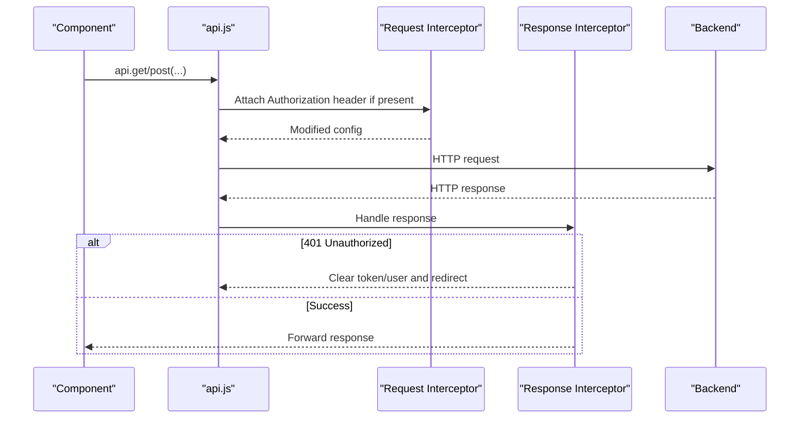
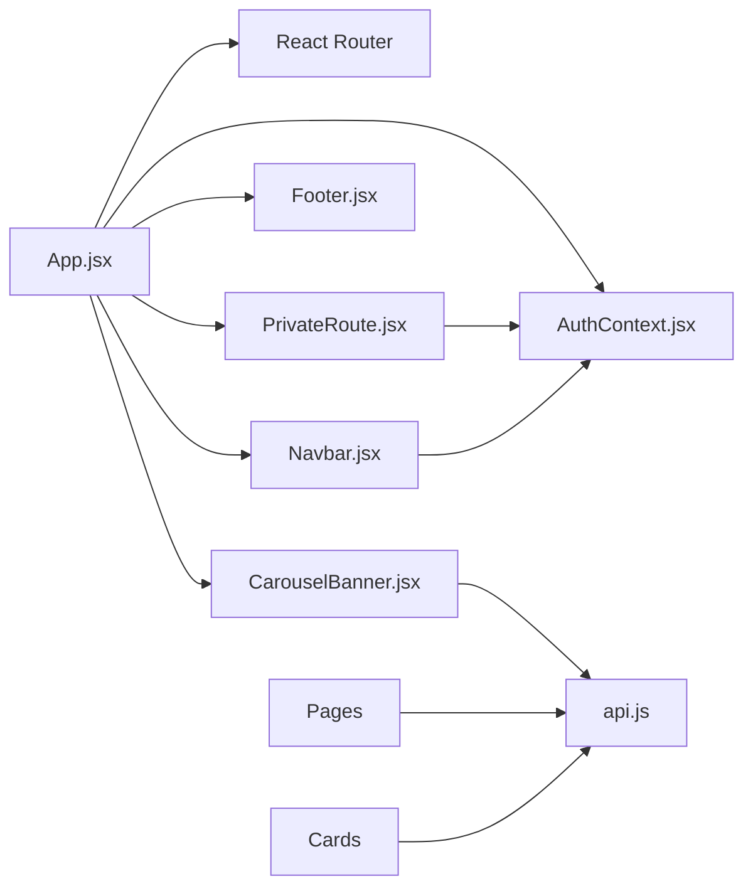

# Frontend Application

<cite>
**Referenced Files in This Document**
- [main.jsx](file://frontend/src/main.jsx)
- [App.jsx](file://frontend/src/App.jsx)
- [AuthContext.jsx](file://frontend/src/context/AuthContext.jsx)
- [Navbar.jsx](file://frontend/src/components/Navbar.jsx)
- [Footer.jsx](file://frontend/src/components/Footer.jsx)
- [PrivateRoute.jsx](file://frontend/src/components/PrivateRoute.jsx)
- [VideoCard.jsx](file://frontend/src/components/VideoCard.jsx)
- [AthleteCard.jsx](file://frontend/src/components/AthleteCard.jsx)
- [CarouselBanner.jsx](file://frontend/src/components/CarouselBanner.jsx)
- [Home.jsx](file://frontend/src/pages/Home.jsx)
- [Login.jsx](file://frontend/src/pages/Login.jsx)
- [Register.jsx](file://frontend/src/pages/Register.jsx)
- [AthleteDashboard.jsx](file://frontend/src/pages/AthleteDashboard.jsx)
- [ScoutDashboard.jsx](file://frontend/src/pages/ScoutDashboard.jsx)
- [AdminDashboard.jsx](file://frontend/src/pages/AdminDashboard.jsx)
- [api.js](file://frontend/src/services/api.js)
</cite>

## Update Summary
**Changes Made**
- Added new CarouselBanner component documentation with automatic cycling functionality
- Updated Core Components section to include CarouselBanner
- Enhanced Architecture Overview with CarouselBanner integration
- Updated Dependency Analysis to reflect CarouselBanner usage
- Added CarouselBanner API endpoints documentation
- Updated Troubleshooting Guide with CarouselBanner-related issues

## Table of Contents
1. [Introduction](#introduction)
2. [Project Structure](#project-structure)
3. [Core Components](#core-components)
4. [Architecture Overview](#architecture-overview)
5. [Detailed Component Analysis](#detailed-component-analysis)
6. [Dependency Analysis](#dependency-analysis)
7. [Performance Considerations](#performance-considerations)
8. [Troubleshooting Guide](#troubleshooting-guide)
9. [Conclusion](#conclusion)
10. [Appendices](#appendices)

## Introduction
This document describes the Craque-Vision React frontend application. It covers the component architecture, routing configuration with React Router, state management using the Context API, and the complete component library. It also documents the page-based structure, authentication and session management, the API service layer, HTTP client configuration, and error handling strategies. Finally, it provides guidelines for component composition, styling with Tailwind CSS, and responsive design patterns.

## Project Structure
The frontend is organized around a small set of core files:
- Entry point renders the root application.
- App orchestrates routing, layout, and global providers.
- Context manages authentication state and exposes hooks.
- Components implement shared UI (Navbar, Footer, VideoCard, AthleteCard, CarouselBanner, PrivateRoute).
- Pages implement domain-specific views (Home, Login, Register, AthleteDashboard, ScoutDashboard, AdminDashboard).
- Services encapsulate HTTP client configuration and interceptors.

**Diagram sources**
- [main.jsx:1-11](file://frontend/src/main.jsx#L1-L11)
- [App.jsx:1-78](file://frontend/src/App.jsx#L1-L78)
- [AuthContext.jsx:1-91](file://frontend/src/context/AuthContext.jsx#L1-L91)
- [Navbar.jsx:1-130](file://frontend/src/components/Navbar.jsx#L1-L130)
- [Footer.jsx:1-112](file://frontend/src/components/Footer.jsx#L1-L112)
- [CarouselBanner.jsx:1-63](file://frontend/src/components/CarouselBanner.jsx#L1-L63)
- [PrivateRoute.jsx:1-27](file://frontend/src/components/PrivateRoute.jsx#L1-L27)
- [Home.jsx:1-312](file://frontend/src/pages/Home.jsx#L1-L312)
- [Login.jsx:1-134](file://frontend/src/pages/Login.jsx#L1-L134)
- [Register.jsx:1-287](file://frontend/src/pages/Register.jsx#L1-L287)
- [AthleteDashboard.jsx:1-277](file://frontend/src/pages/AthleteDashboard.jsx#L1-L277)
- [ScoutDashboard.jsx:1-254](file://frontend/src/pages/ScoutDashboard.jsx#L1-L254)
- [AdminDashboard.jsx:1-317](file://frontend/src/pages/AdminDashboard.jsx#L1-L317)
- [api.js:1-36](file://frontend/src/services/api.js#L1-L36)

**Section sources**
- [main.jsx:1-11](file://frontend/src/main.jsx#L1-L11)
- [App.jsx:1-78](file://frontend/src/App.jsx#L1-L78)

## Core Components
This section documents the reusable building blocks of the application.

- Navbar
  - Displays branding, navigation links, and user actions.
  - Provides responsive mobile menu and dynamic dashboard link based on user role.
  - Uses icons from Lucide React and Tailwind classes for styling.
  - Integrates with AuthContext to show login/register or profile/logout.

- Footer
  - Grid-based layout with sections for athletes, clubs/scouts, support, and branding.
  - Responsive design using Tailwind's grid utilities.

- VideoCard
  - Renders a video thumbnail with overlay play button and optional badges.
  - Displays likes and views when enabled.
  - Accepts an onClick handler to trigger navigation or preview.

- AthleteCard
  - Displays an athlete's profile image, sport, and metadata (position, category).
  - Calculates and shows age from birth date.
  - Links to athlete profile page.

- **CarouselBanner** *(New)*
  - Displays promotional images with automatic cycling every 4 seconds.
  - Supports clickable banners with external links.
  - Features gradient overlays with optional titles.
  - Responsive design with fixed height of 280px.
  - Uses absolute positioning and CSS transitions for smooth fade effects.
  - Automatically cycles through images without manual interaction.
  - Gracefully handles empty states by returning null.

- PrivateRoute
  - Guards routes by checking authentication and user type.
  - Shows a spinner while loading auth state.
  - Redirects unauthenticated users to login or restricts access based on allowed types.

**Section sources**
- [Navbar.jsx:1-130](file://frontend/src/components/Navbar.jsx#L1-L130)
- [Footer.jsx:1-112](file://frontend/src/components/Footer.jsx#L1-L112)
- [VideoCard.jsx:1-48](file://frontend/src/components/VideoCard.jsx#L1-L48)
- [AthleteCard.jsx:1-92](file://frontend/src/components/AthleteCard.jsx#L1-L92)
- [CarouselBanner.jsx:1-63](file://frontend/src/components/CarouselBanner.jsx#L1-L63)
- [PrivateRoute.jsx:1-27](file://frontend/src/components/PrivateRoute.jsx#L1-L27)

## Architecture Overview
The application follows a layered architecture:
- Presentation layer: React components and pages.
- Routing layer: React Router v6 with protected routes.
- State management: Context API provider for authentication.
- Service layer: Axios-based HTTP client with request/response interceptors.
- Styling: Tailwind CSS utility classes with a consistent color palette and spacing.

**Diagram sources**
- [App.jsx:1-78](file://frontend/src/App.jsx#L1-L78)
- [AuthContext.jsx:1-91](file://frontend/src/context/AuthContext.jsx#L1-L91)
- [PrivateRoute.jsx:1-27](file://frontend/src/components/PrivateRoute.jsx#L1-L27)
- [Navbar.jsx:1-130](file://frontend/src/components/Navbar.jsx#L1-L130)
- [Footer.jsx:1-112](file://frontend/src/components/Footer.jsx#L1-L112)
- [CarouselBanner.jsx:1-63](file://frontend/src/components/CarouselBanner.jsx#L1-L63)
- [VideoCard.jsx:1-48](file://frontend/src/components/VideoCard.jsx#L1-L48)
- [AthleteCard.jsx:1-92](file://frontend/src/components/AthleteCard.jsx#L1-L92)
- [api.js:1-36](file://frontend/src/services/api.js#L1-L36)

## Detailed Component Analysis

### Authentication Context and Session Management
The AuthContext provider centralizes authentication state and exposes:
- user: current user object or null
- login(email, password): authenticates and persists token/user
- register(userData): registers and persists token/user
- logout(): clears local storage and removes Authorization header
- loading: indicates initial auth check
- isAuthenticated: derived boolean flag

Behavior highlights:
- On mount, reads token and user from localStorage and sets Authorization header.
- Persists tokens and user data on successful login/register.
- Clears session and Authorization header on logout.
- Exposes a hook useAuth() to consume context safely.

**Diagram sources**
- [AuthContext.jsx:6-88](file://frontend/src/context/AuthContext.jsx#L6-L88)

**Section sources**
- [AuthContext.jsx:1-91](file://frontend/src/context/AuthContext.jsx#L1-L91)

### Protected Routes and Role-Based Access
PrivateRoute enforces:
- Loading state rendering while auth initializes.
- Redirect to login if not authenticated.
- Role-based access via allowedTypes prop (e.g., ['athlete'], ['scout','club'], ['admin']).
- Returns children when access is granted.

**Diagram sources**
- [PrivateRoute.jsx:4-24](file://frontend/src/components/PrivateRoute.jsx#L4-L24)

**Section sources**
- [PrivateRoute.jsx:1-27](file://frontend/src/components/PrivateRoute.jsx#L1-L27)

### CarouselBanner Component
The CarouselBanner component provides automatic promotional image display with the following features:

**Core Functionality:**
- Automatic cycling every 4 seconds using setInterval
- Smooth fade transitions between images
- Responsive design with fixed 280px height
- Gradient overlays with optional titles
- Clickable banners with external links support

**Data Management:**
- Fetches promotional images from `/carousel` endpoint
- Uses absolute positioning for layered image display
- Implements circular navigation (next/previous)
- Graceful handling of empty states

**Styling and UX:**
- Fixed height container with overflow hidden
- Absolute positioning for image layers
- CSS transitions for smooth opacity changes
- Gradient overlays for text readability
- Responsive image scaling with object-cover

**Integration Points:**
- Integrated into App.jsx layout in two positions (top and bottom)
- Uses AuthContext for user state awareness
- Leverages Tailwind CSS for styling
- Depends on api.js for data fetching

**Diagram sources**
- [CarouselBanner.jsx:8-23](file://frontend/src/components/CarouselBanner.jsx#L8-L23)
- [CarouselBanner.jsx:27-59](file://frontend/src/components/CarouselBanner.jsx#L27-L59)

**Section sources**
- [CarouselBanner.jsx:1-63](file://frontend/src/components/CarouselBanner.jsx#L1-L63)

### Routing Configuration
App.jsx defines the routing tree:
- Public pages: Home, Login, Register, SearchAthletes, ClubPlans.
- Protected dashboards:
  - AthleteDashboard: allowedTypes=['athlete']
  - UploadVideo: allowedTypes=['athlete']
  - ScoutDashboard: allowedTypes=['scout','club']
  - AdminDashboard: allowedTypes=['admin']

Layout:
- Navbar and Footer wrap the Routes inside a flex container to ensure proper spacing and footer positioning.
- CarouselBanner is positioned at both top and bottom of the main content area.

**Diagram sources**
- [App.jsx:46-55](file://frontend/src/App.jsx#L46-L55)
- [PrivateRoute.jsx:4-24](file://frontend/src/components/PrivateRoute.jsx#L4-L24)

**Section sources**
- [App.jsx:1-78](file://frontend/src/App.jsx#L1-L78)

### API Service Layer and HTTP Client
The api.js client:
- Base URL from environment variable with sensible fallback.
- Request interceptor attaches Authorization header when token exists.
- Response interceptor handles 401 by clearing session and redirecting to login.
- Exported as a singleton for use across components.

**Diagram sources**
- [api.js:3-36](file://frontend/src/services/api.js#L3-L36)

**Section sources**
- [api.js:1-36](file://frontend/src/services/api.js#L1-L36)

### Backend API Endpoints for CarouselBanner
The CarouselBanner component communicates with the following backend endpoints:

**Public Endpoint:**
- `GET /carousel` - Returns active promotional images for public display
- Response format: Array of carousel items with image_url, title, link, and metadata

**Admin Endpoints:**
- `GET /carousel/admin` - Returns all carousel items (active/inactive) for admin management
- `POST /carousel` - Creates new carousel item with image upload
- `PUT /carousel/:id` - Updates existing carousel item
- `DELETE /carousel/:id` - Removes carousel item

**Data Model:**
- image_url: Secure Cloudinary URL for the promotional image
- title: Optional banner title text
- link: Optional external URL for click-through
- is_active: Boolean flag for display status
- sort_order: Integer for ordering carousel items

**Section sources**
- [carousel.routes.js:36-54](file://backend/routes/carousel.routes.js#L36-L54)
- [carousel.routes.js:56-103](file://backend/routes/carousel.routes.js#L56-L103)
- [carousel.model.js:3-49](file://backend/models/carousel.model.js#L3-L49)

### Page-Based Structure

#### Home
- Fetches featured videos and recent athletes concurrently.
- Renders hero section, sports grid, featured content rows, and benefits.
- Uses VideoCard and AthleteCard for content cards.
- **Updated**: CarouselBanner is positioned at the top of the main content area.

**Section sources**
- [Home.jsx:1-312](file://frontend/src/pages/Home.jsx#L1-L312)

#### Login
- Form with email, password, and toggle for password visibility.
- Calls useAuth().login and navigates to appropriate dashboard based on user_type.
- Displays error messages returned by the context.

**Section sources**
- [Login.jsx:1-134](file://frontend/src/pages/Login.jsx#L1-L134)

#### Register
- Multi-step form:
  - Step 1: personal info and password confirmation with validation.
  - Step 2: user_type selection among athlete, scout, club.
- Calls useAuth().register and navigates to appropriate dashboard.
- Displays validation errors and loading states.

**Section sources**
- [Register.jsx:1-287](file://frontend/src/pages/Register.jsx#L1-L287)

#### AthleteDashboard
- Loads athlete profile and videos.
- Tabs: Profile, My Videos, Statistics.
- Uses VideoCard for video list and AthleteCard for related content placeholders.
- Handles loading and empty states.

**Section sources**
- [AthleteDashboard.jsx:1-277](file://frontend/src/pages/AthleteDashboard.jsx#L1-L277)

#### ScoutDashboard
- Requires active subscription; otherwise redirects to plans.
- Tabs: Dashboard, Favorites, Search.
- Displays metrics, recent athletes, and featured videos.
- Uses AthleteCard and VideoCard.

**Section sources**
- [ScoutDashboard.jsx:1-254](file://frontend/src/pages/ScoutDashboard.jsx#L1-L254)

#### AdminDashboard
- Administrative overview with stats and management tabs:
  - Users: list with delete action.
  - Videos: approve/reject actions.
  - Subscriptions: list with status.
  - **Carousel Management**: Complete carousel administration interface.
- Uses tables and action buttons.
- **Updated**: Includes comprehensive carousel management with upload, edit, and delete functionality.

**Section sources**
- [AdminDashboard.jsx:1-317](file://frontend/src/pages/AdminDashboard.jsx#L1-L317)

## Dependency Analysis
Key dependencies and relationships:
- App.jsx depends on AuthProvider, React Router, Navbar, Footer, CarouselBanner, and page components.
- PrivateRoute depends on AuthContext to enforce access control.
- Pages depend on api.js for HTTP requests and on shared components for UI.
- Navbar depends on AuthContext for user state and logout.
- **CarouselBanner** depends on api.js for data fetching and uses Tailwind CSS for styling.

**Diagram sources**
- [App.jsx:1-78](file://frontend/src/App.jsx#L1-L78)
- [AuthContext.jsx:1-91](file://frontend/src/context/AuthContext.jsx#L1-L91)
- [PrivateRoute.jsx:1-27](file://frontend/src/components/PrivateRoute.jsx#L1-L27)
- [Navbar.jsx:1-130](file://frontend/src/components/Navbar.jsx#L1-L130)
- [CarouselBanner.jsx:1-63](file://frontend/src/components/CarouselBanner.jsx#L1-L63)
- [api.js:1-36](file://frontend/src/services/api.js#L1-L36)

**Section sources**
- [App.jsx:1-78](file://frontend/src/App.jsx#L1-L78)
- [AuthContext.jsx:1-91](file://frontend/src/context/AuthContext.jsx#L1-L91)
- [PrivateRoute.jsx:1-27](file://frontend/src/components/PrivateRoute.jsx#L1-L27)
- [Navbar.jsx:1-130](file://frontend/src/components/Navbar.jsx#L1-L130)
- [CarouselBanner.jsx:1-63](file://frontend/src/components/CarouselBanner.jsx#L1-L63)
- [api.js:1-36](file://frontend/src/services/api.js#L1-L36)

## Performance Considerations
- Concurrent data fetching: Use Promise.all to reduce total load time for related resources.
- Loading states: Show spinners or skeleton loaders during hydration and API calls.
- Conditional rendering: Avoid rendering heavy components until data is ready.
- Memoization: Consider memoizing props passed to cards to prevent unnecessary re-renders.
- Lazy loading: For large lists, consider pagination or virtualized lists.
- **CarouselBanner Performance**: 
  - Uses efficient absolute positioning for image layers
  - Implements useCallback for navigation functions to prevent re-renders
  - Clears intervals on component unmount to prevent memory leaks
  - Graceful handling of empty states to avoid unnecessary DOM manipulation

## Troubleshooting Guide
Common issues and resolutions:
- 401 Unauthorized responses
  - Cause: Expired or missing token.
  - Behavior: Global interceptor clears token/user and redirects to login.
  - Action: Ensure login flow runs; verify Authorization header presence.

- Protected route access denied
  - Cause: User type not included in allowedTypes.
  - Behavior: Redirects to home.
  - Action: Verify user_type and adjust allowedTypes accordingly.

- Auth initialization flicker
  - Cause: Initial loading while checking localStorage.
  - Behavior: Spinner shown until loading completes.
  - Action: Keep the loader visible until useAuth().loading becomes false.

- Navigation after login/register
  - Cause: Incorrect routing based on user_type.
  - Behavior: Redirects to dashboard matching user_type.
  - Action: Confirm user_type values and route mapping.

- **CarouselBanner Issues** *(New)*
  - No images displayed
    - Cause: Empty carousel table or all items inactive
    - Behavior: Component returns null gracefully
    - Action: Verify carousel items exist and are active in AdminDashboard
  - Images not cycling automatically
    - Cause: Single image or interval cleanup
    - Behavior: Carousel stops cycling after component unmount
    - Action: Ensure multiple images exist; check browser tab focus
  - Click-through links not working
    - Cause: Missing link property or external security restrictions
    - Behavior: Images appear clickable but don't navigate
    - Action: Verify link URLs and security attributes
  - Image quality issues
    - Cause: Large image uploads or Cloudinary processing
    - Behavior: Blurry or pixelated promotional images
    - Action: Use recommended image dimensions; check Cloudinary settings

**Section sources**
- [api.js:23-33](file://frontend/src/services/api.js#L23-L33)
- [PrivateRoute.jsx:7-21](file://frontend/src/components/PrivateRoute.jsx#L7-L21)
- [Login.jsx:30-42](file://frontend/src/pages/Login.jsx#L30-L42)
- [Register.jsx:66-91](file://frontend/src/pages/Register.jsx#L66-L91)
- [CarouselBanner.jsx:8-23](file://frontend/src/components/CarouselBanner.jsx#L8-L23)

## Conclusion
The frontend implements a clean separation of concerns with React Router for navigation, Context API for authentication state, and a centralized Axios client for HTTP communication. The component library promotes reuse and consistency, while Tailwind CSS enables rapid, responsive UI development. The protected routing ensures secure access to role-specific dashboards, and the API layer centralizes error handling and session management. **The new CarouselBanner component enhances the promotional capabilities with automatic cycling and responsive design, providing an engaging user experience for marketing content.**

## Appendices

### Styling and Responsive Design Guidelines
- Use Tailwind utility classes for layout and typography.
- Maintain a consistent color palette (primary, accent, gradients) and spacing scale.
- Apply responsive breakpoints (sm, md, lg) to adapt layouts across screen sizes.
- Prefer flexbox and grid for modern layouts; avoid fixed widths where possible.
- Use card containers for content sections to maintain depth and visual hierarchy.
- **CarouselBanner Styling**: 
  - Fixed 280px height for consistent visual impact
  - Gradient overlays for text readability
  - Smooth opacity transitions for fade effects
  - Responsive object-cover for image scaling

### Component Composition Best Practices
- Keep components functional and single-responsibility.
- Pass data via props and callbacks; avoid deep prop drilling by grouping related props.
- Centralize shared UI in Navbar, Footer, CarouselBanner, and cards.
- Use lazy loading and skeletons for improved perceived performance.
- **CarouselBanner Integration**: 
  - Place at strategic positions in app layout for maximum visibility
  - Ensure adequate spacing for optimal user experience
  - Consider content placement in relation to navigation elements

### CarouselBanner Implementation Details
**Technical Specifications:**
- Automatic cycling interval: 4000ms (4 seconds)
- Transition duration: 700ms with ease-in-out timing
- Image sizing: Full container coverage with object-fit: cover
- Accessibility: Proper alt text for screen readers
- Security: External links use target="_blank" and rel="noopener noreferrer"

**Development Notes:**
- Component returns null when no images available to prevent layout issues
- Uses React.memo patterns internally for performance optimization
- Implements cleanup functions to prevent memory leaks
- Graceful degradation for edge cases and error conditions