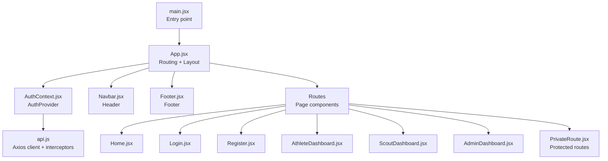
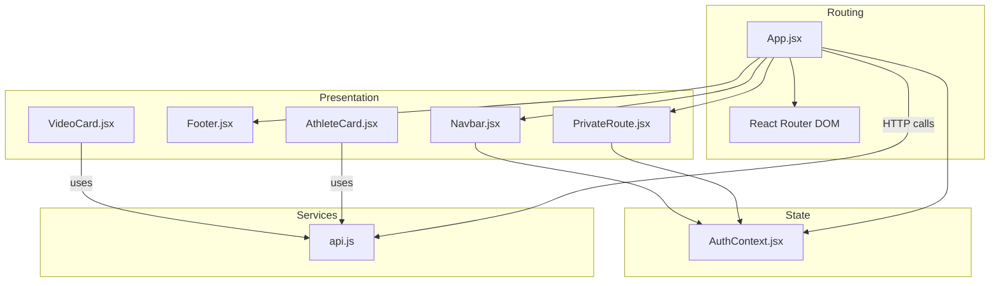
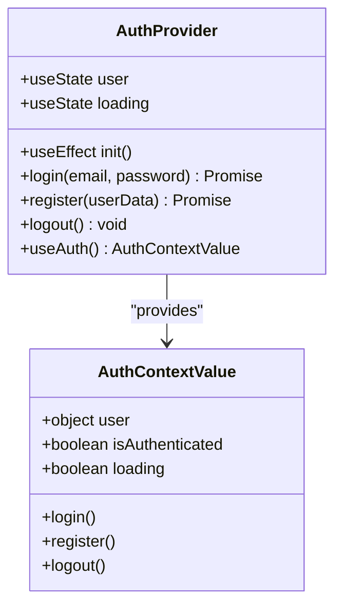
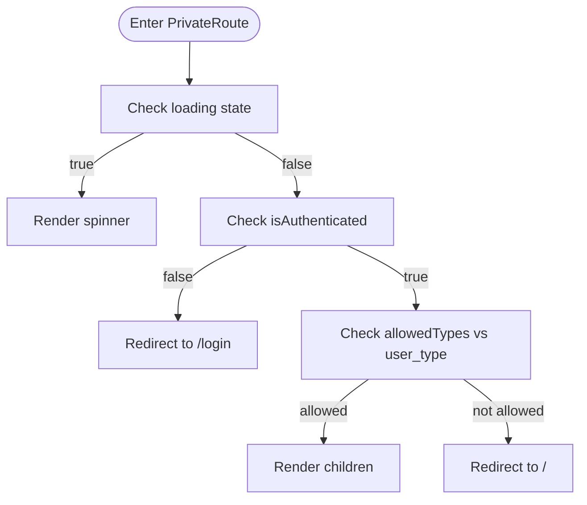
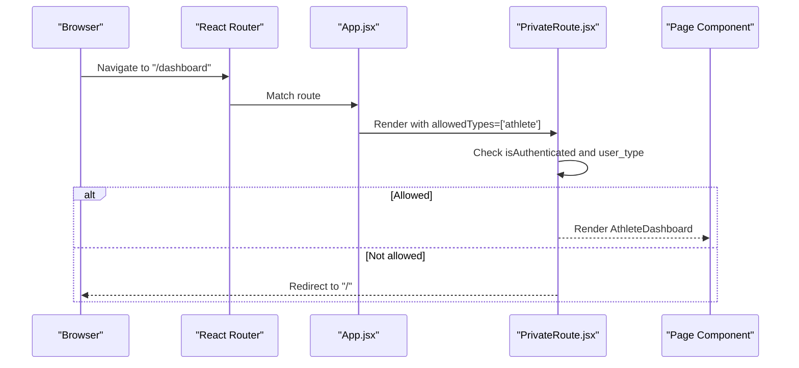
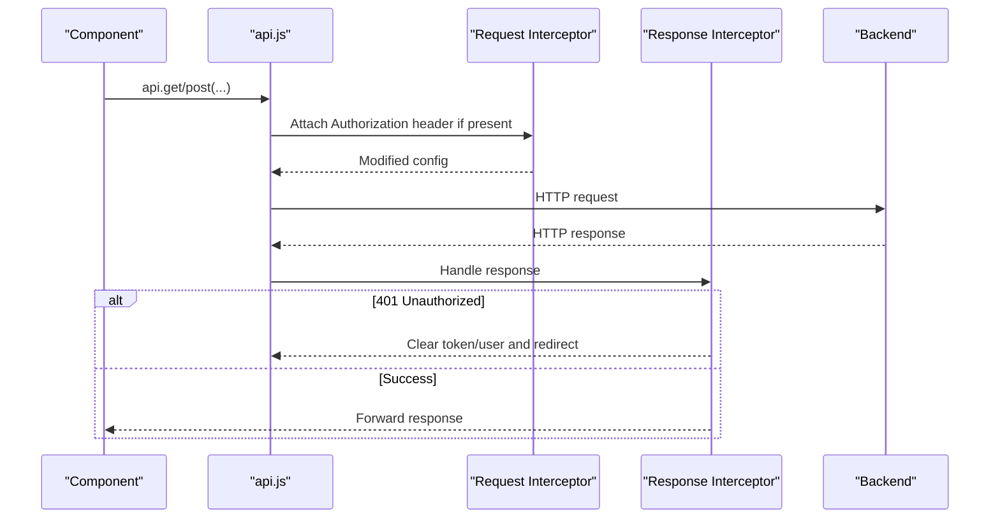
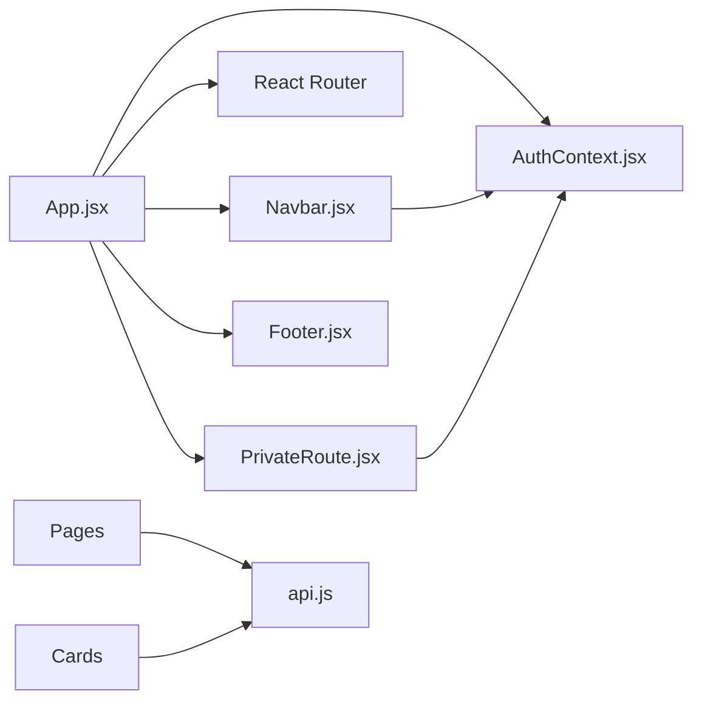

# Frontend Application

<cite>
**Referenced Files in This Document**
- [main.jsx](file://frontend/src/main.jsx)
- [App.jsx](file://frontend/src/App.jsx)
- [AuthContext.jsx](file://frontend/src/context/AuthContext.jsx)
- [Navbar.jsx](file://frontend/src/components/Navbar.jsx)
- [Footer.jsx](file://frontend/src/components/Footer.jsx)
- [PrivateRoute.jsx](file://frontend/src/components/PrivateRoute.jsx)
- [VideoCard.jsx](file://frontend/src/components/VideoCard.jsx)
- [AthleteCard.jsx](file://frontend/src/components/AthleteCard.jsx)
- [Home.jsx](file://frontend/src/pages/Home.jsx)
- [Login.jsx](file://frontend/src/pages/Login.jsx)
- [Register.jsx](file://frontend/src/pages/Register.jsx)
- [AthleteDashboard.jsx](file://frontend/src/pages/AthleteDashboard.jsx)
- [ScoutDashboard.jsx](file://frontend/src/pages/ScoutDashboard.jsx)
- [AdminDashboard.jsx](file://frontend/src/pages/AdminDashboard.jsx)
- [api.js](file://frontend/src/services/api.js)
</cite>

## Table of Contents
1. [Introduction](#introduction)
2. [Project Structure](#project-structure)
3. [Core Components](#core-components)
4. [Architecture Overview](#architecture-overview)
5. [Detailed Component Analysis](#detailed-component-analysis)
6. [Dependency Analysis](#dependency-analysis)
7. [Performance Considerations](#performance-considerations)
8. [Troubleshooting Guide](#troubleshooting-guide)
9. [Conclusion](#conclusion)
10. [Appendices](#appendices)

## Introduction
This document describes the Craque-Vision React frontend application. It covers the component architecture, routing configuration with React Router, state management using the Context API, and the complete component library. It also documents the page-based structure, authentication and session management, the API service layer, HTTP client configuration, and error handling strategies. Finally, it provides guidelines for component composition, styling with Tailwind CSS, and responsive design patterns.

## Project Structure
The frontend is organized around a small set of core files:
- Entry point renders the root application.
- App orchestrates routing, layout, and global providers.
- Context manages authentication state and exposes hooks.
- Components implement shared UI (Navbar, Footer, VideoCard, AthleteCard, PrivateRoute).
- Pages implement domain-specific views (Home, Login, Register, AthleteDashboard, ScoutDashboard, AdminDashboard).
- Services encapsulate HTTP client configuration and interceptors.

**Diagram sources**
- [main.jsx:1-11](file://frontend/src/main.jsx#L1-L11)
- [App.jsx:1-67](file://frontend/src/App.jsx#L1-L67)
- [AuthContext.jsx:1-91](file://frontend/src/context/AuthContext.jsx#L1-L91)
- [Navbar.jsx:1-130](file://frontend/src/components/Navbar.jsx#L1-L130)
- [Footer.jsx:1-112](file://frontend/src/components/Footer.jsx#L1-L112)
- [PrivateRoute.jsx:1-27](file://frontend/src/components/PrivateRoute.jsx#L1-L27)
- [Home.jsx:1-231](file://frontend/src/pages/Home.jsx#L1-L231)
- [Login.jsx:1-134](file://frontend/src/pages/Login.jsx#L1-L134)
- [Register.jsx:1-287](file://frontend/src/pages/Register.jsx#L1-L287)
- [AthleteDashboard.jsx:1-277](file://frontend/src/pages/AthleteDashboard.jsx#L1-L277)
- [ScoutDashboard.jsx:1-254](file://frontend/src/pages/ScoutDashboard.jsx#L1-L254)
- [AdminDashboard.jsx:1-317](file://frontend/src/pages/AdminDashboard.jsx#L1-L317)
- [api.js:1-36](file://frontend/src/services/api.js#L1-L36)

**Section sources**
- [main.jsx:1-11](file://frontend/src/main.jsx#L1-L11)
- [App.jsx:1-67](file://frontend/src/App.jsx#L1-L67)

## Core Components
This section documents the reusable building blocks of the application.

- Navbar
  - Displays branding, navigation links, and user actions.
  - Provides responsive mobile menu and dynamic dashboard link based on user role.
  - Uses icons from Lucide React and Tailwind classes for styling.
  - Integrates with AuthContext to show login/register or profile/logout.

- Footer
  - Grid-based layout with sections for athletes, clubs/scouts, support, and branding.
  - Responsive design using Tailwind’s grid utilities.

- VideoCard
  - Renders a video thumbnail with overlay play button and optional badges.
  - Displays likes and views when enabled.
  - Accepts an onClick handler to trigger navigation or preview.

- AthleteCard
  - Displays an athlete’s profile image, sport, and metadata (position, category).
  - Calculates and shows age from birth date.
  - Links to athlete profile page.

- PrivateRoute
  - Guards routes by checking authentication and user type.
  - Shows a spinner while loading auth state.
  - Redirects unauthenticated users to login or restricts access based on allowed types.

**Section sources**
- [Navbar.jsx:1-130](file://frontend/src/components/Navbar.jsx#L1-L130)
- [Footer.jsx:1-112](file://frontend/src/components/Footer.jsx#L1-L112)
- [VideoCard.jsx:1-48](file://frontend/src/components/VideoCard.jsx#L1-L48)
- [AthleteCard.jsx:1-92](file://frontend/src/components/AthleteCard.jsx#L1-L92)
- [PrivateRoute.jsx:1-27](file://frontend/src/components/PrivateRoute.jsx#L1-L27)

## Architecture Overview
The application follows a layered architecture:
- Presentation layer: React components and pages.
- Routing layer: React Router v6 with protected routes.
- State management: Context API provider for authentication.
- Service layer: Axios-based HTTP client with request/response interceptors.
- Styling: Tailwind CSS utility classes with a consistent color palette and spacing.

**Diagram sources**
- [App.jsx:1-67](file://frontend/src/App.jsx#L1-L67)
- [AuthContext.jsx:1-91](file://frontend/src/context/AuthContext.jsx#L1-L91)
- [PrivateRoute.jsx:1-27](file://frontend/src/components/PrivateRoute.jsx#L1-L27)
- [Navbar.jsx:1-130](file://frontend/src/components/Navbar.jsx#L1-L130)
- [Footer.jsx:1-112](file://frontend/src/components/Footer.jsx#L1-L112)
- [VideoCard.jsx:1-48](file://frontend/src/components/VideoCard.jsx#L1-L48)
- [AthleteCard.jsx:1-92](file://frontend/src/components/AthleteCard.jsx#L1-L92)
- [api.js:1-36](file://frontend/src/services/api.js#L1-L36)

## Detailed Component Analysis

### Authentication Context and Session Management
The AuthContext provider centralizes authentication state and exposes:
- user: current user object or null
- login(email, password): authenticates and persists token/user
- register(userData): registers and persists token/user
- logout(): clears local storage and removes Authorization header
- loading: indicates initial auth check
- isAuthenticated: derived boolean flag

Behavior highlights:
- On mount, reads token and user from localStorage and sets Authorization header.
- Persists tokens and user data on successful login/register.
- Clears session and Authorization header on logout.
- Exposes a hook useAuth() to consume context safely.

**Diagram sources**
- [AuthContext.jsx:6-88](file://frontend/src/context/AuthContext.jsx#L6-L88)

**Section sources**
- [AuthContext.jsx:1-91](file://frontend/src/context/AuthContext.jsx#L1-L91)

### Protected Routes and Role-Based Access
PrivateRoute enforces:
- Loading state rendering while auth initializes.
- Redirect to login if not authenticated.
- Role-based access via allowedTypes prop (e.g., ['athlete'], ['scout','club'], ['admin']).
- Returns children when access is granted.

**Diagram sources**
- [PrivateRoute.jsx:4-24](file://frontend/src/components/PrivateRoute.jsx#L4-L24)

**Section sources**
- [PrivateRoute.jsx:1-27](file://frontend/src/components/PrivateRoute.jsx#L1-L27)

### Routing Configuration
App.jsx defines the routing tree:
- Public pages: Home, Login, Register, SearchAthletes, ClubPlans.
- Protected dashboards:
  - AthleteDashboard: allowedTypes=['athlete']
  - UploadVideo: allowedTypes=['athlete']
  - ScoutDashboard: allowedTypes=['scout','club']
  - AdminDashboard: allowedTypes=['admin']

Layout:
- Navbar and Footer wrap the Routes inside a flex container to ensure proper spacing and footer positioning.

**Diagram sources**
- [App.jsx:36-55](file://frontend/src/App.jsx#L36-L55)
- [PrivateRoute.jsx:4-24](file://frontend/src/components/PrivateRoute.jsx#L4-L24)

**Section sources**
- [App.jsx:1-67](file://frontend/src/App.jsx#L1-L67)

### API Service Layer and HTTP Client
The api.js client:
- Base URL from environment variable with sensible fallback.
- Request interceptor attaches Authorization header when token exists.
- Response interceptor handles 401 by clearing session and redirecting to login.
- Exported as a singleton for use across components.

**Diagram sources**
- [api.js:3-36](file://frontend/src/services/api.js#L3-L36)

**Section sources**
- [api.js:1-36](file://frontend/src/services/api.js#L1-L36)

### Page-Based Structure

#### Home
- Fetches featured videos and recent athletes concurrently.
- Renders hero section, sports grid, featured content rows, and benefits.
- Uses VideoCard and AthleteCard for content cards.

**Section sources**
- [Home.jsx:1-231](file://frontend/src/pages/Home.jsx#L1-L231)

#### Login
- Form with email, password, and toggle for password visibility.
- Calls useAuth().login and navigates to appropriate dashboard based on user_type.
- Displays error messages returned by the context.

**Section sources**
- [Login.jsx:1-134](file://frontend/src/pages/Login.jsx#L1-L134)

#### Register
- Multi-step form:
  - Step 1: personal info and password confirmation with validation.
  - Step 2: user_type selection among athlete, scout, club.
- Calls useAuth().register and navigates to appropriate dashboard.
- Displays validation errors and loading states.

**Section sources**
- [Register.jsx:1-287](file://frontend/src/pages/Register.jsx#L1-L287)

#### AthleteDashboard
- Loads athlete profile and videos.
- Tabs: Profile, My Videos, Statistics.
- Uses VideoCard for video list and AthleteCard for related content placeholders.
- Handles loading and empty states.

**Section sources**
- [AthleteDashboard.jsx:1-277](file://frontend/src/pages/AthleteDashboard.jsx#L1-L277)

#### ScoutDashboard
- Requires active subscription; otherwise redirects to plans.
- Tabs: Dashboard, Favorites, Search.
- Displays metrics, recent athletes, and featured videos.
- Uses AthleteCard and VideoCard.

**Section sources**
- [ScoutDashboard.jsx:1-254](file://frontend/src/pages/ScoutDashboard.jsx#L1-L254)

#### AdminDashboard
- Administrative overview with stats and management tabs:
  - Users: list with delete action.
  - Videos: approve/reject actions.
  - Subscriptions: list with status.
- Uses tables and action buttons.

**Section sources**
- [AdminDashboard.jsx:1-317](file://frontend/src/pages/AdminDashboard.jsx#L1-L317)

## Dependency Analysis
Key dependencies and relationships:
- App.jsx depends on AuthProvider, React Router, Navbar, Footer, and page components.
- PrivateRoute depends on AuthContext to enforce access control.
- Pages depend on api.js for HTTP requests and on shared components for UI.
- Navbar depends on AuthContext for user state and logout.

**Diagram sources**
- [App.jsx:1-67](file://frontend/src/App.jsx#L1-L67)
- [AuthContext.jsx:1-91](file://frontend/src/context/AuthContext.jsx#L1-L91)
- [PrivateRoute.jsx:1-27](file://frontend/src/components/PrivateRoute.jsx#L1-L27)
- [Navbar.jsx:1-130](file://frontend/src/components/Navbar.jsx#L1-L130)
- [api.js:1-36](file://frontend/src/services/api.js#L1-L36)

**Section sources**
- [App.jsx:1-67](file://frontend/src/App.jsx#L1-L67)
- [AuthContext.jsx:1-91](file://frontend/src/context/AuthContext.jsx#L1-L91)
- [PrivateRoute.jsx:1-27](file://frontend/src/components/PrivateRoute.jsx#L1-L27)
- [Navbar.jsx:1-130](file://frontend/src/components/Navbar.jsx#L1-L130)
- [api.js:1-36](file://frontend/src/services/api.js#L1-L36)

## Performance Considerations
- Concurrent data fetching: Use Promise.all to reduce total load time for related resources.
- Loading states: Show spinners or skeleton loaders during hydration and API calls.
- Conditional rendering: Avoid rendering heavy components until data is ready.
- Memoization: Consider memoizing props passed to cards to prevent unnecessary re-renders.
- Lazy loading: For large lists, consider pagination or virtualized lists.

## Troubleshooting Guide
Common issues and resolutions:
- 401 Unauthorized responses
  - Cause: Expired or missing token.
  - Behavior: Global interceptor clears token/user and redirects to login.
  - Action: Ensure login flow runs; verify Authorization header presence.

- Protected route access denied
  - Cause: User type not included in allowedTypes.
  - Behavior: Redirects to home.
  - Action: Verify user_type and adjust allowedTypes accordingly.

- Auth initialization flicker
  - Cause: Initial loading while checking localStorage.
  - Behavior: Spinner shown until loading completes.
  - Action: Keep the loader visible until useAuth().loading becomes false.

- Navigation after login/register
  - Cause: Incorrect routing based on user_type.
  - Behavior: Redirects to dashboard matching user_type.
  - Action: Confirm user_type values and route mapping.

**Section sources**
- [api.js:23-33](file://frontend/src/services/api.js#L23-L33)
- [PrivateRoute.jsx:7-21](file://frontend/src/components/PrivateRoute.jsx#L7-L21)
- [Login.jsx:30-42](file://frontend/src/pages/Login.jsx#L30-L42)
- [Register.jsx:66-91](file://frontend/src/pages/Register.jsx#L66-L91)

## Conclusion
The frontend implements a clean separation of concerns with React Router for navigation, Context API for authentication state, and a centralized Axios client for HTTP communication. The component library promotes reuse and consistency, while Tailwind CSS enables rapid, responsive UI development. The protected routing ensures secure access to role-specific dashboards, and the API layer centralizes error handling and session management.

## Appendices

### Styling and Responsive Design Guidelines
- Use Tailwind utility classes for layout and typography.
- Maintain a consistent color palette (primary, accent, gradients) and spacing scale.
- Apply responsive breakpoints (sm, md, lg) to adapt layouts across screen sizes.
- Prefer flexbox and grid for modern layouts; avoid fixed widths where possible.
- Use card containers for content sections to maintain depth and visual hierarchy.

### Component Composition Best Practices
- Keep components functional and single-responsibility.
- Pass data via props and callbacks; avoid deep prop drilling by grouping related props.
- Centralize shared UI in Navbar, Footer, and cards.
- Use lazy loading and skeletons for improved perceived performance.