# Page Components

<cite>
**Referenced Files in This Document**
- [Home.jsx](file://frontend/src/pages/Home.jsx)
- [Login.jsx](file://frontend/src/pages/Login.jsx)
- [Register.jsx](file://frontend/src/pages/Register.jsx)
- [AthleteDashboard.jsx](file://frontend/src/pages/AthleteDashboard.jsx)
- [ScoutDashboard.jsx](file://frontend/src/pages/ScoutDashboard.jsx)
- [AdminDashboard.jsx](file://frontend/src/pages/AdminDashboard.jsx)
- [AthleteProfile.jsx](file://frontend/src/pages/AthleteProfile.jsx)
- [UploadVideo.jsx](file://frontend/src/pages/UploadVideo.jsx)
- [SearchAthletes.jsx](file://frontend/src/pages/SearchAthletes.jsx)
- [ClubPlans.jsx](file://frontend/src/pages/ClubPlans.jsx)
- [SubscriptionPayment.jsx](file://frontend/src/pages/SubscriptionPayment.jsx)
- [Navbar.jsx](file://frontend/src/components/Navbar.jsx)
- [Footer.jsx](file://frontend/src/components/Footer.jsx)
- [AthleteCard.jsx](file://frontend/src/components/AthleteCard.jsx)
- [VideoCard.jsx](file://frontend/src/components/VideoCard.jsx)
- [AuthContext.jsx](file://frontend/src/context/AuthContext.jsx)
- [api.js](file://frontend/src/services/api.js)
- [auth.controller.js](file://backend/controllers/auth.controller.js)
- [user.model.js](file://backend/models/user.model.js)
- [schema.sql](file://database/schema.sql)
</cite>

## Update Summary
**Changes Made**
- Enhanced Register page with URL parameter-based user type selection (tipo parameter)
- Improved ClubPlans page with user type validation preventing inappropriate plan subscriptions
- Refined SearchAthletes component with performance optimizations including useCallback hooks and debouncing mechanism
- Updated authentication flow to support user type parameter in registration process

## Table of Contents
1. [Introduction](#introduction)
2. [Project Structure](#project-structure)
3. [Core Components](#core-components)
4. [Architecture Overview](#architecture-overview)
5. [Detailed Component Analysis](#detailed-component-analysis)
6. [Dependency Analysis](#dependency-analysis)
7. [Performance Considerations](#performance-considerations)
8. [Troubleshooting Guide](#troubleshooting-guide)
9. [Conclusion](#conclusion)

## Introduction
This document provides comprehensive documentation for all Craque-Vision page components. It explains the Home page layout and featured content display, the Login and Register pages with form validation and error handling, the AthleteDashboard for athlete profile management, video uploads, and personal analytics, the ScoutDashboard for searching athletes, managing favorites, and accessing premium features, the AdminDashboard for platform administration and user management, the AthleteProfile page for public profile viewing, the UploadVideo page with file selection, preview, and submission workflows, the SearchAthletes page with filtering, sorting, and result presentation, the ClubPlans page for subscription management and payment processing, and the new SubscriptionPayment page component with subscription selection, PIX payment processing, and status tracking.

**Updated** Enhanced user registration flow now supports URL parameter-based user type selection, improved subscription validation prevents inappropriate plan access, and SearchAthletes component includes performance optimizations.

## Project Structure
The frontend is organized by pages and shared components. Pages are React functional components under frontend/src/pages. Shared UI components live under frontend/src/components. Authentication state is centralized via a React context provider. HTTP requests are handled by a shared Axios service with interceptors for auth tokens and automatic redirects on 401 responses.

```mermaid
graph TB
subgraph "Pages"
Home["Home.jsx"]
Login["Login.jsx"]
Register["Register.jsx"]
AthleteDash["AthleteDashboard.jsx"]
ScoutDash["ScoutDashboard.jsx"]
AdminDash["AdminDashboard.jsx"]
AthleteProfile["AthleteProfile.jsx"]
UploadVideo["UploadVideo.jsx"]
SearchAthletes["SearchAthletes.jsx"]
ClubPlans["ClubPlans.jsx"]
SubscriptionPayment["SubscriptionPayment.jsx"]
end
subgraph "Shared Components"
Navbar["Navbar.jsx"]
Footer["Footer.jsx"]
AthleteCard["AthleteCard.jsx"]
VideoCard["VideoCard.jsx"]
end
subgraph "Context & Services"
AuthCtx["AuthContext.jsx"]
Api["api.js"]
end
Home --> Navbar
Login --> Navbar
Register --> Navbar
AthleteDash --> Navbar
ScoutDash --> Navbar
AdminDash --> Navbar
AthleteProfile --> Navbar
UploadVideo --> Navbar
SearchAthletes --> Navbar
ClubPlans --> Navbar
SubscriptionPayment --> Navbar
Home --> Footer
Login --> Footer
Register --> Footer
AthleteDash --> Footer
ScoutDash --> Footer
AdminDash --> Footer
AthleteProfile --> Footer
UploadVideo --> Footer
SearchAthletes --> Footer
ClubPlans --> Footer
SubscriptionPayment --> Footer
Home --> Api
Login --> AuthCtx
Register --> AuthCtx
AthleteDash --> Api
ScoutDash --> Api
AdminDash --> Api
AthleteProfile --> Api
UploadVideo --> Api
SearchAthletes --> Api
ClubPlans --> Api
SubscriptionPayment --> Api
AthleteDash --> AthleteCard
ScoutDash --> AthleteCard
SearchAthletes --> AthleteCard
AthleteProfile --> VideoCard
ScoutDash --> VideoCard
Home --> VideoCard
```

**Diagram sources**
- [Home.jsx:1-231](file://frontend/src/pages/Home.jsx#L1-L231)
- [Login.jsx:1-134](file://frontend/src/pages/Login.jsx#L1-L134)
- [Register.jsx:1-288](file://frontend/src/pages/Register.jsx#L1-L288)
- [AthleteDashboard.jsx:1-277](file://frontend/src/pages/AthleteDashboard.jsx#L1-L277)
- [ScoutDashboard.jsx:1-254](file://frontend/src/pages/ScoutDashboard.jsx#L1-L254)
- [AdminDashboard.jsx:1-317](file://frontend/src/pages/AdminDashboard.jsx#L1-L317)
- [AthleteProfile.jsx:1-302](file://frontend/src/pages/AthleteProfile.jsx#L1-L302)
- [UploadVideo.jsx:1-234](file://frontend/src/pages/UploadVideo.jsx#L1-L234)
- [SearchAthletes.jsx:1-235](file://frontend/src/pages/SearchAthletes.jsx#L1-L235)
- [ClubPlans.jsx:1-236](file://frontend/src/pages/ClubPlans.jsx#L1-L236)
- [SubscriptionPayment.jsx:1-344](file://frontend/src/pages/SubscriptionPayment.jsx#L1-L344)
- [Navbar.jsx:1-130](file://frontend/src/components/Navbar.jsx#L1-L130)
- [Footer.jsx:1-112](file://frontend/src/components/Footer.jsx#L1-L112)
- [AthleteCard.jsx:1-92](file://frontend/src/components/AthleteCard.jsx#L1-L92)
- [VideoCard.jsx:1-48](file://frontend/src/components/VideoCard.jsx#L1-L48)
- [AuthContext.jsx:1-100](file://frontend/src/context/AuthContext.jsx#L1-L100)
- [api.js:1-42](file://frontend/src/services/api.js#L1-L42)

**Section sources**
- [Home.jsx:1-231](file://frontend/src/pages/Home.jsx#L1-L231)
- [Login.jsx:1-134](file://frontend/src/pages/Login.jsx#L1-L134)
- [Register.jsx:1-288](file://frontend/src/pages/Register.jsx#L1-L288)
- [AthleteDashboard.jsx:1-277](file://frontend/src/pages/AthleteDashboard.jsx#L1-L277)
- [ScoutDashboard.jsx:1-254](file://frontend/src/pages/ScoutDashboard.jsx#L1-L254)
- [AdminDashboard.jsx:1-317](file://frontend/src/pages/AdminDashboard.jsx#L1-L317)
- [AthleteProfile.jsx:1-302](file://frontend/src/pages/AthleteProfile.jsx#L1-L302)
- [UploadVideo.jsx:1-234](file://frontend/src/pages/UploadVideo.jsx#L1-L234)
- [SearchAthletes.jsx:1-235](file://frontend/src/pages/SearchAthletes.jsx#L1-L235)
- [ClubPlans.jsx:1-236](file://frontend/src/pages/ClubPlans.jsx#L1-L236)
- [SubscriptionPayment.jsx:1-344](file://frontend/src/pages/SubscriptionPayment.jsx#L1-L344)
- [Navbar.jsx:1-130](file://frontend/src/components/Navbar.jsx#L1-L130)
- [Footer.jsx:1-112](file://frontend/src/components/Footer.jsx#L1-L112)
- [AthleteCard.jsx:1-92](file://frontend/src/components/AthleteCard.jsx#L1-L92)
- [VideoCard.jsx:1-48](file://frontend/src/components/VideoCard.jsx#L1-L48)
- [AuthContext.jsx:1-100](file://frontend/src/context/AuthContext.jsx#L1-L100)
- [api.js:1-42](file://frontend/src/services/api.js#L1-L42)

## Core Components
- Authentication Context: Centralizes login, registration, logout, and user state. Persists token and user in localStorage and attaches Authorization header automatically.
- API Service: Axios instance with request/response interceptors for token injection and 401 handling.
- Shared Cards: Reusable components for displaying athletes and videos across multiple pages.

Key responsibilities:
- AuthContext: Provides authentication state and methods to child components.
- api.js: Handles HTTP communication and global auth token propagation.
- AthleteCard and VideoCard: Presentational components for lists and grids.

**Section sources**
- [AuthContext.jsx:1-100](file://frontend/src/context/AuthContext.jsx#L1-L100)
- [api.js:1-42](file://frontend/src/services/api.js#L1-L42)
- [AthleteCard.jsx:1-92](file://frontend/src/components/AthleteCard.jsx#L1-L92)
- [VideoCard.jsx:1-48](file://frontend/src/components/VideoCard.jsx#L1-L48)

## Architecture Overview
The application follows a layered structure:
- UI Layer: Pages and shared components render views and collect user input.
- Business Logic: Pages orchestrate data fetching, validation, and navigation.
- Data Access: Pages call the api service, which injects auth headers and handles errors.
- Authentication: AuthContext manages session lifecycle and exposes user type for route-based dashboards.

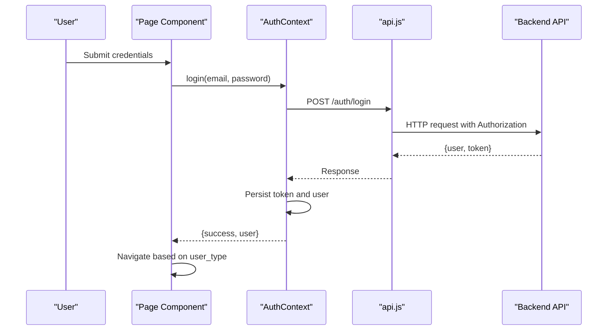

**Diagram sources**
- [Login.jsx:25-45](file://frontend/src/pages/Login.jsx#L25-L45)
- [AuthContext.jsx:21-38](file://frontend/src/context/AuthContext.jsx#L21-L38)
- [api.js:10-21](file://frontend/src/services/api.js#L10-L21)

**Section sources**
- [Login.jsx:1-134](file://frontend/src/pages/Login.jsx#L1-L134)
- [AuthContext.jsx:1-100](file://frontend/src/context/AuthContext.jsx#L1-L100)
- [api.js:1-42](file://frontend/src/services/api.js#L1-L42)

## Detailed Component Analysis

### Home Page
Purpose:
- Showcase platform value proposition and call-to-action buttons.
- Display featured videos and athletes using asynchronous data fetching.

Key behaviors:
- Fetches featured videos and recent athletes concurrently.
- Renders sport categories with links to search filtered by sport.
- Uses skeleton loaders while data is loading.

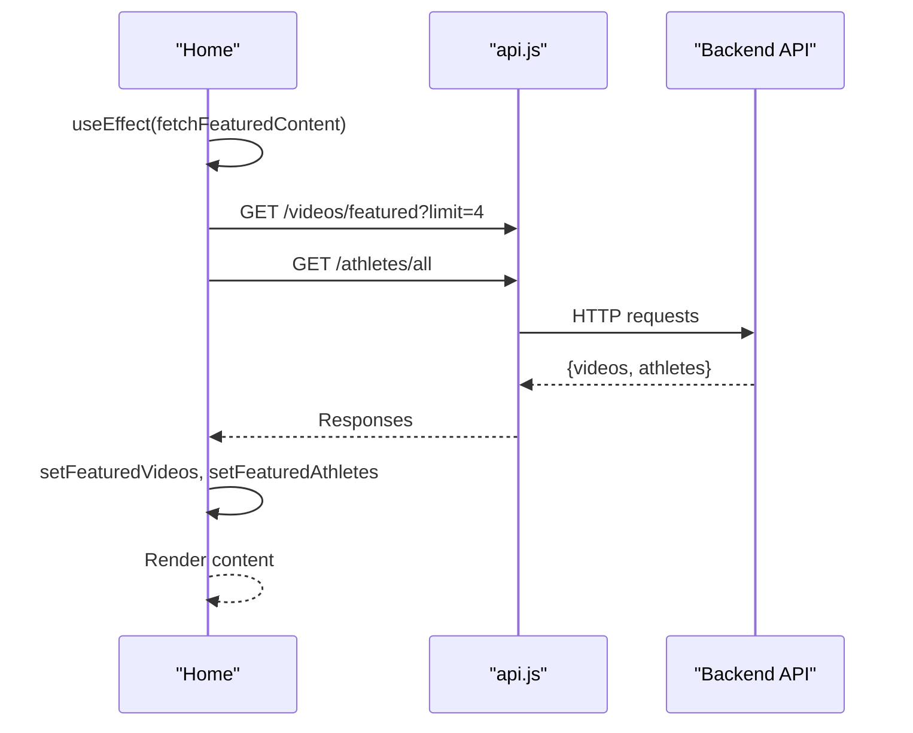

**Diagram sources**
- [Home.jsx:13-30](file://frontend/src/pages/Home.jsx#L13-L30)

**Section sources**
- [Home.jsx:1-231](file://frontend/src/pages/Home.jsx#L1-L231)

### Login Page
Purpose:
- Authenticate existing users and redirect to appropriate dashboard based on user type.

Key behaviors:
- Form state management for email and password.
- Toggle visibility of password field.
- Calls AuthContext.login and navigates on success; displays error messages on failure.
- Prevents submission while loading.

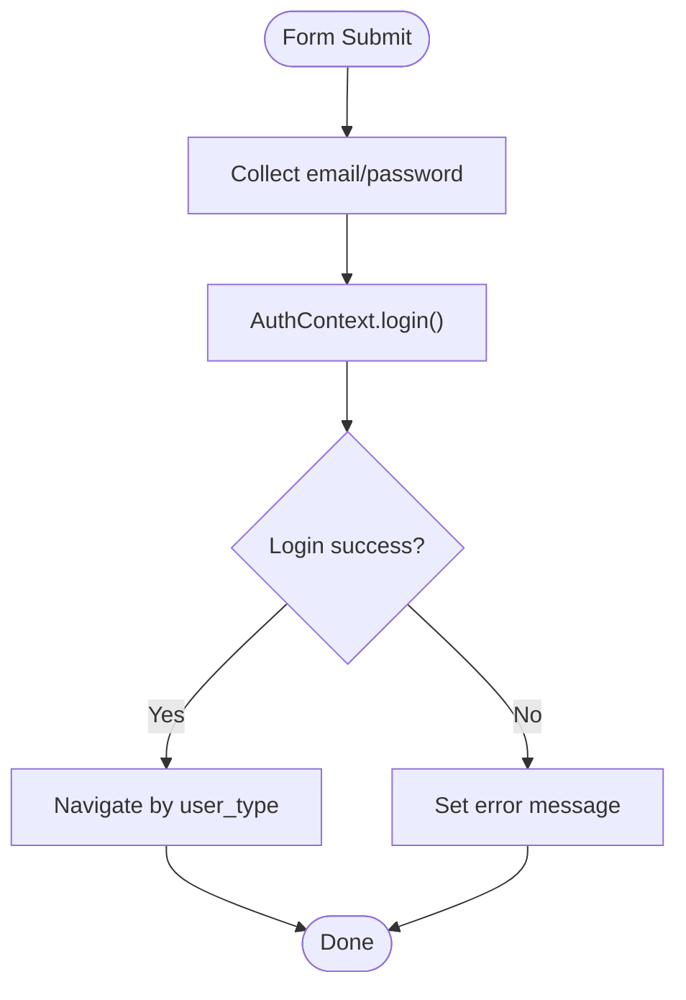

**Diagram sources**
- [Login.jsx:25-45](file://frontend/src/pages/Login.jsx#L25-L45)
- [AuthContext.jsx:21-38](file://frontend/src/context/AuthContext.jsx#L21-L38)

**Section sources**
- [Login.jsx:1-134](file://frontend/src/pages/Login.jsx#L1-L134)
- [AuthContext.jsx:1-100](file://frontend/src/context/AuthContext.jsx#L1-L100)

### Register Page
Purpose:
- Onboard new users with a two-step process: account creation followed by user type selection with URL parameter support.

Key behaviors:
- Step 1 validates name, email, password length, and password confirmation.
- Step 2 selects user type (athlete, scout, club) with URL parameter-based initialization via `searchParams.get('tipo')`.
- Displays step indicators and error messages.
- Navigates to dashboard after successful registration.
- Supports URL parameter `tipo` for direct user type selection (e.g., `/register?tipo=scout`).

**Updated** Enhanced with URL parameter-based user type selection allowing direct navigation to specific user types.

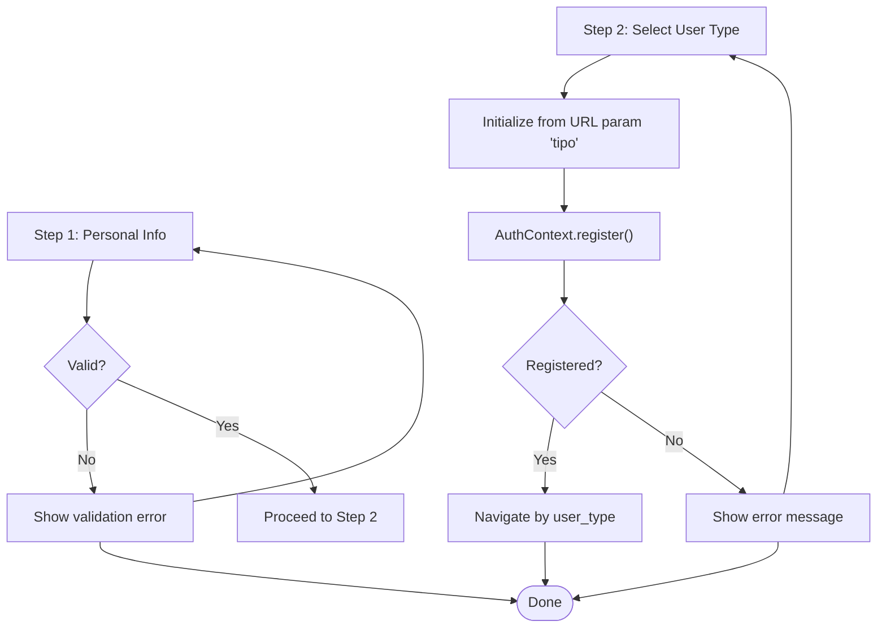

**Diagram sources**
- [Register.jsx:10-18](file://frontend/src/pages/Register.jsx#L10-L18)
- [Register.jsx:42-91](file://frontend/src/pages/Register.jsx#L42-L91)
- [AuthContext.jsx:40-57](file://frontend/src/context/AuthContext.jsx#L40-L57)

**Section sources**
- [Register.jsx:1-288](file://frontend/src/pages/Register.jsx#L1-L288)
- [AuthContext.jsx:1-100](file://frontend/src/context/AuthContext.jsx#L1-L100)

### AthleteDashboard
Purpose:
- Allow athletes to manage profile, view and upload videos, and see personal analytics.

Key behaviors:
- Loads athlete profile and videos concurrently.
- Age calculation from birth date.
- Tabbed interface: Profile, My Videos, Statistics.
- Navigation to UploadVideo page.

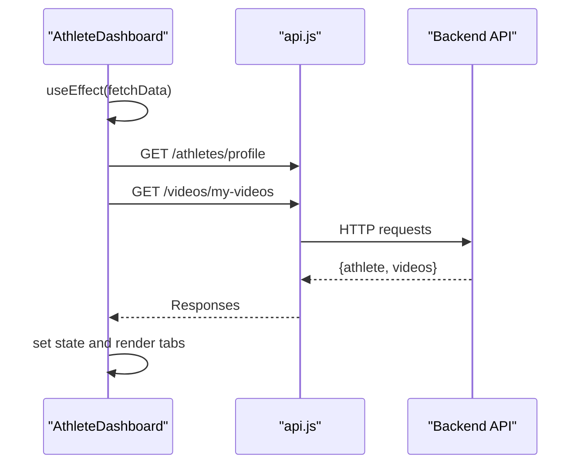

**Diagram sources**
- [AthleteDashboard.jsx:18-35](file://frontend/src/pages/AthleteDashboard.jsx#L18-L35)

**Section sources**
- [AthleteDashboard.jsx:1-277](file://frontend/src/pages/AthleteDashboard.jsx#L1-L277)

### ScoutDashboard
Purpose:
- Enable scouts/clubs to search athletes, manage favorites, and access premium features.

Key behaviors:
- Loads favorites, recent athletes, featured videos, and subscription status.
- Checks subscription status and conditionally renders content.
- Tabbed interface: Dashboard, Favorites, Search.
- Redirects to plans page if subscription is inactive.

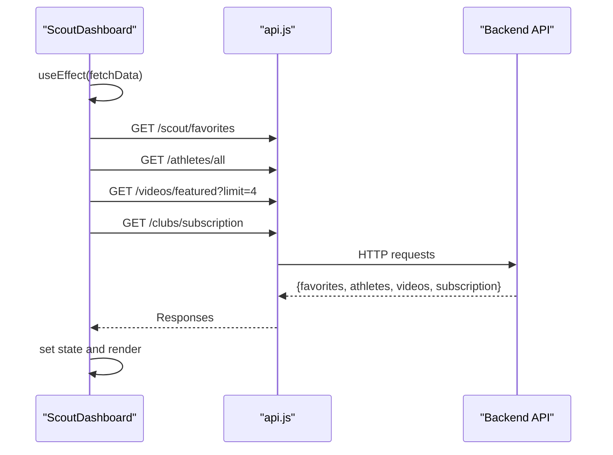

**Diagram sources**
- [ScoutDashboard.jsx:22-46](file://frontend/src/pages/ScoutDashboard.jsx#L22-L46)

**Section sources**
- [ScoutDashboard.jsx:1-254](file://frontend/src/pages/ScoutDashboard.jsx#L1-L254)

### AdminDashboard
Purpose:
- Provide administrative controls for statistics, user management, video moderation, and subscriptions.

Key behaviors:
- Loads stats, users, videos, and subscriptions.
- Approve/reject videos and delete users with confirmation.
- Tabbed interface: Overview, Users, Videos, Subscriptions.

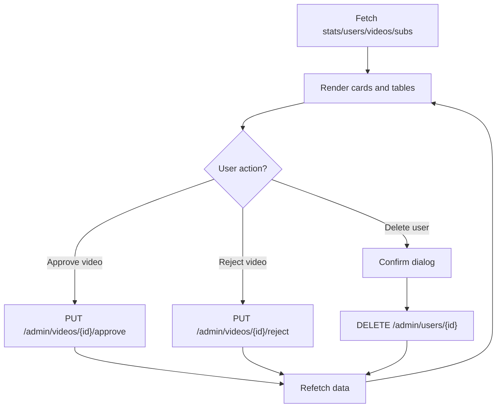

**Diagram sources**
- [AdminDashboard.jsx:21-68](file://frontend/src/pages/AdminDashboard.jsx#L21-L68)

**Section sources**
- [AdminDashboard.jsx:1-317](file://frontend/src/pages/AdminDashboard.jsx#L1-L317)

### AthleteProfile
Purpose:
- Public profile view for athletes with video gallery and favorite actions.

Key behaviors:
- Fetches athlete data and videos by ID.
- Calculates age from birth date.
- Favorite toggle with authentication check and error handling.
- Displays bio, contact info, and statistics.

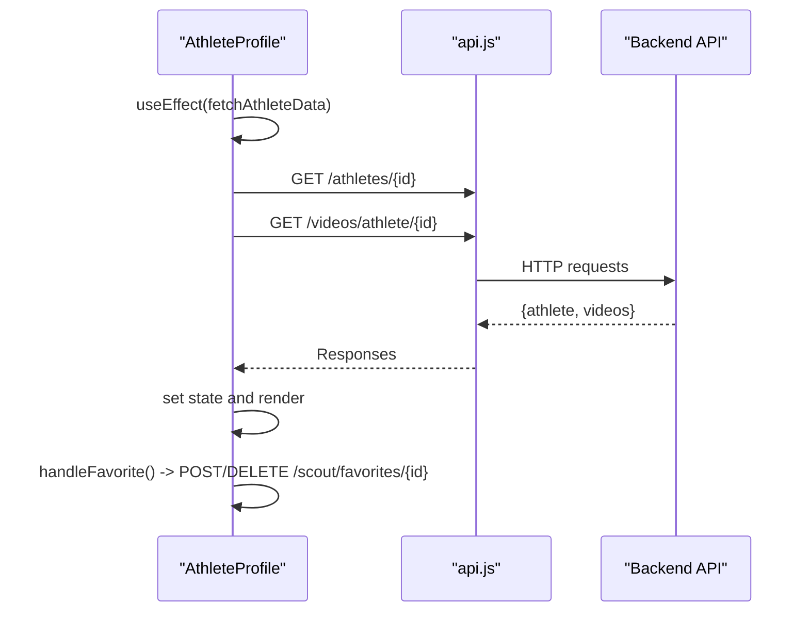

**Diagram sources**
- [AthleteProfile.jsx:20-68](file://frontend/src/pages/AthleteProfile.jsx#L20-L68)

**Section sources**
- [AthleteProfile.jsx:1-302](file://frontend/src/pages/AthleteProfile.jsx#L1-L302)

### UploadVideo
Purpose:
- Allow athletes to submit videos with metadata and select video packages.

Key behaviors:
- Form collects title, type, URL, thumbnail, and description.
- Validates required fields and submits to backend.
- Success and error messaging; redirects to dashboard on success.

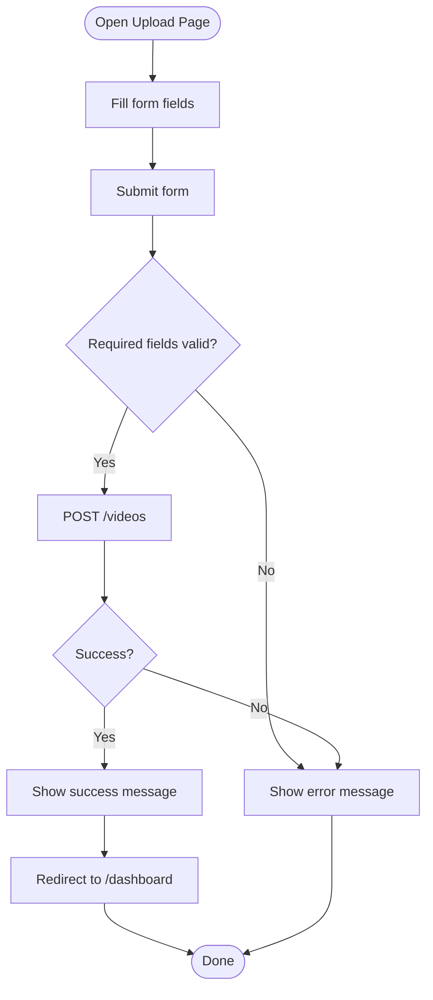

**Diagram sources**
- [UploadVideo.jsx:43-60](file://frontend/src/pages/UploadVideo.jsx#L43-L60)

**Section sources**
- [UploadVideo.jsx:1-234](file://frontend/src/pages/UploadVideo.jsx#L1-L234)

### SearchAthletes
Purpose:
- Enable advanced filtering and search for athletes across sports, categories, states, and positions with performance optimizations.

Key behaviors:
- Maintains filters and search query state.
- Applies filters via URL query parameters.
- Dynamically renders position options based on selected sport.
- Paginates results with skeleton loaders.
- Implements performance optimizations including useCallback hooks and debouncing mechanism.

**Updated** Enhanced with performance optimizations including useCallback hooks and debouncing mechanism to improve search responsiveness.

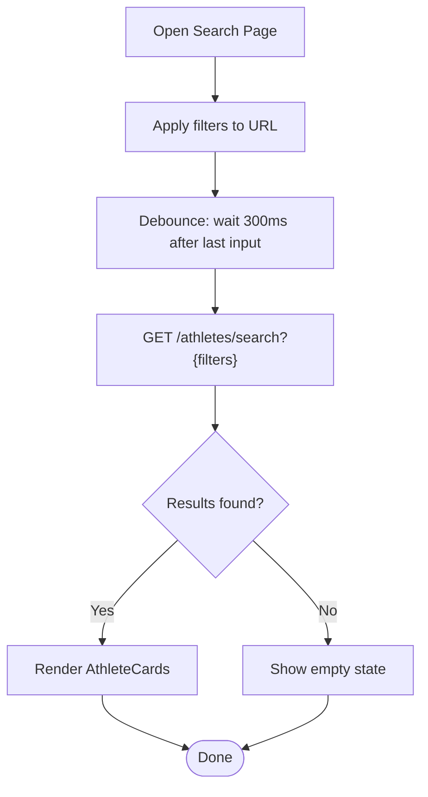

**Diagram sources**
- [SearchAthletes.jsx:29-52](file://frontend/src/pages/SearchAthletes.jsx#L29-L52)
- [SearchAthletes.jsx:30-45](file://frontend/src/pages/SearchAthletes.jsx#L30-L45)

**Section sources**
- [SearchAthletes.jsx:1-235](file://frontend/src/pages/SearchAthletes.jsx#L1-L235)

### ClubPlans
Purpose:
- Present subscription plans for clubs and scouts with feature comparison and call-to-action.

Key behaviors:
- Loads plans from backend.
- Handles subscription flow: authenticated users proceed to ScoutDashboard, others to registration.
- Highlights popular plan and compares features in a table.
- Implements user type validation preventing inappropriate plan subscriptions.

**Updated** Enhanced with user type validation preventing athletes from subscribing to scout/club plans, redirecting them to proper registration flow.

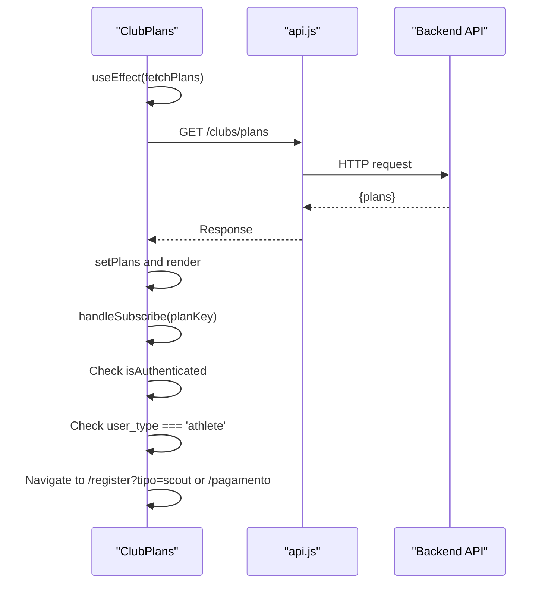

**Diagram sources**
- [ClubPlans.jsx:17-38](file://frontend/src/pages/ClubPlans.jsx#L17-L38)
- [ClubPlans.jsx:32-43](file://frontend/src/pages/ClubPlans.jsx#L32-L43)

**Section sources**
- [ClubPlans.jsx:1-236](file://frontend/src/pages/ClubPlans.jsx#L1-L236)

### SubscriptionPayment
Purpose:
- Process subscription payments for scouts and clubs using PIX transfer with proof-of-payment verification.

Key behaviors:
- Plan selection with predefined pricing tiers (Basic, Pro, Elite Club).
- Subscription creation workflow with pending payment status.
- PIX payment instructions with copy-to-clipboard functionality.
- Proof-of-payment upload with file validation (JPG, PNG, PDF up to 5MB).
- Real-time subscription status tracking (Active, Pending Approval, Rejected).
- Admin approval workflow for payment verification.

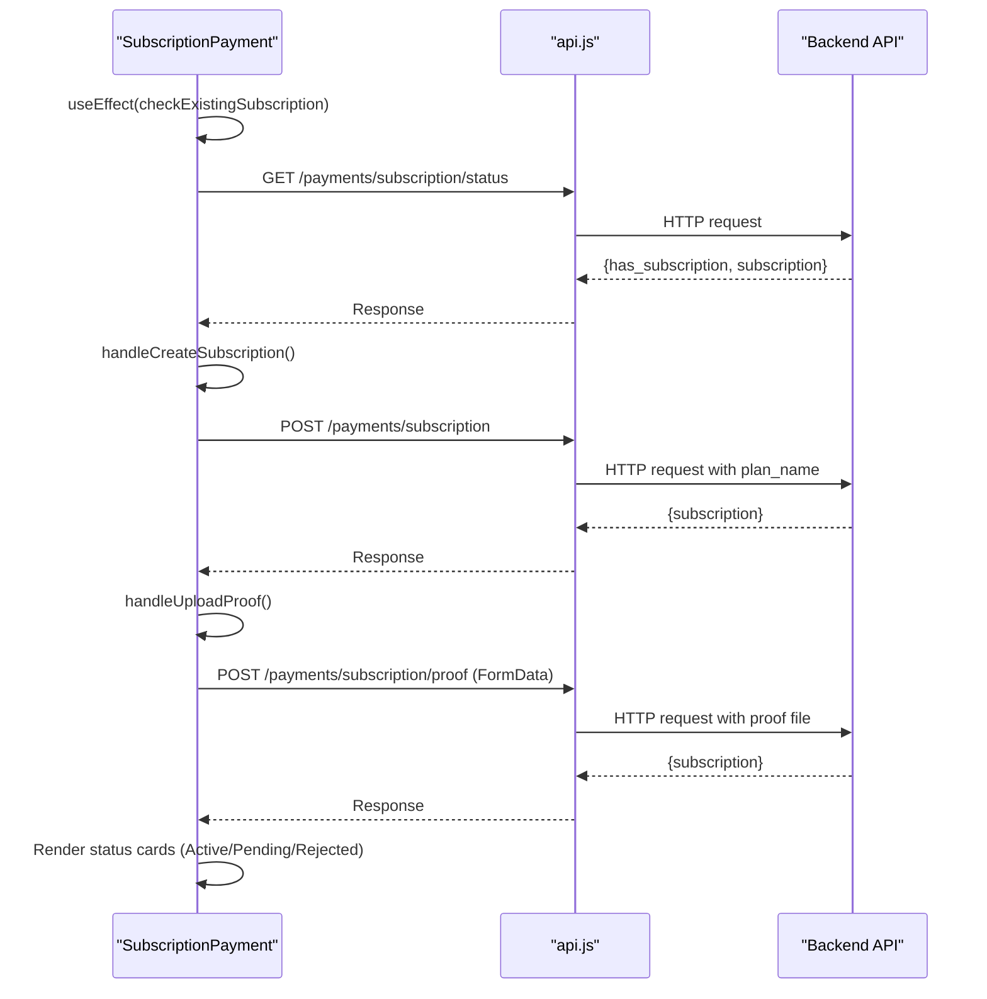

**Diagram sources**
- [SubscriptionPayment.jsx:38-59](file://frontend/src/pages/SubscriptionPayment.jsx#L38-L59)
- [SubscriptionPayment.jsx:61-70](file://frontend/src/pages/SubscriptionPayment.jsx#L61-L70)
- [SubscriptionPayment.jsx:82-107](file://frontend/src/pages/SubscriptionPayment.jsx#L82-L107)

**Section sources**
- [SubscriptionPayment.jsx:1-344](file://frontend/src/pages/SubscriptionPayment.jsx#L1-L344)

## Dependency Analysis
- Pages depend on:
  - AuthContext for authentication state and methods.
  - api.js for HTTP requests and token injection.
  - Shared components for consistent UI.
- Shared components depend on:
  - React Router for navigation.
  - Lucide icons for visual elements.
- No circular dependencies observed among pages and components.

**Updated** Enhanced dependencies with URL parameter handling in Register page and user type validation in ClubPlans page.

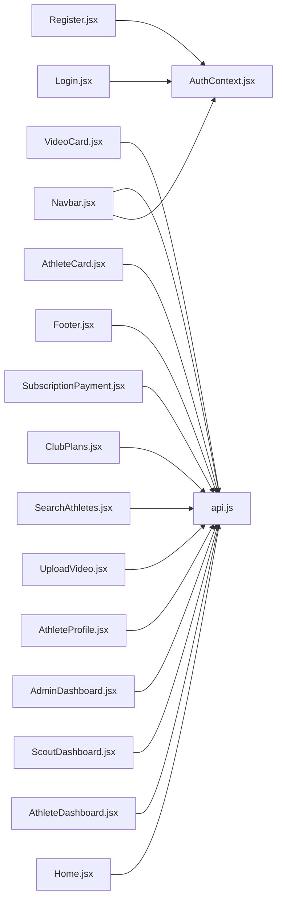

**Diagram sources**
- [Login.jsx:1-134](file://frontend/src/pages/Login.jsx#L1-L134)
- [Register.jsx:1-288](file://frontend/src/pages/Register.jsx#L1-L288)
- [Home.jsx:1-231](file://frontend/src/pages/Home.jsx#L1-L231)
- [AthleteDashboard.jsx:1-277](file://frontend/src/pages/AthleteDashboard.jsx#L1-L277)
- [ScoutDashboard.jsx:1-254](file://frontend/src/pages/ScoutDashboard.jsx#L1-L254)
- [AdminDashboard.jsx:1-317](file://frontend/src/pages/AdminDashboard.jsx#L1-L317)
- [AthleteProfile.jsx:1-302](file://frontend/src/pages/AthleteProfile.jsx#L1-L302)
- [UploadVideo.jsx:1-234](file://frontend/src/pages/UploadVideo.jsx#L1-L234)
- [SearchAthletes.jsx:1-235](file://frontend/src/pages/SearchAthletes.jsx#L1-L235)
- [ClubPlans.jsx:1-236](file://frontend/src/pages/ClubPlans.jsx#L1-L236)
- [SubscriptionPayment.jsx:1-344](file://frontend/src/pages/SubscriptionPayment.jsx#L1-L344)
- [Navbar.jsx:1-130](file://frontend/src/components/Navbar.jsx#L1-L130)
- [Footer.jsx:1-112](file://frontend/src/components/Footer.jsx#L1-L112)
- [AthleteCard.jsx:1-92](file://frontend/src/components/AthleteCard.jsx#L1-L92)
- [VideoCard.jsx:1-48](file://frontend/src/components/VideoCard.jsx#L1-L48)
- [AuthContext.jsx:1-100](file://frontend/src/context/AuthContext.jsx#L1-L100)
- [api.js:1-42](file://frontend/src/services/api.js#L1-L42)

**Section sources**
- [AuthContext.jsx:1-100](file://frontend/src/context/AuthContext.jsx#L1-L100)
- [api.js:1-42](file://frontend/src/services/api.js#L1-L42)
- [Navbar.jsx:1-130](file://frontend/src/components/Navbar.jsx#L1-L130)
- [Footer.jsx:1-112](file://frontend/src/components/Footer.jsx#L1-L112)
- [AthleteCard.jsx:1-92](file://frontend/src/components/AthleteCard.jsx#L1-L92)
- [VideoCard.jsx:1-48](file://frontend/src/components/VideoCard.jsx#L1-L48)

## Performance Considerations
- Concurrent data fetching: Pages like Home, AthleteDashboard, ScoutDashboard use Promise.all to reduce total load time.
- Skeleton loaders: Home, SearchAthletes, and others use skeleton placeholders to improve perceived performance during async loads.
- Conditional rendering: ScoutDashboard avoids heavy computations when subscription is inactive.
- Minimal re-renders: Pages use controlled forms and local state updates to avoid unnecessary renders.
- File upload optimization: SubscriptionPayment uses FormData with proper boundary handling and file size validation.
- **Updated** Performance optimizations in SearchAthletes: useCallback hooks prevent unnecessary re-creation of callback functions, and debouncing mechanism (300ms delay) reduces API calls during rapid typing.
- **Updated** Enhanced user registration flow: URL parameter-based initialization eliminates redundant form steps for direct user type selection.

## Troubleshooting Guide
Common issues and resolutions:
- Authentication failures:
  - Symptom: Error messages on Login/Register.
  - Cause: Invalid credentials or backend validation errors.
  - Resolution: Verify input fields and network connectivity; check backend error messages.
- 401 Unauthorized:
  - Symptom: Automatic redirect to login.
  - Cause: Missing/expired token.
  - Resolution: Clear browser storage and log in again; ensure interceptors attach Authorization header.
- ScoutDashboard subscription requirement:
  - Symptom: Prompt to subscribe when accessing restricted content.
  - Resolution: Navigate to plans page and subscribe; ensure subscription status is active.
- UploadVideo submission errors:
  - Symptom: Error banner after submission.
  - Resolution: Ensure required fields are filled and video URL is valid; retry submission.
- SubscriptionPayment file upload issues:
  - Symptom: Error when uploading proof-of-payment.
  - Cause: File size exceeds 5MB limit or invalid file type.
  - Resolution: Use JPG, PNG, or PDF files under 5MB; retry upload.
- Subscription status not updating:
  - Symptom: Payment approved but status still shows pending.
  - Cause: Admin approval required for manual verification.
  - Resolution: Wait for admin approval or contact support for assistance.
- **Updated** Registration flow issues:
  - Symptom: User type not persisting in registration.
  - Cause: URL parameter not properly handled.
  - Resolution: Ensure URL contains `?tipo=athlete|scout|club` parameter; verify backend accepts user_type field.
- **Updated** Plan subscription restrictions:
  - Symptom: Athletes attempting to subscribe to scout/club plans.
  - Cause: Missing user type validation.
  - Resolution: System now redirects athletes to proper registration flow with `?tipo=scout` parameter.

**Section sources**
- [Login.jsx:59-64](file://frontend/src/pages/Login.jsx#L59-L64)
- [Register.jsx:119-124](file://frontend/src/pages/Register.jsx#L119-L124)
- [api.js:23-33](file://frontend/src/services/api.js#L23-L33)
- [ScoutDashboard.jsx:58-76](file://frontend/src/pages/ScoutDashboard.jsx#L58-L76)
- [UploadVideo.jsx:73-85](file://frontend/src/pages/UploadVideo.jsx#L73-L85)
- [SubscriptionPayment.jsx:72-80](file://frontend/src/pages/SubscriptionPayment.jsx#L72-L80)
- [SubscriptionPayment.jsx:102-106](file://frontend/src/pages/SubscriptionPayment.jsx#L102-L106)
- [Register.jsx:17-18](file://frontend/src/pages/Register.jsx#L17-L18)
- [ClubPlans.jsx:38-41](file://frontend/src/pages/ClubPlans.jsx#L38-L41)

## Conclusion
Craque-Vision's page components are structured around clear separation of concerns: authentication state is centralized, HTTP communication is standardized, and reusable components ensure consistent UI. Each page implements robust data fetching, validation, and error handling tailored to its role—onboarding, athlete management, scouting, administration, public profiles, video submission, discovery, subscription management, and the new subscription payment processing workflow with PIX integration and admin approval processes.

**Updated** Recent enhancements include URL parameter-based user type selection in registration flow, improved subscription validation preventing inappropriate plan access, and performance optimizations in search functionality with useCallback hooks and debouncing mechanisms, providing a more streamlined and efficient user experience across all platform components.