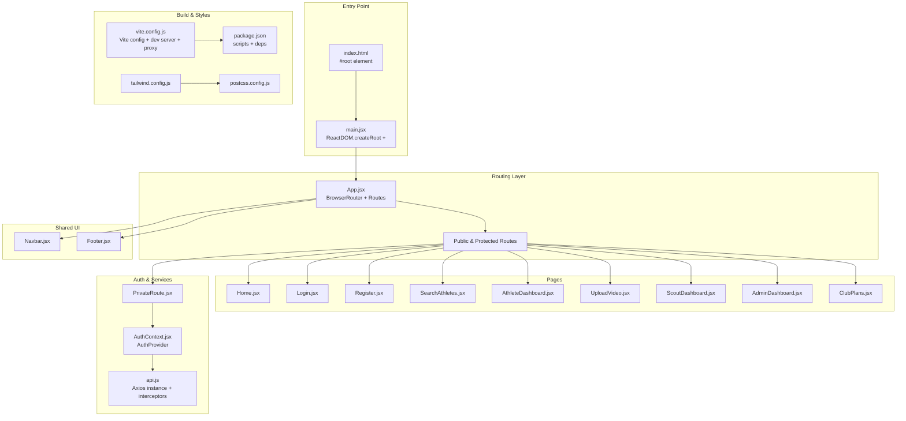
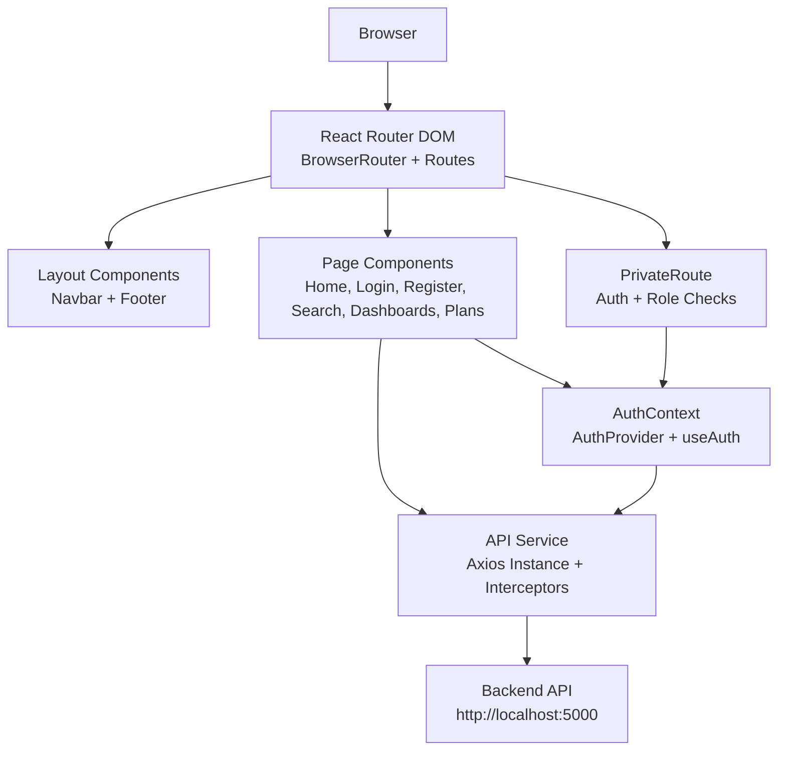
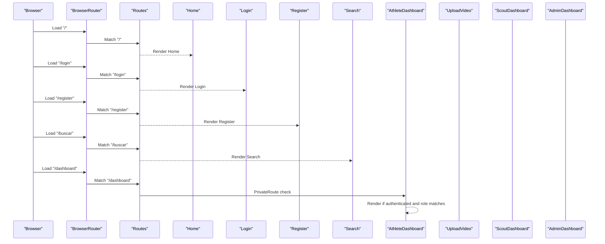
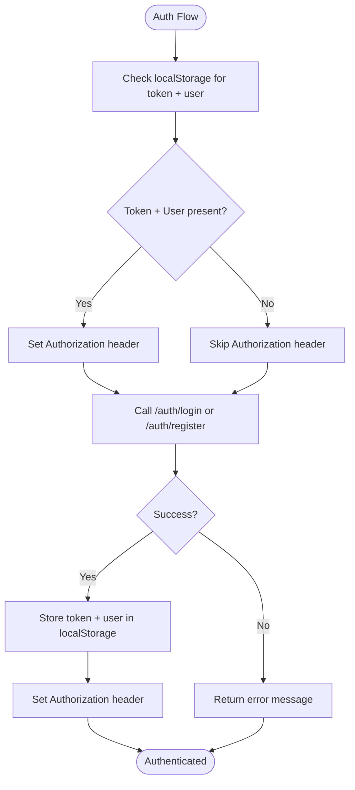
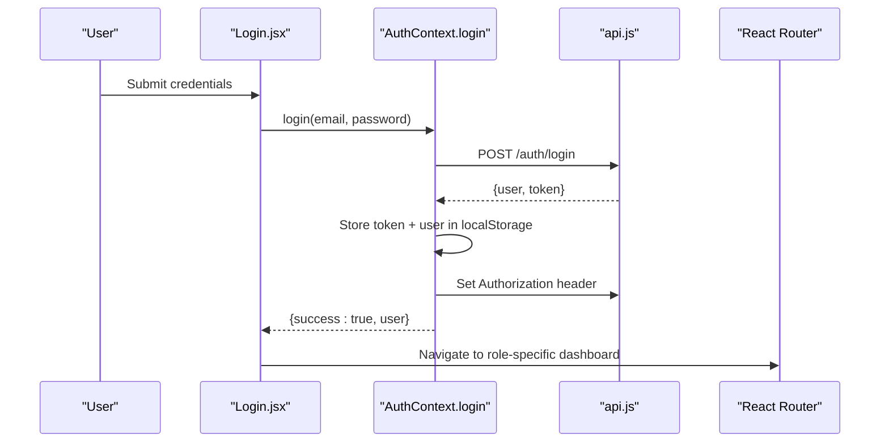
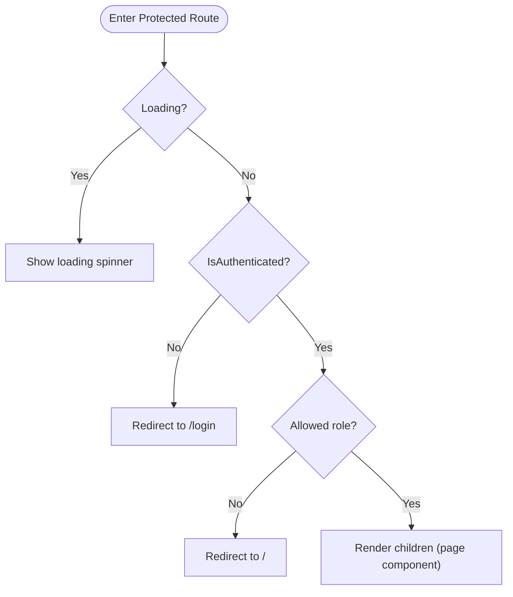
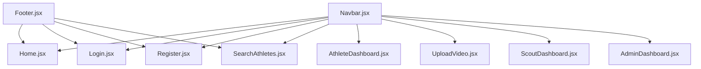
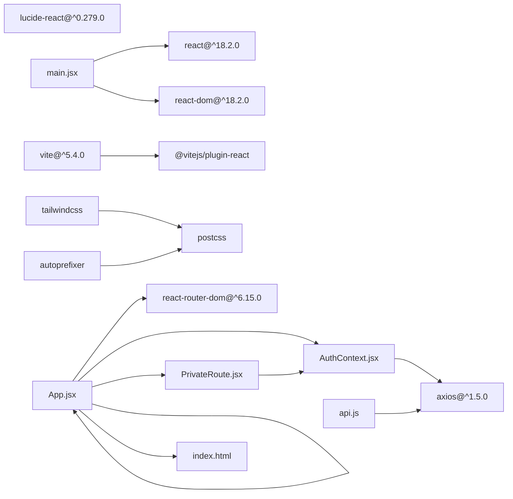

# React Application Structure

<cite>
**Referenced Files in This Document**
- [main.jsx](file://frontend/src/main.jsx)
- [App.jsx](file://frontend/src/App.jsx)
- [vite.config.js](file://frontend/vite.config.js)
- [package.json](file://frontend/package.json)
- [AuthContext.jsx](file://frontend/src/context/AuthContext.jsx)
- [PrivateRoute.jsx](file://frontend/src/components/PrivateRoute.jsx)
- [Home.jsx](file://frontend/src/pages/Home.jsx)
- [Login.jsx](file://frontend/src/pages/Login.jsx)
- [Register.jsx](file://frontend/src/pages/Register.jsx)
- [api.js](file://frontend/src/services/api.js)
- [Navbar.jsx](file://frontend/src/components/Navbar.jsx)
- [Footer.jsx](file://frontend/src/components/Footer.jsx)
- [index.html](file://frontend/index.html)
- [tailwind.config.js](file://frontend/tailwind.config.js)
- [postcss.config.js](file://frontend/postcss.config.js)
</cite>

## Table of Contents
1. [Introduction](#introduction)
2. [Project Structure](#project-structure)
3. [Core Components](#core-components)
4. [Architecture Overview](#architecture-overview)
5. [Detailed Component Analysis](#detailed-component-analysis)
6. [Dependency Analysis](#dependency-analysis)
7. [Performance Considerations](#performance-considerations)
8. [Troubleshooting Guide](#troubleshooting-guide)
9. [Conclusion](#conclusion)

## Introduction
This document explains the Craque-Vision React application structure, focusing on the main App component setup, React Router configuration, BrowserRouter wrapping, and route definitions. It also covers the Vite build system integration, component import patterns, application initialization, routing architecture (public and protected routes with role-based access control), and the overall application flow and component hierarchy. Additionally, it provides information about build configuration, development server setup, and production deployment preparation.

## Project Structure
The frontend application follows a conventional React project layout with feature-based organization:
- Entry point initializes the React app and renders the root component inside a strict mode wrapper.
- App component orchestrates routing, authentication context, and shared UI components.
- Pages represent distinct views (Home, Login, Register, Search, Dashboards).
- Components encapsulate reusable UI elements (Navbar, Footer, PrivateRoute).
- Services manage HTTP communication with the backend API.
- Context provides global authentication state and actions.
- Build configuration integrates Vite, React plugin, Tailwind CSS, and development proxy.

**Diagram sources**
- [index.html:1-15](file://frontend/index.html#L1-L15)
- [main.jsx:1-35](file://frontend/src/main.jsx#L1-L35)
- [App.jsx:1-67](file://frontend/src/App.jsx#L1-L67)
- [Navbar.jsx:1-130](file://frontend/src/components/Navbar.jsx#L1-L130)
- [Footer.jsx:1-112](file://frontend/src/components/Footer.jsx#L1-L112)
- [Home.jsx:1-231](file://frontend/src/pages/Home.jsx#L1-L231)
- [Login.jsx:1-134](file://frontend/src/pages/Login.jsx#L1-L134)
- [Register.jsx:1-287](file://frontend/src/pages/Register.jsx#L1-L287)
- [PrivateRoute.jsx:1-27](file://frontend/src/components/PrivateRoute.jsx#L1-L27)
- [AuthContext.jsx:1-91](file://frontend/src/context/AuthContext.jsx#L1-L91)
- [api.js:1-36](file://frontend/src/services/api.js#L1-L36)
- [vite.config.js:1-20](file://frontend/vite.config.js#L1-L20)
- [package.json:1-38](file://frontend/package.json#L1-L38)
- [tailwind.config.js:1-28](file://frontend/tailwind.config.js#L1-L28)
- [postcss.config.js:1-7](file://frontend/postcss.config.js#L1-L7)

**Section sources**
- [index.html:1-15](file://frontend/index.html#L1-L15)
- [main.jsx:1-35](file://frontend/src/main.jsx#L1-L35)
- [App.jsx:1-67](file://frontend/src/App.jsx#L1-L67)
- [vite.config.js:1-20](file://frontend/vite.config.js#L1-L20)
- [package.json:1-38](file://frontend/package.json#L1-L38)

## Core Components
- Entry point and initialization:
  - The application bootstraps by locating the #root element in index.html and rendering the App component within React.StrictMode. It includes robust error handling during rendering and logs initialization steps for debugging.
- Routing and navigation:
  - App.jsx wraps the entire application with BrowserRouter and defines all routes. Public routes include Home, Login, Register, Search, and Plans. Protected routes are guarded by PrivateRoute and restrict access based on authentication and user roles.
- Authentication context:
  - AuthProvider manages user state, persists tokens and user data in localStorage, and exposes login, register, logout, and authentication status to child components. It also sets Authorization headers for API requests.
- Protected routing:
  - PrivateRoute enforces authentication checks and role-based access control using allowedTypes. It redirects unauthenticated users to Login and unauthorized roles to Home.
- Shared UI:
  - Navbar displays navigation links, user profile, and logout functionality. Footer provides site information and links grouped by audience segments.
- API service:
  - api.js creates an Axios instance with base URL from environment variables, attaches Authorization headers automatically, and handles 401 responses by clearing local storage and redirecting to Login.

**Section sources**
- [main.jsx:1-35](file://frontend/src/main.jsx#L1-L35)
- [App.jsx:1-67](file://frontend/src/App.jsx#L1-L67)
- [AuthContext.jsx:1-91](file://frontend/src/context/AuthContext.jsx#L1-L91)
- [PrivateRoute.jsx:1-27](file://frontend/src/components/PrivateRoute.jsx#L1-L27)
- [Navbar.jsx:1-130](file://frontend/src/components/Navbar.jsx#L1-L130)
- [Footer.jsx:1-112](file://frontend/src/components/Footer.jsx#L1-L112)
- [api.js:1-36](file://frontend/src/services/api.js#L1-L36)

## Architecture Overview
The application follows a layered architecture:
- Presentation layer: App.jsx orchestrates routing and renders shared UI (Navbar, Footer).
- Feature pages: Independent views for public and role-specific dashboards.
- Authentication layer: AuthProvider and PrivateRoute enforce access control.
- Data access: api.js centralizes HTTP requests and authentication-related headers.
- Build and styling: Vite compiles assets, Tailwind CSS provides utility-first styling, and PostCSS processes Tailwind.

**Diagram sources**
- [App.jsx:1-67](file://frontend/src/App.jsx#L1-L67)
- [Navbar.jsx:1-130](file://frontend/src/components/Navbar.jsx#L1-L130)
- [Footer.jsx:1-112](file://frontend/src/components/Footer.jsx#L1-L112)
- [Home.jsx:1-231](file://frontend/src/pages/Home.jsx#L1-L231)
- [Login.jsx:1-134](file://frontend/src/pages/Login.jsx#L1-L134)
- [Register.jsx:1-287](file://frontend/src/pages/Register.jsx#L1-L287)
- [PrivateRoute.jsx:1-27](file://frontend/src/components/PrivateRoute.jsx#L1-L27)
- [AuthContext.jsx:1-91](file://frontend/src/context/AuthContext.jsx#L1-L91)
- [api.js:1-36](file://frontend/src/services/api.js#L1-L36)

## Detailed Component Analysis

### App Component and Routing Setup
- BrowserRouter wraps the entire application to enable client-side routing.
- Routes define:
  - Public routes: "/", "/login", "/register", "/atleta/:id", "/buscar", "/planos".
  - Protected routes: "/dashboard" (athlete), "/upload" (athlete), "/scout" (scout, club), "/admin" (admin).
- Protected routes use PrivateRoute with allowedTypes to enforce role-based access.
- ErrorBoundary wraps the application to catch rendering errors at the top level.
- AuthProvider supplies authentication state to all routes.

**Diagram sources**
- [App.jsx:20-64](file://frontend/src/App.jsx#L20-L64)
- [PrivateRoute.jsx:4-24](file://frontend/src/components/PrivateRoute.jsx#L4-L24)

**Section sources**
- [App.jsx:1-67](file://frontend/src/App.jsx#L1-L67)
- [PrivateRoute.jsx:1-27](file://frontend/src/components/PrivateRoute.jsx#L1-L27)

### Authentication Context and API Integration
- AuthProvider:
  - Initializes from localStorage on mount.
  - Provides login, register, logout, and isAuthenticated.
  - Sets Authorization header on successful login.
- api.js:
  - Base URL from environment variable with fallback.
  - Automatically attaches Authorization header for authenticated requests.
  - Handles 401 responses by clearing credentials and redirecting to Login.

**Diagram sources**
- [AuthContext.jsx:6-79](file://frontend/src/context/AuthContext.jsx#L6-L79)
- [api.js:10-33](file://frontend/src/services/api.js#L10-L33)

**Section sources**
- [AuthContext.jsx:1-91](file://frontend/src/context/AuthContext.jsx#L1-L91)
- [api.js:1-36](file://frontend/src/services/api.js#L1-L36)

### Login and Registration Pages
- Login:
  - Collects email/password, toggles password visibility, and submits via useAuth.login.
  - Redirects to role-specific dashboard after successful login.
- Register:
  - Multi-step form collecting personal info and user type selection.
  - Validates step 1, then submits registration data and navigates to role-specific dashboard.

**Diagram sources**
- [Login.jsx:25-45](file://frontend/src/pages/Login.jsx#L25-L45)
- [AuthContext.jsx:21-38](file://frontend/src/context/AuthContext.jsx#L21-L38)
- [api.js:3-8](file://frontend/src/services/api.js#L3-L8)

**Section sources**
- [Login.jsx:1-134](file://frontend/src/pages/Login.jsx#L1-L134)
- [Register.jsx:1-287](file://frontend/src/pages/Register.jsx#L1-L287)
- [AuthContext.jsx:1-91](file://frontend/src/context/AuthContext.jsx#L1-L91)

### Protected Routes and Role-Based Access Control
- PrivateRoute:
  - Checks loading state, authentication, and user role against allowedTypes.
  - Redirects unauthenticated users to Login and unauthorized roles to Home.
- Allowed roles:
  - Athlete: "/dashboard", "/upload"
  - Scout/Club: "/scout"
  - Admin: "/admin"

**Diagram sources**
- [PrivateRoute.jsx:4-24](file://frontend/src/components/PrivateRoute.jsx#L4-L24)
- [App.jsx:36-55](file://frontend/src/App.jsx#L36-L55)

**Section sources**
- [PrivateRoute.jsx:1-27](file://frontend/src/components/PrivateRoute.jsx#L1-L27)
- [App.jsx:1-67](file://frontend/src/App.jsx#L1-L67)

### Navigation and Layout
- Navbar:
  - Displays logo, navigation links, and user actions.
  - Shows profile/dashboard link based on user role and provides logout.
- Footer:
  - Provides site branding, social links, and categorized links for different audiences.

**Diagram sources**
- [Navbar.jsx:1-130](file://frontend/src/components/Navbar.jsx#L1-L130)
- [Footer.jsx:1-112](file://frontend/src/components/Footer.jsx#L1-L112)
- [Home.jsx:1-231](file://frontend/src/pages/Home.jsx#L1-L231)
- [Login.jsx:1-134](file://frontend/src/pages/Login.jsx#L1-L134)
- [Register.jsx:1-287](file://frontend/src/pages/Register.jsx#L1-L287)
- [App.jsx:28-56](file://frontend/src/App.jsx#L28-L56)

**Section sources**
- [Navbar.jsx:1-130](file://frontend/src/components/Navbar.jsx#L1-L130)
- [Footer.jsx:1-112](file://frontend/src/components/Footer.jsx#L1-L112)

## Dependency Analysis
- External dependencies (selected):
  - React, React DOM, React Router DOM for UI and routing.
  - Axios for HTTP requests.
  - lucide-react for icons.
  - Vite, @vitejs/plugin-react for build tooling.
  - Tailwind CSS and PostCSS for styling.
- Internal dependencies:
  - App.jsx depends on AuthProvider, ErrorBoundary, Navbar, Footer, and all page components.
  - PrivateRoute depends on AuthContext.
  - Pages depend on api.js for data fetching.
  - Navbar and Footer depend on React Router for navigation.

**Diagram sources**
- [package.json:6-19](file://frontend/package.json#L6-L19)
- [main.jsx:1-3](file://frontend/src/main.jsx#L1-L3)
- [App.jsx:1-6](file://frontend/src/App.jsx#L1-L6)
- [AuthContext.jsx:1-2](file://frontend/src/context/AuthContext.jsx#L1-L2)
- [PrivateRoute.jsx:1-2](file://frontend/src/components/PrivateRoute.jsx#L1-L2)
- [api.js:1-1](file://frontend/src/services/api.js#L1-L1)
- [vite.config.js:1-2](file://frontend/vite.config.js#L1-L2)
- [tailwind.config.js:1-27](file://frontend/tailwind.config.js#L1-L27)
- [postcss.config.js:1-6](file://frontend/postcss.config.js#L1-L6)

**Section sources**
- [package.json:1-38](file://frontend/package.json#L1-L38)
- [vite.config.js:1-20](file://frontend/vite.config.js#L1-L20)

## Performance Considerations
- Lazy loading: Consider lazy-loading heavy page components to reduce initial bundle size.
- Code splitting: Keep route components split by feature to leverage Vite's native code splitting.
- Optimized dependencies: The Vite configuration explicitly optimizes commonly used packages to improve cold start and rebuild times.
- Styling: Tailwind CSS purges unused styles; ensure content globs cover all template paths to minimize CSS size.
- Network: Centralized API service reduces redundant headers and improves error handling consistency.

[No sources needed since this section provides general guidance]

## Troubleshooting Guide
- Root element missing:
  - The entry point checks for the #root element and displays a clear error if absent. Verify index.html contains the #root div.
- Fatal rendering errors:
  - The entry point catches rendering exceptions and displays a detailed error message. Check browser console for stack traces.
- Authentication issues:
  - If redirected to Login after a 401, confirm token validity and network connectivity. Ensure Authorization header is being set by AuthProvider.
- Proxy configuration:
  - Vite dev server proxies /api to the backend. Confirm backend is running on http://localhost:5000 and CORS is configured accordingly.
- Environment variables:
  - API base URL falls back to localhost:5000 when environment variable is not set. Ensure VITE_API_URL is configured if using a different backend host.

**Section sources**
- [main.jsx:12-34](file://frontend/src/main.jsx#L12-L34)
- [index.html:10-12](file://frontend/index.html#L10-L12)
- [api.js:23-33](file://frontend/src/services/api.js#L23-L33)
- [vite.config.js:6-14](file://frontend/vite.config.js#L6-L14)
- [AuthContext.jsx:10-19](file://frontend/src/context/AuthContext.jsx#L10-L19)

## Conclusion
Craque-Vision employs a clean, modular React architecture with React Router for navigation, Vite for build tooling, and a centralized authentication context with role-based protected routes. The App component serves as the routing hub, while shared components (Navbar, Footer) provide consistent navigation and branding. The API service encapsulates HTTP concerns and integrates seamlessly with the authentication layer. The build configuration supports a smooth development experience with hot module replacement, proxying, and optimized dependencies, while Tailwind CSS enables rapid UI iteration. This structure facilitates maintainability, scalability, and clear separation of concerns across public and protected areas of the application.