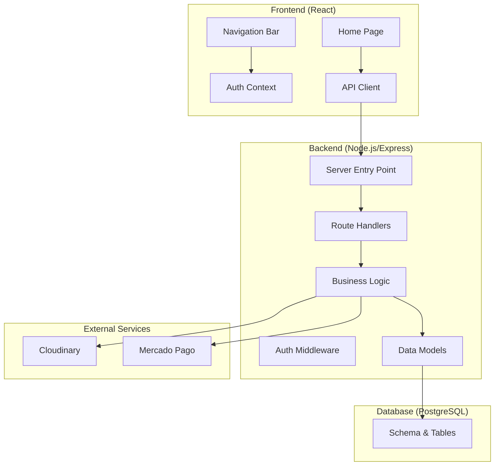
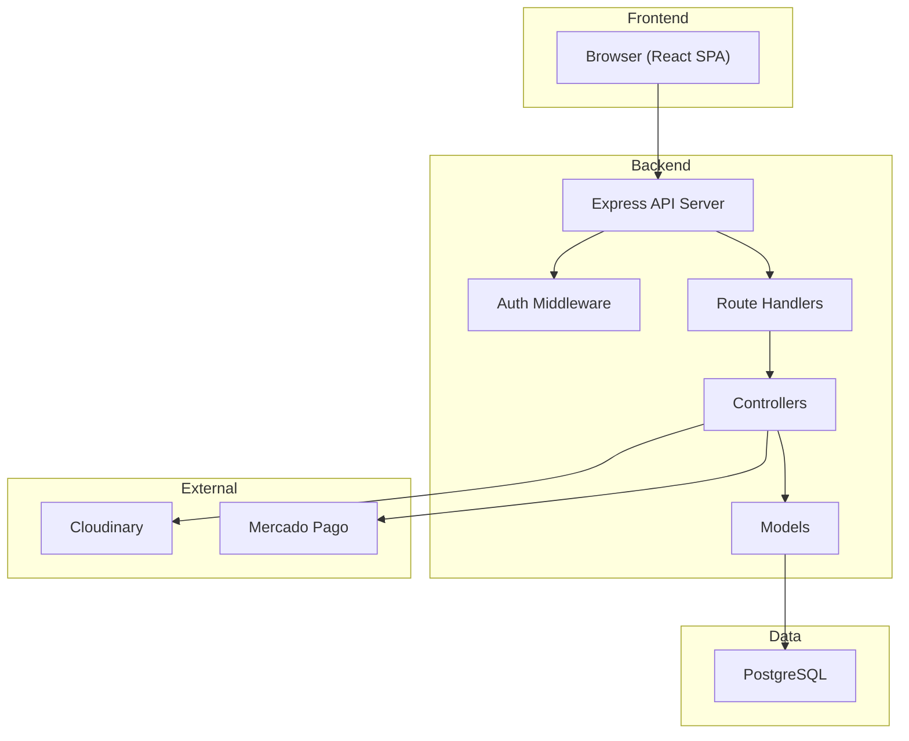
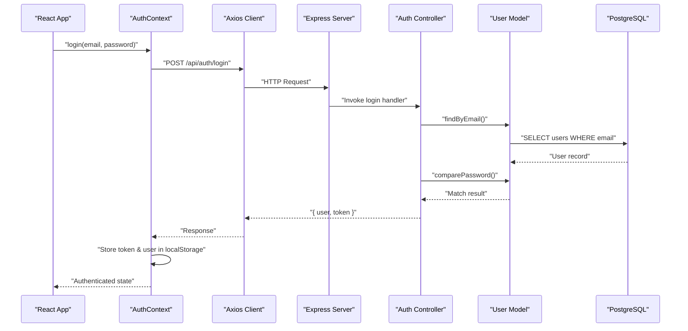
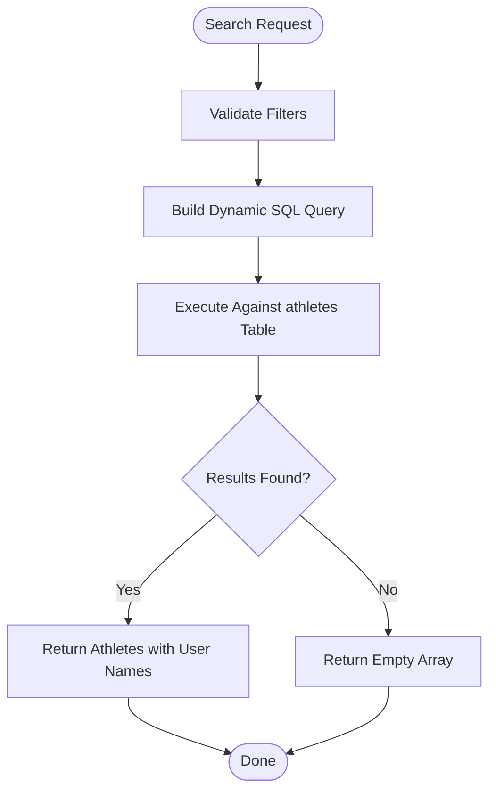
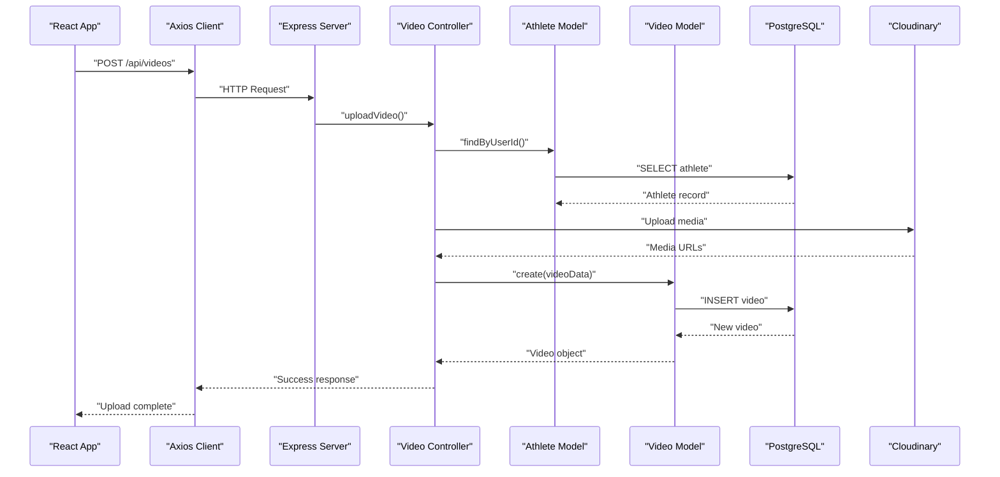
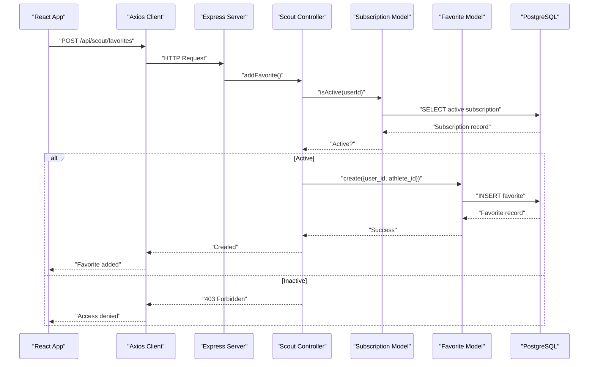
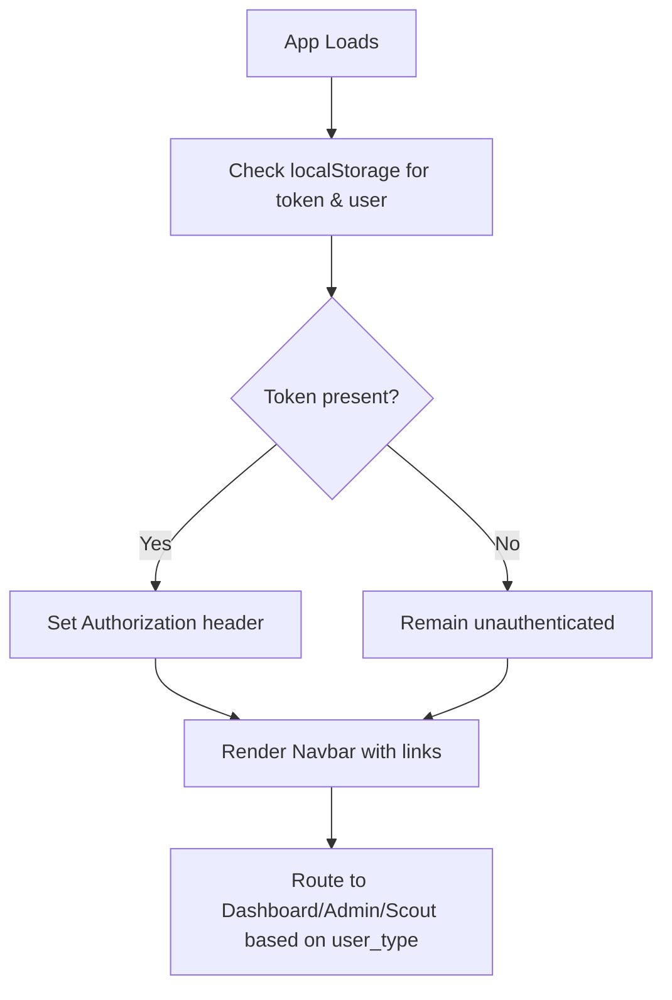
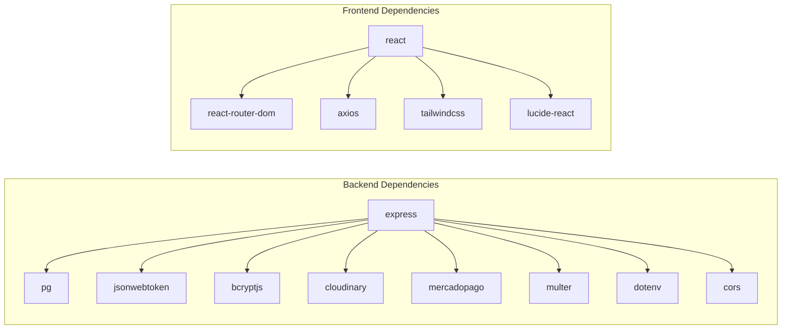

# Project Overview

<cite>
**Referenced Files in This Document**
- [README.md](file://README.md)
- [QUICKSTART.md](file://QUICKSTART.md)
- [backend/server.js](file://backend/server.js)
- [backend/package.json](file://backend/package.json)
- [frontend/package.json](file://frontend/package.json)
- [database/schema.sql](file://database/schema.sql)
- [backend/models/user.model.js](file://backend/models/user.model.js)
- [backend/models/athlete.model.js](file://backend/models/athlete.model.js)
- [backend/models/video.model.js](file://backend/models/video.model.js)
- [backend/models/subscription.model.js](file://backend/models/subscription.model.js)
- [backend/controllers/auth.controller.js](file://backend/controllers/auth.controller.js)
- [backend/controllers/athlete.controller.js](file://backend/controllers/athlete.controller.js)
- [backend/controllers/video.controller.js](file://backend/controllers/video.controller.js)
- [backend/controllers/scout.controller.js](file://backend/controllers/scout.controller.js)
- [frontend/src/context/AuthContext.jsx](file://frontend/src/context/AuthContext.jsx)
- [frontend/src/services/api.js](file://frontend/src/services/api.js)
- [frontend/src/pages/Home.jsx](file://frontend/src/pages/Home.jsx)
- [frontend/src/components/Navbar.jsx](file://frontend/src/components/Navbar.jsx)
</cite>

## Table of Contents
1. [Introduction](#introduction)
2. [Project Structure](#project-structure)
3. [Core Components](#core-components)
4. [Architecture Overview](#architecture-overview)
5. [Detailed Component Analysis](#detailed-component-analysis)
6. [Dependency Analysis](#dependency-analysis)
7. [Performance Considerations](#performance-considerations)
8. [Troubleshooting Guide](#troubleshooting-guide)
9. [Conclusion](#conclusion)

## Introduction
Craque Vision is a multi-sport talent discovery platform designed to connect athletes, scouts, and clubs in Brazil. Its primary purpose is to bridge the gap between emerging athletic talent and the organizations that scout and recruit them, leveraging modern web technologies to deliver a seamless digital experience.

Core Value Proposition
- For Athletes: Build professional profiles, showcase highlight reels, and gain visibility to scouts and clubs.
- For Scouts/Clubs: Access a centralized database of verified athletes with advanced filtering, manage favorites, and maintain organized scouting workflows.
- For Administrators: Oversee platform operations, moderate content, and manage user accounts and video approvals.

Target Audience
- Athletes seeking representation and exposure
- Scout agencies and football clubs evaluating prospects
- Platform administrators managing content and users

Key Differentiators
- Subscription-based access model for scouts/clubs enabling premium features like advanced search and unlimited favorites
- Integrated video management with moderation workflows
- Role-based dashboards tailored to user needs
- Real-time favorites and search capabilities optimized for performance

## Project Structure
The project follows a clear separation of concerns with a Node.js/Express backend serving a React frontend, supported by a PostgreSQL database. External integrations include Cloudinary for media storage and Mercado Pago for payments.

**Diagram sources**
- [backend/server.js:1-40](file://backend/server.js#L1-L40)
- [frontend/src/pages/Home.jsx:1-231](file://frontend/src/pages/Home.jsx#L1-L231)
- [frontend/src/components/Navbar.jsx:1-130](file://frontend/src/components/Navbar.jsx#L1-L130)
- [frontend/src/context/AuthContext.jsx:1-91](file://frontend/src/context/AuthContext.jsx#L1-L91)
- [frontend/src/services/api.js:1-36](file://frontend/src/services/api.js#L1-L36)
- [database/schema.sql:1-185](file://database/schema.sql#L1-L185)

**Section sources**
- [README.md:63-132](file://README.md#L63-L132)
- [backend/server.js:1-40](file://backend/server.js#L1-L40)
- [frontend/package.json:1-38](file://frontend/package.json#L1-L38)
- [backend/package.json:1-25](file://backend/package.json#L1-L25)

## Core Components
This section outlines the platform’s feature set and how it aligns with the codebase structure.

- Athlete Registration and Profiles
  - Endpoint: POST /api/auth/register, GET /api/auth/profile
  - Functionality: User creation, profile retrieval, role assignment
  - Implementation: Authentication controller manages registration and profile access; user model handles persistence and password hashing

- Video Uploads and Management
  - Endpoint: POST /api/videos, GET /api/videos/my-videos, GET /api/videos/featured
  - Functionality: Upload videos linked to athlete profiles, retrieve featured content, and manage ownership
  - Implementation: Video controller coordinates with athlete and like models; video model persists metadata and status

- Advanced Search Capabilities
  - Endpoint: GET /api/athletes/search, GET /api/athletes/all
  - Functionality: Filter athletes by sport, category, state, and position
  - Implementation: Athlete controller delegates to athlete model which constructs dynamic queries

- Subscription-Based Scout Access
  - Endpoint: GET /api/clubs/plans, POST /api/clubs/subscribe, GET /api/clubs/subscription
  - Functionality: Manage subscription plans and validate active status for scout features
  - Implementation: Subscription model enforces access control for scout features

- Favorites System
  - Endpoint: POST /api/scout/favorites, GET /api/scout/favorites
  - Functionality: Save and retrieve favorite athletes with subscription validation
  - Implementation: Scout controller integrates with favorite model and subscription checks

- Administrative Controls
  - Endpoint: GET /api/admin/stats, GET /api/admin/users, PUT /api/admin/videos/:id/approve
  - Functionality: Platform oversight, user and video management
  - Implementation: Admin routes coordinate with models for stats and moderation

Technology Stack Overview
- Backend: Node.js with Express for routing and middleware; PostgreSQL for relational data; JWT for authentication; bcrypt for password hashing; Cloudinary and Mercado Pago for media and payments
- Frontend: React with React Router for navigation; Axios for HTTP requests; Tailwind CSS for styling; Lucide React for icons
- External Integrations: Cloudinary for secure video and image storage; Mercado Pago for payment processing

How Technologies Work Together
- The React frontend communicates with the Express backend via Axios, authenticating requests with JWT tokens stored in localStorage
- The backend uses route handlers to delegate to controllers, which interact with models to query and mutate data in PostgreSQL
- Controllers orchestrate external services (Cloudinary for media, Mercado Pago for payments) and enforce business rules (e.g., subscription validation)
- The database schema defines normalized tables with indexes and triggers to optimize performance and maintain data integrity

**Section sources**
- [README.md:5-30](file://README.md#L5-L30)
- [README.md:134-171](file://README.md#L134-L171)
- [QUICKSTART.md:50-67](file://QUICKSTART.md#L50-L67)
- [backend/package.json:10-20](file://backend/package.json#L10-L20)
- [frontend/package.json:6-18](file://frontend/package.json#L6-L18)
- [database/schema.sql:14-185](file://database/schema.sql#L14-L185)

## Architecture Overview
The system architecture emphasizes clean separation between presentation, business logic, and data layers, with explicit role-based access control and external service integrations.

**Diagram sources**
- [backend/server.js:1-40](file://backend/server.js#L1-L40)
- [backend/controllers/auth.controller.js:1-72](file://backend/controllers/auth.controller.js#L1-L72)
- [backend/controllers/athlete.controller.js:1-91](file://backend/controllers/athlete.controller.js#L1-L91)
- [backend/controllers/video.controller.js:1-111](file://backend/controllers/video.controller.js#L1-L111)
- [backend/controllers/scout.controller.js:1-96](file://backend/controllers/scout.controller.js#L1-L96)
- [database/schema.sql:14-185](file://database/schema.sql#L14-L185)

## Detailed Component Analysis

### Authentication and Authorization Flow
The authentication system uses JWT tokens issued upon successful login or registration. The frontend stores tokens in localStorage and attaches them to API requests via an Axios interceptor. The backend validates tokens through middleware and exposes protected routes.

**Diagram sources**
- [frontend/src/context/AuthContext.jsx:21-38](file://frontend/src/context/AuthContext.jsx#L21-L38)
- [frontend/src/services/api.js:10-21](file://frontend/src/services/api.js#L10-L21)
- [backend/controllers/auth.controller.js:30-59](file://backend/controllers/auth.controller.js#L30-L59)
- [backend/models/user.model.js:20-38](file://backend/models/user.model.js#L20-L38)
- [database/schema.sql:14-24](file://database/schema.sql#L14-L24)

**Section sources**
- [frontend/src/context/AuthContext.jsx:1-91](file://frontend/src/context/AuthContext.jsx#L1-L91)
- [frontend/src/services/api.js:1-36](file://frontend/src/services/api.js#L1-L36)
- [backend/controllers/auth.controller.js:1-72](file://backend/controllers/auth.controller.js#L1-L72)
- [backend/models/user.model.js:1-42](file://backend/models/user.model.js#L1-L42)

### Athlete Search and Profile Management
Athletes can create profiles, update personal and physical attributes, and be discovered through advanced filters. The search endpoint supports filtering by sport, category, state, and position.

**Diagram sources**
- [backend/controllers/athlete.controller.js:73-81](file://backend/controllers/athlete.controller.js#L73-L81)
- [backend/models/athlete.model.js:51-86](file://backend/models/athlete.model.js#L51-L86)
- [database/schema.sql:27-67](file://database/schema.sql#L27-L67)

**Section sources**
- [backend/controllers/athlete.controller.js:1-91](file://backend/controllers/athlete.controller.js#L1-L91)
- [backend/models/athlete.model.js:1-119](file://backend/models/athlete.model.js#L1-L119)
- [database/schema.sql:27-67](file://database/schema.sql#L27-L67)

### Video Upload and Moderation Workflow
Athletes upload videos linked to their profiles. Videos are stored externally and tracked in the database with moderation status.

**Diagram sources**
- [backend/controllers/video.controller.js:5-32](file://backend/controllers/video.controller.js#L5-L32)
- [backend/models/athlete.model.js:34-38](file://backend/models/athlete.model.js#L34-L38)
- [backend/models/video.model.js:4-16](file://backend/models/video.model.js#L4-L16)
- [database/schema.sql:69-88](file://database/schema.sql#L69-L88)

**Section sources**
- [backend/controllers/video.controller.js:1-111](file://backend/controllers/video.controller.js#L1-L111)
- [backend/models/video.model.js:1-61](file://backend/models/video.model.js#L1-L61)
- [database/schema.sql:69-88](file://database/schema.sql#L69-L88)

### Scout Access Control and Favorites
Scouts and clubs must have an active subscription to access advanced features like athlete search and favorites. The system validates subscription status before allowing privileged actions.

**Diagram sources**
- [backend/controllers/scout.controller.js:50-73](file://backend/controllers/scout.controller.js#L50-L73)
- [backend/models/subscription.model.js:29-40](file://backend/models/subscription.model.js#L29-L40)
- [backend/models/favorite.model.js](file://backend/models/favorite.model.js)
- [database/schema.sql:120-128](file://database/schema.sql#L120-L128)

**Section sources**
- [backend/controllers/scout.controller.js:1-96](file://backend/controllers/scout.controller.js#L1-L96)
- [backend/models/subscription.model.js:1-55](file://backend/models/subscription.model.js#L1-L55)
- [database/schema.sql:120-128](file://database/schema.sql#L120-L128)

### Frontend Navigation and User Experience
The frontend provides role-aware navigation and integrates authentication state to guide users to appropriate dashboards and features.

**Diagram sources**
- [frontend/src/context/AuthContext.jsx:10-19](file://frontend/src/context/AuthContext.jsx#L10-L19)
- [frontend/src/services/api.js:10-21](file://frontend/src/services/api.js#L10-L21)
- [frontend/src/components/Navbar.jsx:16-25](file://frontend/src/components/Navbar.jsx#L16-L25)

**Section sources**
- [frontend/src/context/AuthContext.jsx:1-91](file://frontend/src/context/AuthContext.jsx#L1-L91)
- [frontend/src/services/api.js:1-36](file://frontend/src/services/api.js#L1-L36)
- [frontend/src/components/Navbar.jsx:1-130](file://frontend/src/components/Navbar.jsx#L1-L130)

## Dependency Analysis
The backend depends on Express for routing, PostgreSQL for persistence, and external libraries for security and integrations. The frontend relies on React ecosystem packages and Axios for HTTP communication.

**Diagram sources**
- [backend/package.json:10-20](file://backend/package.json#L10-L20)
- [frontend/package.json:6-18](file://frontend/package.json#L6-L18)

**Section sources**
- [backend/package.json:1-25](file://backend/package.json#L1-L25)
- [frontend/package.json:1-38](file://frontend/package.json#L1-L38)

## Performance Considerations
- Database Indexes: Strategic indexes on frequently filtered columns (e.g., athletes sport, category, state, position) improve query performance for search operations.
- Triggers: Updated-at triggers ensure timestamps remain accurate without application-level overhead.
- Token-based Authentication: JWT eliminates server-side session storage, reducing stateful overhead.
- External Media Storage: Offloading media to Cloudinary reduces database load and improves scalability.
- Concurrent Requests: Frontend uses concurrent API calls for featured content to minimize perceived latency.

## Troubleshooting Guide
Common Issues and Resolutions
- Authentication Failures
  - Symptom: Login returns unauthorized errors
  - Cause: Incorrect credentials or missing/invalid JWT token
  - Resolution: Verify credentials, check token presence in localStorage, and confirm Authorization header is attached to requests

- Access Denied for Scout Features
  - Symptom: 403 errors when searching athletes or adding favorites
  - Cause: No active subscription
  - Resolution: Ensure a valid subscription exists and has not expired

- Video Upload Errors
  - Symptom: Upload fails or returns unexpected status
  - Cause: Missing athlete profile or invalid media URL
  - Resolution: Confirm athlete profile exists and media is uploaded to Cloudinary before creating the video record

- Database Connectivity
  - Symptom: Application fails to start or queries fail
  - Cause: Incorrect database configuration or missing schema
  - Resolution: Verify connection string, run schema.sql, and confirm database is reachable

**Section sources**
- [frontend/src/services/api.js:23-33](file://frontend/src/services/api.js#L23-L33)
- [backend/controllers/scout.controller.js:11-13](file://backend/controllers/scout.controller.js#L11-L13)
- [backend/controllers/video.controller.js:10-12](file://backend/controllers/video.controller.js#L10-L12)
- [QUICKSTART.md:7-13](file://QUICKSTART.md#L7-L13)

## Conclusion
Craque Vision delivers a focused, scalable solution for talent discovery in Brazil by combining robust backend services with a responsive frontend. Its modular architecture, role-based access control, and integration with proven technologies enable efficient onboarding, streamlined scouting workflows, and reliable administration. The platform’s emphasis on performance, security, and user experience positions it as a practical tool for connecting athletes, scouts, and clubs across multiple sports.