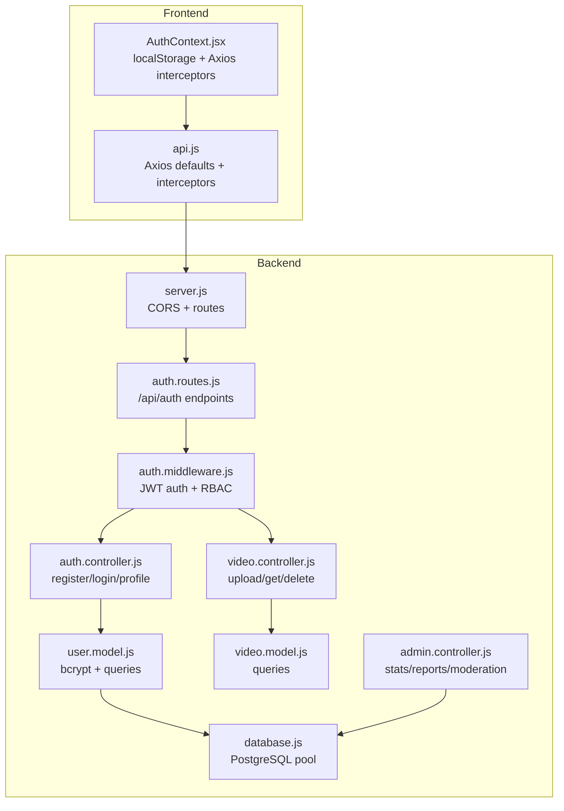
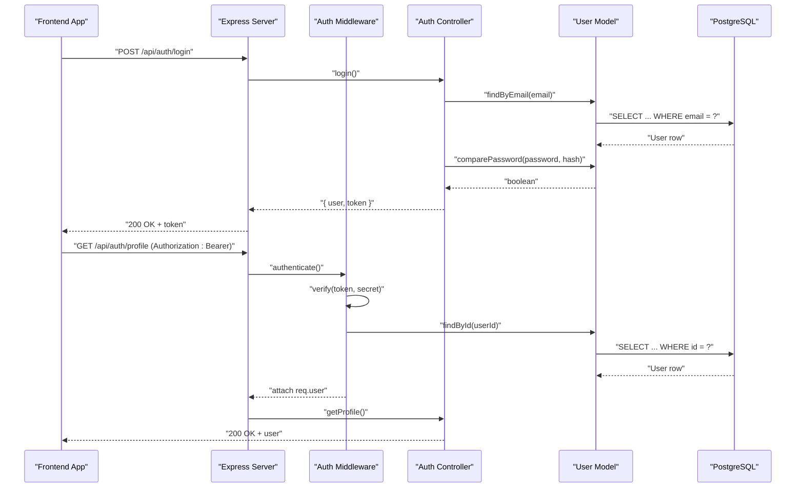
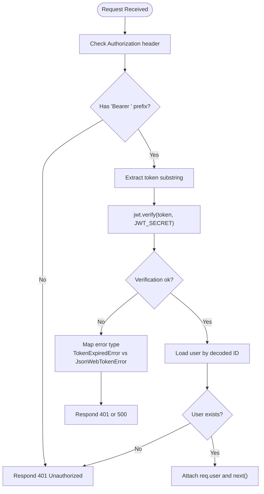
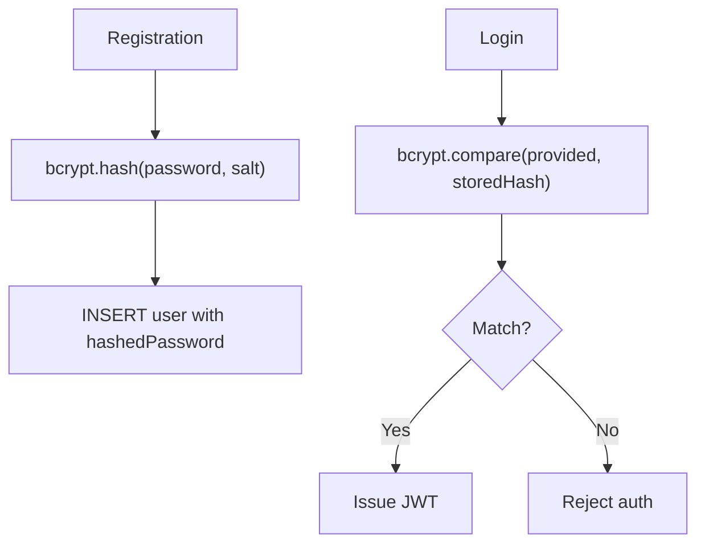
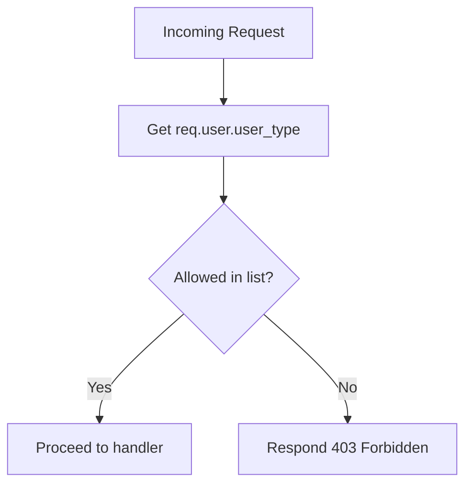
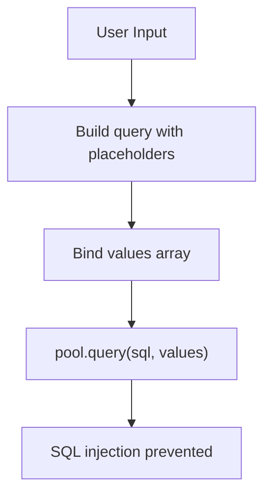
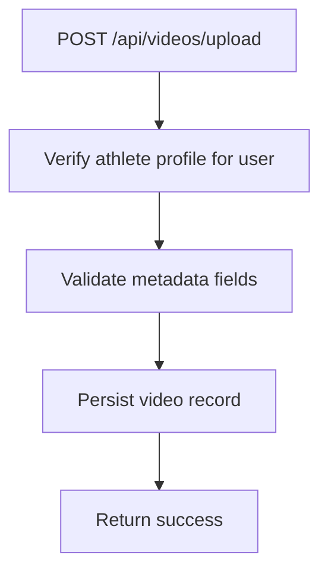
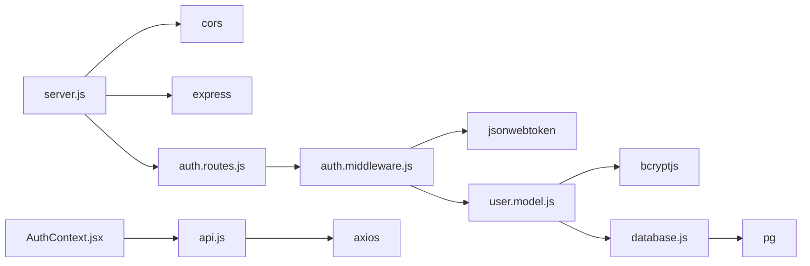

# Security Considerations

<cite>
**Referenced Files in This Document**
- [server.js](file://backend/server.js)
- [auth.middleware.js](file://backend/middleware/auth.middleware.js)
- [auth.controller.js](file://backend/controllers/auth.controller.js)
- [user.model.js](file://backend/models/user.model.js)
- [database.js](file://backend/config/database.js)
- [auth.routes.js](file://backend/routes/auth.routes.js)
- [video.controller.js](file://backend/controllers/video.controller.js)
- [video.model.js](file://backend/models/video.model.js)
- [admin.controller.js](file://backend/controllers/admin.controller.js)
- [AuthContext.jsx](file://frontend/src/context/AuthContext.jsx)
- [api.js](file://frontend/src/services/api.js)
- [schema.sql](file://database/schema.sql)
- [backend/package.json](file://backend/package.json)
- [frontend/package.json](file://frontend/package.json)
</cite>

## Table of Contents
1. [Introduction](#introduction)
2. [Project Structure](#project-structure)
3. [Core Components](#core-components)
4. [Architecture Overview](#architecture-overview)
5. [Detailed Component Analysis](#detailed-component-analysis)
6. [Dependency Analysis](#dependency-analysis)
7. [Performance Considerations](#performance-considerations)
8. [Troubleshooting Guide](#troubleshooting-guide)
9. [Conclusion](#conclusion)
10. [Appendices](#appendices)

## Introduction
This document provides comprehensive security documentation for Craque-Vision. It focuses on authentication and session management using JWT, password hashing with bcrypt, role-based access control, input validation, SQL injection prevention, file upload security for video processing, CORS configuration, CSRF protection, environment variable management, token rotation, secure communication, common vulnerability mitigations, security audit procedures, incident response protocols, and secure development/testing practices.

## Project Structure
The application follows a layered backend (Node.js/Express) and a React frontend. Security-relevant areas include:
- Backend server initialization and middleware stack
- Authentication controller and middleware
- User model with bcrypt-based password hashing
- Database configuration and schema
- Video controller and model for upload and retrieval
- Admin controller for privileged operations
- Frontend authentication context and HTTP client with bearer token propagation

**Diagram sources**
- [server.js:1-40](file://backend/server.js#L1-L40)
- [auth.routes.js:1-11](file://backend/routes/auth.routes.js#L1-L11)
- [auth.middleware.js:1-59](file://backend/middleware/auth.middleware.js#L1-L59)
- [auth.controller.js:1-72](file://backend/controllers/auth.controller.js#L1-L72)
- [user.model.js:1-42](file://backend/models/user.model.js#L1-L42)
- [database.js:1-13](file://backend/config/database.js#L1-L13)
- [video.controller.js:1-111](file://backend/controllers/video.controller.js#L1-L111)
- [video.model.js:1-61](file://backend/models/video.model.js#L1-L61)
- [admin.controller.js:1-121](file://backend/controllers/admin.controller.js#L1-L121)
- [AuthContext.jsx:1-91](file://frontend/src/context/AuthContext.jsx#L1-L91)
- [api.js:1-36](file://frontend/src/services/api.js#L1-L36)

**Section sources**
- [server.js:1-40](file://backend/server.js#L1-L40)
- [auth.routes.js:1-11](file://backend/routes/auth.routes.js#L1-L11)
- [auth.middleware.js:1-59](file://backend/middleware/auth.middleware.js#L1-L59)
- [auth.controller.js:1-72](file://backend/controllers/auth.controller.js#L1-L72)
- [user.model.js:1-42](file://backend/models/user.model.js#L1-L42)
- [database.js:1-13](file://backend/config/database.js#L1-L13)
- [video.controller.js:1-111](file://backend/controllers/video.controller.js#L1-L111)
- [video.model.js:1-61](file://backend/models/video.model.js#L1-L61)
- [admin.controller.js:1-121](file://backend/controllers/admin.controller.js#L1-L121)
- [AuthContext.jsx:1-91](file://frontend/src/context/AuthContext.jsx#L1-L91)
- [api.js:1-36](file://frontend/src/services/api.js#L1-L36)

## Core Components
- JWT-based authentication: Implemented via a dedicated middleware that validates Authorization headers and decodes tokens, attaching user context to requests.
- Password hashing: bcrypt is used during user creation and password comparison in the user model.
- Role-based access control: Middleware supports authorization checks against user types.
- Database access: PostgreSQL connection pool configured via environment variables; queries use parameterized statements.
- Frontend token management: Axios interceptors automatically attach Authorization headers; local storage persists tokens and user data.
- Admin operations: Controllers expose administrative endpoints for statistics, moderation, and user management.

**Section sources**
- [auth.middleware.js:1-59](file://backend/middleware/auth.middleware.js#L1-L59)
- [auth.controller.js:1-72](file://backend/controllers/auth.controller.js#L1-L72)
- [user.model.js:1-42](file://backend/models/user.model.js#L1-L42)
- [database.js:1-13](file://backend/config/database.js#L1-L13)
- [AuthContext.jsx:1-91](file://frontend/src/context/AuthContext.jsx#L1-L91)
- [api.js:1-36](file://frontend/src/services/api.js#L1-L36)
- [admin.controller.js:1-121](file://backend/controllers/admin.controller.js#L1-L121)

## Architecture Overview
The system enforces authentication and authorization at the API boundary, delegates password handling to the user model, and ensures database operations are parameterized. The frontend propagates tokens transparently via interceptors.

**Diagram sources**
- [auth.routes.js:1-11](file://backend/routes/auth.routes.js#L1-L11)
- [auth.middleware.js:1-59](file://backend/middleware/auth.middleware.js#L1-L59)
- [auth.controller.js:1-72](file://backend/controllers/auth.controller.js#L1-L72)
- [user.model.js:1-42](file://backend/models/user.model.js#L1-L42)
- [database.js:1-13](file://backend/config/database.js#L1-L13)

## Detailed Component Analysis

### JWT-Based Authentication and Session Management
- Token issuance: The authentication controller signs a JWT containing the user identifier with an expiration policy.
- Token verification: The middleware extracts the Bearer token from the Authorization header, verifies it against the configured secret, attaches user context, and proceeds to the route handler.
- Optional authentication: An optional-auth variant allows unauthenticated requests when a token is absent or invalid, enabling public endpoints.
- Frontend token propagation: The Axios interceptor reads the token from local storage and sets the Authorization header for every request. On 401 responses, the interceptor clears stored credentials and redirects to the login page.

**Diagram sources**
- [auth.middleware.js:1-59](file://backend/middleware/auth.middleware.js#L1-L59)
- [auth.controller.js:1-72](file://backend/controllers/auth.controller.js#L1-L72)

**Section sources**
- [auth.controller.js:1-72](file://backend/controllers/auth.controller.js#L1-L72)
- [auth.middleware.js:1-59](file://backend/middleware/auth.middleware.js#L1-L59)
- [AuthContext.jsx:1-91](file://frontend/src/context/AuthContext.jsx#L1-L91)
- [api.js:1-36](file://frontend/src/services/api.js#L1-L36)

### Password Hashing with bcrypt
- During registration, passwords are hashed using bcrypt with a work factor suitable for the deployment environment.
- Login compares the provided password against the stored hash using bcrypt’s constant-time comparison.
- The user model encapsulates hashing and comparison, ensuring consistent handling across the application.

**Diagram sources**
- [user.model.js:1-42](file://backend/models/user.model.js#L1-L42)

**Section sources**
- [user.model.js:1-42](file://backend/models/user.model.js#L1-L42)

### Role-Based Access Control (RBAC)
- The authorization middleware accepts a list of allowed user types and denies access if the authenticated user’s type is not included.
- Routes can apply the authorization middleware to enforce role-specific access (e.g., admin-only endpoints).
- The database schema defines a user_type column with constrained values to support RBAC enforcement.

**Diagram sources**
- [auth.middleware.js:35-42](file://backend/middleware/auth.middleware.js#L35-L42)
- [schema.sql:14-24](file://database/schema.sql#L14-L24)

**Section sources**
- [auth.middleware.js:35-42](file://backend/middleware/auth.middleware.js#L35-L42)
- [schema.sql:14-24](file://database/schema.sql#L14-L24)

### Input Validation Mechanisms
- Parameterized queries: All database interactions use parameterized queries to prevent SQL injection.
- Route-level extraction: Controllers extract and pass parameters safely to models, which encapsulate query construction.
- Frontend form handling: The frontend components manage user input prior to submission; ensure additional client-side sanitization and validation as needed.

Recommendations:
- Enforce strict input validation at the API boundary (e.g., body-parser limits, schema validation).
- Sanitize and normalize inputs before persistence.
- Apply rate limiting and request size limits to mitigate abuse.

**Section sources**
- [user.model.js:1-42](file://backend/models/user.model.js#L1-L42)
- [video.model.js:1-61](file://backend/models/video.model.js#L1-L61)
- [admin.controller.js:1-121](file://backend/controllers/admin.controller.js#L1-L121)

### SQL Injection Prevention
- The backend consistently uses parameterized queries via the PostgreSQL pool, preventing dynamic SQL concatenation.
- Queries are constructed with placeholders and arrays of values, ensuring user input is treated as data, not executable code.

**Diagram sources**
- [user.model.js:1-42](file://backend/models/user.model.js#L1-L42)
- [video.model.js:1-61](file://backend/models/video.model.js#L1-L61)
- [admin.controller.js:1-121](file://backend/controllers/admin.controller.js#L1-L121)

**Section sources**
- [user.model.js:1-42](file://backend/models/user.model.js#L1-L42)
- [video.model.js:1-61](file://backend/models/video.model.js#L1-L61)
- [admin.controller.js:1-121](file://backend/controllers/admin.controller.js#L1-L121)

### File Upload Security for Video Processing
- Upload endpoint: The video controller receives metadata and stores it after verifying the associated athlete profile.
- Current state: The implementation does not show explicit file upload handling (e.g., multer configuration) or Cloudinary integration in the controller. Ensure uploads are validated, sanitized, and stored securely.
- Recommendations:
  - Validate file types and sizes.
  - Scan uploaded files for malware.
  - Store files outside the web root or behind restricted access.
  - Use signed URLs with short TTLs for temporary access.
  - Enforce ownership checks before allowing deletion or modification.

**Diagram sources**
- [video.controller.js:5-32](file://backend/controllers/video.controller.js#L5-L32)

**Section sources**
- [video.controller.js:1-111](file://backend/controllers/video.controller.js#L1-L111)
- [video.model.js:1-61](file://backend/models/video.model.js#L1-L61)

### CORS Configuration
- The backend enables CORS globally without restricting origins, methods, or headers. This can expose the API to cross-origin attacks.
- Recommendations:
  - Configure CORS to allowlist specific origins.
  - Limit exposed methods and headers.
  - Set credentials policies appropriately.
  - Consider adding preflight caching and security headers.

**Section sources**
- [server.js:17](file://backend/server.js#L17)
- [backend/package.json:13](file://backend/package.json#L13)

### CSRF Protection
- No CSRF protection mechanism is implemented in the backend or frontend.
- Recommendations:
  - Implement SameSite cookies for stateful sessions.
  - Add CSRF tokens for state-changing forms and AJAX endpoints.
  - Validate referer/header origin for state-changing requests.
  - Use double-submit cookie pattern if necessary.

[No sources needed since this section provides general guidance]

### Environment Variable Management
- Database credentials and JWT secret are loaded from environment variables.
- Recommendations:
  - Store secrets in a secure vault or environment manager.
  - Restrict access to environment files and CI/CD secrets.
  - Use separate environments (dev/staging/prod) with distinct secrets.
  - Rotate secrets periodically and invalidate compromised tokens.

**Section sources**
- [database.js:1-13](file://backend/config/database.js#L1-L13)
- [auth.controller.js:4-6](file://backend/controllers/auth.controller.js#L4-L6)
- [auth.middleware.js:14](file://backend/middleware/auth.middleware.js#L14)

### Token Rotation and Secure Communication
- Token rotation: The current implementation issues long-lived tokens. Consider implementing refresh tokens and short-lived access tokens.
- Secure transport: Enforce HTTPS in production and set secure flags on cookies if using session-based auth.
- Recommendations:
  - Shorten access token expiry and introduce refresh tokens.
  - Maintain a revocation list (e.g., Redis) for issued tokens.
  - Use HSTS and secure, same-site cookies for session-based flows.

**Section sources**
- [auth.controller.js:4-6](file://backend/controllers/auth.controller.js#L4-L6)
- [auth.middleware.js:14](file://backend/middleware/auth.middleware.js#L14)

### Common Vulnerabilities and Mitigations
- Broken Authentication
  - Mitigation: Use strong JWT secrets, enforce token verification, and handle errors gracefully.
- Sensitive Data Exposure
  - Mitigation: Encrypt at rest, avoid logging secrets, and transmit over TLS.
- SQL Injection
  - Mitigation: Use parameterized queries (already implemented).
- Cross-Site Scripting (XSS)
  - Mitigation: Sanitize and escape output, use Content-Security-Policy headers.
- Cross-Origin Resource Sharing (CORS)
  - Mitigation: Configure allowlist origins and methods.
- CSRF
  - Mitigation: Implement CSRF tokens and validate origins.
- Insecure Direct Object References (IDOR)
  - Mitigation: Enforce ownership checks before operations (e.g., video deletion).

**Section sources**
- [auth.middleware.js:1-59](file://backend/middleware/auth.middleware.js#L1-L59)
- [video.controller.js:90-110](file://backend/controllers/video.controller.js#L90-L110)
- [server.js:17](file://backend/server.js#L17)

### Security Audit Procedures
- Static Analysis
  - Review JWT secret management, CORS configuration, and input handling.
- Dynamic Analysis
  - Run automated API tests with tools like OWASP ZAP or Postman.
- Secrets Audit
  - Verify environment variables are not committed and rotated regularly.
- Dependency Review
  - Audit npm packages for known vulnerabilities.

[No sources needed since this section provides general guidance]

### Incident Response Protocols
- Detection
  - Monitor logs for repeated 401/403, unusual request patterns, and failed auth attempts.
- Containment
  - Rotate secrets, revoke compromised tokens, and temporarily restrict endpoints.
- Eradication
  - Patch vulnerabilities, update dependencies, and harden configurations.
- Recovery
  - Restore from backups, re-enable services gradually, and validate access controls.
- Post-Incident
  - Conduct a root cause analysis and update security procedures.

[No sources needed since this section provides general guidance]

### Secure Development Practices and Testing Approaches
- Secure Coding
  - Enforce input validation, avoid hardcoded secrets, and sanitize outputs.
- Dependency Hygiene
  - Keep dependencies updated and monitor advisories.
- Testing
  - Unit tests for hashing and token verification.
  - Integration tests for protected routes and RBAC.
  - Penetration testing with controlled scope.

[No sources needed since this section provides general guidance]

## Dependency Analysis
External dependencies relevant to security:
- bcryptjs: Used for password hashing.
- jsonwebtoken: Used for JWT signing and verification.
- dotenv: Loads environment variables.
- cors: Enables cross-origin requests.
- pg: PostgreSQL client for parameterized queries.
- multer/cloudinary: Potential dependencies for file uploads.

**Diagram sources**
- [server.js:1-40](file://backend/server.js#L1-L40)
- [auth.routes.js:1-11](file://backend/routes/auth.routes.js#L1-L11)
- [auth.middleware.js:1-59](file://backend/middleware/auth.middleware.js#L1-L59)
- [user.model.js:1-42](file://backend/models/user.model.js#L1-L42)
- [database.js:1-13](file://backend/config/database.js#L1-L13)
- [AuthContext.jsx:1-91](file://frontend/src/context/AuthContext.jsx#L1-L91)
- [api.js:1-36](file://frontend/src/services/api.js#L1-L36)
- [backend/package.json:10-20](file://backend/package.json#L10-L20)
- [frontend/package.json:6-12](file://frontend/package.json#L6-L12)

**Section sources**
- [backend/package.json:10-20](file://backend/package.json#L10-L20)
- [frontend/package.json:6-12](file://frontend/package.json#L6-L12)

## Performance Considerations
- JWT overhead: Frequent token verification adds CPU cost; consider caching verified tokens per user with TTL.
- Database queries: Ensure indexes are leveraged for frequent joins (users, athletes, videos).
- File storage: Offload media to cloud storage with CDN and signed URLs to reduce server load.

[No sources needed since this section provides general guidance]

## Troubleshooting Guide
- 401 Unauthorized on protected routes
  - Verify Authorization header format and token validity.
  - Confirm JWT secret matches backend configuration.
- 403 Forbidden on admin endpoints
  - Ensure the user’s type is authorized for the route.
- CORS errors in browser
  - Align frontend origin with backend CORS allowlist.
- 500 errors on login/register
  - Check database connectivity and environment variables.

**Section sources**
- [auth.middleware.js:1-59](file://backend/middleware/auth.middleware.js#L1-L59)
- [auth.controller.js:1-72](file://backend/controllers/auth.controller.js#L1-L72)
- [server.js:17](file://backend/server.js#L17)
- [database.js:1-13](file://backend/config/database.js#L1-L13)

## Conclusion
Craque-Vision implements essential security foundations: JWT-based authentication, bcrypt password hashing, parameterized database queries, and RBAC. To strengthen the platform, address CORS configuration, implement CSRF protection, adopt token rotation, harden environment management, and establish robust audit and incident response procedures. These enhancements will significantly improve resilience against common threats while maintaining a secure and scalable architecture.

## Appendices
- Database schema highlights
  - Users table includes user_type with constrained values supporting RBAC.
  - Videos table includes status and rejection_reason for moderation workflows.

**Section sources**
- [schema.sql:14-24](file://database/schema.sql#L14-L24)
- [schema.sql:69-88](file://database/schema.sql#L69-L88)