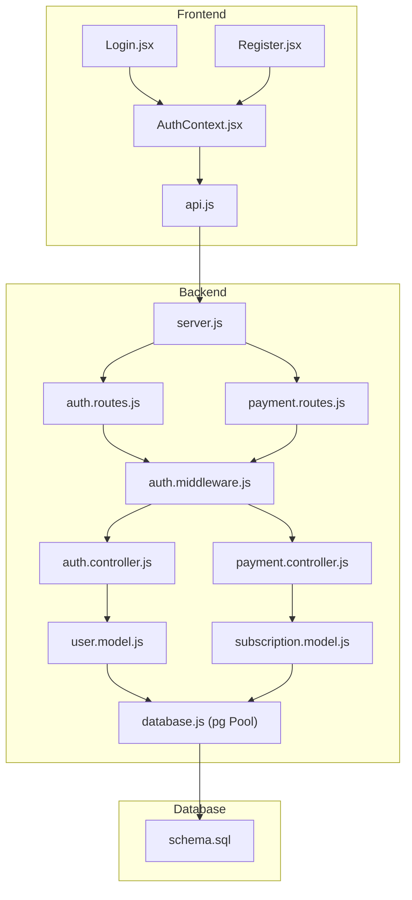
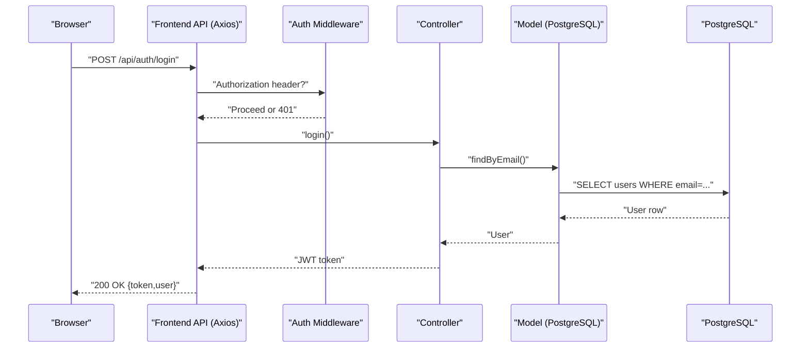
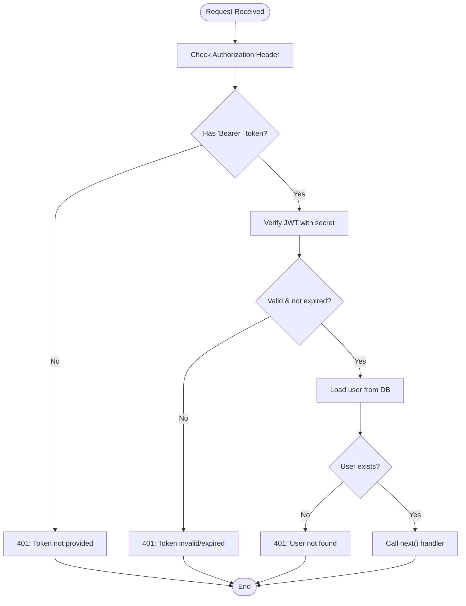
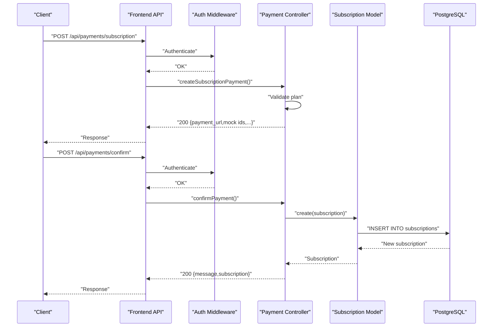
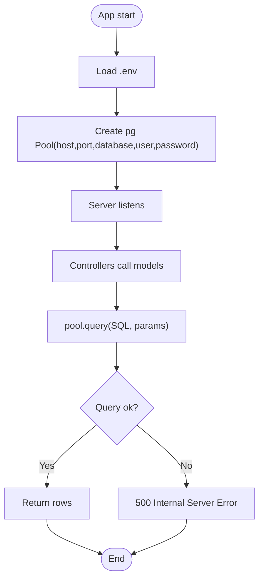
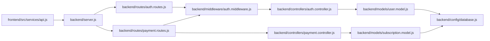

# Troubleshooting and FAQ

<cite>
**Referenced Files in This Document**
- [server.js](file://backend/server.js)
- [database.js](file://backend/config/database.js)
- [auth.controller.js](file://backend/controllers/auth.controller.js)
- [payment.controller.js](file://backend/controllers/payment.controller.js)
- [auth.middleware.js](file://backend/middleware/auth.middleware.js)
- [auth.routes.js](file://backend/routes/auth.routes.js)
- [payment.routes.js](file://backend/routes/payment.routes.js)
- [user.model.js](file://backend/models/user.model.js)
- [subscription.model.js](file://backend/models/subscription.model.js)
- [api.js](file://frontend/src/services/api.js)
- [AuthContext.jsx](file://frontend/src/context/AuthContext.jsx)
- [Login.jsx](file://frontend/src/pages/Login.jsx)
- [Register.jsx](file://frontend/src/pages/Register.jsx)
- [schema.sql](file://database/schema.sql)
- [package.json](file://frontend/package.json)
</cite>

## Table of Contents
1. [Introduction](#introduction)
2. [Project Structure](#project-structure)
3. [Core Components](#core-components)
4. [Architecture Overview](#architecture-overview)
5. [Detailed Component Analysis](#detailed-component-analysis)
6. [Dependency Analysis](#dependency-analysis)
7. [Performance Considerations](#performance-considerations)
8. [Troubleshooting Guide](#troubleshooting-guide)
9. [FAQ](#faq)
10. [Conclusion](#conclusion)

## Introduction
This document provides a comprehensive troubleshooting guide and FAQ for Craque-Vision. It focuses on diagnosing and resolving common issues across the backend API, frontend, and database, including database connectivity, authentication, file-related workflows, and payment processing. It also covers systematic debugging approaches, log analysis, error interpretation, performance tuning, and escalation procedures.

## Project Structure
Craque-Vision is a full-stack application composed of:
- Backend API built with Express.js, exposing REST endpoints under /api.
- PostgreSQL database with a defined schema supporting users, athletes, videos, subscriptions, and payments.
- Frontend built with React and Vite, communicating with the backend via Axios.

**Diagram sources**
- [server.js:1-40](file://backend/server.js#L1-L40)
- [auth.routes.js:1-11](file://backend/routes/auth.routes.js#L1-L11)
- [payment.routes.js:1-13](file://backend/routes/payment.routes.js#L1-L13)
- [auth.middleware.js:1-59](file://backend/middleware/auth.middleware.js#L1-L59)
- [auth.controller.js:1-72](file://backend/controllers/auth.controller.js#L1-L72)
- [payment.controller.js:1-108](file://backend/controllers/payment.controller.js#L1-L108)
- [user.model.js:1-42](file://backend/models/user.model.js#L1-L42)
- [subscription.model.js:1-55](file://backend/models/subscription.model.js#L1-L55)
- [database.js:1-13](file://backend/config/database.js#L1-L13)
- [schema.sql:1-185](file://database/schema.sql#L1-L185)
- [api.js:1-36](file://frontend/src/services/api.js#L1-L36)
- [AuthContext.jsx:1-91](file://frontend/src/context/AuthContext.jsx#L1-L91)
- [Login.jsx:1-134](file://frontend/src/pages/Login.jsx#L1-L134)
- [Register.jsx:1-287](file://frontend/src/pages/Register.jsx#L1-L287)

**Section sources**
- [server.js:1-40](file://backend/server.js#L1-L40)
- [schema.sql:1-185](file://database/schema.sql#L1-L185)

## Core Components
- Backend server initialization and routing: [server.js:1-40](file://backend/server.js#L1-L40)
- Database connection pool: [database.js:1-13](file://backend/config/database.js#L1-L13)
- Authentication controller: [auth.controller.js:1-72](file://backend/controllers/auth.controller.js#L1-L72)
- Payment controller: [payment.controller.js:1-108](file://backend/controllers/payment.controller.js#L1-L108)
- Authentication middleware: [auth.middleware.js:1-59](file://backend/middleware/auth.middleware.js#L1-L59)
- Frontend API client and auth context: [api.js:1-36](file://frontend/src/services/api.js#L1-L36), [AuthContext.jsx:1-91](file://frontend/src/context/AuthContext.jsx#L1-L91)
- Database schema: [schema.sql:1-185](file://database/schema.sql#L1-L185)

**Section sources**
- [server.js:1-40](file://backend/server.js#L1-L40)
- [database.js:1-13](file://backend/config/database.js#L1-L13)
- [auth.controller.js:1-72](file://backend/controllers/auth.controller.js#L1-L72)
- [payment.controller.js:1-108](file://backend/controllers/payment.controller.js#L1-L108)
- [auth.middleware.js:1-59](file://backend/middleware/auth.middleware.js#L1-L59)
- [api.js:1-36](file://frontend/src/services/api.js#L1-L36)
- [AuthContext.jsx:1-91](file://frontend/src/context/AuthContext.jsx#L1-L91)
- [schema.sql:1-185](file://database/schema.sql#L1-L185)

## Architecture Overview
The system follows a standard client-server pattern:
- Frontend sends requests to backend endpoints via Axios.
- Backend routes delegate to controllers after optional or mandatory authentication checks.
- Controllers interact with models backed by PostgreSQL.
- Middleware enforces authentication and authorization.

**Diagram sources**
- [api.js:1-36](file://frontend/src/services/api.js#L1-L36)
- [auth.middleware.js:1-59](file://backend/middleware/auth.middleware.js#L1-L59)
- [auth.controller.js:1-72](file://backend/controllers/auth.controller.js#L1-L72)
- [user.model.js:1-42](file://backend/models/user.model.js#L1-L42)
- [database.js:1-13](file://backend/config/database.js#L1-L13)

## Detailed Component Analysis

### Authentication Flow
Common issues:
- Token missing or malformed leads to 401.
- Expired token returns a specific error.
- Invalid token triggers a 401.
- User not found despite valid token.

**Diagram sources**
- [auth.middleware.js:1-59](file://backend/middleware/auth.middleware.js#L1-L59)

**Section sources**
- [auth.middleware.js:1-59](file://backend/middleware/auth.middleware.js#L1-L59)
- [auth.controller.js:1-72](file://backend/controllers/auth.controller.js#L1-L72)
- [user.model.js:1-42](file://backend/models/user.model.js#L1-L42)
- [api.js:1-36](file://frontend/src/services/api.js#L1-L36)
- [AuthContext.jsx:1-91](file://frontend/src/context/AuthContext.jsx#L1-L91)
- [Login.jsx:1-134](file://frontend/src/pages/Login.jsx#L1-L134)
- [Register.jsx:1-287](file://frontend/src/pages/Register.jsx#L1-L287)

### Payment Processing Flow
Key endpoints:
- GET /api/payments/video-packages
- GET /api/payments/subscription-plans
- POST /api/payments/video (authenticated)
- POST /api/payments/subscription (authenticated)
- POST /api/payments/confirm (authenticated)

Common issues:
- Invalid package or plan type returns 400.
- Missing or invalid token blocks endpoints.
- Confirmation endpoint persists subscription when type is subscription.

**Diagram sources**
- [payment.routes.js:1-13](file://backend/routes/payment.routes.js#L1-L13)
- [auth.middleware.js:1-59](file://backend/middleware/auth.middleware.js#L1-L59)
- [payment.controller.js:1-108](file://backend/controllers/payment.controller.js#L1-L108)
- [subscription.model.js:1-55](file://backend/models/subscription.model.js#L1-L55)
- [database.js:1-13](file://backend/config/database.js#L1-L13)

**Section sources**
- [payment.controller.js:1-108](file://backend/controllers/payment.controller.js#L1-L108)
- [subscription.model.js:1-55](file://backend/models/subscription.model.js#L1-L55)
- [payment.routes.js:1-13](file://backend/routes/payment.routes.js#L1-L13)

### Database Connectivity
- Connection configured via environment variables and a PostgreSQL pool.
- Errors during queries surface as generic 500s unless handled specifically.

**Diagram sources**
- [database.js:1-13](file://backend/config/database.js#L1-L13)
- [user.model.js:1-42](file://backend/models/user.model.js#L1-L42)
- [subscription.model.js:1-55](file://backend/models/subscription.model.js#L1-L55)

**Section sources**
- [database.js:1-13](file://backend/config/database.js#L1-L13)
- [schema.sql:1-185](file://database/schema.sql#L1-L185)

## Dependency Analysis
- Frontend depends on Axios for HTTP requests and local storage for tokens.
- Backend routes depend on controllers; controllers depend on models; models depend on the database pool.
- Authentication middleware is applied to protected routes.

**Diagram sources**
- [api.js:1-36](file://frontend/src/services/api.js#L1-L36)
- [server.js:1-40](file://backend/server.js#L1-L40)
- [auth.routes.js:1-11](file://backend/routes/auth.routes.js#L1-L11)
- [payment.routes.js:1-13](file://backend/routes/payment.routes.js#L1-L13)
- [auth.middleware.js:1-59](file://backend/middleware/auth.middleware.js#L1-L59)
- [auth.controller.js:1-72](file://backend/controllers/auth.controller.js#L1-L72)
- [payment.controller.js:1-108](file://backend/controllers/payment.controller.js#L1-L108)
- [user.model.js:1-42](file://backend/models/user.model.js#L1-L42)
- [subscription.model.js:1-55](file://backend/models/subscription.model.js#L1-L55)
- [database.js:1-13](file://backend/config/database.js#L1-L13)

**Section sources**
- [api.js:1-36](file://frontend/src/services/api.js#L1-L36)
- [server.js:1-40](file://backend/server.js#L1-L40)
- [auth.routes.js:1-11](file://backend/routes/auth.routes.js#L1-L11)
- [payment.routes.js:1-13](file://backend/routes/payment.routes.js#L1-L13)
- [auth.middleware.js:1-59](file://backend/middleware/auth.middleware.js#L1-L59)
- [auth.controller.js:1-72](file://backend/controllers/auth.controller.js#L1-L72)
- [payment.controller.js:1-108](file://backend/controllers/payment.controller.js#L1-L108)
- [user.model.js:1-42](file://backend/models/user.model.js#L1-L42)
- [subscription.model.js:1-55](file://backend/models/subscription.model.js#L1-L55)
- [database.js:1-13](file://backend/config/database.js#L1-L13)

## Performance Considerations
- Database indexes are defined in the schema to optimize lookups on users, athletes, videos, subscriptions, favorites, and likes.
- Consider adding connection pooling limits and timeouts in production deployments.
- Monitor query durations and slow queries using database logs.
- Frontend bundle size and lazy loading can impact perceived performance; ensure optimal build configurations.

[No sources needed since this section provides general guidance]

## Troubleshooting Guide

### Database Connection Problems
Symptoms:
- Backend throws 500 errors on user creation or login.
- Application fails to start with connection errors.

Diagnostic steps:
- Verify environment variables for database credentials are present and correct.
- Test connectivity externally using a PostgreSQL client.
- Check database logs for connection refused or authentication failures.
- Confirm the database service is reachable from the backend host.

Resolution tips:
- Ensure DB_HOST, DB_PORT, DB_NAME, DB_USER, DB_PASSWORD are set.
- Validate network ACLs/firewalls and Docker networking if applicable.
- Confirm the database is initialized with the schema.

**Section sources**
- [database.js:1-13](file://backend/config/database.js#L1-L13)
- [schema.sql:1-185](file://database/schema.sql#L1-L185)

### Authentication Errors
Symptoms:
- 401 Token not provided.
- 401 Token invalid or expired.
- 401 User not found after successful token verification.
- Login/Register returns generic 500 errors.

Diagnostic steps:
- Confirm Authorization header format: Bearer <token>.
- Verify JWT_SECRET is set consistently in backend.
- Inspect frontend local storage for token presence and validity.
- Check response interceptor behavior on 401.

Resolution tips:
- Re-authenticate to refresh token.
- Clear browser local storage and re-login if stale session remains.
- Ensure user still exists in DB after token verification.

**Section sources**
- [auth.middleware.js:1-59](file://backend/middleware/auth.middleware.js#L1-L59)
- [auth.controller.js:1-72](file://backend/controllers/auth.controller.js#L1-L72)
- [api.js:1-36](file://frontend/src/services/api.js#L1-L36)
- [AuthContext.jsx:1-91](file://frontend/src/context/AuthContext.jsx#L1-L91)
- [Login.jsx:1-134](file://frontend/src/pages/Login.jsx#L1-L134)
- [Register.jsx:1-287](file://frontend/src/pages/Register.jsx#L1-L287)

### File Upload Failures
Observation:
- No explicit file upload endpoints are defined in the backend routes or controllers.
- Payment controller returns mock payment URLs instead of real integrations.

Diagnostic steps:
- Confirm whether uploads are handled by a separate microservice or external provider.
- Review payment routes and controllers for upload-related endpoints.
- Check frontend pages related to uploads for API calls.

Resolution tips:
- Implement dedicated upload endpoints or integrate with cloud storage APIs.
- Add multer or similar middleware for multipart/form-data handling.
- Ensure CORS allows upload domains and appropriate headers.

**Section sources**
- [payment.routes.js:1-13](file://backend/routes/payment.routes.js#L1-L13)
- [payment.controller.js:1-108](file://backend/controllers/payment.controller.js#L1-L108)
- [server.js:1-40](file://backend/server.js#L1-L40)

### Payment Processing Issues
Symptoms:
- 400 Invalid package or plan.
- 401 Unauthorized for payment endpoints.
- Confirmation does not persist subscription.

Diagnostic steps:
- Validate package_type and plan_name against supported values.
- Confirm authentication header is present for payment endpoints.
- Inspect subscription model insert logic and database constraints.

Resolution tips:
- Use supported keys only (e.g., video packages and subscription plans as defined).
- Ensure frontend sets Authorization header for payment routes.
- For production, replace mock payment URLs with real gateway integrations.

**Section sources**
- [payment.controller.js:1-108](file://backend/controllers/payment.controller.js#L1-L108)
- [subscription.model.js:1-55](file://backend/models/subscription.model.js#L1-L55)
- [payment.routes.js:1-13](file://backend/routes/payment.routes.js#L1-L13)
- [auth.middleware.js:1-59](file://backend/middleware/auth.middleware.js#L1-L59)

### Backend API Debugging Approaches
Systematic steps:
- Enable logging in Express and capture request/response details.
- Use curl or Postman to test endpoints independently of the frontend.
- Temporarily bypass middleware to isolate route/controller issues.
- Validate environment variables and secrets.

Log analysis techniques:
- Look for 401/403 responses indicating auth failures.
- Search for 400 errors for invalid inputs.
- Identify 500 errors for unhandled exceptions.

**Section sources**
- [server.js:1-40](file://backend/server.js#L1-L40)
- [auth.middleware.js:1-59](file://backend/middleware/auth.middleware.js#L1-L59)
- [auth.controller.js:1-72](file://backend/controllers/auth.controller.js#L1-L72)
- [payment.controller.js:1-108](file://backend/controllers/payment.controller.js#L1-L108)

### Frontend Rendering Problems
Symptoms:
- Login/Register forms submit but nothing happens.
- Navigation redirects to login after 401.
- Token not persisted in local storage.

Diagnostic steps:
- Open browser dev tools and check Network tab for failed requests.
- Verify VITE_API_URL points to the correct backend origin.
- Inspect localStorage for token and user data.

Resolution tips:
- Ensure VITE_API_URL matches backend origin and protocol.
- Clear localStorage and retry login.
- Confirm interceptors set Authorization header and handle 401 redirection.

**Section sources**
- [api.js:1-36](file://frontend/src/services/api.js#L1-L36)
- [AuthContext.jsx:1-91](file://frontend/src/context/AuthContext.jsx#L1-L91)
- [Login.jsx:1-134](file://frontend/src/pages/Login.jsx#L1-L134)
- [Register.jsx:1-287](file://frontend/src/pages/Register.jsx#L1-L287)

### Integration Failures
Symptoms:
- CORS errors blocking requests.
- Unexpected 404 for routes.
- Mismatched base URLs causing broken links.

Diagnostic steps:
- Confirm frontend base URL matches backend origin.
- Check backend CORS configuration and allowed origins.
- Validate route prefixes (/api/*) and method correctness.

Resolution tips:
- Set VITE_API_URL to backend address.
- Configure CORS to allow frontend origin.
- Match route paths exactly as defined in backend.

**Section sources**
- [server.js:1-40](file://backend/server.js#L1-L40)
- [api.js:1-36](file://frontend/src/services/api.js#L1-L36)

### Error Message Interpretation Guide
- "Token not provided" (401): Missing or malformed Authorization header.
- "Token invalid" (401): Signature verification failed or wrong secret.
- "Token expired" (401): JWT expired; re-authenticate.
- "User not found" (401): User deleted or ID mismatch after verification.
- "Invalid package" (400): Unsupported package_type.
- "Invalid plan" (400): Unsupported plan_name.
- "Email already registered" (400): Duplicate email detected.
- "Email or password invalid" (401): Credentials incorrect.

**Section sources**
- [auth.middleware.js:1-59](file://backend/middleware/auth.middleware.js#L1-L59)
- [auth.controller.js:1-72](file://backend/controllers/auth.controller.js#L1-L72)
- [payment.controller.js:1-108](file://backend/controllers/payment.controller.js#L1-L108)

### Performance Troubleshooting, Memory Leaks, and Resource Optimization
- Database:
  - Use indexes defined in schema to speed up queries.
  - Monitor long-running queries and add EXPLAIN plans.
- Backend:
  - Limit concurrent connections and tune pool settings.
  - Add request timeouts and circuit breakers.
- Frontend:
  - Analyze bundle size and enable code splitting/lazy loading.
  - Minimize unnecessary re-renders and avoid memory leaks in components.

[No sources needed since this section provides general guidance]

## FAQ

Q1: How do I configure the database connection?
- Set DB_HOST, DB_PORT, DB_NAME, DB_USER, DB_PASSWORD in environment variables. The backend reads these automatically.

Q2: Why am I getting “Token not provided”?
- Ensure your request includes an Authorization header with the format Bearer <token>. The frontend sets this automatically if logged in.

Q3: How do I fix “Email or password invalid”?
- Verify credentials and ensure the user exists. Check for typos and confirm the account is active.

Q4: Why does my payment request fail with “Invalid package”?
- Use only supported package types as defined in the payment controller.

Q5: How do I deploy this application?
- Build the frontend and serve static assets from the backend or a CDN.
- Run the backend with environment variables configured.
- Initialize the database with the provided schema.

Q6: How do I reset the default admin password?
- The schema inserts a default admin user with a hashed password. Change it via the admin interface or database migration.

Q7: How do I enable HTTPS and secure cookies?
- Configure reverse proxy termination or backend TLS settings. Update frontend base URL accordingly.

Q8: How do I scale the backend?
- Use a process manager or container orchestration. Scale horizontally behind a load balancer.

Q9: How do I monitor performance?
- Use database query logs, backend request logs, and frontend performance metrics.

Q10: Who do I contact for support?
- For basic issues, review the troubleshooting sections and logs.
- For advanced issues, escalate to the development team with logs, environment details, and reproduction steps.

**Section sources**
- [database.js:1-13](file://backend/config/database.js#L1-L13)
- [auth.middleware.js:1-59](file://backend/middleware/auth.middleware.js#L1-L59)
- [auth.controller.js:1-72](file://backend/controllers/auth.controller.js#L1-L72)
- [payment.controller.js:1-108](file://backend/controllers/payment.controller.js#L1-L108)
- [schema.sql:1-185](file://database/schema.sql#L1-L185)
- [api.js:1-36](file://frontend/src/services/api.js#L1-L36)

## Conclusion
This guide consolidates practical troubleshooting steps, error interpretation, and operational guidance for Craque-Vision. By following the diagnostic flows and applying the recommended resolutions, most issues can be quickly identified and fixed. For persistent or complex problems, collect logs, environment details, and reproduce steps before escalating.